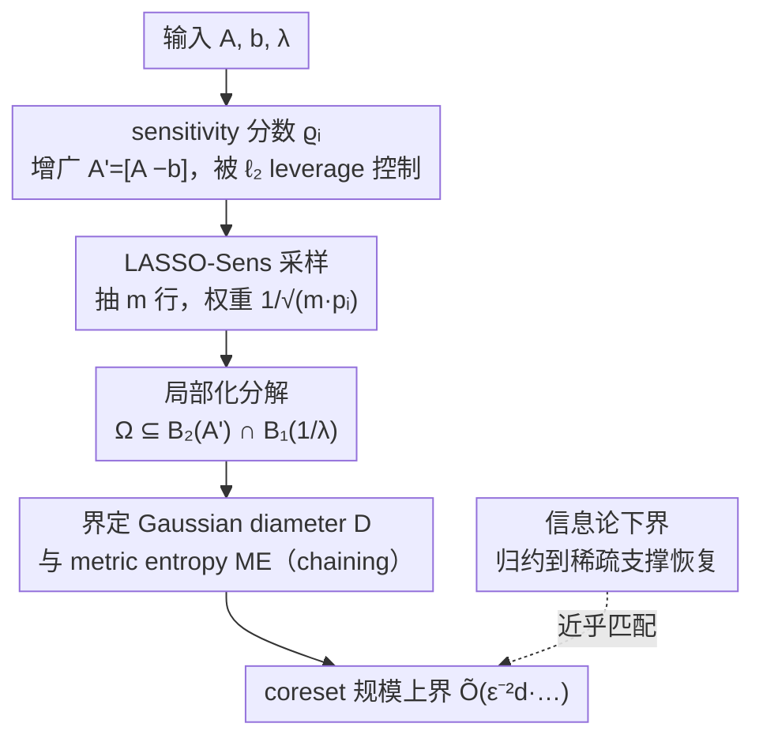

# On Coreset for LASSO Regression Problem with Sensitivity Sampling

**会议**: ICLR 2026  
**OpenReview**: [https://openreview.net/forum?id=aUlHK31TAz](https://openreview.net/forum?id=aUlHK31TAz)  
**代码**: 待确认  
**领域**: 学习理论 / coreset / 稀疏回归  
**关键词**: LASSO、coreset、sensitivity sampling、经验过程、leverage score

## 一句话总结
本文为**标准 LASSO 回归**（目标 $\|Ax-b\|_2^2+\lambda\|x\|_1$）给出了第一个基于 sensitivity sampling 的 coreset 构造方法，通过把 $\ell_1$ 惩罚诱导的复杂函数空间**局部化分解**成残差空间与 $\ell_1$ 罚空间两部分，把原本 $\tilde O(Gd/\epsilon^2)$ 的 coreset 规模收紧到 $\tilde O\!\big(\epsilon^{-2}d(\log^3 d\cdot\min\{1,\log d/\lambda^2\}+\log(1/\delta))\big)$，并给出近乎匹配的下界；实验上比直接求解 LASSO 快 4～18 倍，800 万样本的数据集只需 15 分钟。

## 研究背景与动机

**领域现状**：LASSO 用 $\ell_1$ 正则把稀疏回归松弛成凸问题，是变量选择、压缩感知里最常用的稀疏模型工具。但坐标下降、ISTA/FISTA 这类求解器的运行时间是 $O(nT\cdot\mathrm{poly}(d))$，**和样本行数 $n$ 强相关**，在大规模数据上扩展性差。一个自然的加速思路是 coreset——从 $A,b$ 中抽出一个**加权小子集**，让它在所有 $x$ 上都能 $(1\pm\epsilon)$ 近似原目标，之后只在这个小子集上跑求解器。

**现有痛点**：无正则的 $\ell_p$ 回归已经有成熟的 sensitivity sampling / leverage score coreset 理论；岭回归（ridge，$\ell_2$ 罚）也有 $\tilde O(sd_\lambda(A)/\epsilon^2)$ 的结果。但**标准 LASSO 一直没有 coreset 理论结果**。最接近的工作 Chhaya et al. (2020) 绕开了 $\ell_1$，把惩罚项偷换成 $\lambda\|x\|_1^2=\lambda(\sum_i|x_i|)^2$，从而能套用岭回归技术——可这个二次型会在各坐标间引入交叉项，破坏 $\ell_1$ 本该带来的稀疏性，解出来的非零项往往比真正的 LASSO 多得多。

**核心矛盾**：直接把通用 sensitivity sampling 框架套到 LASSO 上，按 Braverman et al. (2016) 的标准泛化界需要 $\tilde O(Gd/\epsilon^2)$ 的 coreset（$G$ 是总 sensitivity、$d$ 是 VC 维），规模太大。瓶颈在于：LASSO 的函数空间 $\Omega=\{x:h(x)+p(x)\le R\}$ 由残差项 $h(x)=\|Ax-b\|_2^2$ 和 $\ell_1$ 罚项 $p(x)=\lambda\|x\|_1$ **耦合**而成，几何形状极复杂；$\ell_1$ 带来的非光滑边界让 Bernstein 不等式 + $\epsilon$-net 的经典分析只能给出很松的误差界。

**本文目标**：给标准 LASSO 设计一个 sensitivity sampling 的 coreset，规模严格小于 $\tilde O(Gd)$，并配上近乎匹配的下界，证明这个规模本质上是紧的。

**核心 idea**：不要在耦合的复杂空间 $\Omega$ 上硬做经验过程分析，而是**先局部化、再解耦**——把 $\Omega$ 放进残差单位球与 $\ell_1$ 单位球的交集里，分别界定两个低复杂度子空间的 Gaussian diameter 与 metric entropy，从而拿到更紧的采样误差界。

## 方法详解

### 整体框架
本文要解决的是「给 LASSO 抽一个有可证明保证的加权小子集」。算法本体 **LASSO-Sens** 其实很短：对增广矩阵 $A'=[A\ {-}b]$ 的每一行算一个 sensitivity 分数 $\varrho_i$（可被 $\ell_2$ leverage score 控制），按 $p_i=\min\{1,\alpha(\varrho_i+\tfrac1n)\}$ 的概率独立采样 $m$ 行，被选中的行赋权重 $1/\sqrt{mp_i}$，最后只在这 $m$ 行上用 FISTA 求 LASSO。算法本身是标准 sensitivity sampling 套路，**真正的贡献在于回答「$m$ 要取多大才够」**——这需要一整套局部化经验过程分析。

整条逻辑链是：定义并松弛 sensitivity 分数（让采样落地）→ 把 LASSO 单位球 $\Omega$ 局部化分解成残差球 $B_2(A')$ 与 $\ell_1$ 罚球 $B_1(1/\lambda)$ 的交（把耦合解开）→ 在两个低复杂度子空间上分别界定 Gaussian diameter $D$ 与 metric entropy $ME$（用链式 chaining + 多尺度 $\epsilon$-net）→ 得到采样误差 $\mathcal E\le\epsilon$ 所需的 coreset 上界 → 再用信息论归约给出近乎匹配的下界。

### 关键设计

**1. 把 LASSO 纳入 sensitivity sampling：分数定义 + 增广重写 + leverage score 上界**

要让采样可执行，必须先给每一行一个能反映其重要性的 sensitivity 分数。本文把第 $i$ 行的分数定义为它对 LASSO 目标的最坏情形贡献占比：

$$\varrho_i=\sup_{x\in\mathbb{R}^d}\frac{\|(Ax-b)_i\|_2^2+\frac{\lambda}{n}\|x\|_1}{\|Ax-b\|_2^2+\lambda\|x\|_1}.$$

分子里把罚项均摊成 $\frac{\lambda}{n}\|x\|_1$，保证正则项让每行**均等地**参与采样，避免某些行因为正则而被系统性忽略。为了让分析能借用无正则回归的成熟工具，作者做了一个关键的等价重写：令 $A'=[A\ {-}b]\in\mathbb{R}^{n\times(d+1)}$、$x'=[x\ 1]$，于是 $\min_x\|Ax-b\|_2^2+\lambda\|x\|_1$ 变成约束优化 $\min_{x'_{d+1}=1}\|A'x'\|_2^2+\lambda\|x'\|_1$，分数也随之改写到 $A'$ 上。这一步的价值在于：作者证明 $\varrho_i$ 可以被 $A'$ 第 $i$ 行的 $\ell_2$ leverage score $\tau_i$ 加一个 $1/n$ 的附加项控制住，于是采样概率 $p_i\ge\min\{1,\alpha(\tau_{i,2}(A')+\tfrac1n)\}$ 就能用标准 leverage score 计算，把 LASSO 这个带 $\ell_1$ 的非光滑问题接进了 sensitivity sampling 的成熟管线。

**2. 局部化经验过程：把耦合的单位球分解成残差球与 $\ell_1$ 罚球的交**

直接在 LASSO 单位球 $\Omega=\{x:\|A'x\|_2^2+\lambda\|x\|_1=1\}$ 上做经验过程分析，因残差项与 $\ell_1$ 罚项耦合而几何极复杂、误差界很松——这正是 Chhaya et al. 只能得到大 coreset 的根源。本文的破局点是**局部化解耦**：先证明（Lemma 2）单位球被一个更松但可分的集合包住，

$$\Omega\subseteq L\subseteq L_{A'}=B_2(A')\cap B_1\!\big(\tfrac1\lambda\big),$$

其中 $B_2(A')=\{x:\|A'x\|_2^2\le1\}$ 是**残差空间的单位球**、$B_1(\tfrac1\lambda)=\{x:\|x\|_1\le\tfrac1\lambda\}$ 是**$\ell_1$ 罚空间的单位球**。这样一来，原来纠缠在一起的两项被拆到两个**各自复杂度更低、几何更规整（都是凸集）**的子空间，可以分头分析。采样误差被定义为

$$\mathcal E=\sup_{x'\in\Omega}\big|\,\|SA'x'\|_{w,2}^2-\|A'x'\|_2^2\,\big|,$$

目标是把它压到 $\epsilon$。借助对称化技巧，作者把 $\mathcal E$ 的高阶矩规约成一个加权 Gaussian 过程（Lemma 1），从而能在解耦后的两个子空间上分别施加 Gaussian 复杂度工具。

**3. 用 chaining 界定 Gaussian diameter 与 metric entropy，得到紧的 coreset 上界**

解耦之后，控制采样误差就归结为界定 Gaussian 过程的两个量：**Gaussian diameter $D$** 和 **metric entropy $ME$**。作者用一个伪度量 $d_X(y,y')$ 衡量过程的内在几何，并证明（Lemma 3）在 $L_M=\{Mx:x\in L_{A'}\}$（$M=SA'$）上的直径满足

$$D(L_M)\le O\!\big(\tau\sqrt{\log d/\lambda}\big),$$

其中 $\tau=\sup|A'_{i:}x'|^2$ 是最大行贡献（最大加权 $\ell_2$ leverage score）。对 metric entropy，作者用**链式 chaining**：构造一列多尺度的 $t$-net 来逐层逼近 $L_M$ 的凸结构，再通过这些 net 的覆盖数控制 $\mathbb E|\mathcal E|^l$，最终把矩界写成 $\mathbb E[|\mathcal E|^l]\le(CME)^l(ME/D)+O(\sqrt l D)^l$。把 $D$、$ME$ 的上界代回去并优选阶数 $l$，就保证 $\mathbb E[|\mathcal E|^l]\le\epsilon^l$，给出主定理（Theorem 7）的 coreset 规模

$$m=\tilde O\!\left(\frac{d(\log d)^3}{\epsilon^2}\cdot\min\Big\{1,\frac{\log d}{\lambda^2}\Big\}+\frac{d}{\epsilon^2}\log\frac1\delta\right).$$

它的妙处在于 $\min\{1,\log d/\lambda^2\}$ 这一项：当 $\lambda\to0$ 或 $\lambda\to\infty$ 时都退化回干净的 $\tilde O(d/\epsilon^2)$，与无正则回归的最优规模同阶，彻底摆脱了通用界里那个碍事的 $G$（总 sensitivity）。

**4. 信息论下界：归约到稀疏支撑恢复，证明上界近乎最优**

只有上界还不够说明问题——本文还从下方把规模卡死。作者用信息论方法，把「从 coreset 求得 $(1+\epsilon)$-近似解」**归约到稀疏向量的支撑恢复问题**：要恢复一个稀疏 $x^*$ 的支撑集，coreset 必须访问足够多的行。在输入归一化 $\|A\|_2\le1,\|b\|_2\le1$（因 LASSO 目标缺乏尺度不变性）下，下界为

$$m=\begin{cases}\Omega\!\big(\frac{\log d}{\lambda^2\epsilon^2}\big), & \lambda=\Omega(1/\sqrt d),\\[4pt]\Omega\!\big(\frac{d}{\epsilon^2}\log d\big), & \lambda=O(1/\sqrt d).\end{cases}$$

在 $\lambda=O(1/\sqrt d)$ 这一非零项可能很多的区间，下界 $\Omega(\frac{d}{\epsilon^2}\log d)$ 与上界仅差维度 $d$ 上的 polylog 因子——也就是说本文的 coreset 规模在这个区间**几乎不可再改进**，从理论上闭合了上下界。

### 损失函数 / 训练策略
本文不训练模型，关注的是「构造 coreset → 在 coreset 上求解」。评估损失沿用 LASSO 目标 $f(x)=\|Ax-b\|_2^2+\lambda\|x\|_1$，越低越好；coreset 上仍用 FISTA 求解。关键超参是过采样系数 $\alpha=\tilde O\big(\frac1{\epsilon^2}(\log(d\log(1/\delta))(\ln d)^2\min\{1,\log d/\lambda^2\}+\log\frac1\delta)\big)$ 与 coreset 规模 $m$。

## 实验关键数据

### 主实验
4 个数据集（Synthetic $n{=}10{,}000,d{=}200$；mediamill $n{=}30{,}993,d{=}120$；CTs $n{=}53{,}500,d{=}386$；mnist8m $n{=}8.1\mathrm{M},d{=}784$），对比直接求解的 **LASSO**（FISTA 全量）、本文 **LASSO-Sens**、基线 **LASSO-Uniform**（均匀采样）。下表为 CTs、$\lambda=0.5$ 的结果（loss 越低越好，time 越低越好，sparsity 为非零项数）：

| coreset 规模 | LASSO-Sens loss | LASSO-Uniform loss | LASSO-Sens 时间(s) | 全量 LASSO 时间(s) |
|---|---|---|---|---|
| 5d | 25.43±0.17 | 30.39±6.19 | 13.75 | 505.65 |
| 10d | 25.34±0.03 | 25.94±0.42 | 20.84 | 505.65 |
| 20d | 25.32±0.02 | 25.46±0.13 | 113.34 | 505.65 |

全量 LASSO 的 loss 为 25.28，LASSO-Sens 在 5d 就已逼近，且在小 coreset 下明显比均匀采样更稳（均匀采样在 1d/2d 时 loss 高且方差大，如 1d 时 61.58±22.86）。

### 加速与可扩展性

| 场景 | 现象 |
|---|---|
| Synthetic / mediamill / CTs | LASSO-Sens 比全量 LASSO 快 ≥4 倍，CTs 上最高 18 倍 |
| mnist8m（810 万样本） | LASSO-Sens 15 分钟出可行解；全量 LASSO 跑 48 小时仍无解 |
| sparsity（10d 时） | LASSO-Sens 的非零项数与全量 LASSO 高度接近（CTs：336 vs 325） |

### 关键发现
- **sensitivity > uniform**：在小 coreset（1d~5d）和大数据（mnist8m）上，sensitivity sampling 在精度和稀疏度上都稳定优于均匀采样，验证了「按行重要性采样」相对「无差别采样」的价值。
- **随 coreset 增大快速收敛**：$\lambda=0.5$ 和 $\lambda=10$ 时，LASSO-Sens 的 loss 随规模增大很快贴合精确解，呼应了理论中 $\lambda\to0/\infty$ 退化回 $\tilde O(d/\epsilon^2)$ 的紧界。
- **稀疏度保持**：因为坚持标准 $\ell_1$（而非 Chhaya 的 $\|x\|_1^2$），解的非零项数能贴近精确 LASSO，没有因为子采样而把稀疏性丢掉。

## 亮点与洞察
- **「局部化 + 解耦」是核心招数**：把耦合的复杂单位球 $\Omega$ 放进两个低复杂度凸集（残差球 ∩ $\ell_1$ 球）的交，再分头用 Gaussian 复杂度工具——这套思路对其他「残差 + 非光滑正则」的 coreset 问题（如 elastic net）很可能可迁移。
- **上下界配对**：不只给上界，还用稀疏支撑恢复的信息论归约给出近乎匹配的下界，把「这个规模是不是已经最优」这件事讲清楚，这是理论工作的成色所在。
- **$\min\{1,\log d/\lambda^2\}$ 的优雅退化**：单个因子同时刻画了 $\lambda$ 在两端都退回干净 $\tilde O(d/\epsilon^2)$ 的行为，说明 $\ell_1$ 正则的「额外代价」被精确地定位到了中等 $\lambda$ 区间。
- **坚持标准 $\ell_1$**：相比偷换成 $\|x\|_1^2$ 的折中做法，本文直面 $\ell_1$ 的非光滑性，因此实验里稀疏度才不被破坏——这是「理论选择正确」直接带来的实际好处。

## 局限与展望
- 作者承认的方向：把方法推广到 **elastic net** 以及带更复杂正则的回归。
- 自己发现的局限：① 下界只在 $\lambda=O(1/\sqrt d)$ 区间与上界紧匹配，中等 $\lambda$ 区间是否最优仍未完全闭合；② 上界含 $(\log d)^3$ 等 polylog 因子，距真正的「最优常数」还有距离；③ 实验只在 4 个数据集、MATLAB/FISTA 单一求解器上验证，且 sensitivity 分数本身需要 leverage score 计算，其预处理开销在超大 $d$ 时也需纳入端到端考量。
- 改进思路：能否把 leverage score 的近似计算与采样合并成一遍流式（streaming）pass，进一步降低预处理代价。

## 相关工作与启发
- **vs Chhaya et al. (2020)**：他们把 LASSO 的 $\|x\|_1$ 偷换成 $\|x\|_1^2$ 以套用岭回归 coreset（规模 $\tilde O(sd_\lambda(A)/\epsilon^2)$），代价是交叉项破坏稀疏性；本文直面标准 $\ell_1$，规模 $\tilde O(\epsilon^{-2}d(\log^3d\min\{1,\log d/\lambda^2\}+\log(1/\delta)))$，且保住稀疏度。
- **vs 通用 sensitivity sampling（Braverman et al. 2016）**：通用框架给 $\tilde O(Gd/\epsilon^2)$，依赖总 sensitivity $G$；本文用局部化经验过程把 $G$ 项消掉，得到只依赖 $d$ 与 $\lambda$ 的更紧界。
- **vs 无正则 $\ell_p$ 回归 coreset（Woodruff & Yasuda 2023/2024; Munteanu & Omlor 2024）**：它们用 chaining 给无正则回归做紧框架；本文继承 chaining 工具，但额外处理 $\ell_1$ 罚带来的非光滑耦合，把这套技术首次落到标准 LASSO 上。

## 评分
- 新颖性: ⭐⭐⭐⭐⭐ 第一个标准 LASSO 的 sensitivity sampling coreset，局部化解耦思路新颖
- 实验充分度: ⭐⭐⭐⭐ 4 数据集 + 多 $\lambda$ + 含 800 万样本规模，覆盖到位但求解器单一
- 写作质量: ⭐⭐⭐⭐ 上下界叙事清晰，证明链条交代完整（细节在附录）
- 价值: ⭐⭐⭐⭐ 理论上闭合上下界，实践上把大规模 LASSO 加速 4～18 倍，理论与工程双落点

<!-- RELATED:START -->

## 相关论文

- [\[ICLR 2026\] Stable Coresets: Unleashing the Power of Uniform Sampling](stable_coresets_unleashing_the_power_of_uniform_sampling.md)
- [\[ICLR 2026\] Data-Aware and Scalable Sensitivity Analysis for Decision Tree Ensembles](data-aware_and_scalable_sensitivity_analysis_for_decision_tree_ensembles.md)
- [\[ICLR 2026\] Splat Regression Models](splat_regression_models.md)
- [\[ICLR 2026\] Better Bounds for the Distributed Experts Problem](better_bounds_for_the_distributed_experts_problem.md)
- [\[ICLR 2026\] Sampling Complexity of TD and PPO in RKHS](sampling_complexity_of_td_and_ppo_in_rkhs.md)

<!-- RELATED:END -->
