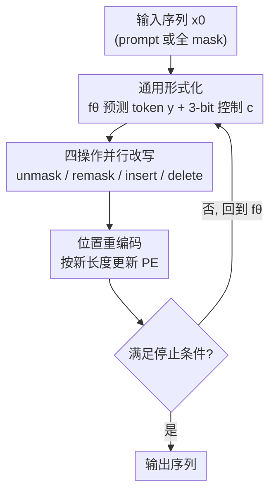

# On Powerful Ways to Generate: Autoregression, Diffusion, and Beyond

**会议**: ICLR 2026  
**OpenReview**: [https://openreview.net/forum?id=PKidr9Ruli](https://openreview.net/forum?id=PKidr9Ruli)  
**代码**: 待确认  
**领域**: 学习理论 / 生成式模型表达力  
**关键词**: 掩码扩散模型, 自回归, 可计算性, PRAM, any-process 生成

## 一句话总结
本文用可计算性理论严格刻画了"自回归 (ARM) vs 掩码扩散 (MDM)"两种生成方式的能力边界——证明 MDM 的并行性可带来指数级加速、但它的"任意顺序"灵活性并不比 ARM 解决更多问题，进而提出 **any-process 生成**（在 unmask 之外再加 remask / insert / delete 三种操作），用理论与实验证明它能解决 ARM 和普通 MDM 都做不到的更难推理与结构化生成任务。

## 研究背景与动机

**领域现状**：当前大模型几乎都建立在自回归 (Auto-Regressive Model, ARM) 之上——逐 token、从左到右生成，把"语言沿时间单向展开"这一归纳偏置写进了架构。最近掩码扩散模型 (Masked Diffusion Model, MDM) 成为有力的替代：它从全 mask 序列出发，可以**任意顺序、并行**地一次解开多个 token，已有大规模实例（Gemini Diffusion、LLaDA 等）做到与 AR LLM 相当的性能，还在反向诗歌补全、数独等"顺序敏感"任务上有经验性优势，解码速度最高快 10×。

**现有痛点**：尽管 MDM 经验上成功，它的**计算能力和根本局限却没人说清楚**——任意顺序生成到底带来了什么"质"的能力，还是只是"快"？面对真正困难的推理任务（需要回溯、改写、搜索-验证-修正的循环），MDM 是否和 ARM 一样无能为力？这些问题此前都停留在直觉层面。

**核心矛盾**：自然界中很多对象（代码、蛋白质、DNA、图结构）**并不沿单向时间轴线性构造**。代码要在每个中间状态都满足括号匹配、类型正确这类全局约束，生物序列要靠"交换结构域、插入结合位点、重组片段"这类结构感知的编辑来生成。ARM 强行把这些过程压成从左到右的序列，需要"全局预见未来 token"的能力，而这恰恰超出了常深度 Transformer ($\mathsf{TC}^0$) 的表达力。

**本文目标**：(1) 给"如何形式化比较不同生成方式"一个严谨答案；(2) 找出比 next-token 生成**可证明更强**的生成范式。

**切入角度**：把"生成过程"当成一种**与具体架构无关的计算机制**来研究——用并行计算模型 PRAM 和复杂度类（P / NC / PSPACE / $\mathsf{TC}^0$）去刻画 ARM 和 MDM 各自能解决的问题类，从而把"谁更强"变成可证明的命题。

**核心 idea**：在 MDM 唯一的 unmask 操作之外，补上 **remask（把已解码 token 变回 mask）、insert（任意位置插入 mask）、delete（删除 mask）** 三种围绕 mask token 的可学习操作，让模型获得自我纠错、变长编辑、自适应并行的能力，从而突破 ARM 和普通 MDM "token 一旦写下就不可改" 的根本枷锁。

## 方法详解

### 整体框架

本文有两条主线：先是一套**理论刻画**，把 ARM 和 MDM 放到统一的可计算性框架里比较出三条结论；再据此提出新范式 **Any-Process MDM (AP-MDM)** 并证明它更强。

理论侧的三条结论是动机的支柱：MDM 与 PRAM 等价，能以最优并行时间复杂度求解问题，对简单可并行问题相对 ARM 有指数加速（Theorem 1）；但 MDM 的上下文长度 $S(n)$ 决定了它最多只能解 $\tilde O(S^3(n))$ 串行时间内的问题，对 NP-hard 这类任务无法扩展（Theorem 2）；而且在控制掉"每步生成 token 数"和"编码器/解码器架构"这两个正交因素后，**任意顺序生成本身并不比 ARM 多解决任何问题**（Theorem 3）——因为任意顺序的计算都能被重排成从左到右等价完成。

方法侧的 AP-MDM 把生成抽象成两个函数的迭代：一个**可学习的 Transformer** $f_\theta$ 在输入序列 $x_t$ 上预测出"该写什么 token" $y_t$ 和"每个位置该做什么操作"的控制信号 $c_t$；一个**无参数的转移函数** $g$ 拿着 $(x_t, y_t, c_t)$ 真正执行四种操作，产出可能变长的下一个序列 $x_{t+1}$。整个生成就是 $x_{t} = (g \circ f_\theta)^t(x_0)$ 反复迭代，直到满足灵活的停止条件（生成 EOS、或序列收敛进入循环）。相比普通 MDM，它对 mask 比例、解码步数、序列长度、停止条件都不再有任何限制，$x_0$ 甚至可以直接是无 mask 的 prompt（退化成 ARM）。

### 关键设计

**1. 理论刻画：把"生成方式"还原成可计算性问题，量出 MDM 的能力与天花板**

这是全文的地基，回答"MDM 凭什么、又止步于哪"。作者把 MDM 和并行随机访问机 PRAM 对上：对任何用 $T(n)$ 并行时间、$P(n)$ 处理器的 PRAM 程序，存在一个把输入 padding 到 $S(n)=O(P(n)\cdot T(n))$ 的 MDM，用 $O(T(n))$ 步解码复现其输出，即 $\mathrm{PRAM}(P(n),T(n)) \subseteq \mathrm{MDM}(O(P(n)T(n)), O(T(n)))$（Theorem 1）。这说明 MDM 不只像 ARM 一样图灵完备，还能以**最优并行时间**解题——图连通性 $O(\log n)$ 步、Dyck-$k$ 等上下文无关语言 $O(\log^2 n)$ 步，相对 ARM 的线性串行复杂度是指数级加速。

但代价是上下文长度必须随**总并行工作量** $O(T(n)\cdot P(n))$ 增长。由此 Theorem 2 给出天花板：$\mathrm{MDM}(S(n)) \subseteq \mathrm{PRAM}(1, \tilde O(S^3(n)))$，即长度 $S(n)$ 的 MDM 解不了需要超过 $\tilde O(S^3(n))$ 串行时间的问题，对超出 P 的任务（NP-hard）需要超多项式长度，实际不可行。**病根在于 token 一旦解码就不可逆**——每次内存写入都被永久钉成 token，逼着空间随计算时间膨胀。最后 Theorem 3 戳破"任意顺序更强"的直觉：控制掉每步 token 数和架构后，任意顺序 MDM 能算的，一个从左到右、每步一 token 的 Masked-ARM 加常数层就能复现，因为注意力本就擅长从任意位置取信息再内部重排成正确顺序。

**2. Any-Process 生成的通用形式化：把生成解耦成"可学习预测 + 无参数执行"**

针对上面暴露的"不可改写"瓶颈，作者设计了一个足够通用的生成框架。$f_\theta: \bar\Sigma^* \to \bar\Sigma^* \times \Sigma^* \times C^*$ 在 $x_k$ 上返回三元组 $(x_k, y_k, c_k)$：$y_k$ 是和输入等长、无 mask 的候选 token，$c_k$ 是每位置的控制码。注意 $f_\theta$ 把输入 $x_k$ 原样带进输出，是为了让后续的 $g$ 知道哪些位置原本就是 mask。$g: \bar\Sigma^* \times \Sigma^* \times C^* \to \bar\Sigma^*$ 是**无参数、可非确定**的转移函数，吃掉三元组吐出可变长的 $x_{k+1}$。

这种"$f_\theta$ 管预测、$g$ 管执行"的解耦是关键：所有改写逻辑被放进无参数的 $g$，$f_\theta$ 只需多预测几个控制信号，架构几乎不动。它对 mask 比例、解码步数、停止条件全部松绑——AO-MDM（普通任意顺序 MDM）只是它"控制信号恒为 unmask、长度不变"的一个特例。这种灵活性也正是普通 MDM 受困于固定步数、固定长度而做不到自适应计算的根源所在。

**3. 四种 token 操作的实例化：3-bit 控制码驱动 unmask / remask / insert / delete**

这是把通用框架落地的核心。每个位置 $i$、每步 $t$ 配一个 3-bit 控制向量 $c_{t,i}=(c_{t,i}[1], c_{t,i}[2], c_{t,i}[3])\in\{0,1\}^3$，分别管改写、插入、删除。**改写**用第一位：$c_{t,i}[1]=1$ 时无论原状态都把位置 $i$ 变回 mask，否则照常 unmask——

$$\mathrm{remask}_{x_{t,i},c_{t,i}}(y)=\begin{cases} M & c_{t,i}[1]=1 \\ y & x_{t,i}=M,\ c_{t,i}[1]=0 \\ x_{t,i} & \text{otherwise}\end{cases}$$

remask 让模型能擦掉失败分支、回溯重试，从而在状态重复前把计算量沿 $S(n)$ 指数级放大，实现 test-time scaling，且解码顺序与并行度都能从数据里学。**变长编辑**用第二、三位：$c_{t,i}[2]=1$ 时在位置 $i$ 后插入一个 mask（每个 mask 都能再生 mask，序列可指数增长），$c_{t,i}[3]=1$ 且该位原本是 mask 时把它删掉（在轻计算阶段释放空间、省 FLOPs）。三种操作复合执行：$s_{t,i}=\mathrm{insert}\circ\mathrm{delete}\circ\mathrm{remask}(y_{t,i})$，逐位置算完再拼接成新序列。

它们都围绕 mask token 设计，复用了 MDM 已经很强的 unmask 能力，比起去学"反演均匀噪声"这类更难的操作更容易预训练/微调。架构上零改动，只需给 Transformer 加 3 个额外线性头产出控制 logits；三种操作都能用自监督目标端到端从文本语料学，也能从现成大扩散模型直接微调——这点把它和"表达力强但因缺中间监督而极难训"的循环 Transformer 区分开。

**4. 位置重编码与可证明的能力跃升：把"长度会变"翻译成结构信息**

insert / delete 会改变序列长度，所以每步都按新位置**重新编码 positional encoding**。这步看似工程细节，实则是 AP-MDM 表达力优势的命门——位置的移动本身携带了有意义的结构信息，让模型能表示 ARM 表示不了的复杂过程。

有了改写与变长编辑，理论保证随之跃升：Theorem 4 证明 AP-MDM 能用 $O(S(n))$ 上下文、$O(T(n))$ 步复现任何 $S(n)$ 内存的 PRAM 程序，达到**最优并行时间 + 最优空间**复杂度——相比普通 MDM 必须随总工作量 $O(P(n)T(n))$ 膨胀，这是指数级改进，使多项式长度下可解 PSPACE（而非仅 P）的问题，许多 NP-hard 任务因此能靠 test-time scaling 求解。Theorem 5 证明对 $k\ge 2$，存在随机 AP-MDM 其生成分布支撑集恰好等于 two-sided Dyck-$k$ 语言，而任何固定 ARM 都存在一个长度阈值，超过后无法保证覆盖语言里所有串（因为生成 Dyck 等价于识别它，超出 $\mathsf{TC}^0$）。Theorem 6 则反向证明 **AP-MDM 难被 ARM 模拟**：insert/delete 触发的位置移动逼着 ARM 内部重建整条编辑轨迹来确定每个位置当前是什么 token（形式化为 PRESERVE 问题），对常深度 Transformer 计算困难。

### 损失函数 / 训练策略

三种操作均以自监督目标端到端训练（unmask 损失与 remask 损失分别定义，见原文 §C.2，⚠️ 具体形式以原文为准）。可从文本语料预训练，也可在有"显式生成过程"监督数据（如代码修订历史）时做监督微调，或从现成大扩散模型直接微调。数独训练动态显示：模型很快学会"先填最容易的位置"（unmask 损失迅速下降），而"学顺序"（下一步填哪）更难收敛。

## 实验关键数据

### 主实验

| 任务 | 方法 | 训练样本 / 参数 | 准确率 |
|------|------|------|------|
| 数独 (NP-完全) | ARM (有顺序) | 1.8M / 42M | 87.18% |
| 数独 | AO-MDM (Top-K prob. margin) | 1.8M / 6M | 89.49% |
| 数独 | **AP-MDM** | **100 / 1.2M** | **99.28%** |
| Parity (任意长度) | ARM (训练 n=2~100) | 数量级更多 | 无法泛化 |
| Parity | **AP-MDM (仅训 n=2, ~200 参数)** | — | **100%** |

数独上 AP-MDM 只用 **100 个**训练实例、**1.2M** 参数，就超过用 **1.8M** 实例、**5× 参数**的 ARM 和 AO-MDM——因为允许多步多算后，每一步都更易学，样本效率大幅提升。Parity 这个"对 LLM 异常困难"的任务上，AP-MDM 靠学到"消去算法"（看前两位，含 0 删所有 0、双 1 删该对，重复直到处理完）只训长度 2 就 100% 泛化到任意长度，而 ARM 出训练长度即崩。

### 消融 / 分析实验

| 任务 | 图规模 (节点数) | ARM 准确率 | AP-MDM 准确率 |
|------|------|------|------|
| 图编辑 (求 min-cut 断开 s-t) | 4 | 90.32% | 100% |
| | 5 | 43.04% | 100% |
| | 6 | 0.30% | 100% |
| | 7~10 | N/A | 99.92%~100% |

图生成任务要求模型迭代编辑图结构（BFS 找路 → 增广修改 → 重复 → 删 min-cut 边）。AP-MDM 在图越来越大时保持近乎完美，而用 ARM 去模拟同一编辑过程，随规模增大迅速失效——经验性印证了 Theorem 6"AP-MDM 难被 ARM 模拟"。

### 关键发现
- **可改写 = 可扩展**：remask 带来的回溯/纠错是 AP-MDM 解 NP-hard 任务的核心，去掉它就退回 MDM 的 $\tilde O(S^3)$ 天花板。
- **可变长 = 可结构化**：insert/delete + 位置重编码让两侧 Dyck-$k$、DNA 剪接、图编辑这类非线性对象可生成，ARM 因需全局预见而做不到。
- **更难被模拟反而是优势**：编辑操作引入的位置移动让 ARM 无法高效模拟，意味着若未来有"生成过程数据"（代码修订、证明草稿、分子形成），AP-MDM 才是合适的训练对象。

## 亮点与洞察
- **把"生成方式"从架构里抽离当成独立计算机制研究**：这是最"啊哈"的视角——不纠结 Transformer 细节，而是用 PRAM / 复杂度类直接量出 AR、any-order、any-process 三层能力的差距，结论可证明而非靠刷分。
- **反直觉结论"任意顺序≠更强"（Theorem 3）**：纠正了社区对扩散语言模型"灵活=更强"的朴素期待，把功劳精确归给"并行"而非"任意顺序"，为后续设计指明真正该加强的维度。
- **三种操作零架构改动、只加 3 个线性头**：可迁移性极高，能直接在现成大扩散模型上微调出 remask/insert/delete 能力，工程门槛低。
- **"病根是 token 不可逆"这一诊断**：把 ARM 和 MDM 的扩展性瓶颈统一归到"写下即不可改"，再用 remask/delete 对症下药，因果链非常干净。

## 局限与展望
- 编码器架构每步要重编码整条序列、无法用 KV cache，每步 FLOPs 高于解码器式 ARM；作者认为理论构造里这种 trade-off 并非不可避免，但当前实现仍存在。
- 实验集中在数独 / parity / Dyck / 图编辑等**结构清晰的合成任务**，尚未在自然语言或大规模代码/科学语料上验证；"生成过程数据"目前多为人工构造。
- 多处能力是**存在性证明**（"存在一个 AP-MDM"），与"能否从数据稳定学到该构造"之间仍有差距；数独训练动态也显示"学顺序"较难。
- 停止准则、非确定性 $g$ 的设计仍较启发式，论文也明言 (4) 中的 $g$、$c_t$ 只是充分而非必要设计，存在更优实例化空间。

## 相关工作与启发
- **vs 普通 MDM (AO-MDM)**：AO-MDM 只有 unmask、固定长度与步数，是 AP-MDM 的特例；本文证明它的任意顺序灵活性并不比 ARM 多解决问题，而 AP-MDM 靠 remask/insert/delete 真正越过了 P→PSPACE 的界。
- **vs ARM / CoT**：ARM 图灵完备但 token 不可改写，受 $\tilde O(S^3)$ 串行复杂度与 $\mathsf{TC}^0$ 全局预见瓶颈所限；AP-MDM 既保留并行加速又获得最优空间复杂度。
- **vs 循环 Transformer (Universal Transformer 等)**：同样追求更强表达力，但循环结构因缺中间监督极难训练；AP-MDM 的操作可端到端自监督学习，训练友好。
- **vs 已有 remask / 编辑类工作**：remask、编辑思想此前在若干并行/同期工作中被零散探索过，本文的差异是**首次系统给出"什么样的操作设计能带来可证明计算收益"的指导原则**及其实践含义。

## 评分
- 新颖性: ⭐⭐⭐⭐⭐ 把生成范式抽象成可计算性问题并给出 6 条定理，视角与结论都很原创
- 实验充分度: ⭐⭐⭐⭐ 合成任务（数独/parity/Dyck/图）上对比扎实且与理论呼应，但缺自然语言大规模验证
- 写作质量: ⭐⭐⭐⭐⭐ 理论与直觉交织、图示清晰，把抽象复杂度结论讲得可读
- 价值: ⭐⭐⭐⭐⭐ 为"超越 next-token 的下一代 LLM 生成机制"提供了可证明的设计原则，方向性意义大

<!-- RELATED:START -->

## 相关论文

- [\[ICLR 2026\] Information Estimation with Discrete Diffusion](information_estimation_with_discrete_diffusion.md)
- [\[ICLR 2026\] Polynomial Convergence of Riemannian Diffusion Models](polynomial_convergence_of_riemannian_diffusion_models.md)
- [\[ICLR 2026\] Computing Equilibrium beyond Unilateral Deviation](computing_equilibrium_beyond_unilateral_deviation.md)
- [\[ICLR 2026\] Quantum Machine Learning Advantages Beyond Hardness of Evaluation](quantum_machine_learning_advantages_beyond_hardness_of_evaluation.md)
- [\[ICLR 2026\] On the Interpolation Effect of Score Smoothing in Diffusion Models](on_the_interpolation_effect_of_score_smoothing_in_diffusion_models.md)

<!-- RELATED:END -->
