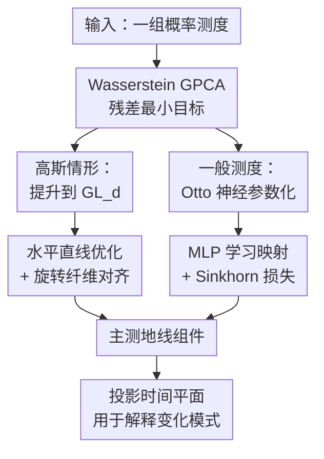

# On the Wasserstein Geodesic Principal Component Analysis of probability measures

**会议**: ICLR 2026  
**OpenReview**: [https://openreview.net/forum?id=OJupg4mDjS](https://openreview.net/forum?id=OJupg4mDjS)  
**代码**: Gaussian 实验 https://github.com/alebrigant/bures-wasserstein-gpca；一般概率测度实现 https://github.com/nvesseron  
**领域**: 学习理论 / Wasserstein 几何  
**关键词**: Wasserstein空间, 测度主成分分析, Geodesic PCA, 最优传输, Riemannian几何

## 一句话总结
本文把概率测度集合上的主成分分析从切空间近似推进到真正的 Wasserstein 测地线优化：对高斯测度用 Bures-Wasserstein 几何提升到可逆矩阵空间，对一般绝对连续测度用 Otto 参数化和神经网络学习主测地线，并展示它比 Tangent PCA 更能刻画弯曲空间中的分布变化模式。

## 研究背景与动机
**领域现状**：当数据点本身是概率分布时，最朴素的做法是把密度函数当作 $L^2$ 空间里的向量，然后直接做普通 PCA。
这种处理在形式上很方便，但它忽略了概率分布的几何结构：两个分布之间的差异往往不是“密度值逐点相减”，而是质量如何从一个区域搬到另一个区域。
因此，最优传输里的 $W_2$ Wasserstein 距离自然成为比较概率测度的核心工具。

**现有痛点**：已有的 Wasserstein PCA 大多采用 Tangent PCA（TPCA）：先选一个参考分布，比如 Wasserstein barycenter，再把所有测度映射到该点的切空间，最后在这个线性空间里做 PCA。
这在计算上便宜，也在一维分布上有很好的性质，但对高维概率测度来说，切空间线性化会压平原本弯曲的 Wasserstein 空间。
当数据离参考点较远、或者位于 SPD 锥边界附近时，TPCA 的距离关系会被扭曲，主方向可能反映的是线性化后的伪结构。

**核心矛盾**：真正的 Geodesic PCA（GPCA）希望直接在流形上找一条测地线，使每个分布到这条测地线的投影残差最小。
这个定义几何上更正确，却比 TPCA 难得多：测地线本身是非线性的，投影时间也要一起优化；在 Wasserstein 空间里，还要保证曲线确实是一条合法的 Wasserstein 测地线。
因此，矛盾在于：我们想保留 Wasserstein 几何的真实性，但又需要一个可计算、可训练、可解释的参数化。

**本文目标**：论文要解决两个层次的问题。
第一，在中心高斯分布集合上，能否利用 Bures-Wasserstein 几何精确求解 GPCA，而不是做切空间近似？
第二，在更一般的绝对连续概率测度集合上，能否给出一种可训练的神经网络参数化，让 GPCA 的主测地线可以直接从样本中学出来？

**切入角度**：作者抓住 Otto-Wasserstein 几何中的“提升”视角：复杂的 Wasserstein 空间可以看作某个更高层空间的商空间。
如果在上层空间沿着合适的水平直线移动，投影到底层就是 Wasserstein 测地线。
这样，原来直接在测度空间里很难写的测地线搜索，就能转化为上层空间里的线段、向量场和正交约束优化。

**核心 idea**：用 Otto / Bures-Wasserstein 的纤维丛表示，把“概率测度空间中的主测地线”提升为“上层映射空间中的水平直线”，再分别用矩阵优化和 MLP 参数化来求解 exact GPCA。

## 方法详解

### 整体框架
本文的方法可以理解为同一个几何想法的两个实例。
对中心高斯分布，测度由协方差矩阵 $\Sigma$ 表示，Wasserstein 几何退化为 SPD 矩阵上的 Bures-Wasserstein 几何；作者把协方差矩阵提升到可逆矩阵 $A$，使 $\Sigma=AA^\top$。
对一般绝对连续测度，作者把测度提升到把参考测度 $\rho$ 推到目标测度的映射 $\phi$，并用 $\phi+t\nabla f\circ\phi$ 表示一条 Wasserstein 测地线。

从目标函数看，第一主成分是一条测地线 $\mu(t)$，它最小化所有数据测度到这条测地线的平方 Wasserstein 投影残差：

$$
\inf_{t\mapsto \mu(t)\ \text{geodesic}} \sum_{i=1}^n \inf_{t_i} W_2^2(\mu(t_i), \nu_i).
$$

后续主成分继续最小化同类残差，但要求与前面的主测地线正交相交。
这点和欧氏 PCA 很像，却不能简单照搬“最大化投影方差”的等价形式，因为在弯曲空间里，残差最小化和方差最大化不再等价。

### 关键设计
**1. Bures-Wasserstein 提升：把高斯 GPCA 变成可逆矩阵空间里的水平线搜索**

对中心非退化高斯分布，作者把每个分布识别为协方差矩阵 $\Sigma\in S_{++}^d$。
Bures-Wasserstein 几何可以通过投影 $\pi:A\mapsto AA^\top$ 从 $GL_d$ 得到；同一个协方差矩阵对应一整个纤维 $\Sigma^{1/2}O_d$，也就是所有 $\Sigma^{1/2}Q$ 形式的矩阵。
关键好处是：底层 SPD 空间里的 Wasserstein 测地线，可以写成上层空间中水平直线的投影
$\Sigma(t)=\pi(A+tX)=(A+tX)(A+tX)^\top$，其中 $X$ 必须满足水平条件 $X^\top A-A^\top X=0$。

这一步解决了“测地线难优化”的问题。
原目标里的 Bures-Wasserstein 距离可以替换为上层矩阵之间的 Frobenius 距离，但需要同时为每个样本选择一个旋转矩阵 $Q_i$ 来表示它所在纤维上的最佳代表。
于是第一主成分的学习变量变成 $A_1$、水平速度 $X_1$ 和一组旋转 $Q_i$，投影时间也有显式形式 $t_i=\langle \Sigma_i^{1/2}Q_i-A_1, X_1\rangle$。
为了保证 $A+tX$ 始终可逆，作者还把投影时间裁剪到由 $XA^{-1}$ 特征值决定的合法区间内。

**2. 正交主测地线：用交点、水平速度和内积约束替代欧氏 PCA 的线性子空间**

欧氏 PCA 的第 2、3 个方向只要和前面方向正交即可，但 GPCA 的“方向”是一条测地线，正交必须发生在交点处。
在高斯情形中，作者让第二条水平直线从第一条直线上的某个点 $A_2=A_1+t^*X_1$ 出发，并要求第二个速度 $X_2$ 在 $A_2$ 处水平、单位范数，且与第一速度满足 $\langle X_2,X_1\rangle=0$。
这样投影到底层后，两条主测地线不仅相交，而且以 Bures-Wasserstein 度量意义正交。

这个设计的意义在于，它没有把 GPCA 退化成“在切空间里找一组向量”。
每一条组件仍然是底层 Wasserstein 空间中的真实测地线，交点也不被强行固定为 Wasserstein barycenter。
实验里的同特征值旋转协方差例子正说明了这一点：GPCA 的最优主测地线可能不穿过 barycenter，而 TPCA 必然围绕参考点展开。
这既揭示了流形 PCA 与欧氏 PCA 的差异，也提醒读者 GPCA 的几何真实性有时会带来非直观的行为。

**3. Otto 神经参数化：用 $\phi$ 和 $\nabla f$ 表示一般测度上的可采样测地线**

对于一般绝对连续概率测度，作者采用 Otto 几何中的表示：固定参考测度 $\rho$，用一个 diffeomorphism $\phi$ 把 $\rho$ 推到基准测度 $\phi_\#\rho$，再沿水平向量场 $\nabla f\circ\phi$ 移动。
由此得到测地线
$\mu(t)=(id+t\nabla f)_\#(\phi_\#\rho)$。
论文用两个 MLP 分别参数化 $\phi_\theta$ 和 $f_\psi$，采样时先取 $x\sim\rho$，再计算 $z=(id+t\nabla f_\psi)\circ\phi_\theta(x)$，这些 $z$ 就是测地线上时刻 $t$ 的样本。

这个参数化的一个关键点是，$f$ 不必被限制为凸函数。
传统 McCann 插值经常通过凸势函数保证最优传输结构，而本文采用 Otto 表示后，只需保证 $id+t\nabla f_\psi$ 在当前时间区间内是 diffeomorphism。
实践中作者通过估计 Hessian $Hf_\psi(x)$ 的最大/最小特征值来裁剪合法时间区间，避免使用 ICNN 这类硬性凸网络结构。
这让模型表达能力更自由，但也引入了 Hessian 特征值估计的数值成本和稳定性问题。

**4. Sinkhorn 训练目标：把连续测地线学习落到可微小批量优化**

一般测度情形无法像高斯情形那样直接写出所有距离的闭式形式。
作者把每个数据测度 $\nu_i$ 表示为样本批次，把测地线上的 $\mu_{\theta,\psi}(t_i)$ 也表示为从 $\rho$ 采样后经网络变换得到的点云，然后用 Sinkhorn divergence $S_\varepsilon$ 近似 $W_2^2$。
第一主成分训练时，模型同时更新 $\phi_\theta$、$f_\psi$ 和每个样本自己的投影时间 $t_i$，每轮按样本测度逐个抽小批量优化。

第二主成分在这个目标上额外加入两个正则项。
交点正则 $I$ 要求两条上层曲线在各自交点时间处靠近；正交正则 $O$ 用 $L^2(\rho)$ 内积约束两个水平向量场接近正交。
这两个正则项让神经网络版本的 GPCAGEN 能够模仿流形 GPCA 的“正交相交主测地线”定义，而不是只学多条互不相关的生成路径。

### 损失函数 / 训练策略
第一主成分的理想目标是

$$
L(f,\phi,t_1,\ldots,t_n)=\sum_{i=1}^n W_2^2((id+t_i\nabla f)_\#(\phi_\#\rho),\nu_i).
$$

实现时把 $W_2^2$ 换成 Sinkhorn divergence，并用小批量样本近似两个分布。
算法每次抽取某个目标测度 $\nu_i$ 的样本 $y_j^{(i)}$ 和参考样本 $x_k\sim\rho$，估计当前 $f_\psi$ Hessian 的合法时间区间 $[t_{min},t_{max}]$，把 $t_i$ 裁剪为 $t_i'$，再生成
$z_k^{(i)}=(id+t_i'\nabla f_\psi)\circ\phi_\theta(x_k)$。
最后最小化经验 Sinkhorn divergence
$S_\varepsilon(\frac1m\sum_k\delta_{z_k^{(i)}},\frac1m\sum_j\delta_{y_j^{(i)}})$。

第二主成分在同一损失外加交点和正交正则：

$$
L_2+\lambda_I I(\xi_1,\xi_2,t^1_{inter},t^2_{inter})+\lambda_O O(\nabla f_{\psi_1}(\phi_{\theta_1}),\nabla f_{\psi_2}(\phi_{\theta_2})).
$$

其中 $I$ 是两条上层曲线交点处的欧氏差异，$O$ 是两个水平向量场的归一化平方内积。
论文实验里，$f_\psi$ 和 $\phi_\theta$ 均使用 4 层、隐藏维度 128 的 MLP；交点和正交正则系数取 $\lambda_I=\lambda_O=1.0$，在报告的实验中工作稳定。

## 实验关键数据

### 主实验
论文的实验不是标准分类 benchmark，而是用合成与真实分布集合检验 GPCA 是否能恢复有意义的主测地线，并比较它与 TPCA 的几何差异。

| 场景 | 数据 / 设置 | 本文方法 | 对照方法 | 关键结论 |
|------|-------------|----------|----------|----------|
| 随机二维高斯协方差 | 100 次随机试验，每次 $n=50$ 个 SPD 矩阵 | Gaussian GPCA | TPCA | 一般情况下 GPCA 相比 TPCA 的目标改进平均小于 1%，说明 TPCA 多数时候是好近似 |
| 同方向协方差矩阵 | 固定方向、改变两个特征值 | Gaussian GPCA | TPCA | 两者等价，都退化为 $(a,b)$ 坐标中的线性 PCA |
| 同特征值不同方向矩阵 | $n=20$，角度均匀变化，改变 $|a-b|/|a+b|$ | Gaussian GPCA | TPCA | 当矩阵接近 SPD 锥边界时，GPCA 与 TPCA 明显分离，目标改进可达到论文图中约 40% 量级 |
| 天气协方差数据 | 美国各州降水和风速直方图构造协方差 | Gaussian GPCA | 无直接定量基线 | 前两个 GPCA 投影能展示不同州天气行为的聚类结构 |
| MNIST 构造测地线 | 数字形状和颜色通道构造两条正交测地线 | GPCAGEN | 构造真值 | 成功恢复颜色变化与数字 1/2 形状变化两条正交主测地线 |
| ModelNet40 点云 | 100 个 lamp / chair 点云 | GPCAGEN | TPCA、PointNet+PCA | lamp 第一组件区分吊灯/落地灯，chair 第一组件区分椅子/扶手椅；TPCA 有离散伪影 |
| Landscape 图像颜色分布 | 39 张风景图像的颜色点云 | GPCAGEN | 无直接定量基线 | 第一组件主要对应亮度变化，第二组件分离偏蓝与偏绿图像 |

### 消融实验
论文没有用“去掉模块 A/B”的标准神经网络消融表，而是通过几何反例和基线对比分析哪些设计是必要的。

| 配置 / 对照 | 观察指标 | 说明 |
|-------------|----------|------|
| TPCA 线性化 | GPCA 目标值、组件形状 | 在多数随机高斯数据上足够接近，但在高曲率区域会扭曲距离关系 |
| 固定同方向协方差 | GPCA 与 TPCA 是否一致 | 空间局部退化为平坦结构时，两者完全一致，说明差异来自 Wasserstein 曲率而非实现误差 |
| 同特征值旋转协方差 | cost improvement 随 $|a-b|/|a+b|$ 变化 | 协方差越接近 SPD 锥边界，线性化失真越明显，GPCA 改进越大 |
| TPCA on 3D point clouds | 组件可视化质量 | 离散测度上的 TPCA 会出现孔洞和质量过度集中，说明连续测地线采样有实际优势 |
| PointNet+PCA | 二维投影可解释性 | latent PCA 可有局部聚类，但依赖预训练编码器几何，主方向不一定对应 Wasserstein 变化模式 |
| GPCA outlier score | chair vs car / plane 分数直方图 | 用到前两个 GPCA 组件的投影距离和后，非 chair 点云分数更高，可用于离群检测 |

### 关键发现
- GPCA 和 TPCA 并非总是差很多；在普通随机高斯协方差实验中，TPCA 的平均目标差距小于 1%，这给出了一个很实用的 caveat：昂贵的 exact GPCA 主要在高曲率或远离参考点时更有价值。
- 最能说明本文价值的是同特征值不同方向协方差的反例：TPCA 必须从 barycenter 的切空间出发，而 GPCA 的最优测地线可以不穿过 barycenter，说明“主成分一定围绕均值展开”在流形上不是理所当然的。
- GPCAGEN 的优势不是把分类精度刷高，而是能从连续分布集合中采样沿主变化方向的中间分布；这对点云形状、图像颜色分布、离群检测这类需要解释变化模式的任务尤其重要。
- TPCA 在离散点云上会产生孔洞和质量集中等伪影，表明“把经验分布直接线性化”会把数值离散性混进主成分解释里。

## 亮点与洞察
- 本文最漂亮的地方是把 Wasserstein GPCA 写成纤维丛上的水平直线问题。
这个视角把“测度空间里找曲线”的困难转化为“上层映射空间里找可投影的直线”，既保留了几何真实性，又给了算法实现入口。
- 高斯部分不是简单的特例，而是一个很清楚的几何实验台。
通过 Bures-Wasserstein 与 SPD 锥，论文能精确展示 TPCA 什么时候好、什么时候会因曲率而失真。
- 一般测度部分避免 ICNN 的做法很有启发性。
它用 Hessian 特征值监控来换取更自由的势函数参数化，这对其他神经最优传输和测地线学习问题也有借鉴意义。
- 论文诚实地展示 GPCA 的非直观行为：在某些高斯例子里，GPCA 虽然优化目标更低，却可能把样本投影到组件边界，解释性不一定总是优于 TPCA。
这种讨论让方法的适用范围更清楚。
- 把投影时间 $t_i^{(1)},t_i^{(2)}$ 当作低维坐标，是一个很自然的下游接口。
它把复杂概率分布集合嵌入到由主测地线定义的平面中，可用于聚类、可视化和离群检测。

## 局限与展望
- 一般测度版本目前主要是初步验证和可视化，缺少大规模、可复现实验中的定量评价。
如果要作为通用分布表示学习工具，还需要更系统地比较运行时间、样本复杂度和稳定性。
- Hessian 特征值估计是一个实际瓶颈。
为了保证 $id+t\nabla f$ 是 diffeomorphism，训练过程必须不断监控局部 Hessian，这在高维数据和大网络上可能很昂贵，也可能只保证采样点附近的局部合法性。
- 第二及更高阶主成分依赖交点和正交正则，而不是硬约束精确求解。
正则系数在论文实验中取 1.0 可用，但不同数据分布下是否需要调参、是否会陷入不正交或不相交的局部解，还需要更多分析。
- GPCA 的解释性并非单调优于 TPCA。
论文自己的高斯病态例子说明，exact GPCA 可能出现边界投影和较差分离；未来可以研究带约束的 GPCA、robust GPCA 或兼顾残差与投影分布均匀性的目标。
- 高维非高斯分布上的理论保证还比较有限。
例如高维高斯子流形中，在全体绝对连续测度空间做 GPCA 是否仍留在高斯子流形，论文只证明了一维情形，高维仍是开放问题。

## 相关工作与启发
- **vs Tangent PCA / linearized Wasserstein PCA**: TPCA 先把测度映射到参考点切空间，再做线性 PCA；本文直接优化 Wasserstein 测地线残差，避免把弯曲空间完全压平。优势是几何更忠实，劣势是优化更重、数值约束更多。
- **vs 一维 Wasserstein GPCA**: 早期工作在一维直方图上 GPCA 与 TPCA 可重合，因为一维情形存在更简单的等距结构；本文面向 $\mathbb{R}^d$ 上的高维分布，核心难点是测地线参数化和投影优化。
- **vs Seguy & Cuturi 的 generalized geodesics**: 相关工作用 generalized geodesics 近似 GPCA；本文强调求解 equation 1 中的 exact GPCA，组件是真正的 Wasserstein 测地线，而不是替代曲线。
- **vs 神经最优传输 / ICNN transport map**: 很多神经 OT 方法通过凸势或 ICNN 保证最优传输结构；本文的 Otto 参数化不强制凸函数，而是用 diffeomorphism 条件和 Hessian 监控保证合法测地线，提供了另一种神经几何建模路线。
- **对表示学习的启发**：如果样本天然是分布、点云、颜色直方图或生成模型输出集合，主变化方向未必应该在编码器 latent space 中寻找。
用 Wasserstein 主测地线定义低维坐标，可以得到更贴近“质量移动”的可解释表示。

## 评分
- 新颖性: ⭐⭐⭐⭐⭐ 把高斯和一般绝对连续测度的 exact Wasserstein GPCA 放在统一的 Otto 提升框架下，贡献清晰且有理论含量。
- 实验充分度: ⭐⭐⭐⭐☆ 实验很好地说明几何现象和可视化效果，但定量 benchmark 与大规模稳定性分析仍偏少。
- 写作质量: ⭐⭐⭐⭐⭐ 论文结构清楚，背景、几何命题、算法和反例之间衔接自然，附录也承担了重要证明细节。
- 价值: ⭐⭐⭐⭐☆ 对 Wasserstein 统计、几何机器学习和分布型数据分析很有价值；短期内更像研究工具和理论基线，而非即插即用的大规模工程方法。

<!-- RELATED:START -->

## 相关论文

- [\[ICLR 2026\] Slicing Wasserstein over Wasserstein via Functional Optimal Transport](slicing_wasserstein_over_wasserstein_via_functional_optimal_transport.md)
- [\[ICLR 2026\] Probability Distributions Computed by Autoregressive Transformers](probability_distributions_computed_by_autoregressive_transformers.md)
- [\[ICLR 2026\] Revisiting Tree-Sliced Wasserstein Distance through the Lens of the Fermat–Weber Problem](revisiting_tree-sliced_wasserstein_distance_through_the_lens_of_the_fermatweber_.md)
- [\[ICLR 2026\] Complexity Analysis of Normalizing Constant Estimation: from Jarzynski Equality to Annealed Importance Sampling and Beyond](complexity_analysis_of_normalizing_constant_estimation_from_jarzynski_equality_t.md)
- [\[ICLR 2026\] High-dimensional Analysis of Synthetic Data Selection](high-dimensional_analysis_of_synthetic_data_selection.md)

<!-- RELATED:END -->
