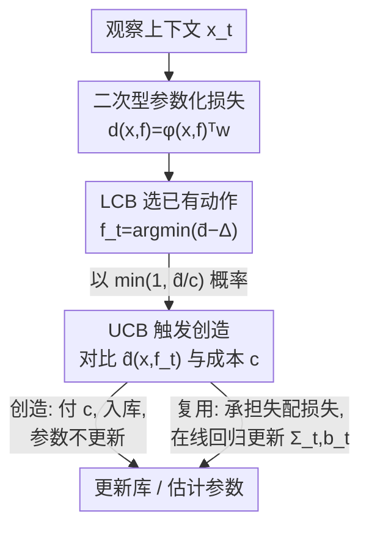

# Online Decision Making with Generative Action Sets

**会议**: ICLR 2026  
**OpenReview**: [https://openreview.net/forum?id=J8hn5LzNOE](https://openreview.net/forum?id=J8hn5LzNOE)  
**代码**: 待确认  
**领域**: 在线学习理论 / 序贯决策 / Bandit  
**关键词**: 在线决策, 可扩展动作空间, 双重乐观, 遗憾界, create-to-reuse

## 一句话总结
本文研究一类动作集合可以"花钱生成、永久复用"的在线决策问题，提出用 LCB 选已有动作、UCB 决定是否生成新动作的"双重乐观"算法，并证明它达到 $O(T^{\frac{d}{d+2}}d^{\frac{d}{d+2}} + d\sqrt{T\log T})$ 的最优遗憾，是首个针对动作空间动态扩张场景的次线性遗憾界。

## 研究背景与动机

**领域现状**：传统在线决策 / bandit 假定动作集合是**固定**的，核心矛盾就是经典的探索-利用（exploration-exploitation）权衡——在"经验上回报高的动作"和"还没试够的动作"之间分配尝试次数，目标是最小化累积遗憾。

**现有痛点**：生成式 AI 带来一个全新范式——agent 可以在运行中**动态创造新动作**。比如医疗问答系统面对一个新患者问题，可以复用 FAQ 库里已有的标准回答，也可以花钱（专家审核、定制生成，单条可能几百美元）造一条全新的、贴合当前问题的回答。一旦造好并审核通过，这条回答就成了永久可复用的资产。传统 bandit 框架完全没法刻画"创造动作要付一次性成本、之后免费复用"这件事。

**核心矛盾**：这个设定把经典的二元权衡升级成了**三角权衡**——利用（用已知的好动作）、探索（学习不确定动作的真实回报）、**创造**（生成新动作满足当下需求并扩充未来能力）。更棘手的是：对还没生成的新动作，agent 没有任何先验经验，也不能随意生成任意动作——每次创造都必须针对当前上下文 $x_t$、且要付固定成本 $c$。

**本文目标**：在这个可扩张动作空间里，学到最优的"二重决策"序列——既要决定**选哪个动作**，又要决定**何时该生成新动作**，并给出有理论保证的遗憾界。

**切入角度**：作者注意到，这个问题虽然结构上像在线设施选址（OFL：开新设施 vs 分配到已有设施），但 OFL 假设距离度量已知、且自动把请求分到最近设施；而本文的距离参数（语义维度的权重矩阵）是**未知**的、需要在线学习，动作选择也要在不确定性下主动决策——所以是真正的三方平衡，必须设计新算法。

**核心 idea**：用"双重乐观"原则一箭三雕——对已有动作用 **LCB（下置信界）** 比较，同时完成利用高回报动作和继续探索不确定动作；对创造决策用 **UCB（上置信界）** 损失对比固定成本 $c$，以恰当的概率触发生成，既不犹豫过度、又不滥造。

## 方法详解

### 整体框架

系统维护一个**上下文库** $S_t$：每个曾经被加入的上下文 $f$ 作为键（key），对应一条由生成 oracle $A(\cdot)$ 产出的定制动作。**关键约束是：算法只在上下文表示空间里工作**——它只能通过比较上下文键来做决策，无法直接访问尚未生成的动作 $A(x_t)$。

每一轮 $t$ 的流程：观察到新上下文 $x_t \in \mathbb{R}^d$（如一个患者问题的语义嵌入）→ 对库里每个已有键 $f$ 估计失配损失及其不确定性 → 用 LCB 损失挑出最优候选键 $f_t$ → 再用 $f_t$ 的 UCB 损失对比创造成本 $c$，以一定概率决定是"花成本 $c$ 生成新动作"还是"复用 $f_t$ 承担失配损失"。若复用，则用观察到的损失在线更新损失估计参数 $\Sigma_t, b_t$；若创造，则把 $x_t$ 加入库、参数不更新。

失配损失建模为上下文空间的二次型（Assumption 3.1）：
$$d(x, f) := (x - f)^\top W (x - f) = \phi(x, f)^\top w$$
其中 $W \in \mathcal{S}^d_+$ 是未知的半正定矩阵，$\phi(x,f) := \mathrm{Vec}[(x-f)(x-f)^\top]$、$w := \mathrm{Vec}(W)$，把二次型转写成 $d^2$ 维线性回归，便于用在线最小二乘估计。$d(x_t, x_t)=0$ 表示"为 $x_t$ 量身生成"的动作零失配，损失衡量的是"没为它定制"的超额代价。

### 关键设计

**1. create-to-reuse 问题建模：把"花钱造动作、永久复用"形式化**

这是本文第一项贡献，也是后面所有设计的地基。它针对的痛点是：传统在线学习直接在动作空间操作、动作集合固定，无法刻画"动作可以被生成"。作者把问题抽象为——agent 每轮先观察上下文 $x_t$，然后二选一：(a) 付固定成本 $c$、通过 oracle $A(x_t)$ 生成完美匹配当前上下文的新动作（失配损失为 0），并把 $x_t$ 永久加入库；(b) 从库里选已有键 $f$，复用其动作，承担带噪失配损失 $l_t = d(x_t, f) + N_t$。

这个建模有两个关键特征：其一，生成只能通过上下文驱动的 oracle $A(x_t)$ 实现，算法是架在这个 oracle 之上的**决策层**，而非直接在动作空间里操作；其二，造好的动作可无成本复用。由此自然引出三角权衡，并要求"明智地决定何时付费扩库、何时依赖已有动作"——这正是 OFL 等已有框架无法覆盖的核心难点。

**2. LCB 选动作：在不确定下乐观地挑出最有潜力的已有候选**

针对"如何在已有动作里同时做好探索与利用"这个痛点。算法对每个已有键 $f$ 计算预测损失 $\bar d_t(x_t,f) = \phi(x_t,f)^\top \Sigma_{t-1}^{-1} b_{t-1}$ 和不确定半径 $\Delta_t(x_t,f) = \alpha\sqrt{\phi(x_t,f)^\top \Sigma_{t-1}^{-1}\phi(x_t,f)}$，然后取 **LCB 损失** $\check d_t = \bar d_t - \Delta_t$ 最小者作为候选 $f_t$：
$$f_t := \arg\min_{f \in S_t}\ \check d_t(x_t, f)$$

用 LCB（而非直接用均值）的妙处在于：损失越不确定（$\Delta_t$ 越大）的动作，其 LCB 越低，越容易被选中去"试一试"——这就把探索内生进了选择规则，和 Chu et al. (2011) 的上下文 bandit 思路一致。注意此时**还没决定要不要真的复用 $f_t$**，它只是"最优已有选项"，留给下一步的创造决策对比。

**3. UCB 触发创造：用上置信损失对比成本，以概率决定是否扩库**

针对核心痛点——"何时该付成本生成新动作"。算法不直接拿 $f_t$ 的均值损失、而是拿它的 **UCB 损失** $\hat d_t(x_t, f_t) = \bar d_t + \Delta_t$ 去和创造成本 $c$ 比，并以随机概率触发创造：
$$Z_t \sim \mathrm{Ber}\!\left(\min\Big\{1,\ \tfrac{1}{c}\,\hat d_t(x_t, f_t)\Big\}\right)$$
$Z_t = 1$ 就生成新动作。直觉是：当最优已有动作的（乐观估计的）失配损失相对创造成本越高，越值得花钱造新的。用 UCB 而非均值，是为了"在可容忍的风险 $\Delta_t$ 内"避免因低估损失而过度犹豫创造。这种概率化触发还有个技术性质（Lemma B.5）：它能在某个上下文区域被加入新键之前，把累积期望损失控制住。

LCB（选动作）压低被选动作的损失估计、UCB（决定创造）抬高它的损失估计——一压一抬看似矛盾，实则各司其职：LCB 服务"在已有动作里探索/利用"，UCB 服务"判断已有动作够不够好、要不要另起炉灶"。这就是标题里的**双重乐观（double optimism）**。

**4. 计算复杂度优化：从 $O(d^4 T^2)$ 降到可落地的近似**

原始算法每轮要对库里每个键算 $d^2$ 维矩阵-向量积，最坏复杂度 $O(d^4 T^2)$；由于期望新建上下文数为 $O(T^{\frac{d}{d+2}})$，期望复杂度收敛到 $O(T^{\frac{2d+2}{d+2}})$。但句嵌入维度 $d$ 一大，$O(d^4)$ 就不现实。作者给出两种近似：(a) 用平方线性模型 $(\theta^\top(x-f))^2$（等价于令 $W=\theta\theta^\top$），复杂度降到 $O(d^2)$，不确定界由岭回归协方差给出；(b) 用神经网络 $d(x,f;\Theta)$ 配高斯共轭假设下的不确定函数，复杂度 $O(D^2)$（$D$ 为网络参数量）。原始算法只在低维合成数据上跑，用来验证关于 $T$ 的理论速率。

### 损失函数 / 训练策略

算法的"训练"就是在线最小二乘：每次**复用**后用观测损失 $l_t$ 更新
$$\Sigma_t := \Sigma_{t-1} + \phi(x_t, f_t)\phi(x_t, f_t)^\top,\qquad b_t := b_{t-1} + l_t\cdot\phi(x_t, f_t)$$
并以 $\hat w = \Sigma_t^{-1} b_t$ 估计权重向量。**创造**时不产生失配观测，故参数不更新。初始化 $\Sigma_0 = \lambda I_{d^2}$、$b_0 = \vec 0$、库 $S_1 = \{\vec 1_d : A(\vec 1_d)\}$。

## 实验关键数据

### 遗憾的定义与理论结论

论文用**期望遗憾**衡量性能。事后最优（hindsight，每轮只能从已构建的库里选）记为 $\mathrm{OPT}_h$，全知最优（提前知道整条 $\{x_t\}$ 序列、一次性选最优动作集）记为 $\mathrm{OPT}_o$，有 $\mathrm{OPT}_o \le \mathrm{OPT}_h$。算法损失为 $\mathrm{ALG}$，遗憾定义为 $\mathrm{REG} := \mathbb{E}[\mathrm{ALG} - \mathrm{OPT}_h]$。

主定理：

| 结论 | 速率 | 说明 |
|------|------|------|
| 遗憾上界 (Thm 5.4) | $O(T^{\frac{d}{d+2}}d^{\frac{d}{d+2}} + d\sqrt{T\log T})$ | 首个动作空间扩张场景的次线性遗憾界 |
| 遗憾下界 (Thm 5.5) | $\Omega(T^{\frac{d}{d+2}})$ | 与上界主项（关于 $T$）匹配，证明算法关于 $T$ 最优 |

上界证明分三步：(1) Lemma B.1 用细网格覆盖证 $\mathrm{OPT}_o = O(T^{\frac{d}{d+2}}d^{\frac{d}{d+2}})$；(2) Lemma B.3 把 $\mathrm{ALG}$ 控制在 $\mathrm{OPT}_o$ 的常数竞争比加累积预测误差内；(3) Lemma B.8 用在线线性回归证超额风险 $\mathbb{E}[\sum_t \Delta_t] = O(d\sqrt{T\log T})$。下界则借用 $K$-近邻问题的 $\Omega(K^{-2/d})$ 下界、配合平衡 $c\cdot K$ 的最优 $K$ 选取。

### 合成数据：验证遗憾速率

$d=2,3,4$、$T=10000$、$N=10$ epoch，上下文从 L2 归一化均匀分布采样、噪声 $N_t\sim\mathcal{N}(0,0.05)$。遗憾对 $\mathrm{OPT}_o$ 计算（用 K-means++ 近似）。log-log 图斜率即遗憾对 $T$ 的幂次，理论值应为 $\frac{d}{d+2}$。

| 维度 $d$ | 实测斜率 | 理论 $\frac{d}{d+2}$ | $R^2$ |
|---------|---------|---------------------|-------|
| 2 | 0.447 | 0.500 | 0.982 |
| 3 | 0.576 | 0.600 | 0.976 |
| 4 | 0.676 | 0.667 | 0.983 |

实测斜率紧贴理论值，验证了遗憾界。（受 $\mathrm{OPT}_o$ 计算成本所限，只跑了低维。）

### 真实医疗问答数据：生成-质量权衡

两个数据集：私有孕产健康数据（839 条查询、12 条预写 FAQ）和公开 Medical Q&A（47,457 条 NIH 问答对）。问题用 OpenAI `text-embedding-3-small` 嵌入；失配损失定义为两条定制回答间的 $(1-\cos\text{相似度})$（损失发生在**动作空间**而非上下文空间）。对比固定概率基线（每轮以概率 $p$ 生成）。

### 关键发现
- **优于固定概率基线**：在生成成本 vs 失配损失的权衡曲线上，本文方法整体更靠左下（同等生成比例下失配更低 / 同等失配下生成更省），扫遍 $p\in[0,1]$ 的基线都被压制。
- **能自适应数据结构**：孕产数据上约 30% 的问题与已有 FAQ 足够相似——算法在为 70% 查询生成回答时已逼近零失配，说明它学会了"哪些该复用、哪些该新造"。
- **策略可平滑插值**：通过调节创造成本 $c\in[0,100]$，方法在"纯复用"和"次次新造"两个极端间平滑过渡，而非硬切换。
- 相比 status quo（从不生成），仅战略性地新增少量定向 FAQ 就把失配损失降低约 25%。

## 亮点与洞察
- **双重乐观是真正的点睛之笔**：同一个候选动作，选它时用 LCB（鼓励探索）、判断要不要换新时用 UCB（避免犹豫），用方向相反的两个置信界把"探索/利用"和"复用/创造"两组权衡解耦——这个视角可迁移到任何"既要在已有选项里学习、又要决定是否引入新选项"的问题。
- **把生成式动作抽象成上下文空间的决策层**：算法不碰真实动作、只在上下文键上比较，绕开了"对未生成动作一无所知"的难题，这种"决策层架在生成 oracle 之上"的范式对 LLM agent 工具/技能动态扩充很有启发。
- **理论与实践的桥接很扎实**：原始算法 $O(d^4)$ 不可落地，作者诚实地给出平方线性 / 神经网络两套近似把复杂度降到 $O(d^2)/O(D^2)$，并明确区分"合成数据验速率、真实数据验权衡"。

## 局限与展望
- **二次型损失假设较强**：理论建立在 $d(x,f)=(x-f)^\top W(x-f)$ 上；真实失配未必是上下文空间的二次距离，作者也只能在实验里换成余弦相似度等其他形式，假设与落地之间存在 gap。
- **下界只刻画了对 $T$ 的依赖**：$\Omega(T^{\frac{d}{d+2}})$ 没覆盖对 $d$ 的依赖，上界里 $d^{\frac{d}{d+2}}$ 这一项是否最优仍是开问题。
- **高维未实证**：因 $\mathrm{OPT}_o$ 计算（最近邻问题 NP-hard）只在 $d\le 4$ 验证了速率，更高维的真实表现靠间接论证。
- **生成 oracle 被理想化**：假定生成的定制动作零失配（完美匹配），现实里生成质量有波动、甚至可能更差，把生成噪声纳入模型是自然的下一步。

## 相关工作与启发
- **vs 经典/上下文 Bandit**（Auer et al. 2002; Chu et al. 2011）：它们动作集合固定、只做探索-利用二元权衡；本文允许付费扩张动作空间，升级为利用/探索/创造的三角权衡，LCB 选择部分沿用了上下文 bandit 思路。
- **vs 在线设施选址 OFL**（Meyerson 2001 等）：结构相似（开新设施 vs 分配到已有），但 OFL 距离度量已知、自动分到最近设施，是成本与收益的二元权衡；本文距离参数未知需在线学习、且要在不确定下主动选动作，构成三方平衡，必须用新算法。

## 评分
- 新颖性: ⭐⭐⭐⭐⭐ 首次形式化"付费生成-永久复用"的在线决策问题，双重乐观原则新颖且自洽
- 实验充分度: ⭐⭐⭐⭐ 合成数据验速率 + 两个真实医疗数据验权衡，但高维与更多 baseline 偏少
- 写作质量: ⭐⭐⭐⭐⭐ 动机-建模-算法-理论-实验层层递进，证明思路交代清晰
- 价值: ⭐⭐⭐⭐⭐ 为生成式 agent 动态扩充动作/工具集提供了首个带最优遗憾保证的理论框架

<!-- RELATED:START -->

## 相关论文

- [\[ICLR 2026\] Robust Decision Making with Partially Calibrated Forecasts](robust_decision-making_with_partially_calibrated_forecasters.md)
- [\[ICLR 2026\] Online Decision-Focused Learning](online_decision-focused_learning.md)
- [\[ICLR 2026\] Testing Most Influential Sets](testing_most_influential_sets.md)
- [\[ICLR 2026\] Finite-Time Convergence Analysis of ODE-based Generative Models for Stochastic Interpolants](finite-time_convergence_analysis_of_ode-based_generative_models_for_stochastic_i.md)
- [\[ICLR 2026\] Conformalized Decision Risk Assessment](conformalized_decision_risk_assessment.md)

<!-- RELATED:END -->
