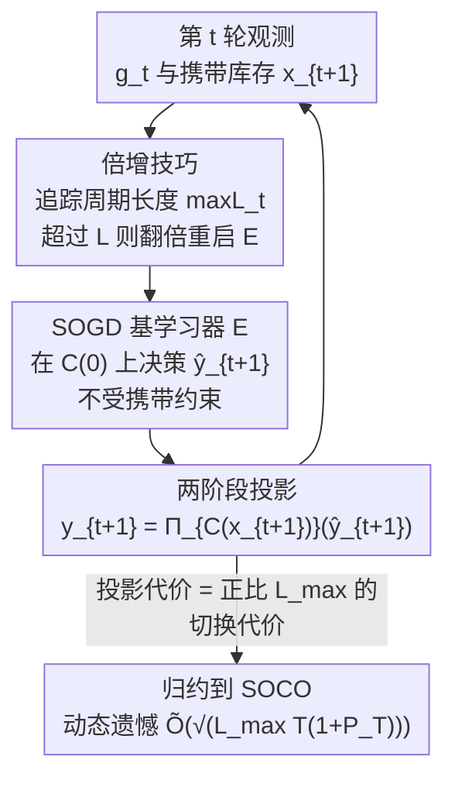

# Online Inventory Optimization in Non-Stationary Environment

**会议**: ICLR 2026  
**OpenReview**: [https://openreview.net/forum?id=mkl9iIXIr2](https://openreview.net/forum?id=mkl9iIXIr2)  
**代码**: 待确认  
**领域**: 学习理论 / 在线凸优化  
**关键词**: 在线库存优化, 动态遗憾, 在线凸优化, 平滑在线优化, 切换代价

## 一句话总结
本文为非平稳需求下的在线库存优化（OIO）提出了一个"两阶段投影 + 倍增技巧"的算法，把携带库存约束转化为与售罄周期成比例的切换代价，从而把 OIO 归约到平滑在线凸优化（SOCO），首次给出近最优的动态遗憾界 $\tilde{O}(\sqrt{L_{\max}T(1+P_T)})$，并配上匹配下界 $\Omega(\sqrt{L_{\max}T})$。

## 研究背景与动机

**领域现状**：库存管理是供应链中的核心问题。当需求模型未知时，主流做法是把"周期性补货 + 携带库存"的库存系统建模成在线凸优化（OCO）：每一轮决策者先定一个补货目标水位 $y_t$，环境再揭示一个凸损失（如报童损失 $\ell_t(y)=|y-d_t|$）和一个次梯度 $g_t$。Hihat et al. (2023) 把这套框架进一步形式化为在线库存优化（OIO），并提出 MaxCOSD 算法，证明了亚线性的**静态遗憾**。

**现有痛点**：现有 OIO 算法几乎都只保证**静态遗憾**——即和一个固定的最优水位 $u$ 作比较，$\sum_t\ell_t(y_t)-\min_{u}\sum_t\ell_t(u)$。但在需求波动的非平稳环境里，"固定水位"这个参照系本身就不合理。作者举了一个直白的例子：单品系统，需求 $d_t=Dt/T$ 线性增长，报童损失下固定水位的最优总损失是 $O(DT)$，而逐时变化的参照 $u_t=d_t$ 总损失为 $0$。这意味着哪怕你有 $O(\sqrt{T})$ 静态遗憾的算法，相对真正想追的时变参照仍可能吃下 $\Omega(T)$ 的遗憾。

**核心矛盾**：要在非平稳环境衡量算法，应该用**动态遗憾** $R_T(u_1,\dots,u_T)=\sum_t\ell_t(y_t)-\sum_t\ell_t(u_t)$，它允许参照序列 $u_1,\dots,u_T$ 逐轮变化。标准 OCO 里已有成熟的两层结构（meta + base learner）能达到 $O(\sqrt{(1+P_T)T})$ 动态遗憾，$P_T=\sum_{t\ge 2}\|u_{t-1}-u_t\|_1$ 是参照的路径长度。但 OIO 多了一道**携带库存约束**：水位 $y_t$ 必须不小于上一轮剩下的库存 $x_t$，而参照 $u_t$ 不受此约束。于是 $u_t$ 的可行域永远是 $y_t$ 可行域的超集，标准 OCO 算法只对"同可行域内的参照"给保证，硬套就会因 $\hat{u}_t$ 与 $u_t$ 的差距吃下 $O(T)$ 遗憾。更糟的是，朴素地把 MaxCOSD 当 base learner 塞进两层结构会**自相矛盾**：meta 给的 $y_t$ 可能比某个 base learner 的输出 $y_t^a$ 大，需求一小，携带库存 $x_{t+1}$ 就可能超过 $y_t^a$，违反 base learner 自身"$x_t\le y_{t-1}$"的假设，理论保证随之崩塌。

**本文目标**：在携带库存约束 + 仓库容量（线性和）约束下，构造一个**无需事先知道 $L_{\max}$ 和 $P_T$** 的算法，使其动态遗憾达到 $\tilde{O}(\sqrt{L_{\max}T(1+P_T)})$，并顺带把静态遗憾从现有工作的 $O(L_{\max}\sqrt{T})$ 改进到 $\tilde{O}(\sqrt{L_{\max}T})$（省下一个 $\sqrt{L_{\max}}$ 因子）。

**核心 idea**：用一个**两阶段投影**——base learner 只在"只含容量约束"的可行域 $C(0)$ 上自由决策 $\hat{y}_{t+1}$，再把它投影到含携带约束的可行域 $C(x_{t+1})$ 得到真正下单的 $y_t$。作者证明这步投影付出的代价恰好是一个**与售罄周期 $L_{\max}$ 成比例的切换代价**，于是 OIO 被干净地归约成了平滑在线凸优化（SOCO）。

## 方法详解

### 整体框架

问题设定（Alg. 1）：$N$ 个商品，库存向量取值于凸集 $C\subset\mathbb{R}^N_{\ge 0}$。每轮 $t$：① 补货到上一轮定的水位 $y_t$；② 环境揭示携带库存 $x_{t+1}$（满足 $x^i_{t+1}=\max(0,y^i_t-d^i_t)\le y^i_t$）和次梯度 $g_t\in\partial\ell_t(y_t)$；③ 决策者定下一轮水位 $y_{t+1}\in C(x_{t+1})$。可行域定义为
$$C(x):=\Big\{y\in[0,D]^N \;\Big|\; y^i\ge x^i\ \forall i,\ \textstyle\sum_{i}y^i\le D\Big\},$$
即同时受携带库存下界 $y^i\ge x^i$ 和仓库容量线性约束 $\sum_i y^i\le D$ 限制。次梯度有界 $\|g_t\|_2\le G$。注意一个工程细节：报童损失的缺货惩罚 $p\max(0,d_t-y_t)$ 对 $y_t$ 是线性的，所以**只要观测到是否缺货就能算出次梯度，无需知道真实需求量**——这让算法在"丢失型缺货、需求不可观测"的零售场景里也能用。

本文方法（Alg. 2）的整条流水线非常简洁：每轮把 $g_t$ 喂给 base learner $E$，拿到只考虑容量约束的决策 $\hat{y}_{t+1}\in C(0)$，再投影到含携带约束的可行域得到 $y_{t+1}=\Pi_{C(x_{t+1})}(\hat{y}_{t+1})$；与此并行，算法追踪当前"周期长度"$\max L_t$，一旦超过当前参数 $L$ 就把 $L$ 翻倍并重启 base learner。整套分析的骨架是：**两阶段投影**让真实决策的遗憾被 base learner 决策的遗憾控制（Lemma 1），代价是一个正比于周期长度的切换代价；**倍增技巧**在不知道 $L_{\max}$ 的情况下自适应地校准这个切换代价；最后选一个面向 SOCO 的 base learner（SOGD），就能在不知道 $P_T$ 的情况下拿到近最优动态遗憾。

### 关键设计

**1. 两阶段投影：把携带库存约束从基学习器里彻底剥离**

朴素两层结构失败的根因是 base learner 的输出会被携带库存约束"污染"，导致其内部假设 $x_t\le y_{t-1}$ 被破坏。本文的做法是让 base learner $E$ **完全无视携带库存**，只在仅含仓库容量约束的可行域 $C(0)=\{y\in[0,D]^N\mid\sum_i y^i\le D\}$ 上决策 $\hat{y}_{t+1}$；携带约束则交给第二阶段的投影 $y_{t+1}=\Pi_{C(x_{t+1})}(\hat{y}_{t+1})$ 来满足。关键区别在于：与 MaxCOSD"只有当候选 $\hat{y}_t$ 可行时才更新 $y_t$"的循环更新不同，本文**即使 base learner 的决策 $\hat{y}_t$ 不可行，也允许真实水位 $y_t$ 改变**——base learner 的决策始终独立于携带库存，从而保住了它自身的理论保证。

**2. OIO↔SOCO 归约：投影代价表现为正比于周期长度的切换代价（Lemma 1）**

剥离之后还要回答：真实下单的 $y_t$ 和 base learner 想要的 $\hat{y}_t$ 之间差出来的遗憾要怎么补偿？作者引入"周期（cycle）"概念：对商品 $i$，一个周期是 $\hat{y}^i_t$ 因携带库存 $x^i_t$ 太高而无法实现（即 $y^i_t>\hat{y}^i_t$）的连续时段，周期长度记为 $L^i_t$。核心引理给出
$$\sum_{t=1}^{T}\langle g_t,\,y_t-\hat{y}_t\rangle \;\le\; 2G\sum_{t=1}^{T}\Big(\max_{i\in[N]}L^i_t\Big)\,\|\hat{y}_t-\hat{y}_{t+1}\|_1 .$$
也就是说，真实决策相对 base learner 决策多吃的遗憾，被一个**切换代价**项控住，其系数正比于当前周期长度 $L^*_t=\max_i L^i_t$。于是整体动态遗憾可写成
$$R_T\le\sum_{t=1}^T\big(\langle g_t,\hat{y}_t-u_t\rangle+2GL^*_t\|\hat{y}_t-\hat{y}_{t+1}\|_1\big),$$
右边正是一个 **SOCO 问题的动态遗憾**：base learner 选 $\hat{y}_t\in C(0)$、承受损失 $\langle g_t,\hat{y}_t\rangle$ 和切换代价 $2GL^*_{t-1}\|\hat{y}_{t-1}-\hat{y}_t\|_1$。这一步是全文的"枢纽"——它把 OIO 特有的、动态变化的携带库存约束，转译成了 SOCO 里研究透彻的切换代价，从而能直接复用 SOCO 的成熟算法。与标准 SOCO 的差别有两点：系数 $L^*_t$ 是时变的、且**延迟可观测**（只有当某商品的周期结束后才知道它的长度），切换代价用的是 $\ell_1$ 范数而非 $\ell_2$。

**3. 未知切换代价的倍增技巧：周期长度被售罄周期 $L_{\max}$ 封顶**

切换代价系数 $L^*_t$ 事先未知且延迟可观测，没法直接拿来设学习率。本文用倍增技巧处理：维护一个参数 $L$，实时追踪已观测到的最大周期长度 $\max L_t$（只需 $O(N)$ 内存，因为算法只用到最大值），一旦 $\max L_t>L$ 就令 $L\leftarrow 2L$ 并以新参数重启 base learner。能这么做的底气来自一个关键的环境刻画——**售罄周期** $L_{\max}$（Definition 1）：
$$L_{\max}:=\min\Big\{L\in[T]\ \Big|\ \textstyle\sum_{s=t}^{\min(t+L-1,T+1)}d^i_s\ge D,\ \forall t\in[T],\,\forall i\in[N]\Big\},$$
直观说就是"任意连续 $L_{\max}$ 轮内每个商品至少卖出 $D$ 件"。对静态需求 $d^i$，$L_{\max}=\lceil D/d^i\rceil$。Lemma 2 证明：**任何周期长度都不超过 $L_{\max}$**——因为携带库存最多在一个售罄周期内被消化掉。于是倍增最多触发 $O(\log L_{\max})$ 次，参数 $L$ 稳定在 $O(L_{\max})$ 量级。Theorem 2 给出统一结论：若 base learner 的遗憾界能分解为 $L^\alpha R(T)$ 且切换代价 $\le O(L^{-\beta})$，则 Alg. 2 的遗憾 $\le C(\alpha)R^{E(2L_{\max},T)}+\Delta(L_{\max},\beta)$，其中倍增带来的额外开销 $\Delta$ 是 $O(L_{\max}\log L_{\max})$ 量级（$\beta=1$ 时），对足够长的时域 $T>L_{\max}\log^2 L_{\max}$ 可忽略。

**4. SOGD 基学习器 + 匹配下界：无需知道 $P_T$ 的近最优动态遗憾**

最后要选具体的 base learner。最简单的在线梯度下降（OGD，Alg. 3）配上 $L$ 参数化学习率 $\eta=\sqrt{\tfrac{2D(3D+P_T)}{G^2(\sqrt{N}L+1/2)T}}$ 已能给出 $O(\sqrt{L_{\max}(1+P_T)T}+L_{\max}\log L_{\max})$（Theorem 3），但它要求事先知道 $P_T$ 来设学习率，而 $P_T$ 取决于未来需求、难以预知。为此本文采用 Zhang et al. (2022a) 的**平滑在线梯度下降 SOGD**（Alg. 5）：meta 算法用 Discounted-Normal-Predictor 自适应地聚合多个学习率不同的 OGD 专家，无需 $P_T$ 先验即可得到 $R_T\le O(\sqrt{L_{\max}(1+P_T)T\log T}+L_{\max}\log L_{\max})$（Theorem 4），代价是每轮计算量比 OGD 多一个 $\log T$ 因子。与之配套，本文**首次为 OIO 给出 $\Omega(GD\sqrt{L_{\max}T})$ 的下界**（Theorem 5）：对任意算法都存在某个对抗序列使遗憾不低于该量级。上下界相匹配，证明 $\tilde{O}(\sqrt{L_{\max}T})$ 已近最优，回答了 Hihat et al. (2023) 留下的开放问题；作为副产物，它还反过来给出了 SOCO 中 $\sqrt{L}$ 因子的最优性（Corollary 1：SOCO 下界为 $\Omega(\sqrt{LT})$）。

## 实验关键数据

本文是一篇**纯理论工作**，没有数值实验，"关键数据"即各项遗憾界与现有工作的对比。

### 主结果：遗憾界对比

下表把各文献的需求刻画参数统一换算成本文的指标 $L_{\max}$ 后做对比（S/M 表示单/多商品，NV/O/F 表示报童/过期/固定成本损失）。

| 工作 | 遗憾类型 | 上界 | 下界 | 商品 | 容量约束 | 需求 |
|------|---------|------|------|------|---------|------|
| Huh & Rusmevichientong (2009) | 静态 | $O(L_{\max}\sqrt{T})$ | — | 单 | 区间 | i.i.d. |
| Zhang et al. (2018a) | 静态 | $O(L_{\max}\sqrt{T})$ | $\Omega(\sqrt{T})$ | 单 | 区间 | i.i.d. |
| Agrawal & Jia (2022) | 静态 | $\tilde{O}(\sqrt{T}+L_{\max})$ | — | 单 | 区间 | i.i.d. |
| Hihat et al. (2023) | 静态 | $O(L_{\max}\sqrt{T})$ | — | 多 | 凸 | non-i.i.d. |
| **本文** | **静态** | $\tilde{O}(\sqrt{L_{\max}T})$ | $\Omega(\sqrt{L_{\max}T})$ | 多 | 线性 | non-i.i.d. |
| **本文** | **动态** | $\tilde{O}(\sqrt{L_{\max}(1+P_T)T})$ | $\Omega(\sqrt{(1+P_T)T})$ | 多 | 线性 | non-i.i.d. |

### 不同 base learner 的结果

| Base learner | 动态遗憾上界 | 是否需 $P_T$ 先验 | 每轮计算 |
|--------------|-------------|------------------|---------|
| OGD（Alg. 3, Theorem 3） | $O(\sqrt{L_{\max}(1+P_T)T}+L_{\max}\log L_{\max})$ | 需要 | $O(1)$ |
| SOGD（Alg. 5, Theorem 4） | $O(\sqrt{L_{\max}(1+P_T)T\log T}+L_{\max}\log L_{\max})$ | 不需要 | $O(\log T)$ |

### 关键发现
- **静态遗憾改进 $\sqrt{L_{\max}}$**：现有工作普遍是 $O(L_{\max}\sqrt{T})$，本文做到 $\tilde{O}(\sqrt{L_{\max}T})$，把对 $L_{\max}$ 的依赖从线性降到平方根；且配上 $\Omega(\sqrt{L_{\max}T})$ 下界证明其最优。
- **首个动态遗憾保证**：在线性容量约束下，此前没有任何工作能在非平稳环境给出有理论保证的 OIO 算法，本文的 $\tilde{O}(\sqrt{L_{\max}(1+P_T)T})$ 填补了空白；当路径长度 $P_T$ 亚线性时遗憾即亚线性。
- **$L_{\max}=\Omega(T)$ 时不可能亚线性**：下界分析同时表明，若售罄周期长到 $\Omega(T)$（需求长期过小、被迫长期承担持有成本），亚线性遗憾根本无法达到——这刻画了"非平稳"问题可解的边界。

## 亮点与洞察
- **把"约束差异"转译成"切换代价"**：本文最漂亮的一招是 Lemma 1——OIO 难在 $y_t$ 与参照 $u_t$ 不同可行域，作者用两阶段投影把这个差异精确地表达成正比于周期长度的切换代价，从而无缝接入 SOCO 的现成工具箱。这种"把领域特有约束翻译成已研究问题里的某个标准项"的归约思路，可迁移到其他带状态约束的在线决策问题。
- **$L_{\max}$ 这个环境指标设计得恰到好处**：它只在"决定 $L_{\max}$ 的那段窗口"约束需求波动，其余轮次完全不限制波动——既给了分析抓手，又不过度限制非平稳性，比直接限制需求方差之类的指标更贴合库存语义。
- **上下界互相约束的副产物**：因为 OIO 与 SOCO 被证明等价连接，OIO 的下界反过来证明了 SOCO 里 $\sqrt{L}$ 因子的最优性——一个领域的下界约束了另一个领域，是个有意思的结构性观察。
- **次梯度只需观测"是否缺货"**：利用报童损失对 $y_t$ 的线性性，算法无需知道真实需求量就能更新，直接对接了零售场景里"缺货需求不可观测"的现实约束。

## 局限与展望
- **未考虑提前期（lead time）和固定订货成本**：现实库存系统下单到到货有延迟、每次下单有固定成本，本文设定都未涵盖；i.i.d. 需求下已有相关工作，但非平稳环境下的扩展仍是开放问题。
- **依赖线性容量约束**：本文把容量约束限定为线性和 $\sum_i y^i\le D$（Hihat et al. 2023 允许一般凸约束），这是 Lemma 5/6 证明的关键。作者认为可推广到一般凸集但留作未来工作——这是相对前作在"约束一般性"上的一处退让。
- **计算开销有 $\log T$ 因子**：为压低动态遗憾，SOGD 的 meta 算法每轮计算量是 $O(K T)=O(T\log T)$ 量级，比朴素 OGD 贵一个 $\log T$；这是非平稳 OCO/SOCO 用 meta 算法的通病。
- **遗憾界含对数因子且 $\tilde{O}$ 隐藏常数**：动态遗憾的 $\sqrt{\log T}$ 因子与上界并非严格匹配下界，能否去掉这个对数因子值得进一步研究。

## 相关工作与启发
- **vs MaxCOSD (Hihat et al., 2023)**：同一 OIO 设定的前作，用"候选可行才更新"的循环更新只拿到静态遗憾 $O(L_{\max}\sqrt{T})$。本文允许 base learner 不可行时也更新 $y_t$，既把静态遗憾改进到 $\tilde{O}(\sqrt{L_{\max}T})$，又首次给出动态遗憾；代价是把一般凸约束收紧为线性约束。
- **vs 标准两层动态遗憾算法（Ader, Zhang et al., 2018b）**：标准 OCO 的两层结构能达 $O(\sqrt{(1+P_T)T})$，但直接拿来做 OIO base learner 会因携带库存破坏其假设而失效。本文的两阶段投影 + SOCO 归约绕开了这个矛盾。
- **vs SOCO 系列（Lin et al., 2011；Zhang et al., 2021/2022a）**：本文把 OIO 归约到 SOCO 后，直接复用 SOGD 作为 base learner；反过来又用 OIO 的下界证明了 SOCO 中 $\sqrt{L}$ 因子的最优性，双向互惠。

## 评分
- 新颖性: ⭐⭐⭐⭐⭐ 首次给出 OIO 的近最优动态遗憾界 + 首个 $\Omega(\sqrt{L_{\max}T})$ 下界，两阶段投影把 OIO 干净归约到 SOCO 的思路漂亮。
- 实验充分度: ⭐⭐⭐ 纯理论工作，无数值实验，但上下界匹配、与现有工作对比清晰，理论层面的"充分度"到位。
- 写作质量: ⭐⭐⭐⭐ 动机用具体反例引出、归约脉络（Lemma 1→2→Theorem 2→4）层层递进，可读性好。
- 价值: ⭐⭐⭐⭐ 解决了 Hihat et al. (2023) 的开放问题，对非平稳库存管理的在线学习理论有实质推进。

<!-- RELATED:START -->

## 相关论文

- [\[ICLR 2026\] Discounted Online Convex Optimization: Uniform Regret Across a Continuous Interval](discounted_online_convex_optimization_uniform_regret_across_a_continuous_interva.md)
- [\[ICLR 2026\] Scalable Random Wavelet Features: Efficient Non-Stationary Kernel Approximation with Convergence Guarantees](scalable_random_wavelet_features_efficient_non-stationary_kernel_approximation_w.md)
- [\[ICLR 2026\] Towards a Theoretical Understanding of In-Context Learning: Stability and Non-i.i.d. Generalisation](towards_a_theoretical_understanding_of_in-context_learning_stability_and_non-iid.md)
- [\[ICLR 2026\] Non-Asymptotic Analysis of (Sticky) Track-and-Stop](non-asymptotic_analysis_of_sticky_track-and-stop.md)
- [\[ICLR 2026\] Pseudo-Non-Linear Data Augmentation: A Constrained Energy Minimization Viewpoint](pseudo-non-linear_data_augmentation_a_constrained_energy_minimization_viewpoint.md)

<!-- RELATED:END -->
