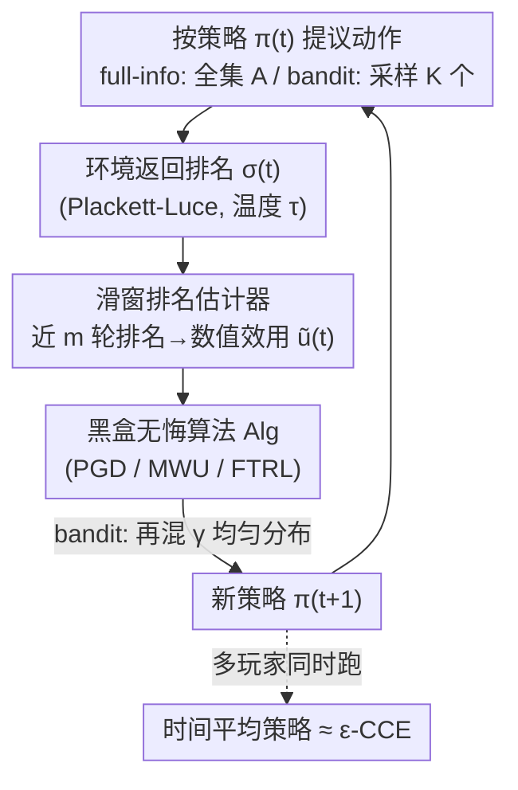

# Online Learning and Equilibrium Computation with Ranking Feedback

**会议**: ICLR 2026  
**OpenReview**: [https://openreview.net/forum?id=lg6H2oJPky](https://openreview.net/forum?id=lg6H2oJPky)  
**代码**: 待确认  
**领域**: 在线学习 / 博弈论 / 学习理论  
**关键词**: 在线学习, 排名反馈, 无悔学习, 粗相关均衡, Plackett-Luce 模型

## 一句话总结
本文把经典的"数值效用反馈"在线学习推广到只能看到**动作排名**的场景，先证明在对抗环境下纯排名反馈何时根本不可能做到 sublinear regret，再构造一套"从排名估计效用 + 黑盒喂进任意无悔算法"的模算法，在效用变化受限的假设下拿到 sublinear regret，并进一步保证多玩家重复博弈收敛到近似粗相关均衡（CCE），最后用一个在线 LLM 路由实验验证。

## 研究背景与动机

**领域现状**：在线学习是序贯决策在任意、甚至对抗环境下的标准模型。每一轮 agent 给出一个混合策略、采取动作、然后从环境拿到反馈——通常是**数值**形式，比如 full-information 下的效用向量 $u^{(t)}\in[-1,1]^A$，或 bandit 下采样动作的标量效用 $u^{(t)}(a^{(t)})$。一旦反馈是数值的，PGD / MWU / FTRL 等算法都能保证 external regret 随时间 sublinear 增长（no-regret）；而且只要博弈中所有玩家都跑 no-regret 算法，时间平均策略就逼近一个粗相关均衡（CCE）。

**现有痛点**：现实里"数值效用"经常拿不到。当反馈来自人时，让人**比较/排序**几个候选远比给出校准的数值打分容易（RLHF 的成功就是例证）；即使存在良定义的数值效用，出于隐私或安全也可能对学习方不可见。比如一个推荐平台对源源不断到来的顾客推荐商品，顾客愿意排序却不愿透露真实估值——平台只能拿到一个**排名**。但排名反馈下在线学习的根本极限和算法解一直是空白。

**核心矛盾**：排名是对效用的**有损、非线性**观测。Plackett-Luce 这类排名模型的温度 $\tau$ 越小，排名越确定，越只反映"谁大谁小"而丢掉效用差的幅度信息；$\tau$ 越大排名越接近均匀采样，同样和真实效用脱钩。再叠加对抗环境里效用向量可以任意快地变化，单看一串排名很可能根本无法把效用估准——这意味着 no-regret 未必能做到。

**本文目标**：拆成两个子问题——(1) 在非随机/对抗环境下，纯排名反馈**什么时候不可能**实现 sublinear regret？(2) 当可能时，怎么构造同时具备 regret 最小化与均衡逼近保证的算法？

**切入角度**：作者按"排名是怎么生成的"把反馈分成两类——按**当前瞬时效用**排名（InstUtil Rank，对应一次性/无记忆用户）和按**时间平均效用**排名（AvgUtil Rank，对应长期、有记忆的用户），并在 full-information 与 bandit 两种设定下分别分析。

**核心 idea**：先用 hardness 实例划出可行边界（哪类反馈、多大 $\tau$ 下注定失败），再在"效用总变差 sublinear"这个温和假设下，用**滑窗排名估计器**把排名翻译回数值效用、然后**黑盒**地喂进任意现成无悔算法，从而把排名反馈问题模约化为已经被解决的数值反馈问题。

## 方法详解

### 整体框架

整篇工作分两块：**负面结果**先回答"何时不可能"，**正面算法**再回答"可能时怎么做"。负面部分构造对抗效用序列证明 InstUtil Rank 在任意 $\tau\le O(1)$ 下都做不到 sublinear regret、AvgUtil Rank 在 $\tau$ 足够小时也做不到；这逼出一个温和假设——效用总变差 sublinear（Assumption 4.2），在这个假设下问题才变得可解。

正面算法是一个**每轮循环的模管线**，核心是把"排名→效用"的估计和"效用→策略"的更新解耦：每一轮 agent 按当前策略 $\pi^{(t)}$ 提议一个动作多重集 $o^{(t)}$（full-information 提议整个动作集 $A$，bandit 按 $\pi^{(t)}$ 独立有放回采样 $K$ 个），环境返回一个排名 $\sigma^{(t)}$；**滑窗排名估计器**（Algorithm 1）用最近 $m$ 轮的排名估出数值效用 $\tilde u^{(t)}$；这个估计被当作"伪数值反馈"喂进**任意一个 numeric no-regret 黑盒算法** Alg（PGD / MWU / FTRL 都行），输出下一轮策略；bandit 下再混入 $\gamma$ 比例的均匀分布保证探索。整套机制让最终 regret 被"理想数值算法的 regret + 估计误差"两项控住。

### 关键设计

**1. 可行性边界：用对抗实例划出排名反馈何时注定失败**

这是回答"为什么需要额外假设"的根。作者构造 hardness 实例证明：在 **InstUtil Rank** 下，对任意 $0<\tau\le O(1)$，存在效用序列使任何算法的期望 regret 都是 $\Omega(T)$（full-information 与 bandit 皆然）。证明思路是造两条效用序列，它们在 InstUtil 下**期望产生同样的排名**，于是算法无法区分，但在其中一条上无悔就必然在另一条上线性后悔。对 **AvgUtil Rank**，当 $\tau\le O(1/(T\log T))$ 时仍有 $\tilde\Omega(T)$ 下界（构造 $\log T$ 条诱导相同排名的序列，至少一条平均 regret 为 $\tilde\Omega(1)$）；bandit 下还有更强的 $\Omega(T)$ 下界、允许更大的 $\tau\le O(1/\log T)$，它实际上加强了 Maran et al. (2024) 在 $\tau\to0^+$ 的对抗 bandit 结果。这些 hardness 的共同根因都是"效用变化太快"，于是引出关键假设——**效用总变差 sublinear**：

$$P^{(T)} := \sum_{t=2}^{T}\left\lVert u^{(t)}-u^{(t-1)}\right\rVert \le O(T^q),\quad q<1. \tag{4.2}$$

值得注意的是，在博弈里若对手都跑 FTRL 这类常见无悔算法，这个假设自动满足。

**2. 滑窗排名估计器：把非凸排名拆成 pairwise 比较再反演 logistic**

痛点是 Plackett-Luce 关于效用是**非凸**的，直接最大似然估效用既不稳又难给误差界。作者的做法（Algorithm 1）是用最近 $m$ 轮排名 $\{\sigma^{(s)}\}_{s=t-m+1}^{t}$，把每个长度 $K$ 的排名**分解成成对比较**——一对动作谁排在前，概率恰好是 logistic 形式 $\Pr[a_i\succ a_j]=1/(1+e^{-(u(a_i)-u(a_j))/\tau})$。利用 logistic 映射的单调可逆性，就能把"排名概率的经验估计误差"反演回"效用估计误差"。它给出的高概率误差界（Theorem 5.1）大致是

$$\left\lVert \tilde u^{(t)}-u^{(t)}\right\rVert_\infty \le \tau\big(e^{1/\tau}+1\big)^2\frac{1}{p}\sqrt{\frac{\log(4|A|/\delta)}{m'}} + \sum_{s=t-m'+1}^{t-1}\left\lVert u^{(s+1)}-u^{(s)}\right\rVert_\infty,$$

把 $\delta,p,\tau$ 当常数后，累计估计误差被 $O\!\big(T/\sqrt{m'}+m'P^{(T)}\big)$ 控住——只要 $P^{(T)}$ sublinear（设计 1 的假设），累计估计误差就 sublinear。这个界还揭示了一个直觉一致的现象：$\tau\to0^+$ 时排名几乎确定、丢掉效用差信息，界发散；$\tau\to+\infty$ 时排名近似均匀、与效用无关，界也发散——存在一个"信息最丰富"的中间温度。AvgUtil 下同样复用这个估计器，且因为时间平均的相邻差 $\lVert u^{(t)}_{\text{avg}}-u^{(t-1)}_{\text{avg}}\rVert_\infty\le 2/t$ 天然衰减，估计误差里那一项可被 $\sum 1/(s+1)$ 控住，与 $P^{(T)}$ 无关。

**3. 黑盒归约：把估计效用当数值反馈喂进任意无悔算法 + 探索混合**

有了 $\tilde u^{(t)}$，作者不重新设计学习算法，而是把它当作"伪数值反馈"喂进**任意现成的 numeric no-regret oracle** Alg。full-information 下提议整个动作集（$p=1$），直接用 Algorithm 2，regret 被拆成"理想数值算法的 regret + 估计误差"：

$$R^{(T),\text{external}} \le R^{(T),\text{external}}\!\big(\text{Alg},\{\tilde u^{(t)}\}\big)+O\!\Big(P^{(T)\,1/3}T^{2/3}(\log\tfrac{T}{\delta})^{1/3}\Big).$$

bandit 下只有被提议的动作能被评估，agent 的"效用"是被提议动作的平均效用，对应 regret 定义

$$R^{(T)} := \max_{\hat\pi\in\Delta_A}\sum_{t=1}^{T}\Big(\langle u^{(t)},\hat\pi\rangle - \tfrac{1}{K}\textstyle\sum_{a\in o^{(t)}}u^{(t)}(a)\Big). \tag{3.1}$$

为保证每个动作都有正概率被探索到，下一轮策略取无悔算法输出与均匀分布的凸组合 $\pi^{(t+1)}=(1-\gamma)\,\text{Alg}(\{\tilde u^{(s)}\})+\gamma\,\mathbf 1(A)/|A|$，从而 bandit regret 加上一个 $O\big(P^{(T)\,1/5}T^{4/5}\log\frac{T}{\delta}\big)$ 的额外项。只要 $P^{(T)}$ sublinear，两种设定的 regret 都 sublinear。这种黑盒模化的好处是：算法设计者无须为排名反馈从头造轮子，所有现成数值无悔算法的进展都能直接复用。

**4. AvgUtil 的稳定性要求与分块去偏，以及从无悔到 ε-CCE 均衡**

AvgUtil 比 InstUtil 更微妙，因为排名基于**累计平均效用**，估计要在累计扰动下稳。作者要求 oracle 满足稳定性 Assumption 6.1（输出对累计效用是 Lipschitz，常数 $L=\Theta(T^{-c})$），FTRL 配任意强凸正则即满足；此时 full-information 下不需要 sublinear variation 假设也能拿到 sublinear regret（额外项 $O(LT^{5/3}\log\frac{T}{\delta})$，取 $c>2/3$ 即可）——这正好补上了"$\tau$ 为常数时 AvgUtil 可解"的缺口。bandit 下用 Algorithm 1 只能估到经验均值 $u^{(t)}_{\text{empirical}}$ 而非真平均，朴素地用 $n^{(t)}(a)$ 反推单轮效用会因 $n^{(t)}(a)\propto t$ 导致方差爆炸，于是作者把时间轴切成长度 $M$ 的**分块**、在块内做差分估计，让乘子从 $\propto t$ 降到 $\propto t/M$，用 $M$ 调出一个偏差-方差折中（块越长方差越小但块内效用变化引入的偏差越大）。最后是均衡：当所有玩家都跑本文算法，时间平均联合策略是 $\epsilon$-CCE，$\epsilon:=\max_i\frac{1}{T}R^{(T),\text{external}}_i$；只要每个玩家 regret sublinear，$\epsilon\to0$。要让 $P^{(T)}$ 在博弈里 sublinear，oracle 还需策略变化 sublinear（Assumption 7.1，镜像下降与 FTRL 均满足）。一个有意思的注记是：即便在线学习在小 $\tau$ 下不可能（设计 1 的下界），**计算均衡在 $\tau\to0^+$ 时仍然可能**。

## 实验关键数据

论文以理论为主，实验做的是一个**在线 LLM 路由**的应用示例：服务方手里有多个各有所长的 LLM（如 GPT-4o 擅长创作、GPT-5 擅长编码），把"为某个用户选模型"建模成排名反馈在线学习——每轮按混合策略 $\pi^{(t)}$ 采样 $K$ 个模型生成候选回复，用户只返回回复之间的**排名**而非打分，目标是在线更新 $\pi^{(t)}$ 以逼近事后最优固定模型。

### 主实验（在线 LLM 路由）

| 设定 | 数据 / 模型 | 反馈 | 观察 |
|------|------------|------|------|
| Algorithm 3, AvgUtil + bandit | HH-RLHF prompt；Qwen3-32B / Phi-4 / GPT-4o / Llama-3.1-70B 生成回复，DeBERTa reward model 打分 | 排名（由 reward 向量诱导） | 平均 regret 随 $t$ 单调下降，快速逼近"始终用事后最优固定模型"的表现 |

### 温度 / 提议数敏感性

| 变量 | 取值 | 现象 |
|------|------|------|
| 温度 $\tau$ | 0.5 / 1.0 / 2.0 | 三档下平均 regret 均随时间下降；曲线随 $\tau$ 略有差异，印证存在"信息最丰富"的中间温度 |
| 提议数 $K$ | 2 / 3 / 4 | $K$ 越大每轮信息越多，平均 regret 收敛更快、终值更低 |

### 关键发现
- **平均 regret 单调下降**直接验证了理论：在效用变化受限时，纯排名反馈足以让路由器逼近事后最优固定模型。
- $\tau$ 和 $K$ 的影响与估计误差界一致——$\tau$ 太小/太大都损失信息、$K$ 越大估计越准，呼应 Theorem 5.1 中误差对 $\tau$、提议概率 $p$ 的依赖。
- 更多在线学习与均衡计算的合成实验放在附录 C。

## 亮点与洞察
- **"先划边界、再造算法"的范式**：很多在线学习论文只给上界，本文先用对抗实例证下界、把"何时不可能"讲清楚，再针对性地引入最小假设（sublinear variation）把缺口补上，可行边界和算法保证一一对应，逻辑闭环很干净。
- **排名→pairwise→logistic 反演的估计技巧**：绕开 Plackett-Luce 的非凸性，把排名拆成成对比较、再用 logistic 单调可逆把概率误差翻译成效用误差，是处理"有损序数反馈"的可复用套路。
- **黑盒模化**：把排名问题约化为数值反馈问题，让所有现成无悔算法（PGD/MWU/FTRL）即插即用——意味着数值在线学习的任何进展都能零成本迁移到排名反馈场景。
- **温度的双向退化**：$\tau\to0^+$（太确定）和 $\tau\to+\infty$（太随机）都让估计变差，存在中间最优温度，这个"序数反馈的信息论甜区"直觉对 RLHF 偏好建模也有启发。

## 局限性 / 可改进方向
- **依赖 sublinear total variation 假设**：InstUtil 与小 $\tau$ 的 AvgUtil 在对抗环境下本质不可解，正面结果都要求效用变化不能太快；环境若高度非平稳则不适用。
- **regret 阶数偏松**：诸如 $O(P^{(T)\,1/3}T^{2/3})$、bandit 下 $T^{4/5}$、$T^{23/18}$ 等界离 $\sqrt T$ 还有距离，是否最优、能否收紧未知。
- **PL 模型与温度已知的假设**：估计器用到 PL 结构与（隐含的）$\tau$ 信息，真实人类排名未必服从 PL，$\tau$ 未知时如何鲁棒估计是开放问题。
- **实验偏轻**：只有一个 LLM 路由 + 合成实验，缺真实人类排名、缺与其它 dueling/偏好学习基线的横向对比。

## 相关工作与启发
- **vs 对抗 dueling bandits（Saha et al. 2021 等）**：dueling bandits 也用排名/比较反馈并沿用"按策略采样提议动作"的机制，但它们的 regret 定义不同；本文用的是标准 external regret（式 3.1），并把单纯比较推广到长度 $K$ 排名、覆盖 full-information 设定。
- **vs Maran et al. (2024) 的随机 bandit 排名反馈**：那是随机平稳环境、对应本文 $\tau\to0^+$ 的特例；本文推广到非随机/对抗环境，其 AvgUtil-bandit 下界实际上**加强**了对方的对抗结果（更大 $\tau$、无 log 项）。
- **vs 经典稳定匹配（Gale-Shapley 1962）**：在线约会/拼车等应用看似像稳定匹配，但本文是对抗序贯、目标是 CCE 均衡逼近而非一次性稳定匹配，设定根本不同（详见原文附录 A）。
- **vs RLHF**：RLHF 用人类偏好/排名微调模型印证了"排序比打分易得"的动机；本文给出了排名反馈下在线学习的可行边界与算法理论，可视作 RLHF 式序数反馈的理论侧补充。

## 评分
- 新颖性: ⭐⭐⭐⭐⭐ 首次系统刻画对抗环境下纯排名反馈在线学习的可行边界 + 黑盒算法 + 均衡保证
- 实验充分度: ⭐⭐⭐ 理论扎实，但实证只有一个 LLM 路由示例 + 合成实验，缺真实人类排名与基线对比
- 写作质量: ⭐⭐⭐⭐ 结构清晰，hardness 与正面结果对应明确，记号偏重但 Table 1 总结到位
- 价值: ⭐⭐⭐⭐⭐ 把数值反馈在线学习推广到序数反馈，理论框架可复用，对 RLHF/偏好学习与匹配平台都有指导意义

<!-- RELATED:START -->

## 相关论文

- [\[ICLR 2026\] Online Conformal Prediction with Adversarial Semi-bandit Feedback via Regret Minimization](online_conformal_prediction_with_adversarial_semi-bandit_feedback_via_regret_min.md)
- [\[ICLR 2026\] Differentially Private Equilibrium Finding in Polymatrix Games](differentially_private_equilibrium_finding_in_polymatrix_games.md)
- [\[ICLR 2026\] Online Decision-Focused Learning](online_decision-focused_learning.md)
- [\[ICLR 2026\] Toward Practical Equilibrium Propagation: Brain-Inspired Recurrent Neural Network with Feedback Regulation and Residual Connections](toward_practical_equilibrium_propagation_brain-inspired_recurrent_neural_network.md)
- [\[ICLR 2026\] Computing Equilibrium beyond Unilateral Deviation](computing_equilibrium_beyond_unilateral_deviation.md)

<!-- RELATED:END -->
