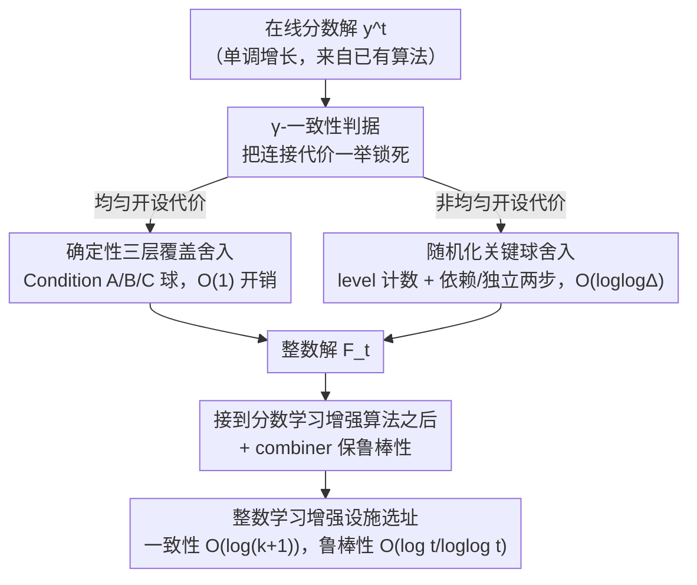

# Online Rounding and Learning Augmented Algorithms for Facility Location

**会议**: ICLR 2026  
**OpenReview**: [https://openreview.net/forum?id=euOVJEhflG](https://openreview.net/forum?id=euOVJEhflG)  
**代码**: 无（纯理论论文）  
**领域**: 学习增强算法 / 在线算法 / 聚类理论  
**关键词**: 设施选址, 在线舍入, 学习增强算法, 竞争比, 度量空间

## 一句话总结
本文给出了度量设施选址（facility location）问题的**首批在线舍入算法**——把一个在线维护的分数解就地舍成整数解：均匀开设代价情形用确定性算法只损失 $O(1)$ 常数因子，非均匀情形用随机化算法只损失 $O(\log\log\Delta)$ 期望因子（$\Delta$ 为度量的纵横比），并由此得到多预测（multiple predictions）下学习增强设施选址的首个整数算法，把一致性/鲁棒性界推到与分数解几乎吻合的紧界。

## 研究背景与动机
**领域现状**：聚类是无监督学习的核心问题，近年来大量研究关注**在线**版本——待聚类的点（称为 client/客户）不是一次给全，而是随时间逐个到达。设施选址是 $k$-median 的拉格朗日松弛：不再限制只能开 $k$ 个中心，而是允许开任意多个**设施（facility）**，每开一个付一份开设代价 $c(v)$，再加上每个客户连到最近设施的连接代价，目标是最小化两者之和。相比 $k$-median，它在在线场景里更"耐用"：开满了也不会失去竞争力，能产出稳定的聚类供下游 ML 模型使用。

**现有痛点**：在线设施选址早已被 Meyerson (2001) 提出并被反复研究，近年又叠加了"机器学习建议（ML advice）"这一新范式——算法每步会收到关于聚类解的预测，希望**预测好时表现好（一致性 consistency）、预测坏时也不太差（鲁棒性 robustness）**。问题在于：**分数版本**（每个设施可以"开一部分"，$y_v\in[0,1]$）已经有了几乎紧的界，但真正能落地用的**整数版本**（$y_v\in\{0,1\}$）一直比分数版本弱很多。已有最好的整数结果（Almanza et al. 2021）相比最优分数解有 $O(\log\log n)$ 的代价开销，而且要求**所有预测在任何客户到达前就全部给定**。

**核心矛盾**：把一个分数解"舍入"成整数解，在**离线**场景里是成熟技术，但在**在线**场景里极难——一旦开了设施就不能关（$F_1\subseteq F_2\subseteq\cdots$ 单调），分数解还在随时间增长，你必须在信息不全时就做不可撤销的整数决策。在非度量（non-metric）设施选址里，在线舍入本质上等价于 set cover，注定要损失对数因子。

**本文目标**：(1) 给出度量设施选址的在线舍入算法，把分数→整数的损失降到最小；(2) 用它把分数版本的学习增强结果"翻译"成整数版本，去掉 $O(\log\log n)$ 开销和"预测须预先给定"的限制。

**切入角度**：作者的关键观察是——**度量结构（三角不等式）是被前人浪费掉的资源**。non-metric 设施选址必须吃对数损失是因为它没有几何结构可用；而度量设施选址里，"附近的分数质量"和"附近是否已有开设设施"之间有强约束，可以用球（ball）的覆盖关系来组织舍入决策，从而把损失压到亚对数甚至常数。

**核心 idea**：把"舍得好不好"抽象成一个叫 **$\gamma$-一致性** 的局部几何条件——只要任何含有 $\geq 1/2$ 分数质量的球 $B(v,R)$ 附近 $\gamma R$ 内有一个开设的设施，连接代价就自动被控住；剩下的只需保证"别开太多设施"。这把一个全局优化问题拆成两个可分别证明的局部条件。

## 方法详解

### 整体框架
本文要解决的是：给定一个**在线、单调增长**的分数设施选址解 $y^t=(y^t_v)$，在每个客户到达时把它就地舍成一个整数设施集合 $F_t$，使得 $F_t$ 的总代价（开设 + 连接）只比分数解大一个尽量小的因子。整条管线分三段串起来：**先把"舍得好"形式化成 $\gamma$-一致性这个统一判据**（它一举锁死连接代价）；**再针对两种开设代价模型给两个具体舍入算法**（均匀代价用确定性三层覆盖，非均匀代价用随机化关键球）；**最后把舍入算法接到已有的分数学习增强算法后面**，得到整数版本的学习增强结果，并用一个 combiner 保住鲁棒性。

整篇论文的一个深刻结论是：**在线设施选址的难度全在"算出一个好的分数解"，而不在"舍入它"**——因为舍入只损失 $O(1)$（均匀）或 $O(\log\log\Delta)$（非均匀），分数和整数之间几乎没有鸿沟。

### 关键设计

**1. γ-一致性：把"舍得好不好"压缩成一个局部几何条件**

直接证明"整数解总代价 ≤ 常数 × 分数解总代价"很难，因为代价由开设和连接两部分纠缠而成。作者的做法是先把**连接代价**单独拎出来，用一个纯局部的判据控住。称整数解 $F_t$ 对分数解 $y^t$ 是 $\gamma$-一致的，当且仅当：对任意以 $v$ 为心、半径 $R$ 的球 $B=B_t(v,R)$，只要球内分数质量 $y^t(B)=\sum_{u\in B}y^t_u\geq 1/2$，则 $F_t$ 中存在一个开设设施落在 $v$ 的 $\gamma R$ 距离内。

这个条件之所以管用，是因为它直接蕴含连接代价的界（Lemma 1）：

$$\sum_{u\in V_t}\min_{v\in F_t}d(u,v)\ \leq\ 2\gamma\cdot\sum_{u\in V_t}\sum_{v\in V_t}d(u,v)\,x^t_{uv}.$$

证明思路很直观：若客户 $u$ 的分数连接代价是 $\beta$，则半径 $2\beta$ 的球 $B(u,2\beta)$ 内必然攒够 $\geq 1/2$ 的分数质量（否则它连不满 $\sum_v x^t_{uv}=1$），于是 $\gamma$-一致性保证 $u$ 在 $2\gamma\beta$ 内有开设设施，整数连接代价被分数连接代价 $\beta$ 的 $2\gamma$ 倍夹住。**这一步把整个问题简化成两件事**：(a) 让算法保持小常数 $\gamma$-一致；(b) 单独再证开设设施的数量不爆炸。后面两个算法都按这个套路走。

**2. 均匀代价：确定性三层覆盖舍入，只损失 O(1)**

当所有设施开设代价相同（标准化为 1）时，作者给出**确定性**算法（Theorem 2），舍入后整数代价只是分数代价的常数倍。核心是维持 **4-一致性**：只要某个球 $B_t(v,R)$ 质量 $\geq 1/2$ 且最近开设设施在 $>4R$ 外，就在 $v$ 开一个设施。但光这样会开太多，于是引入**三层覆盖**机制，按球的半径从大到小嵌套处理：

- **Level-1（Condition A 球）**：质量 $\geq 1/2$ 且最近设施 $>4R$——主区域，开一个设施。
- **Level-2（Condition B 球）**：在 level-1 球内、半径更小、质量 $\geq 1/4$ 且最近设施 $>3r$——补偿偏离中心的稠密子区域。
- **Level-3（Condition C 球）**：在 level-2 球内、半径更小、质量 $\geq 1/8$ 且最近设施 $>2\rho$——堵住孤立的小质量口袋。

为什么开这些额外设施反而能"省"？因为它们让**设施总数可被分数质量摊销**。关键引理是：同属一个 level-2 球的 level-3 球**两两不相交**（Lemma 3，用三角不等式反证），因而一个 level-2 球最多催生 **3 个** level-3 设施（Lemma 4：若有 $\geq 4$ 个，它们不相交的质量加起来 $\geq 4\cdot 1/8=1/2$，会撑出一个比 $B(v,R)$ 更小却也满足 Condition A 的球，与"$B(v,R)$ 是最小半径"矛盾）。再对 level-1/level-2 球用"前驱（predecessor）"论证：每开一个新设施，对应球都净增了 $\geq 1/4$ 或 $\geq 1/8$ 的新分数质量（Lemma 5、6），于是设施数可被 $\sum_v y_v$ 摊销。最终算出开设设施数 $\leq 36\cdot\sum_v y_v$（Theorem 7），连接代价由 4-一致性 + Lemma 1 控为分数的 8 倍（Theorem 8），合起来即 $O(1)$ 开销。

**3. 非均匀代价：随机化关键球舍入，损失 O(log log Δ)**

当开设代价任意时，"把设施代价摊销到附近质量"这招失效了——昂贵设施旁边的质量不一定能为它的代价买单。作者改用**随机化**算法（Theorem 9），期望开设代价是分数的 $O(\log\log\Delta)$ 倍（$\Delta$ 是纵横比，即最大/最小非零距离之比；标准技巧可换成 $O(\log\log n)$）。机制有三块：

先做**确定性步**：任何 $y^t_v\geq 1/2$ 的点直接开设施（开设代价至多翻倍）。其余用随机化处理。给每个点维护一个**level 计数器** $\ell(v)$，记录它被随机舍入的次数（初值 0）。定义**关键球（critical ball）**：质量 $\geq 1/2$ 且不存在按字典序更靠前、半径 $\leq 2R$ 的重叠关键球——这保证关键球之间不会过度重叠。关键球的层级定义为

$$\ell(B)=\min\Big\{\ell:\ \sum_{u\in B:\,\ell(u)\leq\ell}y^t_u\ \geq\ 1/4\Big\},$$

即"凑齐 $1/4$ 质量所需的最低 level 门槛"。随机化步骤分两路：**依赖舍入**——对一个尚无开设设施的关键球，在低层集合 $B_\ell=\{u\in B:\ell(u)\leq\ell(B)\}$ 中按 $y^t_u$ 正比的概率开一个设施，并把这些点的 level 计数 $+1$；**独立舍入**——额外地，对每个 $u\in B_\ell$ 以概率 $y^t_u$ 独立再开一次（纯为简化分析）。核心结论是每个点 level 的期望为 $O(\log\log\Delta)$，从而开设代价只多这个亚双对数因子；而 $\gamma$-一致性仍**确定性**成立，连接代价照常被锁死。作者还在 Appendix D 证明这个 $O(\log\log\Delta)$ 是**渐近紧**的——想再改进必须有全新思路。

**4. 接到学习增强：用 combiner 同时拿到紧的一致性与鲁棒性**

舍入算法是"积木"，最终目标是学习增强设施选址。在多预测设置下，每个点到达时给出 $k$ 个建议 $y_v(1),\dots,y_v(k)$，目标是与"每步选最优建议"得到的解 $\text{dynamic}_t$ 竞争。作者直接拿 Anand et al. (2022) 已有的**分数**学习增强算法（其代价为 $O(\min\{\log(k{+}1)\,\text{dynamic}_t,\ \tfrac{\log t}{\log\log t}\,\text{opt}_t\})$），把本文的舍入算法套上去：均匀情形得整数算法代价 $O(\min\{\log(k{+}1)\,\text{dynamic}_t,\ \tfrac{\log t}{\log\log t}\,\text{opt}_t\})$（Theorem 11），非均匀情形多一个 $\log\log\Delta$（Theorem 12）。这里"$\min$"里前项是**一致性**（预测好时贴着最优建议走，系数 $\log(k{+}1)$）、后项是**鲁棒性**（预测坏时退化到无预测在线算法的 $\tfrac{\log t}{\log\log t}$）。鲁棒性靠一个 **combiner** 实现：同时跑"本文算法"和"无预测的在线设施选址"，取两者更优的解，从而坏预测下不被拖垮。已知下界 $\alpha\geq\tfrac{\log k}{\log\log k}$、$\beta\geq\tfrac{\log t}{\log\log t}$，所以这些界在低阶项意义下是紧的。

## 实验关键数据

> 本文是**纯理论论文**，不含数值实验。下面用两张表汇总其理论保证与相对前人工作的改进。

### 主结果：舍入算法的代价开销

| 设置 | 算法类型 | 整数解 / 分数解 代价比 | 是否紧 |
|------|---------|------------------------|--------|
| 均匀开设代价 | 确定性 | $O(1)$（开设 $\leq 36\sum_v y_v$，连接 $\leq 8\times$ 分数） | — |
| 非均匀开设代价 | 随机化 | $O(\log\log\Delta)$ 期望（可换成 $O(\log\log n)$） | Appendix D 证渐近紧 |

### 学习增强设施选址：与前人对比

| 工作 | 整数 / 分数 | 代价开销 | 一致性 | 是否需预测预先给定 |
|------|------------|---------|--------|--------------------|
| Almanza et al. (2021) | 整数（仅均匀） | $O(\log\log n)$ | — | 需要（全部预先给定） |
| Anand et al. (2022) | 分数 | — | $O(\log(k{+}1))$ | 不需要 |
| **本文（均匀）** | **整数** | **$O(1)$** | $O(\log(k{+}1))$ | **不需要** |
| **本文（非均匀）** | **整数（首个）** | $O(\log\log\Delta)$ | $O(\log\log\Delta\cdot\log(k{+}1))$ | 不需要 |

鲁棒性方面，两种情形都保持 $O(\tfrac{\log t}{\log\log t})$，与下界 $\beta\geq\tfrac{\log t}{\log\log t}$ 匹配。

### 关键发现
- **难点在分数解而非舍入**：舍入只损失 $O(1)$/$O(\log\log\Delta)$，说明在线设施选址的全部困难集中在"算出好的分数解"，整数化几乎免费——这是一个有指导意义的结构性洞察。
- **度量结构是关键杠杆**：non-metric 情形舍入必吃对数损失（等价 set cover），而本文靠三角不等式 + 球覆盖把损失压到亚对数/常数，凸显几何结构的价值。
- **均匀 vs 非均匀的分水岭**：均匀情形能把"设施代价摊销到附近质量"，所以做到 $O(1)$ 且确定性；非均匀情形这条摊销失效，必须引入随机化与 level 计数，且 $O(\log\log\Delta)$ 被证明无法再降。

## 亮点与洞察
- **$\gamma$-一致性是个可复用的抽象**：把"舍入质量"从全局代价比简化为一个纯局部的球-设施距离条件，连接代价被 Lemma 1 一举锁死，剩下只需单独数设施。这种"拆成局部判据 + 计数"的套路可迁移到其他度量型在线舍入问题。
- **三层覆盖 + 不相交性论证很优雅**：用"level-3 球两两不相交 ⟹ 每个 level-2 球至多 3 个 level-3"把额外开设的设施数死死摁住，再用"前驱净增质量 $\geq 1/4$"做摊销——整个常数因子 $36$ 全是初等三角不等式推出来的，没有黑魔法。
- **"难度在分数解"这一结论本身就是贡献**：它把社区注意力从"如何整数化"转向"如何求好分数解"，对后续工作有方向性意义。
- **舍入算法独立于学习增强**：本文的两个舍入器是通用积木，任何能给出好分数解的算法（不限于 ML-advice 场景）都能即插即用得到整数解。

## 局限与展望
- **非均匀情形仍差一个 $\log\log\Delta$**：作者明确把"非均匀设施选址的常数因子在线舍入"列为公开问题，本文已证此分析紧，需要全新思路才能突破。
- **依赖现成的分数算法**：学习增强结果直接套用 Anand et al. (2022) 的分数解，本文未改进分数侧；作者建议探索能否把分数一致性从 $\log(k{+}1)$ 改进到下界 $\tfrac{\log k}{\log\log k}$，或证明其不可能。
- **纯理论、无实证**：所有保证都是最坏情形竞争比，实际数据上常数 $36$、$\log\log$ 因子的经验表现如何、对真实预测质量的敏感性如何，论文未给数值验证。
- **纵横比 $\Delta$ 依赖**：非均匀界含 $\log\log\Delta$（虽可换 $\log\log n$），在病态度量（$\Delta$ 极大）下仍有轻微退化。

## 相关工作与启发
- **vs Almanza et al. (2021)**：他们给均匀情形的整数学习增强算法，但开销 $O(\log\log n)$ 且要求预测全部预先给定；本文把开销降到 $O(1)$ 并去掉"预先给定"限制——关键差别在于本文有一个真正的在线舍入器，不必把所有预测当作离线信息。
- **vs Anand et al. (2022)**：他们解决的是**分数**多预测在线覆盖（含分数学习增强设施选址）；本文正是把他们的分数解"翻译"成整数解，补上了分数↔整数之间缺失的那一环。
- **vs 非度量在线舍入（Alon et al. 2006；Bienkowski et al. 2020）**：那一支因缺几何结构、本质等价 set cover 而必吃对数损失；本文利用度量性质把损失压到亚对数/常数，是方法论上的根本不同。
- **vs 在线匹配舍入（Buchbinder et al. 2023；Naor et al. 2025）**：在线舍入近年在匹配（packing）问题上很活跃；本文把这套思路从 packing 扩展到 covering（设施选址），拓宽了在线舍入的适用版图。

## 评分
- 新颖性: ⭐⭐⭐⭐⭐ 首批度量设施选址在线舍入算法，且给出非均匀情形首个整数学习增强结果
- 实验充分度: ⭐⭐⭐ 纯理论无实验，但下界证明使主结果在渐近意义下紧致
- 写作质量: ⭐⭐⭐⭐ 三层覆盖与 $\gamma$-一致性的拆解清晰，引理链条层层递进
- 价值: ⭐⭐⭐⭐⭐ "难度在分数解而非舍入"是有方向性的结构洞察，舍入器可独立复用

<!-- RELATED:START -->

## 相关论文

- [\[ICLR 2026\] Decision-Theoretic Approaches for Improved Learning-Augmented Algorithms](decision-theoretic_approaches_for_improved_learning-augmented_algorithms.md)
- [\[ICLR 2026\] Better Learning-Augmented Spanning Tree Algorithms via Metric Forest Completion](better_learning-augmented_spanning_tree_algorithms_via_metric_forest_completion.md)
- [\[ICML 2026\] Parsimonious Learning-Augmented Online Metric Matching](../../ICML2026/learning_theory/parsimonious_learning-augmented_online_metric_matching.md)
- [\[NeurIPS 2025\] Learning-Augmented Online Bipartite Fractional Matching](../../NeurIPS2025/learning_theory/learning-augmented_online_bipartite_fractional_matching.md)
- [\[ICML 2025\] Learning-Augmented Algorithms for MTS with Bandit Access to Multiple Predictors](../../ICML2025/learning_theory/learning-augmented_algorithms_for_mts_with_bandit_access_to_multiple_predictors.md)

<!-- RELATED:END -->
