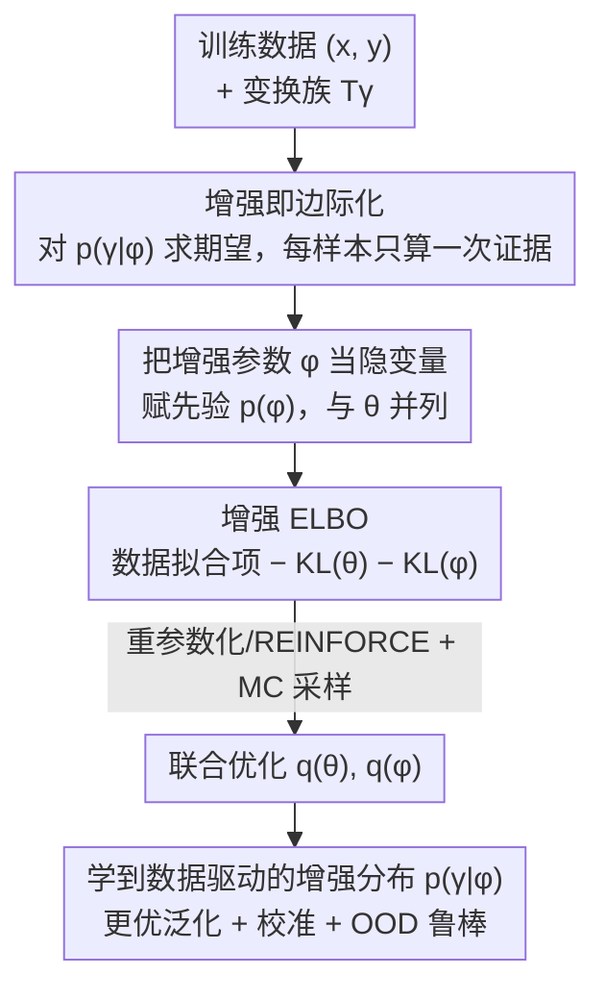

# Optimizing Data Augmentation through Bayesian Model Selection

**会议**: ICLR 2026  
**OpenReview**: [https://openreview.net/forum?id=ofYuPZ0sK0](https://openreview.net/forum?id=ofYuPZ0sK0)  
**代码**: 待确认  
**领域**: 学习理论 / 贝叶斯方法 / 变分推断  
**关键词**: 数据增强, 贝叶斯模型选择, 变分推断, ELBO, PAC-Bayes, 校准

## 一句话总结
本文提出 OPTIMA，把数据增强参数当成模型超参数、把"选增强策略"重新表述为贝叶斯模型选择问题，再用一个可处理的增强 ELBO 把增强参数和模型参数放进同一个训练循环里联合优化，从而免去网格搜索/贝叶斯优化那种反复训练的代价，并在视觉和 NLP 任务上同时提升泛化、校准和 OOD 鲁棒性。

## 研究背景与动机
**领域现状**：数据增强（DA）是现代深度学习的标配——在训练时对样本施加保标签的变换（旋转、平移、翻转、Mixup、词替换等），等价于一种正则化，能让过参数化的网络更好地估计期望风险、提升泛化。但变换选定后，还要决定它的"参数"，比如旋转该用多大的角度范围。

**现有痛点**：增强参数的好坏直接决定收益，可一旦选错就会有害——比如 MNIST 上把 '9' 旋转成 '6' 反而损害训练。实践中这些参数往往靠试错（trial-and-error）拍脑袋，或者用网格搜索 / 贝叶斯优化在验证集上调，但后者需要跑大量完整训练，代价极高。AutoAugment 用强化学习搜、其他工作用密度匹配 / 可微策略搜索 / 双层优化，普遍依赖复杂的搜索流水线和启发式。

**核心矛盾**：一是"怎么选增强参数"缺一个有原则的、不用反复训练的框架；二是**朴素增强会重复计数证据**——把每个增强副本 $\{(T_\gamma(x_i), y_i)\}$ 当成独立样本，相当于把似然 $p(y_i\mid x_i,\theta)$ 抬到 $K$ 次方，人为收缩后验不确定性、破坏校准，把贝叶斯方法本该有的优势毁掉。

**本文目标**：找一个既能数据驱动地学增强参数、又不破坏不确定性量化的统一框架，并给它配上严格的理论保证。

**切入角度**：作者对 DA 取概率视角——增强参数 $\phi$ 就是模型的（超）参数，"选最优增强"就是选边际似然（模型证据）最高的模型，即一个**贝叶斯模型选择**问题。

**核心 idea**：把增强定义成"对变换求边际"而非"复制数据"，由此得到一个可处理的增强 ELBO，让增强参数 $\phi$ 和模型参数 $\theta$ 在同一次训练里联合优化。

## 方法详解

### 整体框架
OPTIMA（OPTImizing Marginalized Augmentations）要解决的是"如何在训练中自动学出最优增强分布，同时不破坏后验校准"。整体思路是把增强从"造更多训练样本"改写成"对变换分布求期望"：先定义一个**变换增强似然**，把每个原始样本在增强分布 $p(\gamma\mid\phi)$ 下做一次边际化，使它仍然只贡献一次证据；再给增强参数 $\phi$ 加先验、把它当成和 $\theta$ 并列的隐变量；最后用变分推断导出一个**增强 ELBO**，用重参数化 + 蒙特卡洛梯度对 $q(\theta)$、$q(\phi)$ 联合做随机梯度优化。整个过程不需要单独的验证集训练轮，几乎不增加额外计算。

### 关键设计

**1. 增强即边际化：用对变换求期望代替复制数据**

针对"朴素增强重复计数证据、收缩不确定性"这个根本痛点，OPTIMA 把增强似然定义成对变换分布的期望而非样本复制：

$$p(y\mid x,\theta,\phi) = \mathbb{E}_{p(\gamma\mid\phi)}\big[\,p(y\mid T_\gamma(x),\theta)\,\big]$$

这样每个原始样本无论采样多少个变换，最终都只对数据似然贡献**一次**，而不是像朴素增强那样把 $p(y_i\mid x_i,\theta)$ 抬到 $K$ 次方。整个数据集的似然是 $p(\mathcal{D}\mid\theta,\phi)=\prod_{i=1}^N \mathbb{E}_{p(\gamma\mid\phi)}[p(y_i\mid T_\gamma(x_i),\theta)]$。这个看似简单的"期望放在 log 里面"的改动，是后面所有校准优势的源头——理论上（定理 4.12）朴素增强会把后验协方差缩成 $\Sigma_{\text{naïve}}\approx\frac1K\Sigma_{\text{true}}$，即预测不确定性被低估约 $\sqrt K$ 倍、产生过度自信，对 OOD 输入尤其致命；而边际化保持了正确的不确定性。

**2. 贝叶斯模型选择：把"选增强"变成"最大化边际似然"**

针对"增强参数靠试错或昂贵验证"的痛点，OPTIMA 给增强参数 $\phi$ 赋一个先验 $p(\phi)$，让它成为和模型参数 $\theta$ 并列的隐变量，联合分布写成 $p(\mathcal{D},\theta,\phi,\gamma)=p(\theta)p(\phi)p(\gamma\mid\phi)p(\mathcal{D}\mid\theta,\phi)$。这样"选最优增强"自然等价于"选边际似然（模型证据）$\log p(\mathcal{D}\mid X,\phi)$ 最高的那组 $\phi$"，即一个标准的贝叶斯模型选择问题。和以往把增强参数当固定值、再用黑盒搜索外层调优不同，这里把模型选择内化成了对隐变量的推断，从经验贝叶斯视角看（定理 4.14），最大化目标得到的 $q(\phi)$ 的众数/均值就是一个被先验正则化的经验贝叶斯点估计，自动选出"最能解释数据"的增强策略。

**3. 增强 ELBO：把增强参数和模型参数塞进一个训练循环联合优化**

边际似然 $\mathcal{L}:=\log p(\mathcal{D})$ 不可处理，作者引入分解的变分分布 $q(\theta,\phi)=q(\theta)q(\phi)$，用 Jensen 不等式导出可优化的下界：

$$\mathcal{L}\ge \mathbb{E}_{q(\theta)q(\phi)p(\gamma\mid\phi)}\!\Big[\sum_{i=1}^N \log p(y_i\mid T_\gamma(x_i),\theta)\Big] - \mathrm{KL}(q(\theta)\Vert p(\theta)) - \mathrm{KL}(q(\phi)\Vert p(\phi))$$

它由一个数据拟合项加两个 KL 正则项（分别约束 $\theta$ 和 $\phi$）构成。优化时对 $q(\theta)$、$q(\phi)$ 同时做随机梯度上升：连续变换（如几何变换、Mixup 的 $\alpha$）用重参数化技巧采样并反传；离散变换（如 NLP 的 token dropout）不可微，则用 score-function（REINFORCE）梯度。蒙特卡洛估计每个样本每次迭代只采 1 个变换就够，因此相比固定增强**几乎零额外开销**——这是它对比贝叶斯优化（需多次完整训练 + 验证）能省 4–8 倍算力的关键。

**4. 一整套理论保证：把边际化的好处量化出来**

OPTIMA 的另一半贡献是给上述框架配的多角度理论分析，回答"为什么边际化更好"。**变分近似质量**（命题 4.1）：Jensen gap 被增强分布方差和模型敏感度控制，若 $f(\gamma)=\log p(y\mid T_\gamma(x),\theta)$ 是 $L$-Lipschitz、$\gamma$ 次高斯方差代理 $\sigma^2$，则 gap $\le L^2\sigma^2/2$，由此推出敏感模型该用更保守（小方差）的增强（推论 4.2）。**泛化保证**（定理 4.5）：在 PAC-Bayes 框架下，OPTIMA 的界比朴素增强严格更紧，差距 $\Delta=\mathbb{E}_q[\frac1N\sum_i\Delta_\phi(x_i,y_i)]\ge0$，其中 $\Delta_\phi=\log\mathbb{E}_{p(\gamma\mid\phi)}p(y_i\mid T_\gamma(x_i),\theta)-\mathbb{E}_{p(\gamma\mid\phi)}\log p(\cdot)$ 正是 Jensen 不等式带来的间隙，只要似然随 $\gamma$ 变化就 $\Delta>0$。**不变性**（定理 4.8）：把输出在变换下的期望平方差展开到二阶，二阶项 $\propto \delta^\top\nabla^2 f_\theta{}^\top\nabla^2 f_\theta\,\delta$ 起到惩罚高曲率、平滑决策边界的正则作用。这些理论不只是装饰，它们直接指导实践——比如该往模型近似不变的方向多分配增强方差（推论 4.10）。

## 实验关键数据

### 主实验
OPTIMA 在回归、CIFAR10、ImageNet、SST-5 上验证，对比固定/无增强和贝叶斯优化（BO）。

| 数据集 | 设置 | 指标 | OPTIMA | 对比 |
|--------|------|------|--------|------|
| ImageNet（非贝叶斯 ResNet-50, Mixup） | Clean Acc | ↑ | 76.8% | Mixup 76.1% |
| ImageNet-C（同上） | Corrupted Acc | ↑ | 41.6% | Mixup 40.1% |
| CIFAR10（贝叶斯 ResNet-18, Mixup） | Test Acc | ↑ | 95.03% | BO 93.43% |
| CIFAR10-C（OOD） | mAcc | ↑ | 78.52% | BO 72.44% |
| CIFAR10-C（OOD） | OOD AUROC | ↑ | 0.680 | BO 0.652 |
| CIFAR10 | 训练耗时 | ↓ | $T$ | BO $\sim4\times T$ |

在 ImageNet + 贝叶斯 ResNet-50（仅末层随机）上，OPTIMA-Mixup 把 ECE 从 0.043 降到 0.031、mECE 从 0.062 降到 0.045，校准明显改善而精度基本持平；AugMix 上 clean Acc 从 74.71% 升到 75.33%、mCE 从 61.45 降到 60.68。

### 离散增强：SST-5 NLP 案例
为证明不限于连续/几何变换，作者在 SST-5（5 类细粒度情感）上微调 DistilBERT，增强用 token dropout（伯努利掩码，REINFORCE 优化 $p_{\text{drop}}=p_{\max}\sigma(s)$）。

| 配置 | Accuracy | NLL | ECE |
|------|----------|-----|-----|
| No Aug | 0.516 | 1.240 | 0.190 |
| Fixed $p_{\text{drop}}=0.0625$ | 0.516 | 1.162 | 0.143 |
| OPTIMA（$\mu=0.1$，学到 0.0625） | 0.524 | 1.161 | 0.142 |
| BO-Fixed $p_{\text{drop}}=0.3$ | 0.521 | 1.086 | 0.043 |
| OPTIMA（$\mu=0.3$，学到 0.3） | 0.524 | 1.086 | 0.046 |

### 关键发现
- **校准是最大卖点**：精度提升常常很小（SST-5 上各方法差异在噪声内），但 OPTIMA 一致地拿到更低 NLL 和更好校准——印证收益来自边际似然优化/边际化，而非单纯把 dropout 调对。
- **匹配 BO 但省算力**：在 SST-5 上 OPTIMA 单次训练就能追平做了约 8× 算力搜索的 BO；CIFAR10 上更是用 $1/4$ 时间超过 BO 的 OOD 表现。
- **增强分布会自适应演化**：合成回归里学到的 $\sigma$ 从 0.10 随训练扩大到约 0.18，说明 OPTIMA 真在按数据动态调整增强强度（呼应推论 4.2 / 4.15）。
- **代价权衡**：CIFAR10 上 OPTIMA 提升 clean Acc 的同时 ECE 略升（0.047 vs BO 0.010），说明 clean 校准与 OOD 鲁棒之间仍有取舍。

## 亮点与洞察
- **一个似然改写串起方法和理论**：把增强从"复制数据"改成"对变换求期望"这一步，既是方法的全部根基，又同时解释了泛化（更紧 PAC-Bayes 界）、校准（不收缩后验）、不变性（二阶曲率正则）三件事——一个改动多处生效，非常优雅。
- **把"调增强"降维成训练内的隐变量推断**：以往增强参数搜索是外层昂贵循环，这里被吸收进 ELBO 的一次前向反传，几乎零额外开销，这种"外层优化内化"的思路可迁移到其他超参数（如 dropout 率、噪声强度）学习。
- **离散增强用 REINFORCE 同框处理**：连续用重参数、离散用 score-function，说明这套贝叶斯模型选择框架对增强族的形式几乎不挑，给 NLP / 时序 / 多模态留了口子。

## 局限与展望
- 作者承认主实验集中在视觉，NLP 只验证了 token dropout 这一种简单离散增强；更有表达力、组合式的变换（NLP 句法变换、时序、多模态）还没探索。
- 定理 4.12 假设后验局部高斯且满秩，对过参数化模型未必成立，作者自己也说这只是给出"行为洞察"、未来要做更一般的证明。
- PAC-Bayes 界还可以更紧，对"边际化优势"的刻画也可更精细。
- 自己的观察：精度增益普遍很小、有时还伴随 clean 校准的轻微恶化，OPTIMA 的真实价值更偏"不确定性/OOD 安全"场景而非刷 SOTA 精度；另外把增强方差当可学超参数后，理论保证依赖的若干假设（KL 可比、变换似然可精确估计）在实际大模型上是否成立缺直接验证。

## 相关工作与启发
- **vs AutoAugment / 可微策略搜索 / 双层优化**：它们靠强化学习、密度匹配或双层优化在外层搜增强策略，依赖复杂流水线和强松弛、代价高；OPTIMA 把搜索内化为 ELBO 里对隐变量 $\phi$ 的变分推断，单次训练完成。
- **vs 把增强当固定/未优化分布的概率视角工作**（Izmailov / Kapoor / Nabarro 等）：它们用 Jensen 下界、Dirichlet 似然或标签平滑分析增强，但增强参数往往固定不学；OPTIMA 在联合贝叶斯模型里**同时优化**增强参数。
- **vs van der Wilk / Immer 用边际似然学不变性**：这条线在高斯过程/Laplace 近似下学不变性但缺泛化保证；OPTIMA 把增强分布做成似然的核心组件，并补上 PAC-Bayes 泛化界等新理论。

## 评分
- 新颖性: ⭐⭐⭐⭐⭐ 把数据增强优化干净地重述为贝叶斯模型选择，并用一个边际化似然统一方法与理论。
- 实验充分度: ⭐⭐⭐⭐ 覆盖回归/CIFAR/ImageNet/SST-5 且有 BO 对比，但精度增益偏小、缺更大规模与更多离散增强验证。
- 写作质量: ⭐⭐⭐⭐ 理论与方法衔接清晰，定理众多但主文证明全在附录，正文偏概览。
- 价值: ⭐⭐⭐⭐ 对需要可靠校准/OOD 鲁棒的应用很有用，且"外层搜索内化"的范式可迁移。

<!-- RELATED:START -->

## 相关论文

- [\[ICLR 2026\] High-dimensional Analysis of Synthetic Data Selection](high-dimensional_analysis_of_synthetic_data_selection.md)
- [\[ICLR 2026\] Pseudo-Non-Linear Data Augmentation: A Constrained Energy Minimization Viewpoint](pseudo-non-linear_data_augmentation_a_constrained_energy_minimization_viewpoint.md)
- [\[ICLR 2026\] Robust Amortized Bayesian Inference with Self-Consistency Losses on Unlabeled Data](robust_amortized_bayesian_inference_with_self-consistency_losses_on_unlabeled_da.md)
- [\[ICLR 2026\] Resurfacing the Instance-only Dependent Label Noise Model through Loss Correction](resurfacing_the_instance-only_dependent_label_noise_model_through_loss_correctio.md)
- [\[ICLR 2026\] Reshaping Reasoning in LLMs: A Theoretical Analysis of RL Training Dynamics through Pattern Selection](reshaping_reasoning_in_llms_a_theoretical_analysis_of_rl_training_dynamics_throu.md)

<!-- RELATED:END -->
