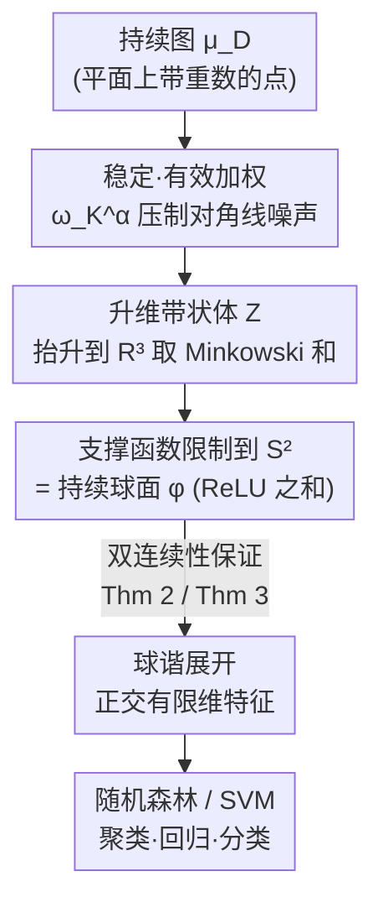

# Persistence Spheres: Bi-Continuous Representations of Persistence Diagrams

**会议**: ICLR 2026  
**OpenReview**: [https://openreview.net/forum?id=eITU6vjnIa](https://openreview.net/forum?id=eITU6vjnIa)  
**领域**: 学习理论 / 拓扑数据分析  
**关键词**: 持续同调, 持续图, 向量化表示, 双连续性, 1-Wasserstein 稳定性

## 一句话总结
本文提出 **持续球面 (Persistence Spheres, PS)**：把持续图加权后构造其「升维带状体 (lift zonoid)」并取它在单位球 $S^2$ 上的支撑函数，得到一个对 1-Wasserstein 距离 **Lipschitz 连续、且在像集上还有连续逆** 的函数型表示——这种"正反都连续"的双连续保证在持续图向量化方法里极为罕见，实验上在聚类/回归/分类任务中与 persistence image、landscape、sliced Wasserstein kernel 等基线持平甚至更优。

## 研究背景与动机

**领域现状**：拓扑数据分析 (TDA) 用持续同调 (persistent homology) 刻画数据的"形状"——记录连通分量、环、空洞这些拓扑特征在多尺度下出现 (birth) 和消失 (death) 的尺度，把结果压缩成 **持续图 (persistence diagram, PD)**，即平面 $\mathbb{R}^2_{x<y}$ 上一堆带重数的点。要把 PD 接入下游机器学习，主流做法是先把 PD **向量化** 成线性空间里的向量/函数，再喂给随机森林、SVM 等经典模型，代表方法有 persistence image (PI)、persistence landscape (PL)、persistence spline (PSpl) 和 sliced Wasserstein kernel (SWK)。

**现有痛点**：PD 之间的天然度量是基于部分最优传输 (partial optimal transport) 的 1-Wasserstein 距离 $W_1$，它在 PD 空间上诱导出高度 **非线性** 的几何——连"求平均"都要转化成计算代价高、解还可能不唯一的 Wasserstein barycenter。现有向量化方法大多只能保证 **前向稳定**（相似的 PD → 相似的向量），但反过来 **不保证**：两个表示向量很接近时，对应的 PD 未必接近。也就是说，绝大多数嵌入丢掉了"逆向连续性"，特征空间里的相似无法回译成图层面的相似。

**核心矛盾**：理论上已知（Carrière & Bauer, 2019）把 Wasserstein 空间 **双 Lipschitz** 嵌入到一般 Hilbert 空间是不可能的，所以人们普遍只能退而求其次拿到单向稳定；之前能拿到更强保证的工作（如 Bate & Garcia Pulido, 2024）都得限制"PD 最多 $n$ 个点"。

**本文目标**：构造一个对任意 PD 都成立、不限点数的函数型表示，同时拿到 **前向 Lipschitz 连续 + 逆向连续** 这对"双连续"性质。

**切入角度**：作者借用凸几何里的 **升维带状体 (lift zonoid)** 与 **支撑函数 (support function)** 工具。支撑函数算子 $A\mapsto h_A$ 是单射且线性，而支撑函数与 Hausdorff 距离之间有 $\max_{v\in S^2}|h_A(v)-h_B(v)|=d_H(A,B)$ 的等距关系——这条等距桥梁正好能把 PD 的传输几何翻译成函数空间里可控的距离。

**核心 idea**：把加权 PD 映成它的升维带状体（一个凸多面体），再取该凸体在 $S^2$ 上的支撑函数当作表示；只要权函数选得"稳定且有效"，前向 Lipschitz 与逆向连续就都能证出来。

## 方法详解

### 整体框架
持续球面把"一张持续图"一步步变成"球面 $S^2$ 上的一个标量函数 $\varphi:S^2\to\mathbb{R}$"，再展开成可喂给分类器的特征向量。整条构造链是：给 PD 的每个点按到对角线的距离 **加权**（越靠近对角线 $\Delta$ 权重越趋于 0，因为靠近对角线的点是噪声）→ 把加权后的离散测度抬升到 $\mathbb{R}^3$ 构造 **升维带状体**（每个点对应一条从原点到 $(1,p)$ 的线段，整体取 Minkowski 和）→ 取这个凸体的 **支撑函数限制在 $S^2$ 上**，就得到持续球面 → 用 **球谐函数展开** 把球面函数离散成有限维正交特征。

关键的数学红利在于：支撑函数的线性 + 与 Hausdorff 距离的等距，使得"PD 之间的 $W_1$ 距离"能被夹在"持续球面之间的 $L^p$ 距离"上下，从而同时拿到前向稳定（Theorem 2）和逆向连续（Theorem 3）。

### 关键设计

**1. 升维带状体 + 支撑函数：把持续图变成球面上一组 ReLU 之和**

要把"图层面的相似"翻译成"函数层面的相似"，作者不直接对 PD 做核函数或像素化，而是先把它抬到 $\mathbb{R}^3$ 里变成一个凸体。给定离散测度 $\mu=\sum_i a_i\delta_{p_i}$（$p_i\in\mathbb{R}^2$），其升维带状体定义为 Minkowski 和 $Z_\mu=\bigoplus_i a_i[0,(1,p_i)]$，即每个点 $p$ 抬升为一条从原点到 $(1,p)\in\mathbb{R}^3$ 的线段，再把所有线段加起来。这个构造是 **线性** 的：$\lambda_1\mu_1+\lambda_2\mu_2\mapsto\lambda_1 Z_{\mu_1}\oplus\lambda_2 Z_{\mu_2}$。然后取它的支撑函数 $h_{Z_\mu}(x)=\max_{a\in Z_\mu}\langle x,a\rangle$ 限制在 $S^2$ 上，就是持续球面。由于单段 $[0,(1,p)]$ 的支撑函数恰好是 $v\mapsto\mathrm{ReLU}(\langle v,(1,p)\rangle)$，整张 PD 的持续球面有非常干净的显式公式：

$$\varphi^\omega_{\mu_D}(v)=h_{Z_{\mu^\omega_D}}(v)=\sum_{p\in D}\omega(p)\,a_p\,\mathrm{ReLU}(\langle v,(1,p)\rangle).$$

它本质上是一层"以 PD 各点为神经元、$(1,p)$ 为权、$\omega(p)a_p$ 为系数"的单隐层 ReLU 网络在球面上的取值。之所以选这条路，是因为支撑函数算子 $A\mapsto h_A$ **既线性又单射**，而且满足 $\max_{v\in S^2}|h_A(v)-h_B(v)|=d_H(A,B)$ ——这条等距关系是后面所有连续性定理的支点。

**2. 稳定且有效的加权 $\omega_K^\alpha$：既压住对角线噪声，又不破坏连续性**

直接照搬前人（Gotovac Dogaš & Mandarić, 2025）用 $\omega(p)=y-x$ 当权重会出事：作者在 Remark 2 里给了反例，取 $D_n=\{(n^2,n^2+\tfrac1n)\}$，则 $W_1(D_n,\varnothing)=\tfrac1n\to0$，但带状体的 Hausdorff 距离 $d_H\ge\tfrac{\sqrt2}{n}n^2\to\infty$，前向映射 **直接不稳定**。根因是这种权重在远离原点时增长太快。本文给加权立了两条技术约束（Definition 12「稳定加权」+ Definition 13「有效加权」）：稳定加权要求 $\Gamma_\omega(p):=\omega(p)(1,p)$ 是 $C$-Lipschitz 且满足 $\|\Gamma_\omega(p)\|_2\le C'\|p-\Delta\|_\infty$（即权重随到对角线距离线性受控）；有效加权则控制权重在无穷远处的衰减，保证持续质量 $\mathrm{Pers}$ 不漏。作者给出的首选权函数是

$$\omega_K^\alpha(p)=\frac{2}{\pi}\arctan\!\Big(\frac{\lambda(p)^\alpha}{K^\alpha}\Big),\qquad \lambda(p)=\frac{y-x}{2\,\|(1,p)\|_2},$$

它对所有 $K>0,\alpha\ge1$ 都是稳定加权，在 $\alpha=1$ 时还是有效加权。两个参数物理意义清晰：$\lambda(p)$ 度量点到对角线的相对高度，$K$ 像一个噪声阈值、$\alpha$ 控制衰减陡峭程度，因此能据噪声水平做定性选参（附录 B）。这个设计是整套理论"既要稳定又要逆向可恢复"的开关——加权选不好，下面两条定理一条都立不住。

**3. 双连续定理：前向 Lipschitz + 逆向连续，特征相似 ⇔ 图相似**

这是本文的理论核心，由两条定理夹出来。前向（Theorem 2）：对稳定加权 $\omega$，

$$d_H(Z_{\mu^\omega_D},Z_{\mu^\omega_{D'}})\le \sqrt2\,\max\{C,C'\}\,W_1(\mu_D,\mu_{D'}),$$

即 PD 越近、它们的带状体（进而持续球面）越近——保证 **稳定性**。逆向（Theorem 3）：对有效加权，若 $d_H(Z_{\mu^\omega_{D_n}},Z_{\mu^\omega_D})\to0$ 则 $W_1(\mu_{D_n},\mu_D)\to0$——保证 **几何保真**。把两者用 Proposition 1 的等距关系翻译回持续球面，就得到 Corollary 1：存在常数 $C_p$ 使 $\|\varphi^\omega_{\mu_D}-\varphi^\omega_{\mu_{D'}}\|_p\le C_p W_1(\mu_D,\mu_{D'})$，且若 $\|\varphi^\omega_{\mu_D}-\varphi^\omega_{\mu_{D_n}}\|_\infty\to0$ 则 $W_1(\mu_{D_n},\mu_D)\to0$。这条"双连续"把 Wasserstein 几何和函数表示牢牢绑定：函数空间里的收敛 **蕴含** 图层面的收敛，这正是大多数嵌入做不到、而本文不限点数就能拿到的强保证。一个直接的潜在用途是把它当 PD 上的 **损失函数**——在函数空间里优化收敛即意味着在图层面收敛。

**4. 球谐展开：把球面函数变成可直接喂分类器的有限维正交特征**

持续球面是定义在 $S^2$ 上的连续函数，要进随机森林/SVM 还得离散化。作者用 **球谐函数 (spherical harmonics)** 展开（pyshtools 实现），在 Driscoll–Healy 网格上取 $2N_\theta$ 个纬向、$4N_\theta$ 个经向节点，得到维度约 $N_\theta^2/2$ 的 **正交** 特征向量。相比 PI 要小心选像素大小/高斯核宽、PL 要选评估网格，持续球面的定义域 $S^2$ 本身就是固定且紧的，不存在"按整个数据集去选支撑范围"导致的训练/测试信息泄漏问题，参数也更好调。

### 损失函数 / 训练策略
本文是表示方法而非端到端训练模型：持续球面只作特征提取，下游 PS/PI/PSpl/PL 配随机森林（估计器数 $\in\{100,200\}$），SWK 配 SVM（正则 $C$ 网格搜索）。持续球面自身的超参是加权参数 $K\in\{0,10^{-4},\dots,0.5\}$、$\alpha\in\{1,3,5\}$ 以及网格精度 $2N_\theta\in\{30,\dots,70\}$，均由三折交叉验证选取。

## 实验关键数据

### 主实验
在聚类（功能数据 FDA 仿真，Rand 指数，200 次重复）、回归（$R^2$）、分类（准确率）三类共 12 个案例上对比，覆盖功能数据、时间序列、图、网格、点云等多种数据类型。

| 任务 | 数据集 | PS（本文） | PI | PL | PSpl | SWK |
|------|--------|-----------|----|----|------|-----|
| 聚类 | FDA σ=10 | **0.845** | 0.786 | 0.753 | 0.556 | 0.762 |
| 聚类 | FDA σ=15 | **0.806** | 0.730 | 0.676 | 0.538 | 0.696 |
| 聚类 | FDA σ=30 | **0.688** | 0.621 | 0.542 | 0.518 | 0.578 |
| 回归 | Eyeglasses | 0.966† | 0.922 | 0.955† | **0.971†** | 0.971† |
| 回归 | Tecator | **0.969†** | 0.900 | 0.954† | 0.970† | 0.953 |
| 分类 | Growth | **0.850†** | 0.743† | 0.768 | 0.807† | 0.768 |
| 分类 | NOx | **0.869†** | 0.780 | 0.789 | 0.823† | 0.840† |
| 分类 | DYN SYS | 0.829† | 0.419 | **0.840†** | 0.829† | 0.828† |
| 分类 | Human Poses | **0.640†** | 0.530† | 0.405 | 0.510 | 0.345 |
| 分类 | McGill 3D | 0.544† | 0.461 | **0.678†** | 0.561† | 0.567† |

（† 表示 95% 置信区间与最优方法重叠；加粗为该行最优。SWK 在无监督行不适用。）

### 加权方案对比

| 配置 | 现象 | 结论 |
|------|------|------|
| 稳定+有效加权 $\omega_K^\alpha$ | 前向 Lipschitz + 逆向连续均成立 | 本文默认，性能最好 |
| $\omega(p)=y-x$（前人方案） | 反例下 $W_1\to0$ 但 $d_H\to\infty$ | 不稳定，附录 E 实测性能更差 |
| 球面保真度仿真（附录 B.2） | PS 与 SW 对 $W_1$ 的保真度最高 | 印证双连续性的实际价值 |

### 关键发现
- 持续球面在 **无监督聚类** 上优势最明显（FDA 三档噪声全部第一），印证了"逆向连续"带来的几何保真在没有标签、纯靠距离结构时最关键。
- PSpl 在监督任务上也很强且维度极低，但在无监督场景明显掉队，进一步说明监督性能强 ≠ 几何保真好。
- PersLay 因样本量偏小（多在 100–1000）整体被拖累；PI 的难点在于参数范围难选、随机森林训练偶尔极慢。
- McGill 3D Shapes 上 PS 与 PI 方差偏大、较难优化，作者通过大幅降低向量化维度（$2N_\theta=14$）来缓解。

## 亮点与洞察
- **把支撑函数当桥梁**：$\max_{S^2}|h_A-h_B|=d_H(A,B)$ 这条等距把"凸体的 Hausdorff 距离"与"函数的 $L^\infty$ 距离"画了等号，是整篇能同时拿到前向/逆向连续的关键——值得迁移到其他需要"双向稳定嵌入"的几何对象上。
- **持续球面 = 单隐层 ReLU 网络**：显式公式 $\sum_p\omega(p)a_p\,\mathrm{ReLU}(\langle v,(1,p)\rangle)$ 让它天然兼容可微拓扑层，也提示了"从球面标量场反解 PD"可借用 ReLU 网络的优化框架。
- **加权的反例驱动设计**：Remark 2 用一个干净反例说明朴素权重 $y-x$ 为何不稳定，再据此立稳定/有效两条公理，是"先找反例、再补公理"的漂亮范式。

## 局限与展望
- 双连续性是 **渐近/定性** 的：逆向只给出"收敛蕴含收敛"，没有逆向的定量 Lipschitz 模量，实际反解 PD 的算法仍在开发中。
- 表示维度依赖球谐网格精度，高保真需要较大 $N_\theta$，在 McGill 3D 等小样本/高方差数据上需手动降维，鲁棒性还不够自动。
- 仅在 $S^2$（即平面 PD 抬到 $\mathbb{R}^3$）上构造，扩展到双参数持续 (bi-parameter persistence) 需引入符号测度，作者列为未来工作。
- 实验下游模型固定为随机森林/SVM，未验证持续球面作为可微损失/拓扑层在端到端深度网络里的实际收益（仅在结论里展望）。

## 相关工作与启发
- **vs Persistence Image / Landscape**: 同属函数型向量化，但 PI/PL 只保证前向稳定、且要按整个数据集选支撑范围（有信息泄漏隐患）；持续球面定义域固定为紧的 $S^2$ 且额外拿到逆向连续，几何保真更强。
- **vs Gotovac Dogaš & Mandarić (2025)**: 本文构造直接建立在其框架上，但指出其权重 $\omega=y-x$ 不稳定（Remark 2 反例），改用稳定+有效加权 $\omega_K^\alpha$ 才补全了前向稳定性。
- **vs Bate & Garcia Pulido (2024) / Mitra & Virk (2024)**: 这些工作为拿到强保证需限制"PD 最多 $n$ 个点"，本文对 **任意点数** 的 PD 都成立。
- **vs Sliced Wasserstein Kernel**: SWK 通过核技巧隐式定义特征映射、对 $W_1$ 保真度也高，但需算 Gram 矩阵且无显式逆；持续球面给出显式可逆构造，附录 B.2 显示二者保真度并列最高。

## 评分
- 新颖性: ⭐⭐⭐⭐⭐ 首个不限点数、对 $W_1$ 同时前向 Lipschitz + 逆向连续的 PD 函数表示，理论缺口填得干净。
- 实验充分度: ⭐⭐⭐⭐ 覆盖聚类/回归/分类与多种数据类型、对比 5 个基线，但下游模型与端到端拓扑层验证偏少。
- 写作质量: ⭐⭐⭐⭐ 数学严谨、反例驱动清晰，但凸几何/测度论门槛较高。
- 价值: ⭐⭐⭐⭐ 双连续性为"PD 上的可微损失/反解"打开通路，实际应用价值有待后续工作兑现。

<!-- RELATED:START -->

## 相关论文

- [\[ICLR 2026\] Bi-Criteria Metric Distortion](bi-criteria_metric_distortion.md)
- [\[ICLR 2026\] Bi-Lipschitz Autoencoder With Injectivity Guarantee](bi-lipschitz_autoencoder_with_injectivity_guarantee.md)
- [\[ICML 2026\] Finite-Width Neural Tangent Kernels from Feynman Diagrams](../../ICML2026/learning_theory/finite-width_neural_tangent_kernels_from_feynman_diagrams.md)
- [\[ICLR 2026\] Discounted Online Convex Optimization: Uniform Regret Across a Continuous Interval](discounted_online_convex_optimization_uniform_regret_across_a_continuous_interva.md)
- [\[ICLR 2026\] FACT: a first-principles alternative to the Neural Feature Ansatz for how networks learn representations](fact_a_first-principles_alternative_to_the_neural_feature_ansatz_for_how_network.md)

<!-- RELATED:END -->
