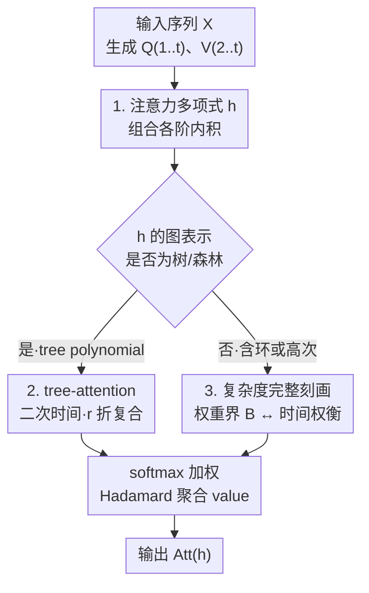

# Poly-attention: a general scheme for higher-order self-attention

**会议**: ICLR 2026  
**OpenReview**: [https://openreview.net/forum?id=amivrmQyvQ](https://openreview.net/forum?id=amivrmQyvQ)  
**代码**: 待确认  
**领域**: 学习理论 / 注意力机制 / 计算复杂度  
**关键词**: 高阶注意力, 函数复合, 细粒度复杂度, 表达力, tree-attention

## 一句话总结
本文提出 poly-attention——一类用「注意力多项式」$h$ 统一刻画的高阶自注意力机制（自注意力、张量注意力、Strassen 注意力都是其特例），系统给出每种机制精确/近似计算的时间复杂度与表达力的紧匹配刻画，并由此找到一个新机制 tree-attention：它能在与自注意力相同的二次时间内完成任意 $r$ 折函数复合，而此前所有能做复合的机制都需要超二次时间。

## 研究背景与动机
**领域现状**：Transformer 的核心是自注意力，它通过 $\mathrm{Att}_i=\frac{\sum_j \exp(\frac1d\langle Q_i,K_j\rangle)V_j}{\sum_j \exp(\frac1d\langle Q_i,K_j\rangle)}$ 捕捉 token 之间的**两两（pairwise）相关性**，可在 $n^{2+o(1)}$ 时间精确计算，权重有界时还能在近线性时间 $n^{1+o(1)}$ 内做逐元素近似。

**现有痛点**：大量理论与实验工作证明，自注意力**结构上无法**完成需要三元及以上相关性的任务——比如 Match3（找出三个相关 token）、Parity、Dyck-1，以及本文重点关注的**函数复合**（"Sam 住在 Toronto，Toronto 在 Canada，问 Sam 在哪个国家"，需要把"人→城市"和"城市→国家"两个映射串起来）。Peng 等人证明：单层单头自注意力连 2 折复合都做不了，甚至需要近 $n$ 个头才行。

**核心矛盾**：为补强表达力，已有两条路线——3-张量注意力（把内积升成三向量内积 $\langle a,b,c\rangle=\sum_\ell a[\ell]b[\ell]c[\ell]$）和 Strassen 注意力（用三项两两内积之和），它们都能做 2 折复合，但**代价是超二次时间**：张量注意力要 $n^{3+o(1)}$，Strassen 注意力即便用快速矩阵乘法也要 $n^{\omega+o(1)}$（$\omega\le 2.37$，实践中常退化到 $\approx 2.81$ 甚至 $3$）。而且这两者都做不了 3 折复合。于是出现了一个根本性的「表达力 ↔ 运行时间」权衡，且此前这些机制都是**逐个零散研究**的，缺乏统一视角。

**本文目标**：(1) 给出一个能涵盖所有这些机制的统一框架；(2) 系统刻画框架内每种机制的精确/近似复杂度与能解的任务；(3) 在权衡曲线上找出"两全其美"的新机制。

**核心 idea**：把一次注意力打分抽象成对一个**注意力多项式** $h(x_1,\dots,x_t)$ 求值——$h$ 的每个单项式对应一组向量的高阶内积，$h$ 的「图结构」直接决定了机制的复杂度。在这个统一空间里搜索，发现只要 $h$ 的图是**树/森林**，对应的 tree-attention 就能在二次时间内做到任意阶函数复合。

## 方法详解

### 整体框架
poly-attention 把自注意力的打分项 $\langle Q_i,K_j\rangle$ 替换成一个由用户指定的**注意力多项式** $h(x_1,\dots,x_t)$ 求值结果。给定输入 $X\in\mathbb R^{n\times d}$，先用权重矩阵生成 $t$ 个查询-键矩阵 $Q^{(1)},\dots,Q^{(t)}$ 与 $t-1$ 个值矩阵 $V^{(2)},\dots,V^{(t)}$；输出矩阵的第 $\ell_1$ 行是对其余 $t-1$ 个下标 $\ell_2,\dots,\ell_t$ 做加权聚合：

$$\mathrm{Att}^{(h)}_{\ell_1}=\frac{\sum_{\ell_2,\dots,\ell_t\in[n]}\exp\!\big(\tfrac1d\,h(Q^{(1)}_{\ell_1},\dots,Q^{(t)}_{\ell_t})\big)\;V^{(2)}_{\ell_2}\odot\cdots\odot V^{(t)}_{\ell_t}}{\sum_{\ell_2,\dots,\ell_t\in[n]}\exp\!\big(\tfrac1d\,h(Q^{(1)}_{\ell_1},\dots,Q^{(t)}_{\ell_t})\big)}$$

其中 $\odot$ 是逐元素（Hadamard）积。一个机制由 $h$ 完全决定，因此整篇论文的逻辑是：**选 $h$ → 看 $h$ 的图表示是不是树 → 由图结构读出精确/近似复杂度与可解任务**。这条主线让原本零散的机制落进同一张地图，并指向 tree-attention 这个最佳折中点。

> 表达力与运行时间下界的证明技术（设计 4）是支撑上图分支判断的理论底座，贯穿 tree / 非树两条路径，本身不是 pipeline 的一个阶段。

### 关键设计

**1. 注意力多项式与 poly-attention 统一框架：把"高阶注意力"参数化成一个多项式**

痛点是此前自注意力、张量注意力、Strassen 注意力各自定义、各自分析，无法相互比较。本文用一个**注意力多项式** $h(x_1,\dots,x_t)$ 把它们一网打尽：$h$ 必须是多线性、系数只取 $\{0,1\}$、每个单项式次数在 $2$ 到 $k$ 之间。每个单项式 $x_{j_1}\cdots x_{j_k}$ 翻译成一组向量的 $k$ 阶内积 $\langle Y_{j_1},\dots,Y_{j_k}\rangle$，$h$ 整体即这些内积之和。三个已有机制全是特例（Lemma 2.3）：自注意力是 $h(x_1,x_2)=x_1x_2$；$t$-张量注意力是 $h=x_1x_2\cdots x_t$；Strassen 注意力是 $h(x_1,x_2,x_3)=x_1x_2+x_2x_3+x_3x_1$。这一抽象的价值在于：$h$ 的两个结构量——**次数 $k$**（最高内积阶数）和**图表示**（变量为顶点、单项式 $x_ix_j$ 为边，仅对 degree-2 项定义）——恰好成为后续读取复杂度与表达力的"旋钮"，从而把"设计一个注意力机制"变成"设计一个多项式"。

**2. tree-attention：二次时间内完成任意 $r$ 折函数复合**

这是全文最亮的结果。问题在于：能做函数复合的旧机制（张量、Strassen）都要超二次时间，且都卡在 2 折做不了 3 折。本文先用一个极简多项式 $h_2(x_1,x_2,x_3)=x_1x_2+x_2x_3$ 给出"标点"——它单头就能模拟 2 折复合，且 $\mathrm{Att}^{(h_2)}$ 可在 $O(n^2)$ 时间精确算出（Theorem 3.1）；进一步取路径多项式 $h_r=x_1x_2+x_2x_3+\cdots+x_rx_{r+1}$，poly-attention 就能模拟 $r$ 折复合，精确计算只需 $O(r^3 n^2)$ 时间（Theorem 3.4，注意输入维度是 $O(rn)$）。更一般地，作者刻画出**所有能在二次时间精确计算的 poly-attention 恰好是 tree-attention**：当 $h$ 是 degree-2 多项式且其图表示为树或森林时（称 tree polynomial），$\mathrm{Att}^{(h)}$ 可在 $n^{2+o(1)}$ 精确计算，近似界 $B=o(\sqrt{\log n})$ 与自注意力完全一致（Theorem 3.5）；深度为 $q$ 的树能做 $(q-1)$ 折复合。相比之下自注意力连 2 折都做不了，张量/Strassen 做不了 3 折，tree-attention 则在**自注意力同等成本**下对任意 $r$ 通吃——这就是作者主张它"best of all worlds"的依据，且其算法只用普通矩阵乘法，不依赖不切实际的快速矩阵乘法常数 $\omega$。

**3. 复杂度的完整刻画：表达力、权重界 $B$ 与运行时间的三方紧权衡**

对于**非树**多项式（次数 $>2$，或图含环），本文证明其 poly-attention 必然需要超二次时间，但仍给出紧的近似刻画（Theorem 3.6）：若查询-键矩阵元素界 $B=o((\log n)^{1/k})$，则逐元素 $1/\mathrm{poly}(n)$ 近似可在近线性时间算出；若 $B=\Omega((\log n)^{1/k})$，则在标准复杂度假设下必然需要超二次时间。这把 Alman & Song 对自注意力 / 张量注意力的零散结论推广到了**任意**注意力多项式，关键改进是近似界从直觉上的 $o((\log n)^{1/t})$ 收紧到 $o((\log n)^{1/k})$——当变量数 $t$ 远大于次数 $k$（如 tree-attention 可取 $t=20,k=2$）时这是巨大的放宽。直观结论是：**表达力越强（$h$ 次数/阶数越高、能做的任务越复杂），允许的权重界 $B$ 就越小才能换来快速近似**，模型设计者可据自身硬件与数据中的逻辑结构挑选合适的 $h$。

**4. 表达力与下界证明技术：root-finding 能力 + 通信复杂度 / 细粒度复杂度下界**

要让上面的复杂度刻画"紧"（即不可改进），需要配套的下界。表达力正向构造用了 Kozachinskiy 等人"平方和"思路的推广：设计一个检验多项式 $c$，使其在正确输出处为 $0$、错误处取大值，softmax 便能挑出 $0$ 从而解题——难点是用 $h$ 现有单项式表达 $c$。本文还定义了 Match3 的推广**多项式 root-finding**（给定整数集 $S$ 与多项式 $p$，找 $y_1,\dots,y_t\in S$ 使 $p=0$，Match3 即 $p=x_1+x_2+x_3$），证明对任意 $p$ 都存在 $h$ 使两头 poly-attention 能求解（Theorem 3.7）。下界一侧：表达力下界用通信复杂度，把函数复合归约到 myopic pointer jumping（已知需要大通信量），从而证明 Strassen / 张量注意力需要 $H>n^{1-o(1)}$ 个头才能做 3 折复合（Theorem 3.3）；运行时间下界用细粒度复杂度——一般用 SETH，但 SETH 只能给出三次及以上下界，无法证 $\Omega(n^\omega)$ 这类涉及矩阵乘法指数的下界，因此对 Strassen 注意力改用 **Max-2SAT 猜想**，通过 distributed PCP 框架把更快的 Strassen 注意力算法归约成更快的 Max-2SAT，反证其不可改进。

### 损失函数 / 训练策略
本文是理论工作，无新损失函数；实验中三种模型（tree-attention 与 self-attention）均按相同方式训练以学习函数复合任务，比较收敛速度与精度。

## 实验关键数据

### 主实验
各机制的精确/近似复杂度与表达力对照（综合论文 Table 1 与 Table 2，$d=O(\log n)$）：

| 机制 | 精确时间 | 近似权重界 $B$ | 2 折复合 | 3/$r$ 折复合 |
|------|----------|----------------|----------|--------------|
| 自注意力 | $n^{2+o(1)}$ | $o(\sqrt{\log n})$ | 否 | 否 |
| $t$-张量注意力 | $n^{t+o(1)}$ | $o((\log n)^{1/t})$ | 是 | 否 |
| Strassen 注意力 | $n^{\omega+o(1)}$ | $o(\sqrt{\log n})$ | 是 | 否 |
| **Tree（本文）** | $n^{2+o(1)}$ | $o(\sqrt{\log n})$ | 是 | **是** |
| **Poly（本文）** | $n^{t+o(1)}$ | $o((\log n)^{1/k})$ | 是 | 是 |

可见 tree-attention 在**与自注意力完全相同**的时间和权重界下，把表达力提升到任意阶函数复合，是表格里唯一的"全绿+二次时间"行。

### 消融实验
在函数复合与 COGS 组合泛化数据集上的经验验证（序列长度 51）：

| 配置 | 任务 | 关键发现 |
|------|------|----------|
| 单层单头 self-attention | 学 $f_2(f_1(x))$ | 学不会（与 Peng 等理论一致） |
| 双层单头 self-attention | 同上 | 能学会，但收敛慢 |
| 单层单头 tree-attention | 同上 | 能学会，且**所需 epoch 显著更少** |
| tree vs self | COGS 组合泛化 | 同等 epoch 下 tree-attention 准确率更高 |
| tree vs self | 推理时间 | tree-attention 约为 self-attention 的 **1.3×**，二次时间常数不大 |

### 关键发现
- **理论与实验吻合**：单层单头自注意力确实学不会函数复合，而 tree-attention 单层即可，且更快收敛——验证了"表达力差距"不只是理论现象。
- **近似界改进最关键**：把 $o((\log n)^{1/t})$ 收紧到 $o((\log n)^{1/k})$，使得 tree-attention（$t$ 大、$k=2$）既高表达力又能近线性近似，是"两全其美"的技术根因。
- **常数可控**：实验显示二次时间不隐藏大常数（约 1.3×），说明 tree-attention 具备实际部署潜力。

## 亮点与洞察
- **"设计机制 = 设计多项式"**：把高阶注意力统一参数化为注意力多项式 $h$，再用 $h$ 的次数与图结构直接读出复杂度，是非常干净的抽象，让此前零散的机制落进同一张地图并可互相比较。
- **图结构 ↔ 复杂度的精确对应**：tree/forest ⇒ 二次时间、含环 ⇒ 子立方 $n^\omega$、高次 ⇒ 超二次，这种"看图说复杂度"的刻画极具启发性，可迁移到其他需要权衡表达力与算力的算子设计。
- **下界用对了工具**：意识到 SETH 撑不起 $\Omega(n^\omega)$ 下界、改用 Max-2SAT 猜想 + distributed PCP，是细粒度复杂度方法学上的巧思。
- **可迁移思路**：选择何种 tree polynomial 可依据数据中预期的逻辑/关系结构（路径=函数复合、一般树=树状复合），为按任务定制注意力算子提供了原则性方法。

## 局限与展望
- 实验规模很小（序列长度 51、单层单头、合成任务 + COGS），尚未在大规模语言模型训练中验证 tree-attention，能否在真实 LLM 中替代自注意力仍是开放问题（作者也将其列为后续工作）。
- 复杂度刻画建立在细粒度复杂度猜想（SETH、Max-2SAT）之上，是条件性下界而非无条件结论。
- 表达力分析聚焦函数复合与 root-finding；Peng 等提出的关系/空间/时间复合等任务上 tree-attention 表现如何尚未探究。
- 近似算法依赖权重界 $B$ 较小，实际模型权重是否落在可快速近似的区间需要经验验证。

## 相关工作与启发
- **vs 自注意力（Vaswani 2017）**：本文是其严格推广（$h=x_1x_2$ 即自注意力），在同等二次时间内提供任意阶函数复合能力，补上了自注意力结构性的表达力缺口。
- **vs 3-张量 / 高阶张量注意力（Clift 2020；Sanford 2024）**：张量注意力用单个高阶内积 $x_1\cdots x_t$、需 $n^{t}$ 时间且做不了 3 折复合；tree-attention 用 degree-2 树多项式，二次时间即可且支持任意 $r$ 折。
- **vs Strassen 注意力（Kozachinskiy 2025）**：Strassen 注意力是带环的 degree-2 特例，需子立方 $n^\omega$ 时间且仅 2 折；本文不仅把它纳入框架，还首次给出其近线性近似算法及匹配下界（用 Max-2SAT 猜想）。
- **vs Alman & Song 系列细粒度复杂度工作**：他们对自注意力 / 张量注意力逐个证近似上下界，本文将其统一推广到任意注意力多项式，并把近似界从 $o((\log n)^{1/t})$ 收紧到 $o((\log n)^{1/k})$。

## 评分
- 新颖性: ⭐⭐⭐⭐⭐ 用注意力多项式统一所有高阶注意力，并据图结构给出完整复杂度-表达力刻画，发现二次时间的 tree-attention。
- 实验充分度: ⭐⭐⭐ 理论扎实，但经验验证仅限小规模合成任务与 COGS，缺大规模检验。
- 写作质量: ⭐⭐⭐⭐ 结构清晰、定理与权衡表述精炼，理论密度高。
- 价值: ⭐⭐⭐⭐⭐ 为"如何在不牺牲算力的前提下增强注意力表达力"给出原则性答案，tree-attention 具实际跟进潜力。

<!-- RELATED:START -->

## 相关论文

- [\[ICLR 2026\] Subquadratic Algorithms and Hardness for Attention with Any Temperature](subquadratic_algorithms_and_hardness_for_attention_with_any_temperature.md)
- [\[ICLR 2026\] Critical Attention Scaling in Long-Context Transformers](critical_attention_scaling_in_long-context_transformers.md)
- [\[ICLR 2026\] Understanding In-Context Learning on Structured Manifolds: Bridging Attention to Kernel Methods](understanding_in-context_learning_on_structured_manifolds_bridging_attention_to_.md)
- [\[ICLR 2026\] On learning linear dynamical systems in context with attention layers](on_learning_linear_dynamical_systems_in_context_with_attention_layers.md)
- [\[ICLR 2026\] Minimax Rates for Learning Pairwise Interactions in Attention-Style Models](minimax_rates_for_learning_pairwise_interactions_in_attention-style_models.md)

<!-- RELATED:END -->
