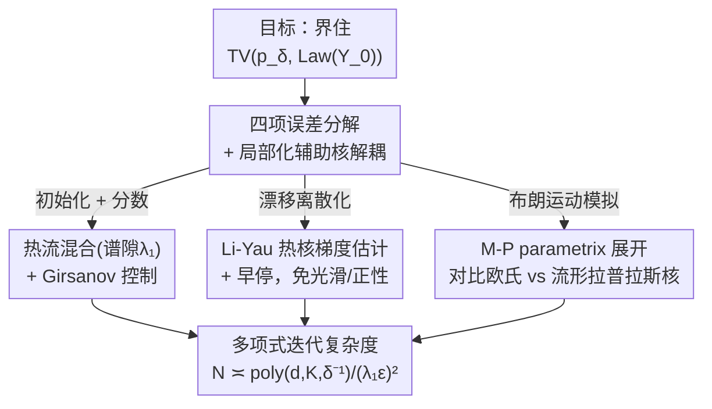

# Polynomial Convergence of Riemannian Diffusion Models

**会议**: ICLR 2026  
**OpenReview**: [https://openreview.net/forum?id=lL0FR3UPhZ](https://openreview.net/forum?id=lL0FR3UPhZ)  
**代码**: 无（纯理论分析）  
**领域**: 学习理论 / 扩散模型收敛性  
**关键词**: 黎曼扩散模型, 收敛性分析, 总变差距离, 热核, 离散化误差

## 一句话总结
本文证明了流形上的黎曼分数生成模型（RSGM）只需**多项式量级**的步长，就能在**总变差距离**下做到精确采样，把 De Bortoli et al. (2022) 此前需要"指数小步长 + L∞ 精度分数 + 光滑严格正数据分布"的苛刻保证，一举放松到"多项式步长 + L2 精度分数 + 任意数据分布"。

## 研究背景与动机
**领域现状**：扩散模型在欧氏空间 $\mathbb{R}^d$ 上的收敛性理论已经相当成熟——Chen et al. (2023)、Benton et al. (2024)、Li et al. (2024) 等一系列工作证明了 DDPM 类离散采样器在 **L2 精度分数估计**和很弱的数据假设下，只需要多项式级别的迭代次数就能在总变差（TV）距离下收敛。这些结果给"扩散模型为什么能从复杂多峰分布里采样"提供了坚实的理论支撑。

**现有痛点**：但很多科学场景的数据天然不在欧氏空间里，而是约束在流形上——比如 $SO(3)$ 上的姿态、球面上的方向、环面角度、关节姿势、对称正定（SPD）矩阵等。要把扩散模型搬到流形上，必须把流形约束嵌进前向/反向过程，De Bortoli et al. (2022) 的黎曼分数生成模型（RSGM）是唯一给出非渐近收敛率的先驱工作。然而他们的 Wasserstein 距离保证有三个硬伤：①需要**指数小的步长**，导致迭代复杂度在某些流形参数上呈指数爆炸；②需要 **L∞ 精度的分数估计**，深度学习里根本做不到；③要求数据分布在紧流形上**光滑且严格为正**。

**核心矛盾**：流形布朗运动的转移核**无法被任何离散时间过程精确模拟**（这是和欧氏空间最本质的区别——欧氏布朗运动一步就是精确的高斯，方差 $t_k-t_{k-1}$；流形上不行）。正是这个"布朗运动模拟误差"逼着前人用指数小步长来压住误差。

**本文目标**：能否在 **L2 精度分数**和**温和几何假设**下，为流形扩散模型做到**多项式迭代复杂度**？同时彻底丢掉对数据分布光滑性/正性的要求。

**切入角度**：作者注意到，欧氏空间的现代分析（Benton et al. 2024 的随机局部化、Li-Yau 风格的梯度估计）之所以能做到多项式收敛，靠的是把离散化误差拆得很细。如果能把流形特有的"布朗运动模拟误差"单独剥离出来、再用几何分析的重武器（热核 Li-Yau 估计、parametrix 展开）精确控制，就有希望避免指数爆炸。

**核心 idea**：用一个**局部化辅助核**把"漂移离散化误差"和"布朗运动模拟误差"解耦，再分别用 **Li-Yau 热核梯度估计**和 **Minakshisundaram-Pleijel parametrix 展开**把两者控制到多项式小。

## 方法详解

### 整体框架
本文不提新算法，而是对 De Bortoli et al. (2022) 的 RSGM 采样器（Algorithm 1）做一套全新的离散时间分析。RSGM 的前向过程是无漂移的几何布朗运动 $dX_t = U_{X_t}\circ dW_t$（$\circ$ 表 Stratonovich 积分，$U_x$ 是 $x$ 处的标准正交标架），其转移密度满足热方程 $\partial_t p_t = \tfrac12\Delta_M p_t$。反向 SDE 为

$$dY_\tau = \nabla\log p_\tau(Y_\tau)\,d\tau + U_{Y_\tau}\circ dW_\tau,\quad \tau = T-t.$$

离散化时每一步在切空间 $T_{Y_k}M$ 里采一个高斯增量 $G_k=U_k\xi_k$，构造切向更新 $\Delta_k = h\,\hat{s}_{t_k}(Y_k)+\sqrt{h}\,G_k$，再用指数映射 $\exp_{Y_k}$ 投回流形；若 $\|\Delta_k\|>h^{1/4}$（超出单射半径）则拒绝、重采于均匀分布 $\mu$。

整篇分析的目标是界住输出 $Y_0$ 的分布与早停目标 $p_\delta$（带早停时间 $\delta>0$ 的 $p_0$ 近似）之间的 TV 距离。**核心做法是把总误差干净地拆成四项**：

$$\underbrace{\text{初始化误差}}_{\text{TV}(p_N,\mu)} + \underbrace{\text{分数误差}}_{\varepsilon_{\text{score}}} + \underbrace{\text{漂移离散化误差}}_{\text{冻结漂移}} + \underbrace{\text{布朗运动模拟误差}}_{\text{流形特有}}.$$

前两项有成熟工具（热流混合率 + Girsanov），第三项可借鉴欧氏分析改造，**真正的拦路虎是第四项**。框架的灵魂在于：用一个只服务于证明、不出现在算法里的**局部化辅助核** $\hat K^{\text{aux}}_k$ 作为中间桥梁，把第三、第四项解耦后各个击破。

### 关键设计

**1. 四项误差分解 + 局部化辅助核：把流形特有的难点单独剥出来**

直接套欧氏分析会卡在一个几何障碍上：冻结漂移 $\hat{s}_{t_k}(Y_{t_k})$ 是切空间 $T_{Y_k}M$ 里的一个向量，**只在固定点 $Y_k$ 有定义**；可布朗运动一旦连续地在流形上演化，立刻就离开了 $Y_k$，冻结漂移随即失去意义。作者用**局部化**化解：先取一个光滑截断函数 $\eta$（$\eta|_{[0,1]}\equiv1$、$\eta|_{[4,\infty)}\equiv0$），定义半径 $\omega := c_\omega/(Kd^4)$ 和 $\eta_\omega(r)=\eta(4r^2/\omega^2)$，再把冻结漂移"搬运"成整个流形上的向量场

$$S_{t,x}(y) = (d\exp_x)_{\log_x y}\big(\eta_\omega(\rho(x,y))\cdot \hat{s}_t(x)\big)\in T_yM.$$

直观上，$S_{t,x}(\cdot)$ 就是在法坐标里把速度场 $\hat{s}_t(x)$ "复制为常向量场"，$d\exp_x$ 负责把 $T_yM$ 和 $T_xM$ 等同起来，截断 $\eta_\omega$ 则把讨论锁死在单射半径内、避开割迹（cut locus）的病态。由此定义出**辅助核** $\hat K^{\text{aux}}_k$——它对应"分数被冻成常向量场、但布朗运动仍保持连续"的反向 SDE。这个辅助核就是一道分水岭：$\hat K^{\text{aux}}_k$ 与真实核 $K_k$ 的差异 = 漂移离散化误差，$\hat K^{\text{aux}}_k$ 与算法核 $\hat K_k$ 的差异 = 布朗运动模拟误差。两个误差从此可以用不同武器分开攻克，这是整套证明能避免指数爆炸的结构性前提。

**2. Li-Yau 热核梯度估计 + 早停：控制 score 范数而无需光滑/正性假设**

漂移离散化误差的核心是估计 $\mathbb{E}\|\nabla\log p_t(Y_t)-S^\star_{t_k,Y_{t_k}}(Y_t)\|^2$，这要研究它对时间的导数；由于反向时间下 $\partial_\tau\log p_t = -\tfrac12\Delta_M p_t$，会牵扯出 $\log p_t$ 直到**三阶**的空间导数。幸运的是，套用 Itô/Stratonovich 演算化简后，欧氏证明里的一条关键性质在流形上依然成立：**$\log p_t$ 的三阶导数恰好相消**，只剩一、二阶导数。这些一、二阶导数正是热核对数梯度，可以被 **Li-Yau 估计**（Li & Yau, 1986）以高概率界住。关键妙处在于：Li-Yau 估计配合**早停**（在 $t=\delta>0$ 处停，而非一路逼到 $0$）使得作者**完全不需要假设数据分布 $p_0$ 光滑或严格为正**——前人正是靠正性/光滑性才能控住 $\|\nabla\log p_t\|$，而这里热核本身的几何性质就够了。最终得到漂移离散化误差的多项式界

$$\sum_{k=1}^N\int_{t_{k-1}}^{t_k}\mathbb{E}\|\nabla\log p_t(Y_t)-S^\star_{t_k,Y_{t_k}}(Y_t)\|^2\,dt \le \frac{Cd^6K^8}{\delta^3}h^2N,$$

随步长 $h$ 平方衰减，因此可被多项式小步长压住。

**3. Minakshisundaram-Pleijel parametrix：量化布朗运动模拟误差**

这是流形场景独有、也是最硬的一环。作者从 Pinsker 不等式出发，把模拟误差转成 KL 散度的链式分解：

$$\text{TV}(p^{\text{aux}}_0, q^\star_0) \le \sqrt{2\,\text{KL}(p^{\text{aux}}_0\,\|\,q^\star_0)} \le \sqrt{2\sum_{k=1}^N \text{KL}\big(p^{\text{aux}}_k \hat K^{\text{aux}}_k\,\big\|\,p^{\text{aux}}_k \hat K_k\big)}.$$

于是问题归结为逐步比较辅助核 $\hat K^{\text{aux}}_k$ 与算法核 $\hat K_k$。在法坐标下，Fokker-Planck 方程表明这两者分别是带**欧氏拉普拉斯算子**和带**流形 Laplace-Beltrami 算子**的热方程的解——也就是说，模拟误差本质上是"用欧氏热核近似流形热核"产生的偏差。作者动用几何分析里的 **Minakshisundaram-Pleijel parametrix 理论**（Berline et al., 2003）来量化这个差异，在**多项式小半径、多项式短时间**的尺度上给出定量上界（对应原文 Lemma 20），从而把这项历史上逼出指数步长的误差也压到多项式量级。

### 损失函数 / 训练策略
本文是收敛性分析，不涉及训练。两条标准假设支撑全部结论：**几何正则性假设**（A1 单射半径 $\ge 1/K$；A2 直径与曲率张量 $\|Rm\|,\|\nabla Rm\|,\|\nabla^2 Rm\|$ 均 $\le K$ 的"有界几何"；A3 分数估计范数被 $\text{poly}(d,K)(\|\nabla\log p_{t_k}\|+t_k^{-1})$ 控制，实践中可用裁剪实现）与**分数估计误差假设**（$\sum_k (t_k-t_{k-1})\mathbb{E}\|\hat{s}_{t_k}-\nabla\log p_{t_k}\|^2\le\varepsilon_{\text{score}}^2$，即标准的 L2 精度）。

## 实验关键数据

> 本文是**纯理论工作，没有数值实验**。下面用论文的理论保证对比表代替实验结果。

### 主结果：与现有收敛保证对比（论文 Table 1）

| 工作 | 空间 | 度量 | 迭代复杂度 | 数据分布假设 |
|------|------|------|------------|--------------|
| Benton et al. (2024) | 欧氏 | TV | $\tilde O(d/\varepsilon^2)$ | 有界矩 |
| Li et al. (2024) | 欧氏 | TV | $\tilde O(\text{poly}(d)/\varepsilon)$ | 有界支撑 |
| Li & Yan (2025) | 欧氏 | TV | $\tilde O(d/\varepsilon)$ | 有界矩 |
| De Bortoli et al. (2022) | **流形** | $W_p$ | $\tilde O\big(\exp(O(d))/\varepsilon^{-1/\lambda_1}\big)$ | 光滑、严格为正 |
| **本文** | **流形** | **TV** | $\tilde O\big(\text{poly}(d)/(\lambda_1^2\varepsilon^2)\big)$ | **无（仅早停）** |

主定理（Theorem 1）：在假设 1、2 下，若 $T\ge\frac{C}{\lambda_1}\big(d\log(Kd)+K+\log\frac{N}{\varepsilon}\big)$，则

$$\text{TV}(p_\delta, \text{Law}(Y_0)) \le \varepsilon + C'\varepsilon_{\text{score}} + \sqrt{hT}\,\text{poly}(d,K,\delta^{-1}).$$

取 $T\asymp\lambda_1^{-1}(d\log d+\log(d/\varepsilon))$、$h=\tfrac{\varepsilon^2}{\text{poly}(d,K,\delta^{-1})T}$，则 TV 误差被 $\varepsilon+\varepsilon_{\text{score}}$ 界住，迭代复杂度 $N=T/h\asymp\text{poly}(d,K,\delta^{-1})/(\lambda_1\varepsilon)^2$。

### 误差分解（各项的控制工具）

| 误差项 | 来源 | 控制工具 | 关键界 |
|--------|------|----------|--------|
| 初始化误差 | 用 $\mu$ 而非真实 $p_N$ 起步 | 热流混合率（谱隙 $\lambda_1$） | $\text{TV}(p_N,\mu)\le e^{C(K+d\log d)}e^{-\frac{\lambda_1}{2}(T-\frac12)}$ |
| 分数误差 | 分数估计不完美 | Girsanov 变换 | $\le 2\varepsilon_{\text{score}}^2$ |
| 漂移离散化误差 | 冻结连续漂移 | Li-Yau 估计 + 早停 | $\le \frac{Cd^6K^8}{\delta^3}h^2N$ |
| 布朗运动模拟误差 | 流形 BM 不可精确模拟 | M-P parametrix | 多项式小半径/短时间下定量界 |

### 关键发现
- **指数 → 多项式的跃迁**：相比 De Bortoli et al. (2022) 在 $W_p$ 下需要随维度 $d$ 指数级爆炸的迭代复杂度，本文在 TV 下首次做到多项式复杂度，这是该方向的质变。
- **布朗运动模拟误差是全部难度的来源**：初始化/分数/漂移三项都能用相对成熟的工具搞定，唯独流形 BM 无法被离散过程精确模拟这一项，必须靠 parametrix 这种几何分析重武器。
- **数据假设几乎被清空**：早停 + Li-Yau 让分析摆脱了对数据光滑性/正性的依赖，这意味着理论可覆盖现实中分布在低维子流形、带尖峰甚至不连续的数据。
- **谱隙 $\lambda_1$ 决定混合速度**：复杂度里的 $1/\lambda_1^2$ 表明流形的连通性/几何（谱隙越小、混合越慢）直接左右采样效率。

## 亮点与洞察
- **局部化辅助核是点睛之笔**：用一个"不在算法里、只为证明服务"的中间核，把流形特有误差和通用误差解耦——这种"造一个分析用的中间过程"的技巧，可迁移到其他流形上随机过程的离散化分析。
- **三阶导数相消的复用**：欧氏分析里 $\log p_t$ 三阶导相消的恒等式竟能在流形上经 Itô/Stratonovich 演算后保留，说明很多欧氏收敛证明的骨架是几何无关的，差异只集中在少数几处。
- **早停替代正性假设**：不靠"数据严格为正"去界住分数范数，而是靠热核 Li-Yau 估计 + 早停时间 $\delta$，这是把"分析负担"从数据假设转移到几何工具上的漂亮一招。
- **TV vs Wasserstein 不可比的诚实交代**：作者明确指出本文的 TV 保证与前人的 $W_p$ 保证互不蕴含、是互补而非纯粹超越，避免了夸大。

## 局限与展望
- **多项式次数没优化**：作者坦言为了把核心思想讲清楚，没去优化界中多项式的阶数（如 $d^6K^8/\delta^3$），通过更精细的离散化调度、对 $\delta$ 依赖改进到 poly-log、或更紧的 parametrix 界，复杂度还能显著压低。
- **只覆盖随机采样器**：分析针对 DDPM 式随机采样器，DDIM 式确定性采样器需要另起炉灶。
- **只做无条件采样**：条件采样（如逆问题求解）既要新算法也要新分析，本文未涉及。
- **有界几何假设**：A1/A2 的有界单射半径和曲率假设排除了某些病态流形；对非紧流形（无谱隙）结论不直接适用。
- **依赖 Pinsker 不等式**：BM 模拟误差经由 Pinsker（TV $\le\sqrt{2\text{KL}}$）放缩，若能像 Li & Yan (2025) 那样绕开 Pinsker 直接分析 TV，界还能更紧。

## 相关工作与启发
- **vs De Bortoli et al. (2022)（RSGM 原作）**: 他们首次给出流形扩散的非渐近 $W_p$ 收敛率，但需指数小步长、L∞ 分数、光滑正数据；本文分析的是**同一个算法**，却换成 TV 度量 + L2 分数 + 任意数据，把指数复杂度降到多项式。两者度量不可比，是互补关系。
- **vs Benton et al. (2024) / Li et al. (2024)（欧氏多项式收敛）**: 本文借用了它们的随机局部化与离散化误差控制思路，但欧氏分析无法处理"流形 BM 不可精确模拟"这一根本障碍，靠 parametrix 才补上。
- **vs Cheng et al. (2022, 2023)（流形 Langevin/EM 采样）**: 他们分析时间齐次 SDE 的几何 Euler-Maruyama 离散，在耗散性几何假设下给出多项式复杂度；本文针对的是**时间非齐次的扩散模型反向过程**，难度与工具都不同。
- **vs 流形假设下的欧氏扩散分析（Li & Yan 2024 等）**: 那条线说的是"数据恰好落在低维流形、但扩散过程仍在欧氏空间跑"；本文的扩散过程是**被设计成约束在流形上**的，二者不能混为一谈。

## 评分
- 新颖性: ⭐⭐⭐⭐⭐ 首次为流形扩散模型证明多项式收敛，把指数复杂度的历史难题彻底翻篇。
- 实验充分度: ⭐⭐⭐ 纯理论工作无数值验证，但定理与误差分解严密完整。
- 写作质量: ⭐⭐⭐⭐ 误差四分解 + 五步证明大纲条理清晰，几何技术交代到位。
- 价值: ⭐⭐⭐⭐⭐ 为非欧空间生成模型提供了坚实理论基石，并打开更锐利分析的大门。

<!-- RELATED:START -->

## 相关论文

- [\[ICLR 2026\] A Sharp KL Convergence Analysis for Diffusion Models under Minimal Assumptions](a_sharp_kl_convergence_analysis_for_diffusion_models_under_minimal_assumptions.md)
- [\[ICLR 2026\] On the Interpolation Effect of Score Smoothing in Diffusion Models](on_the_interpolation_effect_of_score_smoothing_in_diffusion_models.md)
- [\[ICLR 2026\] Quotient-Space Diffusion Models](quotient-space_diffusion_models.md)
- [\[ICLR 2026\] Provable Separations between Memorization and Generalization in Diffusion Models](provable_separations_between_memorization_and_generalization_in_diffusion_models.md)
- [\[ICLR 2026\] Finite-Time Convergence Analysis of ODE-based Generative Models for Stochastic Interpolants](finite-time_convergence_analysis_of_ode-based_generative_models_for_stochastic_i.md)

<!-- RELATED:END -->
