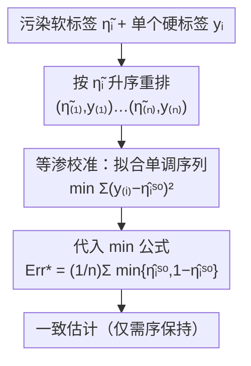

# Practical Estimation of the Optimal Classification Error with Soft Labels and Calibration

**会议**: ICLR 2026  
**OpenReview**: [https://openreview.net/forum?id=1Q85tfZaOa](https://openreview.net/forum?id=1Q85tfZaOa)  
**代码**: https://github.com/RyotaUshio/bayes-error-estimation  
**领域**: 学习理论 / 贝叶斯误差估计 / 统计一致性  
**关键词**: 贝叶斯误差、软标签、校准、等渗回归、偏差分析

## 一句话总结
本文在二分类的贝叶斯误差（最优错误率）估计上做了两件事：一是给出比前人紧得多、且会随两类分布"分得开不开"而自适应加速的偏差界；二是提出在软标签被污染时先用等渗校准再代入估计公式，只要软标签的"序"没乱就能得到统计一致的估计。

## 研究背景与动机
**领域现状**：刷 benchmark 时大家总拿新方法的错误率去和 SOTA 比，但任何模型的错误率都有一个由数据分布本身决定的下限——贝叶斯误差 $\mathrm{Err}^\* = \inf_h \mathrm{Err}(h)$。知道这个下限很有用：SOTA 已经贴着下限就别再卷了（省算力、省钱、省碳），而且测试集得分若逼近甚至超过下限往往是过拟合/泄漏的信号。二分类里估计贝叶斯误差的方法分两派：从"实例-标签对"估计，和较新的从软标签 $\eta_i := P(y=1\mid x=x_i)$ 估计。

**现有痛点**：Ishida et al. (2023) 的软标签法很优雅——它是 **instance-free**（不需要看输入 $x$ 本身，因而不受维度灾难影响，还能用在医疗等隐私场景）。但它有两处软肋。其一，真实的干净软标签只有 oracle 才知道，实践中只能用 $m$ 个硬标签的平均 $\hat\eta_i = \frac1m\sum_j y_i^{(j)}$ 去近似，而它给出的偏差界是 $\tilde O(1/\sqrt m)$，在 $m$ 很小（如 CIFAR-10H 每张图才约 50 个标注）时大得几乎没意义；该界还随样本数 $n$ 增大而增大，很反直觉。其二，软标签会因"标注分布漂移"、人类/LLM 标注者的主观性而被扭曲——例如 CIFAR-10H 是在图像降采样**之后**才标注的，不确定性更高，直接把这些软标签代入估计器会得到一个高得离谱的贝叶斯误差（甚至大于 ViT 的实测错误率）。

**核心矛盾**：软标签法的理论保证（偏差界）太松、且没处理"软标签本身被污染"这一现实情形；前人虽提到漂移问题但没给解法。

**本文目标**：(1) 把硬标签近似估计器的偏差界做细、做紧；(2) 形式化"从污染软标签估计贝叶斯误差"这一新问题并给出有保证的算法。

**切入角度**：偏差大小其实和"两类分得开不开"强相关——离决策边界 $\eta=0.5$ 远的样本几乎不贡献偏差；而处理污染时，与其去恢复软标签的精确数值，不如只依赖其"序"，这正好是等渗校准能保证的东西。

**核心 idea**：用"分离度自适应"的视角重写偏差界（快率 $1/m$ 与慢率 $1/\sqrt m$ 的混合），并用等渗校准把"序保持"这一弱假设转化为统计一致性。

## 方法详解

### 整体框架
本文不是一个工程 pipeline，而是围绕同一个即插即用估计器
$$\widehat{\mathrm{Err}^\*}(\eta_{1:n}) = \frac1n\sum_{i=1}^n \min\{\eta_i,\,1-\eta_i\}$$
展开的两条理论线。这个公式来自 $\mathrm{Err}^\* = \mathbb{E}_{x}\big[\min\{\eta(x),1-\eta(x)\}\big]$（Cover, 1968）把期望换成样本均值，对干净软标签它无偏且一致。

**第一条线（Section 2）**：拿到的不是干净 $\eta_i$ 而是 $m$ 个硬标签的平均 $\hat\eta_i$，要把这个近似带来的**偏差**刻画清楚——证明偏差衰减速度随类别分离度变化，并给出一个只需"贝叶斯误差上界"就能算的可计算界。

**第二条线（Section 3）**：拿到的是被未知单调变换扭曲的"污染软标签" $\tilde\eta_i$。这里有一个清晰的三步处理流程：先把污染软标签**校准**回可用的概率，再代入上面的估计公式。本文论证"光校准准（calibrated）还不够"，并指明等渗校准（isotonic calibration）是能给出一致估计的那把钥匙。第二条线的流程如下：

两条线共享 instance-free 的优点：全程不碰输入 $x$，只用软标签（外加每个实例一个硬标签来做校准）。

### 关键设计

**1. 软标签即插即用估计器：把贝叶斯误差写成可估的样本均值**

整套工作都立在 $\mathrm{Err}^\* = \mathbb{E}_x[\min\{\eta(x),1-\eta(x)\}]$ 这个恒等式上。它的好处是把"最优分类器"这种抽象对象，变成对软标签做一个逐点 $\min$ 再平均的简单统计量 $\widehat{\mathrm{Err}^\*}(\eta_{1:n})$，无偏且以 $\tilde O(1/\sqrt n)$ 速率一致。关键在于它 **instance-free**——估计时根本不用 $\{x_i\}$，因此不受高维诅咒，也天然适配"拿不到原始数据"的隐私场景。本文所有改进都是在"软标签从哪来、准不准"这一层做文章，而非改这个公式本身。

**2. 分离度自适应的偏差界：偏差衰减是 $1/m$ 与 $1/\sqrt m$ 的混合**

针对"用硬标签平均 $\hat\eta_i$ 近似 $\eta_i$ 导致偏差、且前人界太松"这一痛点，定理 1 给出
$$-\mathbb{E}_x\Big[\min\Big\{\tfrac{L_{\mathrm{Err}}(\eta(x))}{m},\ \sqrt{\tfrac{\pi}{2m}}\Big\}\Big]\ \le\ \mathbb{E}\big[\widehat{\mathrm{Err}^\*}(\hat\eta_{1:n})\big]-\mathrm{Err}^\*\ \le\ 0,$$
其中 $L_{\mathrm{Err}}(q)=\frac{q(1-q)}{|2q-1|}$（$q\ne0.5$ 时），在 $q\to0.5$ 处发散、在 $q$ 靠近 0 或 1 时趋于零。这说明：靠近决策边界（$\eta\approx0.5$）的样本贡献大偏差、走慢率 $1/\sqrt m$，远离边界的样本几乎不贡献、走快率 $1/m$，整体偏差是两者按"类别分得开不开"加权的混合。两个直接好处：界里**不再含 $n$**（修掉了前人界随 $n$ 增大的反直觉项），且严格优于前人界（命题 1）。推论 1 进一步给出：若 $|\eta(x)-0.5|\ge c$ 几乎处处成立（完美可分 + 标签噪声即满足，$c=|\nu-0.5|$），偏差以快率 $O(1/m)$ 衰减——而真实数据集常常是良分离的，所以这个快率在实践中往往成立。

**3. 可计算偏差界 $B(E,m)$：只要知道贝叶斯误差的一个上界就能算**

定理 1 虽紧，但要算它的数值得知道分布的细节（如 $L_{\mathrm{Err}}$ 的期望），实践中拿不到。推论 2 把它松弛成只依赖"贝叶斯误差上界 $E$"（比如直接拿 SOTA 模型的测试错误率当 $E$）的可计算量：
$$B(E,m)=\inf_{t\in(0,1/2)}\frac{t(1-t)}{1-2t}\Big[\frac1m+\min\big\{1,\tfrac{E}{t}\big\}\sqrt{\tfrac{\pi}{2m}}\Big].$$
它无需任何分布信息即可数值求解。在二值化 CIFAR-10（$n=10000$、$m\approx50$、$E$ 取 ViT 的 $0.0005$）上，前人界提示偏差可能高达 $0.557$，而本文界证明偏差绝不超过 $0.00276$——**紧了 200 多倍**，把"硬标签近似到底有多不准"从"不可用"拉回到"基本可信"。

**4. 校准≠准确，等渗校准才给一致性：用"序保持"换掉"软标签干净"假设**

第二条线处理污染软标签 $\tilde\eta_i$。一个自然念头是"先把 $\tilde\eta_i$ 校准成 well-calibrated 再代入"，但本文用例 2 戳破它：取两支不相交支撑、混合率 $\theta=0.5$ 的分布，真实贝叶斯误差为 0，可一个恒输出 $\hat\eta_i\equiv0.5$ 的常值预测器是**完美校准**的，代入却给出 $\min\{0.5,0.5\}=0.5$ 的荒谬估计。原因是校准只是 $c(x)=\mathbb{E}[y\mid c(x)]$，是 $c(x)=P(y=1\mid x)$ 的必要非充分条件。本文转而选**等渗校准**：把 $(\tilde\eta_i,y_i)$ 按 $\tilde\eta_i$ 升序重排，再用等渗回归拟合一条单调序列 $\hat\eta^{\mathrm{iso}}$ 最小化 $\frac1n\sum(y_{(i)}-\hat\eta^{\mathrm{iso}}_{(i)})^2$，最后代入 $\min$ 公式。定理 2 证明：只要存在某单调递增函数 $f$ 使 $\tilde\eta_i=f(\eta_i)$（即污染只改"值"不改"序"），则以高概率
$$\big|\widehat{\mathrm{Err}^\*}(\hat\eta^{\mathrm{iso}}_{1:n})-\mathrm{Err}^\*\big|\le C\Big(\tfrac1{n^{1/3}}+\sqrt{\tfrac{\log(1/\delta)}{n}}\Big).$$
这把前人"必须拿到干净软标签 $\eta_i$"的强假设，松弛成"只需知道软标签的序"（取 $f=\mathrm{id}$ 即回到干净情形）。定理 3 进一步允许加性噪声 $\tilde\eta_i=f(\eta_i)+\varepsilon_i$（$f'\ge c>0$、$\mathrm{Var}(\varepsilon_i)\le\sigma^2$），误差界多出一个 $O(\sigma)$ 项；而硬标签平均带来的随机性恰好对应 $\sigma=\frac1{2\sqrt m}$。用等渗回归的好处是**不对污染方式作参数假设**，因此鲁棒；其局限是当 $f$ 的导数可任意小（太"平"）时保证会失效。

### 损失函数 / 训练策略
本文无需训练模型，核心计算是等渗回归（保序最小二乘，PAVA 算法可解）与 $\min$ 平均；唯一"调参"是校准算法的选择（直方图分箱需选箱数 $b$）。

## 实验关键数据

### 主实验
在合成数据、CIFAR-10、Fashion-MNIST 上估计贝叶斯误差，对比"直接用污染软标签"与各校准算法（误差棒为 1000 次 bootstrap 的 95% 置信区间）。

| 数据集 | corrupted（直接代入） | 校准后（isotonic 等） | 参考线 |
|--------|------------------------|------------------------|--------|
| 合成（真值≈已知） | 严重高估 | 拉回合理范围 | 真实贝叶斯误差 |
| CIFAR-10 | 远高于 ViT 0.05% | 贴近 ViT 测试误差 | ViT 0.05% 虚线 |
| Fashion-MNIST | 明显高估 | isotonic/beta*/platt 合理；hist-25 失效偏高 | ResNet-18 测试误差 |

结论：污染软标签的"不自信"会把贝叶斯误差严重高估；所有校准方法都明显改善，但直方图分箱对箱数敏感（hist-25 在 Fashion-MNIST 上仍偏离 ResNet 误差），印证"必须挑对校准算法"。

### 偏差界对比 / FeeBee 排名

| 对比项 | 本文 | 前人（Ishida 2023） |
|--------|------|----------------------|
| CIFAR-10 偏差上界（$n{=}10^4,m{=}50,E{=}0.0005$） | ≤ 0.00276 | ≤ 0.557（松约 200×） |
| 界是否含 $n$ | 否（不随 $n$ 增大） | 含 $n$，随 $n$ 增大 |

FeeBee 框架（注入不同强度合成噪声、看估计器能否跟上贝叶斯误差变化，越低越好）在 6 个真实数据集上的排名：isotonic 与 platt 几乎总在最优梯队；hist-* 调好箱数才行、波动大；beta* 在多数数据集明显更差（却常在单年 ICLR 数据上最好）。

### 关键发现
- **分离度决定收敛速度**：良分离数据上偏差走快率 $O(1/m)$，最坏情形才退化到 $O(1/\sqrt m)$；这解释了为何前人最坏界在实践中过于悲观。
- **校准准 ≠ 估计准**：完美校准的常值预测器也能给出完全错误的贝叶斯误差，校准算法的"形状归纳偏置"才是关键。
- **等渗 vs beta**：beta 校准虽是合成实验里"设定正确"的参数化校准器却表现差，说明非参数、只靠序的等渗回归更稳。
- **Platt 的意外强势**：Platt scaling 隐含输入为高斯混合（无界）的假设，但软标签其实落在 $[0,1]$ 有界区间，假设不匹配却仍给出准确估计，作者留作 open question。
- **ICLR 评审数据**：作者新构建了 $n=32829$ 条 ICLR 2017–2025 评审数据（归一化加权平均分当污染软标签、最终 accept/reject 当硬标签），把"理想评审者误拒好论文/误收坏论文的概率"也当贝叶斯误差来估，作为评审任务固有难度的代理。

## 亮点与洞察
- **把"偏差有多大"从分布几何里读出来**：用 $L_{\mathrm{Err}}$ 这个发散于 $0.5$、压平于两端的函数，直观刻画"靠近边界的点才是偏差元凶"，比单纯报一个 $1/\sqrt m$ 率信息量大得多。
- **可计算界只要一个上界 $E$**：实践者拿现成 SOTA 错误率就能算偏差上界，门槛极低，直接把理论变成可用工具。
- **用反例论证"校准不够"**：例 2 一句话点破 calibration 与 posterior 的本质差距，把"该选什么校准"从经验问题提升为有保证的设计问题。
- **instance-free + 只需序**：两条假设都极弱（不看 $x$、不要软标签数值只要序），让方法能落到医疗、隐私、LLM 标注等拿不到干净标签的真实场景。

## 局限与展望
- 全程限定**二分类**；多分类的贝叶斯误差估计是作者明确列出的重要未来方向。
- 定理 3 要求污染函数 $f$ 的导数有正下界（$f'\ge c$），对"太平"的 $f$（导数可任意小）失效，且尚不清楚违反假设会损失多少精度——不过合成实验显示即便如此方法仍常表现不错。
- 校准需要每个实例一个**硬标签** $y_i$ 来拟合校准映射，纯软标签且无任何硬标签时不适用。
- Platt scaling 假设不匹配却好用的现象缺乏理论解释；其他校准算法（如 Platt）的一致性保证也尚未给出。

## 相关工作与启发
- **vs Ishida et al. (2023)**：本文的直接前作，提出软标签即插即用估计器与 $\tilde O(1/\sqrt m)$ 偏差界，但界松、含 $n$、且未解决污染软标签。本文紧化偏差界（约 200×）、去掉 $n$ 依赖、并补上污染情形的一致估计，假设从"软标签干净"松弛到"序保持"。
- **vs 基于实例-标签对的估计（Fukunaga-Hostetler、Berisha 等）**：那一派需要访问输入 $x$，受高维诅咒、且隐私场景不可用；本文延续 instance-free 路线规避这些问题。
- **vs 直方图分箱 / beta 校准 / Platt scaling**：本文把这些校准器都纳入估计框架做横评，论证等渗校准（非参数、只需序保持）在统计一致性上独有保证，并用 FeeBee 给出实证排名支撑。

## 评分
- 新颖性: ⭐⭐⭐⭐ 把分离度自适应偏差分析 + 等渗校准一致性两条贡献串进同一个估计器，视角新。
- 实验充分度: ⭐⭐⭐⭐ 合成 + 4 类真实数据 + FeeBee 横评 + 自建 ICLR 评审数据集，覆盖面广。
- 写作质量: ⭐⭐⭐⭐ 定理-推论层层递进、反例点睛，理论叙述清晰。
- 价值: ⭐⭐⭐⭐ 给"该不该继续卷 SOTA / 是否过拟合测试集"提供了可计算的实用工具。

<!-- RELATED:START -->

## 相关论文

- [\[ICLR 2026\] Minimax-Optimal Aggregation for Density Ratio Estimation](minimax-optimal_aggregation_for_density_ratio_estimation.md)
- [\[ICLR 2026\] Know When to Abstain: Optimal Selective Classification with Likelihood Ratios](know_when_to_abstain_optimal_selective_classification_with_likelihood_ratios.md)
- [\[ICLR 2026\] An Efficient, Provably Optimal Algorithm for the 0-1 Loss Linear Classification Problem](an_efficient_provably_optimal_algorithm_for_the_0-1_loss_linear_classification_p.md)
- [\[ICLR 2026\] Information Estimation with Discrete Diffusion](information_estimation_with_discrete_diffusion.md)
- [\[ICLR 2026\] Conformal Prediction for Long-Tailed Classification](conformal_prediction_for_long-tailed_classification.md)

<!-- RELATED:END -->
