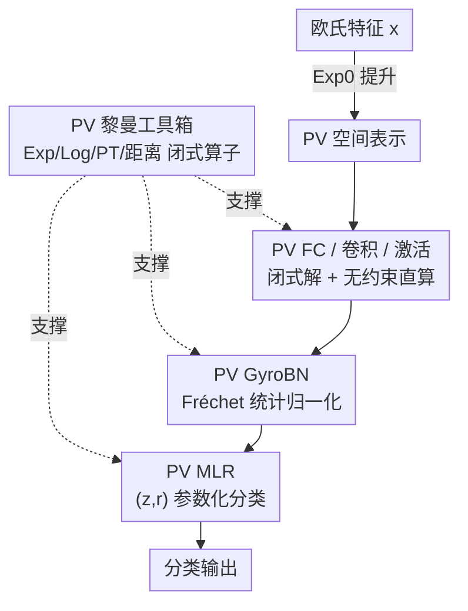

# Proper Velocity Neural Networks

**会议**: ICLR 2026  
**OpenReview**: [https://openreview.net/forum?id=UDIYU1X3vC](https://openreview.net/forum?id=UDIYU1X3vC)  
**代码**: https://github.com/NickyoyoSu/PVNN  
**领域**: 几何深度学习 / 双曲神经网络  
**关键词**: 双曲几何, Proper Velocity, 黎曼算子, GyroBN, 表示学习

## 一句话总结
本文把源自狭义相对论的「固有速度（Proper Velocity, PV）」空间引入机器学习，先补齐它的完整黎曼工具箱（指数/对数映射、平行移动、测地距离的闭式解），再在其上搭出 MLR、全连接、卷积、激活、批归一化等核心层，得到一套数值稳定、且在强双曲数据上优于 Poincaré / 双曲面模型的 Proper Velocity 神经网络（PVNN）。

## 研究背景与动机
**领域现状**：双曲几何因为指数级的表示容量，天然适合层级 / 树状数据，已经在视觉、知识图谱、NLP、图学习、基因组学等场景被广泛使用。近年研究的重心从「学双曲嵌入」转向「直接在双曲空间里搭网络」（Hyperbolic Neural Networks, HNN），而搭网络时选哪个双曲模型是核心设计——目前几乎所有工作都建立在 **Poincaré 球**或**双曲面（Lorentz）模型**上，因为它们有现成的黎曼 / gyrovector 算子。

**现有痛点**：这两个模型都是**有约束的空间**。Poincaré 球要求 $\|x\|^2 < -1/K$，嵌入一旦逼近边界，数值计算就会失稳、梯度趋于消失；双曲面模型要求点严格落在 $x_t^2-\|x_s\|^2 = 1/K$ 的曲面上，大尺度运算下容易跑出流形、产生 NaN/Inf 甚至梯度爆炸。换句话说，约束本身既是几何结构的来源，也是数值不稳定的根源。

**核心矛盾**：双曲建模需要的「负曲率结构」和工程上需要的「数值稳定」在有约束模型里互相牵制——越是把表示推向边界（利用双曲容量），越容易踩到数值悬崖。

**本文目标**：找一个**无约束**、又确实等价于双曲几何的表示空间，并在它上面把神经网络该有的层全部补齐。

**切入角度**：作者注意到狭义相对论里描述相对论速度叠加的 **Proper Velocity（PV）空间** $\mathrm{PV}^n_K = \mathbb{R}^n$ ——它在代数上构成一个 gyrovector 空间（与 Poincaré 球的 Möbius gyrovector 空间同构），却是整个 $\mathbb{R}^n$、没有边界约束。它在相对论物理里早已成熟，但其黎曼算子（指数/对数映射、平行移动）在机器学习里几乎是空白。

**核心 idea**：用无约束的 PV 空间替换有约束的 Poincaré / 双曲面模型，先推导出 PV 的完整闭式黎曼算子，再据此搭建一整套 PV 神经网络层，从根上规避边界数值不稳定。

## 方法详解

### 整体框架
PVNN 的搭建是一条「先打地基、再砌墙」的流水线：输入是欧氏特征，经 $\mathrm{Exp}_0$ 提升进 PV 空间（PV 无约束，也可直接把欧氏坐标当 PV 坐标用）；中间堆叠 PV 版的 MLR / FC / 卷积 / 激活 / GyroBN 层；输出是分类得分。整条流水线的可行性都压在一块基石上——**PV 空间的闭式黎曼算子工具箱**，所有上层结构都靠它来定义「点到超平面距离」「均值/方差」等运算。

关键的技术杠杆是：作者证明了 PV 空间与 Poincaré 球之间存在**黎曼等距同构**（不仅是代数 gyro 同构）。于是 Poincaré 球已有的闭式算子可以通过等距「搬运」到 PV 空间，省去从零推导。

### 关键设计

**1. PV 黎曼工具箱：用等距同构从 Poincaré 球「借」算子**

要在任何流形上搭网络，前提是知道怎么算指数映射、对数映射、平行移动和测地距离；PV 空间此前在 ML 里没人推过这些。本文先建立映射 $\pi_{\mathrm{PV}\to P}: x \mapsto \frac{\beta_x}{1+\beta_x}x$（$\beta_x = \frac{1}{\sqrt{1-K\|x\|^2}}$ 是相对论 beta 因子）及其逆映射，证明它们不仅保持 gyro 运算（gyrovector 同构），而且是**黎曼等距**（Thm. 4.2）——即逐点保内积。有了等距，Poincaré 球的闭式算子可直接拉回 PV，得到 PV 的 $\mathrm{Exp}_x$、$\mathrm{Log}_x$、平行移动 $\mathrm{PT}_{x\to y}$ 和距离 $d(x,y)$ 的闭式表达。在原点处它们进一步简化，例如 $\mathrm{Exp}_0(v) = \frac{1}{\sqrt{-K}}\sinh(\sqrt{-K}\|v\|)\frac{v}{\|v\|}$。这一步是整篇论文真正的「地基」：它把一个物理学里的速度空间，第一次配齐了搭神经网络所需的全套黎曼运算，且因为 PV 无约束，这些算子在大范数输入下依然稳定。

**2. PV MLR：用 $(z_k, r_k)$ 参数化把分类层退化成矩阵乘**

欧氏 MLR 的每个 logit 可看作「点到超平面的带符号间隔距离」。把这套搬到 PV 上，需要 PV 超平面 $H_{a,p}$ 和 PV 点到超平面距离（Thm. 5.1）。但直接照搬有三个毛病：超平面参数 $p_k$ 过参数化、表达式里的 gyroaddition $-p_k \oplus_U x$ 计算复杂、且参数受约束需要昂贵的黎曼优化。作者借鉴 Shimizu et al. 的思路，把参数重写为 $p_k = \mathrm{Exp}_0(r_k z_k/\|z_k\|)$、$a_k = \mathrm{PT}_{0\to p_k}(z_k)$，其中 $z_k \in \mathbb{R}^n$、$r_k \in \mathbb{R}$ 是无约束自由参数。重参数化后，类别 $k$ 的得分化简为

$$v_k(x) = \frac{\|z_k\|}{\sqrt{-K}}\sinh^{-1}\!\left(\frac{\cosh(\sqrt{-K}r_k)}{\sqrt{-K}}\|z_k\|\langle x, z_k\rangle - \sinh(\sqrt{-K}r_k)\sqrt{1-K\|x\|^2}\right).$$

关键好处是这个式子只依赖内积 $\langle x, z_k \rangle$——一次矩阵乘就能算整个 batch 的所有类别得分，避开了原始形式里 $b\times C\times n$ 的中间张量（高维下会 OOM）。而且当 $K\to 0^-$ 时 $v_k(x)\to \langle x,z_k\rangle + b_k$，干净地退回欧氏 MLR，说明它是欧氏分类层的几何推广。

**3. PV FC / 卷积 / 激活：闭式 FC + 无约束空间里的「直接激活」**

欧氏 FC 层 $y=Ax+b$ 的每一维同样可写成「到过原点、与输出轴正交的超平面的带符号距离」。把左边用 PV 点到超平面距离、右边用上面的 $v_k(x)$ 表达，PV FC 层有闭式解（Thm. 5.3）：$y_k = \frac{1}{\sqrt{-K}}\sinh(\sqrt{-K}v_k(x))$，并可把激活 $\sigma$ 内嵌成 $y_k = \frac{1}{\sqrt{-K}}\sinh(\sqrt{-K}\sigma(v_k(x)))$。卷积则归约为「PV 拼接 + PV FC」——因为 PV 无约束，PV 拼接直接等同欧氏拼接，于是感受野内各点拼起来过一个 FC 就是 PV 卷积。激活更省事：Poincaré 网络要绕到切空间做 $x\mapsto\mathrm{Exp}_0(\sigma(\mathrm{Log}_0(x)))$，而 PV 因为无约束，可以**直接在 PV 空间施加欧氏激活** $x\mapsto\sigma(x)$，省掉一对指数/对数映射，更高效。这一簇层共同体现了「无约束」带来的工程红利。

**4. PV GyroBN：用 Fréchet 统计量做批归一化，并有同质性保证**

欧氏 BN 的减均值、加偏置、缩放，在流形上分别对应 gyro 减、gyro 加、gyro 乘。本文把 GyroBN 框架扩到 PV：给定一批激活 $\{x_i\}$，先算 Fréchet 均值 $\mu$ 和 Fréchet 方差 $v^2$（即在 PV 上最小化平方测地距离之和），再做

$$\tilde{x}_i \leftarrow \underbrace{\beta \oplus_U}_{\text{偏置}}\Big(\underbrace{\tfrac{s}{\sqrt{v^2+\epsilon}}\otimes_U}_{\text{缩放}}\big(\underbrace{-\mu \oplus_U x_i}_{\text{居中}}\big)\Big).$$

PV 的 Fréchet 均值可借等距映射到 Poincaré 球上用现成算法求、再映射回来。作者还证明了**同质性定理**（Thm. 5.4）：gyro 平移可与 Fréchet 均值交换、gyro 缩放对离散度按 $t^2$ 线性——这正好解释了上式三步的效果：居中后 batch 均值落到原点 0、偏置后平移到 $\beta$、缩放后方差变成 $s^2$。与那些「仅用黎曼算子拼出来、缺乏统计量归一化理论保证」的流形 BN 相比，PV GyroBN 是**有理论保证地**把样本统计量真正归一化。

### 损失函数 / 训练策略
没有特制损失，沿用各任务标准目标（分类用交叉熵）。曲率 $K$ 在多数实验里固定共享（如基因组任务全层共用一个曲率）。$(z_k, r_k)$ 等参数都是无约束的欧氏自由参数，无需黎曼优化器，普通优化器即可训练。

## 实验关键数据

实验围绕四件事：数值稳定性、图像分类（CIFAR）、图节点分类、基因组序列学习。

### 数值稳定性（FP32，K=−1，n=16）

| 探针 | 指标 | PV | Poincaré | 双曲面 |
|------|------|----|----------|--------|
| 标量 gyro 乘 $r\otimes x$（r 到 1000） | 失败率(NaN/Inf) | 0% | 0% | r≥20 起失败，r=200 时 100% |
| 往返误差 $\|\mathrm{Log}_0(\mathrm{Exp}_0(v))-v\|$ | FP32 | $2.1\times10^{-7}$ | $2.1\times10^{-4}$ | $1.0\times10^{0}$ |
| 梯度幅度范围 | $\|\nabla x\|$ | $[1.1e\text{-}4, 2.1e\text{-}6]$ 稳定 | $[1.1e\text{-}11, 7.6e\text{-}13]$ 消失 | $[0, \mathrm{NaN}]$ 爆炸 |

PV 在 FP32 下一路无失败、无违例（无约束故 violation 报 N/A），往返误差比 Poincaré 小 3 个数量级，梯度落在「不消失也不爆炸」的安全带——直接验证了无约束空间的数值优势。

### 主实验：图像分类 与 图学习

| 任务 | 数据集 | 本文 PVNN | 最强双曲基线 |
|------|--------|-----------|--------------|
| 图像分类(ResNet-18) | CIFAR-100 | **78.20** (PV MLR w/o Exp0) | 77.96 (Lorentz MLR) |
| 图节点分类 | Airport (δ=1) | **97.96** | 88.40 (HNN++) |
| 图节点分类 | Disease (δ=0) | **81.15** | 80.57 (HNN++) |
| 图节点分类 | PubMed (δ=3.5) | **74.33** | 73.68 (HNN++) |
| 图节点分类 | Cora (δ=11，弱双曲) | 51.42 | 53.34 (Lorentz LNN) |
| 基因组(MCC) | SINEs | **93.78** | 85.45 (HCNN-S) |
| 基因组(MCC) | LINEs | **81.83** | 76.12 (HCNN-S) |

PV MLR 在 CIFAR-100（决策边界更复杂处增益最大）领先；图学习在三个强双曲数据集（Disease/Airport/PubMed）全面最优，Airport 比最强基线高 5.86 个点；唯独在**弱双曲**的 Cora 上不及双曲面模型——印证「PV 在强双曲数据上更管用」。基因组任务 PVCNN 全胜，SINEs 上比 HCNN-S 高约 9 个 MCC 点。

### 消融实验

| 配置 | Disease | Airport | 说明 |
|------|---------|---------|------|
| PVNN (Riemannian PV FC) | 81.24 | 97.93 | 完整 |
| PVNN+TFC（切空间 FC） | 80.86 | 86.99 | 换成切空间 FC，强双曲处掉很多 |
| PVNN+GyroBN | 81.24 | 99.03 | Fréchet 归一化 |
| PVNN+TBN（切空间 BN） | 80.67 | 98.71 | 换切空间 BN，全数据集更差 |

### 关键发现
- **黎曼层 > 切空间近似**：真正在 PV 流形上做 FC/BN，比绕切空间的 TFC/TBN 在强双曲数据上明显更好，验证「黎曼构造」而非「切空间偷懒」是增益来源。
- **Fréchet 迭代次数是精度/速度权衡**：Fréchet 均值迭代越多精度越高（Airport 上 10 迭代达 99.03），但 Tangent/Euclidean 近似可快约 2× 且精度相近，可按需选。
- **PV 几何只在「足够双曲」时占优**：弱双曲的 Cora 上 PV 不如双曲面模型，提示该方法的甜区是强层级结构数据。
- **是否 Exp0 提升影响很小**：因 PV 无约束，直接把欧氏坐标当 PV 坐标用与先 Exp0 提升效果接近（图像分类里 w/o Exp0 还略好）。

## 亮点与洞察
- **把物理学的速度空间「翻译」成 ML 工具**：最「啊哈」的是直接拿狭义相对论里描述相对论速度叠加的 PV 空间当神经网络的承载几何，且证明它与 Poincaré 球黎曼等距——于是无需从零推导，旧算子等距搬运即可，这套「找等距、借算子」的套路可复用到其他流形。
- **无约束 = 数值稳定的免费午餐**：边界约束既给双曲结构也带来数值悬崖，换成无约束的 PV 后，激活可直接施加、拼接等同欧氏、梯度不再消失/爆炸，工程上一举多得。
- **$(z,r)$ 重参数化把流形分类层降维成矩阵乘**：既避开黎曼优化，又把会 OOM 的三阶张量化简为内积，是让双曲层真正可大规模训练的实用 trick。

## 局限与展望
- **甜区受限于数据双曲性**：在弱双曲数据（Cora）上 PV 反而不如双曲面模型，说明它不是「处处更好」，需要数据本身有较强层级结构。
- **Fréchet 均值需迭代求解**：精度最高的 GyroBN 依赖迭代求 Fréchet 统计量，比切空间/欧氏近似慢，强双曲大图上有额外开销。
- **仅验证了基础架构**：作者承认只搭了 MLR/FC/卷积/激活/BN，尚未扩展到残差网络、Transformer 等更先进结构（列为 future work）；大规模深度学习上的表现仍待验证。
- **曲率多为固定共享**：实验里 $K$ 多固定，可学习/逐层曲率与该几何的交互未深入探讨。

## 相关工作与启发
- **vs Poincaré 球 HNN/HNN++（Ganea / Shimizu）**：它们靠有界球内的 Möbius 算子搭层，靠近边界数值失稳、梯度消失；本文用无约束 PV 替代，并证明二者等距，从而既保留双曲容量又规避边界悬崖。
- **vs 双曲面/Lorentz 网络（Chen 2022 / Bdeir 2024 LNN/HCNN）**：双曲面在大尺度运算下易跑出流形、NaN/爆炸；PV 在 FP32 下一路稳定，且在强双曲图与基因组任务上反超它们。
- **vs 流形 BN（Brooks / Lou / 早期 GyroBN）**：早期流形归一化常缺乏「真正归一化样本统计量」的理论保证；本文 PV GyroBN 借同质性定理给出了均值/方差被精确归一化的证明。

## 评分
- 新颖性: ⭐⭐⭐⭐⭐ 首次系统地把相对论 PV 空间引入表示学习，并配齐黎曼工具箱与完整层族。
- 实验充分度: ⭐⭐⭐⭐ 覆盖数值/视觉/图/基因组四类任务且消融细致，但缺大规模与先进架构验证。
- 写作质量: ⭐⭐⭐⭐ 理论推导清晰、动机连贯，公式较密对读者门槛偏高。
- 价值: ⭐⭐⭐⭐ 为双曲神经网络提供了一个数值更稳的新几何选项，套路可迁移到其他流形。

<!-- RELATED:START -->

## 相关论文

- [\[ICLR 2026\] Reducing Symmetry Increase in Equivariant Neural Networks](reducing_symmetry_increase_in_equivariant_neural_networks.md)
- [\[ICLR 2026\] From Neural Networks to Logical Theories: The Correspondence between Fibring Modal Logics and Fibring Neural Networks](from_neural_networks_to_logical_theories_the_correspondence_between_fibring_moda.md)
- [\[ICLR 2026\] Random Spiking Neural Networks are Stable and Spectrally Simple](random_spiking_neural_networks_are_stable_and_spectrally_simple.md)
- [\[ICLR 2026\] Feature Compression is the Root Cause of Adversarial Fragility in Neural Networks](feature_compression_is_the_root_cause_of_adversarial_fragility_in_neural_network.md)
- [\[ICLR 2026\] Tractability via Low Dimensionality: The Parameterized Complexity of Training Quantized Neural Networks](tractability_via_low_dimensionality_the_parameterized_complexity_of_training_qua.md)

<!-- RELATED:END -->
