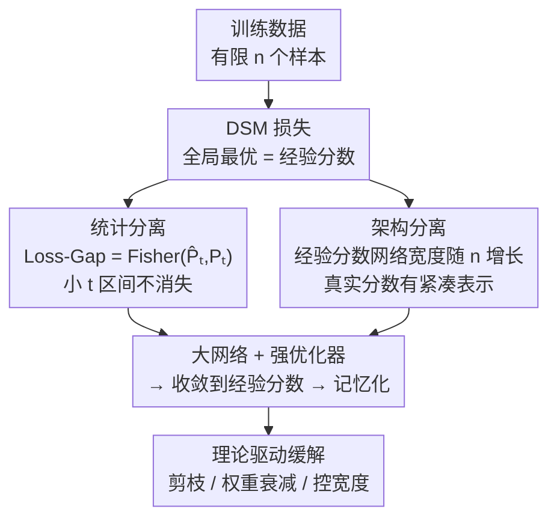

# Provable Separations between Memorization and Generalization in Diffusion Models

**会议**: ICLR 2026  
**OpenReview**: [https://openreview.net/forum?id=42gfTZzyvV](https://openreview.net/forum?id=42gfTZzyvV)  
**代码**: 待确认  
**领域**: 扩散模型 / 学习理论  
**关键词**: 扩散模型, 记忆化, 去噪分数匹配, Fisher 散度, 网络逼近

## 一句话总结
本文从「统计估计」和「网络逼近」两个互补视角证明：扩散模型里的记忆化（reproduce 训练样本而非泛化生成）根本上来源于真实分数函数与经验分数函数之间的两道可证明的「分离」——真实分数并不最小化去噪分数匹配损失，且经验分数需要随样本数增长的网络才能逼近——并据此给出一个面向 DiT 的剪枝缓解方法。

## 研究背景与动机
**领域现状**：扩散模型靠估计分数函数 $\nabla\log p_t$ 来反向去噪采样，训练目标是去噪分数匹配（denoising score matching, DSM）损失。它在图像、分子、时间序列等任务上都是 SOTA 级生成器。

**现有痛点**：但扩散模型会「记忆化」——直接复刻训练样本而不是生成新样本，既损害创造力，又带来隐私和版权风险。已有大量经验研究观察到记忆化与数据重复、网络容量、训练流程相关，并提出去重、改训练目标、改采样等启发式缓解手段，但「为什么这些手段有效」缺乏原理性解释。

**核心矛盾**：现有理论分析大多是**渐近**的（样本数 $n$ 与维度 $d$ 同比例增长），无法解释**实际的有限样本**情形下记忆化为什么会冒头。问题的根子在于：训练用的是经验分布 $\widehat{P}_{\text{data}}$ 而非真实分布 $P_{\text{data}}$，而经验分数函数 $\nabla\log\widehat{p}_t$ 恰恰是 DSM 损失的**全局最小值**——一个足够强的优化器天然就会把网络拉向这个会导致记忆化的解。

**本文目标**：在实际的非渐近、有限样本区间内，把记忆化和泛化「拆开」（disentangle），并据此给出可操作的缓解策略。具体拆成两个子问题：(1) 真实分数和经验分数在**统计**上差多少？(2) 它们在**网络表示复杂度**上差多少？

**核心 idea**：用「双重分离」（dual-separation）刻画记忆化——从估计侧证明真实分数不最小化 DSM 损失（存在不可忽略的 Loss-Gap），从逼近侧证明经验分数需要随 $n$ 增长的网络，而真实分数有紧凑表示；两道分离合在一起解释了「为何强优化器 + 大网络 = 记忆化」，并直接指向剪枝/权重衰减/控宽度这些缓解手段。

## 方法详解

### 整体框架
本文不是一个训练 pipeline，而是一套围绕「真实分数 $\nabla\log p_t$ vs 经验分数 $\nabla\log\widehat{p}_t$」展开的理论分析，外加一个由理论导出的缓解算法。逻辑主线是：先在**估计侧**说明经验分数（记忆化的源头）才是 DSM 损失的最优解、真实分数与它差一个不消失的 Loss-Gap；再在**逼近侧**说明经验分数难表示（网络规模随 $n$ 增长）、真实分数好表示（紧凑）；两道分离叠加给出「大网络 + 强优化器 → 收敛到经验分数 → 记忆化」的完整因果链；最后顺着「真实分数更 Lipschitz、更紧凑」这一观察，提出限制网络容量的剪枝法来把模型从经验分数拉回真实分数附近。

数据假设统一为 **sub-Gaussian Hölder 密度**（$p(x)=\exp(-C\|x\|_2^2/2)\cdot f(x)$，$f$ 为 $\beta$-Hölder 且有正下界），并实例化为良好分离的混合分布 $P_{\text{data}}=\frac{1}{K}\sum_k P^{(k)}$ 来给出可计算的下界。

### 关键设计

**1. 统计分离：真实分数并不最小化去噪分数匹配损失**

这针对的痛点是「记忆化的源头到底在训练目标的哪里」。本文定义逐时刻的损失差 $\text{Loss-Gap}_t=\frac{1}{n}\sum_i\left(\ell_t(x_i,\nabla\log p_t)-\ell_t(x_i,\nabla\log\widehat{p}_t)\right)$，即在真实分数处的 DSM 损失减去在经验分数处的损失。关键的第一步（Proposition 4.1）是把这个看似复杂的量等同于一个 **Fisher 散度**：

$$\text{Loss-Gap}_t=\text{Fisher}(\widehat{P}_t,P_t)=\mathbb{E}_{X\sim\widehat{P}_t}\big[\|\nabla\log\widehat{p}_t(X)-\nabla\log p_t(X)\|_2^2\big].$$

注意它是在**经验分布** $\widehat{P}_t$ 下取期望，而非真实分布——这跟常规泛化界（在 $P_t$ 下评估）方向相反，因此不能直接套用已有泛化分析。第二步（Theorem 4.3）在混合模型 + 分离假设 $\Delta_{\min}=\Theta(\sqrt{d})$ 下给出**下界**：当 $\log n=O(d)$ 时，对小 $t$ 区间内的所有 $t$ 有

$$\mathbb{E}_D[\text{Loss-Gap}_t]=\Omega\!\big(d\,\sigma_t^{-2}+\mathrm{tr}(\Sigma)\big).$$

其中 $d\sigma_t^{-2}$ 项来自前向过程注入的高斯噪声，$\mathrm{tr}(\Sigma)$ 项来自分量内方差。直观含义是：在多项式样本量下，Loss-Gap 在小 $t$ 区间**不会消失**，且方差越大、维度越高，gap 越大（因为样本越稀疏，$\widehat{P}_t$ 离 $P_t$ 越远）。它虽随 $n\to\infty$ 消失，但收敛率 $n^{-1/d}$ 受维度灾难拖累。结论很反直觉但很有解释力：真实分数不是 DSM 的最优解，强优化器（Adam/AdamW）会主动把足够表达的网络往经验分数推，从而记忆化——这就是记忆化从训练目标层面的可证明来源。

**2. 架构分离：真实分数有紧凑表示，经验分数需要随样本数膨胀的网络**

第一道分离只说明「强优化器想学经验分数」，但还差一问：网络到底**有没有能力**学到经验分数？这道设计回答表示复杂度。本文用前馈 ReLU 网络 $\mathcal{F}(W,L,N)$（宽、深、非零参数）给出逼近保证（Theorem 5.1）：存在网络 $s_1,s_2$ 分别以误差 $\epsilon/\sigma_t^4$、$\epsilon/\sigma_t^2$ 逼近经验分数与真实分数，但二者的配置截然不同——

$$W_1=\widetilde{O}(n\log^3\epsilon^{-1}),\;N_1=\widetilde{O}(n\log^4\epsilon^{-1});\qquad W_2=\widetilde{O}(\epsilon^{-\frac{d}{2\beta}}\log^7\epsilon^{-1}),\;N_2=\widetilde{O}(\epsilon^{-\frac{d}{2\beta}}\log^9\epsilon^{-1}).$$

关键对比是：逼近经验分数的网络宽度 $W_1$ 和参数量 $N_1$ **线性正比于样本数 $n$**（因为经验分数对应一个 $n$ 分量的高斯混合），而逼近真实分数的网络只依赖 $\epsilon^{-d/(2\beta)}$、**与 $n$ 无关**。这道分离有两个漂亮的推论：(a) **样本重复加剧记忆化**——若 $m$ 个样本是另 $n-m$ 个的重复，数据有效规模降到 $n-m$，经验分数更易表示、更容易被学到，从理论上解释了 Somepalli 等人观察到的「重复→记忆化」；(b) **对 $t$ 的敏感度不同**——经验分数对应的 $\widehat{P}_{\text{data}}$ 没有光滑密度，$t\to 0$ 时高度不规则、极难表示，而真实分数因 sub-Gaussian Hölder 假设始终规则。这把「为什么大网络 + 小 $t$ 才记忆化」讲透了。

**3. 从分离到缓解：Lipschitz 对比驱动的剪枝/权重衰减**

前两道分离不仅是诊断，还直接指向「怎么治」。本文计算分数的 Hessian（对数密度的二阶导）$\nabla^2\log p_t(x_t)=-\frac{1}{\sigma_t^2}I+\frac{\alpha_t^2}{\sigma_t^4}\mathrm{Cov}[X_0|X_t=x_t]$，并对比两者的 Lipschitz 系数：经验分数的 Lipschitz 上界为 $\Omega(\sigma_t^{-4}\cdot\min_{i\neq j}\|x_i-x_j\|_2^2)$（小 $t$ 时爆炸），而真实分数（如高斯 $\mathcal{N}(\mu,\Sigma)$）的 $\|\nabla^2\log p_t\|_2=\frac{1}{\sigma_t^2+\alpha_t^2\lambda_{\min}(\Sigma)}=O(1)$，对任意 $t$ 都温和。这意味着：**只要限制网络的光滑性/容量，它就很难表示出那个高度不规则的经验分数，从而被迫退回真实分数附近**。据此：(a) **权重衰减** 通过惩罚权重 Frobenius 范数直接控住 Lipschitz 常数；(b) 面向已训练 DiT 的**一次性剪枝**（Algorithm 1）——按小 $t$ 区间的重要性分数（采样 $\mathcal{T}=\text{Beta}(0.8,2)$ 偏重小 $t$）找出贡献最低的注意力头，剪掉比例 $\eta$（实验取 20%）后微调，强迫剩余头以更低容量重建数据，从而鼓励学真实分数而非过拟合经验分数。这是即插即用的，无需重训。

### 损失函数 / 训练策略
分析对象是连续时间扩散的 DSM 损失 $\widehat{L}(s)=\int_{t_0}^{T}\frac{1}{n}\sum_i\ell_t(x_i,s)\,dt$，其中 $\ell_t(x_i,s)=\mathbb{E}_{X_t|X_0=x_i}\big[\|-\frac{X_t-\alpha_t x_i}{\sigma_t^2}-s(X_t,t)\|_2^2\big]$，$\alpha_t=e^{-t/2}$、$\sigma_t^2=1-e^{-t}$，$t_0$ 为防分数爆炸的早停时间。缓解侧的可操作旋钮是：合适的网络宽度、权重衰减率，以及偏重小 $t$ 的剪枝（剪枝率 $\eta$、微调步数 $M$）。

## 实验关键数据

### 主实验
CIFR-10 上随机取 5000 张训练一个 DiT，剪枝率 $\eta=20\%$，与原模型、随机剪枝对比（5 次均值±标准差）：

| 模型 | Precision ↑ | Recall ↑ | 记忆化比例(%) ↓ | FID ↓ |
|------|------------|---------|----------------|-------|
| Original | 0.39±0.01 | 0.08±0.01 | 73.82±1.12 | 15.47±0.28 |
| **本文剪枝** | 0.33±0.02 | **0.12±0.01** | 68.58±0.77 | **15.07±0.33** |
| Random Pruning | 0.30±0.02 | 0.09±0.01 | **66.87±0.94** | 17.14±0.25 |

两种剪枝都能降记忆化，但本文方法在**保持竞争力 FID** 的同时拿到最高 Recall（多样性/覆盖度更好）；随机剪枝虽记忆化比例最低，但 FID 明显变差。Precision 略降是预期内的——高记忆化会靠复刻训练样本「虚高」Precision。

### 消融实验
高斯混合数据上的因素分析（$K=8$）：

| 配置 | 现象 | 说明 |
|------|------|------|
| 网络规模 24K→44M | 记忆化比例随规模单调上升 | 越大的网越能记忆，验证架构分离 |
| 样本量 1K→100K | 记忆化比例随 $n$ 增大而下降 | 样本越多越难复刻 |
| 维度 $d$ 8→64 | 高维记忆化更低 | 数据更难被复制 |
| 宽度 + 权重衰减（n=3.2K） | 适中宽度 + 适当权重衰减 → 抑制记忆化、提升 log-likelihood | 小样本下宽网/轻权重衰减反而高记忆化 |

### 关键发现
- **样本量、网络规模、维度三者共同决定记忆化**：大网 + 小样本 + 低维 = 最易记忆，与两道分离的理论预测一一对应。
- **权重衰减是双刃剑**：样本充足（n=10K）时强权重衰减反而有害（压抑泛化）；样本不足（n=3.2K）时适当权重衰减 + 合适宽度才能既防记忆化又提泛化——说明缓解手段要看样本/容量配比，不是越强越好。
- 2D 可视化（$K=4$）直观展示了「网络从欠拟合 → 部分泛化 → 记忆化」随规模递进的相变。

## 亮点与洞察
- **把 Loss-Gap 等同于 Fisher 散度**是全篇的支点：一个原本难算、还和损失评估纠缠在同一批经验点上的量，被干净地翻译成有大量已有工具的 Fisher 散度，且方向恰好与常规泛化界相反——这个「不对称」洞察让整套下界分析变得可行。
- **「重复 → 有效样本数下降 → 经验分数更易表示 → 更易记忆」** 是非常优雅的理论解释，把一个纯经验观察（数据去重能缓解记忆化）用网络逼近复杂度给出了第一性原理依据。
- **诊断与治疗同源**：同一套 Lipschitz/容量对比既解释了记忆化为何发生，又直接导出「控宽度 / 权重衰减 / 剪小 t 重要头」三种可落地手段，理论到方法的链条非常完整，可迁移到任意基于分数的生成模型。

## 局限与展望
- 作者承认：理论只覆盖 sub-Gaussian 混合，**未扩展到重尾分布**；剪枝法受算力限制，**未在更大数据集/模型上充分验证**。
- 自己看到的局限：核心下界依赖良好分离假设 $\Delta_{\min}=\Theta(\sqrt{d})$ 和 $\log n=O(d)$，对高度重叠的真实数据流形是否成立存疑；记忆化判据（最近邻距离比 $\le 1/9$）是 Euclidean 启发式，对感知相似但像素不同的记忆化可能漏判；CIFAR-10 上 5000 样本的记忆化比例本身就很高（73.82%），与真实大规模训练的低记忆化区间差距较大。
- 改进思路：把分离理论延伸到条件扩散/文生图（记忆化更受关注的场景），并把「偏小 $t$ 的重要性剪枝」与文本触发 token 排除等正交手段组合。

## 相关工作与启发
- **vs Buchanan et al. (2025, On the edge of memorization)**: 他们在良好分离的高斯混合下、用高斯混合参数化的特定去噪器，证明随容量增大从泛化到记忆化的尖锐相变；本文对**一般 sub-Gaussian 分布**成立，并额外给出**网络逼近侧**的架构分离，再据此提出缓解方法。
- **vs 统计物理/渐近分析 (Biroli et al. 2024, George et al. 2025, Bonnaire et al. 2025)**: 他们多在 $n,d$ 同比例增长的渐近极限或随机特征去噪器下分析相变与学习曲线；本文是**非渐近、有限样本**分析，更贴近实际训练区间。
- **vs 剪枝/神经元定位缓解 (Hintersdorf et al. 2024, Chavhan et al. 2024)**: 他们靠定位「负责记忆的神经元」做剪枝；本文的剪枝由 Theorem 4.3/5.1 直接驱动（剪小 $t$ 区间低贡献的注意力头以压容量），动机来自可证明的容量-记忆化关系而非纯启发式。

## 评分
- 新颖性: ⭐⭐⭐⭐⭐ 首次在有限样本下给出记忆化的「统计 + 架构」双重可证明分离，且 Loss-Gap=Fisher 散度的刻画很巧。
- 实验充分度: ⭐⭐⭐⭐ 高斯混合因素分析扎实、CIFAR-10 验证了缓解法，但规模偏小、缺大模型/大数据验证。
- 写作质量: ⭐⭐⭐⭐⭐ 理论主线（估计→逼近→Lipschitz→缓解）层层递进，假设与定理陈述清晰。
- 价值: ⭐⭐⭐⭐⭐ 为记忆化提供了第一性原理解释，并把理论直接落到可即插即用的缓解手段，对扩散模型隐私/版权安全有实际意义。

<!-- RELATED:START -->

## 相关论文

- [\[ICLR 2026\] On the Interpolation Effect of Score Smoothing in Diffusion Models](on_the_interpolation_effect_of_score_smoothing_in_diffusion_models.md)
- [\[ICLR 2026\] Quotient-Space Diffusion Models](quotient-space_diffusion_models.md)
- [\[ICLR 2026\] Polynomial Convergence of Riemannian Diffusion Models](polynomial_convergence_of_riemannian_diffusion_models.md)
- [\[ICLR 2026\] Random Label Prediction Heads for Studying Memorization in Deep Neural Networks](random_label_prediction_heads_for_studying_memorization_in_deep_neural_networks.md)
- [\[ICLR 2026\] A Sharp KL Convergence Analysis for Diffusion Models under Minimal Assumptions](a_sharp_kl_convergence_analysis_for_diffusion_models_under_minimal_assumptions.md)

<!-- RELATED:END -->
