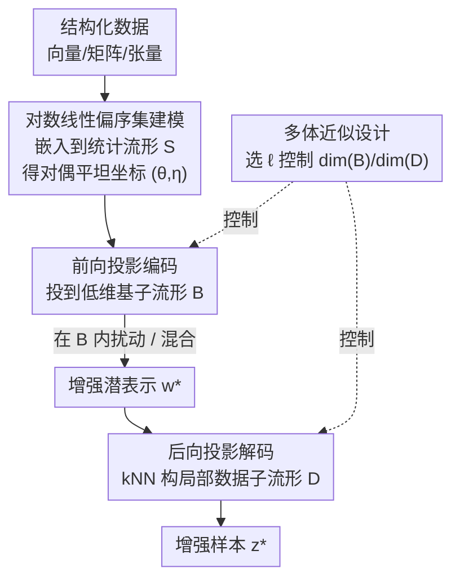

# Pseudo-Non-Linear Data Augmentation: A Constrained Energy Minimization Viewpoint

**会议**: ICLR 2026  
**OpenReview**: [https://openreview.net/forum?id=p9A1oyktVB](https://openreview.net/forum?id=p9A1oyktVB)  
**代码**: 待确认  
**领域**: 学习理论 / 信息几何 / 数据增强  
**关键词**: 信息几何, 能量模型, 偏序集对数线性模型, 投影理论, 免学习数据增强

## 一句话总结
本文从信息几何与能量模型出发，把数据嵌入到一个对偶平坦的统计流形上，用「前向投影编码 + 后向投影解码」模仿自编码器，提出一种**免训练、可控、跨模态**的数据增强方法 PNL，在多个下游分类任务上取得与生成式/经典增强相当甚至更优的精度，同时显著降低方差。

## 研究背景与动机
**领域现状**：近年的数据增强大量依赖生成模型（VAE、GAN、扩散模型）去合成新样本，通过学习一个潜空间来表征数据并在其中采样/插值。

**现有痛点**：生成式增强存在三个根本矛盾。其一是「悖论」——数据增强最需要它的场景恰恰是训练数据稀缺时，但此时又缺乏可用的预训练基础模型，要先训一个生成模型反而再次撞上数据不足的问题。其二是**计算开销**——有效增强往往需要生成与原数据集同量级的样本，深度生成模型的大规模采样成本高昂。其三是**可解释性与可控性差**——即便生成质量好，也很难理解增强样本经历了怎样的变换，在高风险场景下难以精细控制。

**核心矛盾**：经典的免学习方法（PCA、SVD 这类线性降维）虽然透明可控，却卡在**逆问题**上——没有学习到的解码器，很难从低维表示重建回高维数据；而流形学习（t-SNE、Isomap、UMAP）虽是非线性推广，但要恢复一个可逆的低维流形几乎离不开学习机制，重新牺牲掉可解释性。于是「可控透明」与「非线性表达能力 + 可逆解码」之间存在长期 trade-off。

**本文目标**：构造一个既免学习、又高效、又可控、还能跨任意数据模态的增强算法，同时保留非线性表达力和可逆解码能力。

**切入角度**：作者注意到信息几何中**对偶平坦统计流形**的投影理论天然具备「在流形内禀坐标里是线性、在原始环境空间里却是非线性」的双重性，并且前后向投影都能写成凸优化、用一阶方法高效求解。把数据建模成偏序集上的离散概率分布（对数线性模型），就能显式地把这套几何结构搭起来，不必训练任何生成器。

**核心 idea**：用「偏序集对数线性模型 + 对偶投影」替代「生成模型」来做编码-解码，构造一个几何感知、显式可控的潜空间——因为投影在内禀坐标线性、在环境空间非线性，故称之为**伪非线性（pseudo-non-linear）数据增强**。

## 方法详解

### 整体框架
整个方法在结构上模仿自编码器：给定数据集，先把每个样本**嵌入**到一个统计流形 $S$ 上（变成偏序集上的离散概率分布），再通过**前向投影**编码到一个低维的基子流形 $B \subseteq S$ 得到潜表示，在 $B$ 内做简单的增强操作（扰动或线性混合）生成新的潜表示 $w^*$，最后用**后向投影**解码回数据空间得到增强样本 $z^*$。关键在于：嵌入、前向投影、后向投影全部是几何/凸优化操作，没有任何需要训练的网络。

具体分四步搭起这套流水线：① 把结构化数据（向量/矩阵/张量）建模成一个**实值偏序集**，偏序结构刻画特征之间的关系；② 通过嵌入 $\varphi$ 把实值偏序集变成 $S$ 上的离散概率分布 $p_\theta$，每个元素的概率即该特征的「能量」；③ 用偏序集对数线性模型为 $p_\theta$ 算出对偶平坦坐标 $(\theta,\eta)$；④ 在此几何上完成编码-增强-解码三段式增强。

### 关键设计

**1. 偏序集对数线性模型：把任意结构数据嵌入对偶平坦流形**

这一步直接回应「免学习地构造几何感知潜空间」的需求。作者把数据的每个元素 $x$ 关联到偏序集 $\Omega$ 的一个元素，偏序关系 $\leq$ 由数据天然结构或先验知识指定（如 $D$ 维向量对应 $\Omega=[D]$ 的自然序，张量的索引向量按逐维 $\leq$ 定义偏序）。在偏序集上用对数线性模型递归定义自然参数：$\log p(x) = \sum_{y \leq x}\theta(y)$。这恰好是一个指数族，因此所有定义在 $\Omega$ 上的离散分布构成一个 $(|\Omega|-1)$ 维的**对偶平坦统计流形** $S$，自带对偶坐标系 $(\theta,\eta)$、Riemann 度量 $g=\nabla^2\psi(\theta)$ 与 Bregman 散度。直觉上，$\theta(x)$ 指定了特征 $x$ 的能量，而偏序结构指定了不同特征能量之间的耦合方式。相比 PCA/SVD 只能找一个欧氏线性子空间，这里的几何由偏序结构和嵌入 $\varphi$ 共同决定，能编码任意先验的特征关系，是「可控性」的根源。

**2. 前向投影编码：用对偶投影做降维**

嵌入 $\varphi$ 保持维度不变，要降维就靠投影理论。对偶平坦流形有一个关键性质：对任意点 $p\in S$，在一个 e-平坦（或 m-平坦）子流形 $B\subseteq S$ 上存在**唯一**一点最小化对偶 Bregman 散度（即 KL 散度 $D_{KL}(p,q)$），这就是 m-投影，可由凸优化高效求解。于是编码定义为 $\mathrm{Enc} := \mathrm{Proj}_B \circ \varphi: \Omega_R \to B$，把样本压到低维基子流形 $B$（$\dim(B)\ll\dim(S)$）。因为 $B$ 平坦时投影唯一且光滑，编码是良定义且稳定的；而最小化 KL 散度等价于能量最小化，保证压缩时丢掉的是「能量上最不重要」的信息——这正是标题「约束能量最小化」的含义。

**3. 后向投影解码：以数据集自身为锚点求逆**

编码 $\mathrm{Enc}(\cdot)$ 不可逆，数学上不存在完美解码器（即便是欧氏空间里的简单线性投影也如此）。作者的解法是「相似数据投影也相似」：给定一个潜空间点 $w^*\in B$，先在已有样本的投影集合 $\{w_i=\mathrm{Proj}_B(z_i')\}$ 中找它的 $k$ 近邻 $N$，再用这些近邻的原像 $z_i'$ 构造一个**局部数据子流形** $D$，把 $w^*$ 投到 $D$ 上得到逆像 $z'^* := \mathrm{Proj}_D(w^*)$。$D$ 的构造很灵活：例如给定最近邻 $z_{i^\star}'$，可固定其若干 $\theta$ 坐标值定义一个 e-平坦的 $D$，从而显式控制解码结果的自由度。解码即 $\mathrm{Dec} := \varphi^{-1}\circ \mathrm{Proj}_B^{-1}: B\to\Omega_R$。这套后向投影是数据中心化的、几何直观的，且带有「投影到 $D$ 时散度最小」的理论保证——既绕开了流形学习需要训练解码器的难题，又保住了可逆性。

**4. 多体近似的子流形设计：用 $\ell$ 显式调节信息保留与自由度**

$B$ 和 $D$ 的维度选取存在一对对偶的 trade-off：$\dim(B)$ 越大前向保留信息越多、后向重建越好，但 $\dim(B)\approx\dim(S)$ 时增强步骤会遭遇维度灾难；$\dim(D)$ 越大后向自由度越高越利于增强，但 $\dim(D)\approx\dim(S)$ 时后向投影几乎无约束、会生成乱码。作者借助**多体近似（many-body approximation）**给出原则化设计：$\ell$-body 近似只保留 $\ell$ 阶模态交互，基子流形定义为

$$M_\ell := \{\theta \in \mathbb{R}^{\dim(S)} \mid \theta_x = 0 \text{ 对所有非 } \ell\text{-body 参数 } x\in\Omega\}$$

即把高于 $\ell$ 阶的模态交互全部置零；而局部数据子流形取其「对偶」构造——固定每个 $\ell$-body 参数为近邻的平均、放开其余：

$$M_\ell^*(N) := \Big\{\theta \in \mathbb{R}^{\dim(S)} \mid \theta_x = \tfrac{1}{k}\sum_{i^*\in N}\big(\theta(z_{i^*}')\big)_x \text{ 对所有 } \ell\text{-body 参数 } x\Big\}$$

这样每个潜维度的物理含义都清晰（第 $\ell$ 维即第 $\ell$ 阶模态交互），可按需选 $\ell$ 来精确控制「保留什么、放开什么」。例如 MNIST 取 $B=M_1,\ D=M_1^*$ 保留形状信息；CIFAR 把彩图 reshape 成高阶张量后取 $B=M_5,\ D=M_4^*$ 同时保留细粒度形状与颜色关系。更妙的是多体近似下凸优化的梯度有闭式解，使投影在 $B$ 个非固定变量上多项式时间可解，计算极其高效——这是「高效性」的来源。

### 一个完整示例：正张量上的一次增强
以彩色图像（3 阶张量 $T\in\mathbb{R}^{I_1\times I_2\times I_3}$）为例走一遍：索引向量 $v=(i_1,i_2,i_3)$ 间按逐维 $\leq$ 定义自然偏序，正张量经归一化嵌入 $P'_v = P_v / \sum_w P_w$ 成为 $S$ 上的概率分布。前向投影到 $B=M_5$（dim(B)=1410）得到潜表示 $w_i$；在 $B$ 内对一对样本做线性混合得到 $w^*$；后向投影时找 $w^*$ 的 kNN，在 $D=M_4^*$（dim(D)=2334）上投影得 $z'^*$，再用「近邻间缩放比例的平均之逆」作为 $\varphi^{-1}$ 还原出增强图像 $z^*$。结果显示鸵鸟图保住了眼睛/喙的颜色与背景小花这类细粒度形状-颜色关系，而粗粒度的无形状背景色发生了明显漂移——正对应 $\ell=5/4$ 设计所选择保留与放开的信息。

## 实验关键数据

### 主实验
在图像（MNIST、CIFAR-10）、音频（Speech Commands）、表格（Connectionist Bench、Taiwanese Bankruptcy、Wine Quality）多模态上做下游分类，增强量为原训练集的 20%，分类器分别用 ResNet-18 / M5 / MLP，在 20 个自助采样测试子集上评估。

| 训练集 | MNIST | CIFAR-10 | Speech Cmd | Connect. Bench | Taiwan. Bank. | Wine Quality |
|--------|-------|----------|-----------|----------------|---------------|--------------|
| OG（原始） | 97.98±0.19 | 88.57±0.57 | 84.48±0.50 | 88.10±8.58 | 96.54±0.56 | 55.00±1.69 |
| OG+STD | 97.98±0.24 | **89.89±0.44** | 82.98±0.50 | 85.24±7.66 | 96.17±0.57 | 57.85±1.81 |
| **OG+PNL（本文）** | 97.91±0.21 | 88.07±0.46 | **84.35±0.37** | **93.81±4.54** | 96.53±0.47 | **59.03±1.74** |
| OG+AE | 97.97±0.25 | 88.36±0.46 | 83.13±0.32 | 82.86±7.59 | 95.92±0.62 | 57.23±1.67 |
| OG+MU（mixup） | 96.45±0.23 | 86.60±0.49 | 81.85±0.61 | 89.29±4.97 | 96.55±0.68 | 57.76±1.67 |
| OG+MMU（manifold mixup） | 97.52±0.30 | 88.02±0.39 | 83.06±0.54 | 91.19±5.06 | 96.44±0.53 | 58.70±1.74 |

PNL 在除图像外的所有数据集上一致优于其它学习式/免学习基线。图像模态是唯一例外——所有非 STD 的增强都不及 OG/STD，作者解释为图像的 STD（裁剪、翻转、旋转、仿射）显式逼分类器学旋转/平移/颜色不变性，而其它增强更像正则项。

### 关键发现（稳定性 / 方差）
- **方差大幅下降是核心卖点**：在仅 208 样本、60 特征的 Connectionist Bench 上，OG/STD/AE 的精度标准差都很高（7.6%~8.6%），而 PNL 降到 **4.54%**，是所有方法中最低；这种低方差趋势在所有数据集上一致出现，说明该方法在小样本下泛化更稳。
- **能量验证**（合成数据）：可通过选择子流形阶数直观控制模态交互的保留程度；即使 1-body 容量不足以刻画强交互（图 4b），它也会在「能量最小」意义下抓住数据在自身容量内的本质。
- **几何优势**：在基子流形内插值（energy-aware）相比环境空间插值，交互能量始终更低，表明本文几何下的插值「更省能量」、更自然。
- **可控性**（MNIST/CIFAR）：通过精心 reshape 成高阶张量 + 多体近似，能选择性保留形状或形状+颜色信息，证明设计 $\ell$ 即可精细控制增强结果。

## 亮点与洞察
- **把信息几何的对偶投影直接当编码-解码器**：投影在内禀坐标线性、在环境空间非线性，因此既有非线性表达力、又有凸优化的可解性，绕开了「生成式可控性差」和「线性降维不可逆」两难，思路很优雅。
- **kNN 构造局部数据子流形求逆**：用「数据集本身就是投影的逆」这一观察，把不可逆的编码用数据中心化的后向投影近似，还带散度最小的理论保证——这是把流形学习的逆问题转成几何投影的巧妙一招。
- **$\ell$-body 与其对偶 $M_\ell^*$ 给出可解释的潜维度**：每一维对应一个明确的模态交互阶，工程上可按需 reshape 张量把想控制的特征关系放进某些模态，迁移性强——这套「能量分解 + 多体近似」思想可迁移到任意能建偏序的结构化数据（时序、表格、张量）。
- 全程免训练、凸优化闭式梯度，在小数据/高风险场景比生成式增强更可落地。

## 局限与展望
- **不建模置换不变性**（作者承认）：框架依赖对索引集指定偏序，无法天然刻画索引置换下的不变性，对图数据等会引入不必要的偏置；好处是这种偏置来源显式可见、可针对性修正。
- **图像模态收益有限**：在 MNIST/CIFAR 上 PNL 不及标准几何增强，说明对天然具有强空间不变性的模态，显式几何变换仍更有效；本方法的优势区在小样本表格/音频。
- **依赖偏序与嵌入设计**：性能高度取决于偏序结构 $\Omega$、嵌入 $\varphi$、阶数 $\ell$ 的人工选择，缺乏自动化选择机制；不同模态需要专门设计 reshape 与子流形。
- **可扩展性存疑**：$\dim(S)$ 随张量规模膨胀，虽有多项式时间投影，但大规模高阶张量下的实际开销与近邻搜索成本仍需更系统的评估。

## 相关工作与启发
- **vs 生成式增强（VAE/GAN/扩散，AE 基线）**：它们学一个潜空间再采样，受限于「先训练才能增强」的悖论、计算开销和可解释性差；本文免学习、凸优化、潜维度物理含义清晰，且在表格/音频上精度与方差均更优。
- **vs 线性降维（PCA/SVD）**：经典免学习方法只找欧氏线性子空间且逆问题难解；本文用对偶平坦流形上的非线性投影 + 数据中心化后向投影，既非线性又可逆。
- **vs mixup / manifold mixup**：mixup 直接在原空间启发式混合、应用受限；manifold mixup 借用下游任务学到的潜空间、牺牲了可解释性；本文在显式几何潜空间内混合，透明可控且方差更低。

## 评分
- 新颖性: ⭐⭐⭐⭐⭐ 把信息几何对偶投影 + 偏序集对数线性模型组合成免学习增强器，视角新颖独到
- 实验充分度: ⭐⭐⭐⭐ 覆盖图像/音频/表格多模态且有能量/可控性验证，但缺大规模与更强生成式基线对比
- 写作质量: ⭐⭐⭐⭐ 理论铺陈清晰、图示到位，但信息几何门槛较高，部分推导依赖附录
- 价值: ⭐⭐⭐⭐ 小样本/高风险场景下提供可控、低方差、免训练的实用增强方案

<!-- RELATED:START -->

## 相关论文

- [\[ICLR 2026\] Optimizing Data Augmentation through Bayesian Model Selection](optimizing_data_augmentation_through_bayesian_model_selection.md)
- [\[ICLR 2026\] Data-to-Energy Stochastic Dynamics](data-to-energy_stochastic_dynamics.md)
- [\[ICLR 2026\] Oracle-Efficient Hybrid Online Learning with Constrained Adversaries](oracle-efficient_hybrid_learning_with_constrained_adversaries.md)
- [\[ICLR 2026\] Online Inventory Optimization in Non-Stationary Environment](online_inventory_optimization_in_non-stationary_environment.md)
- [\[ICLR 2026\] Online Conformal Prediction with Adversarial Semi-bandit Feedback via Regret Minimization](online_conformal_prediction_with_adversarial_semi-bandit_feedback_via_regret_min.md)

<!-- RELATED:END -->
