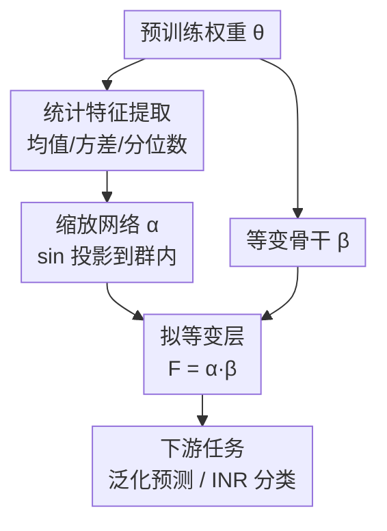

# Quasi-Equivariant Metanetworks

**会议**: ICLR 2026  
**OpenReview**: [https://openreview.net/forum?id=XMiDpi2mWY](https://openreview.net/forum?id=XMiDpi2mWY)  
**代码**: 待确认  
**领域**: 学习理论 / 权重空间学习 / 等变网络  
**关键词**: 元网络, 函数等价, 极大对称群, 拟等变, 权重空间学习

## 一句话总结
针对"元网络（metanetwork）若强制严格等变会变得稀疏、表达力受限"的问题，本文提出**拟等变（quasi-equivariance）**：把"输入做群变换、输出跟着做同一个群变换"放松成"输出跟着做一个**依赖输入**的群变换"，在仍然严格保住函数等价性的前提下解放表达力；落地为一层可学的群值缩放 $\alpha(\theta)$ 叠在现有等变骨干 $\beta(\theta)$ 上，只多 3–5% 参数，就在 CNN/Transformer 泛化预测、INR 分类等基准上稳定涨点。

## 研究背景与动机
**领域现状**：元网络是一类"以神经网络的权重为输入"的网络，用来直接读权重去做下游任务——预测一个预训练模型的泛化能力、给隐式神经表示（INR）分类、做模型编辑等等。它的关键约束来自**函数等价（functional equivalence, FE）**：参数空间只是函数类的代理，$\theta \mapsto f(\cdot;\theta)$ 不是单射，很多套不同的权重实现的是**同一个函数**（如 MLP 里交换两个隐藏神经元、再把出边对应换一下，函数完全不变）。因此一个好的元网络 $F$ 应该只依赖权重背后的"函数身份"，而不是某一种具体的参数写法。

**现有痛点**：主流做法是把这种不变性写成**严格等变**——对元网络强加 $F(g\theta)=gF(\theta)$，让它对置换、缩放、符号翻转等架构对称性天然不敏感。但严格等变是一种很硬的约束：它要求权重层面逐元素地守恒对称，结果往往把网络逼成**稀疏、参数受限、表达力偏弱**的形态。换句话说，为了"尊重对称"付出了"模型变笨"的代价。

**核心矛盾**：真正要守住的并不是权重本身，而是权重实现的**函数**——即由参数定义的等价类 $[\theta]$。严格等变只是保住函数等价的一个**充分**条件，并非必要条件。把"充分"误当成"必须"，就白白牺牲了表达力。

**本文目标**：找到一个比严格等变更松、但仍能保证"同函数 → 同输出函数身份"的约束族，并且要能落地成可微、可堆叠、参数开销小的网络层。

**切入角度**：作者从**极大对称群（maximal symmetry group）**这一观察切入——若群 $G$ 在去掉一个零测的代数簇例外集后能刻画全部函数等价（$[\theta]=G\theta$），那么"保函数身份"这件事就可以完全用群作用来表达，从而获得放松的空间。

**核心 idea**：把严格等变的"同一个 $g$"放松成"一个随输入而变的 $g'(g,\theta)$"——只要 $g'$ 仍落在群 $G$ 内，输出就还在原函数的等价类里，函数身份分毫不损，但映射本身自由多了。

## 方法详解

### 整体框架
方法要解决的是：怎么造一个元网络层，既保住函数等价、又不被严格等变憋死。本文的答案是把元网络写成两件东西的乘积——一个现成的**等变骨干** $\beta$，外加一个**可学的群值缩放** $\alpha$：

$$F(\theta) = \alpha(\theta)\,\beta(\theta), \qquad \alpha:\Theta \to G,\ \ \beta:\Theta \to \Theta \text{ 等变}.$$

直觉上，$\beta$ 负责"把权重整理进一个对称协调的表示"，$\alpha$ 则根据这套具体权重的统计特征，**临场决定一个群元素**乘上去。因为 $\alpha(\theta)$ 永远是 $G$ 的元素，所以 $F(g\theta)$ 和 $F(\theta)$ 只差一个群作用，函数身份照样守住——这正是"拟等变"。整条管线是：从权重里抽统计特征、喂进一个小缩放网络得到 $\alpha$，同时让权重过等变骨干 $\beta$，两者相乘得到拟等变层的输出，再接下游预测。

### 关键设计

**1. 拟等变：把严格等变松绑成"依赖输入的群作用"**

严格等变要求 $F(g\theta)=gF(\theta)$——输入做了 $g$，输出必须做**同一个** $g$。本文把它放松为：对任意 $g\in G$、$\theta\in\Theta$，存在一个 $g'=g'(g,\theta)\in G$，使

$$F(g\theta) = g'(g,\theta)\,F(\theta).$$

关键在于 $g'$ 可以**同时依赖** $g$ 和 $\theta$，不必再是那个原封不动的 $g$。这一步为什么不破坏函数身份？因为在 $G$ 为**极大对称群**的前提下，$[\theta]=[\bar\theta]$ 等价于 $\bar\theta=g\theta$ 对某个 $g$ 成立；于是 $F(\bar\theta)=F(g\theta)=g'F(\theta)$，两边都落在 $[F(\theta)]$ 里，输出函数完全一致。更进一步，借助极大性，拟等变不只是充分、而是**充分必要**地刻画了"保函数性"这件事——严格等变只是它的一个特例（取 $g'\equiv g$）。这也正面回答了标题里的问句"严格等变对元网络真的必要吗？"：不必要。需要说明的是，**不变性**没有"拟版本"——要让 $F$ 的标量输出只依赖函数，仍需严格 $F(g\theta)=F(\theta)$；拟等变只用在等变骨干上，最后再叠一层不变层即可（组合封闭性保证拟等变∘拟等变仍拟等变、拟等变后接不变仍不变）。

**2. α·β 分解：可学群值缩放叠在等变骨干上**

有了拟等变的定义，怎么真正造出这样一个 $F$？直接去解"先随便给一个 $\alpha:G\times\Theta\to G$、再反解满足 $F(g\theta)=\alpha(g,\theta)F(\theta)$ 的 $F$"在一般情形下无解、也不可实现。本文给出一个**可构造**的充分形式：令 $\beta:\Theta\to\Theta$ 是一个普通的等变映射（直接复用既有的等变元网络，如 Monomial-NFN、Transformer-NFN），令 $\alpha:\Theta\to G$ 是一个输出**群元素**的映射，定义 $F(\theta)=\alpha(\theta)\beta(\theta)$，则 $F$ 天然拟等变。这样设计的好处是**模块化**：表达对称的重活交给成熟的 $\beta$，新增的全部自由度集中在 $\alpha$ 上；而 $\alpha$ 只是一层薄薄的缩放，参数增量极小。整个工程难点也就收敛成一件事——**如何让 $\alpha$ 的输出恰好落在群 $G$ 里**。

**3. 只学群的连续分量：用 sin 投影保证落在群内**

群 $G$ 往往同时含离散和连续两部分，本文的关键观察是：**离散部分学不动、也不必学**。以 FFN 为例，对称群是各层单项矩阵（每行每列恰一个非零正元）的乘积，群作用为 $\bar W_i = g_i W_i g_{i-1}^{-1}$、$\bar b_i = g_i b_i$；而单项矩阵群可唯一分解成

$$G_n = \mathbb{R}_{>0}^{\,n} \rtimes P_n,$$

即"正对角缩放 $\mathbb{R}_{>0}^n$"半直积"置换矩阵 $P_n$"。由于 $\Theta=\mathbb{R}^d$ 连通、连通集的连续像仍连通，而 $P_n$ 是离散的，所以任何连续的 $\alpha:\Theta\to P_n$ **只能是常值**——置换分量根本无法随输入变化，可以直接忽略。于是 $\alpha$ 的全部行动空间就落在连续的正对角缩放上：把 $\theta$ 映成一个 $n$ 维向量，取 $\sin$、乘一个小 $\epsilon>0$、再加全 1 向量，得到 $1_n+\epsilon\sin(\cdot)\in\mathbb{R}_{>0}^n$（$\epsilon$ 足够小即保证逐元素为正）。对多头注意力，对称群是 $G=S_h\times(GL(d_h)\times GL(d_h))^h$，连续分量是一般线性群 $GL(d_h)$；构造同理——先用一个前馈网 $\gamma$ 把 $\theta$ 重排成 $n\times n$ 矩阵，再取 $I_n+\epsilon\sin(\gamma(\theta))$，因 $\sin$ 值域 $[-1,1]$、$\epsilon$ 够小时该矩阵必可逆，故落在 $GL(n)$ 内。作者特意指出没用矩阵指数 $\exp$ 来造可逆矩阵——理论和实验都显示它慢且数值不稳。

**4. 统计特征驱动的缩放网络**

$\alpha$ 具体怎么从权重里读信息？本文不把全部权重灌进 $\alpha$（那会让参数和不稳定性都爆炸），而是先从每层权重和偏置里抽**统计特征**——均值、方差、分位数——再把这些低维特征喂进一个小的"缩放网络"，输出每层对应的缩放向量（MLP 情形）或缩放矩阵（注意力情形），最后把学到的缩放作用在等变骨干 $\beta$ 的输出上。这种"统计特征 → 小 MLP → 群值缩放"的设计是参数高效的核心：它把表达力的增益压在一个极轻的旁路里，实验中 Monomial-NFN/Transformer-NFN 加上这层后参数仅多约 3.89%–5.27%，却能换来明显且跨设置稳定的性能提升。

### 损失函数 / 训练策略
本文不引入额外训练目标——拟等变层是即插即用的网络层，直接嵌进既有元网络（Monomial-NFN、Transformer-NFN），沿用各自原任务的监督损失端到端训练。唯一的关键超参是缩放幅度 $\epsilon$：它要足够小以保证 $\alpha(\theta)$ 落在群内（FFN 保正、MHA 保可逆），又要非零以提供放松对称带来的额外自由度。所有结果取 5 次运行平均。

## 实验关键数据

### 主实验
在三类任务上，把拟等变层嵌入既有等变元网络（记作 *Quasi*），与原版及"放大参数版"对比，核心结论是**用极小的参数增量拿到大于"单纯放大模型"的收益**。

预测 CNN 泛化（Small CNN Zoo 的 ReLU 子集，指标 Kendall's τ，含不同尺度增广）：

| 方法 | 无增广 | U[1,10] | U[1,10³] | 参数增量 |
|------|--------|---------|----------|----------|
| HNP | 0.926 | 0.913 | 0.891 | — |
| Monomial-NFN | 0.922 | 0.920 | 0.920 | — |
| Monomial-NFN large | 0.923 | 0.920 | 0.919 | +68.65% |
| **Monomial-NFN Quasi（本文）** | **0.926** | **0.924** | **0.923** | **+3.89%** |

INR 图像分类（测试准确率 %，三套 INR 权重数据集）：

| 方法 | MNIST | CIFAR-10 | FashionMNIST | 参数增量 |
|------|-------|----------|--------------|----------|
| Monomial-NFN | 68.43 | 34.23 | 61.15 | — |
| Monomial-NFN tuned | 68.87 | 34.26 | 61.44 | ≈+3% |
| **Monomial-NFN Quasi（本文）** | **70.21** | **35.32** | **62.11** | ≈+3% |

预测 Transformer 泛化（Kendall's τ，不同准确率阈值子集）：

| 方法 | MNIST-T（无阈值） | AGNews-T（无阈值） | 参数增量 |
|------|------|------|----------|
| Transformer-NFN | 0.905 | 0.910 | — |
| Transformer-NFN large | 0.907 | 0.913 | +57~59% |
| **Transformer-NFN Quasi（本文）** | **0.911** | **0.914** | **+4.5~5.3%** |

### 消融实验
论文没有给传统"逐模块删除"的消融表，而是用**"放大参数版" vs "加拟等变层版"** 作为最关键的对照实验，直接回答"涨点到底是来自更多参数、还是来自拟等变本身"：

| 对照 | 典型表现 | 说明 |
|------|---------|------|
| 原版骨干 | 基线 | Monomial-NFN / Transformer-NFN |
| 放大参数版（large/tuned） | 微弱提升 | 多花 57%–68% 参数仅小幅涨 |
| **加拟等变层（Quasi）** | 明显且稳定提升 | 仅多 ~3%–5% 参数即超越放大版 |

### 关键发现
- **涨点来自机制而非参数堆砌**：放大骨干参数（+57%~68%）只换来边际提升，而拟等变层用约十分之一的参数增量反超——说明收益确实源于"放松对称带来的表达自由"，不是参数变多的副作用。
- **对群作用增广更鲁棒**：在 U[1,10⁴] 这种强尺度增广下，STATNet 从 0.915 崩到 0.516、HNP 也跌到 0.601，而 Monomial-NFN Quasi 稳在 0.924——拟等变在解放表达力的同时仍守住了对称鲁棒性。
- **跨架构通用**：FFN/CNN（单项矩阵群）与 Transformer（$GL$ 群）两套截然不同的对称结构都能套同一框架，且在 INR 分类这种容易过拟合的小数据上，放大参数会过拟合、拟等变层反而稳定涨点。

## 亮点与洞察
- **"把约束依赖化"是核心巧思**：从 $F(g\theta)=gF(\theta)$ 到 $F(g\theta)=g'(g,\theta)F(\theta)$，只是让群元素随输入而变，却把"充分条件"升级成"充分必要条件"——既不丢函数身份，又解放了表达力，是一个干净的理论松绑。
- **连通性论证一刀切掉离散自由度**：用"连通集的连续像连通"直接证明置换分量必为常值，从而把 $\alpha$ 的设计收敛到连续子群（正对角 / $GL$），让落地变简单——这个论证可迁移到任何"群含离散+连续两部分"的等变设计里。
- **sin·ε+单位元的投影技巧**：用 $1_n+\epsilon\sin(\cdot)$、$I_n+\epsilon\sin(\gamma(\theta))$ 这种轻量映射保证输出恰落在 $\mathbb{R}_{>0}^n$ / $GL(n)$ 内，绕开了数值不稳的矩阵指数，是可复用的"可微地参数化群元素"小工具。
- **参数高效的旁路设计**：统计特征（均值/方差/分位数）+ 小 MLP 的缩放旁路，把表达增益压进 3–5% 参数，对"想给已有等变网络加一点灵活性又不想重训大模型"的场景很实用。

## 局限与展望
- 作者承认：拟等变目前主要用在**线性架构**的元网络上，向图结构等更复杂的元网络扩展尚未实现（这类架构多样且稀少，难以统一处理）。
- FFN 的极大对称群在一般层宽设置下**是否极大仍是开放问题**，只在受限情形（如 $n_L\geq\dots\geq n_1>n_0=1$）被严格证明——理论根基的普适性还有缺口。
- 自己发现：消融偏弱（没有逐组件删除来定位"统计特征 vs 缩放网络 vs sin 投影"各自贡献多少），$\epsilon$ 的敏感性也未系统报告；且实验提升幅度多在 1% 量级，需结合标准误判断显著性。
- 展望：作者指出拟等变的"近似对称 + 更大灵活性"思路可外推到计算化学、物理、材料科学等对称只近似成立的领域。

## 相关工作与启发
- **vs 严格等变元网络（Monomial-NFN / Transformer-NFN / NFN）**：它们强加 $F(g\theta)=gF(\theta)$，对称守得严但模型稀疏、表达受限；本文复用它们当 $\beta$ 骨干，再叠一层拟等变 $\alpha$，在不破坏函数身份的前提下补回表达力。
- **vs 松弛等变（relaxed equivariance, Kaba & Ravanbakhsh 2023）**：他们要求 $g'\in gG_x$（$G_x$ 为稳定子），本质是拟等变在特定约束下的**特例**；本文的 $g'(g,\theta)$ 取值范围更宽，是更一般的框架。
- **vs 近似等变（Wang et al. 2024 等）**：那类工作把放松理解成"$\varphi(gx)\approx g\varphi(x)$"的**近似**，会引入对称误差；本文是**精确**保函数身份（$g'$ 仍严格在群内），只是放松了"必须是同一个 $g$"，定位不同。

## 评分
- 新颖性: ⭐⭐⭐⭐⭐ 把"严格等变"放松为"拟等变"并证明其为保函数性的充分必要条件，是权重空间学习里干净且有分量的概念贡献。
- 实验充分度: ⭐⭐⭐⭐ 三类任务 + 跨架构 + 与"放大参数版"严格对照很有说服力，但缺逐组件消融、提升幅度偏小。
- 写作质量: ⭐⭐⭐⭐ 理论铺陈（极大对称群→拟等变→可构造形式）层层递进、清晰；部分构造细节压在附录。
- 价值: ⭐⭐⭐⭐ 即插即用、参数高效，且"依赖化约束"的思路对更广的近似对称建模有启发。

<!-- RELATED:START -->

## 相关论文

- [\[ICLR 2026\] On Universality of Deep Equivariant Networks](on_universality_of_deep_equivariant_networks.md)
- [\[ICLR 2026\] Reducing Symmetry Increase in Equivariant Neural Networks](reducing_symmetry_increase_in_equivariant_neural_networks.md)
- [\[ICLR 2026\] To Augment or Not to Augment? Diagnosing Distributional Symmetry Breaking](to_augment_or_not_to_augment_diagnosing_distributional_symmetry_breaking.md)
- [\[ICLR 2026\] Provable Separations between Memorization and Generalization in Diffusion Models](provable_separations_between_memorization_and_generalization_in_diffusion_models.md)
- [\[ICLR 2026\] Pretrain–Test Task Alignment Governs Generalization in In-Context Learning](pretraintest_task_alignment_governs_generalization_in_in-context_learning.md)

<!-- RELATED:END -->
