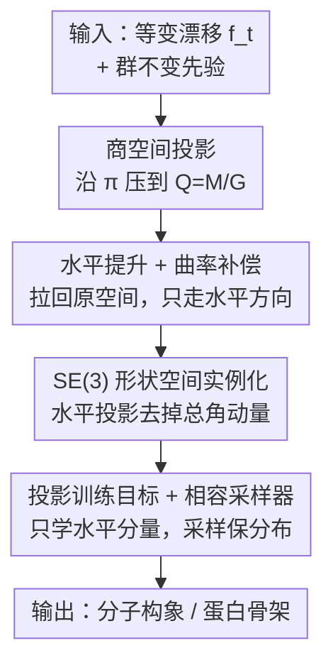

# Quotient-Space Diffusion Models

**会议**: ICLR 2026  
**OpenReview**: [https://openreview.net/forum?id=3JPAkwSVc4](https://openreview.net/forum?id=3JPAkwSVc4)  
**代码**: 基于 https://github.com/shenoynikhil/ETFlow 复现（论文未单列官方仓库）  
**领域**: 扩散模型 / 几何深度学习 / 生成模型理论  
**关键词**: 商空间, 等变扩散, SE(3) 对称, 水平提升, 分子结构生成

## 一句话总结
本文提出"商空间扩散模型"——把传统等变扩散过程投影到去掉对称冗余的商空间、再水平提升回原空间，使模型在等价类内部的输出可以任意（降低学习难度），同时用一个曲率补偿项保证采样仍恢复正确的对称目标分布；在分子构象和蛋白骨架生成上一致超过等变扩散与基于对齐的简化方法。

## 研究背景与动机

**领域现状**：扩散模型已成为高维分布建模的主流，并在科学场景（分子 3D 结构、蛋白骨架、电子结构等）大放异彩。这类系统普遍带有**对称性**：例如一个分子整体平移和旋转（刚体运动，构成 SE(3) 群）后物理性质完全不变，应当被视作"同一个状态"。主流做法是让目标分布对群作用保持不变（group-invariant），实现方式要么对训练数据做随机群作用增广，要么用群不变先验 + 等变网络。

**现有痛点**：这些等变扩散方法虽然保证了分布对称，却**没有利用对称性来降低学习难度**。神经网络仍然被要求学习"某个具体的等价运动"——比如把分子作为刚体平移、旋转到某个朝向——而这种运动根本不改变系统的本质状态（分子的形状）。模型把算力浪费在了学这些冗余自由度上。

**已有简化尝试的缺陷**：GeoDiff、AlphaFold 3 等里程碑工作意识到了这点，提出用**对齐（alignment）**减少目标样本在等价自由度上的自由度。但本文指出（Sec. 3.4）：对齐改变了学习目标，使其与采样过程所需的目标不一致，于是**扭曲了生成分布**——即便像 Boltz-1 那样打补丁也救不回来。

**核心矛盾**：existing 方法在"利用对称降低学习难度"与"保证采样恢复正确分布"之间无法兼得——等变扩散保证分布但不减负，对齐方法减负但破坏分布。

**核心 idea**：直接在**商空间**（quotient space，把整个等价类当成一个点的精确数学构造）上定义扩散过程。商空间天然去掉了对称冗余，是系统"本质状态"的空间（分子例子里就是"形状空间"）。在商空间上做扩散既能减负又能保证分布正确，只是商空间太抽象不好仿真——于是再把它"水平提升"回原空间，让实现和原始扩散一样简单。

## 方法详解

### 整体框架

整篇方法是一条"先投影、再提升、后实例化"的推导链。出发点是一个普通的、漂移项 $f_t$ 满足群等变、先验 $p_{\text{prior}}$ 群不变的扩散过程；目标是得到一个**只在等价类之间移动、不在等价类内部移动**的等价过程，并保证它生成的分布与原始过程完全相同。

第一步（Thm 1）把原始过程沿自然投影 $\pi: M \to Q=M/G$ 压到商空间，得到商空间上的扩散方程；但商空间无法用欧氏向量表示、难以直接仿真。第二步（Thm 2）用"水平提升"把商空间过程拉回原空间 $M$，得到一个**只含水平方向移动**的等价过程，仿真方式和原过程一模一样。第三步（Thm 4）针对最具代表性的 $\mathbb{R}^{3N}/\mathrm{SE}(3)$（形状空间），给出水平投影 $P$ 和曲率补偿项 $\tilde h$ 的**显式表达式**——投影本质上就是把点云的总角动量去掉，只留下形变。最后落到训练（只优化投影后的分量）和采样（ODE/SDE 都把速度场投影一下）。

### 关键设计

**1. 商空间投影：把对称冗余真正"商掉"而非绕开**

针对"等变扩散逼模型学冗余自由度"的痛点，本文不再在原空间里打补丁，而是直接换舞台：群作用在状态空间 $M$ 上定义了等价关系 $x\sim x'\iff \exists g\in G,\, g\cdot x=x'$，商空间 $Q:=M/G$ 把每个等价类当成一个点，是"反映系统本质变化、没有冗余"的精确构造（分子例子里就是形状空间）。Theorem 1 证明：把原始等变扩散过程 $dx_t=f_t(x_t)\,dt+\sigma_t\,dw_t$ 沿投影 $\pi$ 压到 $Q$ 上，得到的仍是一个良定义的扩散过程：

$$dy_t = \Big[(\pi_* f_t)(y_t) - \tfrac{\sigma_t^2}{2}\,h(y_t)\Big]dt + \sigma_t\,d\omega_t,\qquad y_0\sim \pi_\# p_{\text{prior}}.$$

这里 $\pi_* f_t$ 是被推前到 $Q$ 上的向量场，$\omega_t$ 是 $Q$ 上的 Wiener 过程。值得注意的是多出一项 $h(y_t)$——**平均曲率向量场**：因为商空间把一整个等价类挤成一个点，过程必须为"等价类体积沿运动方向的变化率"做补偿，这一项正反映了这种体积变化。这一步从根上保证了：凡是只在等价类内部（垂直方向）的运动都是多余的，可以彻底丢掉。

**2. 水平提升 + 曲率补偿：把抽象的商空间过程拉回原空间，且不破坏分布**

商空间虽然干净，却"太抽象、没法用欧氏向量仿真"。本文借助"水平/垂直分解"把它请回原空间。在每个点 $x$，切空间分解为 $T_xM=V_x\oplus H_x$：垂直空间 $V_x:=\ker \pi_{*x}$ 对应等价类内部运动（无意义），水平空间 $H_x:=V_x^\perp$ 对应本质运动；任意切向量唯一分解 $v=v^V+v^H$，记水平投影 $P_x(v):=v^H$。Theorem 2 给出商空间过程 $y_t$ 的水平提升的显式形式：

$$d\tilde x_t = \Big[P_{\tilde x_t}\big(f_t(\tilde x_t)\big) - \tfrac{\sigma_t^2}{2}\,\tilde h(\tilde x_t)\Big]dt + \sigma_t\,d\tilde w_t,\qquad \tilde x_0\sim p_{\text{prior}}.$$

关键在于：这个提升过程**不是**简单地把原过程的向量场和噪声投一下就完事，那个曲率项 $\tilde h$（$h$ 的水平提升）必须保留，它补偿了"提升过程无法改变等价类内部质量分布"这件事。Corollary 3 进一步证明两件好事：(1) 提升过程的终点 $\tilde x_1$ 与原过程终点 $x_1$ **分布完全相同**（$p_{\tilde x_1}=p_{x_1}=p_{\text{target}}$），采样正确性有保证；(2) 当 $\sigma_t\equiv 0$ 且同起点时，提升过程的轨迹**更短**——因为它只在等价类之间走，不像等变扩散那样还要在等价类内部按某种规则绕路。这正是它优于传统等变扩散的几何直觉（图 1：旋转对称系统里，本文只沿半径直线走，等变扩散却画出锯齿状曲线）。

**3. SE(3) 形状空间实例化：水平投影 = 去掉点云的总角动量**

抽象框架要能用，必须在具体群上给出可计算的公式。对分子，$M$ 是 $N$ 个原子 3D 坐标拼起来的 $\mathbb{R}^{3N}$，$G=\mathrm{SE}(3)=T(3)\rtimes \mathrm{SO}(3)$。由于平移群 $T(3)$ 不紧、不存在平移不变分布，本文（沿用惯例）用质心无关子空间 $\mathbb{R}^{3N}_{\text{CoM}}$ 表示对 $T(3)$ 的商，再对其上的 $\mathrm{SO}(3)$ 作用取商，得到形状空间 $Q:=\mathbb{R}^{3N}_{\text{CoM}\circ}/\mathrm{SO}(3)$。Theorem 4 给出形状空间上水平投影的闭式表达：对质心无关的 $x=[\vec x^{(n)}]_n$ 和动量无关的 $v=[\vec v^{(n)}]_n$，

$$P_x(v)=\Big[\vec v^{(n)} - \Big(K(x)^{-1}\sum_{n'}\vec x^{(n')}\times\vec v^{(n')}\Big)\times \vec x^{(n)}\Big]_n,\quad K(x):=\sum_n \|\vec x^{(n)}\|^2 I - \sum_n \vec x^{(n)}\vec x^{(n)\top}.$$

物理意义非常清楚：垂直向量对应一个无穷小 $\mathrm{SO}(3)$ 作用，即带总角动量的刚体旋转；水平向量则是**零总角动量**的运动。因此 $P_x(v)$ 干的事就是**把 $v$ 的总角动量减掉，只留下形变**——这正好类比于对 $T(3)$ 对称时"减掉总线动量（质心）"的常规处理。加上同样有显式表达的 $\tilde h$ 修正项，整个提升过程只让点云形变、不做任何刚体运动，恰好对应在形状空间上移动。

**4. 投影训练目标 + 相容采样器：减负与保分布兼得**

有了线性的水平投影 $P_x$，训练目标只需对去噪模型 $D_\theta$ 的输出做投影：

$$L(\theta):=\mathbb{E}_{p(t)}\,w(t)\,\mathbb{E}_{p(x_1,x_t)}\big\|P_{x_t}\big(D_\theta(x_t,t)-x_1\big)\big\|^2.$$

由于 $P_{x_t}$ 是线性投影，$D_\theta$ 和 $D_\theta+v^V$（$v^V$ 为任意垂直向量）的损失值相同——也就是说，**模型在垂直空间（等价类内部运动，即总角动量）上的输出完全不受约束、不用学**，这彻底兑现了"用对称性降低学习难度"。这一点和 AF3 对齐一样能减负，但本文的不同之处是它**有相容的采样器**：ODE 采样 $\frac{dx_t}{dt}=P_{x_t}(v_\theta(x_t,t))$，SDE 采样

$$dx_t=P_{x_t}\big(v_\theta+\eta_t s_\theta\big)\,dt+\eta_t\,\tilde h(x_t)\,dt+\sqrt{2\eta_t}\,P_{x_t}\,dw_t,$$

都只是在原采样器上加一个投影（外加 SDE 里的 $\tilde h$ 项），由 Cor. 3 保证恢复正确目标分布。相比之下，GeoDiff/AF3 的对齐让学习目标 $E[A_{x_t}(x_1)|x_t]$ 偏离了采样器所需的 $E[x_1|x_t]$（因 $\mathrm{SO}(3)$ 非线性，二者连形状都不同），导致分布失真。

### 损失函数 / 训练策略
训练就用上面的投影损失 Eq. (11)，所有时间权重并入 $w(t)$。框架对训练形式很灵活：既可配等变模型，也可配"一般模型 + 数据增广"。采样可选 ODE 或 SDE，SDE 通过噪声尺度 $\gamma$（$\eta_t$ 的全局缩放）在"可设计性"与"多样性"之间权衡。

## 实验关键数据

### 主实验：分子构象生成（GEOM-QM9 / GEOM-DRUGS）

在 ET-Flow 架构上接入商空间扩散，与等变扩散及对齐方法对比（Coverage 越高越好，AMR 越低越好）：

| 数据集 | 方法 | Recall-Cov(%)↑ | Recall-AMR(Å)↓ | Precision-Cov(%)↑ | Precision-AMR(Å)↓ |
|--------|------|------|------|------|------|
| GEOM-QM9 | ET-Flow(SO(3)) | 95.98 | 0.076 | 92.10 | 0.110 |
| GEOM-QM9 | + GeoDiff 对齐 | 95.71 | 0.085 | 95.20 | 0.098 |
| GEOM-QM9 | + AF3 对齐 | 92.67 | 0.131 | 84.38 | 0.205 |
| GEOM-QM9 | **+ 商空间扩散** | **96.40** | **0.069** | **93.30** | **0.096** |
| GEOM-DRUGS | ET-Flow(SO(3)) 复现 | 74.91 | 0.541 | 60.33 | 0.724 |
| GEOM-DRUGS | + GeoDiff 对齐 | 75.11 | 0.545 | 59.58 | 0.734 |
| GEOM-DRUGS | + AF3 对齐 | 71.66 | 0.572 | 52.21 | 0.828 |
| GEOM-DRUGS | **+ 商空间扩散** | **78.50** | **0.477** | **67.35** | **0.635** |

商空间扩散在两个数据集上都一致提升 vanilla ET-Flow，并在 GEOM-QM9 上超过强基线 MCF；而两种对齐方法常常**反而掉点**——印证了"学习目标与采样器不相容会损害分布"的论断。

### 主实验：蛋白骨架生成（Proteína，无条件）

| 采样 | 方法 | Designability(%)↑ | FPSD↓(PDB) | fJSD↓(PDB) |
|------|------|------|------|------|
| SDE γ=0.35 | Proteína M_FS^small (60M) | 96.0 | 386.5 | 1.73 |
| SDE γ=0.35 | **+ 商空间扩散** | **97.6** | **274.7** | **1.55** |
| ODE | Proteína M_FS (200M) | 19.6 | 85.4 | 0.09 |
| ODE | M_FS^small + AF3 对齐 | 3.8 | 229.0 | 0.36 |
| ODE | **M_FS^small + 商空间扩散** | 15.6 | **69.9** | 0.11 |

在所有设置和指标上，商空间扩散都优于 vanilla Proteína；AF3 对齐在分布式指标上严重退化。最亮眼的是：装上商空间扩散后，**60M 参数的小模型在多数指标上反超 200M 的大模型**。

### 关键发现
- 对齐类方法（GeoDiff/AF3）即使能减负，也常因采样器不相容而损害最终分布，特别是在蛋白这种分布式评测上退化明显。
- "减负"带来的实际收益是显著的参数效率：60M 小模型靠商空间扩散即可超过 200M 大模型。
- 附录验证：商空间扩散训练**收敛更快**（因为模型不必再学垂直空间上的对应关系）。

## 亮点与洞察
- **把"对称该怎么处理"上升为几何原理**：以往是工程补丁（增广 / 对齐），本文用商空间 + 水平提升给出第一个"既减负又保分布"的原理性框架，把 GeoDiff、AlphaFold 长期追求的目标形式化了。
- **曲率补偿项 $\tilde h$ 是点睛之笔**：直觉上"投影掉冗余方向"就够了，但正因为商空间把等价类压成点、体积会变，必须补上这一项才能保证分布不偏——这是"减负"和"正确性"能同时成立的技术关键。
- **物理可解释**：SE(3) 情形下，水平投影就是"去掉总角动量"，与经典"去质心"处理同源，让抽象的微分几何落到一个工程师能算的操作上。
- **可迁移**：框架不依赖商空间能嵌入原空间，对任意等距群作用的流形都适用，理论上可推广到其他带连续对称的科学生成任务（晶体、流场等）。

## 局限与展望
- 实例化与全部实验都集中在 $\mathbb{R}^{3N}/\mathrm{SE}(3)$（刚体对称），其他群（如离散对称、晶体空间群、置换对称）的显式 $P$ 与 $\tilde h$ 仍需推导，通用性尚待验证。
- 框架建立在"群作用等距、商空间为光滑流形"等正则性假设上（需排除退化情形），对真实数据中近退化构型的数值稳健性论文着墨不多。
- SDE 采样多了 $\tilde h$ 项与逐步投影，单步计算略有开销；论文主打质量提升，对推理速度/成本的系统比较较少。
- 分子复现结果因数据处理 pipeline 变化未能完全对齐原论文数字，绝对值对比需谨慎；不同任务（构象 vs 蛋白）难度与预算不同，跨表数值不宜直接比大小。

## 相关工作与启发
- **vs 等变扩散（如 EDM/GeoDiff 的等变版）**：它们用群不变先验 + 等变网络保证分布对称，但模型仍要在等价自由度上学对应关系；本文把这部分自由度直接投影掉，模型在垂直空间输出任意都行，故收敛更快、轨迹更短。
- **vs GeoDiff 对齐**：GeoDiff 用 $A_{x_t}(x_1)$ 把目标对齐到 $x_t$ 朝向以去方差，但学习目标 $E[A_{x_t}(x_1)|x_t]\neq E[x_1|x_t]$，与标准采样器不相容、分布失真；本文用线性投影 + 修正项从根上相容。
- **vs AlphaFold 3 / Boltz-1 对齐**：AF3 把样本对齐到模型输出、允许输出任意朝向（同样减负），但采样时这种任意性经 $v_\theta$ 传导，无法保证恢复目标分布；Boltz-1 的对齐补丁等价于退回 GeoDiff，仍不保分布。本文是唯一在"去除等价自由度 + 去方差 + 采样相容"三栏全部打勾的方法（论文 Table 1）。

## 评分
- 新颖性: ⭐⭐⭐⭐⭐ 用商空间 + 水平提升给对称生成建立首个"减负且保分布"的原理性框架，并形式化了 GeoDiff/AF3 一直想做的事。
- 实验充分度: ⭐⭐⭐⭐ 覆盖分子构象与蛋白骨架两类任务、多架构多采样设置，并系统对比两类对齐方法；但实例化仅限 SE(3)。
- 写作质量: ⭐⭐⭐⭐ 推导链清晰（投影→提升→实例化），图 1/图 3 直觉到位，但微分几何门槛较高。
- 价值: ⭐⭐⭐⭐⭐ 既有理论统一性，又能让小模型反超大模型，对科学生成建模有直接实用价值。

<!-- RELATED:START -->

## 相关论文

- [\[ICLR 2026\] On the Interpolation Effect of Score Smoothing in Diffusion Models](on_the_interpolation_effect_of_score_smoothing_in_diffusion_models.md)
- [\[ICLR 2026\] On the Expressiveness of State Space Models via Temporal Logics](on_the_expressiveness_of_state_space_models_via_temporal_logics.md)
- [\[ICLR 2026\] Provable Separations between Memorization and Generalization in Diffusion Models](provable_separations_between_memorization_and_generalization_in_diffusion_models.md)
- [\[ICLR 2026\] Polynomial Convergence of Riemannian Diffusion Models](polynomial_convergence_of_riemannian_diffusion_models.md)
- [\[ICLR 2026\] Diffusion Language Models are Provably Optimal Parallel Samplers](diffusion_language_models_are_provably_optimal_parallel_samplers.md)

<!-- RELATED:END -->
