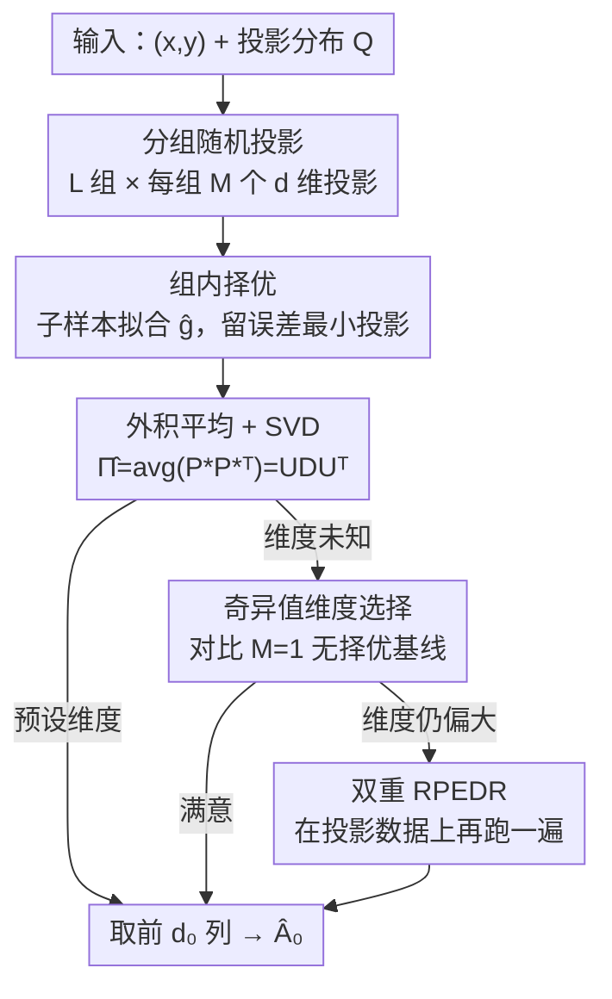

# Random-Projection Ensemble Dimension Reduction

**会议**: ICLR 2026  
**OpenReview**: [https://openreview.net/forum?id=1Cl84lwpdv](https://openreview.net/forum?id=1Cl84lwpdv)  
**领域**: 学习理论 / 充分降维  
**关键词**: 随机投影集成、充分降维、中心均值子空间、SVD 聚合、收敛速率

## 一句话总结
本文提出 RPEDR——一种基于随机投影集成的高维回归降维框架：把大量低维随机投影分成若干互不相交的组，每组按经验回归误差留下最好的一个投影，再用 SVD 聚合这些被选中的投影并由奇异值指导维度选择，理论上估计误差随组数 $L$ 以不慢于 $L^{-1/2}$ 的速率下降，实验上在 18 个仿真设置里 15 个夺冠。

## 研究背景与动机
**领域现状**：在回归里我们想刻画 $p$ 维预测变量 $X$ 与响应 $Y$ 的关系。现代数据里 $p$ 往往很大、甚至超过样本量 $n$，经典方法直接撞上维度灾难——$p>n$ 时普通最小二乘因样本协方差奇异而失效，非参数方法所需样本量随 $p$ 指数膨胀。**充分降维（SDR）** 是化解之道：找一个 $f:\mathbb{R}^p\to\mathbb{R}^d$（$d<p$）使 $X$ 与 $Y$ 在给定 $f(X)$ 后条件独立；实践中 $f$ 常限制为线性，得到更可解释的表示。本文聚焦其线性版本——**中心均值子空间（CMS）**，即条件均值 $\eta(x)=\mathbb{E}(Y\mid X=x)$ 能写成 $g(A_0^\top x)$ 的那个由 $A_0$ 张成的最小子空间 $S(A_0)$。

**现有痛点**：SDR 的主流路线（SIR、SAVE、pHd、DR 这类逆回归法，以及 MAVE、gKDR、drMARS 等）各有适用面，但在高稀疏/高维度/$p>n$ 等极端设置下要么不稳要么直接不可解（comparator 变 intractable）。另一边，随机投影虽是天然的降维工具，但 Johnson–Lindenstrauss 那套只保证近似保距，**单个随机投影几乎必然失败**——正如文中玩具例所示，一个随机选的 2 维投影几乎丢光了 $X$ 与 $Y$ 的关系。

**核心矛盾**：随机投影便宜、灵活、对 $p>n$ 不挑食，但单次投影的质量没有保证；而要得到好方向又不能像传统 SDR 那样依赖会奇异/会爆炸的矩估计。能不能用"多投、择优、再聚合"把随机投影的低成本和高方差驯服成一个有理论保证的估计量？

**本文目标**：(1) 设计一个用户可自定义投影分布与基回归器的 SDR 框架；(2) 给出可数据驱动确定降维维度的机制；(3) 用理论证明误差随投影规模收敛、并在仿真与真实数据上验证。

**切入角度**：作者沿用 Cannings & Samworth (2017) 在**分类**里用随机投影集成的思路，把它迁移到**回归/SDR**——关键观察是：在一组随机投影里"挑出经验误差最小的那个"，多组重复后这些被选投影会集中在真方向 $A_0$ 附近，于是它们外积的平均（再做 SVD）就能把真子空间显影出来。

**核心 idea**：用"分组随机投影 + 组内择优 + 外积平均 + SVD 分解"代替逆回归矩估计来恢复中心均值子空间，并让 SVD 奇异值兼任"方向重要性度量"以指导维度选择。

## 方法详解

### 整体框架
RPEDR 的整体流程：输入是 $n$ 对观测 $((x_i,y_i))_{i=1}^n$、投影维度 $d$、投影分布 $Q$、组数 $L$、组大小 $M$、子样本大小 $n_1$ 和基回归器 $\hat g$；输出是一个 $p\times p$ 的方向矩阵 $U$ 和奇异值向量 $\mathrm{diag}(D)$，进而给出对 $A_0$ 的估计 $\hat A_0$ 和（可选的）维度 $\hat d_0$。

具体三步走（Algorithm 1）：先从 $Q$ 独立采 $L\cdot M$ 个投影矩阵 $P_{\ell,m}\in\mathbb{R}^{p\times d}$，分成 $L$ 个互不相交、各含 $M$ 个的组；每组内把每个投影作用到协变量上、在子样本 $N_1$ 上拟合基回归器、在补集上算均方误差，留下误差最小的 $P_{\ell,\ast}$；最后把 $L$ 个被选投影的外积平均成 $\hat\Pi=\frac1L\sum_\ell P_{\ell,\ast}P_{\ell,\ast}^\top$，对 $\hat\Pi$ 做 SVD 得 $U,D$。在此之上，Algorithm 2 用奇异值数据驱动地选维度 $\hat d_0$，Algorithm 3（double RPEDR）在需要进一步压维时把 Algorithm 1 跑第二遍。三者的调度由"是否预设 $d_0$"决定。

### 关键设计

**1. 分组随机投影 + 组内择优：把高方差的单次投影变成稳定的"好方向工厂"**

单个随机投影几乎一定差，但"一组里挑最好"能稳稳捞到不错的方向。框架把 $L\cdot M$ 个投影切成 $L$ 个互不相交的组，每组 $M$ 个；组内用样本切分（subsample $N_1$ 拟合、补集评估）算每个投影的均方误差 $\hat R_{\ell,m}=\frac{1}{n-n_1}\sum_{i\in N_1^c}\big(y_i-\hat h_{\ell,m}(x_i)\big)^2$，取 $m_\ell^\ast=\arg\min_m \hat R_{\ell,m}$，留下 $P_{\ell,\ast}=P_{\ell,m_\ell^\ast}$。这样每组只贡献一个"赢家"，既保留了随机投影对 $p>n$ 不挑食的优点，又靠组内竞争把质量拉到 $A_0$ 附近。分组（而非全局选 top-$L$）保证了 $L$ 个赢家彼此近似独立，这是后面收敛速率 $L^{-1/2}$ 成立的关键。

**2. 外积平均 + SVD 聚合：让奇异值自己说出"哪个方向更重要"**

被选投影方向各异，怎么融成一个子空间估计？本文把它们的外积平均成 $\hat\Pi=\frac1L\sum_{\ell=1}^L P_{\ell,\ast}P_{\ell,\ast}^\top$，再 SVD 成 $\hat\Pi=UDU^\top$。$U$ 的列就是按重要性递减排序的降维方向（可理解为"跨组被选中频率最高的方向"），奇异值 $D$ 则量化每个方向的相对重要性。真信号方向会被反复选中、外积反复叠加，于是对应奇异值变大、奇异向量逼近 $A_0$——文中玩具例里 $\lvert U_1^\top A_0\rvert=0.996$，几乎把一维真信号完全装进第一奇异向量。这一步把"一堆投影"压缩成"一个带重要性刻度的正交基"，并天然给出维度选择的依据。

**3. 奇异值维度选择：用"无择优基线"判断每个方向是否真有信号**

当 $d_0$ 未知时（Algorithm 2），思路是把 Algorithm 1 得到的奇异值 $D_j$ 和"同分布但组内不做择优（$M=1$）"时得到奇异值的逐分量中位数比较。重采样 $R$ 次得到无择优基线 $D_j^{(r)}$，计算 $T_j=\frac1R\sum_{r=1}^R \mathbf 1\{D_j^{(r)}\le D_j\}$，输出 $\hat d_0=\max\{j:T_\ell>1/2\ \forall \ell\le j\}$。直觉是：一个方向要被保留，得有证据表明它比"纯随机"更容易被算法选中。用中位数而非均值是因为重尾 $Q$（如 Cauchy）下基线易出离群值，中位数更稳。又因投影被重标定为 $\mathrm{trace}(\hat\Pi)=d$，即 $\sum_j D_j=d$，前面奇异值大就自然惩罚了继续选更多维度——这给了维度选择一个内在的"预算约束"。

**4. 双重 RPEDR：把分散在坐标轴上的信号二次合并到最小维度**

当真正贡献 $S(A_0)$ 的协变量个数超过用户想要的 $\check d_0$ 时，单次应用倾向于挑出相关协变量的各个坐标轴、却没把它们有效合成最少的方向（玩具例里一维信号 $\frac{1}{\sqrt2}(X_1+X_2)$ 常被拆成两维）。Algorithm 3 把第一遍当作"筛选"：先用 Algorithm 1+2 得到 $\hat A_0$ 和 $\hat d_0$，若 $\hat d_0>\check d_0$ 就把数据投到 $z_i=\hat A_0^\top x_i$ 上再跑一遍 Algorithm 1，得到 $\check U$ 后令 $\check A_0=\hat A_0(\check U_1,\dots,\check U_{\check d_0})$。第二遍在已筛选的低维空间里把信号组合、剔除无关方向，从而把被拆开的真信号重新拼回一维。附录给出了它的理论保证（Theorem 2，Theorem 1 的扩展）。

### 损失函数 / 训练策略
本文没有可训练参数与损失函数，"训练"即跑算法。默认推荐：投影分布用 Gaussian 与 Cauchy 列的 50–50 混合 $Q=\frac12 Q_N^{\otimes d}+\frac12 Q_C^{\otimes d}$（稀疏未知时两头都稳），组数 $L=200$，组大小 $M=10p$，投影维度 $d=\min\{\lceil p^{1/2}\rceil,10\}$，切分 $n_1=\lceil 2n/3\rceil$，基回归器 $\hat g=\hat g_{\mathrm{MARS}}$。投影列按 $P_j\overset{d}{=}Z/\lVert Z\rVert$ 归一化到单位范数，使其对应原空间里的"方向"。

### 理论保证
核心是 Theorem 1，刻画有限 $L$ 与"无穷模拟版本（$L=\infty$）"输出之间的差距。记 $\Pi_\infty:=\mathbb E(P_{\ell,\ast}P_{\ell,\ast}^\top)$ 为 $\hat\Pi$ 的期望（仅对投影与切分的随机性取期望，不对数据取期望），$\hat A_0^\infty$ 为 $\Pi_\infty$ 的前 $d_0$ 个奇异向量，则

$$\mathbb E\, d_F\big(S(\hat A_0^L),S(A_0)\big)\le 2d_0^{1/2}\,\lVert \Pi_\infty-A_0A_0^\top\rVert_{\mathrm{op}}+\frac{2(2\pi)^{1/2}d_0^{1/2}\,dp}{L^{1/2}}.$$

这里 $d_F$ 是子空间间的（缩放后等价于 sin-theta 的）距离，定义为 $d_F^2(S(\hat A_0),S(A_0))=\frac12\lVert \hat A_0\hat A_0^\top-A_0A_0^\top\rVert_F^2$。第二项随 $L$ 以 $L^{-1/2}$ 衰减，是增大组数即可压低的"模拟误差"；第一项不依赖 $L$，是无穷模拟下的固有误差，取决于 $M,d$、基回归器与投影分布——当被选投影平均上靠近 $A_0$ 时这一项就小。Theorem 2（附录）把该界扩展到 double RPEDR。

## 实验关键数据

### 主实验
在已知 $d_0$ 的设置下，与 SIR、pHd、MAVE、DR、gKDR、drMARS 比较 sin-theta 距离（越小越好）。RPE 为单次应用（Algorithm 1），RPE2 为 double（Algorithm 3）。

| 设置 | 评估指标 | RPE / RPE2 表现 | 对比方法 |
|------|---------|------------------|----------|
| 仿真研究（18 个设置合计） | sin-theta 距离 | 15/18 取得最佳，其余排第二 | SIR/pHd/MAVE/DR/gKDR/drMARS |
| 真实数据（10 个场景，附录 D） | sin-theta 距离 | 6/10 最佳，其余第二 | 同上 |
| $p>n$ 极端设置 | 可解性 | 仍有效（部分场景唯一非平凡） | 部分 comparator 变 intractable |

### 消融实验
针对投影分布与组数 $L$ 的分析（Model 1，$p=20$，不同稀疏度 $q$）：

| 配置 | 关键现象 | 说明 |
|------|---------|------|
| Gaussian 投影 | 各稀疏度表现相同 | 旋转不变，对稀疏不敏感 |
| Cauchy 投影 | 稀疏（$q=2$）下最好、稠密（$q=20$）下变差 | 重尾利于稀疏、害于稠密 |
| 50–50 混合 | 稀疏与稠密都稳 | 稀疏未知时的默认推荐 |
| 增大 $L$ | sin-theta 以 $L^{-1/2}$ 下降 | 与 Theorem 1 吻合（Figure 9） |

### 关键发现
- **组数 $L$ 是"花钱买精度"的旋钮**：误差按 $L^{-1/2}$ 衰减，理论（Theorem 1 第二项）与仿真（Figure 9）一致，默认 $L=200$。
- **投影分布要按稀疏度选，未知就用混合**：Cauchy 重尾擅长稀疏信号、不擅长稠密；Gaussian 因旋转不变对稀疏免疫但稀疏下不及 Cauchy；50–50 混合两头通吃。
- **奇异值能"自报维度"**：Model 2/3 里 Algorithm 2 准确恢复 $\hat d_0=d_0$（如 Model 2 $\lvert U_1^\top e_3\rvert>0.999$）；Model 1a 里一维信号被拆成两维，正是 double RPEDR（Algorithm 3）能修正的典型场景。
- **$p>n$ 不挑食**：传统逆回归法因协方差奇异而失效时，本框架仍给出非平凡估计。

## 亮点与洞察
- **"分组择优"是把随机性变保证的关键**：不是全局选 top-$L$，而是切成互不相交的组各选一个，从而让被选投影近似独立——这正是 $L^{-1/2}$ 速率能成立的统计前提，设计与理论咬合得很紧。
- **奇异值一物两用**：既是聚合后的方向重要性度量，又直接驱动维度选择（与无择优基线比中位数），省掉了额外的 tuning，思路干净。
- **框架高度可插拔**：投影分布、基回归器都是用户可换的接口，把"随机投影集成"做成了一个通用模板，可迁移到分类（其前身）、稀疏 PCA、稀疏 SIR、半监督等一系列问题。
- **double 应用 = 先筛选再合并**：把"恢复方向"和"压到最小维度"解耦成两遍跑，是处理"信号被拆到多个坐标轴"这一具体病症的巧解。

## 局限与展望
- **计算量随 $L\cdot M\cdot d$ 增长**：每个方向都要拟合一次基回归器并评估，默认 $M=10p$ 在高 $p$ 下投影总数可观，附录单列了计算注记。
- **依赖 CMS 存在且唯一的假设**：虽属标准且温和的假设，但本质上仍把目标限定在线性中心均值子空间，对更一般的非线性 SDR 没有直接覆盖。
- **理论界中第一项不随 $L$ 改善**：固有误差 $\lVert\Pi_\infty-A_0A_0^\top\rVert_{\mathrm{op}}$ 由 $M,d$、基回归器与分布决定，论文给的是经验推荐而非这一项的紧理论刻画。
- **超参经验性较强**：$M=10p$、$d=\min\{\lceil p^{1/2}\rceil,10\}$ 等是仿真得来的默认值，换数据域可能仍需重调。

## 相关工作与启发
- **vs Cannings & Samworth (2017)**：他们用随机投影集成做**分类**（聚合基分类器结果），本文迁移到**回归/SDR**并改用外积平均 + SVD 来恢复子空间、用奇异值做维度选择——把"集成投影"从判别任务拓展到了降维任务，并补上了收敛速率理论。
- **vs 逆回归类 SDR（SIR/SAVE/pHd/DR）**：它们靠对 $\mathrm{Cov}(X\mid Y)$ 等矩的估计取特征向量，$p>n$ 时协方差奇异即失效；本文不依赖这类矩估计，靠随机投影 + 经验误差择优，在 $p>n$ 仍可用。
- **vs MAVE/gKDR/drMARS 等近期方法**：这些通过构造最小化问题或核/梯度估计来定子空间；本文以"多投择优聚合"的集成视角给出另一条路线，并在 18 个仿真里 15 个领先。
- **vs Johnson–Lindenstrauss 式随机投影**：JL 只保证近似保距、单次投影对回归结构无保证；本文用"分组择优 + 聚合"把随机投影从"保距工具"升级为"恢复降维子空间的工具"。

## 评分
- 新颖性: ⭐⭐⭐⭐⭐ 把随机投影集成从分类迁到 SDR，并用奇异值兼做重要性度量与维度选择，路线清新
- 实验充分度: ⭐⭐⭐⭐⭐ 18 仿真 + 10 真实数据，含投影分布/$L,M,d$ 的系统消融
- 写作质量: ⭐⭐⭐⭐ 算法、理论、实践推荐层次清晰，理论细节多在附录
- 价值: ⭐⭐⭐⭐ 通用、可插拔、对 $p>n$ 友好，有现成默认配置便于落地

<!-- RELATED:START -->

## 相关论文

- [\[ICLR 2026\] Random Spiking Neural Networks are Stable and Spectrally Simple](random_spiking_neural_networks_are_stable_and_spectrally_simple.md)
- [\[ICLR 2026\] Random Label Prediction Heads for Studying Memorization in Deep Neural Networks](random_label_prediction_heads_for_studying_memorization_in_deep_neural_networks.md)
- [\[ICLR 2026\] Why We Need New Benchmarks for Local Intrinsic Dimension Estimation](why_we_need_new_benchmarks_for_local_intrinsic_dimension_estimation.md)
- [\[ICLR 2026\] Dimension-Free Decision Calibration for Nonlinear Loss Functions](dimension-free_decision_calibration_for_nonlinear_loss_functions.md)
- [\[ICLR 2026\] Scalable Random Wavelet Features: Efficient Non-Stationary Kernel Approximation with Convergence Guarantees](scalable_random_wavelet_features_efficient_non-stationary_kernel_approximation_w.md)

<!-- RELATED:END -->
