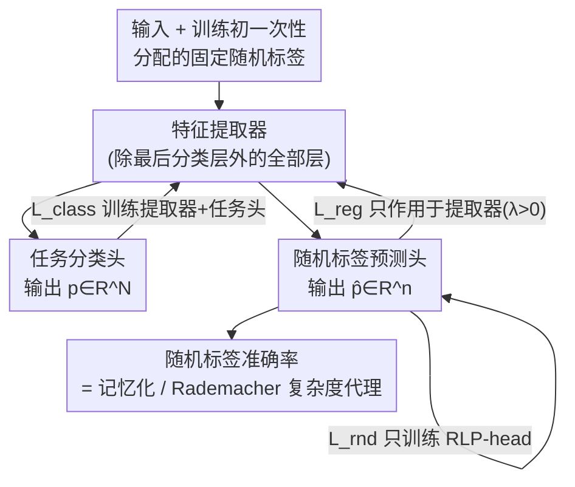

# Random Label Prediction Heads for Studying Memorization in Deep Neural Networks

**会议**: ICLR 2026  
**OpenReview**: [https://openreview.net/forum?id=qBknFL81JO](https://openreview.net/forum?id=qBknFL81JO)  
**代码**: https://github.com/MarlonBecker/RandomLabelHeads  
**领域**: 学习理论 / 泛化与记忆  
**关键词**: 记忆化, Rademacher 复杂度, 泛化, 正则化, 探针

## 一句话总结
给网络在原任务头旁边并联一个"随机标签预测头"（RLP-head），用它预测每个样本被随机分配的标签，再把这个头的随机标签准确率当作 Rademacher 复杂度的经验代理来度量记忆化，并据此设计一个抑制记忆化的正则项——结果发现"减少记忆化"在采样充分的数据集上提升泛化、在欠采样数据集上反而损害泛化，直接挑战了"过拟合等于记忆化"的传统假设。

## 研究背景与动机
**领域现状**：现代深度网络严重过参数化，天然容易过拟合。学界缓解过拟合的常规手段是数据增强、显式正则（dropout、weight decay）和扩大数据规模。但这些方法主要解决"工程上的泛化问题"，对"过拟合到底是怎么发生的"几乎不提供机制层面的洞察。

**现有痛点**：Zhang 等人（2021）那个著名实验说明现代架构能把完全随机标签的数据集训到 100% 训练准确率——这种情况下高准确率只能来自逐样本的记忆。理论上，用 SGD 在随机标签上训练，正好近似 Rademacher 复杂度，而后者是 PAC 框架里推导泛化界的核心量。但**直接把整张网络训练在随机标签上**有两个致命缺陷：一是它只能告诉你"模型有没有记忆能力"，没法说明记忆化在真实任务里如何与泛化交互；二是它破坏了正常训练，无法在训练过程中既度量又抑制记忆化。

**核心矛盾**：Rademacher 复杂度理论上很美、能给出泛化界，但它带一个对假设类取上确界的算子，在真实深度模型上**精确计算不可行**；而现成的"训练在随机标签上"的近似又会把正常任务一起毁掉，二者不可兼得。

**本文目标**：(1) 找一个能在正常训练中实时度量逐样本记忆化、且不干扰原任务的指标；(2) 用这个指标定位记忆化发生在网络哪一层；(3) 基于该指标设计一个能直接"拧动"记忆化强度的正则项，进而研究记忆化与泛化的真实关系。

**切入角度**：作者不再训练整张网络去拟合随机标签，而是只在特征提取器后**并联一个小的随机标签预测头**。这样原分类头完全不受随机标签影响，随机标签头则像一个"探针"，读出当前表征里到底残留了多少逐样本信息。

**核心 idea**：用一个并联的随机标签预测头的准确率作为 Rademacher 复杂度（即记忆化）的经验代理，并把"惩罚这个头预测正确"反向作用到特征提取器上，从而在不破坏主任务的前提下既能测量、又能调控记忆化。

## 方法详解

### 整体框架
方法在一个普通分类网络上做最小改动：把网络拆成"特征提取器 + 任务分类头"，然后在特征提取器后面再**并联**一个随机标签预测头（RLP-head）。每个训练样本在训练开始时被一次性分配一个固定的随机标签（取值范围 $n$ 可任意设定，与真实类别数 $N$ 无关），整个训练过程不变。前向时网络同时输出任务预测向量 $p \in \mathbb{R}^N$ 和随机标签预测向量 $\hat{p} \in \mathbb{R}^n$。

关键在于三条损失的梯度怎么走：任务损失 $L_{class}$ 照常训练特征提取器和任务头；随机标签损失 $L_{rnd}$ **只**训练 RLP-head（梯度不回流特征提取器），保证主任务表现不被随机标签污染；正则损失 $L_{reg}$ 在 RLP-head 上计算、但梯度**只**作用于特征提取器。当正则系数 $\lambda=0$ 时，RLP-head 纯粹是个旁观式探针，其随机标签准确率就是记忆化的度量；当 $\lambda>0$ 时，RLP-head 与特征提取器构成一对对抗组件——头努力拟合随机标签，特征提取器被逼着产出"不那么逐样本特化"的表征以阻止它，从而把记忆化压下去。RLP-head 还可以挂在网络任意深度，分别探测各层表征里残留多少可记忆信息。

### 关键设计

**1. 随机标签预测头：把"训练在随机标签上"改成并联探针，主任务零干扰**

直接把整张网络训练在随机标签上虽能暴露记忆能力，却会毁掉正常任务、也无法在真实训练中同时观察记忆化与泛化。本文的做法是只在特征提取器（即除最终分类层以外的所有层）后面**并联**一个 RLP-head，与原任务头平行，默认挂在倒数第二层之后——因为倒数第二层激活是特征提取器的最终产物，正好探测"学到的最终表征里残留多少逐样本信息"。每个样本的随机标签在训练开始时生成、之后跨 epoch 固定不变。两条监督损失都是标准交叉熵，$y$ 为真实类别、$\hat{y}$ 为分配的随机标签：

$$L_{class} = -\sum_{i=1}^{N}\delta_{iy}\log(p_i) = -\log(p_y), \qquad L_{rnd} = -\sum_{i=1}^{n}\delta_{i\hat{y}}\log(\hat{p}_i) = -\log(\hat{p}_{\hat{y}})$$

由于 $L_{rnd}$ 的梯度被截断在 RLP-head 内部、不回流特征提取器，主任务表现完全不受随机标签影响。默认 RLP-head 就是一层全连接加 softmax（也可换两层）。这个设计的巧妙之处在于：它把"度量记忆化"从一个破坏性的独立实验，变成了可以挂在任何正常训练上的轻量旁路。

**2. 随机标签准确率：Rademacher 复杂度的可计算经验代理**

理论上的（经验）Rademacher 复杂度对二分类定义为

$$\hat{R}_S(\mathcal{H}) = \mathbb{E}_\sigma\left[\sup_{h\in\mathcal{H}}\frac{1}{m}\sum_{i=1}^{m}\sigma_i h(x_i)\right]$$

其中 $\sigma_i\in\{\pm1\}$ 是 i.i.d. 均匀随机标签。它衡量模型拟合随机标签的能力、与架构深度宽度无关，且在 PAC 框架里直接进入泛化界：$R(h)\le \hat{R}_S(h)+\hat{R}_S(\mathcal{H})+3\sqrt{\log(2/\delta)/(2m)}$，即训练表现固定时，复杂度越低、测试误差上界越紧。但那个上确界算子让它在真实深度模型上没法精确算。本文用 RLP-head 的**随机标签准确率**作为它的多分类经验代理：头能预测对越多随机标签，说明特征提取器记住的逐样本信息越多、有效复杂度越高。作者用两个实验验证这个代理是可信的——其一是"frozen"对照：在每个 epoch 的 checkpoint 上冻结除 RLP-head 外的所有层、从头单独充分训练 RLP-head，发现 epoch 0（随机权重）时它根本拟合不了随机标签，证明默认训练里测到的信号确实来自特征提取器学到的记忆、而非头自己有记忆能力；其二是把头逐层挂上去，随机标签准确率随深度上升（第一层近 0%、深层很高），说明只有当特征被充分抽象后逐样本信息才以可记忆形式存在。此外 dropout、weight decay、label smoothing 三种已知复杂度正则都会稳定压低该准确率，进一步佐证它确实在度量模型复杂度。

**3. RLP 正则项：把交叉熵反号，让特征提取器与探针对抗以抑制记忆化**

既然随机标签准确率代理了有效复杂度，那么压低它就等于约束记忆化。作者从标准交叉熵出发改造出正则损失：

$$L_{reg} = \sum_{i=1}^{n}\delta_{i\hat{y}}\log(1-\hat{p}_i) = \log(1-\hat{p}_{\hat{y}})$$

相比标准交叉熵，这里做了两处改动：一是**反号**，因为目标是阻止网络学会随机标签而非学会它；二是把对数里的 $\hat{p}_i$ 换成 $1-\hat{p}_i$，使得当 $\hat{p}_{\hat{y}}\approx 1$（高置信地预测对了随机标签）时惩罚被急剧放大。该项乘以可调系数 $\lambda$ 后只加到特征提取器的损失上、梯度不碰分类头。于是 RLP-head 与特征提取器形成对抗：头拼命拟合随机标签，提取器被逼着产出更"去个体化"、不利于记忆单个输入的表征。这个正则项是本文用来**主动调控**记忆化、进而研究其因果效应的工具，而不只是又一个提点 trick。

### 损失函数 / 训练策略
总损失为三项之和：$L = L_{class} + L_{rnd} + \lambda L_{reg}$，但通过梯度截断实现"分而治之"——$L_{class}$ 训练提取器与任务头，$L_{rnd}$ 只训练 RLP-head，$\lambda L_{reg}$ 只训练提取器。$\lambda$ 是唯一的核心超参，扫描范围跨好几个数量级（$0$ 到 $10^5$）；$\lambda=0$ 时方法退化为纯度量模式。

## 实验关键数据

### 主实验
作者在 ViT-B/32 + ImageNet 与 WideResNet-16-4 + CIFAR-100 两套设置上验证度量与正则的效果。一个反直觉的核心结果是：同样有效地抑制了记忆化（随机标签准确率都降到随机猜测水平），但对泛化的影响截然相反。

| 设置 | 抑制记忆化后训练准确率 | 测试准确率变化 | 结论 |
|------|------|------|------|
| ViT-B/32 @ ImageNet | 下降（train-test gap 收窄） | 67.0% → 68.5%（$\lambda=10^4$，+1.5%） | 符合经典理论：减记忆 → 减过拟合 → 泛化变好 |
| WRN-16-4 @ CIFAR-100 | 几乎不变 | 即使小 $\lambda$ 也下降 | 违反经典理论：减记忆反而损害泛化 |

### 消融实验

| 配置 / 分析 | 关键现象 | 说明 |
|------|---------|------|
| frozen vs default RLP-head | epoch 0 时 frozen 头拟合不了随机标签 | 证明信号来自特征提取器的记忆，而非头本身 |
| RLP-head 逐层挂载 | 第 1 层≈0%，深层升至 ~80% | 记忆化定位：抽象后的深层特征仍逐样本特化 |
| dropout / weight decay / label smoothing | 三者都稳定压低随机标签准确率 | 该指标确实随模型复杂度变化 |
| 缩小 ImageNet 数据比例 (DF=100%→5%) | 数据越小记忆越强，但抑制记忆**不**再提升测试准确率 | 支持"欠采样时记忆有益"假设 |
| 注入标签噪声 (0%→40%) | 抑制记忆稳定提升测试准确率 | 噪声标签只能靠记忆拟合，去掉它必然有益 |
| 只正则第 12 层 | 第 10-11 层准确率下降，第 2-6 层反而上升 | 记忆化被"挤"到了更早的层，没被消除 |

### 关键发现
- **"减少记忆化"不是单调有益的**：在采样充分的 ImageNet 上抑制记忆化使网络转去学类别共享特征、泛化提升；但在欠采样的 CIFAR-100 上，被逼学到的"共享特征"其实是采样不足造成的伪特征，抑制记忆反而损害泛化。作者据此提出"过拟合 ≠ 记忆化"的新观点。
- **记忆化有空间位置且会迁移**：只在最后一层施加正则时，网络会把逐样本特征在更早的层就转成类相关信息，使记忆"绕过"末层探针继续存在——说明记忆化是可被重新分布而非简单消灭的。
- **标签噪声是干净的对照**：噪声标签对泛化只有害无益、且只能靠记忆拟合，因此该场景下正则一致提升测试准确率，反向印证了正则确实在抑制记忆而非别的东西。

## 亮点与洞察
- 把抽象的 Rademacher 复杂度落成一个"挂在正常训练上、读个准确率就行"的探针，既廉价又不破坏主任务——这是方法最聪明的地方：度量和训练解耦靠的只是梯度截断。
- 正则项的两处小改动（反号 + $1-\hat{p}_i$）让一个抑制项有了清晰的对抗语义，而且只作用于特征提取器、不动分类头，使"调控记忆化"成为一个可控的因果实验旋钮，而非黑箱提点。
- "记忆迁移到更早层"的发现很有迁移价值：任何只在某处施加的表征约束，都可能被网络在别处补偿，这提醒做可解释性/隐私防护时不能只盯单层。

## 局限与展望
- frozen 验证虽干净但计算极其昂贵（每个 epoch 都要从头重训一个头），只能用于验证、不能用于实际正则。
- "欠采样导致记忆有益"目前仍是**假设**（hypothesis），作者用数据比例和噪声实验提供了支持证据，但没有给出严格的理论刻画，"采样是否充分"也缺乏可操作的判定标准。
- 实验集中在 ViT-B/32 与 WRN 两种架构、图像分类任务；随机标签数 $n$、头结构等设计选择对结论的稳健性讨论有限。
- 自己发现的一点：随机标签准确率作为多分类代理与二分类 Rademacher 复杂度只是"概念对应"，二者的定量关系并未严格建立，跨数据集/任务直接比大小需谨慎。

## 相关工作与启发
- **vs 直接训练在随机标签上 (Zhang et al., 2021)**：他们用整张网络拟合随机标签来暴露记忆能力，但破坏主任务、且只能事后做。本文改成并联探针，能在正常训练中实时度量并调控记忆化。
- **vs 记忆化定位工作 (Maini et al., 2023)**：他们指出记忆化在层/神经元层面是局部的。本文把 RLP-head 挂在不同深度，给出一个直接、统一的逐层定位手段，并进一步发现记忆化在正则下会迁移。
- **vs 长尾/欠采样视角 (Feldman 2019; Bayat et al. 2024)**：他们论证稀疏采样区域的记忆能促进泛化。本文用可调正则把这一现象在 ImageNet 子集、ImageNet-LT、噪声标签上做了可控验证，把"记忆何时有益"从观察推进到可操纵的实验。

## 评分
- 新颖性: ⭐⭐⭐⭐⭐ 用并联探针把 Rademacher 复杂度变成可实时度量且可调控的量，是简洁而原创的视角。
- 实验充分度: ⭐⭐⭐⭐ 两架构两数据集 + frozen/逐层/数据比例/噪声/层迁移多组对照，但架构和任务覆盖仍偏窄。
- 写作质量: ⭐⭐⭐⭐⭐ 从理论动机到方法再到反直觉结论，逻辑链清晰、图文配合好。
- 价值: ⭐⭐⭐⭐⭐ 提供了一个研究记忆化的通用工具，并实质性挑战了"过拟合=记忆化"的常识。

<!-- RELATED:START -->

## 相关论文

- [\[ICLR 2026\] Random Spiking Neural Networks are Stable and Spectrally Simple](random_spiking_neural_networks_are_stable_and_spectrally_simple.md)
- [\[ICLR 2026\] On Universality of Deep Equivariant Networks](on_universality_of_deep_equivariant_networks.md)
- [\[ICLR 2026\] Provable Separations between Memorization and Generalization in Diffusion Models](provable_separations_between_memorization_and_generalization_in_diffusion_models.md)
- [\[ICLR 2026\] From Neural Networks to Logical Theories: The Correspondence between Fibring Modal Logics and Fibring Neural Networks](from_neural_networks_to_logical_theories_the_correspondence_between_fibring_moda.md)
- [\[ICLR 2026\] Implicit bias produces neural scaling laws in learning curves, from perceptrons to deep networks](implicit_bias_produces_neural_scaling_laws_in_learning_curves_from_perceptrons_t.md)

<!-- RELATED:END -->
