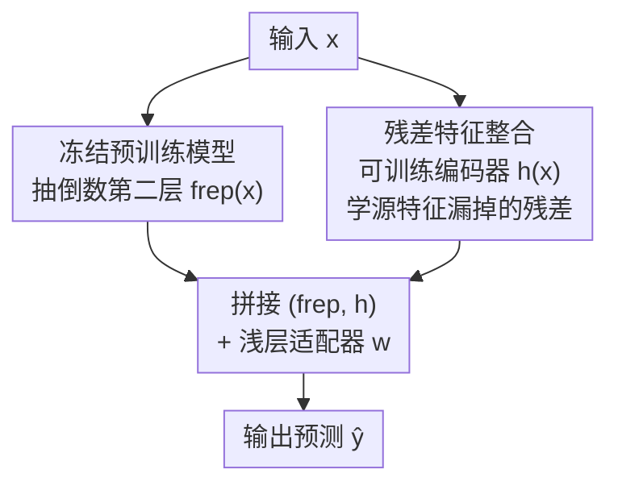

# Residual Feature Integration is Sufficient to Prevent Negative Transfer

**会议**: ICLR 2026  
**OpenReview**: [https://openreview.net/forum?id=b1ITgc4J4M](https://openreview.net/forum?id=b1ITgc4J4M)  
**代码**: 待确认  
**领域**: 迁移学习理论 / 表示学习  
**关键词**: 负迁移、残差连接、迁移学习、非参数回归、收敛率

## 一句话总结
本文提出 REFINE：把冻结的预训练源特征 $f_{rep}(x)$ 与一个在目标域上训练的残差编码器 $h(x)$ 拼接后再接一个浅层适配器，作者从非参数回归理论上证明这个极简结构**可证明地避免负迁移**——最坏情况下不差于从头训练，源特征有用时收敛率又能平滑过渡到近参数率，并在图像/文本/表格基准以及单细胞空间组学的跨模态任务上验证了它的稳健性。

## 研究背景与动机

**领域现状**：迁移学习是现代机器学习的核心范式，把源域（大规模预训练模型）学到的表示迁到目标任务上。最常见的两种做法是 linear probing（在冻结特征上训一个线性层）和 adapter（在冻结特征上训一个浅层网络），以及知识蒸馏、LoRA 等参数高效微调。

**现有痛点**：这些方法都受困于一个老问题——**负迁移**：当源域和目标域分布不匹配时，用源特征反而比直接在目标数据上从头训练更差。在医疗等高风险场景尤为危险（如 ImageNet→医学影像常常有害）。已有的缓解手段大多是经验性的：要么去估计源–目标相似度（实践中很难量化），要么像 DANN-Gate 那样用对抗训练 + 门控过滤误导样本（需要访问源数据、且没有理论保证）。

**核心矛盾**：现有方法要么强依赖源特征 $f_{rep}(x)$（一旦它不对齐就崩），要么完全抛弃源特征从头学（没利用上迁移红利）。根本问题在于：**没有一种方法能在"源特征好就利用、源特征坏就自动退回从头训练"之间做到可证明的无损切换**，而且迄今几乎没有任何理论能保证负迁移一定不发生。

**本文目标**：找一个结构，使得 (i) 当 $f_{rep}$ 与目标分布对齐时，能利用迁移知识、超过从头训练；(ii) 当 $f_{rep}$ 不对齐时，能退守到不差于从头训练、且优于只用 $f_{rep}$ 的模型。并且要有严格的理论保证。

**切入角度**：作者注意到 ResNet/梯度提升里那个"残差连接"——它最初是为缓解深网优化难题而生的结构组件，却从没被用来对付负迁移。如果在冻结源特征旁边并联一条**可训练的残差通路** $h(x)$，让它去补源特征漏掉的目标专属信号，那么源特征好坏都不会拖累目标任务。

**核心 idea**：用一句话概括就是——**给冻结的源特征并联一条目标域训练的残差编码器，把"是否信任源特征"这件事交给学习器自己决定**，从而在最坏情况下也保证不发生负迁移。

## 方法详解

### 整体框架

REFINE（Residual Feature Integration）要解决的是"既想用源特征、又怕源特征拖后腿"的两难。它的做法极其简单：从冻结的预训练模型 $f$ 的倒数第二层抽出特征 $f_{rep}(x)\in\mathbb{R}^p$（这部分**不更新**），同时在目标域上训练一个轻量的残差特征编码器 $h(x)\in\mathbb{R}^q$，把两者拼接成 $(f_{rep}(x),\,h(x))$，最后在拼接表示上接一个浅层适配器（线性/小网络）$w$ 做预测。训练时只更新 $h$ 和 $w$，源模型和 $f_{rep}$ 始终冻结。

直觉是：$f_{rep}(x)$ 已经编码了大部分可迁移信号，但可能漏掉目标域专属、对预测关键的信息；残差通路 $h(x)$ 专门去补这块漏掉的信号。而且因为 $f_{rep}$ 已经"垫好了一截"，从联合表示 $(f_{rep},h)$ 学目标函数，所需的函数类比从 $x$ 或 $h(x)$ 单独学要简单得多——这正是后面收敛率能改善的来源。

整个 pipeline 清晰的前馈结构如下：

形式上，模型写作 $g(x) = v^\top f_{rep}(x) + u\,h(x)$，其中 $v$ 是 $f_{rep}$ 上的线性探针、$h$ 是一个（截断的）ReLU 残差网络，$|u|\le1,\|v\|\le1$。训练就是在这个函数类 $\mathcal{G}_{d,p}(W,L,B;f_{rep})$ 上做平方损失的经验风险最小化。

### 关键设计

**1. 残差特征整合结构：用并联残差通路补源特征的漏洞**

这一设计直接对准"源特征不对齐就负迁移"的痛点。传统 linear probe / adapter 都是**串行**地在 $f_{rep}$ 上接一层——一旦 $f_{rep}$ 丢了目标专属信息，下游再怎么训也补不回来（信息已在冻结源模型的前向过程中丢失）。REFINE 改成**并联**：在 $f_{rep}(x)$ 旁边加一条可训练通路 $h(x)$，让模型用 $g(x)=v^\top f_{rep}(x)+u\,h(x)$ 同时吃源特征和残差特征。关键在于 $h$ 学的是**残差** $f^*(x)-v^\top f_{rep}(x)$ 而不是整个目标函数：源特征好时这个残差很小、$h$ 几乎不用干活；源特征差时残差就是整个目标函数、$h$ 退化为从原始输入从头学。这条残差通路相当于给学习器一个"安全阀"，把"信不信源特征"的决定权交给数据，而不是预先写死。整个改动架构无关、不需访问源数据、参数开销可调（可训练参数仅占源模型 4.88%，与 Adapter 5.46%、Distillation 4.68% 同量级）。

**2. 可证明的无负迁移保证：收敛率从非参数平滑过渡到近参数**

这是全文的主贡献，把上面那条"安全阀"直觉变成了严格定理。作者在非参数回归框架下分析：真值 $f^*$ 是 $\beta$-Hölder 光滑，$h$ 是宽 $W$、深 $L$、权重幅度 $B$ 的截断 ReLU 网络。定义最佳线性探针 $v^*=\arg\min_v \mathbb{E}[(v^\top f_{rep}(X)-f^*(X))^2]$，并用残差的 Hölder 范数 $\rho^*:=\|v^{*\top}f_{rep}-f^*\|_{C^\beta}$ 衡量源特征质量（$\rho^*$ 越小说明 $f_{rep}$ 越有用）。Theorem 4.1 给出的泛化误差上界为

$$\mathbb{E}[R_{P^t}(\hat g)-R_{P^t}(f^*)] \le C\Big\{\rho^{2d/(2\beta+d)}\log n + \rho^{*2}\rho^{-4\beta/(2\beta+d)}\,n^{-2\beta/(2\beta+d)} + \tfrac{p\log n}{n}\Big\}.$$

这个界拆成两块：学 $v^*$ 的**参数项** $p\log n/n$，和学残差的**非参数项**（标准 minimax 率 $n^{-2\beta/(2\beta+d)}$，被调参 $\rho$ 和残差难度 $\rho^*$ 调制）。两个推论刻画了它的妙处：固定 $\rho$ 时（Corollary 4.2）速率 $\tilde O(n^{-2\beta/(2\beta+d)}+p/n)$，永远不差于从头训练的 minimax 最优率；调 $\rho\downarrow\rho^*$ 时（Corollary 4.3），$f_{rep}$ 对齐（$\rho^*$ 小）非参数项被压下去、界由近参数项 $p/n$ 主导，$f_{rep}$ 不对齐（$\rho^*$ 大）则自动退回经典 $\beta$-Hölder minimax 率。Corollary 4.4 进一步给出**无负迁移保证**：在可被 $f_{rep}$ 线性逼近到 $\gamma$ 误差的函数类 $\mathcal{F}_\beta(f_{rep},\gamma)$ 上，REFINE 的超额风险（差对数因子）不差于"从头训练 $\hat g_{sc}$"和"$f_{rep}$ 线性探针 $\hat w_{ft}$"二者的较小者。这是据作者所知第一个能保证防住负迁移的理论结果。

**3. 适配期多模态扩展：残差通路注入预训练时缺失的模态**

作者识别出一种被忽视的负迁移：**源模型预训练时根本没见过某个模态，而这个模态只在适配期才出现**。常规微调/PEFT 无法凭空补出模型从没学过的信息。REFINE 的残差结构天然能干这件事——让 $h(x)$ 去编码那个缺失模态，并联进冻结的源特征即可。论文用单细胞空间组学做了实证：scGPT 这类基础模型只在解离的 RNA 上预训练、从没见过空间坐标，而淋巴结解剖域分类任务需要空间信息。直接在 scGPT 特征上做 LinearProbe/Adapter 出现明显负迁移（1000 个标注细胞时 F1 仅 0.24–0.29，还不如直接用空间结构从头训的 GNN 的 0.47）；REFINE 加一条轻量残差空间编码器后，F1 在 1000 标注时升到约 0.52、3000 标注时超过 0.70，且 AUC 全程更强。这说明残差机制不止是理论上的安全阀，还解锁了"无须重训源模型就给它接上新模态"的新能力。

### 损失函数 / 训练策略

训练目标是平方损失下的经验风险最小化 $\hat g=\arg\min_{g\in\mathcal{G}}\frac1n\sum_i (g(X_i)-Y_i)^2$，只更新 $h$ 和适配器 $w$、冻结 $f_{rep}$。理论分析用平方损失（沿用"用回归代理分析分类"的惯例）。实验统一用 SGD（学习率 0.01、动量 0.9），预训练 60 epoch、微调 30 epoch，$f_{rep}$ 与 $h$ 既可用 CNN 也可用 Transformer。网络容量通过 $\rho$ 调 $W,B$ 实现偏差–方差权衡：$\rho$ 大逼近能力强（偏差小但方差大），$\rho$ 小则正则化 $h$（残差本就小时更优）。

## 实验关键数据

### 主实验：自然分布漂移下的单源迁移（Table 1）

REFINE 在图像/文本跨域、跨模态任务上一致取得有竞争力或更优的结果，尤其在标签空间差异大、风格漂移大的设置下优势明显。

| 迁移任务 | 指标 | NoTrans | 最强基线 | REFINE |
|----------|------|---------|----------|--------|
| CIFAR100→10 | Acc | 56.58 | 43.22 (DANN-Gate) | **54.40** |
| CIFAR10→100 | Acc | 18.32 | 7.01 (LinearProbe) | **18.59** |
| CIFAR10→STL | Acc | 48.69 | 50.76 (LoRA) | **53.42** |
| Clipart→Sketch | Acc | 18.88 | 18.34 (LinearProbe) | **20.34** |
| USPS→MNIST | Acc | 62.07 | 66.99 (LinearProbe) | **70.05** |
| Books→Kitchen | Acc | 71.66 | 71.34 (Adapter) | **72.72** |
| DVD→Electronics | Acc | 68.52 | 66.90 (DANN-Gate) | **70.34** |

可以看到，LinearProbe/Adapter/LoRA/DANN-Gate 在 CIFAR100→10、CIFAR10→100 上相对 NoTrans 出现严重负迁移（掉到 38%、甚至 5–7%），而 REFINE 始终贴近或超过 NoTrans 基线，相对最强自适应基线提升 5–15%。

### 消融/压力测试：标签噪声、语义扰动、类不均衡（Table 2，CIFAR-10 + CNN）

| 设置 | 指标 | NoTrans | 自适应基线代表 | REFINE |
|------|------|---------|----------------|--------|
| 40% 标签翻转 | Acc | 56.05 | 65.78 (Adapter) | **66.23** |
| 80% 标签翻转 | Acc | 56.57 | 22.92 (LoRA) | **56.58** |
| 语义混淆 | Acc | 56.53 | 49.96 (LoRA) | **58.65** |
| 类不均衡 | Acc | 56.44 | 53.21 (LoRA) | **56.54** |

### 关键发现

- **80% 极端噪声是分水岭**：LinearProbe/Adapter/DANN-Gate 几乎全崩（<25%），REFINE 仍贴近 NoTrans（56.58%），比最强自适应基线高出近 35 个百分点——直观验证了"源特征坏时自动退回从头训练"的理论保证。
- **不是容量问题而是设计问题**：加大 Adapter 的复杂度并不能解决负迁移，而 REFINE 用仅 4.88% 的可训练参数（与 Adapter/Distillation 同量级）就做到了；Appendix C.5 显示改变 $h$ 的参数选择对 REFINE 几乎没影响，说明优势来自并联残差这一**结构**而非堆参数。
- **跨模态扩展是独有能力**：单细胞空间组学任务上，只有 REFINE 能把预训练时缺失的空间模态在适配期注入，F1 从 baseline 的 0.24–0.29 提到 0.52→0.70+，定性上也更忠实地重建了皮质、滤泡等解剖域。

## 亮点与洞察

- **把"残差连接"从优化工具重新诠释成"防负迁移机制"**：ResNet 的残差最初是为缓解深网优化，本文指出它并联在冻结源特征旁时，等价于给学习器一个"信不信源特征"的安全阀——这个视角的迁移很巧妙，且架构无关、可即插即用。
- **理论给出了少见的"无损"保证**：大多数迁移方法只能给经验改进，本文证明了 worst-case 下不差于从头训练、best-case 下逼近参数率，且收敛率随源特征质量 $\rho^*$ 平滑插值，是首个明确防住负迁移的理论结果。
- **"残差只学差值"降低有效复杂度**：因为 $h$ 学的是 $f^*-v^\top f_{rep}$ 而非整个 $f^*$，源特征越好、要学的残差越简单——这条思路可迁移到任何"已有一个不完美先验表示、想安全地补充它"的场景（如多源迁移、基础模型适配）。
- **适配期模态扩展**是个被低估的应用点：不重训源模型就给它接上新模态，对基础模型时代（模型大、重训贵）尤其实用。

## 局限与展望

- **理论限定在平方损失 + 非参数回归**：分类是通过回归代理来分析的，真实分类/复杂损失下的保证是否同样紧仍待验证。
- **依赖容量调参 $\rho$**：最优率需要把 $\rho$ 调到 $\rho^*$ 附近，而 $\rho^*$（源特征质量）实践中未知，如何自适应选 $\rho$ 文中主要靠经验，理论上的自动调参留作开放问题。
- **残差通路本身仍需在原始输入上训练**：当目标数据极少时，$h$ 从 $x$ 学残差也会受样本量限制；论文 Figure 2 也显示标注极少时增益有限。
- **多源/更复杂模态组合**：当前实证主要是单源迁移 + 单个缺失模态，多模态、多源联合的残差整合如何设计与保证，是自然的延伸方向。

## 相关工作与启发

- **vs LinearProbe / Adapter**：它们串行地在冻结 $f_{rep}$ 上接线性层/浅网络，一旦 $f_{rep}$ 丢了目标信息就补不回来、易负迁移；REFINE 并联一条残差通路从原始输入补信号，源特征坏时能退守从头训练。
- **vs LoRA（PEFT）**：LoRA 往预训练权重里插低秩可训练模块，需要访问模型权重和计算图，且源表示不对齐时同样吃力；REFINE 不碰源模型内部、不需源数据，多源场景更灵活。
- **vs DANN-Gate**：SOTA 经验方法，用对抗训练 + 门控过滤误导源样本，但需直接访问源数据、纯经验无理论；REFINE 不需源数据且有严格保证。
- **vs Stacking / 蒸馏**：Stacking 假设所有外部模型可靠、要求输出空间对齐；蒸馏要求源/目标类空间一致。REFINE 都不需要这些前提，适用面更广。

## 评分
- 新颖性: ⭐⭐⭐⭐⭐ 把残差连接重新诠释为可证明的防负迁移机制，并给出首个无负迁移理论保证
- 实验充分度: ⭐⭐⭐⭐ 图像/文本/表格 + 噪声/扰动/不均衡压力测试 + 单细胞跨模态，覆盖面广，但多数为中小规模基准
- 写作质量: ⭐⭐⭐⭐⭐ 理论与直觉衔接清晰，定理与推论层层递进，动机讲得到位
- 价值: ⭐⭐⭐⭐⭐ 极简、架构无关、即插即用且有理论背书，对基础模型时代的安全迁移很有实用价值

<!-- RELATED:START -->

## 相关论文

- [\[ICLR 2026\] Transfer Learning in Infinite Width Feature Learning Networks](transfer_learning_in_infinite_width_feature_learning_networks.md)
- [\[ICLR 2026\] Toward Practical Equilibrium Propagation: Brain-Inspired Recurrent Neural Network with Feedback Regulation and Residual Connections](toward_practical_equilibrium_propagation_brain-inspired_recurrent_neural_network.md)
- [\[ICLR 2026\] Price of Quality: Sufficient Conditions for Sparse Recovery using Mixed-Quality Data](price_of_quality_sufficient_conditions_for_sparse_recovery_using_mixed-quality_d.md)
- [\[ICLR 2026\] Feature Compression is the Root Cause of Adversarial Fragility in Neural Networks](feature_compression_is_the_root_cause_of_adversarial_fragility_in_neural_network.md)
- [\[ICLR 2026\] Mitigating the Curse of Detail: Scaling Arguments for Feature Learning and Sample Complexity](mitigating_the_curse_of_detail_scaling_arguments_for_feature_learning_and_sample.md)

<!-- RELATED:END -->
