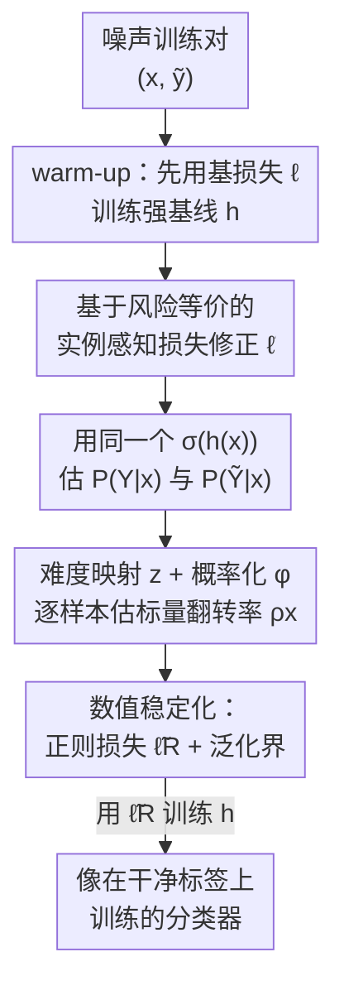

# Resurfacing the Instance-only Dependent Label Noise Model through Loss Correction

**会议**: ICLR 2026  
**OpenReview**: [https://openreview.net/forum?id=tuvkrivvbG](https://openreview.net/forum?id=tuvkrivvbG)  
**代码**: https://github.com/mustafaaydn/NDX  
**领域**: 学习理论 / 带噪标签学习  
**关键词**: 标签噪声, 损失修正, 风险等价, 实例独立噪声, 泛化界

## 一句话总结
本文重新启用"只依赖实例、不依赖标签"的标签噪声模型（IDN），基于风险等价为任意分类校准损失设计一个实例感知的修正损失 $\tilde{\ell}$，把"在噪声标签上做经验风险最小化"严格桥接到"在干净标签上做真风险最小化"，并且每个样本只需估一个标量翻转率 $\rho_x$ 而非一整个转移矩阵，在图像/音频/表格三类数据、神经网络和梯度提升树两类学习器上都验证了泛化能力。

## 研究背景与动机
**领域现状**：监督分类里标注难免出错，机器会过拟合这些错标导致泛化变差。一类机器无关（machine-agnostic）的主流做法是**损失修正**：给定一个本身不耐噪的损失（如 logistic、hinge），改造出一个对标签噪声鲁棒的新损失。它的好处是只改几行代码、几乎零额外算力，比改整套训练机制省事得多。

**现有痛点**：标签噪声的转移过程通常按四类建模——RCN（与 $X,Y$ 都无关的均匀翻转）、CCN（只依赖类别 $Y$）、IDN（只依赖实例 $X$）、ILDN（同时依赖 $X,Y$）。CCN 是被研究最多的模型，但"翻转只跟类别有关、跟具体样本无关"这一假设并不现实。学界转向更自然的实例相关噪声时，几乎默认用的是 **ILDN**（同时条件在 $X$ 和 $Y$ 上），需要逐样本估一个完整的转移矩阵，参数多、估计难、计算重。

**核心矛盾**：人们口中的"instance-dependent noise"几乎总是指 ILDN，而真正"只依赖实例"的 **IDN** 被冷落了。IDN 背后的假设其实很合理：$Y$ 本身是 $X$ 的某种聚合统计量，给定 $X$ 后 $Y$ 不会对翻转率提供额外信息。参数少看似会欠拟合，但作者实证发现 IDN 并不比 ILDN 弱，却显著更高效。历史上只有 Bylander (1998)、Du & Cai (2015) 两篇用过 IDN，且都局限在线性机器上。

**本文目标**：(1) 把 IDN 噪声模型从线性机器推广到任意学习机；(2) 给出实用、计算高效的方式逐样本估计 $\rho_x$；(3) 把它接到风险等价的起点上，导出一个对噪声鲁棒的代理损失。

**切入角度**：从机器学习的终极目标——泛化——出发。带噪学习要的是"在噪声数据上训练、却在干净数据上泛化好"。这件事可以精确写成一个**风险等价**等式（式 1）：
$$\mathbb{E}_{X,\tilde{Y}}\!\left[\tilde{\ell}(h(X),\tilde{Y})\right] = \mathbb{E}_{X,Y}\!\left[\ell_{01}(h(X),Y)\right].$$
左边是可观测的噪声风险，右边是想要的干净 0-1 风险。只要能设计出满足该等式的 $\tilde{\ell}$，就等于"用噪声标签训练却像用干净标签训练一样"。

**核心 idea**：用 IDN 的标量翻转率 $\rho_x$ 替代 ILDN 的转移矩阵，去填补风险等价里的未知项，从而对任意分类校准基损失修正出一个噪声容忍的代理损失。

## 方法详解

### 整体框架
方法（作者命名为 **NDX**）要解决的是：给定一个分类校准的基损失 $\ell$（如 logistic loss $\ell_{\log}(h(x),y)=\log(1+e^{-y\cdot h(x)})$），构造修正损失 $\tilde{\ell}$，使得在噪声标签上最小化 $\tilde{\ell}$ 等价于在干净标签上最小化 0-1 风险。整条逻辑链（式 2）是：
$$R_{\ell_{01}}(h)\xleftarrow{\text{分类校准}}R_{\ell}(h)\xleftarrow{\text{我们设计的}\tilde{\ell}}\tilde{R}_{\tilde{\ell}}(h)\xleftarrow{\text{大数定律}}\widehat{\tilde{R}}_{\tilde{\ell}}(h).$$
最右端是手头能算的"经验噪声风险"，最左端是真正想要的"真干净 0-1 风险"，三段箭头分别由大数定律、本文的 $\tilde{\ell}$ 设计、以及基损失的分类校准性接通。

整体可看作一条串行管线：先用基损失做几轮 warm-up 形成对 $\mathbb{P}(Y\mid x)$ 的强基线 → 用同一个 sigmoid $\sigma(h(x))$ 同时估计两个标签概率 → 用一个"难度映射 + 概率化"逐样本估出标量翻转率 $\rho_x$ → 把这三个估计代入修正损失 $\tilde{\ell}$ → 因为分母可能逼近 0，再换成数值稳定的正则化版本 $\tilde{\ell}_R$ 来训练，并给出泛化界保证。

### 关键设计

**1. 基于风险等价的实例感知损失修正：把"噪声经验风险"焊死到"干净真风险"**

这一步直接回应"logistic/hinge 这类损失即使噪声均匀也不耐噪"的痛点。作者不是去手工拼一个看起来鲁棒的损失，而是反过来从风险等价等式倒推出 $\tilde{\ell}$ 的闭式解（命题 1，式 3）：
$$\tilde{\ell}(h(x),\tilde{y}) = \frac{\mathbb{P}(Y{=}\tilde{y}\mid x)\big(\mathbb{P}(\tilde{Y}{=}{-}\tilde{y}\mid x)-\rho_x\big)\ell(h(x),\tilde{y}) - \mathbb{P}(Y{=}{-}\tilde{y}\mid x)\rho_x\,\ell(h(x),-\tilde{y})}{\mathbb{P}(\tilde{Y}{=}\tilde{y}\mid x)\,\mathbb{P}(\tilde{Y}{=}{-}\tilde{y}\mid x)-\rho_x}.$$
命题 1 保证 $\tilde{R}_{\tilde{\ell}}(h)=R_{\ell}(h)$，即对噪声标签求 $\tilde{\ell}$ 的期望恰好等于对干净标签求基损失 $\ell$ 的期望。与最接近的工作相比，本文的关键区别在于**对潜变量 $Y$ 取了期望**——作者指出 Natarajan et al. (2013) 缺这一步、没有真正实现风险等价；而 Patrini et al. (2017) 虽有期望但基于 CCN、还需要 anchor points 和一个独立训练阶段。本文修正损失里含三个未知量 $\mathbb{P}(Y\mid x)$、$\mathbb{P}(\tilde{Y}\mid x)$、$\rho_x$，下面三个设计就是逐一把它们估出来。

**2. 用同一个 sigmoid 同时建模两个标签概率：省掉脱节的二段式训练**

修正损失里的 $\mathbb{P}(\tilde{Y}\mid x)$ 因为有 $(x,\tilde{y})$ 直接监督，本可单独训一个模型估出来；但 $\mathbb{P}(Y\mid x)$ 没有干净标签可用。作者的观察是：打分器 $h$ 本身就在建模 $\mathbb{P}(Y\mid x)$，于是直接令 $\mathbb{P}(Y{=}z\mid x)\approx\sigma(z\cdot h(x))=(1+e^{-z\cdot h(x)})^{-1}$。理由是训练收敛后机器应当学到的正是干净标签概率；而且训练初期干净样本主导学习，所以**先空出几轮 warm-up 只用未修正的基损失 $\ell$**，给 $\mathbb{P}(Y\mid x)$ 打一个强基线。对 $\mathbb{P}(\tilde{Y}\mid x)$，本可另训一个模型，但这种"$\mathbb{P}(\tilde{Y}\mid x)$ 与 $h$ 分开训"的二段式不仅耗时、实测性能还更差（附录 A.4）；因此作者干脆**也用同一个 $\sigma(h(x))$ 来近似 $\mathbb{P}(\tilde{Y}\mid x)$**——因为 $h$ 是用噪声标签训练的，相当于在模仿标注者的"大脑"，过程中自然会建模噪声标签分布。代入后修正损失化为式 4，只剩 $\rho_x$ 一个未知量。

**3. 实例独立翻转率 $\rho_x$ 的标量化建模：一个数代替一整个矩阵**

这是 IDN 相对 ILDN 的核心红利。$\rho_x=\mathbb{P}(Y\neq\tilde{Y}\mid X{=}x)$ 只条件在 $X$ 上、与真标签 $Y$ 无关，因此**每个样本只估一个标量、而非转移矩阵**；又因不依赖真标签，$\rho_x$ 甚至可以无监督地估，灵活性很高。作者把它形式化为难度的函数（定义 1）：$\rho_x=\phi(z(x))$，其中 $z:\mathcal{X}\to\mathbb{R}$ 是"难度映射"（越难标的样本翻转概率越高），$\phi:\mathbb{R}\to[0,1]$ 是单调递增的概率化函数，并要求 $\mathbb{E}_X[\phi(z(x))]<0.5$ 保证信号多于噪声。难度 $z(x)$ 给了多种实现：离线无监督的有聚类（到簇心的反距离）、表示学习（稀疏自编码器的重构误差）；在线（随 $h$ 一起训）的有到决策边界的距离、集成投票分布与 50/50 均匀分布的接近度。概率化 $\phi$ 可用 $\beta$-logistic $(1+e^{-\beta z})^{-1}$、指数 PDF 或高斯 CDF。作者实测最好的组合是**"到决策边界距离" + $\beta$-logistic**：对线性 $h$ 距离是 $|h(x)|/\|w\|_2$，对非线性模型则**直接用 $|h(x)|$ 作为距离代理**（依据 Li et al. (2019) 的观察：完美分类器最后一层在解 SVM、嵌入应线性可分），由于 $h(x)$ 训练时本就要算，这个代理几乎零额外开销，且对 LightGBM 这类非神经网络也好用。理论上 Menon et al. (2018) 的"边界一致噪声"为此提供了依据（定理 1）：在 $\rho_{\max}<\tfrac12$ 下，干净排序风险与噪声排序风险之间存在显式的过量 AUROC 风险界
$$R_{\text{rank}}(h)-R^*_{\text{rank}}\le\frac{\tilde{\pi}(1-\tilde{\pi})}{\pi(1-\pi)}\cdot\frac{1}{1-2\rho_{\max}}\cdot\big(\tilde{R}_{\text{rank}}(h)-\tilde{R}^*_{\text{rank}}\big),$$
说明用 distance-to-boundary 建 $\rho_x$ 不是拍脑袋。

**4. 数值稳定化 $\tilde{\ell}_R$：救活会爆炸的分母，并配一条泛化界兜底**

式 3 的分母无法被数学控制，某些样本会让它逼近 0，导致损失和梯度爆炸。作者用"以重复相减近似除法"的正则化技巧，提出稳定版本 $\tilde{\ell}_R$（式 5）：
$$\tilde{\ell}_R(h(x),\tilde{y}) := \tilde{\ell}_{\text{numerator}} - \lambda\,\tilde{\ell}_{\text{denominator}},$$
即用"分子 $-\lambda\times$分母"代替"分子/分母"，$\lambda>0$ 是超参。虽然这样严格破坏了风险等价，但作者证明在对 $\lambda$ 的充分条件下泛化能力不受损：先证 $\tilde{\ell}_R$ 关于 $h(x)$ 的 Lipschitz 常数 $\tilde{L}_R$（引理 1），再给出高概率泛化界（命题 2，式 6）：以至少 $1-\delta$ 概率，
$$R_{\ell}(h)\le\widehat{\tilde{R}}_{\tilde{\ell}_R}(h)+2\tilde{L}_R\,\widehat{\mathfrak{R}}_S(\mathcal{H})+3\tilde{\ell}_\infty\sqrt{\frac{\log(2/\delta)}{2|S|}},$$
其中 $\widehat{\mathfrak{R}}_S(\mathcal{H})$ 是经验 Rademacher 复杂度。作者坦言该界的实用价值有限，但它是一个理论"健全性检查"：表明用稳定的 $\tilde{\ell}_R$ 替换数值不稳定的式 4 后，仍存在"通过噪声经验风险最小化逼近干净真风险"的学习保证；只要基损失分类校准（如 logistic），式 2 的整条路径就被接通到 $R(h)$。（常见损失虽无界，但裁剪损失是常规操作、不破坏分类校准性。）

### 损失函数 / 训练策略
基损失统一取 logistic loss $\ell_{\log}$。训练流程：先 warm-up 几轮只用 $\ell_{\log}$ 形成 $\mathbb{P}(Y\mid x)$ 强基线，之后切到正则修正损失 $\tilde{\ell}_R$，并在线用 $\rho_x=\sigma(-\beta|h(x)|)$（即 distance-to-boundary + $\beta$-logistic）逐样本估翻转率。由于 $\tilde{\ell}_R$ 关于 $h(x)$ 二次可微，梯度与 Hessian 都可得，因此能直接定制 LightGBM 的目标函数，实现机器无关。

## 实验关键数据

### 主实验
合成噪声覆盖图像（CIFAR-10）、音频（Speakers 时序）、表格（Adult/Diabetes/Heart/Splice/Segmentation）；真实噪声用 Clothing1M（约 100 万噪声训练对、约 1 万干净测试对，丢弃其干净训练/验证集）。多分类数据被拆成二分类子任务，噪声率取 28%（中等）与 44%（高），每设置 3 次独立试验。本文方法记为 NDX。

| 域 / 数据集 | 学习器 | 噪声率 | NDX 表现 | 说明 |
|--------|------|------|------|------|
| 图像 CIFAR-10（5 个二分类子集） | 6 层 ReLU CNN | 28% / 44% | 整体最优或相当、且跨子集更稳 | 44% 高噪下不少方法崩到 50%，NDX 仍能学到信号 |
| 音频 Speakers（5 个子集） | MLP | 28% / 44% | 任意子集/噪声率下都进 top-2 | 无图像特定假设，直接适配音频时序 |
| 表格 Heart（44% 噪声为例） | LightGBM | 44% | 比第二名绝对值高 >10% | GBM 在表格上的优势 + 损失机器无关 |
| 真实 Clothing1M（10 个子集，如 6v8 风衣 vs 羽绒服） | 6 层 CNN | 自然噪声 | 大多优于或相当于各基线 | 不使用任何干净训练/验证数据 |

对比方法包括 Normal（纯 logistic 不做处理）、BCN、UB、DMI、Peer、APL、PTD、BLTM、GCE、Coteaching+、Forward/Backward、PLC 等不同流派。

### 消融 / 分析（散见正文与附录）

| 配置 | 结论 |
|------|------|
| 用 $\sigma(h(x))$ 共建两个标签概率 vs 分开训 $\mathbb{P}(\tilde{Y}\mid x)$ | 分开训（二段式）不仅更慢，性能也更差（附录 A.4） |
| 难度映射选 distance-to-boundary、$\phi$ 选 $\beta$-logistic | 实证最佳组合，正文实验采用 |
| 用 $|h(x)|$ 作非线性模型的边界距离代理 | 几乎零额外开销，对 LightGBM 等非神经网络也有效 |
| warm-up 轮数 | 影响 $\mathbb{P}(Y\mid x)$ 基线质量，附录 A.5 专门分析 |

### 关键发现
- NDX 最大的卖点不是单点刷高，而是**稳**：跨子集、跨噪声率波动小，高噪 44% 下别的方法易崩而它仍能学。
- IDN（标量 $\rho_x$）实证**不弱于 ILDN（转移矩阵）**，却显著更省算力，支撑了"复活 IDN"的核心论点。
- 损失修正的机器无关性是真红利：同一套理论无缝从神经网络换到梯度提升树，且在表格域吃到 GBM 的天然优势。

## 亮点与洞察
- **从风险等价反推损失，而非手工拼鲁棒损失**：把"想要的等式"作为出发点倒推 $\tilde{\ell}$ 闭式解，逻辑闭环干净，且点明了与 Natarajan 等前作"漏取潜变量期望"的本质差异。
- **"一个标量代替一个矩阵"的降维红利**：IDN 的 $\rho_x$ 只依赖实例，把转移矩阵估计塌缩成逐样本一个数，还顺带开了无监督估计的口子。
- **$|h(x)|$ 当边界距离代理这一招很省**：借"末层在解 SVM"的观察，把本需 DeepFool 反复扰动才能算的距离，换成训练时本就有的 $|h(x)|$，零额外开销且对非神经网络也成立——是可迁移到其他"难度感知/样本加权"任务的实用 trick。
- **极限行为分析有画面感**：$\rho_x\to0$ 时 $\tilde{\ell}\to\ell$；$\tilde{y}\cdot h(x)\to-\infty$（机器强烈不认同标注）时 $\tilde{\ell}\to\ell(\cdot,-\tilde{y})=0$，即遇到"明显错标"时损失不再硬逼机器认同标注，而是信任机器、放它过去——直观解释了为何耐噪。

## 局限与展望
- **只针对二分类**：方法和理论都建立在 $\mathcal{Y}=\{\pm1\}$ 上，多分类数据要靠人为拆成二分类子任务才能用，向多分类的自然推广未给出。
- **泛化界实用价值有限**：作者自承命题 2 的界主要是理论"健全性检查"，并不能直接指导超参，且依赖损失被裁剪上界等条件。
- **$\rho_x$ 建模与真实噪声不匹配**：合成噪声按 Xia et al. (2020) 的实例相关方式注入，与方法所用的 distance-to-boundary 模型并不一致——说明方法对噪声形式有一定鲁棒性，但也意味着 $\rho_x$ 选取仍偏经验、缺乏自适应机制。
- **改进思路**：把难度映射 $z$ 和概率化 $\phi$ 做成可学习/自适应而非手选组合；探索多分类下的标量化 IDN 形式。

## 相关工作与启发
- **vs Natarajan et al. (2013, UB)**：同为损失修正，但 UB 对潜变量 $Y$ 缺期望、未真正实现风险等价，且基于 CCN、转移率假设已知或靠验证集估（不可扩展到 IDN）。本文补上期望并改用 IDN。
- **vs Patrini et al. (2017, Forward/Backward)**：同有期望且做风险等价，但基于 CCN，估转移率需 anchor points（近乎确定正确的点）和独立训练阶段，带来算力负担与学习脱节。本文用 IDN 标量、在线估计、无需 anchor points。
- **vs Bylander (1998) / Du & Cai (2015, BCN)**：唯二用过 IDN 的前作，但都局限线性机器（感知机 / logistic-probit）、只有 distance-based 一种估法。本文把 IDN 推广到任意非线性学习机，并形式化、提供多种高效估计 $\rho_x$ 的方式。
- **vs ILDN 主流（PTD、BLTM、Bae et al. 2024 等）**：它们逐样本估转移矩阵、常需三阶段训练或蒸馏/重采样。本文论证 IDN 标量不弱于 ILDN 矩阵却更高效。

## 评分
- 新颖性: ⭐⭐⭐⭐ "复活"被冷落的 IDN 并推广到任意学习机，配上风险等价反推损失，角度清新。
- 实验充分度: ⭐⭐⭐⭐ 覆盖图像/音频/表格/真实四类域、NN 与 GBM 两类机器、与 12+ 基线对比，二分类设定略限广度。
- 写作质量: ⭐⭐⭐⭐ 逻辑链（式 2）清晰，命题/引理/定理分工明确，极限行为分析直观。
- 价值: ⭐⭐⭐⭐ 几行代码、机器无关、标量代替矩阵，实用性强，trick 可迁移。

<!-- RELATED:START -->

## 相关论文

- [\[ICLR 2026\] Optimizing Data Augmentation through Bayesian Model Selection](optimizing_data_augmentation_through_bayesian_model_selection.md)
- [\[ICLR 2026\] Learning Shrinks the Hard Tail: Training-Dependent Inference Scaling in a Solvable Linear Model](learning_shrinks_the_hard_tail_trainingdependent_inference_scaling_in_a_solvable.md)
- [\[ICLR 2026\] Variance-Dependent Regret Lower Bounds for Contextual Bandits](variance-dependent_regret_lower_bounds_for_contextual_bandits.md)
- [\[ICLR 2026\] Noise Tolerance of Distributionally Robust Learning](noise_tolerance_of_distributionally_robust_learning.md)
- [\[ICLR 2026\] Strong Correlations Induce Cause Only Predictions in Transformer Training](strong_correlations_induce_cause_only_predictions_in_transformer_training.md)

<!-- RELATED:END -->
