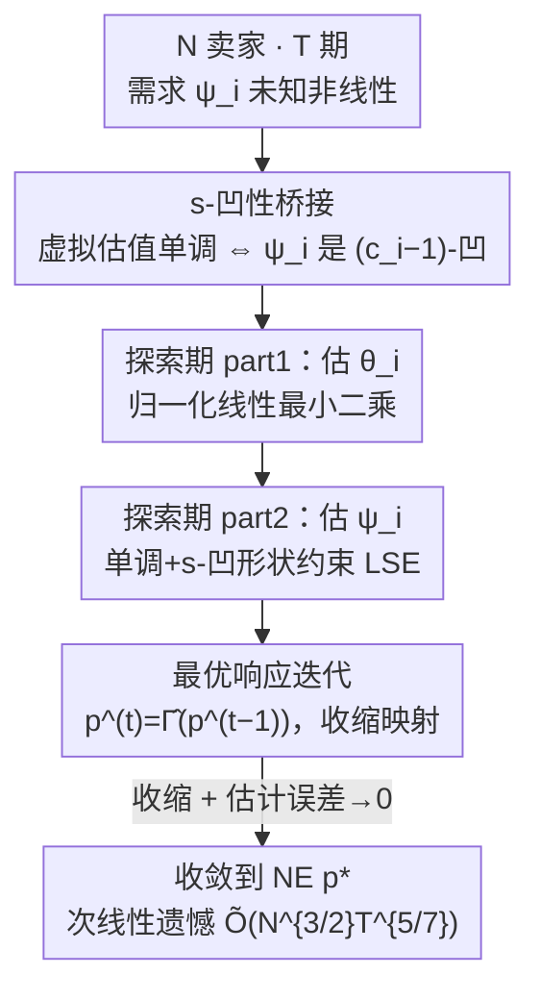

# Revenue Maximization under Sequential Price Competition via the Estimation of s-Concave Demand Functions

**会议**: ICLR 2026  
**OpenReview**: [https://openreview.net/forum?id=rrdXjkCWze](https://openreview.net/forum?id=rrdXjkCWze)  
**领域**: 学习理论 / 动态定价 / 在线学习  
**关键词**: 序贯价格竞争, 纳什均衡, 形状约束估计, s-凹性, 遗憾界

## 一句话总结
本文研究多卖家在 $T$ 期里反复同时定价的竞争问题，用「半参数最小二乘 + 形状约束」估计每个卖家未知的非线性需求函数，提出 SPE-BR 策略，证明价格以 $\tilde O(N^{3/4}T^{-1/7})$ 速率收敛到纳什均衡、个体遗憾为 $\tilde O(N^{3/2}T^{5/7})$，并把均衡存在性统一刻画到 s-凹性这一形状约束之下。

## 研究背景与动机

**领域现状**：竞争性动态定价是收益管理的核心问题——多家卖家各自调价、互相观察对手价格，并据此最大化自己的累计收益。理论上常用纳什均衡（NE）来描述「人人都已最优、谁也不想单方面改价」的稳态。已有的序贯定价学习算法能做到低遗憾并收敛到 NE，但几乎都建立在**线性需求**假设上（如 Li et al. 2024 在非对称线性需求下取得最优 $\sqrt T$ 遗憾），或者把非线性需求限制在某个**固定参数族**里（如 Goyal et al. 2023）。

**现有痛点**：真实市场里需求对价格的反应是非线性的，而且竞争把这种非线性进一步放大。线性模型与固定参数族都过于死板：要么拟合不了真实需求曲线，要么需要事先知道函数形式、调超参（如核方法要选带宽）。更棘手的是，竞争场景下卖家**无法做受控实验**——对手不会配合你把价格冻住让你单独试探价格敏感度。

**核心矛盾**：要在「需求函数未知且非线性」与「能证明收敛到 NE 并给出遗憾界」之间取得统一。NE 存在唯一性通常依赖卖家的「虚拟估值函数」单调，文献里往往通过假设需求的对数凹性来保证；而非参数地估计一个未知非线性函数又需要某种光滑/形状约束，否则估计误差无法控制。这两端用的假设各说各话，缺一座桥。

**本文目标**：(i) 在足够灵活的非线性需求模型下设计一个**免调参**的定价策略；(ii) 保证价格收敛到完全信息下才能达到的 NE；(iii) 给出关于动态基准的**次线性遗憾**。

**切入角度**：作者把每个卖家的均值需求建成**单调单指标模型** $\mathbb{E}[y_i\mid p] = \psi_i(\langle\theta_i, p\rangle)$，其中 $\theta_i$ 在自身坐标上是 $-\beta_i$、其余是对手交叉系数 $\gamma_i$，链接函数 $\psi_i$ 单调且 **s-凹**。关键观察是：保证 NE 存在所需的「虚拟估值单调」条件，恰好等价于 $\psi_i$ 满足某个 s-凹性——这把博弈论端的均衡条件与统计端的形状约束**用同一个 s 串了起来**。

**核心 idea**：用「s-凹形状约束」同时充当 NE 存在性的充分条件和非参数估计的正则化手段，从而得到一个完全数据驱动、无需调参的「先半参数估计、再最优响应迭代」算法。

## 方法详解

### 整体框架

设 $N$ 个卖家在 $T$ 期内反复定价。每期 $t$，所有卖家**同时**给出价格 $p^{(t)}=(p_1^{(t)},\dots,p_N^{(t)})$（价格公开），随后每个卖家 $i$ 只观察到自己的需求 $y_i^{(t)}=\psi_i(\langle\theta_i,p^{(t)}\rangle)+\varepsilon_i^{(t)}$（需求私有，不共享）。卖家不知道自己的 $(\theta_i,\psi_i)$，更不知道对手的需求模型，目标是最大化累计收益、等价地最小化相对「事后最优固定对手价格」基准的遗憾 $\mathrm{Reg}_i(T)$。

算法 **SPE-BR（Semi-Parametric Estimation then Best-Response）** 把整个时间轴切成两段：

- **探索期**（长度 $\tau\propto T^\xi$，$\xi\in(0,1)$，全体卖家共用）：随机采价、积累 $\{(p^{(t)},y_i^{(t)})\}$，分两小段先估 $\theta_i$ 再估 $\psi_i$，得到需求模型与收益函数的估计 $\widehat{\mathrm{rev}}_i$。
- **利用期**（剩余 $T-\tau$ 期）：每期卖家把上一期公开的对手价格代入估计出的收益函数，取**最优响应** $p_i^{(t)}=\arg\max_{p_i}\widehat{\mathrm{rev}}_i(p_i\mid p_{-i}^{(t-1)})$，等价于反复迭代估计的最优响应算子 $\hat\Gamma$；只要 $\hat\Gamma$ 是收缩映射、估计误差又随探索数据消失，价格序列就几何收敛到 NE $p^*$。

### 关键设计

**1. s-凹性桥接：把均衡存在性条件翻译成可估计的形状约束**

NE 是最优响应算子 $\Gamma$ 的不动点，其存在唯一性依赖卖家的虚拟估值函数 $\varphi_i(u)=u+\psi_i(u)/\psi_i'(u)$ 单调且导数有正下界，即 $\varphi_i'(u)\ge c_i>0$（这正是单卖家收益管理文献常用的对数凹性假设的推广）。问题是 $\varphi_i$ 含 $\psi_i$ 的导数比，直接对它做形状约束估计很别扭。本文的核心命题（Proposition 3.5）给出一个干净的等价：

$$\varphi_i'(u)\ge c_i \iff \psi_i \text{ 是 } (c_i-1)\text{-凹}.$$

这里 s-凹定义为 $\psi((1-\lambda)u_0+\lambda u_1)\ge M_s(\psi(u_0),\psi(u_1);\lambda)$，$s=1$ 退化为普通凹、$s=0$ 退化为对数凹，且函数类按 $\mathcal F_s\subset\mathcal F_0\subset\mathcal F_r$（$r<0<s$）嵌套。这个等价的价值在于：博弈论端要求的「虚拟估值单调」被翻译成了统计端可以直接施加的「$\psi_i$ 是 $(c_i-1)$-凹」形状约束——既保证 NE 存在，又给出了非参数估计的正则化方向，从而支撑一个**完全数据驱动、无需调参**的估计流程。

**2. 半参数两段式估计：先归一化线性 LSE 估方向，再形状约束 LSE 估链接**

单指标模型 $\psi_i(\langle\theta_i,p\rangle)$ 把未知量拆成参数方向 $\theta_i$（含价格敏感度 $\beta_i$、交叉系数 $\gamma_i$）与未知一维链接 $\psi_i$。本文用探索期数据分两小段分别估计。第一段 $\mathcal T_i^{(1)}$（占比 $\kappa_i$）估方向：$\hat\theta_i=\arg\min_\theta\sum_{t\in\mathcal T_i^{(1)}}(y_i^{(t)}-\langle\theta,p^{(t)}-\bar p\rangle)^2$，再归一化为 $\tilde\theta_i=\hat\theta_i/\|\hat\theta_i\|_2$（识别条件要求 $\|\theta_i\|_2=1$）；在探索价格服从椭圆对称分布时该线性估计是相合的。第二段 $\mathcal T_i^{(2)}$ 估链接：令 $w_i^{(t)}=\langle\tilde\theta_i,p^{(t)}\rangle$，解形状约束最小二乘

$$\hat\phi_{i}\in\arg\min_{\phi\,\text{单调+凹}}\sum_{t\in\mathcal T_i^{(2)}}\big(y_i^{(t)}-h_{s_i}(\phi(w_i^{(t)}))\big)^2,\qquad \hat\psi_i=h_{s_i}\circ\hat\phi_i,$$

其中 $s_i=c_i-1$，$h_{s_i}$ 是把凹函数搬回 s-凹函数的已知单调变换（如 $s=0$ 时 $h_0(x)=e^x$）。也就是说，s-凹的 $\psi_i$ 被参数化成「已知变换 $\circ$ 未知凹函数 $\phi$」，于是只需估一个单调且凹的 $\phi$——这是形状约束回归里成熟的对象，**不含任何带宽/平滑超参**，比核方法（如 Fan et al. 2024）天然免调参。

**3. 最优响应迭代 + 收缩性：把遗憾拆成「收缩项 + 估计误差」**

利用期里每个卖家解一阶条件得到最优响应 $\Gamma_i(p_{-i})=\Pi_{\mathcal P_i}\,g_i(\langle\gamma_i,p_{-i}\rangle)/\beta_i$，其中 $g_i(u)=u-\varphi_i^{-1}(u)$，$\Pi_{\mathcal P_i}$ 是价格区间上的投影。把全体卖家的最优响应拼成算子 $\Gamma$，本文证明在 Assumption 3.6 下它是收缩映射，收缩常数

$$L_\Gamma=\sup_{i}\|g_i'\|_\infty\,\|\gamma_i\|_1/\beta_i<1,$$

直观含义是「对手价格对我最优响应的影响，相对我对自身价格的敏感度足够小」——收缩保证 NE 唯一，也保证迭代几何收敛。把估计的 $\hat\Gamma$ 代入，遗憾被三角不等式拆成两部分：

$$\mathbb E\|p^{(T)}-p^*\|\lesssim \underbrace{L_\Gamma^{T-1}\,\mathbb E\|p^{(0)}-p^*\|}_{\text{收缩使初始偏差几何衰减}}+\underbrace{\mathbb E\|\Gamma-\hat\Gamma\|_\infty}_{\text{随探索数据增多而消失}}.$$

收缩项靠 $L_\Gamma<1$ 指数衰减，估计项靠收益函数的强凹性（Assumption 3.2，由 $\mu_i\triangleq 2\beta_i B_{\psi_i'}-\beta_i^2\bar p_i B_{\psi_i''}>0$ 保证）把 $(\theta_i,\psi_i)$ 的估计误差传导为算子误差。这个分解是整篇遗憾分析的骨架，也解释了为什么探索越久、估计越准，利用期收敛越快——遗憾在两段长度之间存在最优权衡。

**4. s-凹 LSE 的上确界范数浓度不等式：把统计误差精确兑换成遗憾速率**

设计 3 里的估计项需要的不是普通的 $L_2$ 收敛，而是**一致（上确界范数）**收敛——因为遗憾要对所有价格一致控制。已有结果（Balabdaoui et al. 2019）只给单调下的 $L_2$ 速率，不够用。本文的技术贡献是为一大类形状约束（涵盖 s-凹）的非参数 LSE 建立 sup-范数浓度不等式（Appendix H），并附带给出单指标参数分量 $\theta_i$ 的浓度不等式（此前只有依概率/分布收敛）。把这些一致速率代回设计 3 的分解，并对探索比例 $\xi$ 做优化——令上界中 $T^\xi+T^{1-2\xi/5}$ 两项指数相等得到唯一最优 $\xi^*=5/7$，最终给出

$$\mathrm{Reg}_i(T)=O\!\big(N^{3/2}T^{5/7}(\log T)^{2/5}\big),\qquad \mathbb E\|p^{(T)}-p^*\|_2=O\!\big(N^{3/4}T^{-1/7}(\log T)^{1/5}\big).$$

当 $N=1$（单卖家垄断）时该遗憾率与 Fan et al. (2024) 的核方法结果一致，但本文方法免带宽、完全数据驱动。一个有意思的副产物（Remark 5.8）是：当所有卖家都用这套同一类学习算法时，动态收敛到纯策略 NE、价格不会协同上涨，即**不产生算法合谋**。

### 损失函数 / 训练策略
两段估计各自是一个最小二乘问题：方向用普通线性 LSE（式中 $\bar p$ 为探索期均值，做中心化），链接用「单调+凹」约束下的 LSE。探索长度 $\tau\propto T^{\xi}$，最优 $\xi^*=5/7$；两小段比例 $\kappa_i$ 满足隐式方程 $4C_i\tau^{1/10}\kappa_i^{3/2}=5B_iN^{1/2}(1-\kappa_i)^{7/5}$，任取正常数 $C_i,B_i$ 都能落在 $(0,1)$，只影响常数不影响速率。s-凹约束的高效优化求解仍是开放问题，实验中用快速求解器近似。

## 实验关键数据

本文是理论工作，实验为合成数据的蒙特卡洛模拟，用来验证理论速率而非与他法刷点。设置：$N\in\{2,4,6\}$，价格域 $\mathcal P=[0,3]^N$，链接函数取 0-凹（对数凹），对每个 $N$ 分别考察收缩常数 $L_\Gamma\approx 0,\ 0.5,\ 1$ 三档，需求噪声 $\mathrm{Unif}[-0.05,0.05]$，$T\in\{100,400,800,1600,3200\}$，每设置独立重复 30 次取均值与 95% 置信区间。

### 主实验（理论速率 vs 既有工作）

| 设定 | 需求模型 | 个体遗憾率 | NE 收敛率 | 调参 |
|------|----------|------------|-----------|------|
| Li et al. 2024 | 线性（s=0 特例） | $\tilde O(\sqrt T)$ | 收敛 | 免 |
| Fan et al. 2024（$N=1$） | 核估计链接 | $\tilde O(T^{5/7})$ | — | 需选带宽 |
| **本文 SPE-BR** | 单调单指标 + s-凹 | $\tilde O(N^{3/2}T^{5/7})$ | $\tilde O(N^{3/4}T^{-1/7})$ | **免** |

### 模拟分析

| 实验配置 | 关键观测 | 说明 |
|----------|----------|------|
| 三档 $L_\Gamma\in\{0,0.5,1\}$ | 经验遗憾斜率 ≤ 理论上界斜率 | log–log 拟合斜率一致地比 $5/7$ 更小（更快） |
| 估计量 $\theta_i,\psi_i$ 收敛曲线 | 随 $T$ 增大稳定收敛 | 半参数两段式估计相合 |
| 不同 $s_i$ 误设（Appendix J.3） | 取 $s_i'\le s_i$ 且满足收缩条件时速率不变 | 印证 Remark 5.7，对 $s_i$ 误设稳健 |
| 卖家各自探索期（Appendix J.2） | 遗憾速率仍匹配甚至更优 | 放宽「共用探索期」假设后依然成立 |

### 关键发现
- 经验遗憾速率**一致快于**理论上界——理论给的是保守上界，实际收敛常更快。
- 即便把形状参数 $s_i$ 误设为偏小值（只要仍满足收缩条件 $\sup_i|1-1/(s_i'+1)|\,\|\gamma_i\|_1/\beta_i<1$），遗憾与 NE 收敛速率都保持不变，说明算法对 $s_i$ 不敏感、有实用容错。
- 所有卖家同算法时收敛到纯 NE、无价格协同上涨，从消费者角度看不产生算法合谋。

## 亮点与洞察
- **一个 $s$ 同时打通两端**：s-凹性既是 NE 存在的充分条件（虚拟估值单调），又是非参数估计的形状约束。把博弈论假设和统计正则化统一到同一参数 $s$，是全文最漂亮的「啊哈」点。
- **免调参**：因为约束直接来自模型结构（单调+凹），不像核方法要选带宽，整个流程完全数据驱动，工程上更鲁棒。
- **遗憾分解模板可复用**：「收缩项（几何衰减）+ 估计误差项（统计速率）」这套分解，凡是「学一个不动点算子再迭代」的在线学习问题都能借鉴——把博弈收敛拆成算子收缩和函数估计两块独立分析。
- **算法合谋的理论排除**：给出「同一类学习算法不会自发抬价」的正面结论，对监管/平台定价有现实意义。

## 局限与展望
- **共用探索期假设**：理论要求所有卖家用相同探索期长度，单卖家自行设定探索长度需要 $(\theta_i,\psi_i)$ 联合估计的一致收敛，目前仅有 $L_2$（单调下）或仅凹下的 $O_P$ 结果，缺非渐近 sup-范数浓度。
- **$s_i$ 假设已知**：实践中形状参数 $s_i$ 未必已知，如何在线估计 $s_i$ 仍待发展。
- **两段式割裂数据**：估 $\theta$ 用 $\kappa_i\tau$ 个点、估 $\psi$ 用剩余点，联合估计能用满 $\tau$ 个点、改善常数（但不改速率）。
- **仍受探索-利用权衡束缚**：理想是设计绕开经典 explore-then-commit、用全部历史持续学习的算法，但要避免「不完全学习」导致的参数估计退化与高遗憾。
- 实验仅为合成模拟，无真实市场数据验证。

## 相关工作与启发
- **vs Li et al. (2024)**：他们在非对称**线性**需求下取得最优 $\sqrt T$ 遗憾；本文把链接 $\psi_i$ 推广到单调 s-凹（线性是 $\psi_i(u)=u+\alpha_i$、$s=0$ 的特例），代价是遗憾从 $\sqrt T$ 升到 $T^{5/7}$，换来对非线性需求的适用性，且收缩条件、契约形式都是其结果的推广。
- **vs Fan et al. (2024)（单卖家）**：$N=1$ 时两者遗憾率同为 $T^{5/7}$，但他们用核方法估链接、要选带宽，本文用形状约束估计、完全免调参；本文还把场景从单卖家推广到 $N$ 卖家竞争。
- **vs Gallego et al. (2006) 等固定参数族非线性需求**：他们假设需求函数形式已知（如已知递增 $a_i$）；本文的 $\psi_i$ 与方向 $\theta_i$ 都未知，灵活性显著更高。
- **vs 形状约束估计文献（Balabdaoui et al. 2019; Han & Wellner 2016）**：本文把这些工具从「$L_2$ / 依概率收敛」推进到 s-凹 LSE 的 sup-范数非渐近浓度，并首次用于序贯定价竞争的遗憾分析。

## 评分
- 新颖性: ⭐⭐⭐⭐⭐ s-凹性统一均衡条件与形状约束，桥接思路新颖且自然
- 实验充分度: ⭐⭐⭐ 仅合成模拟验证速率，无真实数据与他法对比（理论论文可接受）
- 写作质量: ⭐⭐⭐⭐ 结构清晰、假设与定理层层递进，但符号密度高
- 价值: ⭐⭐⭐⭐ 为非线性竞争定价提供免调参且有遗憾保证的框架，并给出算法合谋的理论判据

<!-- RELATED:START -->

## 相关论文

- [\[ICLR 2026\] Revisiting Active Sequential Prediction-Powered Mean Estimation](revisiting_active_sequential_prediction-powered_mean_estimation.md)
- [\[ICML 2026\] Revenue Guarantees of No-Swap-Regret Dynamics in First Price Auctions](../../ICML2026/learning_theory/revenue_guarantees_of_no-swap-regret_dynamics_in_first_price_auctions.md)
- [\[ICLR 2026\] The Price of Robustness: Stable Classifiers Need Overparameterization](the_price_of_robustness_stable_classifiers_need_overparameterization.md)
- [\[ICLR 2026\] Prediction with Expert Advice under Local Differential Privacy](prediction_with_expert_advice_under_local_differential_privacy.md)
- [\[ICLR 2026\] Poisson Midpoint Method for Log-Concave Sampling: Beyond the Strong Error Lower Bounds](poisson_midpoint_method_for_log_concave_sampling_beyond_the_strong_error_lower_b.md)

<!-- RELATED:END -->
