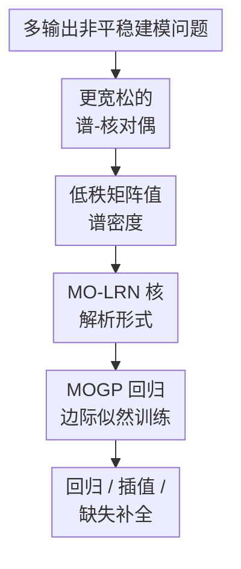

# Revisiting Nonstationary Kernel Design for Multi-Output Gaussian Processes

**会议**: ICLR2026  
**OpenReview**: [https://openreview.net/forum?id=vFfujX5Ygn](https://openreview.net/forum?id=vFfujX5Ygn)  
**代码**: https://github.com/KrnteXu/MO-LRN  
**领域**: Gaussian processes / probabilistic ML  
**关键词**: 多输出高斯过程、非平稳核函数、谱-核对偶、低秩谱密度、不确定性建模  

## 一句话总结
本文从谱域重新审视多输出高斯过程的非平稳核设计，提出更一般的多输出谱-核对偶，并用低秩矩阵值谱密度构造 MO-LRN 核，在保持线性参数规模的同时显著提升回归、插值和缺失补全效果。

## 研究背景与动机
**领域现状**：高斯过程（Gaussian Process, GP）用核函数把先验假设写进模型，多输出高斯过程（Multi-output Gaussian Process, MOGP）进一步把多个相关输出联合建模。相比把每个输出维度当作独立 GP，MOGP 的矩阵值核 $K(x_1,x_2)=[k_{ij}(x_1,x_2)]$ 可以同时描述每个输出自己的变化模式和不同输出之间的协方差关系，因此常被用于传感器序列、医学监测、交通预测和不确定性量化等任务。

**现有痛点**：很多经典 MOGP 核仍然偏向平稳假设，也就是协方差主要由 $x_1-x_2$ 决定。这在真实数据里经常不够用：同一个输出在不同时间段可能有不同周期、不同噪声强度，不同输出之间的相关性也可能随输入位置改变。已有非平稳多输出核中，MOHSM 是代表性方法，它在谱域设计矩阵值谱密度，再通过 Kakihara 定理映射回核函数。但作者指出，MOHSM 的谱密度形式被现有对偶关系限制住了，最终表现为参数很多，却仍然只能表达一类较窄的局部平稳结构。

**核心矛盾**：从谱域看，理想的非平稳 MOGP 核需要一个足够灵活的矩阵值双变量谱密度 $P(\\omega_1,\\omega_2)$。如果直接给每个输出对 $(i,j)$ 单独建模，表达力强，但参数规模会随输出数 $V$ 呈 $O(V^2)$ 增长；如果像 LMC 或 MOHSM 那样用更强结构假设压缩参数，训练更可行，却会牺牲谱密度的形状自由度。本文要解决的正是“谱域表达力”和“多输出参数规模”之间的冲突。

**本文目标**：作者把问题拆成两步。第一步是重新证明一个更宽松的多输出谱-核对偶，让任意满足 Hermitian 对称条件的矩阵值双变量谱密度都能对应到合法的非平稳 MOGP 核。第二步是在这个更大的设计空间里找到一个可训练的参数化方式，避免每个输出对都单独放一套高斯混合，从而把参数增长从 $O(DV^2Q)$ 降到 $O(DVQ)$。

**切入角度**：单输出非平稳核 NG-SM 的启发是：与其先在核空间里拼装局部窗口，不如先在谱域放一个足够密的双变量高斯混合，再由对偶关系推出核函数。本文把这个想法推广到多输出，但没有简单照搬“每个输出对一个谱密度”的暴力方案，而是把输出维度看成低维谱因子空间中的 latent embedding，用内积决定不同输出之间的谱交互。

**核心 idea**：用一个新的多输出谱-核对偶打开更大的非平稳核设计空间，再用低秩谱因子 $P_{ij}(\\omega_1,\\omega_2)=r_i^H r_j$ 替代逐输出对参数化，得到既能建模非平稳又能线性扩展的 MO-LRN 核。

## 方法详解

### 整体框架
这篇论文的方法不是一个深度网络 pipeline，而是一套“从谱域设计核函数”的理论-参数化流程。整体上，作者先分析 MOHSM 为什么受限，再提出 Advanced Kakihara Theorem 作为新的谱-核对偶，随后在谱域构造低秩矩阵值谱密度，并把它解析映射成可用于 MOGP 回归的 MO-LRN 核。训练阶段与普通 GP 一样，通过最大化边际对数似然学习核超参数。

### 关键设计
**1. 更宽松的谱-核对偶：把非平稳多输出核的设计空间从 MOHSM 的结构假设里释放出来**

MOHSM 的问题并不是“没有做非平稳”，而是它依赖的对偶关系把谱密度写成了较强约束的形式。论文先回到单输出 NG-SM 的 Universal Bochner Theorem：单输出非平稳核可以由双变量谱密度 $p(\\omega_1,\\omega_2)$ 通过包含 $\\omega_1$、$\\omega_2$ 的积分表示生成。NG-SM 直接用双变量高斯混合逼近这个谱密度，因此理论上能逼近很广的连续核。

多输出情况下，作者提出 Advanced Kakihara Theorem：一族矩阵值核 $\{k_{ij}(x_1,x_2)\}_{i,j=1}^V$ 合法，当且仅当它可以写成一个矩阵值 Lebesgue-Stieltjes bimeasure 的积分形式。直观上，每个核元素 $k_{ij}$ 都由对应的谱条目 $P_{ij}(\\omega_1,\\omega_2)$ 决定，只要矩阵值谱密度满足 Hermitian 对称条件 $P_{ij}(\\omega_1,\\omega_2)=P_{ji}(\\omega_1,\\omega_2)$。这一步的意义很直接：多输出非平稳核不必被固定成“平稳核乘局部窗口”的形式，可以从更一般的矩阵值双变量谱密度出发。

如果照着这个定理做最自由的设计，就可以给每个 $P_{ij}$ 放一个复系数双变量高斯混合，并对角项约束为实非负系数。这样表达力最强，但需要为 $V^2$ 个输出对维护谱混合，参数量约为 $O(DV^2Q)$。所以新对偶本身只是打开设计空间，真正可用的核还需要下一步的低秩化。

**2. 低秩矩阵值谱密度：用输出谱嵌入替代逐输出对参数化**

MO-LRN 的核心压缩来自 $P_{ij}(\\omega_1,\\omega_2)=r_i^H r_j$。这里 $r_i$ 是输出 $i$ 的谱域 latent vector，包含 $Q$ 个分量；两个输出之间的交互不是单独存一套参数，而是由它们各自谱嵌入的内积产生。这个结构类似矩阵分解或 latent factor model：输出自己的谱特征存在 $r_i$ 里，跨输出相关性由 $r_i$ 和 $r_j$ 在潜空间中的相对位置决定。

每个分量 $r_i^{(q)}$ 本身不是一个普通标量，而是带权重的双变量高斯密度，参数包括权重 $w_i^{(q)}$、两个频率均值 $\\mu_{i1}^{(q)},\\mu_{i2}^{(q)}$、两个对角协方差块 $\\Sigma_{i1}^{(q)},\\Sigma_{i2}^{(q)}$，以及控制 $\\omega_1$ 与 $\\omega_2$ 相关性的 $\\rho_i^{(q)}$。当两个输出的对应分量相乘时，仍然可以化成一个新的双变量高斯混合项：

$$
P_{ij}(\\omega_1,\\omega_2)=r_i^H r_j=\\sum_{q=1}^{Q} z_{ij}^{(q)}\\mathcal{N}\\left(\\begin{bmatrix}\\omega_1\\\\\\omega_2\\end{bmatrix}; m_{ij}^{(q)}, S_{ij}^{(q)}\\right).
$$

这就同时满足了三件事：第一，$P_{ij}$ 仍然是双变量高斯混合，可以接上前面的谱-核对偶；第二，Hermitian 对称由内积结构自然保证；第三，参数按输出数 $V$ 而不是输出对数 $V^2$ 增长。作者也很诚实地指出，低秩化后只有对角谱项的 denseness 有保证，非对角项不再是完全自由的；但相较 MOHSM，至少对每个输出自身的非平稳谱形状已经更灵活，跨输出项也由共享因子给出足够的表达能力。

**3. 解析 MO-LRN 核：把谱域的低秩高斯混合变成可训练的实值协方差函数**

为了得到实值核，作者对谱密度做对称化：$P_{ij}(\\omega_1,\\omega_2)=\\frac{1}{2}(P_{ij}(\\omega_1,\\omega_2)+P_{ij}(-\\omega_1,-\\omega_2))$。然后把每个高斯混合项带入新的对偶积分，得到 MO-LRN 核的显式形式。公式看起来较长，本质上是四类余弦-指数项的加权和：两项同时依赖 $x_1$ 与 $x_2$ 的绝对位置，用来表达非平稳变化；另外两项依赖 $x_1-x_2$，保留对平稳模式的刻画能力。

这一点很关键，因为很多非平稳核容易在“只关注局部变化”时丢掉全局平稳结构。MO-LRN 的核表达式同时包含绝对位置项和相对距离项，所以既可以拟合不同区间的输入依赖变化，也不会失去对周期、平滑性等传统模式的表达。与 MOHSM 相比，MO-LRN 不是先写一个局部平稳核再用多个窗口拼接，而是让非平稳性直接来自双变量谱密度的形状，因此不需要额外的 shift-point mixture 来补表达力。

**4. GP 边际似然训练：把新核嵌入标准 MOGP 回归流程**

得到 $K(X,X)$ 后，训练流程并没有引入额外黑盒模块。对输入 $X=[x_1,\\ldots,x_N]^\\top$ 和多输出观测 $y=\\mathrm{vec}(F)$，模型假设

$$
y=\\mathrm{vec}(F)+\\epsilon,\\quad \\mathrm{vec}(F)\\sim\\mathcal{N}(0,K(X,X)),\\quad \\epsilon\\sim\\mathcal{N}(0,\\Sigma_n),
$$

其中噪声协方差采用 $\\Sigma_n=I_N\\otimes\\mathrm{diag}(\\sigma_1^2,\\ldots,\\sigma_V^2)$，允许每个输出有自己的观测噪声。超参数通过最大化边际对数似然学习：

$$
\\log p(y|\\theta)=-\\frac{1}{2}y^\\top(K+\\Sigma_n)^{-1}y-\\frac{1}{2}\\log|K+\\Sigma_n|-\\frac{N}{2}\\log 2\\pi.
$$

这让 MO-LRN 的工程使用方式比较干净：它不是单独发明一个新的推断框架，而是替换 MOGP 里的核函数。实验中作者用 Adam 优化核超参数，合成数据设置 $Q=2$，ETT 和空气质量数据设置 $Q=4$。附录的敏感性分析显示，增大 $Q$ 会略微降低 NMAE，但运行时间快速上升，$Q=4$ 是一个比较合理的精度-效率折中。

### 一个完整示例
可以把 ETT 数据集看成一个典型使用场景。输入是一周内的时间戳，输出是 7 个变量：油温 OT 以及 HUFL、HULL、MUFL、MULL、LUFL、LULL 六个负载相关特征。普通独立 GP 会给每个变量各拟合一个核，完全不共享跨变量信息；平稳 MOGP 核会共享信息，但默认时间上各处的协方差规律相同；MOHSM 可以引入局部非平稳性，却需要选择 shift points 和多层混合，参数较多且优化困难。

MO-LRN 的处理方式是：为每个输出变量学习一个谱嵌入 $r_i$，比如 OT 和某个负载特征如果在某些频率成分上相似，它们的内积会产生较强的跨输出谱协方差；如果某些变量只在局部时间段同步变化，双变量谱密度中的绝对位置相关项会把这种非平稳相关性反映到核矩阵里。训练完成后，模型可以在同一个 $K(X,X)$ 中同时利用“该变量自己的时间模式”和“其他变量提供的相关线索”，因此在 ETT 的整体 MAE、NMAE、RMSE 和 NLPD 上都优于基线。

### 损失函数 / 训练策略
论文采用标准 MOGP 的负边际对数似然作为优化目标，等价于最小化

$$
\\mathcal{L}(\\theta)=\\frac{1}{2}y^\\top(K_\\theta+\\Sigma_n)^{-1}y+\\frac{1}{2}\\log|K_\\theta+\\Sigma_n|+\\frac{N}{2}\\log 2\\pi.
$$

实验中 MO-LRN 的超参数包括混合数 $Q$、各输出谱因子的权重、均值、尺度、相关系数和输出噪声。合成数据用 $Q=2$、Adam 学习率 0.10、训练 500 轮；ETT 用 $Q=4$、学习率 0.02、训练 4000 轮；空气质量数据用 $Q=4$、学习率 0.01、训练 4000 轮。相比 MOHSM，MO-LRN 不需要额外的 shift-point 数 $P$，这也是它在合成实验中参数量和训练时间更低的重要原因。

## 实验关键数据

### 主实验
论文覆盖三类实验：合成 MOGP 回归、ETT 真实多变量回归、空气质量数据上的插值与连续缺失补全。下表摘取 ETT 的 Overall 指标，数值为 5 次运行均值和标准差，越低越好。

| 模型 | 是否非平稳 | Overall MAE | Overall NMAE | Overall RMSE | Overall NLPD |
|------|------------|-------------|--------------|--------------|--------------|
| CONV | 否 | 0.390 ± 0.073 | 0.409 ± 0.058 | 0.453 ± 0.020 | 0.661 ± 0.069 |
| LMC-SM | 否 | 0.364 ± 0.014 | 0.422 ± 0.016 | 0.453 ± 0.045 | 0.573 ± 0.031 |
| MOHSM | 是 | 0.325 ± 0.001 | 0.375 ± 0.001 | 0.440 ± 0.002 | 0.792 ± 0.018 |
| MOSM | 否 | 0.314 ± 0.014 | 0.365 ± 0.016 | 0.431 ± 0.017 | 0.533 ± 0.043 |
| LMC-NGSM | 是 | 0.256 ± 0.011 | 0.296 ± 0.013 | 0.350 ± 0.013 | 0.382 ± 0.133 |
| MO-LRN | 是 | **0.201 ± 0.006** | **0.232 ± 0.007** | **0.295 ± 0.008** | **0.166 ± 0.031** |

合成实验的结果也很直观：MO-LRN 只用 $Q=2$ 时，MAE 为 0.0959、训练时间 21.3s、参数量 26；MOHSM 在 $P=2,Q=2$ 时 MAE 为 0.4976、训练时间 53.1s、参数量 54，即使扩到 $P=4,Q=4$ 并加入初始化，MAE 也只有 0.3968、训练时间 101.6s、参数量 210。这个对比支撑了作者的核心论点：MOHSM 不是简单“参数不够”，而是谱密度结构本身限制了可表达的非平稳模式。

### 消融实验
| 分析项 | 结果 | 说明 |
|--------|------|------|
| 参数复杂度对比 | MO-LRN 为 $O(DQV)$，MOHSM 为 $O(PDQV)$，完全自由谱密度为 $O(DV^2Q)$ | 低秩谱因子避免逐输出对建模，且不需要 MOHSM 的 shift-point 层 |
| 合成数据效率 | MO-LRN: MAE 0.0959 / 21.3s / 26 参数；最佳 MOHSM 配置仍为 MAE 0.3968 / 101.6s / 210 参数 | 说明低秩谱设计不只是省参数，也更容易优化 |
| 谱混合数 $Q$ 敏感性 | $Q$ 增大会带来轻微 NMAE 改善，但运行时间明显上升；$Q=4$ 后收益边际变小 | 论文据此在 ETT 和空气质量实验中采用 $Q=4$ |
| 空气质量 Overall MAE | 插值 0.178 ± 0.008，补全 0.351 ± 0.032 | MO-LRN 在总体插值和连续缺失补全上最低，但个别变量并非全部第一 |

### 关键发现
- MO-LRN 在 ETT 上同时降低点预测误差和概率预测误差，说明它不仅拟合均值更好，也给出了更合理的不确定性分布；NLPD 从 LMC-NGSM 的 0.382 降到 0.166 是很有说服力的信号。
- 非平稳性确实是这些数据的重要因素。LMC-NGSM 这个相对简单的非平稳 MOGP baseline 已经普遍强于平稳核，说明优势不是只来自多输出相关性，而是来自输入依赖的协方差变化。
- MOHSM 理论上看似比 LMC-NGSM 更专门面向多输出非平稳，但实际结果不稳定，作者认为原因是它的参数空间冗余、优化困难，并且谱密度受结构限制，无法真正发挥更多参数的优势。
- 空气质量任务中，MO-LRN 的总体插值 MAE 为 0.178、总体补全 MAE 为 0.351，均为表中最低。不过在 PM2.5、PM10 等单变量上，LMC-SM 或 LMC-NGSM 有时更好，说明 MO-LRN 的优势更像是跨变量总体建模能力，而不是每个输出无条件全胜。

## 亮点与洞察
- 最大亮点是把“核函数设计”转回谱域看。论文没有直接在核空间再堆一个局部窗口，而是指出限制来自谱-核对偶本身，然后先扩大谱密度设计空间，再考虑参数效率。这种问题定位比单纯提出一个新公式更有价值。
- 低秩谱密度是一个很自然但有效的折中。完全自由的矩阵值谱密度表达力强但不可扩展；低秩内积让每个输出只维护自己的谱因子，跨输出关系由内积生成，既保留了概率模型的结构清晰性，也贴合多任务/多输出建模里的共享因子思想。
- MO-LRN 的非平稳性不是通过离散窗口拼起来的，而是由 $P(\\omega_1,\\omega_2)$ 的双变量形状直接决定。这有助于避免 MOHSM 那种“shift points 越多参数越多、但优化越难”的局面。
- 对 GP / kernel methods 方向来说，这篇论文提供了一个可迁移的套路：先检查现有核的谱域约束，再用可解析的低秩、稀疏或结构化谱参数化来换取表达力与可训练性的平衡。这个思路也可能用于异质输出 GP、空间-时间核、多保真建模和贝叶斯传感器融合。

## 局限与展望
- 低秩设计牺牲了一部分完全自由度。论文明确说非对角谱项的 denseness 没有保证，因此 MO-LRN 不是“通用多输出非平稳核”的最终答案，而是在可训练性和表达力之间做了结构化折中。
- 复杂度分析主要关注参数规模，但 GP 推断本身仍然受核矩阵求逆/分解限制。当前实验数据规模相对可控，若要用于更长的多变量时间序列或高输出数场景，还需要结合稀疏 GP、诱导点或结构化线性代数。
- 实验集中在时间作为一维输入的多输出回归、插值和补全。理论上 MO-LRN 支持 $D$ 维输入，但高维输入下双变量高斯谱参数是否稳定、是否容易过拟合，还需要更多验证。
- 空气质量实验显示总体效果最好，但单变量上并不总是第一。未来可以分析哪些输出对真正受益于低秩谱共享，哪些输出可能被共享结构拖累，并引入自适应 rank 或输出分组机制。
- 训练仍依赖边际似然的非凸优化。虽然 MO-LRN 比 MOHSM 更容易训练，但谱混合模型常见的初始化敏感性、局部最优和尺度不可辨识问题并没有完全消失。

## 相关工作与启发
- **vs NG-SM**: NG-SM 是单输出非平稳核，通过双变量高斯混合谱密度获得很强表达力。本文继承了“先设计谱密度、再映射回核”的思路，但把对象扩展到矩阵值谱密度，并解决多输出下参数二次增长的问题。
- **vs MOHSM**: MOHSM 也是多输出非平稳谱混合核，但依赖较受限的 Kakihara 对偶和 shift-point 两层混合。本文认为它“参数多但谱形状不够自由”，所以用新对偶 + 低秩谱密度替代局部窗口拼接。
- **vs LMC-NGSM**: LMC-NGSM 把单输出 NG-SM 作为 LMC 的 base kernel，能捕捉非平稳模式，但跨输出关系仍受 LMC 结构限制。MO-LRN 直接设计矩阵值谱密度，因此跨输出相关性和非平稳性在同一个谱对象里联合建模。
- **vs MOSM / CONV / LMC-SM**: 这些方法更擅长平稳或较简单的跨输出相关结构。它们在变化规律比较稳定的数据上仍有价值，但面对输入依赖的频率、幅度和输出相关性变化时，表达力明显不足。

## 评分
- 新颖性: ⭐⭐⭐⭐⭐ 从多输出谱-核对偶出发重新设计非平稳核，理论定位和参数化都比较有新意。
- 实验充分度: ⭐⭐⭐⭐ 覆盖合成、ETT、空气质量和附录多个真实数据集，但高维输入和更大规模 GP 推断场景还不够充分。
- 写作质量: ⭐⭐⭐⭐ 理论动机清楚，MOHSM 的问题分析有说服力；但核公式和附录推导较重，读者需要一定 GP 与谱表示背景。
- 价值: ⭐⭐⭐⭐⭐ 对概率机器学习和 kernel methods 很有参考价值，尤其适合需要多输出不确定性建模且存在非平稳相关性的应用。

<!-- RELATED:START -->

## 相关论文

- [\[ICLR 2026\] Diffusion Bridge Variational Inference for Deep Gaussian Processes](diffusion_bridge_variational_inference_for_deep_gaussian_processes.md)
- [\[ICLR 2026\] Robust Generalized Schrödinger Bridge via Sparse Variational Gaussian Processes](robust_generalized_schrodinger_bridge_via_sparse_variational_gaussian_processes.md)
- [\[ICLR 2026\] A Unification of Discrete, Gaussian, and Simplicial Diffusion](a_unification_of_discrete_gaussian_and_simplicial_diffusion.md)
- [\[ICLR 2026\] Subspace Kernel Learning on Tensor Sequences](subspace_kernel_learning_on_tensor_sequences.md)
- [\[ICLR 2026\] Transformers as Unsupervised Learning Algorithms: A study on Gaussian Mixtures](transformers_as_unsupervised_learning_algorithms_a_study_on_gaussian_mixtures.md)

<!-- RELATED:END -->
