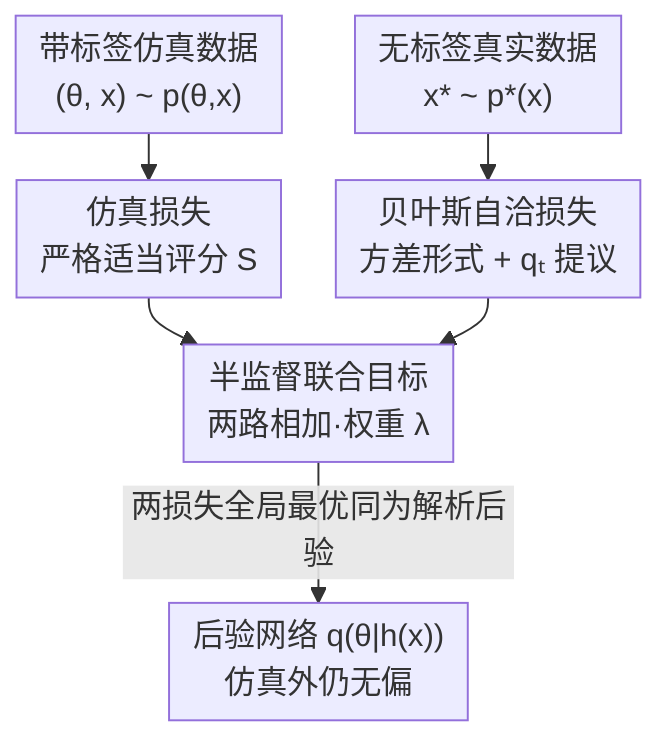

# Robust Amortized Bayesian Inference with Self-Consistency Losses on Unlabeled Data

**会议**: ICLR 2026  
**OpenReview**: [https://openreview.net/forum?id=E1dANKwo4I](https://openreview.net/forum?id=E1dANKwo4I)  
**代码**: https://github.com/bayesflow-org/self-consistency-real  
**领域**: 学习理论 / 摊销贝叶斯推断 / 仿真推断  
**关键词**: 摊销贝叶斯推断, 自洽损失, 半监督, 模型失配鲁棒性, 严格适当损失

## 一句话总结
针对摊销贝叶斯推断（ABI）在「训练仿真数据覆盖不到的真实观测」上会严重崩溃的问题，本文把贝叶斯自洽性（Bayes 规则的边际似然恒等式）改写成一个不需要真实参数标签的严格适当损失，从而能在**无标注真实数据**上半监督训练，仅用 4 个无标注样本就能让后验在远离训练分布处仍然准确无偏。

## 研究背景与动机
**领域现状**：摊销贝叶斯推断（Amortized Bayesian Inference, ABI）用一个生成式神经网络（通常是归一化流）一次性学好「观测 $x \to$ 后验 $p(\theta\mid x)$」的映射。训练时从概率模型 $p(\theta, x)$ 采样出大量 $(\theta, x)$ 配对（即「带标签」的仿真数据），训练好后对任意新观测都能近乎实时地出后验，比 MCMC/HMC 快几个数量级，特别适合大数据、似然不可解、需要重复拟合上千个数据集的场景。

**现有痛点**：ABI 的命门是它彻底依赖训练时见过的仿真分布。一旦真实观测 $x^*$ 落在仿真数据 $p(\theta,x)$ 覆盖不到的区域（模型失配、分布漂移），后验近似 $q(\theta\mid h(x^*))$ 可以**任意偏离**真实解析后验。论文用一个 10 维正态均值玩具问题展示：标准 NPE 在 $\mu_{\text{obs}}\ge 2$ 时后验直接塌缩到零方差，给出过度自信的错误答案。

**核心矛盾**：神经后验估计虽然在**无穷仿真**下是渐近完美的，但它的**前渐近**（finite-sample）行为极差——靠「多采点仿真」根本补不回来，因为问题出在仿真器本身就没覆盖真实数据所在的区域。而真实数据虽然好拿，却**没有对应的真值参数 $\theta^*$**，传统监督式 ABI 用不上。

**本文目标**：让 ABI 能利用「无标签的真实观测」来纠正在仿真覆盖外的后验，且不牺牲推断速度、不改变推断目标、不需要真值参数。

**切入角度**：贝叶斯规则里藏着一个被采样方法忽略的对称性——边际似然 $p(x)$ 与参数 $\theta$ 无关。对任意一组 $\theta^{(1)},\dots,\theta^{(L)}$，
$$p(x) = \frac{p(x\mid\theta^{(1)})\,p(\theta^{(1)})}{p(\theta^{(1)}\mid x)} = \cdots = \frac{p(x\mid\theta^{(L)})\,p(\theta^{(L)})}{p(\theta^{(L)}\mid x)}.$$
这个等式**只要有似然就能算，不需要真值 $\theta^*$**。如果后验近似 $q$ 是准的，这个比值就该是常数；它的波动正好是近似误差的代理。

**核心 idea**：把「边际似然应当跨 $\theta$ 恒定」这个自洽性条件改写成一个对**无标注真实数据**也成立的严格适当损失，和标准仿真损失加在一起做半监督训练——用真实数据的密度信息把后验拉回解析后验，且两个损失的全局最优都是同一个解析后验，因此「不存在权衡」。

## 方法详解

### 整体框架
方法把 ABI 的训练目标拆成两路、共享同一个后验网络 $q(\theta\mid h(x))$（可选带摘要网络 $h$ 提取充分统计量）。**监督路**用从仿真器采的带标签数据 $\{(\theta_n, x_n)\}$ 喂标准的仿真损失（如归一化流的极大似然损失），负责把网络在仿真覆盖到的区域训准；**无监督路**用任意来源的无标签真实观测 $\{x_m^*\}$ 喂贝叶斯自洽损失，强制 Bayes 规则在真实数据分布上成立，把后验在仿真覆盖外的区域拉回解析后验。两路损失相加，权重 $\lambda$ 调节：

$$(q^*, h^*) = \arg\min_{q,h}\; \underbrace{\mathbb{E}_{(\theta,x)\sim p(\theta,x)}\big[S(q(\theta\mid h(x)), \theta)\big]}_{\text{仿真损失（监督）}} + \lambda\cdot \underbrace{\mathbb{E}_{x^*\sim p^*(x)}\Big[C\big(\tfrac{p(x^*\mid\theta)\,p(\theta)}{q(\theta\mid h(x^*))}\big)\Big]}_{\text{自洽损失（无监督）}}.$$

其中 $S$ 是严格适当评分（strictly proper score），$C$ 是作用在贝叶斯自洽比值上的自洽评分。关键在于：自洽损失项里完全没有出现真值 $\theta$，只用到了无标签观测 $x^*$、先验 $p(\theta)$ 和（已知或估计的）似然 $p(x^*\mid\theta)$。

### 关键设计

**1. 贝叶斯自洽损失：把 Bayes 规则的对称性变成可反传的训练信号**

痛点直白讲：真实数据没有真值标签，标准监督损失用不上，于是仿真覆盖外的后验没人管。本设计利用「边际似然 $p(x)$ 与 $\theta$ 无关」这个恒等式（见上文动机），构造一个不需要 $\theta^*$ 的损失。具体取 $C$ 为**对数自洽比值的方差**：
$$C\Big(\frac{p(x^*\mid\theta)\,p(\theta)}{q(\theta\mid h(x^*))}\Big) = \mathrm{Var}_{\theta\sim p_C(\theta)}\big[\log p(x^*\mid\theta) + \log p(\theta) - \log q(\theta\mid h(x^*))\big].$$
后验若准确，括号内的量对所有 $\theta$ 都等于 $\log p(x^*)$ 这一常数，方差为零；后验若偏，方差变大。理论依据来自 Köthe (2023)：最小化这个比值的方差等价于最小化真实后验与近似后验之间的 KL 散度，因此把方差压到零就把后验逼到了解析后验。这条损失之所以能用在 ABI 而非 MCMC，是因为归一化流这类神经密度估计器能**高效求出 $q(\theta\mid x)$ 的闭式密度值**，而采样方法没有这个密度。

**2. 提议分布选当前后验：让有限采样的自洽损失聚焦在高密度区**

痛点：方差损失里的提议分布 $p_C(\theta)$ 理论上可以是参数空间上任意分布，但实际只能用有限的 $\theta$ 采样去估方差，采得不好就估不准。自洽比值的最大贡献集中在近似后验的高密度区，所以本文在所有实验里把 $p_C(\theta)$ 取为**训练第 $t$ 步的当前近似后验 $q_t(\theta\mid h(x^*))$**（而非先验 $p(\theta)$），让采样点自动落在最该校正的区域，从而在小样本下也能给出有效的梯度信号。

**3. 严格适当性保证「无权衡」：两个损失指向同一个解析后验**

痛点：直觉上「往监督损失里硬加一个真实数据正则项」会让网络在「拟合仿真」和「拟合真实」之间妥协，偏离原始统计模型的后验。本文用三条命题证明并非如此。命题 1：若 $C$ 当且仅当其函数自变量在后验支撑上几乎处处恒定时取全局最小，则作用在自洽比值上的 $C$ 是**严格适当损失**——当且仅当 $q(\theta\mid x)=p(\theta\mid x)$ 几乎处处成立时取最小；命题 2 验证方差损失 (4) 满足该条件（只要 $p_C(\theta)$ 的支撑覆盖后验支撑）。命题 3 是关键推论：严格适当损失之和仍严格适当，且这个结论**对任意 $p^*(x)$ 都成立**——无论模型是否失配、$p^*(x)$ 与 $p(x)$ 是否相等，半监督损失 (2) 的全局最优始终是同一个解析后验。

这条性质把本文和所有竞品区分开：现有鲁棒 ABI 方法（对抗正则、post-hoc 修正、广义贝叶斯、域适应 NPE-DANN/NPE-MMD）本质上都在**显式或隐式地改动统计模型或目标分布**（落到 Elsemüller 等人 taxonomy 里的 Target 2），因而引入了准确性与鲁棒性的权衡。而自洽损失**不是正则项**——它直接瞄准指定统计模型的解析后验（Target 1），所以加上它不会损失准确性，也不会损失摊销带来的推断速度。

**4. 推广到似然估计与联合学习：无解析似然时也能用**

痛点：上面的自洽损失需要已知似然 $p(x\mid\theta)$，但很多实际模型似然不可解。命题 4 把自洽性对称地推广到**估计似然** $q(x\mid\theta)$ 的情形并同样严格适当。但论文诚实地指出一个退化陷阱：若后验和似然**同时未知**，严格适当性不再成立——任何满足 $q(\theta\mid x)\propto q(x\mid\theta)p(\theta)$ 的近似对（例如 $q(\theta\mid x)=p(\theta)$、$q(x\mid\theta)\propto 1$）都能让自洽损失最小，却可能离真值任意远。解决办法是把自洽损失与另一个损失（如极大似然损失）耦合，联合学习两个网络（论文称 NPLE 设定）。即便如此，实验显示在似然也未知时自洽损失仍带来明显鲁棒性提升，只是后验（尤其是标准差）的偏差会比已知似然时更大。

### 损失函数 / 训练策略
最终用有限的 $N$ 个仿真样本和 $M$ 个真实样本近似期望：
$$(q^*, h^*) = \arg\min_{q,h}\; \frac{1}{N}\sum_{n=1}^{N} S(q(\theta_n\mid h(x_n)), \theta_n) + \lambda\cdot\frac{1}{M}\sum_{m=1}^{M} C\Big(\frac{p(x_m^*\mid\theta_m)\,p(\theta_m)}{q(\theta_m\mid h(x_m^*))}\Big).$$
其中 $\lambda$ 是自洽权重（细节见原文附录 B）。仿真损失对归一化流就是极大似然损失，对流匹配则是向量场损失。由于方差自洽损失需要在训练中频繁做**快速密度求值**，自由形式（free-form）的流匹配、score-based 扩散因需数值积分而不适用——这也是论文承认的主要局限。

## 实验关键数据

四个案例研究覆盖玩具问题、真实时序、高维 ODE 和图像，统一对照「标准 NPE（仅仿真损失）」与「NPE+SC（加自洽损失）」，参考解用解析后验或 Stan/MCMC。

### 主实验

欧洲航空客流 AR(1) 模型（15 国 × 5 参数，仿真预算仅 $N=1024$），自洽损失在 $M$ 个国家的真实数据上评估，相对 Stan 报告后验均值/标准差绝对偏差与 Wasserstein 距离（节选 Table 1 的均值偏差，跨 15 国均值 ± SE）：

| 参数 | NPE | NPE+SC (M=4) | NPE+SC (M=8) | NPE+SC (M=15) |
|------|-----|-----|-----|-----|
| $\alpha$ 均值偏差 | 0.079 ± 0.019 | 0.003 ± 0.009 | 0.014 ± 0.013 | **0.002 ± 0.001** |
| $\beta$ 均值偏差 | 0.153 ± 0.024 | 0.012 ± 0.026 | 0.031 ± 0.023 | **0.001 ± 0.002** |
| $\gamma$ 均值偏差 | 0.087 ± 0.045 | 0.048 ± 0.037 | 0.006 ± 0.026 | **0.002 ± 0.003** |
| $\delta$ 均值偏差 | 0.053 ± 0.033 | 0.046 ± 0.033 | 0.042 ± 0.023 | **0.003 ± 0.004** |

加自洽损失后全部五个参数、全部指标在平均意义上都显著改善，$M=15$ 时偏差降到 NPE 的几十分之一。

### 消融与跨案例分析

| 配置 / 案例 | 关键现象 | 说明 |
|------|---------|------|
| 标准 NPE（玩具问题） | $\mu_{\text{obs}}\ge 2$ 后验塌缩到零方差 | 仿真覆盖外彻底失效、过度自信 |
| NPE+SC（玩具问题） | $\mu_{\text{obs}}>3$ 仍近乎完美 | 远离带标签与无标签数据仍准确 |
| 无标签样本量 M=1/4/32 | 仅 4 个无标签样本即明显优于 NPE | 对比 1024 个带标签仿真样本 |
| 参数维度 D=2/10/100 | $D\le10$ 近乎完美，$D=100$ 仍显著改善 | 鲁棒性随高维退化但不崩 |
| K=10（带摘要网络） | 多数据点条件下收益保持 | 摘要网络存在时同样有效 |
| 估计似然（NPLE） | 仍有提升，但偏差（尤其 SD）更大 | 印证设计 4 的退化分析 |
| Hodgkin-Huxley（7 参数 / 200 维时序） | OOD（$\theta\sim N(-2,1)$）下 NPE 预测严重偏，NPE+SC 几乎不偏 | 1000 个 OOD 数据集里 SC 几乎全胜 |
| MNIST 去噪（784 维 NPLE） | NPE+SC 重建更平滑保真、不确定性图沿数字轮廓合理；NPLE 像素化、不确定性散乱 | 高维图像上 SC 优势明显 |
| vs NPE-DANN / NPE-MMD / NNPE | 三者在先验失配下全部失败且越失配越差，NPE+SC 保持鲁棒 | UDA 方法瞄准 Target 2 而非解析后验，且需大量无标签数据 |

### 关键发现
- **样本效率惊人**：只用 4 个无标签真实观测（对比 1024 个带标签仿真）就能拿到明显鲁棒性增益，这是因为自洽损失提供的是「密度对齐」信号而非「样本拟合」信号。
- **外推能力是最大亮点**：后验在远离训练数据（带标签 + 无标签都没覆盖到）的位置仍准确，说明自洽性约束的是 Bayes 规则本身这个全局结构，而非局部记忆。
- **已知似然 > 估计似然**：似然已知时鲁棒性最强；似然需联合估计时仍有收益，但后验标准差偏差变大，对应理论上同时未知会破坏严格适当性。
- **碾压域适应基线**：NPE-DANN/NPE-MMD/NNPE 在先验失配下系统性失败，因为它们改的是「条件在变换后观测上的后验」（Target 2），而本文始终瞄准解析后验（Target 1）。

## 亮点与洞察
- **把一个被忽略的恒等式变成损失**：边际似然与参数无关，这是 Bayes 规则里人尽皆知却从未被采样方法利用的对称性——因为 MCMC 没有闭式后验密度，只有 ABI 的归一化流能算密度，从而第一次让这个恒等式变成可反传的训练信号。这个「方法适配性」洞察很巧。
- **「不是正则项」的定位极其关键**：大多数鲁棒化手段靠牺牲准确性换鲁棒性（权衡），本文用严格适当性证明两个损失全局最优重合、无权衡——把鲁棒性问题从「调权衡」变成「加信息」，思路可迁移到任何「监督 + 自洽约束」的半监督场景。
- **无标签真实数据的价值被量化**：把「真实数据虽无标签但能算似然」这件事用满，给仿真推断领域提供了一条不需要真值标定集（对比 Wehenkel 2024 需要 $\theta^*$）的鲁棒化路径。

## 局限与展望
- **作者承认**：方差自洽损失需训练中频繁快速求密度，使得自由形式的流匹配、score-based 扩散因需数值积分而难以高效套用——高维似然的联合学习仍是开放问题。
- **作者承认**：估计似然（似然未知）时鲁棒性尚未达到已知似然的水平，后验标准差偏差更明显。
- **自己发现**：高维退化明显——$D=100$ 虽有改善但不再「近乎完美」，对超高维参数空间的可扩展性存疑；案例的似然/先验多为可解析或半解析形式，对完全黑箱仿真器（连似然都难近似）的适用性需进一步验证。
- **改进思路**：作者指出可与 Pareto-smoothed importance sampling 等 post-hoc 修正联用——因为 NPE+SC 给出的后验已经接近解析后验，重要性采样不会像在裸 NPE 上那样失败，从而进一步扩大可准确估计的场景范围。

## 相关工作与启发
- **vs Schmitt et al. (2024) 自洽损失原版**：原版只在「纯仿真、全监督」设定下用自洽性提升仿真效率；本文把它**扩展到无标签真实数据的无监督训练**，并证明严格适当性，首次将其用于解决仿真缺口（simulation gap）而非训练效率。
- **vs Wehenkel et al. (2024)**：精神上最接近，也引入真实数据额外信息，但它需要带真值参数 $\theta^*$ 的标定集（全监督），本文不需要 $\theta^*$（半监督），适用面更广。
- **vs NPE-DANN / NPE-MMD（域适应）与 NNPE**：它们在摘要特征空间对齐仿真与观测，等价于把后验条件在「变换后的观测」上（Target 2），且在先验失配下表现差、需大量无标签数据；本文瞄准解析后验（Target 1），先验失配下仍鲁棒，且 4 个无标签样本即可。
- **vs Ward (2022) / Siahkoohi (2023) post-hoc 修正、Gao (2023) 广义贝叶斯**：它们要么训练后改网络损失摊销速度、要么偏离标准贝叶斯目标；本文训练后不改网络，完全保留推断速度，且仍是正经贝叶斯推断。

## 评分
- 新颖性: ⭐⭐⭐⭐⭐ 把 Bayes 规则的边际似然恒等式改写成可用于无标签真实数据的严格适当损失，开辟「半监督 ABI」新设定。
- 实验充分度: ⭐⭐⭐⭐ 覆盖玩具/真实时序/高维 ODE/图像四类，并与 Stan、三种域适应基线对照；但高维与黑箱似然的边界探测略浅。
- 写作质量: ⭐⭐⭐⭐⭐ 理论（4 条命题 + 证明）与直觉、退化陷阱都讲得诚实清楚。
- 价值: ⭐⭐⭐⭐⭐ 直击 ABI 落地的鲁棒性命门，且方法不损速度、不改目标、样本效率极高，实用性强。

<!-- RELATED:START -->

## 相关论文

- [\[ICLR 2026\] Optimizing Data Augmentation through Bayesian Model Selection](optimizing_data_augmentation_through_bayesian_model_selection.md)
- [\[ICML 2026\] Realizable Bayes-Consistency for General Metric Losses](../../ICML2026/learning_theory/realizable_bayes-consistency_for_general_metric_losses.md)
- [\[ICLR 2026\] Near Optimal Robust Federated Learning Against Data Poisoning Attack](near_optimal_robust_federated_learning_against_data_poisoning_attack.md)
- [\[ICLR 2026\] Poly-attention: a general scheme for higher-order self-attention](poly-attention_a_general_scheme_for_higher-order_self-attention.md)
- [\[ICLR 2026\] Variational Inference for Cyclic Learning](variational_inference_for_cyclic_learning.md)

<!-- RELATED:END -->
