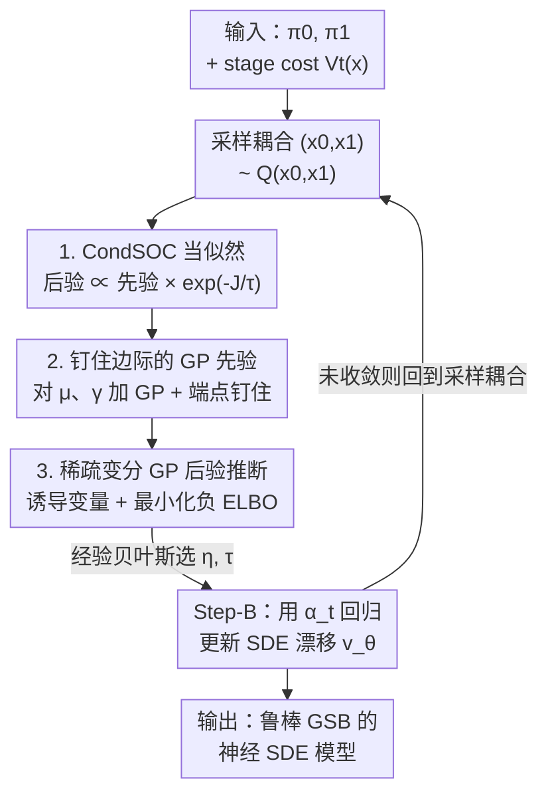

# Robust Generalized Schrödinger Bridge via Sparse Variational Gaussian Processes

**会议**: ICLR 2026  
**OpenReview**: [https://openreview.net/forum?id=3a2QuEzveq](https://openreview.net/forum?id=3a2QuEzveq)  
**代码**: 无  
**领域**: 生成建模 / 概率推断 / Schrödinger Bridge  
**关键词**: 广义 Schrödinger 桥, 稀疏变分高斯过程, 条件随机最优控制, 鲁棒路径建模, 贝叶斯推断

## 一句话总结
针对广义 Schrödinger 桥（GSB）里 stage cost 可能带噪声的问题，本文把 GSBM 中确定性的「钉住边际路径」优化改造成贝叶斯推断——给路径的均值/标准差函数加高斯过程先验、把 CondSOC 目标当作（带噪）似然，用稀疏变分自由能推断后验路径，在带噪的人群导航与图像翻译任务上得到比 GSBM 更鲁棒的解。

## 研究背景与动机

**领域现状**：Schrödinger 桥（SB）是在两个分布 $\pi_0,\pi_1$ 之间找一条与参考测度最接近的 SDE 路径，近年在无监督图像翻译、粒子/人群建模等生成任务上重新火起来。广义 SB（GSB）在标准 SB 基础上额外引入了对路径的 **stage cost** $V_t(x)$（如人群导航里的障碍物、拥挤惩罚，或图像翻译里的隐空间保持代价），能把任务先验注入到概率路径里。当前最强的求解器是 GSBM，它把 SB 写成「最小动能 + 条件流匹配」，再把 stage cost 加进一个条件随机最优控制（CondSOC）子问题里求解。

**现有痛点**：GSBM 在 CondSOC 这一步把钉住边际 $P_t(x\mid x_0,x_1)=\mathcal{N}(x;\mu_t,\gamma_t^2 I)$ 的均值/标准差函数参数化成样条（spline），并求一个**确定性点估计**。这带来两个问题：其一，样条建模不够灵活——想提升表达力就要加高阶（如三次样条），数值上容易崩；改用 path integral 重采样建模非高斯路径又极其昂贵、还有理论瑕疵。其二，也是本文更在意的，GSBM 把 stage cost 当成**无噪声的确定量**，但现实里它常常是带噪、不确定的（如 LiDAR 投影读数有误差、VAE 的隐空间重建代价本身不准、障碍物时有时无）。

**核心矛盾**：把一个**本质上有不确定性**的 stage cost 当作可完全信任的确定目标去做点估计优化，会让求得的路径过度拟合噪声、缺乏鲁棒性；而单纯提升路径模型的表达力又会撞上数值与计算的墙。两个诉求——更灵活的路径建模 + 显式处理不确定性——需要同一套框架来满足。

**本文目标**：在不改 GSBM 整体两步交替（Step-A 优化钉住边际、Step-B 更新神经网络 SDE）骨架的前提下，把 CondSOC 这一步从「确定性点估计」升级成「贝叶斯后验推断」，让解既更灵活又对噪声鲁棒。

**切入角度**：把 CondSOC 目标 $J(P_\bullet;V_\bullet)$ 看作一个（随机）**似然函数**，对钉住边际路径 $P_\bullet$ 施加**高斯过程（GP）先验**——GP 天然能同时满足「灵活的函数建模」与「带不确定性的贝叶斯处理」两个诉求。

**核心 idea**：用「GP 先验 + CondSOC 当似然 → 稀疏变分推断后验路径」替换 GSBM 的「样条 + 确定性点估计」，得到一个对带噪 stage cost 鲁棒的广义 Schrödinger 桥算法 GP-GSBM。

## 方法详解

### 整体框架

GP-GSBM 完整继承 GSBM/DSBM 的两步交替大循环：反复 (Step-A) 为每对耦合 $(x_0,x_1)$ 求最优钉住边际 $P_t(x\mid x_0,x_1)$，再 (Step-B) 用 $\|\alpha_t-v_\theta\|^2$ 把神经网络 SDE 漂移 $v_\theta$ 回归上去。本文**只改 Step-A**：原来 GSBM 在这里对 $\mu_t,\gamma_t$ 做确定性样条优化（求点估计 $\arg\min_{P_\bullet} J(P_\bullet;V_\bullet)$），本文换成贝叶斯框架。

转法分三层。第一层是**重新解释目标**：把 CondSOC 目标 $J$ 视为似然 $\exp(-J/\tau)$，给 $P_\bullet$ 配一个先验 $P_{\text{prior}}(P_\bullet)$，于是要找的不再是点估计，而是后验 $P_{\text{post}}(P_\bullet)\propto P_{\text{prior}}(P_\bullet)\cdot\exp(-J(P_\bullet;V_\bullet)/\tau)$。第二层是**给路径配 GP 先验**：对均值函数 $\mu_\bullet$ 和（无约束的）标准差函数 $\tilde\gamma_\bullet$ 各放一个 GP，并强制满足端点钉住条件 $\mu_0=x_0,\mu_1=x_1,\gamma_0=\gamma_1=0$。第三层是**稀疏变分推断**：后验不可解，于是借 Titsias 的稀疏变分自由能，用一组诱导时间点 $Z$ 上的诱导变量来近似后验，整套靠最小化负 ELBO 学到，并顺带用经验贝叶斯（evidence maximization）选核超参 $\eta$ 与似然温度 $\tau$。

### 关键设计

**1. 把 CondSOC 目标当似然、求后验而非点估计**

这一步直接针对「GSBM 把带噪 stage cost 当确定量、过拟合噪声」的痛点。GSBM 解的是 $\arg\min_{P_\bullet} J(P_\bullet;V_\bullet)$，其中 $J=\int_0^1 \mathbb{E}_{P_t}[\tfrac12\|\alpha_t\|^2+V_t(x_t)]\,dt$，把 $P_\bullet$ 当确定优化变量。本文反过来把 $P_\bullet$ 当随机量，配先验 $P_{\text{prior}}(P_\bullet)$，并把目标指数化成似然，得到带温度的「正则化路径 GSBM」：

$$\arg\min_{P_\bullet} J(P_\bullet;V_\bullet)-\tau\log P_{\text{prior}}(P_\bullet)\equiv\arg\max_{P_\bullet} \underbrace{P_{\text{prior}}(P_\bullet)}_{\text{先验}}\cdot\underbrace{\exp(-J/\tau)}_{\text{似然}}$$

这只是 MAP 解；本文更进一步直接面向后验 $P_{\text{post}}(P_\bullet)\propto P_{\text{prior}}(P_\bullet)\cdot\exp(-J(P_\bullet;V_\bullet)/\tau)$。这样做的好处是：当 $V$ 含噪时，似然本身不可全信，后验会在「先验偏好」和「数据似然」之间按不确定性自动权衡，而不像点估计那样完全相信目标 $J$。平衡系数 $\tau$ 控制信谁多一点——后面会看到它能被经验贝叶斯自动学出来。

**2. 给钉住边际配带端点约束的高斯过程先验**

CondSOC 的优化变量是钉住高斯边际 $P_t=\mathcal{N}(x;\mu_t,\gamma_t^2 I)$ 的均值/标准差函数。本文对 $\mu_\bullet$ 和无约束化的 $\tilde\gamma_\bullet$ 分别施加（逐维分解的）GP 先验：

$$P_{\text{prior}}(P_\bullet)=\prod_{j=1}^{d}\mathrm{GP}(\mu^j_\bullet)\cdot\mathrm{GP}(\tilde\gamma_\bullet)$$

标准差用 $\gamma_t=\sigma\sqrt{t(1-t)}\log(1+e^{\tilde\gamma_t})$ 参数化以保证正性、并天然满足 $\gamma_0=\gamma_1=0$。对均值则要钉住端点 $\mu_0=x_0,\mu_1=x_1$，作者用「条件 GP」（在 $\mu_0,\mu_1$ 上做条件）来实现——条件后的过程仍是 GP，均值/协方差由式 (12)(13) 的核条件公式给出。一个关键的先验取法：$\mu_t$ 的先验均值取**线性插值** $m^\mu_t=(1-t)x_0+tx_1$、$\tilde\gamma$ 的先验均值取常数使 $\gamma_t=\sigma\sqrt{t(1-t)}$——这恰好让先验均值**等于原始 SB 问题里 DSBM 的解**。换句话说，先验把「无障碍时应走直线插值」这一偏好编码了进去，stage cost 只在必要时把路径推离直线。这正是 GSBM 缺失的：GSBM 只优化 cost、不带这种直线偏好，所以在障碍随机出现的场景里会被带偏。

**3. 稀疏变分自由能 GP 后验推断 + 经验贝叶斯选超参**

后验 $P_{\text{post}}$ 不可解，本文用 Titsias 的稀疏变分 GP：选 $n$ 个等间隔的**诱导时间点** $Z=(t_1,\dots,t_n)$，只对诱导变量 $\mu_Z$ 学一个 $n$ 维高斯 $Q(\mu_Z)=\mathcal{N}(C^\mu,S^\mu)$（对角协方差），而让 $Q(\mu_\bullet\mid\mu_Z)$ 直接等于先验的条件过程。这样积分 $Q(\mu_\bullet)=\int Q(\mu_Z)Q(\mu_\bullet\mid\mu_Z)\,d\mu_Z$ 有闭式解，整条后验路径仍是 GP（均值/协方差见式 (17)(18)，$\tilde\gamma$ 同理给出 (19)(20)）。参数量上，若样条结点数取得和 $n$ 相同，本文与 GSBM **同阶**，只是诱导变量数大约是 GSBM 的两倍。学习靠最小化负 ELBO：

$$\min_{\Lambda,\eta,\tau}\ \mathbb{E}_{Q(P_\bullet)}[J(P_\bullet;V_\bullet)/\tau]+\mathrm{KL}\big(Q(P_{Z,Z'})\,\|\,P_{\text{prior}}(P_{Z,Z'})\big)$$

第一项用重参数化 Monte-Carlo 采样估计（采 $(\mu_\bullet,\gamma_\bullet)$ 后用 $\alpha_t=\dot\mu_t+a_t(x-\mu_t)$ 算 $J$，时间导数用 $(\mu_{t+\Delta t}-\mu_t)/\Delta t$ 近似以保留计算图，$\Delta t=0.01$），第二项是 $n$ 维高斯间的闭式 KL。对 $\Lambda$ 优化在缩小后验近似 gap，对 $(\eta,\tau)$ 优化等价于**经验贝叶斯/证据最大化**做模型选择——这就是为什么 $\tau$ 能被自动学出来：在确定性 Stunnel 上学到小 $\tau\approx0.1$（更信似然），在障碍随机的不确定场景学到大 $\tau\approx1.0$（更信直线先验、抗噪）。

### 损失函数 / 训练策略
整个算法 GP-GSBM（Alg. 1）每轮：① 从当前耦合 $Q(x_0,x_1)$ 采 batch；② 解式 (21) 的 ELBO 得到变分参数 $\Lambda$ 与模型参数 $(\eta,\tau)$；③ 从后验 GP $Q(P_\bullet)$ 采 $(\mu_t,\gamma_t)$、再采 $x_t\sim\mathcal{N}(\mu_t,\gamma_t^2 I)$ 并算 $\alpha_t$；④ 用 $\theta\leftarrow\theta-\beta\nabla_\theta\|\alpha_t-v_\theta(t,x_t)\|^2$ 更新 SDE 漂移网络。默认 $n=15$（Stunnel）/ $n=30$（LiDAR），核函数默认平方指数核。

## 实验关键数据

### 主实验
对比对象：GSBM（确定性处理 stage cost）、DSBM（完全忽略 stage cost）、Stream-level GP（把线性插值速度当 GP 先验，难纳入 stage cost）。指标主要是 CondSOC 目标值（越低越好），括号内为与真实目标 $\pi_1$ 的 Wasserstein 距离。

LiDAR 几何曲面人群导航（CondSOC，10 次平均）：

| 场景 | DSBM | GSBM | Stream-level GP | GP-GSBM（本文） |
|------|------|------|-----------------|------------------|
| 无噪观测 | 7747.0 (0.04) | 6199.3 (0.04) | 7012.6 (0.15) | **5925.0 (0.03)** |
| 带噪观测 | 12686.9 (0.04) | 8506.1 (0.04) | 12679.1 (0.16) | **8300.0 (0.04)** |

AFHQ 狗→猫 无监督图像翻译（生成猫图的 FID，越低越好）：

| DSBM | GSBM | Stream-level GP | GP-GSBM（本文） |
|------|------|-----------------|------------------|
| 14.16 | 12.39 | 18.77 | **10.21** |

无论是带噪还是无噪场景，GP-GSBM 的 CondSOC 都最低；图像翻译 FID 也明显优于确定性 GSBM，说明把 stage cost（这里是 VAE 隐空间 SLERP 重建代价 $V_t=\|x_t-\mathrm{dec}(z_t)\|_1$，本身就不准）当似然处理确实能抗其内在噪声。

### 消融实验
Stunnel / GMM 障碍人群导航（CondSOC，10 次平均），其中「不确定」场景指障碍以 $p=0.5$ 随机开关：

| 问题 | 场景 | DSBM | GSBM | GP-GSBM（本文） |
|------|------|------|------|------------------|
| Stunnel | 确定性 | 18628.8 | 492.94 | **488.78** |
| Stunnel | 不确定 | 9549.2 | 502.20 | **452.30** |
| GMM | 确定性 | 19824.2 | 97.4 | **85.3** |
| GMM | 不确定 | 13232.4 | 101.6 | **89.2** |

核函数 / 诱导点数消融（Stunnel & LiDAR，CondSOC）：

| 配置 | 关键指标 | 说明 |
|------|---------|------|
| 平方指数核（默认） | Stunnel 488.78 / LiDAR 5925.0 | 默认设置最稳 |
| 多项式核 | Stunnel 556.50 / LiDAR 6604.8 | 多数场景略逊于平方指数核 |
| 诱导点数 $n$ | 见 Fig. 3 | 只要 $n$ 不过小，性能对 $n$ 不敏感 |

### 关键发现
- **不确定场景最能拉开差距**：障碍随机开关时，GSBM 的 CondSOC 反而比确定性场景更高（被噪声搞糊涂、不会回退到直线先验），而 GP-GSBM 通过学到大 $\tau\approx1.0$ 偏向直线先验，loss 反而更低——这是「把目标当似然」最直接的收益。
- **$\tau$ 自动适配可信度**：确定性 Stunnel 学到 $\tau\approx0.1$（信似然），不确定场景学到 $\tau\approx1.0$（信先验），无需人工调，经验贝叶斯自动完成。
- **不确定性可视化**：GP 后验的标准差阴影在不确定场景里明显更大，定性印证了模型确实捕捉到了 stage cost 的不确定性。
- **代价可接受**：LiDAR 上 GP-GSBM 每次 ELBO 迭代 1.70s，GSBM 每次 CondSOC 迭代 1.61s（单张 RTX-4090），额外开销主要来自 $O(n^2 d)$ 与核求逆的 $O(n^3)$，但 $n\le30$ 为常数，整体相当。

## 亮点与洞察
- **「确定性优化 → 贝叶斯后验」是一个可复用的升级范式**：任何把某个 task-specific 目标当确定量去最小化、而该目标其实带噪的场景，都可以照搬「目标当似然 + 先验 + 变分后验」这套，自动获得鲁棒性与不确定性量化。
- **先验取成 DSBM 解非常巧**：把 GP 先验均值设成 $\sigma\sqrt{t(1-t)}$ 的直线插值，使「无障碍时该走直线」这一物理先验天然内嵌，等于免费给了模型一个强 baseline，stage cost 只负责把路径在必要处推离直线。
- **稀疏变分让复杂度与 GSBM 同阶**：用诱导变量代替全 GP，把参数量压到与样条结点同阶（诱导变量约 2×），是这套贝叶斯升级能落地的关键工程点。

## 局限与展望
- 作者承认：GP 后验推断带来的核求逆使计算复杂度高于 GSBM，虽给了启发式 workaround，但更原则性的降复杂度方案留作未来工作；高维状态下 $O(n^2 d)$ 仍可能吃紧。
- 路径建模仍锁死在**高斯**钉住边际（沿用 $P_t=\mathcal{N}(\mu_t,\gamma_t^2 I)$），并未真正解决「非高斯路径」的诉求——只是把高斯路径的点估计换成了后验，遇到本质多峰的最优路径仍受限。
- 实验集中在低维人群导航 + 64×64 AFHQ 翻译，未在大规模高分辨率生成上验证；FID 的 DSBM/GSBM 数字直接引自原文，跨实现可比性有保留。
- 改进思路：把诱导点也一起学（本文为简单固定成等间隔）、或对 $\mu/\gamma$ 用结构化稀疏核来摊薄 $O(n^3)$。

## 相关工作与启发
- **vs GSBM (Liu et al., 2024)**：GSBM 用确定性样条优化 CondSOC、求点估计、把 stage cost 当无噪确定量；本文用 GP + 稀疏变分推断求后验、把 stage cost 当带噪似然。两者只差「确定 vs 贝叶斯」这一步，但在带噪/障碍随机场景上拉开了鲁棒性差距。
- **vs Stream-level GP (Wei & Ma, 2025)**：他们在 CFM 框架里把线性插值速度当条件 GP 先验、靠在若干固定 stream 点上做条件得到 GP；本文是把 CondSOC 目标当似然做稀疏变分后验。后者的关键优势是能**系统性地纳入 stage cost**（障碍惩罚），而 stream-level GP 除非人工标点绕障碍否则没法处理 GSB——实验中它在 LiDAR/AFHQ 上代价高、匹配差。
- **vs Flow matching with GP prior (Kollovieh et al., 2025)**：他们把 GP 当作 $\pi_0$ 上的额外先验结构用于时间序列生成，$x_0$ 与 $x_1$ 同维；与本文「在钉住边际路径上加 GP 先验」目标完全不同。

## 评分
- 新颖性: ⭐⭐⭐⭐ 把 GSBM 的确定性 CondSOC 优化重铸为稀疏变分 GP 后验推断，角度清晰、动机具体（针对带噪 stage cost）。
- 实验充分度: ⭐⭐⭐ 覆盖人群导航与图像翻译、含确定/带噪与多种消融，但规模偏小、缺高分辨率生成验证。
- 写作质量: ⭐⭐⭐⭐ 公式推导完整、与 GSBM 的差异点交代得很干净，依托 UBA 框架统一叙述。
- 价值: ⭐⭐⭐⭐ 「确定性目标→贝叶斯后验」的升级范式与 DSBM 先验取法对桥匹配/生成建模社区有可迁移价值。

<!-- RELATED:START -->

## 相关论文

- [\[ICLR 2026\] Diffusion Bridge Variational Inference for Deep Gaussian Processes](diffusion_bridge_variational_inference_for_deep_gaussian_processes.md)
- [\[ICLR 2026\] Tight Bounds for Schrödinger Potential Estimation in Unpaired Data Translation](tight_bounds_for_schrodinger_potential_estimation_in_unpaired_data_translation.md)
- [\[ICLR 2026\] Revisiting Nonstationary Kernel Design for Multi-Output Gaussian Processes](revisiting_nonstationary_kernel_design_for_multi-output_gaussian_processes.md)
- [\[ICLR 2026\] Variational Inference for Cyclic Learning](variational_inference_for_cyclic_learning.md)
- [\[ICLR 2026\] Variational Deep Learning via Implicit Regularization](variational_deep_learning_via_implicit_regularization.md)

<!-- RELATED:END -->
