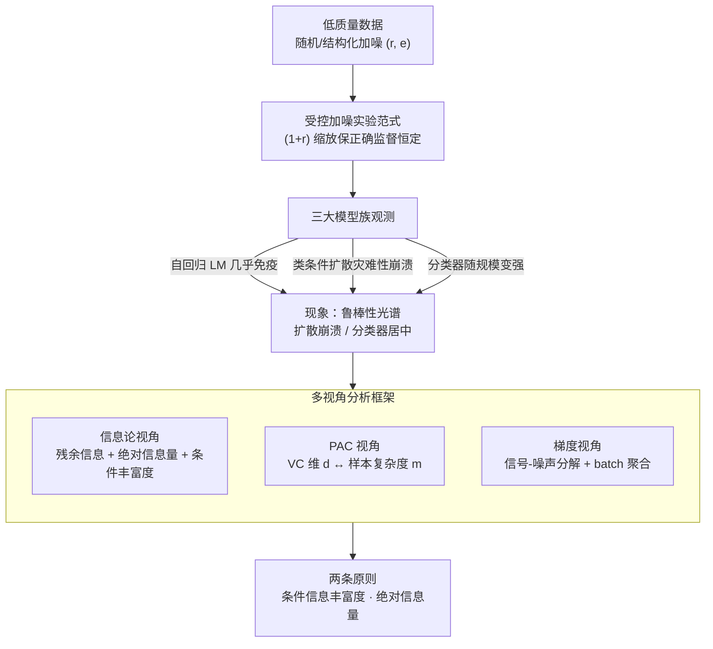

# Robustness of Probabilistic Models to Low-Quality Data: A Multi-Perspective Analysis

**会议**: ICLR 2026  
**OpenReview**: [https://openreview.net/forum?id=ZFZhV7Snf4](https://openreview.net/forum?id=ZFZhV7Snf4)  
**领域**: 学习理论 / 噪声鲁棒性分析  
**关键词**: 低质量数据, 噪声鲁棒性, 信息论, PAC 学习, 梯度动力学

## 一句话总结
这篇论文通过受控加噪实验发现"不同概率模型对低质量数据的鲁棒性差异极大"（自回归语言模型几乎免疫、类条件扩散模型灾难性崩溃、分类器居中且随数据规模增大而变强），并用信息论、PAC 学习、梯度动力学三个视角把这种差异统一归结为两条原则——**条件信息的丰富度**和**训练数据的绝对信息量**。

## 研究背景与动机

**领域现状**：现代深度模型都在海量、不可避免含噪的数据上训练。学界对"带噪训练"已有丰富积累：判别式模型（分类器）对标签噪声的惊人韧性早有记录，并催生了噪声鲁棒损失、噪声校正等一整套方案；近年注意力又转向生成模型的脆弱性，针对类条件扩散模型的噪声标签、语言模型的污染上下文出现了一批"打补丁"式的架构修复。

**现有痛点**：这些工作几乎都在**修单个模型的单个漏洞**——给某个模型设计某种损失、某种校正机制，却没人回答更根本的问题：为什么 AI 里最强大的几类模型，会落在鲁棒性光谱的两个极端？自回归语言模型和大规模分类器对污染异常顽强，而类条件扩散模型在同样的噪声下却彻底崩盘。这种巨大的反差缺乏统一解释。

**核心矛盾**：以往研究把鲁棒性当成"某个架构的固有属性"来研究，但作者怀疑鲁棒性根本不是架构本身决定的，而是由**任务的信息结构**决定的——具体说，是输入（条件）与输出（目标）之间的信息不对称在起作用。

**本文目标**：(1) 用受控实验在自回归 LM、类条件扩散、图像分类三大模型族上量化鲁棒性差异；(2) 找到一个能统一解释这些差异的理论框架，回答"什么信息属性驱动鲁棒性、为什么它是泛化的必要条件、优化过程如何机械地实现这种韧性"。

**切入角度**：作者不去刷某个 benchmark 的 SOTA，而是设计一套可量化的加噪协议，把"加多少错、保留多少正确监督"精确控制住，从而**隔离出鲁棒性这一内在属性**；再用三个互补的理论透镜去解剖同一组现象。

**核心 idea**：鲁棒性 = 条件信息丰富度 × 绝对信息量。条件越丰富，模型要学的函数越被约束（有效 VC 维越低、需要的样本越少）；绝对信息量越大，正确信号越能在梯度聚合中盖过统计噪声。

## 方法详解

### 整体框架

这篇论文不是提出一个新模型，而是搭了一条"**受控加噪实验 → 三视角理论分析 → 两条原则**"的分析流水线。整体上分两步走：先用统一的噪声注入协议，在三大模型族上把鲁棒性差异**测出来、量化好**；再用信息论、PAC、梯度三个互补视角，把"测到的现象"**解释清楚**，最后收敛到两条贯穿始终的原则。

实验侧的关键是**隔离设计**：以噪声比 $r$（相对干净数据量加入的错误数据比例，$r\in[0.1,1.0]$）注入随机噪声，对应有效错误率 $e=r/(1+r)$ 最高 50%；同时把总训练计算量按 $(1+r)$ 缩放，保证模型见到的**正确监督量恒定**——这样任何性能下降都只能归因于噪声本身，而不是干净数据变少。分析侧则把同一组结果交给三个透镜：信息论说"什么信息驱动鲁棒性"，PAC 说"为什么这是泛化的形式化必要条件"，梯度动力学说"优化过程如何机械地实现"。

### 关键设计

**1. 受控加噪实验范式：把"内在鲁棒性"从混杂因素里隔离出来**

要比较不同模型族对噪声的"内在"耐受度，最大的陷阱是噪声和"干净数据变少"纠缠在一起——加了 50% 错误数据后性能掉了，到底是噪声害的还是正确样本被挤掉了？本文的核心实验设计就是斩断这个混淆：以比例 $r$ 注入随机噪声（文本任务把目标 token 随机替换成词表中任意 token；分类/类条件生成把标签替换成 $C-1$ 个错误类之一），同时**把总训练步数按 $(1+r)$ 成比例放大**，使模型对正确样本的曝光量在所有设置下保持恒定。这样性能下降就是噪声的纯效应。除主范式外，作者还补了两个变体增强说服力：**固定预算**范式（步数不变、用噪声直接替换干净 token，剔除"额外计算"的干扰）；以及**结构化噪声**范式（在序列到序列任务里用"早期半训好的模型"当 noisy teacher 生成非随机的、模仿机器生成瑕疵的错误目标），后者专门用来检验"条件丰富度"假设在真实噪声分布下是否仍成立。

**2. 信息论视角：残余信息保证可学，绝对信息量与条件丰富度决定鲁棒程度**

这是全文的解释主干，落在三个量上。其一，**残余信息**回答"标签被污染后还剩多少可学信号"：在 $n$ 类、错误标签从 $n-1$ 个候选中均匀选取且概率为 $p_e$ 的均匀错误模型下，相对信息损失为

$$\frac{\text{information loss}}{H(y)}=\frac{-(1-p_e)\log_2(1-p_e)-p_e\log_2 p_e+p_e\log_2(n-1)}{\log_2 n}$$

关键洞察是：只要观测标签和真实标签**不统计独立**，就还有可学信号；独立只发生在唯一点 $p_e=(n-1)/n$，在 $p_e\le(n-1)/n$ 这个现实退化区间里残余信号恒存在。其二，**绝对信息量**——训练数据提供的总信息量（既含输入分布 $p(z)$ 的结构信息，也含条件分布 $p(y|z)$ 的指令信息）——被认定为鲁棒性的首要驱动。一张标签错了的图仍然以类似无监督的方式贡献 $p(z)$ 的特征学习，只是不再提供指令信号；ImageNet-1000 的 128 万样本提供的绝对信息量大到能让正确信号"碾压"冲突梯度，这正是大数据集能容忍高噪声的原因。其三，**条件信息丰富度**：当丰富的条件去约束信息稀疏的目标（语言模型用上文预测下一 token、分类器用整图预测标签），模型对目标噪声极顽强；反过来，类条件扩散 $p(\text{image}|\text{label})$ 用一个稀疏标签去生成高信息的整图，一旦这个低信息条件被污染就脆弱不堪。

**3. PAC 视角：把两条原则形式化为 VC 维 $d$ 与样本复杂度 $m$ 的关系**

信息论给的是直觉，PAC 把它变成可证的形式化必要条件。样本复杂度下界为

$$m\ge c_0\left(\frac{1}{\epsilon}\log\frac{1}{\delta}+\frac{d}{\epsilon}\log\frac{1}{\epsilon}\right)$$

它把两条原则一次串起来：**绝对信息量** ↔ 总样本数 $m$——ImageNet-1000 即便被严重污染，剩余干净样本总量仍远超稳定共享知识所需的 $m$，而 ImageNet-10 这类小子集的干净样本总数本就逼近甚至低于临界 $m$，没有缓冲去吸收噪声。**条件丰富度** ↔ 有效 VC 维 $d$——丰富条件（如 $p(\text{label}|\text{image})$）严重约束输出、简化学习问题，可用较低的有效 $d$ 解决；稀疏条件（如 $p(\text{image}|\text{label})$）几乎不提供约束，模型必须学一个高维得分函数那样复杂的映射，逼出极高的 $d$。由不等式，高 $d$ 索要巨量 $m$，于是类条件扩散对绝对信息量的需求极大，噪声会迅速把有效干净样本压到临界阈值以下——这就是它格外脆弱的形式化原因。

**4. 梯度视角：信号-噪声分解 + batch 聚合，给出"机械地实现鲁棒性"的微观机制**

前两个视角说"为什么应该鲁棒"，这个视角说"训练过程怎么真的做到"。把一个 batch 的总梯度分解为

$$g_{\text{total}}=g_{\text{correct\_signal}}+\sum_j g_{\text{noise\_component}_j}$$

正确样本的梯度方向一致、相干地指向真实数据流形；污染样本的梯度方向随机、近似彼此正交。作者在初始化处测了 per-example 梯度的余弦相似度作为直接证据：clean–clean 平均 $+0.52$（强相干），corrupt–corrupt 和 clean–corrupt 都约 $+0.001$（近乎正交、对称分布于零附近）。于是 batch 越大，相干的正确信号**线性累加**、随机噪声**部分抵消**，信噪比系统性提升——表中 25% 污染下 batch 从 4 翻到 8，信噪比从 7.31× 升到 8.34×；50% 污染下从 2.96× 升到 3.83×。这个机制直接解释了主实验里的关键干预：自回归模型在高噪声下用基线 batch 无法收敛，必须把 batch 放大（$r=0.5$ 翻倍、$r=1.0$ 放大十二倍）才能让累积的正确信号盖过虽增大但相互抵消的噪声。

### 一个完整示例

以"为什么类条件扩散崩、自回归 LM 稳"走一遍三视角即可看清逻辑闭环。取 CIFAR-10 上 $e=0.5$（100:100 设置）：扩散模型 $p(\text{image}|\text{label})$ 的条件是单个稀疏标签，**信息论**说它要从低信息条件生成高信息整图、条件丰富度极低；**PAC** 说这逼出很高的有效 VC 维 $d$、索要巨量 $m$，而 CIFAR-10 的干净样本总量不足以缓冲；**梯度** 上标签被污染直接破坏了图像-标签关联——三者一致预测崩溃，实测生成图与条件标签的一致性从 94.08% 跌到 40.63%（而 FID 基本不变，说明掉的是"图像-标签关联"不是画质）。反观自回归 LM $p(\text{next}|\text{prev})$：丰富上文约束稀疏目标 token，$d$ 低、残余信号足、梯度可聚合抵消噪声——GPT-2 在 50% 污染下测试 NLL 仅从 2.87 微升到 3.59。

## 实验关键数据

### 主实验

三大模型族在有效错误率最高 50% 下的鲁棒性差异（鲁棒性光谱的核心证据）：

| 模型族 / 任务 | 指标 | 干净基线 | 50% 错误率 | 变化 |
|--------|------|------|----------|------|
| GPT-2 / OpenWebText | 测试 NLL | 2.87 | 3.59 | 仅 +0.72（顽强） |
| 类条件扩散 / CIFAR-10 | 生成-条件一致性 | 94.08% | 40.63% | 崩落 −56.81% |
| 类条件扩散 / CIFAR-100 | 生成-条件一致性 | 65.24% | 17.00% | 崩落 −48.24% |
| 分类器 ViT / ImageNet-1000 | 准确率 | 73.78% | 74.78% | 几乎免疫（反升） |

序列到序列实验（结构化 noisy-teacher 噪声）直接验证"条件丰富度"假设——稀疏条件 vs 丰富条件，目标同样被 50% 污染：

| 任务 | 条件长度（99.9 分位）| NLL 相对升幅 |
|------|------|------|
| WMT 2014 翻译（稀疏条件）| 153 tokens | +31.5% |
| CNN/DailyMail 摘要（丰富条件）| 2343 tokens | +17.9% |

### 消融 / 分析实验

梯度相干性分析（Table 4，初始化处的 per-example 梯度，直接验证信号-噪声分解机制）：

| 配置 | 指标 | 数值 | 说明 |
|------|---------|------|------|
| Clean vs Clean | 平均余弦相似度 | +0.52 | 正确梯度强相干 |
| Corrupt vs Corrupt | 平均余弦相似度 | +0.001 | 噪声梯度近乎正交 |
| 25% 污染 | 信噪比 (batch 4 → 8) | 7.31× → 8.34× | 增大 batch 提升信噪比 |
| 50% 污染 | 信噪比 (batch 4 → 8) | 2.96× → 3.83× | 同上，高噪声下提升更关键 |

分类器随数据规模的鲁棒性变化（绝对信息量原则）：CIFAR-10/100 与 ImageNet-10/100 在 50% 噪声下都明显掉点，唯独 1.28M 样本的 ImageNet-1000 几乎免疫甚至微升。

### 关键发现
- **鲁棒性不是架构的固有属性，而是任务信息结构的产物**：同样 50% 噪声，决定生死的是"条件是否丰富、绝对信息量是否够"，不是模型叫什么名字。
- **扩散模型掉的是"关联"不是"画质"**：FID 在各噪声水平基本稳定，崩的是图像-标签一致性——精准定位了脆弱性来源。
- **梯度聚合机制有可操作后果**：高噪声训练不稳定时，把 batch 放大（最高 12×）就能恢复收敛，这是理论预测被工程干预反向印证的罕见闭环。
- **大数据集的免疫是"绝对信息量碾压"**：ImageNet-1000 干净样本总量远超稳定共享特征所需的样本复杂度 $m$，噪声压不到临界阈值以下。

## 亮点与洞察
- **两条原则统一三大反常现象**：用"条件丰富度（管 VC 维 $d$）+ 绝对信息量（管样本复杂度 $m$）"两根轴，把语言模型顽强、扩散崩溃、分类器随规模变强这三件看似无关的事钉在同一张图上，解释力强且可证。
- **三视角不是各说各话而是收敛**：信息论给直觉、PAC 给形式化必要条件、梯度给微观机制，三者对同一现象给出一致预测——这种"what / why / how"分工是可复用的分析范式。
- **隔离式实验设计是方法论亮点**：按 $(1+r)$ 缩放计算量来固定正确监督量，外加固定预算和结构化噪声两个对照，把"噪声效应"从"数据变少""额外算力""随机性"中干净剥离，值得迁移到任何噪声鲁棒性研究。
- **可迁移判据**：拿到一个新任务，先看"条件 vs 目标"谁信息更丰富、训练集干净样本总量相对任务复杂度是否充裕，就能粗判它对标签噪声的脆弱程度——无需真的去加噪重训。

## 局限与展望
- **主范式靠"放大计算量保正确监督恒定"**，这本身引入了额外训练算力；虽有固定预算对照缓解，但 ImageNet-1000"反而微升"作者也承认部分归因于额外计算，纯效应仍有耦合。
- **噪声模型偏理想**：主实验用均匀随机噪声，真实世界的噪声往往是系统性、类相关的；结构化 noisy-teacher 只在序列到序列任务上验证，覆盖面有限。
- **理论多为定性 / 启发式**：VC 维 $d$、样本复杂度 $m$ 在深度网络里只能"有效"地谈，相对信息损失公式也基于均匀错误假设，离严格紧界尚远（部分公式以原文 Appendix 推导为准）。
- **改进思路**：把分析扩展到真实噪声分布、给出可计算的"鲁棒性预测指标"（如用条件/目标互信息比直接预报脆弱度），以及为扩散模型设计"补充条件信息"的鲁棒化方案。

## 相关工作与启发
- **vs 噪声鲁棒损失 / 噪声校正（Menon、Chen、Yi&Wu 等）**: 他们针对判别模型设计具体的修复机制，本文不修单个漏洞而是解释脆弱性的**起源**，给出跨模型族的统一原理，定位更上游但不直接提供工程方案。
- **vs 扩散模型噪声标签的架构修复（Na et al., 2023）**: 他们打补丁修类条件扩散的噪声标签问题，本文用"稀疏条件→高 VC 维→需巨量绝对信息量"解释了它**为什么**天生脆弱，把现象上升为原理。
- **vs 大数据压噪经验（Jia et al., 2021）**: 他们经验性地观察到海量数据能淹没监督噪声，本文用绝对信息量 + 样本复杂度 $m$ + 梯度聚合三层给出了**机制级解释**，并用 ImageNet 规模实验定量印证。

## 评分
- 新颖性: ⭐⭐⭐⭐ 不提新模型，但首次把信息论/PAC/梯度三视角综合起来统一解释跨模型族的鲁棒性差异，视角新。
- 实验充分度: ⭐⭐⭐⭐ 覆盖 LM/扩散/分类三族 + CIFAR/ImageNet/WMT/CNN-DM 多任务，含结构化噪声与梯度相干性等针对性验证。
- 写作质量: ⭐⭐⭐⭐ 逻辑闭环清晰（现象→三视角→两原则），但理论部分偏定性、若干公式依赖附录推导。
- 价值: ⭐⭐⭐⭐ 给"模型为何对噪声脆弱"提供了可迁移的判据与统一框架，对数据质量受限的真实训练有指导意义。

<!-- RELATED:START -->

## 相关论文

- [\[ICLR 2026\] Price of Quality: Sufficient Conditions for Sparse Recovery using Mixed-Quality Data](price_of_quality_sufficient_conditions_for_sparse_recovery_using_mixed-quality_d.md)
- [\[ICLR 2026\] A Generalized Geometric Theoretical Framework of Centroid Discriminant Analysis for Linear Classification of Multi-dimensional Data](a_generalized_geometric_theoretical_framework_of_centroid_discriminant_analysis_.md)
- [\[ICLR 2026\] High-dimensional Analysis of Synthetic Data Selection](high-dimensional_analysis_of_synthetic_data_selection.md)
- [\[ICLR 2026\] Does the Data Processing Inequality Reflect Practice? On the Utility of Low-Level Tasks](does_the_data_processing_inequality_reflect_practice_on_the_utility_of_low-level.md)
- [\[ICLR 2026\] Data-Aware and Scalable Sensitivity Analysis for Decision Tree Ensembles](data-aware_and_scalable_sensitivity_analysis_for_decision_tree_ensembles.md)

<!-- RELATED:END -->
