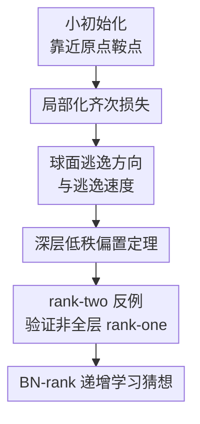

# Saddle-To-Saddle Dynamics in Deep ReLU Networks: Low-Rank Bias in the First Saddle Escape

**会议**: ICLR 2026  
**OpenReview**: [https://openreview.net/forum?id=B4zcoLvjw0](https://openreview.net/forum?id=B4zcoLvjw0)  
**代码**: 无  
**领域**: 学习理论 / 深度网络训练动力学  
**关键词**: 鞍点到鞍点动力学, ReLU 网络, 低秩偏置, 瓶颈秩, 小初始化  

## 一句话总结
本文从小初始化下深 ReLU 网络靠近原点鞍点的局部动力学出发，刻画梯度下降第一次逃逸的最优方向，证明深层权重和激活会出现随深度增强的近似 rank-one 偏置，并用反例说明 ReLU 网络的第一层不必像深线性网络那样严格 rank-one。

## 研究背景与动机
**领域现状**：深度网络训练理论里，一个重要分界是 lazy/kernel regime 与 rich/active regime。前者可以围绕初始化线性化，用 NTK 或近似凸的视角解释训练；后者会发生特征学习、稀疏化和低秩偏置，但动力学复杂得多，尤其在层数很深时，单纯的均值场极限并不容易给出可解释的训练路径。

**现有痛点**：小初始化是进入 active regime 的一种典型方式。参数一开始非常接近零点，网络输出也很小，梯度下降会先在原点附近停留一段时间，然后沿某个“逃逸方向”突然离开。线性网络和浅层 ReLU 网络已经有不少 saddle-to-saddle 或 condensation 理论，但深 ReLU 网络同时有非光滑 ReLU、层间同质性和高维激活，不能简单套用 Hessian 特征向量或深线性网络的 rank-one 结论。

**核心矛盾**：如果把第一次逃逸看成训练早期的隐式偏置，那么问题并不是“梯度是否能下降”，而是“在所有可能让损失下降最快的方向里，网络更偏向哪类函数结构”。深线性网络给出的答案是传统矩阵秩逐步增加；深 ReLU 网络的经验现象却更像 bottleneck 结构：靠近输入的少数层可能保持较高维表达，而中后部大量层压成低秩通道。

**本文目标**：论文试图回答三个具体问题。第一，小初始化下原点附近的 ReLU 网络损失应该怎样局部化，逃逸方向和逃逸速度如何定义。第二，最优逃逸方向是否会强制深层权重与激活接近 rank-one，并且这种偏置是否随层数加深变强。第三，这种 rank-one 叙事是否对所有层都成立，还是 ReLU 的非线性允许前几层保留更高秩结构。

**切入角度**：作者不直接分析完整训练全过程，而是把视野缩到“第一次离开原点鞍点”这一段。由于网络输出在原点附近很小，损失可以被一阶项 $L_0(\theta)=\mathrm{Tr}[G^\top Y_\theta]$ 近似；又因为无偏置 ReLU 网络对参数是 $L$ 次齐次的，这个局部损失有清晰的球面投影梯度流结构。这样，逃逸方向可以被定义成局部损失在固定范数球面上的 KKT 点。

**核心 idea**：用齐次局部损失的球面最优化来刻画第一次鞍点逃逸，并证明深 ReLU 网络的最优逃逸方向天然形成“前部可高秩、深部近 rank-one 且更线性”的半瓶颈结构。

## 方法详解

### 整体框架
本文不是提出新的训练算法，而是建立一套分析小初始化深 ReLU 网络早期训练的理论框架。给定训练集矩阵 $X$ 和损失对零输出的梯度 $G=\nabla C(0)$，作者先把原点附近的真实损失替换为局部化的一阶损失 $L_0(\theta)=\mathrm{Tr}[G^\top Y_\theta]$，再利用 ReLU 网络的 $L$ 次齐次性，把梯度流分解为“参数范数增长”和“归一化方向在球面上寻找下降方向”两部分。随后，论文研究球面上最快下降的最优逃逸方向，并证明其深层矩阵和激活必然近似低秩。

整体逻辑有点像把早期训练拆成一个“方向选择问题”。如果归一化参数 $\bar\theta$ 在球面上收敛到某个满足 $\nabla L_0(\rho)=-s\rho$ 的点，那么原始参数会沿这个方向快速增大；$s$ 越大，逃逸越快。因此最优逃逸方向就是固定范数球面上让 $L_0$ 最小、等价地让逃逸速度最大的方向。

### 关键设计
**1. 齐次局部化：把非光滑原点附近的训练改写成逃逸方向问题**

深 ReLU 网络在原点处不是普通的严格鞍点，因为 ReLU 非光滑，传统 Hessian 特征向量并不能直接描述“往哪里逃”。作者的第一步是利用输出很小这一事实，把真实损失写成

$$
L(\theta)=C(Y_\theta)=C(0)+\mathrm{Tr}[G^\top Y_\theta]+O(\|Y_\theta\|_F^2),
$$

其中 $G=\nabla C(0)$。丢掉常数项和高阶项后，局部损失 $L_0(\theta)=\mathrm{Tr}[G^\top Y_\theta]$ 保留了原点附近最主要的下降信号。

关键在于，无偏置 ReLU 网络满足正齐次性：所有权重同时乘以 $\lambda$ 时，输出乘以 $\lambda^L$，所以 $L_0(\lambda\theta)=\lambda^L L_0(\theta)$。这让梯度流可以分解成范数 $\|\theta\|$ 和方向 $\bar\theta=\theta/\|\theta\|$ 的动力学。方向部分本质上是在球面上对 $L_0$ 做投影梯度流；范数部分在方向对齐后快速增长。也就是说，第一次逃逸的核心不是普通意义的二阶曲率，而是球面上哪一个齐次方向能以最快速度降低局部损失。

**2. 逃逸速度：用球面最优化替代 Hessian 特征向量**

论文把逃逸方向定义为半径 $\sqrt{L}$ 的参数球面上满足

$$
\nabla L_0(\rho)=-s\rho,
$$

且 $s>0$ 的方向。这里 $s$ 是逃逸速度；如果参数已经与 $\rho$ 对齐，那么局部梯度流会一直沿这条射线运动。对于 $L\neq 2$，范数满足

$$
\|\theta(t)\|=\left(\|\theta(t_0)\|^{2-L}+(2-L)Ls(t-t_0)\right)^{1/(2-L)},
$$

而 $L=2$ 时则是指数增长。这个公式解释了为什么小初始化训练会出现长平台后突然下降：在方向没有找到之前范数很小，输出很小；一旦方向对齐，范数沿负局部损失方向迅速放大，网络离开原点邻域。

这个定义也把“最快逃逸”变成了一个明确的优化问题：在 $\|\theta\|^2=L$ 的约束下最小化 $\mathrm{Tr}[G^\top Y_\theta]$。相比深线性网络常见的奇异向量分析，这里更适合 ReLU，因为它只依赖齐次性和球面 KKT 条件，不需要在非光滑原点处构造 Hessian。

**3. 深层低秩偏置：近 rank-one 层会向后传播并随深度增强**

主定理说明，在最优逃逸方向 $\theta^\star$ 下，足够深的层会同时满足三类近似 rank-one / 近似线性性质。对第 $\ell$ 层权重 $W_\ell$ 和激活 $Z_\ell^\sigma$，其非首奇异值能量占比满足类似

$$
\frac{\sum_{i\ge 2}s_i^2(W_\ell)}{\sum_{i\ge 1}s_i^2(W_\ell)},\quad
\frac{\sum_{i\ge 2}s_i^2(Z_\ell^\sigma)}{\sum_{i\ge 1}s_i^2(Z_\ell^\sigma)},\quad
\frac{\|Z_\ell^\sigma-Z_\ell\|_F^2}{\|Z_\ell\|_F^2}
\le O(\ell^{-1/2}),
$$

在论文表述中，这意味着第二及之后奇异值相对于第一奇异值越来越小，第一奇异值至少有大约 $\ell^{1/4}$ 量级的优势。第三个比值衡量 ReLU 把负预激活截断掉的影响；它变小表示深层预激活越来越非负，ReLU 在瓶颈内部更接近恒等映射。

证明思路分两步。第一步是“弱控制”：如果某个参数点有足够快的逃逸速度，那么很多层的激活必须近似 rank-one，否则逐层 Frobenius 范数与 operator norm 的乘积会让输出与损失下降速度不匹配。第二步是“强传播”：一旦某个中间激活已经接近非负 rank-one 矩阵，那么之后子网络在最优逃逸问题下也会被迫近似 rank-one。把两步拼起来，任取深度位置 $\ell$，在它之前总能找到一个足够早的近 rank-one 层，于是第 $\ell$ 层及之后继承这种低秩偏置。

**4. 非全层 rank-one：用 rank-two 反例定位 ReLU 与线性网络的差异**

如果只看主定理，很容易误以为最优逃逸方向在所有层都应该 rank-one。作者专门构造了一个反例来说明这不对：在二维单位圆上取 $N=8$ 个点，令损失梯度符号交替，训练一个深度为 3、无偏置的 ReLU MLP。若强制所有权重 rank-one，最好逃逸速度是 $s_1=\sqrt{2}-1\approx 0.414$；但存在一个第一层 rank-two、后续层 rank-one 的构造，逃逸速度达到 $s_2=1/2$。

这个例子很重要，因为它排除了“定理只是证明技术不够强，真实最优解可能全层 rank-one”的解释。ReLU 的门控结构允许前层用多个半空间组合出更快下降的局部函数，而深层仍然可以压成 rank-one 通道。因此本文的结构更像“半瓶颈”：靠近输入的少数层负责产生必要的高维/分段线性特征，之后的大量层负责沿低维瓶颈传递和放大。

### 一个完整示例
可以把作者的 toy 反例看成一个最小版的“为什么第一层不一定 rank-one”。输入是单位圆上的 8 个点，标签或零输出处的损失梯度在相邻点之间交替正负。一个 rank-one 第一层只能选择一个方向 $\phi$，形成单个 ReLU ridge 函数 $\sigma(w^\top x)$；无论怎么旋转，它最多只能对一段半圆上的点给出连续响应，因此最优逃逸速度停在 $\sqrt{2}-1$。

rank-two 构造则同时使用四个第一层神经元，方向分别对准坐标轴正负方向：

$$
W_1=\frac12
\begin{bmatrix}
1&0\\
0&1\\
-1&0\\
0&-1
\end{bmatrix},\quad
W_2=\frac12[1,-1,1,-1],\quad
W_3=[1].
$$

这组权重在第一层保留了两个输入方向的信息，再由后续 rank-one 层组合出更贴合交替梯度的分段线性响应，逃逸速度提升到 $1/2$。数值实验进一步显示，宽度越大，投影梯度下降越可能找到超过 rank-one 上界的逃逸方向。这和作者的解释一致：宽网络中更容易随机出现接近最优“电路”的神经元子集，它们在球面下降过程中逐渐胜出。

### 损失函数 / 训练策略
理论分析使用的是连续时间梯度流和局部化损失，而不是常规训练 recipe。网络为深度 $L$ 的无偏置全连接 ReLU 网络：

$$
Z_0^\sigma=X,\quad Z_\ell=W_\ell Z_{\ell-1}^\sigma,\quad Z_\ell^\sigma=\sigma(Z_\ell),\quad Y_\theta=Z_L.
$$

真实损失写成 $L(\theta)=C(Y_\theta)$，在原点附近用 $L_0(\theta)=\mathrm{Tr}[G^\top Y_\theta]$ 近似。为了分析逃逸方向，作者约束 $\|\theta\|^2=L$，研究球面上的最小化问题

$$
\theta^\star\in\arg\min_{\|\theta\|^2=L}\mathrm{Tr}[G^\top Y_\theta].
$$

实验部分用小初始化的无偏置 MLP 验证理论图景。MNIST 和 CIFAR-10 实验都采用 6 层全连接网络、每个隐藏层 1000 个神经元，并用随参数范数缩放的学习率来突出 saddle-to-saddle 平台。MNIST 中学习率形式为 $\mathrm{lr}(t)=10/\|\theta(t)\|^4$，CIFAR-10 中 6 层实验为 $40/\|\theta(t)\|^4$；深度 4 的 CIFAR-10 补充实验使用更小系数和更长训练来保证收敛。

## 实验关键数据

### 主实验
本文的“主结果”主要是理论定理而不是 benchmark SOTA，因此下表把论文最核心的定理、命题和反例放在一起看：

| 结果 | 对象 | 结论 | 意义 |
|------|------|------|------|
| Theorem 3.1 | 最优逃逸方向 | 深层 $W_\ell$、$Z_\ell^\sigma$ 的非首奇异值能量占比为 $O(\ell^{-1/2})$，ReLU 非线性影响也随深度减弱 | 第一次逃逸天然产生随深度增强的低秩/近线性瓶颈 |
| Proposition 3.2 | 不同深度的最优逃逸速度 | 增加深度不会降低最优逃逸速度，且可在新增层构造 rank-one 传递 | 解释为什么深度越大越容易出现后部 rank-one 层 |
| Proposition 3.3 | 近 rank-one 输入后的子网络 | 若某层输入接近非负 rank-one，则之后所有层在最优逃逸中也接近 rank-one | 给出低秩结构沿深层传播的机制 |
| Proposition 3.4 | 足够快的逃逸点 | 至少 $(1-p)L$ 个激活层接近 rank-one | 保证在深网中能找到低秩起点 |
| Example 1 | 单位圆交替梯度数据 | rank-one 上界 $\sqrt{2}-1\approx0.414$，rank-two 构造达到 $0.5$ | 说明第一层高秩不是证明漏洞，而是真实可能 |

### 消融实验
论文没有传统意义上“去掉模块”的算法消融，但给了深度、宽度和训练阶段对低秩现象的分析。可以把这些看成对理论图景的经验检验：

| 配置 | 关键指标 | 说明 |
|------|---------|------|
| MNIST，6 层 MLP，小初始化 | 第一次 saddle escape 后各层出现单个主导奇异值，层 4-6 最明显 | 支持“深层低秩偏置更强”的主定理 |
| MNIST，训练后期 | 第二个主导奇异值在后续训练中出现 | 支持 saddle-to-saddle 后瓶颈秩逐步增加的猜想 |
| CIFAR-10，6 层 MLP，小初始化 | 奇异值演化同样显示深层更强的低秩结构 | 说明现象不局限于 MNIST |
| 深度 4 vs 深度 6 | 6 层网络的平台与低秩阶段更清晰 | 暗示 ReLU 网络要看到完整 saddle-to-saddle 结构，可能同时需要小初始化和较大深度 |
| toy 反例，不同宽度 | 宽度增大时找到 rank-two 逃逸方向的成功率上升 | 支持“宽网络更容易包含并放大最优逃逸电路”的假设 |

### 关键发现
- 第一次逃逸不是任意低秩，而是有位置结构：越靠后的层越接近 rank-one，且 ReLU 在这些层中越像恒等映射。
- 深 ReLU 网络不同于深线性网络：最优逃逸方向不必全层 rank-one，前几层可以保留更高秩来实现分段线性门控。
- 实验中第二个主导奇异值在后续训练阶段出现，和“先找 BN-rank 1，再逐步提高 BN-rank”的增量学习叙事吻合。
- 深度会改变可见的训练动力学。小初始化本身让网络靠近原点鞍点，但更深的 ReLU 网络更容易形成清晰的瓶颈层和多个平台。

## 亮点与洞察
- 把 ReLU 原点附近的非光滑问题换成齐次局部损失的球面逃逸问题，这是本文最关键的建模动作。它避免依赖 Hessian，同时保留了小初始化训练最重要的方向选择机制。
- 主定理没有粗暴声称“所有层低秩”，而是给出层位置相关的低秩偏置：深层近 rank-one，前层可以例外。这个结论更贴近 ReLU 网络的 bottleneck structure，也更有解释力。
- rank-two 反例非常有价值。它用一个小到可以手算的单位圆数据集说明，ReLU 的门控能力会让第一层高秩成为真正的最优策略，而不是实验噪声。
- 本文把 saddle-to-saddle 动力学和 BN-rank 联系起来，为深 ReLU 网络的隐式偏置提供了比传统矩阵秩更合适的候选复杂度度量。
- 对实践的启发是：小初始化训练早期学到的可能不是“普通特征”，而是一种低瓶颈秩的函数骨架；后续平台逃逸再逐步增加这个骨架的表达维度。

## 局限与展望
- 理论主要刻画第一次从原点鞍点逃逸，尚未证明完整训练轨迹一定会经历一串 BN-rank 递增的鞍点。
- 主定理针对最优逃逸方向，而真实有限宽梯度下降是否总能找到该方向仍是猜想性质；论文只用 toy 和图像分类实验给出支持。
- 分析依赖无偏置全连接 ReLU 网络和小初始化设定，与现代带归一化、残差、注意力或卷积结构的大模型还有距离。
- 低秩指标主要基于训练集上的权重/激活奇异值，和泛化性能、特征语义、下游任务鲁棒性的关系还没有直接建立。
- 后续最自然的方向是证明 rank-one/近 rank-one 层在离开第一个鞍点后能保持到下一个鞍点，并进一步刻画 BN-rank 从 1 到更高值的递增规则。

## 相关工作与启发
- **vs 深线性网络 saddle-to-saddle 动力学**: 深线性网络中，小初始化梯度下降会按传统矩阵秩逐步学习，第一次逃逸通常全层 rank-one；本文显示深 ReLU 网络的对应复杂度更像 BN-rank，并且前几层可高秩。
- **vs 浅层 ReLU condensation / Frank-Wolfe 解释**: 浅层 ReLU 理论常把多个神经元凝聚成同一激活组，等价于逐步添加神经元；本文研究深层情形，低秩结构沿层传播，关注的是瓶颈通道而不是单层神经元组。
- **vs mean-field 深网络理论**: mean-field 极限能描述 active regime，但动力学复杂且难解释；本文选择更小初始化的 saddle-to-saddle regime，用局部化损失得到更可读的结构结论。
- **vs bottleneck rank / weight decay 工作**: 既有 BN-rank 工作多从范数正则或大深度最优表示解释瓶颈结构；本文从训练早期的第一次鞍点逃逸推出“半瓶颈”，为 BN-rank 作为 ReLU 隐式偏置提供了动力学证据。
- **启发**: 如果想研究现代深网的特征学习阶段，可以不只看 loss 曲线和梯度范数，也应跟踪各层奇异值、激活有效秩与 ReLU 截断比例，它们可能直接揭示网络正处于哪个“鞍点到鞍点”阶段。

## 评分
- 新颖性: ⭐⭐⭐⭐⭐ 把深 ReLU 第一次鞍点逃逸、低秩偏置和 BN-rank 统一起来，并指出前层可高秩这一细节，很有理论辨识度。
- 实验充分度: ⭐⭐⭐⭐☆ 理论证明是主体，MNIST/CIFAR-10 与 toy 反例能支撑故事，但还不是大规模现代架构验证。
- 写作质量: ⭐⭐⭐⭐☆ 论文主线清楚，定理之间的依赖关系合理；部分证明技术较密，需要读者熟悉齐次网络和奇异值分析。
- 价值: ⭐⭐⭐⭐⭐ 对理解小初始化、深度 ReLU 隐式偏置和训练平台现象都很有启发，尤其适合作为后续 BN-rank 动力学理论的起点。

<!-- RELATED:START -->

## 相关论文

- [\[ICLR 2026\] Characterizing the Discrete Geometry of ReLU Networks](characterizing_the_discrete_geometry_of_relu_networks.md)
- [\[ICLR 2026\] On Universality of Deep Equivariant Networks](on_universality_of_deep_equivariant_networks.md)
- [\[ICLR 2026\] Implicit bias produces neural scaling laws in learning curves, from perceptrons to deep networks](implicit_bias_produces_neural_scaling_laws_in_learning_curves_from_perceptrons_t.md)
- [\[ICLR 2026\] Gradient Descent Dynamics of Rank-One Matrix Denoising](gradient_descent_dynamics_of_rank-one_matrix_denoising.md)
- [\[ICLR 2026\] On the Convergence of Two-Layer Kolmogorov-Arnold Networks with First-Layer Training](on_the_convergence_of_two-layer_kolmogorov-arnold_networks_with_first-layer_trai.md)

<!-- RELATED:END -->
