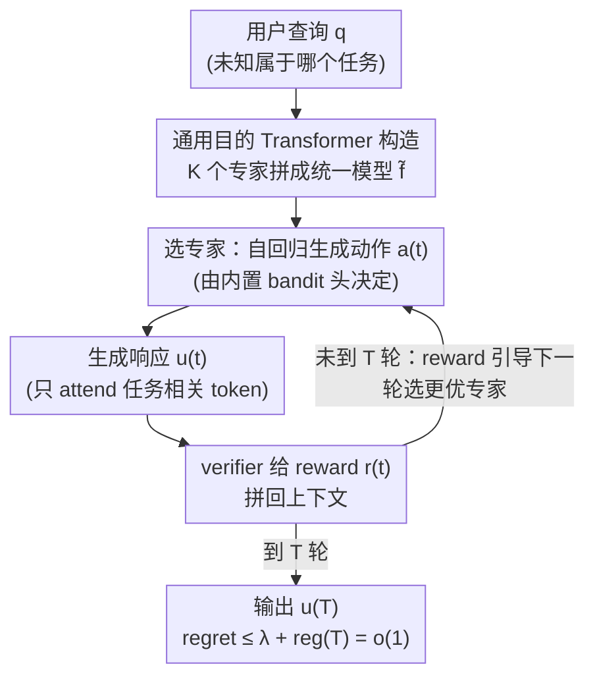

# Sample Complexity and Representation Ability of Test-time Scaling Paradigms

**会议**: ICLR 2026  
**OpenReview**: [https://openreview.net/forum?id=RJDIX75TEE](https://openreview.net/forum?id=RJDIX75TEE)  
**代码**: https://github.com/LithiumDA/Representation-Ability-of-Test-time-Scaling  
**领域**: 学习理论 / LLM推理 / Test-time Scaling  
**关键词**: 样本复杂度, 自一致性, best-of-n, 自我纠错, Transformer 表达力

## 一句话总结
这篇论文从理论上刻画了三种 test-time scaling 策略的效率：证明了 self-consistency 需要 $\Theta(1/\Delta^2)$ 个样本、best-of-n 只需 $\Theta(1/\Delta)$ 个样本（$\Delta$ 是正确答案与次优答案的概率间隙），并构造性地证明了带 verifier 反馈的自我纠错能让单个 Transformer 在测试时模拟"在多专家上做在线学习"，从而把 Transformer 的表达力理论从单任务推广到多任务。

## 研究背景与动机
**领域现状**：test-time scaling（推理时增加算力）已经成为提升 LLM 复杂任务能力的主流路线，催生了 o1、DeepSeek-R1 这类推理模型。常用做法分两类——一类是重复采样后做选择（self-consistency 投票选最频繁答案、best-of-n 选 reward 最高答案），另一类是自我纠错（self-correction，让模型根据反馈一轮轮修正自己的输出）。

**现有痛点**：这些方法的经验效果很好，但理论理解严重滞后。两个最基本的问题都没答案：(1) 重复采样到底需要多少样本才能可靠地选出正确答案？self-consistency 和 best-of-n 谁更省样本、差距有多大？(2) 自我纠错为什么"有用"？它和重复采样的本质区别在哪？

**核心矛盾**：重复采样的所有尝试是 i.i.d. 的——再多采样也只是把同一个分布重复抽样，正确率天花板被分布本身锁死；而自我纠错的输出**不是** i.i.d. 的，后一轮依赖前一轮的 verifier 反馈。这个依赖结构上的差异，恰恰是理论分析的难点，也是自我纠错能"越改越对"的根源。与此并行的是：以往 Transformer 表达力理论几乎只研究"能不能表示某一个固定任务"，而真实 LLM 在测试时要同时应对多种未知任务，多任务表达力几乎没人从理论上刻画。

**本文目标**：分解为两个子问题——给出 self-consistency 与 best-of-n 的**精确样本复杂度**（含匹配的上下界），以及刻画自我纠错的**多任务表达力**。

**核心 idea**：用一个概率间隙 $\Delta$ 统一刻画重复采样的难度，揭示两种策略 $\Theta(1/\Delta^2)$ vs $\Theta(1/\Delta)$ 的本质分离；再把自我纠错重新解释为"测试时在一组专家上跑在线学习/regret 最小化"，并给出一个与专家内部参数无关的通用 Transformer 构造来证明其表达力。

## 方法详解

### 整体框架
全文是一篇理论分析，分成两条相对独立的主线，对应导言提出的两个问题。第一条线分析**重复采样**：把"选出正确答案"的难度归结到一个标量——概率间隙 $\Delta := p(o^*) - \max_{o \neq o^*} p(o)$，其中 $p(o)$ 是对所有推理路径边缘化后生成答案 $o$ 的概率、$o^*$ 是正确答案。在 $\Delta > 0$（最可能答案即正确答案）的设定下，分别给出 self-consistency 和 best-of-n 的样本复杂度上界与下界，得到 $\Theta(1/\Delta^2)$ 与 $\Theta(1/\Delta)$ 的分离。

第二条线分析**自我纠错**的表达力。作者先提出"通用目的 Transformer"（General-Purpose Transformer）这个元构造，把任意 $K$ 个任务专属的专家 Transformer 拼成一个统一 Transformer；再证明这个统一模型配上 verifier 反馈后，能按 Algorithm 1 的协议自回归地"选专家 → 生成响应 → 拿 reward → 更新上下文"，本质上是在专家池上执行一个 regret 最小化（bandit）算法，最终以 $o(1)$ 的 regret 收敛到最优专家。下图就是这条自我纠错主线的测试时在线学习回路：

需要强调的是：图中"选专家/生成/反馈"的回路完全发生在**单个统一 Transformer 的内部计算**里，不像传统路由那样显式去查询外部专家——这正是表达力结果的关键。

### 关键设计

**1. 用概率间隙 $\Delta$ 刻画的样本复杂度分离**

这一设计针对的痛点是"重复采样到底谁更省样本"。作者把难度压缩到单个量 $\Delta$ 上：它衡量正确答案与次优答案在边缘化分布上的概率差距，$\Delta$ 越小问题越难。对 self-consistency（Theorem 3.1），当样本数 $n \geq C\log(O/\delta)/\Delta^2$（$O=|\mathcal{O}|$ 是答案空间大小）时能以 $1-\delta$ 概率选对，而当 $n \leq c/\Delta^2$ 时存在硬实例使其以常数概率失败——上下界匹配（至多差对数因子），故复杂度是 $\Theta(1/\Delta^2)$。对 best-of-n（Theorem 3.2），在 reward 仅在正确答案处最大的假设下，$n \geq C\log(1/\delta)/\Delta$ 即可成功、$n \leq c/\Delta$ 则有硬实例失败，故为 $\Theta(1/\Delta)$。

二者的分离来自机制差异：self-consistency 靠**计数投票**，要把正确答案的经验频率从噪声里区分出来，本质是要让两个伯努利比例的差距超过统计涨落，这天然带来 $1/\Delta^2$ 的二次依赖；而 best-of-n 有一个能识别正确答案的 reward 打分器，只要正确答案**至少被采到一次**就能被选出，所需样本随 $1/\Delta$ 线性增长。这从理论上解释了实践中"best-of-n 通常比 self-consistency 准"的观察。

**2. 通用目的 Transformer：把多个专家无损拼成一个统一架构**

这一设计针对"Transformer 多任务表达力缺乏刻画"的痛点。作者定义类型为 $(t_1, t_2)$ 的通用目的 Transformer $\phi$：它把任意一组隐藏维 $d$、深度 $L$ 的专家 Transformer，映射成一个隐藏维 $t_1 \cdot d + t_2$、深度 $L + O(1)$ 的统一 Transformer，且**不依赖**专家的内部参数。核心机制是用注意力的"选择性 attend"实现隐式的函数调用：当 $K$ 个专家词表互不相交时（Proposition 4.2），统一模型用输入末尾 token 推断当前任务 $\kappa$、然后只对属于 $V_\kappa$ 的 token 做注意力，等价于直接调用专家 $f_\kappa$；当专家共享词表时（Proposition 4.4），改用一组指示 token $\Omega$ 来界定任务边界，同样实现"只看任务相关片段"。

类型参数 $(O(K), O(\log N_{\max}))$ 基本不可约：对 $K$ 的依赖来自模型事先不知道任务、必须保留调用任意专家的能力，因此要编码全部 $K$ 个专家的特征；$\log N_{\max}$ 来自位置编码——要构造 $N_{\max}$ 个近似正交的向量，嵌入维度至少要 $\log N_{\max}$。这个构造之所以重要，是它第一次给出"单一架构可证地同时表达多任务"的通用机制，把表达力理论从单任务推到多任务。

**3. 自我纠错 = 测试时在线学习，regret 收敛到 $o(1)$**

这一设计回答"自我纠错为什么有用、和重复采样有何本质区别"。作者先定义 regret-minimization Transformer（Definition 4.6）：它在动作空间 $\mathcal{A}$ 和 reward $r$ 上，按 $a_t \sim p_f(\cdot \mid a_1, R_1, \dots, a_{t-1}, R_{t-1})$ 自回归地选动作，并保证 simple regret $\max_{a^*} r(a^*) - \mathbb{E}[r(a_T)] \leq \mathrm{reg}(T) = o(1)$——这其实就是让 Transformer 实现 UCB、Thompson sampling 这类 bandit 算法（已有构造可达到 $O(1/\sqrt{T})$ 平均 regret）。

主结果 Theorem 4.7 把它和"设计 2"的通用构造组合起来：给定 $K$ 个专家（其中某个专家 $f_{k^*}$ 能取得 $\lambda$-次优 reward）和一个 regret-minimization Transformer $f_0$，存在通用目的 Transformer $\phi$ 使得 $\tilde f = \phi(f_0, f_1, \dots, f_K)$ 按 Algorithm 1 的"选专家—生成—查 verifier—迭代"协议运行后，满足 $\max_{u^*} r(q, u^*) - \mathbb{E}[r(q, u^{(T)})] \leq \lambda + \mathrm{reg}(T)$。也就是说，统一模型能在测试时**自己学出**哪个专家最合适，无需事先知道任务身份。这恰好揭示了与重复采样的根本差异：重复采样每次尝试同分布、天花板固定；自我纠错可以根据 verifier 反馈更新尝试，让生成正确答案的概率随推理推进而上升。作者还指出借助问题/专家池的结构，可以用 $\ll K$ 次试验找到正确专家，而非暴力遍历。

### 一个完整示例
以导言里的 PDE 求解为例（也对应 Figure 1）：用户给出一个偏微分方程 $\frac{1}{c(x)^2}\frac{\partial^2 u}{\partial t^2} - \Delta u = 0$，模型并不知道该用哪个求解器。统一 Transformer $\tilde f$ 先自回归生成一个动作（例如"选第 6 个专家"），再据此构造并运行对应的求解器（如谱方法）得到响应，verifier 用负的求解误差作为 reward 反馈回上下文；下一轮模型基于历史动作—响应—reward 选择可能更好的专家（如有限元方法精度更高），如此 $T$ 轮逐步把 regret 压到 $o(1)$，最终输出误差最小的解。整个"试错—学习"过程都在一个 Transformer 内部完成。

## 实验关键数据

实验是**合成验证**，目的是佐证理论而非刷 SOTA，分两组。

### 主实验

第一组（自我纠错的表达力）：构造一个单轮很难、需要纠错的合成任务——prompt 拼接一个 4 变量 20 子句的 3-SAT 实例和一个由 $\{a,b\}$ 组成的字符串；若 3-SAT 可满足则输出复制该字符串、否则输出其逆序。训练集可满足/不可满足比例设为 9:1、测试集设为 1:1，刻意制造"第一次容易答错"的分布偏移来诱发纠错行为。在不同规模 Transformer 上对比有无 verifier 反馈：

| 模型 | 无自我纠错 | 有自我纠错 |
|------|-----------|-----------|
| GPT-nano | 1.23% | 2.56% |
| GPT-micro | 63.19% | 93.09% |
| GPT-mini | 63.19% | 98.57% |
| Gopher-44M | 63.19% | 99.15% |

不带纠错时准确率卡在 63.19%、增大模型也不涨；一旦给 verifier 信号，足够大的模型（GPT-mini、Gopher-44M）能逼近满分——印证了"实现有效自我纠错需要额外的模型容量"。

第二组（样本复杂度分离）：在真实数学推理基准 AIME 24 & 25 上，用 Qwen3-1.7B/4B、Llama-3.2-3B-Instruct 作候选模型、Qwen3-32B 作 verifier，对比三种策略：

| 模型 | Self-consistency (64 样本) | Best-of-n (4 样本) | Self-correction (4 样本) |
|------|---------------------------|--------------------|--------------------------|
| Qwen3-1.7B | 58.33% | 59.68% | 79.29% |
| Qwen3-4B | 78.33% | 80.58% | 81.19% |
| Llama-3.2-3B-Instruct | 1.67% | 4.84% | 24.52% |

**只用 4 个样本的 best-of-n 全面超过用 64 个样本的 self-consistency**，直接验证了 $\Theta(1/\Delta)$ vs $\Theta(1/\Delta^2)$ 的样本复杂度差距；自我纠错（同样 4 样本）则进一步领先，在最弱的 Llama-3.2-3B 上从 1.67% 拉到 24.52%。

### 关键发现
- 自我纠错的收益高度依赖模型容量：GPT-nano 几乎不会纠错（2.56%），而中等以上模型能借 verifier 逼近满分——表达力是"门槛"而非"渐变"。
- best-of-n 的样本效率优势是数量级的：4 样本即可压过 64 样本的 self-consistency，与理论 $\Delta$ 平方 vs 线性的分离一致。
- 弱模型（Llama-3.2-3B）从验证型策略中获益最大，说明 verifier 反馈对"自身分布不够尖锐"的模型尤其关键。

## 亮点与洞察
- 用单一标量 $\Delta$（概率间隙）统一刻画重复采样难度，是把"经验上 best-of-n 更好"翻译成可证 $\Theta(1/\Delta)$ vs $\Theta(1/\Delta^2)$ 的关键抽象——上下界都匹配，结论很干净。
- "通用目的 Transformer"是个可独立复用的构造工具：把多个专家无损拼成一个、且与专家内部参数无关，为"单一架构多任务表达力"提供了通用模板，超出本文 self-correction 的范围。
- 把自我纠错重新解释为"测试时在专家池上做在线学习/regret 最小化"，给 In-Context RL 和 verifier-based test-time scaling 提供了统一的理论视角——自我纠错之所以强于重复采样，根因就是它打破了 i.i.d.、能根据反馈更新尝试。

## 局限与展望
- 表达力结果是**存在性构造**：证明了"存在这样一个统一 Transformer"，但没说现实中训练出来的 LLM 是否真的学到了这种结构，构造也偏向理论而非高效实现（Remark 也承认可超越暴力遍历但未给具体高效算法）。
- regret 保证依赖较强假设：需要一个理想的 verifier（reward 仅在正确答案处最大）、以及存在能实现 bandit 算法的 regret-minimization Transformer；真实 verifier 有噪声、可被 reward hacking 时结论会打折。
- 样本复杂度分析建立在 $\Delta > 0$（最可能答案即正确答案）的前提下；当模型本身有偏（$\Delta \leq 0$）时 self-consistency 直接失效，理论不覆盖这类更现实的"模型系统性答错"场景。
- 实验以合成 3-SAT 任务和小模型为主，AIME 部分样本预算也很小（4 vs 64），跨任务难度/不同采样预算的横向比较需谨慎，不能直接外推到大模型大预算。

## 相关工作与启发
- **vs 进展锐化 / generation-verification gap（Huang et al. 2024a；Song et al. 2024b）**: 他们用 progressive sharpening 或生成-验证间隙刻画自我改进的标度行为，偏定性；本文给出**显式的样本复杂度率**和**具体的表示架构**，对能力与极限的刻画更可量化。
- **vs verifier-based RL 理论（Setlur et al. 2025）**: 他们从 RL 理论论证 verifier 方法的优势；本文在**重复采样内部**（self-consistency vs best-of-n）给出更细粒度的 $\Delta$ 依赖分离，并把自我纠错纳入同一 bandit/在线学习框架。
- **vs Transformer 表达力经典工作（Yun et al. 2020；Feng et al. 2023）**: 这些工作多聚焦单任务的通用逼近或 CoT 表达力；本文提出 general-purpose expressiveness，把表达力理论显式推广到"单架构多任务"，且构造与具体专家无关。

## 评分
- 新颖性: ⭐⭐⭐⭐⭐ 首次给出 self-consistency vs best-of-n 的匹配样本复杂度分离，并把自我纠错刻画为多任务在线学习，视角新。
- 实验充分度: ⭐⭐⭐ 合成任务 + 小规模 AIME 验证，足以佐证理论，但远非大规模实证。
- 写作质量: ⭐⭐⭐⭐ 定理与直觉结合清晰，$\Delta$ 抽象和 Algorithm 1 把抽象理论讲得可读。
- 价值: ⭐⭐⭐⭐⭐ 为 test-time scaling 的策略选择与自我纠错的有效性提供了可证依据，理论指导意义强。

<!-- RELATED:START -->

## 相关论文

- [\[ICLR 2026\] Mitigating the Curse of Detail: Scaling Arguments for Feature Learning and Sample Complexity](mitigating_the_curse_of_detail_scaling_arguments_for_feature_learning_and_sample.md)
- [\[ICLR 2026\] Expressive Power of Implicit Models: Rich Equilibria and Test-Time Scaling](expressive_power_of_implicit_models_rich_equilibria_and_test-time_scaling.md)
- [\[ICLR 2026\] Test-Time Verification via Optimal Transport: Coverage, ROC, & Sub-Optimality](test-time_verification_via_optimal_transport_coverage_roc_sub-optimality.md)
- [\[ICLR 2026\] How hard is learning to cut? Trade-offs and sample complexity](how_hard_is_learning_to_cut_trade-offs_and_sample_complexity.md)
- [\[ICLR 2026\] Near-Optimal Sample Complexity Bounds for Constrained Average-Reward MDPs](near-optimal_sample_complexity_bounds_for_constrained_average-reward_mdps.md)

<!-- RELATED:END -->
