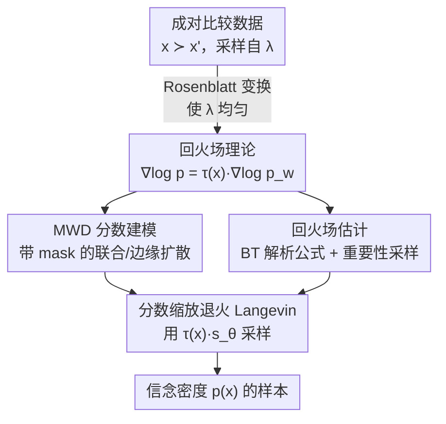

# Score-Based Density Estimation from Pairwise Comparisons

**会议**: ICLR 2026  
**OpenReview**: [https://openreview.net/forum?id=hYojmwkXwQ](https://openreview.net/forum?id=hYojmwkXwQ)  
**代码**: https://github.com/petrus-mikkola/pairwise2diffusion  
**领域**: 学习理论 / 概率方法 / 分数匹配 / 专家知识获取  
**关键词**: 成对比较, 分数匹配, 扩散模型, 回火场, 随机效用模型

## 一句话总结
本文证明了"目标信念密度的分数"与"可观测的胜者边缘密度的分数"之间存在一个**逐点共线**的精确关系——二者被一个位置相关的「回火场」$\tau(x)$ 连接，从而把"只能拿到成对比较 $x \succ x'$"这种几乎无法直接学密度的难题，转化为"用分数模型学胜者密度 + 估一个回火场再反回火"的可解流程，仅用数百到数千次成对比较就能学到复杂的多峰信念密度。

## 研究背景与动机
**领域现状**：用归一化流、扩散模型从样本 $x \sim p(x)$ 学复杂密度已经相当成熟，高维自然图像都能学得不错。但很多现实场景拿不到 $p(x)$ 的样本，只能拿到人/专家对两个候选的**偏好比较**：给定 $x$ 与 $x'$（它们采样自一个与 $p$ 无关的采样分布 $\lambda$），专家只告诉你"哪个更可能/更好"，即三元组 $(x, x', x \succ x')$。这正是统计学里的「专家先验获取」（prior elicitation）以及"用成对偏好量化 LLM 的概率化知识"、"从人类反馈学习"的核心设定。

**现有痛点**：成对比较只反映"谁的密度更高"这一序关系，并不直接给出密度本身，从这种数据里恢复 $p(x)$ 本质上是个欠定问题。此前 Mikkola et al. (2024) 给出了第一个解法：用归一化流从比较与排序里学密度，并**经验性地**观察到 $p(x)$ 像是胜者点分布的某个**常数回火**版本 $p(x) \approx [p_w(x)]^\tau$。但这个 link 只是启发式的、缺乏理论刻画；而且流方法需要额外正则来防止"概率质量逃逸"，并且要靠更费力的多项排序（multiple-item ranking）才能达到最佳精度。

**核心矛盾**：常数回火 $p \approx p_w^\tau$ 在数学上**根本不成立**——一个全局常数 $\tau$ 无法在所有位置同时对齐两个密度的形状，只能近似，这是流方法精度受限、低密度区被高估的根因。

**本文目标**：(1) 给出 $p(x)$ 与可观测的**胜者边缘密度** MWD $p_w(x)$ 之间的精确关系；(2) 基于此关系设计一个只用**成对比较**（最易回答、最可靠）的实用密度估计算法。

**切入角度**：既然此前的关系是"密度层面的近似回火"，作者改从**分数（score）层面**重新审视——因为对一个常数回火密度 $p \propto q^\tau$，其分数恰好满足 $\nabla \log p = \tau \nabla \log q$（两分数严格共线）。把这个观察推广到"局部、逐点"的回火，也许就能得到一个**精确**关系。

**核心 idea**：用一个**位置相关的回火场** $\tau(x)$（而非常数 $\tau$）连接两个分数：$\nabla \log p(x) = \tau(x)\, \nabla \log p_w(x)$。学胜者密度的分数用分数匹配解决，回火场用 Bradley–Terry 模型的解析公式估计，最后用「分数缩放的退火 Langevin 动力学」从 $p(x)$ 采样。

## 方法详解

### 整体框架
本文要解决的是：手里只有成对比较数据 $\mathcal{D} = \{[x_i, x_i'] \mid x_i \succ x_i'\}$，目标是恢复专家的信念密度 $p(x)$。整套方法的核心洞察是把"恢复 $p$"拆成两件可分别求解的事——**学一个能观测的代理密度（胜者密度 $p_w$）的分数**，再**乘上一个把代理分数"反回火"成目标分数的场 $\tau(x)$**——因为本文证明了 $\nabla \log p(x) = \tau(x)\nabla \log p_w(x)$。

具体地，假设专家选择服从随机效用模型（RUM），效用为 $u(x) = \log p(x)$；两个候选独立采样自 $\lambda(x)$，专家选中点的密度就是**胜者边缘密度（MWD）** $p_w(x) = \int p_{x\succ x'}(x,x')\,dx'$。整个 pipeline 是：(1) 用一个带 mask 机制的扩散模型同时学胜者—败者联合分布及其边缘 MWD 的分数；(2) 在 Bradley–Terry 模型下用解析公式 + 重要性采样估计回火场 $\tau(x)$；(3) 用 $\tau(x)$ 缩放后的分数 $\tau(x)s_\theta(x,\sigma)$ 跑退火 Langevin 动力学，采出 $p(x)$ 的样本。为处理非均匀的 $\lambda$，先用 Rosenblatt 变换把空间重参数化为均匀，扩散模型在变换后的空间训练，样本再逆变换回去。

### 关键设计

**1. 回火场：把"密度层面的常数回火"升级为"分数层面的逐点共线"**

这一设计直击常数回火 $p \approx p_w^\tau$ 不成立的痛点。作者先定义：若 $\tau: \mathcal{X} \to (0,\infty)$ 使两密度分数几乎处处满足
$$\nabla \log p(x) = \tau(x)\, \nabla \log p_w(x),$$
则称 $\tau$ 为 $p$ 与 $p_w$ 之间的**回火场**。这表示两个分数向量在每个位置都**共线**，只是缩放系数随位置变化。关键贡献是：在两类 RUM（Bradley–Terry 与指数 RUM）下，这样的回火场**确实存在且有闭式**。对 $W \sim \mathrm{Gumbel}(0,s)$ 的 Bradley–Terry 模型（定理 3.1），
$$\tau(x) = s\left(\frac{\int_\mathcal{X} \frac{1}{1+r_s(x,x')}\,dx'}{\int_\mathcal{X} \frac{r_s(x,x')}{(1+r_s(x,x'))^2}\,dx'}\right),\qquad r_s(x,x') := p^{1/s}(x')\,p^{-1/s}(x),$$
其中 $r_s$ 是 $1/s$-回火的"同一密度在两个输入上的比值"。这个关系之所以强，是因为它把"从比较学密度"这个欠定问题，约化成"学一个可观测的 $p_w$ 的分数 + 求一个标量场"，且**只要 $\tau(x)$ 已知就能精确恢复 $p$**。作者还用 Fisher 散度 $\mathcal{F}(p,q)=\int \|\nabla\log p - \nabla\log q\|^2 p\,dx$ 量化逼近误差，并证明（命题 3.2/3.3）：最优常数回火 $\tau^\star = \mathbb{E}_{X\sim p}[\omega(X)\tau(X)]$ 只是回火场按分数模长加权的期望，常数回火的残差 $\mathcal{F}(p,q^\tau)=\mathbb{E}_{X\sim p}[|\tau-\tau(X)|^2\|\nabla\log q(X)\|^2]$ 恰好刻画了"用常数代替场"的代价——这从理论上解释了为何此前的常数回火法精度受限。

**2. 带 mask 的 MWD 分数建模：用一个网络同时吃胜者和败者，并能边缘化出 $p_w$**

要用上面的关系，必须先拿到 $\nabla \log[p_w(x) * \mathcal{N}(0,\sigma^2 I)]$ 的估计。痛点是：MWD 是联合密度 $p_{x\succ x'}(x,x')$ 的边缘，若只用胜者点训练，就浪费了"败者点也携带'此处胜者更少'的信息"。作者的做法是把分数网络参数化为 $s_\theta(x, x', \sigma, \text{joint}, \text{temp})$，用条件 flag 控制行为：`joint=1` 时网络同时吃 $x,x'$、建模联合分数 $\nabla\log p_{x\succ x'}$；`joint=0` 时把败者 $x'$ 用噪声 mask 掉，网络只建模边缘 MWD 分数 $\nabla\log p_w(x)$；`temp=1` 则把输出额外乘上回火场，直接给出 $\tau(x)\nabla\log p_w(x)=\nabla\log p(x)$。训练时**以 0.5 概率随机 mask 败者**，于是单个网络通过去噪分数匹配（DSM, 式 1）既学到联合分布、又能边缘化出 MWD，并支持从信念密度采样。架构上紧贴 EDM 风格，用扰动核 $p_\sigma(\tilde x|x)=\mathcal{N}(\tilde x; x, \sigma^2 I)$。这种"联合 + mask 边缘化"比"只用胜者"更准，因为它显式利用了败者信息。

**3. 回火场估计：把闭式公式里的密度比交给一个简单 MLE 网络 + 重要性采样**

回火场公式（式 6）形式很友好——它只依赖**信念密度比** $r(x,x') := p(x')/p(x)$ 和 RUM 噪声级 $s$，**与归一化常数无关**，因此可直接用极大似然估计。注意这里的"密度比"是同一密度在两个输入上的比，不是两个不同密度之比。作者用一个神经网络 $r_\theta$ 参数化（密度比或其对数），通过最大化 Bradley–Terry 似然来训练，损失为
$$\mathcal{L}(\theta) \propto \mathrm{Softplus}\!\left(\log r_\theta(x,x')/s\right),$$
其中 $x,x'$ 分别是胜者、败者点，Softplus 损失来自 $W\sim\mathrm{Gumbel}(0,s)$ 的假设。把学到的 $r_\theta$ 代回式 6 的积分，积分用**重要性采样**估计，且**用训练好的 MWD 模型当重要性采样器**（重要性权重对应 MWD 扩散模型密度的倒数）。得到的插值蒙特卡洛估计量是一致但有偏的——这与自归一化重要性采样、强化学习里 every-visit 离策略值估计同款，因其方差性质更好而被接受。

**4. 分数缩放的退火 Langevin 采样：用 $\tau(x)s_\theta$ 直接采信念密度**

有了 MWD 分数网络 $s_\theta(x,\sigma)$ 和回火场估计 $\tau(x)$，就能从 $p(x)$ 采样：在退火 Langevin 动力学（ALD, 式 2）里把分数替换成 $\tau(x)s_\theta(x,\sigma)$ 即可。回火场关系（式 5）表明，当 $\sigma=0$ 时这个过程等价于直接从 $p(x)$ 采样，且 ALD 在小噪声极限下理论上成立，因此它是天然合适的采样器。代价是：$\sigma>0$ 时该过程并非精确（因为回火场是为 $\sigma=0$ 的真实分数推导的，对加噪后的分数只是近似），作者实验证明其经验效果很好，但精确的误差刻画留作未来工作。

### 损失函数 / 训练策略
- **MWD 网络**：去噪分数匹配 $\mathcal{L}(\theta)=\mathbb{E}_{x}\mathbb{E}_{\sigma}\mathbb{E}_{\tilde x}\,\ell(\sigma)\|\nabla_{\tilde x}\log p_\sigma(\tilde x|x)-s_\theta(\tilde x,\sigma)\|^2$，训练中以 0.5 概率把败者替换为 $\mathcal{N}(0,\sigma_t^2 I)$ 噪声、置 `joint=0`，实现联合与边缘的混合训练；采用 EDM 风格的 MLP 分数网络与噪声调度 $\sigma_{\min}\to\sigma_{\max}$。
- **密度比网络**：Softplus 形式的 Bradley–Terry 似然，需谨慎做 $\ell_2$ 正则（正则与噪声级 $s$ 的设定都会影响场的整体尺度与尾部）。
- **采样**：沿递减噪声调度 $\sigma_{\max}=\sigma_T>\dots>\sigma_1=\sigma_{\min}$ 跑 $\tau(x)$-缩放的 ALD。

## 实验关键数据

设定：$d$ 维目标查询 $1000d$ 次成对比较（远低于扩散模型常见的大样本规模）。$d\le 4$ 时 $\lambda$ 均匀，$d>4$ 时 $\lambda$ 取对角高斯（方差为目标的 3 倍）。专家模拟用 Bradley–Terry、效用 $\log p$、噪声 $s=\sqrt{6/\pi^2}$（单位方差）。指标为 Wasserstein 距离与平均边缘总变差 MMTV，均越低越好。对比基线是 Mikkola et al. (2024) 的流方法；本文两个变体为 score–$\tau(x)$（完整回火场）与 score–$\tau^\star$（命题 3.2 的最优常数回火）。

### 主实验

| 目标分布 $p(x)$ | Wasserstein flow | Wasserstein score–$\tau(x)$ | MMTV flow | MMTV score–$\tau(x)$ |
|---|---|---|---|---|
| Onemoon2D | 1.37 | **0.37** | 0.54 | **0.22** |
| Twomoons2D | 1.29 | **0.44** | 0.53 | **0.14** |
| Ring2D | 0.87 | **0.39** | 0.40 | **0.26** |
| Gaussian4D | 6.12 | **1.40** | 0.72 | **0.44** |
| Mixturegaussians4D | 3.75 | **1.09** | 0.53 | **0.22** |
| Stargaussian6D | 2.25 | **1.28** | 0.19 | **0.16** |
| Mixturegaussians10D | 1.41 | **1.33** | 0.19 | 0.26 |
| Gaussian16D | 5.50 | **5.00** | 0.16 | **0.13** |

低维 + 均匀采样（实验 1）上分数法全面占优，Wasserstein 至少降 50%、MMTV 至少降 25%。可视化显示流方法明显高估低密度区，本文估计"几乎完美"。

### 消融实验

| 配置 | 表现 | 说明 |
|---|---|---|
| score–$\tau(x)$（完整场） | 多数任务最好 | 逐点回火，能对齐密度形状 |
| score–$\tau^\star$（常数回火） | 略逊于 $\tau(x)$，但仍胜流方法 | 验证"建模整个场"的价值 |
| flow（基线） | 最差 | 常数回火 + 流，低密度区被高估 |

高维 + 高斯采样（实验 2）上 Wasserstein 仍胜流方法，但 MMTV 二者接近——偶尔因高估回火场导致边缘过紧，拖累 MMTV。实验 3 用 Claude 3 Haiku 当专家代理、仅 220 次成对比较查询加州房产信念，估计出的边缘（如 AveRooms、MedInc）与经验数据分布形状相似，验证了即便数据不严格服从 RUM 也适用。

### 关键发现
- **建模整个回火场 $\tau(x)$ 通常优于最优常数 $\tau^\star$**，但即便退化到常数回火，本文也已胜过流方法——说明"切换到分数视角 + 联合 mask 建模"本身就带来增益，逐点场是锦上添花。
- **流方法的系统性失败模式**是高估低密度区（如 Ring2D 圆环中心被过采样），因为常数回火无法在中心 downweight；本文用回火场恰好能压低这些位置。
- **失败模式**：高维高斯采样下偶发回火场高估 → 边缘过紧 → MMTV 变差；极端少样本（< $100d$ 次比较）下扩散模型训练不稳，需要仔细调超参。

## 亮点与洞察
- **从"密度近似"换到"分数精确"的视角跃迁**：常数回火 $p\approx p_w^\tau$ 永远只能近似，但放到分数层面、允许逐点缩放，就得到一个**精确恒等式** $\nabla\log p=\tau(x)\nabla\log p_w$——这是把一个老 heuristic 升级成定理的关键一招，思路可迁移到任何"两密度形状相关但不等"的场景。
- **回火场闭式只依赖密度比、与归一化常数无关**，所以能用极简的 Bradley–Terry MLE 估出来，绕开了从比较数据估配分函数的老大难问题。
- **一个网络靠 mask flag 同时承担联合建模与边缘化**：用 0.5 概率随机 mask 败者，把"联合 + 边缘 + 回火输出"统一进一个分数网络，既榨干败者信息又支持直接采信念密度，是很可复用的多任务分数建模 trick。
- **用 MWD 扩散模型自己当重要性采样器**去估回火场积分，闭环复用、省掉额外采样器。

## 局限与展望
- **作者承认的局限**：(1) $\sigma>0$ 时分数缩放 ALD 非精确，误差未刻画；(2) 回火场估计对密度比网络 $r_\theta$ 的正则、RUM 噪声级 $s$ 敏感，错配会导致回火场系统性欠估/高估；(3) 相比流方法，本文采样需数值求解概率流 ODE，更慢、逐点密度评估也更不稳。
- **采样分布 $\lambda$ 决定难度**：当 $p$ 的支撑远小于 $\lambda$ 时，两个候选都落在低密度区的概率剧增，几乎无法学好 $p$；高维更甚。作者建议引入主动学习把采样集中到 $p$ 的高密度区。
- **理论覆盖面**：闭式回火场只对 Bradley–Terry 与指数 RUM 证明，像 Thurstone–Mosteller 这类选择概率需积分的模型不保证有闭式。
- **应用展望**：$p$ 与 $p_w$ 的连接或可用于用成对数据微调生成模型——当 $\lambda$ 是某 prompt $c$ 条件下的预训练生成模型时，在个体级数据上训练 MWD 与回火场可得到概率化奖励模型 $\text{reward}(c,x)=p(x|c)$。

## 相关工作与启发
- **vs Mikkola et al. (2024)（流 + 常数回火）**：他们经验性地用常数回火 $p\approx p_w^\tau$ + 归一化流，需要额外正则防质量逃逸、且靠多项排序才达最佳精度；本文给出**逐点回火场的精确理论**、切换到分数模型、只用最易回答的成对比较，精度大幅提升（Wasserstein 降 ≥50%）。区别在于本文把启发式 link 升级为定理并据此重设计算法。
- **vs 标准分数/扩散生成（Song & Ermon; Karras et al. EDM）**：常规分数模型从 $p$ 的直接样本学分数；本文拿不到 $p$ 的样本，只能学**可观测代理 $p_w$** 的分数，再用回火场反推到 $p$，把分数生成工具引入了"从比较学密度"这一全新设定。
- **vs 奖励建模 / 从人类反馈学习（Ouyang et al.; Dumoulin et al.）**：RLHF 把偏好当奖励信号；本文把"隐式偏好分布"显式刻画为概率密度并给出可估计的分数关系，为概率化奖励模型提供了理论接口。

## 评分
- 新颖性: ⭐⭐⭐⭐⭐ 把"常数回火近似"升级为"逐点回火场精确恒等式"，并据此把分数模型引入从比较学密度，理论与方法都新。
- 实验充分度: ⭐⭐⭐⭐ 覆盖 2D–16D 多种几何/多峰目标 + LLM 代理实验，但真实人类专家实验缺席，高维 MMTV 偶有退化。
- 写作质量: ⭐⭐⭐⭐⭐ 理论铺垫（回火场定义、定理、命题）层层递进，方法与算法伪代码清晰。
- 价值: ⭐⭐⭐⭐ 为专家先验获取、LLM 概率化知识量化、偏好驱动的生成模型微调提供了可落地的理论基础与算法。

<!-- RELATED:START -->

## 相关论文

- [\[ICLR 2026\] A Minimum Variance Path Principle for Accurate and Stable Score-Based Density Ratio Estimation](a_minimum_variance_path_principle_for_accurate_and_stable_score-based_density_ra.md)
- [\[ICLR 2026\] Minimax-Optimal Aggregation for Density Ratio Estimation](minimax-optimal_aggregation_for_density_ratio_estimation.md)
- [\[ICLR 2026\] On the Interpolation Effect of Score Smoothing in Diffusion Models](on_the_interpolation_effect_of_score_smoothing_in_diffusion_models.md)
- [\[ICLR 2026\] Convergence Dynamics of Over-Parameterized Score Matching for a Single Gaussian](convergence_dynamics_of_over-parameterized_score_matching_for_a_single_gaussian.md)
- [\[ICLR 2026\] Information Estimation with Discrete Diffusion](information_estimation_with_discrete_diffusion.md)

<!-- RELATED:END -->
