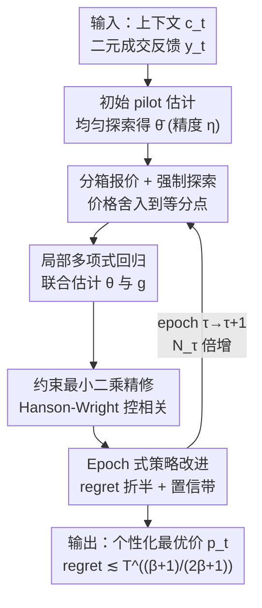

# Semi-Parametric Contextual Pricing with General Smoothness

**会议**: ICLR 2026  
**OpenReview**: [https://openreview.net/forum?id=HhdNIrn7WJ](https://openreview.net/forum?id=HhdNIrn7WJ)  
**代码**: 无  
**领域**: 学习理论 / 在线学习 / 动态定价  
**关键词**: 上下文定价, 半参数估计, β-Hölder 平滑, 局部多项式回归, regret 上界

## 一句话总结
针对"上下文 + 未知噪声分布"的动态定价问题，本文用「局部多项式回归 + 约束最小二乘 + 亚线性强制探索」拼出一个对任意平滑度 $\beta\ge 1$ 都成立的统一算法 LPSP，把 regret 上界做到 $\tilde O(T^{\frac{\beta+1}{2\beta+1}})$，一举统一并改进了此前 $\beta=1$ 的 $\tilde O(T^{2/3})$ 与 $\beta=2$ 的 $\tilde O(T^{3/5})$ 两个孤立结果。

## 研究背景与动机

**领域现状**：动态定价里有一类越来越受关注的"半参数"建模。每个用户带一个上下文向量 $c_t\in\mathbb{R}^d$ 到来，其私有估值为 $u_t=c_t^\top\theta_*+\xi_t$，其中 $\theta_*$ 是未知线性参数、$\xi_t$ 是 i.i.d. 噪声。卖家定价 $p_t$ 后只看到二元成交信号 $y_t=\mathbb{1}\{u_t\ge p_t\}$，拿到收入 $p_t y_t$。记噪声的尾分布 $g(z):=\mathbb{P}(\xi_t\ge z)=1-F_\Xi(z)$，则期望需求恰好是 $D(p)=g(c_t^\top\theta_*-p)$，条件收入为 $R(c_t,p)=p\,g(p-c_t^\top\theta_*)$。"参数线性效用 + 非参数未知噪声"的组合，比全参数模型更灵活、又比全非参数模型更可控，是单指标（single-index）模型在定价里的化身。

**现有痛点**：$g(\cdot)$ 的正则性（平滑度 $\beta$）直接决定需求辨识与决策的难度，但此前的结果是**割裂**的——Tullii et al. (2024) 在一阶平滑（$\beta=1$，Lipschitz）下给出 $\tilde O(T^{2/3})$，Wang & Chen (2025) 在二阶平滑（$\beta=2$）下给出 $\tilde O(T^{3/5})$，两套算法、两套分析，互不相通。唯一试图统一处理一般 $\beta\in[1,+\infty)$ 的 Fan et al. (2024) 给出 $\tilde O(T^{\frac{2\beta+1}{4\beta-1}})$，但它**既无法恢复** Wang & Chen 的 $T^{3/5}$，在 $\beta=1$ 时**甚至退化成线性 regret**（等于没学）。

**核心矛盾**：要利用高阶平滑性（大 $\beta$）压低非参数估计误差，就得用高次局部多项式去拟合 $g$；可一旦阶数 $\ell=\lfloor\beta\rfloor$ 升高，参数估计的扰动 $\theta-\theta_0$ 会通过多项式的高阶项被**放大**，在误差分解里留下一个 $O(\eta)$ 量级的项（$\eta$ 是 pilot 估计精度），累计成 $O(T\eta)=O(T^{\frac{3\beta+1}{4\beta+2}})$，远高于目标 $O(T^{\frac{\beta+1}{2\beta+1}})$。同时 Wang & Chen 为了保持局部设计矩阵良态，用了**线性时间**的强制探索，这在 $\beta=2$ 时勉强 OK，但 $\beta$ 一大探索成本就爆成 $T^{\frac{2\beta-1}{2\beta+1}}$，把 regret 拖垮。

**本文目标**：找一套**统一**的算法与分析，使得对所有 $\beta\ge 1$ 都拿到最优形态的 regret，并且在 $\beta=1,2$ 处分别恢复已知最优、当 $\beta\to\infty$ 时平滑过渡到参数化的 $\tilde O(\sqrt T)$。

**切入角度**：作者注意到，非上下文（non-contextual）定价的紧界恰是 $\tilde\Theta(T^{\frac{\beta+1}{2\beta+1}})$（Wang et al. 2021）。若能在上下文情形也做到同一指数，就意味着——在强单峰（strong uni-modality）假设下——上下文半参数定价**并不比**它的非上下文版本更难。这是一个很强且很干净的目标，值得为之设计统一框架。

**核心 idea**：把"参数部分 $\theta_*$"和"非参数部分 $g$"放进**一次联合的局部多项式回归 + 约束最小二乘**里同时估计，配合一段**亚线性长度的强制探索**保证局部设计矩阵良态，再套上 Wang & Chen 的 epoch 式策略改进 oracle 处理策略导致的分布漂移——四件套拼成对一般 $\beta$ 都成立的 $\tilde O(T^{\frac{\beta+1}{2\beta+1}})$ 算法 LPSP。

## 方法详解

### 整体框架

LPSP（Local Polynomial regression-based Semi-parametric Pricing）整体是"一次初始化 + 多个 epoch 循环"的结构。算法先用一段均匀探索拿到 pilot 估计 $\bar\theta$（精度 $\eta=T^{-\frac{\beta+1}{4\beta+2}}$）；随后进入按 $\tau$ 编号、长度 $N_\tau=2^\tau N_0$ 倍增的 epoch。每个 epoch 内做三件事：① 用上一 epoch 定下的随机策略 $\pi^{(\tau-1)}$ 报价收集数据，其中一小撮价格被**舍入**到分箱等分点上做强制探索；② 用本 epoch 数据跑联合半参数估计（局部多项式 + 约束 LSE），拼出全局估计 $\hat g_\tau$ 与置信带 $\mathrm{CB}_\tau$；③ 把 $(\hat g_\tau,\mathrm{CB}_\tau)$ 喂进策略改进 oracle $\mathcal A$，得到本 epoch 的新策略 $\pi^{(\tau)}$。整套设计的目的，是让 Theorem 9 的"分布平稳条件"在每个 epoch 内可用，从而把未舍入价格产生的 regret 控制住。

下面四个关键设计，从上到下对应框架里"强制探索 → 局部多项式 → 约束 LSE → 策略改进"四个贡献节点（pilot 初始化与输入输出是脚手架，不单列）。

### 关键设计

**1. Piloted 局部多项式回归：用 $\ell=\lfloor\beta\rfloor$ 阶多项式榨干高阶平滑性**

要利用 $\beta$ 阶平滑，就得对未知链接函数 $g$ 做高次局部拟合。算法把价值-价格间隙轴 $[-V,V]$ 切成 $M=\lceil 1/h\rceil$ 个等宽箱 $I_j$（精度 $h=n^{-\frac{1}{2\beta+1}}$），按 pilot $\bar\theta_0$ 把样本落箱；在每个箱 $I_j$ 内、对任意候选参数 $\theta$，用 $\ell=\lfloor\beta\rfloor$ 阶局部多项式拟合出 $\hat g_j(x\mid\theta)=U_j(x,\theta)^\top\Lambda_j(\theta)^{-1}\sum_{i\in T_j}y_i U_j(x_i,\theta)$，其中 $U_j(x,\theta)=(1,\Delta_j,\dots,\Delta_j^{\ell})^\top$、$\Lambda_j$ 是局部 Gram 矩阵。Proposition 6 给出一个**对数据采集方式不作任何要求**的确定性误差分解：拟合误差 = 「pilot 偏差项 $v_j(x,\theta)^\top\delta_j(\theta)$」+「噪声方差项」+「偏置项 $O(h^\beta(1+\sqrt{n_j}\|U_j\|_{\Lambda_j^{-1}}))$」。

这个分解既是统一性的来源，也是难点所在。在 $\beta=1$ 时 $\ell=0$，第一项 $v_j^\top\delta_j$ 直接消失，于是该误差经乐观（UCB）原则就能给出 $\tilde O(T^{2/3})$，**无需**强单峰假设，恰好恢复 Tullii et al. (2024) 的极小极大最优率；在非上下文情形（$c\equiv 0$）也能证 $v_j^\top\delta_j\equiv 0$，恢复 Wang et al. (2021) 的一般 $\beta$ 紧界。但一旦 $\beta>1$ 且有上下文，第一项里的 $\theta-\theta_0$ 只能给出 $O(\eta)$ 量级界，累计成 $O(T\eta)$ 远超目标——这正是必须引入下一个设计的动机。

**2. 约束最小二乘精修：把 $O(\eta)$ 项压成 $\eta^{\frac{2\beta}{\beta+1}}$，并用 Hanson-Wright 化解相关性**

为消掉第一项里那个致命的 pilot 偏差，作者不满足于初始 pilot，而是用局部拟合 $\hat g_j(\cdot\mid\theta)$ 反过来**精修参数**：在 $\|\theta-\bar\theta_0\|\le\eta$ 的约束下解约束最小二乘
$$\hat\theta_j\in\arg\min_{\|\theta-\bar\theta_0\|\le\eta}\sum_{i\in T_j}\big(y_i-\hat g_j(x_i\mid\theta)\big)^2.$$
这一步的分析难在**复杂的样本相关性**：$T_j$ 里所有样本既用于算 $\hat\theta_j$ 又用于算 $\hat g_j$，再叠加平方损失的非线性，依赖结构超出鞅范畴，Azuma–Hoeffding 之类标准不等式直接失效（作者指出 Wang & Chen 早期版本恰因忽略此相关性而无法严格得到其声称结果）。本文的关键观察是：在统一的局部多项式框架下，这个纠缠的联合最小二乘可被**约化为一个关于观测噪声的二次型集中**问题，进而用标准的 **Hanson-Wright 不等式**干净处理。Proposition 8 据此给出精修后的误差界 $|\hat g_j(x\mid\hat\theta_j)-g(x^\top\theta_0)|\lesssim \mathrm{Err}_j(x)+n^{-\frac{\beta}{2\beta+1}}$；进一步在分布层面（Theorem 9）得到 $\mathbb{E}_{x\sim Q_j}[\mathrm{Err}_j(x)]\lesssim d^4\log^2(1/\delta)(n_j^{-1/2}+n^{-\frac{\beta}{2\beta+1}})$。当 $n$ 线性于 $T$ 时，第二项从 $O(\eta)$ 改善成 $\eta^{\frac{2\beta}{\beta+1}}$，这正是把 regret 从 $O(T\eta)$ 拉回 $\tilde O(T^{\frac{\beta+1}{2\beta+1}})$ 的核心一跃。作为副产品，这套分析还**移除**了此前工作里"$g'(\cdot)<0$（CDF 严格单增）"的导数下界假设，拓宽了理论适用面。

**3. 亚线性强制探索：用 $\sqrt{n}$ 次价格舍入保住局部矩阵良态**

约束 LSE 的误差界要成立，需要 Theorem 9 的条件 ii)——局部归一化设计矩阵 $H\Lambda^{ro}_j(\theta)H$ 的最小特征值 $\gtrsim\sqrt{n_j}$。在没有"上下文多样性"假设（Assumption 4 只在初始 pilot 阶段用）的情况下，光靠自然到来的上下文无法保证这点，必须主动探索。作者的做法是**价格舍入**：维护探索时刻表 $T_{\exp}=\{k^2:k\ge 1\}$，当某个箱 $I_j$ 第 $L_j$ 次被命中且落在 $T_{\exp}$ 上时，把原始价格舍入，使被 pilot 的效用恰好落在 $I_j$ 的 $(L_j\bmod\lfloor\beta\rfloor)$ 个 $\lfloor\beta\rfloor$-等分点上（见原文 Figure 2）。等分点之间的常数级间隔，经 Vandermonde 矩阵奇异值下界（Gautschi 1963）转化成 $\lambda_{\min}(H\Lambda^{ro}_{\tau,j}H)\gtrsim\lfloor L_j/\beta\rfloor$；而平方时刻表 $T_{\exp}=\{k^2\}$ 使每个箱只需 $L_j=\Theta(\sqrt{n_{\tau,j}})$ 次探索就够。

这正是**对一般 $\beta$ 至关重要**的一步。Wang & Chen (2025) 借助强单峰把局部探索做成**线性** $\Theta(n_{\tau,j})$，每 epoch 探索 regret $O(N_\tau M_\tau^{-2})=O(N_\tau^{\frac{2\beta-1}{2\beta+1}})$，累计 $T^{\frac{2\beta-1}{2\beta+1}}$——在 $\beta=2$ 时恰好等于 $T^{3/5}$ 不亏，但 $\beta>2$ 就开始恶化。本文把每 epoch 探索量降到 $O(\sum_j\sqrt{n_{\tau,j}})=O(\sqrt{N_\tau}M_\tau)=O(N_\tau^{\frac{\beta+1}{2\beta+1}})$，乘以 $O(\log T)$ 个 epoch，总探索成本恰好压到 $\tilde O(T^{\frac{\beta+1}{2\beta+1}})$，与目标 regret 同阶（原文 Figure 3）。"缩短局部探索长度"是大 $\beta$ 不退化的胜负手。

**4. Epoch 式策略改进：把策略导致的分布漂移关进可控的 oracle**

Theorem 9 是在"评估 $x$ 的分布 = 拟合 $D$ 的分布"这一**平稳**前提下成立的，但 regret 最小化策略会自适应更新、天然制造非平稳。为此本文直接复用 Wang & Chen (2025) 的策略改进 oracle $\mathcal A$（Proposition 11）：它作用在条件均匀随机策略族 $\Pi$ 上，输入当前策略 $\pi$、估计 $\hat g$ 与置信带 $\mathrm{CB}$，输出 $\pi'=\mathcal A(\pi,\hat g,\mathrm{CB})$ 满足——最优价仍在支撑集内，且新策略的期望 regret $\le\frac14$ 旧策略 regret $+\frac{18L_r^3}{\sigma_r^2}\mathbb{E}[\mathrm{CB}]$。把它放进倍增 epoch 框架，每个 epoch 内分布失配被良好控制，使 Theorem 9 可用，未舍入价格的 regret 被逐 epoch 折半累加，最终汇成主定理 Theorem 13。这一块是"借用"而非原创，作者坦诚标注设计版权归 Wang & Chen，自己只取所需性质。

### 损失函数 / 训练策略

核心优化目标即设计 2 的约束最小二乘 $\hat\theta_j\in\arg\min_{\|\theta-\bar\theta_0\|\le\eta}\sum_{i\in T_j}(y_i-\hat g_j(x_i\mid\theta))^2$；pilot 阶段则是普通最小二乘 $\bar\theta\leftarrow\arg\min_\theta t^{-1}\sum_t(p_{\max}y_t-c_t^\top\theta)^2$（Algorithm 1）。关键超参：pilot 精度 $\eta=T^{-\frac{\beta+1}{4\beta+2}}$、分箱数 $M_\tau=\lceil N_\tau^{1/(2\beta+1)}\rceil$、epoch 长度 $N_\tau=2^\tau N_0$、协方差正则 $\zeta\asymp\eta^{-2}\asymp T^{\frac{\beta+1}{2\beta+1}}$。

## 实验关键数据

本文是纯理论工作，"结果"主要体现为 regret 上界定理与跨平滑度的统一对比；Appendix K.2 含一个简单模拟（用 LLM 协助实现 benchmark），结论是实际表现对维度 $d$ 的依赖远好于最坏界中的 $d^4$，但缓存中无具体数值表格，故此处以理论率对比为主（数值细节⚠️以原文 Appendix K.2 为准）。

### 主结果：统一 regret 上界

主定理 Theorem 13：在 Assumptions 1–4、$\beta\ge 1$ 下，
$$\mathrm{Regret}(T)\lesssim d^4\log^{5/2}(T)\,T^{\frac{\beta+1}{2\beta+1}}+\mathrm{Poly}(d^\beta,\log T).$$

| 平滑度 $\beta$ | 本文率 $T^{\frac{\beta+1}{2\beta+1}}$ | 此前最佳 | 关系 |
|------|------|------|------|
| $\beta=1$ | $T^{2/3}$ | Tullii 2024: $\tilde\Theta(T^{2/3})$ | 恢复，且无需强单峰 |
| $\beta=2$ | $T^{3/5}$ | Wang & Chen 2025: $\tilde\Theta(T^{3/5})$ | 恢复并补全其分析缺口 |
| 一般 $\beta\ge 1$ | $T^{\frac{\beta+1}{2\beta+1}}$ | Fan 2024: $T^{\frac{2\beta+1}{4\beta-1}}$ | 指数更小；Fan 在 $\beta=1$ 退化为线性 |
| $\beta\to\infty$ | $\to T^{1/2}$ | Javanmard 2019: $\tilde\Theta(\sqrt T)$ | 平滑过渡到参数率 |
| 非上下文紧界 | $T^{\frac{\beta+1}{2\beta+1}}$ | Wang et al. 2021: $\tilde\Theta(\cdot)$ | 完全吻合 → 上下文不更难 |

### 假设对比与探索成本

| 工作 | 适用 $\beta$ | 需要的假设 | 局部探索成本 |
|------|------|------|------|
| Tullii et al. 2024 | $\beta=1$ | 无 | — |
| Fan et al. 2024 | $\beta\ge 1$ | (B) 上下文密度下界、(C) $\Sigma\succ 0$、(D) $g'<0$ | — |
| Wang & Chen 2025 | $\beta=2$ | (A) 强单峰、(C)$^\dagger$、(D) | 线性 $\Theta(n_{\tau,j})$ → $T^{\frac{2\beta-1}{2\beta+1}}$ |
| **本文** | $\beta\ge 1$ | (A) 强单峰、(C)$^\dagger$（仅探索期需要） | 亚线性 $\Theta(\sqrt{n_{\tau,j}})$ → $T^{\frac{\beta+1}{2\beta+1}}$ |

> 注：$^\dagger$ 表示 (C) 仅在长度 $\tilde O(T^{\frac{\beta+1}{2\beta+1}})$ 的初始探索期内施加；本文相比 Wang & Chen 额外**移除**了导数下界 (D)。

### 关键发现
- **探索时刻表是胜负手**：把局部探索从线性 $n_{\tau,j}$ 换成平方时刻表给出的 $\sqrt{n_{\tau,j}}$，是大 $\beta$ 下 regret 不退化的唯一来源——线性探索在 $\beta=2$ 恰好够用、$\beta>2$ 必崩。
- **$\beta=1$ 是免费午餐**：此时 $\ell=0$、pilot 偏差项消失，连强单峰都不需要，直接走乐观原则就最优；复杂机制只在 $\beta\ge 2$ 才被激活。
- **$d^4$ 是分析人工产物**：主项 $d^4$ 来自自归一化论证 + 并集界，$\mathrm{Poly}(d^\beta)$ 来自协方差正则的 burn-in；作者明确认为算法实际只用到 $O(\sqrt d)$ 级置信半径，经验上对 $d$ 的依赖应远好于此界。

## 亮点与洞察
- **"统一"二字落到了实处**：一套算法用 $\beta$ 作连续旋钮，$\beta=1$ 落回 $T^{2/3}$、$\beta=2$ 落回 $T^{3/5}$、$\beta\to\infty$ 滑向 $\sqrt T$，把三篇孤立论文的结论串成一条连续曲线，这种"插值"叙事本身就极有说服力。
- **把纠缠的联合最小二乘约化成二次型**：联合估计里"同一批样本既定参数又定函数"的相关性是公认硬骨头，作者用 Hanson-Wright 把它降维成观测噪声的二次型集中，是可迁移到其他半参数/单指标在线问题的分析 trick。
- **"上下文不比非上下文难"是漂亮结论**：在强单峰下证到与 Wang et al. 2021 非上下文紧界完全同阶，干净地刻画了"加上下文"这件事在该问题里的（零）代价。
- **价格舍入做强制探索很巧**：用等分点舍入 + Vandermonde 奇异值下界保设计矩阵良态，把"探索"这个抽象需求变成具体可调度的离散操作，且代价可精确算到 $\sqrt n$。

## 局限与展望
- **强单峰 (A) 仍未去掉**：作者承认这是相对强的假设，且坦言算法里唯一依赖它的就是借自 Wang & Chen 的平稳子程序；他们认为自己在强制探索一环已通过更锐的分析摆脱了对单峰的依赖，是未来彻底移除 (A) 的基础——但本文尚未完成这一步。
- **对 $\beta$ 不自适应**：算法把 $\beta$ 当已知输入；现实里 $\beta$ 未知，需借鉴非参数 bandit 的自适应方法（可能要额外的 self-similarity 假设），列为 future work。
- **$d$ 依赖偏重且带 burn-in**：主项 $d^4$ 与 $T^{\frac{1}{4\beta+2}}\lesssim d^7$ 触发的有限 burn-in 都被作者归为"分析人工产物"，理论上未给出去除方案，只承诺"更细致的分析应可改进"。
- **实证极简**：仅 Appendix K.2 一个模拟，且借助 LLM 实现 baseline，缓存中无可比对的数值结果，工程可复现性与真实电商数据上的表现均未验证。

## 相关工作与启发
- **vs Wang & Chen (2025)**：二者都用约束最小二乘 + 平稳子程序，但 Wang & Chen 只做 $\beta=2$、局部探索是线性时间、还需导数下界 (D)，且早期版本忽略了联合估计的相关性。本文把局部多项式推广到任意 $\ell=\lfloor\beta\rfloor$、探索降到亚线性、用 Hanson-Wright 严格处理相关性、并移除 (D)，从而对一般 $\beta$ 不退化。
- **vs Fan et al. (2024)**：Fan 同样追求一般 $\beta$ 但率为 $T^{\frac{2\beta+1}{4\beta-1}}$，在不同假设组 (B)(C)(D) 下；本文在 (A)(C) 下做到更小指数 $\frac{\beta+1}{2\beta+1}$，且不会像 Fan 那样在 $\beta=1$ 退化成线性 regret。
- **vs Tullii et al. (2024)**：Tullii 在 $\beta=1$ 无任何额外假设拿到极小极大最优 $T^{2/3}$；本文在 $\beta=1$ 时通过 $\ell=0$ 的特例**完全恢复**该结果，相当于把它纳入统一框架的端点。

## 评分
- 新颖性: ⭐⭐⭐⭐⭐ 把割裂的 $\beta=1,2$ 结果统一成对一般 $\beta$ 的连续最优率，并补全前人分析缺口
- 实验充分度: ⭐⭐ 纯理论工作，仅一个简单模拟且无详尽数值，但理论结论自洽完整
- 写作质量: ⭐⭐⭐⭐ 假设对比表与指数图清晰，难点（相关性、探索成本）交代到位
- 价值: ⭐⭐⭐⭐ 给半参数上下文定价划定了对一般平滑度的 regret 地形，并指明去单峰/自适应两条后续路线

<!-- RELATED:START -->

## 相关论文

- [\[ICLR 2026\] On Smoothness Bounds for Non-Clairvoyant Scheduling with Predictions](on_smoothness_bounds_for_non-clairvoyant_scheduling_with_predictions.md)
- [\[ICLR 2026\] Variance-Dependent Regret Lower Bounds for Contextual Bandits](variance-dependent_regret_lower_bounds_for_contextual_bandits.md)
- [\[ICLR 2026\] Queue Length Regret Bounds for Contextual Queueing Bandits](queue_length_regret_bounds_for_contextual_queueing_bandits.md)
- [\[ICLR 2026\] Poly-attention: a general scheme for higher-order self-attention](poly-attention_a_general_scheme_for_higher-order_self-attention.md)
- [\[ICLR 2026\] Diversified Multinomial Logit Contextual Bandits](diversified_multinomial_logit_contextual_bandits.md)

<!-- RELATED:END -->
