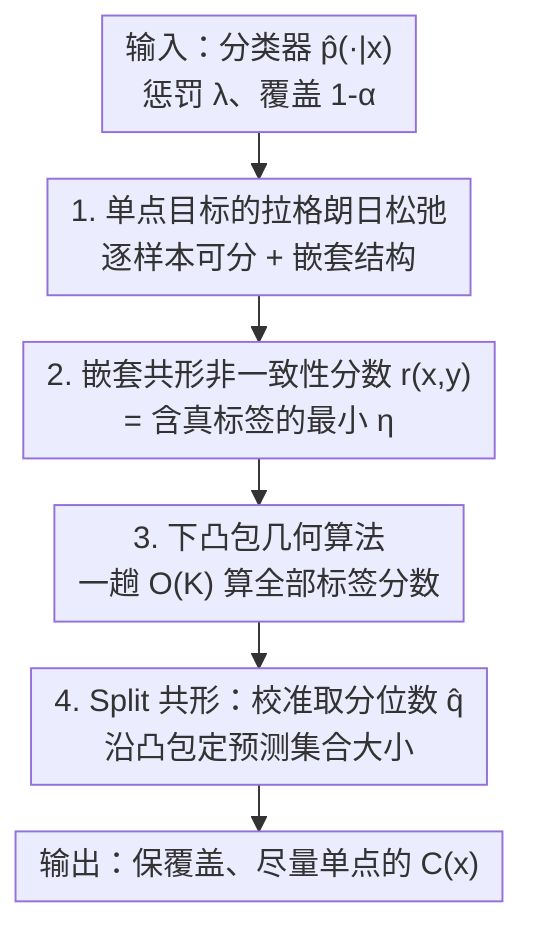

# Singleton-Optimized Conformal Prediction

**会议**: ICLR 2026  
**OpenReview**: [https://openreview.net/forum?id=mO3nEGibLA](https://openreview.net/forum?id=mO3nEGibLA)  
**代码**: 有（论文 Reproducibility Statement 提供 GitHub 仓库）  
**领域**: 学习理论 / 共形预测 (Conformal Prediction)  
**关键词**: 共形预测, 非一致性分数, 单点集合, 凸包, 拉格朗日松弛

## 一句话总结
本文针对共形预测里"集合太大、需要人工介入"的痛点，提出一个直接优化**单点集合概率**（而非平均长度）的非一致性分数 SOCOP，通过把每个样本的拉格朗日子问题几何化成"求 $K$ 个二维点的下凸包"，在 $O(K)$ 时间内算出分数，在图像分类和 LLM 选择题上把非单点率最高降低 20% 而几乎不增大平均集合尺寸。

## 研究背景与动机
**领域现状**：共形预测（conformal prediction）是一套分布无关、只靠数据可交换性假设就能给出**边际覆盖保证** $P\{Y \in C(X)\} \ge 1-\alpha$ 的方法。给定一个预训练分类器输出的概率 $\hat p(\cdot|x)$，先用一个非一致性分数（nonconformity score）把"样本-标签对有多不像训练分布"量化成一个实数，再在校准集上取分位数，就能为每个测试样本构造出带覆盖保证的预测集合 $C(x) \subseteq \mathcal{Y}$。

**现有痛点**：覆盖只是底线，集合的**实用价值取决于效率**——包含全部标签的平凡集合虽然合法但毫无信息。主流效率度量是集合的**平均尺寸** $\mathbb{E}_X[|C(X)|]$，从 LAS（Least Ambiguous Sets）、APS、RAPS 到直接优化长度的方法，都是围绕"把平均尺寸压小"做文章。

**核心矛盾**：但平均尺寸并不是理想的效率度量。下游真正想要的是一个**无歧义决策**，即只含一个标签的**单点集合**（singleton）。一个尺寸 $\ge 2$ 的集合往往意味着要触发额外的人工复核或改变工作流，带来"超额成本"——而平均尺寸这个指标对"尺寸 1 vs 尺寸 2"和"尺寸 50 vs 尺寸 51"一视同仁，完全感知不到这道关键的台阶。Vovk 等人早在 2005 年就把"最小化非单点概率" $P_X[|C(X)|>1]$ 概念化为 M-criterion，但据作者所知，真正能实用地优化这个目标的共形预测方法一直空缺。

**本文目标**：填补这个空白——构造一个在覆盖约束下、**联合优化单点目标与平均长度**的共形预测方法，并且要算得快（大 $K$ 时也实用）。

**切入角度**：把问题先写成一个"在所有预测集合上"的约束优化问题。虽然这个问题定义在离散、不连续的集合空间上、无法直接用梯度法求解，但作者并不打算精确求解它，而是把它当作**导出非一致性分数的跳板**：研究其对偶（拉格朗日松弛），利用可分性逐样本求解，发现最优集合具有"取前几名标签 + 随惩罚参数嵌套增长"的漂亮结构。

**核心 idea**：用"单点目标 + 长度"的线性组合作为动机，导出一个**基于嵌套共形预测的非一致性分数**，并把求分数这件事几何化为"求下凸包"，从而做到 $O(K)$ 复杂度。

## 方法详解

### 整体框架
SOCOP 的输入是一个预训练概率分类器 $\hat p(\cdot|x)$、惩罚参数 $\lambda \ge 0$ 和目标覆盖 $1-\alpha$；输出是对任意测试点的、带边际覆盖保证、且**尽量是单点**的预测集合。整条链路分四步：① 把"非单点概率 + 平均长度"在覆盖约束下的优化问题写出来，取拉格朗日松弛，证明它**逐样本可分**；② 对单个样本求最优集合，发现它必是"前 $j$ 名标签"且随对偶变量 $\eta$ **嵌套增长**，据此用嵌套共形预测定义非一致性分数 $r(x,y)$；③ 把"对每个 $\eta$ 重算最优集合大小"这件事几何化为"求 $K+1$ 个二维点的**下凸包**"，让所有标签的分数在**一趟 $O(K)$ 扫描**里一次性算完；④ 把分数喂进 split conformal prediction，在校准集上取分位数 $\hat q$，沿凸包找到不超过 $\hat q$ 的最大斜率边来定预测集合大小。

### 关键设计

**1. 单点目标的拉格朗日松弛与逐样本可分性：把"集合空间的离散优化"拆成一个个标量问题**

直接最小化非单点概率没法做——它定义在所有可测预测集合构成的离散空间 $\mathcal{M}$ 上，两个集合的线性组合都没有定义，梯度法完全失效。作者的破局点是先写出动机问题

$$\min_{C\in\mathcal{M}}\; F_\lambda(C) := P_X[|C(X)|>1] + \lambda\,\mathbb{E}_X[|C(X)|]\quad \text{s.t.}\;\; P(Y\in C(X)) \ge 1-\alpha,$$

其中 $\lambda \ge 0$ 在"单点优先"和"长度优先"之间调权。引入对偶变量 $\eta \ge 0$ 写出拉格朗日量 $L_\lambda(C,\eta)=\int_\mathcal{X}\ell_{p(\cdot|x),\lambda}(C(x);\eta)\,P_X(dx)+\eta(1-\alpha)$，其中**逐样本损失**为

$$\ell_{p(\cdot|x),\lambda}(C(x);\eta)=\mathbb{I}(|C(x)|>1)+\lambda|C(x)|-\eta\!\!\sum_{y\in C(x)}\! p(y|x).$$

关键观察是：对 $C$ 最小化 $L_\lambda$ **在 $x$ 上可分**——可以对每个 $x$ 单独优化那个标量化的 per-instance loss。这一步把一个无从下手的集合泛函优化，降维成了"对单个概率向量 $\gamma$ 求一个最优子集 $S_{\eta,\gamma}$"的小问题，是后续一切的地基。作者强调这只是**定义分数的跳板**，并不追求精确解原问题。

**2. 嵌套结构与非一致性分数：用"含真标签的最小 $\eta$"刻画样本-标签对**

对单个概率向量（按 $\gamma_{y_1}\ge\gamma_{y_2}\ge\cdots$ 排序），最优集合 $S_{\eta,\gamma}$ 具有两条漂亮性质：（Lemma 2.1）它必然是**前 $j$ 名标签**构成的集合 $F_j$；（Lemma 2.2）随对偶变量增大集合**嵌套增长**，即 $\eta_1<\eta_2 \Rightarrow S_{\eta_1,\gamma}\subseteq S_{\eta_2,\gamma}$。嵌套性正是"嵌套共形预测"的标准前提，于是作者把非一致性分数定义为**让真标签首次进入集合所需的最小代价**：

$$r(x,y) := \inf\{\tau \ge 0 : y \in S_{\tau,\hat p(\cdot|x),\lambda}\}.$$

直觉上 $\eta$ 是"每单位覆盖相对集合尺寸惩罚的价格"，$r(x,y)$ 就是把真标签 $y$ 买进集合所需的最低价。这个定义把抽象的单点目标落成了一个可计算、可在 split conformal 里取分位数的实数分数，且两个极端可证明地退化为已知方法（见亮点）：$\lambda\to\infty$ 退回 LAS（分数 $1/\hat p(y|x)$），$\lambda=0$ 退回纯单点解（要么 top-1 要么全集）。

**3. 下凸包几何算法：把"逐 $\eta$ 重算集合大小"压成一趟 $O(K)$ 扫描**

朴素地按 $\tau$ 搜索分数，每个 $\tau$ 都要花 $O(K)$ 算一次最优子集大小 $\kappa(\eta;\gamma)$，大 $K$ 时太贵。作者的核心技巧是**同时**研究所有 $\eta$ 下的最优指标。记累积概率 $\Gamma_k=\sum_{i=1}^k\gamma_{y_i}$、成本 $g_k=\mathbb{I}(k>1)+\lambda k$，把每个 $k$ 映成平面上一点 $P_k=(\Gamma_k,g_k)$，共 $K+1$ 个点。Theorem 2.5 证明：$\eta\mapsto\kappa(\eta;\gamma)$ 这个单调阶梯函数的**取值范围恰好是这堆点下凸包的顶点下标**，而其**跳变点恰好是下凸包各条边的斜率** $\eta_i=(g_{v_i}-g_{v_{i-1}})/(\Gamma_{v_i}-\Gamma_{v_{i-1}})$。于是求某个标签 $y_i$ 的分数 $r(x,y_i)=\inf\{\eta:\kappa(\eta;\hat p)\ge i\}$ 就等价于"沿下凸包找到能让集合大小 $\ge i$ 的最小斜率边"。用标准凸包算法在**一趟循环**里求出全部顶点和斜率，所有标签的分数一次性算完，每样本 $O(K)$；split conformal 的预测集合也以同样复杂度得到——给定测试点，只需沿凸包找到斜率 $\le \hat q$ 的最大边对应的顶点 $k_{\text{final}}$，取前 $k_{\text{final}}$ 名标签即为 $\hat C(x)$（Algorithm 1）。

### 损失函数 / 训练策略
SOCOP 本身**不训练模型**，是套在任意预训练概率分类器外的"即插即用"共形包装。唯一的超参 $\lambda$ 在一个独立 tuning 子集上选：画出 $(\text{平均尺寸},\,P(\text{size}>1))$ 的 trade-off 曲线，用 kneedle 算法（Satopaa et al. 2011）找曲线"膝点"作为 $\lambda$，在两个指标间取均衡（追求自适应性时则改为最小化 SSCV 来选 $\lambda$）。框架还能无缝推广到控制 $P_X[|C(X)|>k_0]$：只需把成本改成 $g_k=\mathbb{I}(k>k_0)+\lambda k$，其余推导原样不变，适用于"容忍尺寸 $\le 2$ 的集合"等场景。

## 实验关键数据

### 主实验
在 ImageNet-Val（1−α=0.95，100 次随机划分）上，所有方法都达标覆盖 0.95。SOCOP 在 ResNet152-v2 上把非单点率从 LAS 的 0.466 压到 **0.370**（降约 20%），平均尺寸仅从 2.274 微增到 2.477；ViT-h-14 上把 0.224 压到 **0.175**，平均尺寸 1.291→1.356。

| 模型 / 方法 | 覆盖率 | 平均尺寸 | P(size>1) |
|------|------|------|------|
| ResNet152-v2 · RAPS | 0.950 | 3.158 | 0.603 |
| ResNet152-v2 · Least Ambiguous Sets | 0.950 | **2.274** | 0.466 |
| ResNet152-v2 · SOCOP (ours) | 0.950 | 2.477 | **0.370** |
| ViT-h-14 · Least Ambiguous Sets | 0.950 | **1.291** | 0.224 |
| ViT-h-14 · SOCOP (ours) | 0.950 | 1.356 | **0.175** |

医学图像 TissueMNIST（8 类，ResNet-50）上非单点率从 LAS 的 0.788 降到 **0.638**（降约 15%），平均尺寸 2.647→2.847；MMLU 选择题（Llama-3.1-8B-Instruct）上从 0.675 降到 **0.587**（降约 10%），平均尺寸 2.426→2.477，跨视觉/语言、跨数据集规律一致。

### 消融 / 分析实验
自适应性实验（SSCV，越小越好）显示 SOCOP 能在不牺牲效率的前提下取得低条件覆盖违背：

| 方法 (ResNet152-v2) | 平均尺寸 | P(size>1) | SSCV |
|------|------|------|------|
| Least Ambiguous Sets | **2.279** | 0.467 | 0.197 |
| RAPS | 8.568 | 0.448 | 0.031 |
| SOCOP (ours) | 3.372 | **0.304** | 0.039 |

RAPS 虽 SSCV 略低，但平均尺寸从 ≈3.2 暴涨到 ≈8.6；SOCOP 在维持小尺寸的同时把非单点率压到 0.304、SSCV 也降到 0.039。

### 关键发现
- **$\lambda$ 滑动连续插值两个极端**：$\lambda:0\to\infty$ 时平均尺寸从纯单点解（极大）一路降到 LAS 极限，而 $P(\text{size}>1)$ 反向上升，trade-off 曲线光滑，kneedle 选点稳定。
- **集合尺寸直方图右移很轻**：SOCOP 把更多质量压到单点、减少小集合，代价仅是略微多出几个大集合，作者用累积超额质量 $\Delta$ 量化，数值很小。
- **越难的数据收益越大**：在分布偏移更强的 ImageNet-V2 上 SOCOP 优势比 ImageNet-Val 更明显。

## 亮点与洞察
- **把"离散集合优化"翻译成"二维下凸包"**是最漂亮的一步：单调阶梯函数 $\kappa$ 的取值与跳变点被证明分别对应凸包顶点和边斜率，从而把"逐 $\eta$ 重算"压成一趟 $O(K)$ 扫描，几何直觉（斜率=每单位覆盖的价格）还非常可解释。
- **可证明的极端退化（Corollary 2.6）**给方法吃了定心丸：$\lambda\to\infty$ 严格退回 LAS、$\lambda=0$ 退回"top-1 或全集"的纯单点解，说明 SOCOP 是这两类经典方法之间一条有理论依据的连续插值路径，而非又一个 ad-hoc 分数。
- **指标层面的重新定义**值得迁移：很多"效率/成本"任务都被默认用均值度量，但下游真正在意的是某道台阶（这里是"是否单点"）。把目标从 $\mathbb{E}|C|$ 换成 $P(|C|>k_0)$ 并保持框架不变，这种"换目标不换管线"的思路可推广到别的带阈值成本的决策场景。

## 局限与展望
- **只给边际覆盖、不保证条件覆盖**：分数从边际目标导出，SSCV 实验里虽自适应性不错，但作者自己指出真正面向条件覆盖的分数需要从条件感知目标（如 Gibbs et al. 2025）重走一遍推导。
- **依赖独立 tuning 集选 $\lambda$**：为保持有效性单独划了 tuning 子集，牺牲了数据效率；用校准集直接做数据依赖选 $\lambda$ 会引入 tuning bias，作者列为未来工作。
- **绑定 split conformal**：当前只实例化到 split conformal，label-conditional / Mondrian 等更强变体留待扩展。
- **收益依赖 $\hat p$ 质量**：分数完全建立在估计概率 $\hat p(\cdot|x)$ 上，分类器概率校准差时单点收益可能打折（论文未系统消融这一点）。

## 相关工作与启发
- **vs Least Ambiguous Sets (Sadinle et al. 2019)**：LAS 用 $1-\hat p(y|x)$ 优化期望长度，是 SOCOP 在 $\lambda\to\infty$ 的极限特例；SOCOP 用极小的尺寸代价换来显著更低的非单点率。
- **vs RAPS (Angelopoulos et al. 2021)**：RAPS 从条件覆盖动机出发做自适应正则；SOCOP 与之相比在同等或更低 SSCV 下平均尺寸小得多（3.4 vs 8.6）。
- **vs CPL / 直接优化长度 (Kiyani et al. 2024)**：CPL 用训练过程优化集合长度、目标仍是长度；SOCOP 换了优化目标（单点概率）且无需重训，仅替换分数。
- **vs M-criterion (Vovk et al. 2005)**：本文把 2005 年仅被概念化的 M-criterion 首次落成实用、可高效计算的分数。

## 评分
- 新颖性: ⭐⭐⭐⭐⭐ 首个实用化优化单点目标的共形分数，凸包几何视角优雅。
- 实验充分度: ⭐⭐⭐⭐ 覆盖视觉+LLM、多模型多数据集、含自适应性与超参分析，但缺概率校准敏感性消融。
- 写作质量: ⭐⭐⭐⭐⭐ 从动机问题到几何算法推导链条清晰，极端退化结论强化说服力。
- 价值: ⭐⭐⭐⭐⭐ 重新定义效率度量，$O(K)$ 即插即用，对需要无歧义决策的下游很实用。

<!-- RELATED:START -->

## 相关论文

- [\[ICLR 2026\] Conformal Prediction for Long-Tailed Classification](conformal_prediction_for_long-tailed_classification.md)
- [\[ICLR 2026\] Distribution-informed Online Conformal Prediction](distribution-informed_online_conformal_prediction.md)
- [\[ICML 2026\] Enhancing Conformal Prediction via Class Similarity](../../ICML2026/learning_theory/enhancing_conformal_prediction_via_class_similarity.md)
- [\[ICLR 2026\] Online Conformal Prediction with Adversarial Semi-bandit Feedback via Regret Minimization](online_conformal_prediction_with_adversarial_semi-bandit_feedback_via_regret_min.md)
- [\[ICLR 2026\] Multi-Condition Conformal Selection](multi-condition_conformal_selection.md)

<!-- RELATED:END -->
