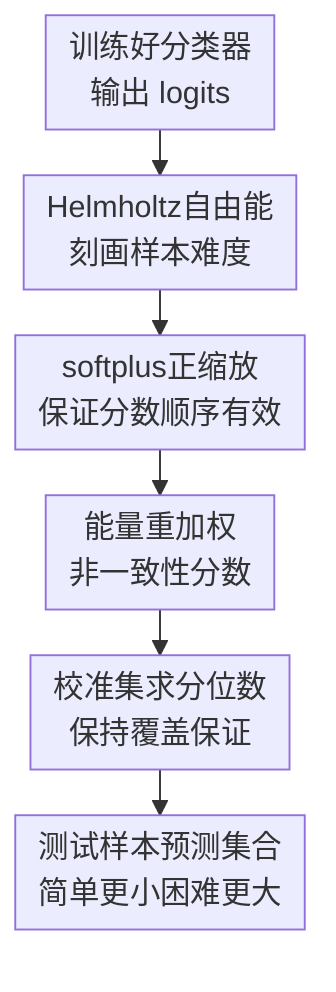

# Softmax is not Enough (for Adaptive Conformal Classification)

**会议**: ICLR2026  
**OpenReview**: [https://openreview.net/forum?id=zCwTMRtASZ](https://openreview.net/forum?id=zCwTMRtASZ)  
**代码**: https://github.com/navidattar/Energy-Based-Conformal-Classification  
**领域**: 学习理论 / 不确定性量化 / 自适应保形分类  
**关键词**: 自适应保形分类, 非一致性分数, Helmholtz自由能, logit不确定性, OOD可靠性  

## 一句话总结
本文指出自适应保形分类若只依赖 softmax 概率会继承深度分类器的过度自信问题，并提出用 logit 空间的 Helmholtz free energy 对非一致性分数做样本级重加权，在保持保形预测覆盖保证的同时，让预测集合对简单、困难和 OOD 输入更有区分度。

## 研究背景与动机
**领域现状**：保形预测（Conformal Prediction, CP）在分类任务里常用 split conformal 框架：先用训练集训练分类器，再在校准集上计算非一致性分数 $S(x,y)$，取经验分位数 $\hat q_{1-\alpha}$，最后输出满足 $S(x,y) \le \hat q_{1-\alpha}$ 的标签集合。只要校准样本和测试样本可交换，预测集合就能满足 $P(Y \in C(X)) \ge 1-\alpha$。

**现有痛点**：分类场景里真正有用的预测集合不只是要覆盖真实标签，还要高效和自适应：简单样本应给出很小的集合，困难或陌生样本应给出更大的集合来表达不确定性。APS、RAPS、SAPS 等 adaptive score 已经试图利用 softmax 概率排序来做到这一点，但它们的输入仍然主要来自 softmax 输出。

**核心矛盾**：softmax 概率看起来像置信度，却不一定是模型对输入熟悉程度的可靠刻画。现代神经网络可能对误分类样本、长尾少数类、甚至 OOD 输入给出很高 softmax confidence；温度缩放可以改善分布内校准，却不能真正补上 epistemic uncertainty。于是 CP 的覆盖保证仍然成立，但预测集合的形状可能不诚实：简单样本集合偏大，困难样本或 OOD 样本集合又可能偏小。

**本文目标**：作者想解决的是一个很具体的问题：在不重新训练模型、不引入 ensemble 或额外不确定性模型的情况下，能否从现有深度分类器里拿到比 softmax 更能反映样本难度的信号，并把它接入保形分类的非一致性分数。

**切入角度**：论文的观察是，softmax 会把 logit 的整体幅度压成归一化概率，很多关于输入是否“像训练分布”的信息会在归一化后被抹平；而 pre-softmax logit space 仍保留了模型对输入整体能量的判断。Helmholtz free energy 正好可以从 logits 直接计算，且在 energy-based model 视角下对应模型隐含输入密度的负对数似然。

**核心 idea**：用 Helmholtz free energy 作为样本难度和 epistemic uncertainty 的 proxy，对已有 adaptive nonconformity score 做正的样本级缩放，让容易样本的错误标签更快越过阈值、困难或 OOD 样本的标签更容易留在集合里。

## 方法详解

### 整体框架
这篇论文不是重新发明保形预测，也不是训练一个新的不确定性模型，而是在现有保形分类流程中替换“分数如何感知样本难度”这一环。给定一个训练好的分类器，作者先从 logits 计算 Helmholtz free energy，再把它通过 softplus 变成正的缩放因子，最后乘到 APS、RAPS、SAPS 等基础非一致性分数上；校准和测试仍按 split conformal prediction 的标准流程进行。

从形式上看，基础保形分类会对每个候选标签 $y$ 计算 $S(x,y)$，再用校准得到的阈值决定是否纳入集合。本文把这个分数改成

$$
S_{\text{Energy-Based}}(x,y) = S(x,y) \cdot \frac{1}{\beta}\log(1+e^{-\beta F(x)}),
$$

其中 $F(x)$ 是由 logits 得到的 Helmholtz free energy，$\beta$ 控制 softplus 的锐度。这个缩放因子只依赖样本 $x$，不依赖候选标签 $y$，所以它不会破坏同一样本内部标签排序的直觉；但它会改变不同样本在校准集中的分数分布，从而让最终阈值和每个测试样本的有效阈值都带上样本难度信息。

### 关键设计
**1. 从 softmax 概率退回 logit 能量：保留被归一化抹掉的熟悉度信号**

标准分类器输出 logits $f(x)=(f_1(x),\ldots,f_K(x))$ 后，softmax 会把它们归一化成 $\hat\pi(y|x)$。这个变换适合给出类别排序，但不适合区分“模型真的很熟悉这个输入”和“模型只是相对更偏向某个类别”。论文把分类器解释成一个 energy-based model，定义联合能量 $E(x,y)=-f_y(x)$，于是 softmax 条件概率可以写成 Gibbs-Boltzmann 分布。

关键转折在于对标签边缘化后得到的 Helmholtz free energy：

$$
F(x;f)=-\tau \log \sum_{k=1}^{K}\exp\left(\frac{f_k(x)}{\tau}\right).
$$

负自由能 $-F(x)$ 本质上接近 logits 的 log-sum-exp，也近似追踪最大 logit 的整体幅度。简单、分布内、模型熟悉的样本通常有更高的负自由能；困难、低密度或 OOD 样本的负自由能更低。论文用 CIFAR-100 的例子说明：两个样本 softmax confidence 分别接近 $1.0$ 和 $0.998$，但一个真实标签排名第 $1$，另一个排名第 $27$；softmax 几乎看不出差别，负能量分数却能明显拉开。

**2. 用 softplus 做正缩放：把样本难度接进任意 adaptive score 而不破坏保形有效性**

保形预测的覆盖保证依赖校准分数和测试分数的可交换性，而不是依赖某个特定 score 形式。只要新的分数是样本和标签的确定性函数，且校准与测试样本满足同样的可交换假设，覆盖保证仍然成立。本文因此不改 split conformal 的外壳，而是把基础非一致性分数 $S(x,y)$ 乘上一个正的样本级因子 $G(x)$。

这个正性要求很重要。如果直接用 $-F(x)$，极端不确定样本上可能出现负值，乘上负数会反转非一致性分数的排序含义。作者用 $G(x)=\frac{1}{\beta}\log(1+e^{-\beta F(x)})$ 解决这个问题：当负自由能为正且较大时，softplus 近似保留它的大小；当负自由能为负时，缩放因子平滑接近零而不是变成负数。这样既保留了 energy 的强弱信号，又不会让“低分更一致、高分更不一致”的保形语义崩掉。

**3. 把重加权解释成样本自适应阈值：简单样本收紧，困难样本放宽**

从预测集合角度看，使用 $S_G(x,y)=G(x)S(x,y)$ 和校准得到的新分位数 $\hat q^{(G)}_{1-\alpha}$，等价于使用原始分数 $S(x,y)$，但测试样本有自己的有效阈值

$$
\theta(x)=\frac{\hat q^{(G)}_{1-\alpha}}{G(x)}.
$$

这给了方法很直观的解释。对简单样本，$G(x)$ 大，$\theta(x)$ 小，错误标签更容易因为 $S(x,y)>\theta(x)$ 被排除，预测集合收缩；对困难或 OOD 样本，$G(x)$ 小，$\theta(x)$ 大，更多候选标签会被保留下来，集合扩张以表达不确定性。

这也解释了为什么该方法特别适合 adaptive conformal classification。它不是盲目缩小所有集合，而是让集合大小重新对齐模型熟悉度。覆盖保证来自 conformal calibration，效率和自适应性来自 logit energy 对样本难度的调制。

**4. 覆盖平衡、长尾和 OOD 三种场景：同一个能量信号承担不同可靠性角色**

在平衡数据上，energy 主要帮助识别 softmax 已饱和但 logit 幅度仍不同的“容易程度”，从而在高置信要求下显著缩小平均集合。长尾训练数据上，模型会对多数类更熟悉、对少数类更不熟悉，负自由能分布也会随类别先验移动；energy-based score 因此能对少数类样本更保守，减少标准 softmax score 对少数类的过度自信。

在 OOD 场景里，形式化覆盖保证已经因为校准和测试不再可交换而不适用，作者转而提出可靠 conformal classifier 的行为准则：面对 OOD 输入，最好输出空集合或大集合，至少不能输出一个看似自信的小集合。energy-based reweighting 在这里的作用是把低负自由能转成较小缩放因子，让更多标签落入集合，从而用大集合提醒用户“模型不熟悉这个输入”。

### 一个完整示例
以 ImageNet 分类器为例，标准 APS 对一张清晰的金刚鹦鹉图像可能给出包含多个鸟类和无关物体的集合。论文的能量版本会发现该样本负自由能高，说明模型对输入熟悉且 logits 整体幅度足够强，于是放大错误标签的非一致性分数，预测集合从较大的 APS set 收缩到更少的候选标签。

相反，对一张外观不像典型蜂鸟、真实标签排名靠后的鸟类图像，softmax 仍可能给出很尖的分布，但 energy 会显示模型整体不够确定。缩放因子变小后，更多相近鸟类标签会留在集合里，集合变大，这种“大”是有用的，因为它告诉用户这个样本并不容易。

再看 OOD 输入，例如把一张脑部 MRI 输入 ImageNet 分类器。标准 softmax-based APS 仍可能返回一个不小但并不充分表达陌生性的集合；energy-based APS 会把低熟悉度转成更大的预测集合。论文表格中 CIFAR-100 训练、Places365 OOD 测试时，APS 在 $\alpha=0.1$ 下 OOD 平均集合从 $6.18$ 扩到 $86.76$，这虽然牺牲了简洁性，却避免了对陌生输入给出小而自信的错误集合。

### 损失函数 / 训练策略
本文方法是后处理式的，不需要重新训练分类器，也不需要为不确定性额外训练辅助网络。训练阶段仍使用普通分类器训练流程；保形阶段仍使用校准集计算分位数。新增的超参数主要是 energy temperature $\tau$、softmax calibration temperature $T$ 和 softplus sharpness $\beta$。

实验中，softmax 概率使用温度 $T$ 做校准，free energy 使用独立温度 $\tau$ 计算。作者在 $\ln(\tau)\in[-9,9]$ 和若干 $T$ 值上调参，并指出当 $\tau$ 很大时，energy reweighting 的影响会逐渐消失，方法退化得更像 baseline。$\beta$ 的消融显示只要足够大，性能就进入稳定区间，精细调这个参数并不是主要瓶颈。

理论上，论文给出 energy-based score 的交换性证明：若 $(X_i,Y_i)$ 可交换，基础分数 $S(x,y)$ 和自由能 $F(x)$ 都是确定性函数，那么 $S'(X_i,Y_i)=S(X_i,Y_i)G(X_i)$ 仍然可交换，因此 split conformal 的 marginal coverage 仍成立。论文还证明自由能与模型隐含输入密度的负对数似然线性相关，并分析负自由能随样本难度单调下降的机制。

## 实验关键数据

### 主实验
作者在 CIFAR-100、ImageNet、Places365 上评估 APS、RAPS、SAPS 及其 energy-based 版本，目标误覆盖率 $\alpha\in\{0.01,0.025,0.05,0.1\}$。主指标是 empirical coverage 和 average prediction set size。下面摘取最能说明结论的一组平衡数据结果：覆盖基本保持在目标水平，集合大小在严格覆盖要求下明显下降。

| 数据集 / 模型 | 方法 | $\alpha$ | Coverage | Set Size w/o Energy | Set Size w/ Energy | 变化 |
|--------|------|------|------|------|------|------|
| CIFAR-100 / ResNet-56 | APS | 0.025 | 0.975 vs 0.974 | 13.29 | 11.48 | 更小，覆盖保持 |
| CIFAR-100 / ResNet-56 | RAPS | 0.05 | 0.95 vs 0.95 | 8.17 | 6.18 | 明显更小 |
| CIFAR-100 / ResNet-56 | SAPS | 0.01 | 0.99 vs 0.99 | 29.80 | 22.90 | 高置信下收益大 |
| ImageNet / ResNet-50 | APS | 0.01 | 0.99 vs 0.99 | 39.08 | 32.93 | 更高效 |
| Places365 / ResNet-50 | RAPS | 0.025 | 0.976 vs 0.975 | 26.34 | 22.35 | 更小且覆盖相近 |
| Places365 / ResNet-50 | SAPS | 0.05 | 0.95 vs 0.95 | 14.11 | 12.51 | 稳定提升 |

在长尾训练数据 CIFAR-100-LT 上，energy-based score 也能显著降低集合大小。以 $\lambda=0.005$ 的轻度长尾为例，APS 在 $\alpha=0.05$ 下从 $17.22$ 降到 $13.30$，RAPS 从 $18.54$ 降到 $13.26$，SAPS 从 $17.96$ 降到 $13.19$，覆盖仍在约 $0.95$。

| 场景 | 方法 | $\alpha$ | Coverage w/o / w Energy | Set Size w/o Energy | Set Size w/ Energy | 说明 |
|------|------|------|------|------|------|------|
| CIFAR-100-LT $\lambda=0.005$ | APS | 0.05 | 0.95 / 0.95 | 17.22 | 13.30 | 长尾下效率提升 |
| CIFAR-100-LT $\lambda=0.005$ | RAPS | 0.025 | 0.972 / 0.973 | 30.09 | 22.27 | 覆盖略升，集合更小 |
| CIFAR-100-LT $\lambda=0.01$ | SAPS | 0.01 | 0.99 / 0.99 | 59.12 | 47.17 | 更严格覆盖下收益明显 |
| CIFAR-100-LT $\lambda=0.02$ | RAPS | 0.05 | 0.95 / 0.95 | 52.01 | 42.72 | 中度长尾仍有效 |
| CIFAR-100-LT $\lambda=0.03$ | APS | 0.025 | 0.975 / 0.975 | 58.05 | 55.61 | 严重长尾收益变小但不崩 |

### 消融实验
论文的消融主要围绕两个问题：energy 是否比 entropy 更适合做重加权，以及超参数是否敏感。ImageNet 上与 entropy-based reweighting 的对比很清楚：entropy 版本往往让集合更大，而 energy 版本能保持或降低集合大小。

| 配置 | 数据集 / 模型 | $\alpha$ | Set Size | 说明 |
|------|------|------|------|------|
| APS baseline | ImageNet / ResNet-50 | 0.05 | 4.007 | 标准 softmax adaptive score |
| APS w/ Energy | ImageNet / ResNet-50 | 0.05 | 3.842 | 更小，覆盖相同量级 |
| APS w/ Entropy | ImageNet / ResNet-50 | 0.05 | 4.990 | entropy 重加权反而变大 |
| RAPS baseline | ImageNet / ResNet-50 | 0.05 | 4.222 | 标准 RAPS |
| RAPS w/ Energy | ImageNet / ResNet-50 | 0.05 | 3.889 | energy 带来效率提升 |
| RAPS w/ Entropy | ImageNet / ResNet-50 | 0.05 | 4.811 | entropy 不如 energy |
| SAPS baseline | ImageNet / ResNet-50 | 0.1 | 1.664 | 标准 SAPS |
| SAPS w/ Energy | ImageNet / ResNet-50 | 0.1 | 1.662 | 基本持平略优 |
| SAPS w/ Entropy | ImageNet / ResNet-50 | 0.1 | 2.101 | entropy 增大集合 |

OOD 实验则展示了另一类“消融式”可靠性差异：在 CIFAR-100 训练、Places365 作为 OOD 的场景，energy-based 方法会显著扩大 OOD 集合，减少小集合假自信。

| 方法 | $\alpha$ | ID Set Size w/o / w Energy | OOD Set Size w/o / w Energy | 解释 |
|------|------|------|------|------|
| APS | 0.1 | 3.17 / 3.16 | 6.18 / 86.76 | OOD 上强烈扩张，表达陌生性 |
| APS | 0.05 | 6.91 / 6.49 | 14.91 / 93.40 | ID 更高效，OOD 更保守 |
| RAPS | 0.1 | 3.13 / 3.13 | 3.70 / 5.53 | 更温和地扩大 OOD 集合 |
| RAPS | 0.05 | 8.17 / 6.18 | 8.95 / 9.05 | ID 收缩，OOD 不再过度收缩 |
| SAPS | 0.05 | 7.47 / 5.94 | 8.82 / 9.53 | ID 变小，OOD 略变大 |

### 关键发现
- energy-based reweighting 的主要收益出现在高置信覆盖要求和 adaptive score 本身容易受 softmax 饱和影响的场景；例如 CIFAR-100 和 ImageNet 在 $\alpha=0.01$ 或 $0.025$ 下，集合大小下降非常明显。
- 负自由能与样本难度有更稳定的关系。论文按真实标签排名分层后发现，简单样本的负能量分布明显更高，困难样本分布向低值移动，这支持它作为 difficulty signal。
- OOD 场景中，energy-based score 未必追求“小集合”，而是追求“不要假自信”。APS 的 OOD 集合大幅膨胀可能在普通效率指标上不好看，但在没有 OOD detector 的部署场景中反而是更可靠的告警。
- 类条件和特征条件分析显示，energy-based 版本在降低 set size 的同时，CovGap、SSCV、Worst-Slab Coverage 没有系统性恶化，说明效率提升不是简单牺牲某些切片的覆盖换来的。
- 统计显著性检验表明，大多数平衡数据和长尾数据设置下 energy 版本相对 baseline 的 set size 改进达到 $p<0.05$，尤其在 Places365 和长尾 CIFAR-100 上非常稳定。

## 亮点与洞察
- 这篇论文最巧的地方是没有把 softmax 置信度“再校准一遍”，而是直接绕到 logits 的整体能量。softmax 只看相对概率，free energy 则保留了 logit magnitude，因此能区分两个同样高 confidence、但模型熟悉度完全不同的样本。
- 方法很轻量：它不需要 ensemble、不需要 MC dropout、不需要训练 auxiliary uncertainty estimator，只要能访问 logits 就能接到 APS、RAPS、SAPS 这类已有 conformal score 上。这使它比许多 epistemic uncertainty 方法更容易成为通用插件。
- 理论叙述和工程直觉对得上。论文既证明了 energy-based score 的交换性和覆盖有效性，也把缩放解释成样本依赖阈值 $\theta(x)$；读者可以同时从 conformal validity 和 adaptive threshold 两个角度理解方法。
- OOD 分析很有启发：保形预测在分布外没有覆盖保证，此时小集合未必是好事。论文把“可靠性”改写成避免小而自信的错误集合，这比只盯平均 set size 更接近真实部署需求。
- 这个思路可以迁移到其他需要 logits 的不确定性任务，例如医学分类、长尾识别、开放集识别、或者多模态分类中的 selective prediction。只要基础模型的 logits 保留了熟悉度信息，energy reweighting 都可能作为低成本 uncertainty adapter。

## 局限与展望
- 方法依赖 logit access。对于只能调用 API、拿不到 logits 的模型，本文方案不能直接使用；这与一些面向 LLM API 的 conformal prediction 方法形成互补。
- energy 信号虽然比 softmax 更好，但仍来自同一个分类器。如果模型 logits 本身在某些 OOD 区域也异常高，free energy 可能仍会低估不确定性。它不是专门训练的 OOD detector，也不能替代严格的分布外检测。
- OOD 实验里 APS 的 energy 版本会把集合扩大到接近全类别，这能表达不确定性，但实际用户可能更希望系统直接 abstain。后续可以研究把 energy-based conformal set 与空集拒答机制结合起来。
- 长尾场景下，energy 既反映类别先验也反映样本难度，二者有时难以分离。对于类别复杂度差异很大的数据，论文定理里的“类别内在复杂度相近”假设可能不成立，需要更细的 class-conditional 或 group-conditional 分析。
- 超参数 $T$ 和 $\tau$ 需要调参。虽然 $\beta$ 不敏感，但 energy temperature 仍影响重加权强度；实践中需要明确用什么验证目标来选择它，避免为了 set size 过度调参。
- 实验主要集中在视觉分类数据集。方法理论上适用于任意多类分类器，但在文本、多标签、图学习、医学影像等真实高风险任务上还需要更多验证。

## 相关工作与启发
- **vs APS / RAPS / SAPS**: 这些方法已经通过累积概率、rank regularization 或 sorted score 改善 prediction set adaptiveness，但它们仍主要依赖 softmax 概率。本文保留这些 score 的主体，只额外用 free energy 做样本级重加权，因此更像是对一族 adaptive scores 的通用增强。
- **vs temperature scaling / calibration**: 温度缩放改善的是 softmax 概率在分布内的校准误差，不能让模型真正知道输入是否来自低密度区域。本文的 energy 信号来自 logits 的整体幅度，更接近 epistemic uncertainty 和输入熟悉度。
- **vs normalized conformal prediction**: 传统 normalized CP 会用输入相关的不确定性估计缩放基础误差分数，本文把这个思想搬到深度分类中，并用 Helmholtz free energy 作为无需额外模型的 difficulty estimator。
- **vs ensemble / Bayesian uncertainty**: ensemble、MC dropout 或 Bayesian 模型通常能估计 epistemic uncertainty，但计算和部署成本更高。本文牺牲了一部分不确定性表达的完整性，换来极低的后处理成本。
- **vs entropy reweighted conformal classification**: entropy 仍是 softmax 分布上的函数，容易在高置信区域饱和。本文的实验证明 entropy reweighting 在 ImageNet 上常使集合变大，而 energy reweighting 更稳定地降低 set size。
- **对后续工作的启发**: conformal prediction 的 score 设计不应只看概率排序，还应考虑模型内部表征是否含有“熟悉度”信号。未来可以探索 margin、feature density、Mahalanobis distance、energy 与 conformal calibration 的组合，构造更细粒度的样本条件阈值。

## 评分
- 新颖性: ⭐⭐⭐⭐☆ 把 free energy 接入 adaptive conformal score 的想法简洁且抓住 softmax 饱和痛点，但 energy-based OOD uncertainty 本身已有较强先验。
- 实验充分度: ⭐⭐⭐⭐☆ 覆盖平衡、长尾、OOD、类条件、特征条件、超参数和统计显著性，视觉分类实验扎实；跨模态和真实高风险任务还可扩展。
- 写作质量: ⭐⭐⭐⭐☆ 论文从 softmax 局限、free energy 理论到 conformal validity 的叙述比较完整，附录也充分；个别 OOD 图表标题和方法名对应处略显混乱。
- 价值: ⭐⭐⭐⭐⭐ 作为一个无需重训、能插入多种 conformal score 的轻量增强，实用价值很高，尤其适合已有分类系统想改善 prediction set adaptiveness 的场景。

<!-- RELATED:START -->

## 相关论文

- [\[ICLR 2026\] Conformal Prediction for Long-Tailed Classification](conformal_prediction_for_long-tailed_classification.md)
- [\[ICLR 2026\] Adaptive Conformal Prediction via Mixture-of-Experts Gating Similarity](adaptive_conformal_prediction_via_mixture-of-experts_gating_similarity.md)
- [\[ICLR 2026\] The Softmax Bottleneck Does Not Limit the Probabilities of the Most Likely Tokens](the_softmax_bottleneck_does_not_limit_the_probabilities_of_the_most_likely_token.md)
- [\[ICLR 2026\] Softmax Transformers are Turing-Complete](softmax_transformers_are_turing-complete.md)
- [\[ICLR 2026\] Distribution-informed Online Conformal Prediction](distribution-informed_online_conformal_prediction.md)

<!-- RELATED:END -->
