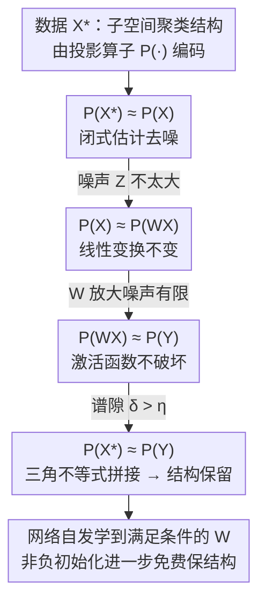

# Some Neural Networks Inherently Preserve Subspace Clustering Structure

**会议**: ICLR 2026  
**OpenReview**: [https://openreview.net/forum?id=Pjcz6ik78E](https://openreview.net/forum?id=Pjcz6ik78E)  
**领域**: 学习理论  
**关键词**: 子空间聚类, ReLU, 扰动理论, Davis-Kahan, 表示学习

## 一句话总结
本文用扰动理论证明：当数据具有"子空间聚类（union-of-subspaces）"结构时，带 ReLU 等激活函数的单层（乃至多层）网络在满足一个谱隙条件下会**原样保留**这种聚类结构，而且网络在普通训练中**无需任何显式正则**就会自发学到满足该条件的权重 $W$——也就是说这类网络其实是在"用闭式解做聚类"。

## 研究背景与动机
**领域现状**：神经网络擅长聚类与表征早已是共识，人们也长期观察到（Papyan 的 neural collapse、Arora 等）网络的中间嵌入会保留甚至强化数据的聚类结构，但这一直停留在"猜想 + 经验观察"层面，缺乏严格刻画。

**现有痛点**：深度学习理论的一大障碍是高维非线性变换难以分析，激活函数（sigmoid / tanh / ReLU）虽然带来层级特征学习所需的非线性，却让损失曲面和优化动力学变得不透明。可解释性方法（特征归因、机制可解释性）往往抓不住网络的**结构性**性质——比如"为什么聚类结构没被打乱"。

**核心矛盾**：激活函数同时是表达力的来源和理论分析的拦路虎。直觉上 ReLU 把 $WX$ 的负值清零，完全可能把原本干净的子空间结构破坏掉（图 1 里随机 $W$ 就是这么干的）；但实践中网络偏偏没有破坏它。到底在什么条件下"保留"会发生，又凭什么发生，没人说清。

**本文目标**：(i) 给出"一层把输入的子空间聚类结构原样传到输出"的**充分条件**；(ii) 给出量化"保留程度"的**上界**；(iii) 解释为什么网络在没有显式约束的情况下也会满足这些条件。

**切入角度**：作者不去分析"聚类准确率"，而是把聚类结构编码成一个**投影算子矩阵** $P(\cdot)$，于是"结构是否被保留"就等价于"输入输出的投影矩阵是否足够接近"，从而把问题转化为可用 Davis-Kahan $\sin(\Theta)$ 定理处理的**矩阵扰动**问题。

**核心 idea**：把"ReLU 层保结构"拆成三段扰动链——数据→去噪、线性变换不变、激活函数不破坏——逐段用谱隙界控制投影矩阵的偏差，再三角不等式拼起来；并通过数值实验证明梯度下降会**自发**把 $W$ 学到满足条件的区域。

## 方法详解

### 整体框架
论文的"方法"是一套理论刻画，核心对象是数据矩阵 $X^\star\in\mathbb{R}^{m\times n}$，它的每一列落在 $K$ 个低维子空间之一（union-of-subspaces，UoS 模型，欧氏聚类是其 1 维特例）。观测数据是带噪版 $X=X^\star+Z$。一层网络的输出写成 $Y=\sigma(WX)$，其中 $\sigma(\cdot)=\max(0,\cdot)$ 是 ReLU。

关键转换是：用投影到主行空间（维度 $r=\sum_k r_k$）的算子 $P(\cdot)$ 把聚类结构**编码成一个矩阵**——$P(X^\star)$ 的第 $(i,j)$ 项非零当且仅当第 $i$、$j$ 列属于同一簇。于是"网络保不保结构"被精确地翻译成"$P(X^\star)$ 与 $P(Y)$ 这两个矩阵接不接近"。论文主定理（Theorem 3.1）证明：只要一个**谱隙量 $\delta$** 超过由噪声决定的阈值 $\eta$，就有 $\|P(X^\star)-P(Y)\|_\infty<\epsilon/2$，聚类结构被保留。

整个证明沿着一条投影矩阵的链条走，每一段由一条引理 + Davis-Kahan 定理控制偏差，最后用三角不等式拼接：

### 关键设计

**1. 用投影算子把聚类结构编码成矩阵：让"保不保结构"变成"两个矩阵近不近"**

直接恢复子空间的基 $V$ 很难，因为同一子空间有无穷多组基，多数都不具备分块稀疏结构。作者绕开"学基"，转而学**投影到行空间的算子** $P(\cdot)$。设 $\bar V$ 是与 $V$ 同跨度的正交基分块矩阵，则在 $r<n$（信息论可辨识条件，子空间维数之和小于样本数）下投影算子唯一，$P(X^\star)=\bar V^{\mathsf T}\bar V$。$P(X^\star)$ 的非零支撑模式与簇划分一一对应，因此"学到 $P(X^\star)$"和"学到聚类"等价。更妙的是投影算子唯一性让 $P(X^\star)$ 可直接由含噪的 $P(X)$ 估计。这一步把一个非线性网络的结构问题，干净地化成了**矩阵扰动**问题——后面整条证明都建立在比较投影矩阵的 $\ell_\infty$ 距离上。

**2. 三段扰动链 + Davis-Kahan：把 ReLU 保结构拆成可逐段控制的偏差**

主定理被拆成三条引理，对应图中三段：
- **Lemma 4.1（去噪）**：若谱隙 $\delta_1>\sqrt{27r}\,\|Z\|/\epsilon$，则 $\|P(X)-P(X^\star)\|_\infty<\epsilon/8$。证明核心是把投影差的 Frobenius 范数写成 $2\|\sin^2(\Theta)\|_F^2$，再由 Davis-Kahan $\sin(\Theta)$ 定理 bound 成 $\sqrt 2\|Z\|_F/\delta_1$。直观上要求噪声相对信号别太大，簇才可分。
- **Lemma 4.2（线性不变）**：只要 $\mathrm{rank}(W)\ge r$，就有 $P(X^\star)=P(WX^\star)$，即任意线性变换不改变行空间投影；再叠加噪声项得 $\|P(X)-P(WX)\|_\infty<\epsilon/4$。这说明"线性变换"本身天然保结构。
- **Lemma 4.3（激活不破坏）**：若 $\delta_3>\sqrt{27r}\,\|Y-WX\|/\epsilon$，则 $\|P(Y)-P(WX)\|_\infty\le\epsilon/8$。这里 $\|Y-WX\|$ 度量的正是 ReLU 把多少 $WX$ 的负值清零了——若 $WX$ 基本非负，$\sigma(WX)=WX$，偏差就小。

三段用三角不等式拼起来即得 Theorem 3.1。整条链的统一条件是谱隙 $\delta>\eta:=\frac{\sqrt{27r}}{\epsilon}\max(\|Z\|,\|WZ\|,\|Y-WX\|)$，$\delta$ 可解读为相邻两矩阵主子空间的相似度。⚠️ 各引理中 $\epsilon/8$、$\epsilon/4$、$\epsilon/2$ 的拼接系数以原文为准。

**3. 网络无需正则就自发学到保结构的 $W$：本文最反直觉的核心发现**

定理里有四个"角色"：数据与噪声（不可控）、激活函数 $\sigma$（可选）、权重 $W$（学出来的）。作者强调：对任意 $\sigma$ 都**很容易**构造违反条件的 $W$——比如让 $WX$ 出现大量负值被 ReLU 清零，原结构当场被毁（图 1 的随机 $W$）。一个自然念头是加正则（惩罚 $W$ 或 $WX$ 的负项）去逼网络满足条件。但本文的惊人结论是：**这种正则根本不需要**。在合成 UoS 数据上训练一个 80 神经元的单隐层 ReLU 自编码器（Frobenius 重构损失），随训练 epoch 推进，$\delta>\eta$ 成立的频率持续升高、投影距离持续下降——网络在没有任何显式机制的情况下，自己把 $W$ 学进了满足 Theorem 3.1 的区域。结论延伸到多层：对 $L$ 层用 union bound（$\epsilon$ 除以 $L$），5 层 ReLU 网络同样从"随机权重破坏结构"演化到"逐层保留结构"。

**4. 非负初始化：把理论变成一条免费的工程技巧**

由 Lemma 4.3 的条件可知，ReLU 下只要 $WX>0$ 就有 $\sigma(WX)=WX$，条件自动满足；而 $WX>0$ 在 $X>0$ 且 $W>0$ 时平凡成立。现实里大量数据本就非负——像素强度、网络跳数、年龄/心率/血压/血糖等生物医学特征、单细胞测序、多组学等。于是只要把 $W$ **初始化为非负**，训练一开始聚类结构就被自动保住。实验（图 2-Right，噪声加到 0.5、$W$ 取单位区间初值）显示这种初始化**完美保留**聚类结构，且是学习过程的一个局部最优（梯度数值为零、Hessian 行列式为正），收敛更快、准确率更好。这把抽象定理直接落成了初始化 / 特征编码 / 正则的可操作建议。

### 一个完整示例
以合成数据走一遍证明链：取 $K=4$ 个 4 维子空间（$r_k=4$，故 $r=16$），$m=400$，每簇 $n_k=100$，总样本 $n=400>r$ 满足可辨识条件。先有干净的 $X^\star$，加方差 $s^2$ 的高斯噪声得 $X$。训练初期 $W$ 随机，$\|Y-WX\|$ 很大（大量负值被清零）、$\delta<\eta$，$P(Y)$ 与 $P(X^\star)$ 相距甚远——结构被破坏。随训练推进，网络把 $W$ 学得让 $WX$ 趋于非负、$Y\approx WX$，三段偏差同时收缩，$\delta>\eta$ 频率升高，$P(Y)$ 逼近 $P(X^\star)$，聚类结构被找回。沿噪声 $s^2$ 扫描可见这条界"随噪声优雅退化"。

## 实验关键数据

实验目标明确不是刷聚类准确率（所有模型都被刻意选成接近满分），而是用**投影距离**揭示网络"是不是在用闭式解聚类"。

### 主实验

| 实验设置 | 现象 | 说明 |
|----------|------|------|
| 单层 ReLU 自编码器（合成 UoS） | 训练中 $\delta>\eta$ 频率随噪声优雅退化（图 2-Left，100 trials/点） | 条件成立概率可量化，界不脆 |
| 单层 ReLU，$s^2=0.1$（图 2-Center） | 投影距离随 epoch 下降 | 网络自发学到保结构的 $W$ |
| 非负初始化 $W>0$，$s^2=0.5$（图 2-Right） | 投影距离≈0，完美保结构 | 是学习过程的局部最优，优于普通初始化 |
| 5 层前馈 ReLU（图 3） | 各层投影距离随 epoch 下降、逐层聚类准确率上升 | 深层网络同样逐层保结构 |

### 消融 / 推广实验

| 配置 | 是否保结构 | 关键发现 |
|------|-----------|---------|
| ReLU（前馈 / 5 层 / LSTM） | 是 | 投影距离持续下降 |
| GELU / SiLU（5 层前馈，图 4） | 是 | 保结构非 ReLU 专属 |
| 3 层 LSTM + ReLU（图 4） | 是 | 非前馈结构也成立 |
| 3 层 CNN（图 5 上） | 否 | 卷积不保留原始聚类结构 |
| 4 层 Transformer（图 5 下） | 否 | 注意力不保留原始聚类结构 |
| 12 个真实数据集（MNIST/CIFAR-10/EMNIST/SVHN/KMNIST/FashionMNIST/Flowers-102/Food-101/USPS/STL-10/DTD/EuroSAT 等） | ReLU 网络是 | ACC/NMI/ARI 近满分，且靠闭式投影结构聚类 |

### 关键发现
- **保结构是"线性变换 + 逐点激活"这一类结构的属性，而非 ReLU 独有**：GELU、SiLU、LSTM 都保留，说明真正起作用的是 Lemma 4.2（线性不变）+ Lemma 4.3（逐点激活偏差小）这套机制。
- **CNN / Transformer 不保留原始聚类结构，但不是聚不对**：作者特别澄清，这两类模型聚类准确率照样很高，只是它们用的是**别的机制**（不是闭式投影解），所以投影距离大。这反过来佐证了 ReLU 型网络确实在"学闭式解"。
- **非负数据 + 非负初始化是最甜的场景**：$X>0,W>0\Rightarrow WX>0\Rightarrow\sigma(WX)=WX$，条件平凡满足，结构从第一步就免费保住。

## 亮点与洞察
- **把"网络保聚类"这个老猜想第一次给出可证伪的精确条件**：核心招数是用投影算子把"结构"对象化成矩阵，于是模糊的几何直觉变成一行 $\|P(X^\star)-P(Y)\|_\infty<\epsilon/2$ 的可验证不等式，非常干净。
- **"网络自发满足条件"比"定理本身"更值得玩味**：定理只说"满足条件则保结构"，真正的惊喜是普通 SGD 在无正则下就把 $W$ 收敛到满足条件的局部最优——暗示保聚类是这类网络的隐式偏置，可与 neural collapse、flat minima 等现象对话。
- **可迁移的工程结论**：非负初始化能直接用于以非负特征为主的领域（医学表格、单细胞、遥感像素）做更稳更快的表示学习；"投影距离"也可作为一个**诊断指标**，判断某结构是否在用闭式解聚类。

## 局限与展望
- **谱隙假设未必普遍成立**：定理依赖 $\delta>\eta$ 这个谱隙条件，作者自己承认现实数据未必处处满足，它更多是提供一个"扰动稳定性↔聚类保留"的干净可解释机制，而非普适保证。
- **理论只覆盖"线性 + 逐点激活"**：卷积、注意力这类更复杂的变换无法被 Theorem 3.1 直接涵盖，实验也确认它们不保留原始结构——但论文没给出刻画这些变换的替代理论，留作空白。
- **指标取舍带 caveat**：投影距离衡量的是"结构保留"而非聚类性能，跨架构比较投影距离大小不能等同于比较聚类好坏（CNN/Transformer 距离大但准确率照样高）。
- **改进方向**：把 union bound 的 $\epsilon/L$ 衰减做得更紧以覆盖更深网络；探索能让 CNN/注意力也保结构的条件或诊断；把非负初始化在大规模真实任务上做端到端验证。

## 相关工作与启发
- **vs neural collapse / 经验观察（Papyan, Arora 等）**：他们观察并描述了网络嵌入会保留/强化聚类结构，本文把它形式化为带谱隙条件的扰动定理并给出量化上界，从"现象"升级为"机制"。
- **vs 隐式偏置 / flat minima（Soudry, Ding 等）**：那些工作把保结构归因于优化动力学或平坦极小，本文给出一个互补的、纯结构层面的解释——保结构等价于学到了子空间聚类的闭式投影解。
- **vs 子空间聚类 / 广义 PCA（Elhamifar-Vidal, Vidal 等）**：经典 SC 把闭式投影当作显式算法目标，本文反过来论证 ReLU 网络在隐式地逼近这个同一个闭式解。

## 评分
- 新颖性: ⭐⭐⭐⭐⭐ 第一次给"网络保聚类"猜想精确充分条件 + 量化界，视角（投影算子 + Davis-Kahan）干净
- 实验充分度: ⭐⭐⭐⭐ 合成 + 多激活/架构 + 12 个真实数据集对照充分，但偏验证性、无大规模任务
- 写作质量: ⭐⭐⭐⭐⭐ 三段链结构清晰，图 1 直观，理论与实践衔接到位
- 价值: ⭐⭐⭐⭐ 深化对网络聚类机制的理解，并给出非负初始化等可操作建议

<!-- RELATED:START -->

## 相关论文

- [\[ICLR 2026\] A Derandomization Framework for Structure Discovery: Applications in Neural Networks and Beyond](a_derandomization_framework_for_structure_discovery_applications_in_neural_netwo.md)
- [\[ICLR 2026\] Transformers Are Inherently Succinct](transformers_are_inherently_succinct.md)
- [\[ICLR 2026\] Proper Velocity Neural Networks](proper_velocity_neural_networks.md)
- [\[ICLR 2026\] The Logical Expressiveness of Topological Neural Networks](the_logical_expressiveness_of_topological_neural_networks.md)
- [\[ICLR 2026\] From Neural Networks to Logical Theories: The Correspondence between Fibring Modal Logics and Fibring Neural Networks](from_neural_networks_to_logical_theories_the_correspondence_between_fibring_moda.md)

<!-- RELATED:END -->
