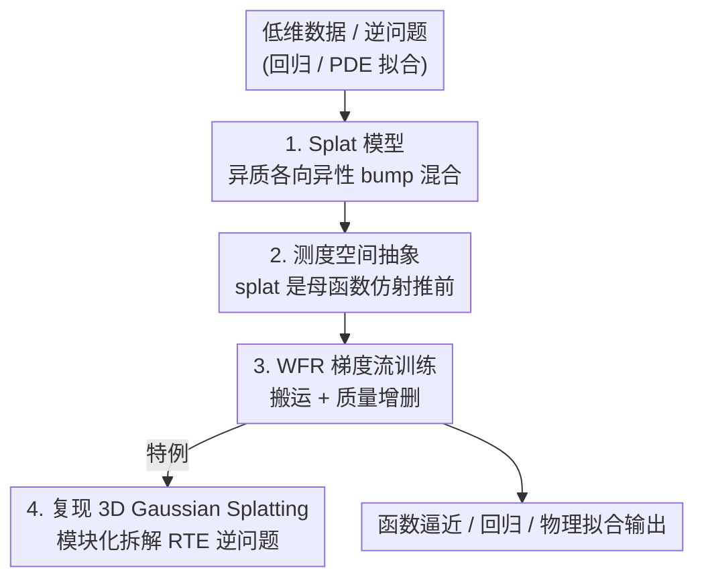

# Splat Regression Models

**会议**: ICLR 2026  
**OpenReview**: [https://openreview.net/forum?id=rubeJmT1XM](https://openreview.net/forum?id=rubeJmT1XM)  
**领域**: 学习理论 / 函数逼近  
**关键词**: 函数逼近, 高斯泼溅, Wasserstein-Fisher-Rao 梯度流, 物理信息建模, 非参数回归

## 一句话总结
本文提出 Splat Regression Model（泼溅回归模型）——一类把输出写成「异质、各向异性 bump 函数（splat）加权混合」的函数逼近器，用 Wasserstein-Fisher-Rao 梯度流在测度空间上优化它；该框架把当下大热的 3D Gaussian Splatting 收编为一个特例，并在低维逼近、回归、物理信息拟合等任务上以远少的参数把 KAN / MLP 打出 $10\sim100$ 倍的误差差距。

## 研究背景与动机

**领域现状**：深度学习每一次「拐点」往往都伴随一个对路的架构——图像分类靠 CNN/ResNet，分割与生成靠 U-Net，语言建模靠 Transformer。但在低维科学计算与机器学习交叉的问题上（函数逼近、回归、物理信息 PDE 拟合），还没有出现这样的「对路架构」。当前主流要么是 MLP（配正弦/RBF 位置编码），要么是新晋的 Kolmogorov-Arnold Network（KAN）。

**现有痛点**：MLP 类方法在低维多尺度问题上既慢又难调——PINN（物理信息神经网络）训练有臭名昭著的失败模式，需要大量手工调参；逐点 evaluate MLP 渲染整个空间域代价高昂；位置编码虽有帮助但只是「适度成功」。与此同时，计算图形学里的 3D Gaussian Splatting 已经在新视角合成上大获成功，但它一直被当作一堆经验启发式（splat 初始化、噪声注入、剪枝/搬移策略）的集合，缺乏一个能说清「逆问题是什么、模型是什么、优化算法是什么」的统一理论。

**核心矛盾**：Gaussian Splatting 的成功本质上来自「空间局部、可自适应缩放与定向的基函数」这一建模思想，但这套思想被锁死在图形学的新视角合成里，没人把它抽象成一个通用的函数逼近框架，也没人把它的训练启发式翻译成有原理保证的优化算法。

**本文目标**：(1) 把 splat 建模抽象成一个通用的回归/逼近模型类，证明它的结构性质与万能逼近能力；(2) 给出有原理的、基于梯度的训练算法；(3) 把 3D Gaussian Splatting 作为该框架的一个实例「复现」出来，厘清其模块化结构；(4) 在代表性低维问题上验证其威力。

**切入角度**：作者把 splat 模型的参数解读成一个「分布上的分布」（distribution over distributions）——每个 splat 是某个母函数经仿射变换后的概率测度，整个模型是这些测度的加权混合。一旦站到测度空间的视角，优化 splat 模型就变成在测度空间上做梯度流，而 Wasserstein（位置/形状的连续搬运）与 Fisher-Rao（质量的瞬时增删）正好刻画了 splat「移动 + 增删」两类更新。

**核心 idea**：用「在 splat 测度空间上的 Wasserstein-Fisher-Rao 梯度流」这一统一框架，取代 Gaussian Splatting 里那堆零散启发式，并把它推广到任意低维逼近/回归/逆问题。

## 方法详解

### 整体框架

Splat 回归模型最朴素的形式就是一个加权 bump 混合：

$$f(x) = \sum_{i=1}^{k} v_i\, \mathcal{N}(x; b_i, A_i A_i^T), \quad v_i \in \mathbb{R}^p,\ b_i \in \mathbb{R}^d,\ A_i \in \mathbb{R}^{d\times d}$$

每个 $\mathcal{N}(x; b_i, A_iA_i^T)$ 是一个各向异性的高斯 bump（即 splat），位置由 $b_i$ 控制、尺度与朝向由 $A_i$ 控制，输出权重是向量 $v_i$。这可以看成一个「激活函数很怪」的两层神经网络，也可以看成把经典 Nadaraya-Watson 核回归推广到「异质混合权重」。

本文真正的贡献是把这个朴素形式抽象、再为它配一套有原理的训练机制。整条 pipeline 是：先把 splat 抽象成测度空间里的对象（每个 splat 是母函数 $\rho$ 的仿射推前 $\rho_{A,b}=(A(\cdot)+b)_\#\rho$，整个模型是这些 splat 的混合测度 $\mu$）；再给这个测度空间赋予 Wasserstein-Fisher-Rao 几何；然后在该几何下计算损失 $F(f_\mu)$ 关于 $\mu$ 的梯度，得到每个 splat 参数 $(v,A,b)$ 的连续时间动力学；最后把这套动力学离散化训练，并证明 Gaussian Splatting 的那些启发式恰好是这套梯度流的特例。

### 关键设计

**1. Splat 模型与 Bures-Wasserstein 流形：把 bump 写成测度的仿射推前**

要给 splat 模型配一套有原理的优化，第一步是把「一个 splat」放进一个有几何结构的空间。作者取一个零均值、各向同性的「母 splat」$\rho \in \mathcal{P}(\mathbb{R}^d)$，定义全体 splat 为它的所有仿射推前 $BW_\rho(\mathbb{R}^d) := \{(A(\cdot)+b)_\#\rho : A\in\mathbb{R}^{d\times d}, b\in\mathbb{R}^d\}$。命题 1 证明这个集合是 Wasserstein 空间 $W_2(\mathbb{R}^d)$ 的测地凸子集，且其上的 Wasserstein 度量退化为 Bures-Wasserstein 度量：

$$W_2^2(\rho_{A,b}, \rho_{R,s}) = \|b-s\|_2^2 + \|A\|_F^2 + \|R\|_F^2 - 2\|A^T R\|_*$$

其中 $\|\cdot\|_F$ 是 Frobenius 范数、$\|\cdot\|_*$ 是核范数。这个度量很关键：它说明 splat 之间的「距离」可以同时度量平移 $b$ 与形状/朝向 $A$ 的差异，从而 splat 的位置与各向异性形状在同一个流形上被统一描述。整个 splat 模型则是 splat 测度 $\mu \in \mathcal{P}(\mathbb{R}^p \times BW_\rho(\mathbb{R}^d))$ 诱导的 $f_\mu(x) := \mathbb{E}[v\,\rho_{A,b}(x)]$，离散到 $k$ 个支撑点就回到式 (1) 的有限和。和母 wavelet 类似，$\rho$ 被称作「母 splat」——选不同的母 splat 就得到不同的 bump 形状。

**2. 万能逼近与逼近率：splat 模型表达力的理论保证**

把模型抽象成测度后，需要回答「它到底能逼近什么、要多少个 splat」。作者证明有限 splat 模型落在 Cybenko 经典两层网络万能逼近定理的范畴内（命题 3）：紧集上任意连续函数都可被 $k$-splat 模型一致逼近。更进一步，定理 3 给出定量上界——逼近任意有界 Lipschitz 函数到 $\epsilon$ 精度，只需 $k \lesssim \epsilon^{-2(d+2)}$ 个 splat；定理 4 给出下界 $\epsilon^{-d} \lesssim k d^2$，二者结合说明：存在某个（非 Lipschitz 的）母 splat 能达到 Lipschitz 函数逼近的 minimax 最优率 $\epsilon \sim k^{-1/d}$，而对任意「nice」母 splat，最坏情况逼近率至多 $\epsilon \sim k^{-1/2(d+2)}$。作者也诚实指出：和 MLP 的万能逼近率一样，这些最坏情况上界通常远不能描述真实数据上达到高质量拟合所需的参数量——理论是兜底，实测才是真章。

**3. Wasserstein-Fisher-Rao 梯度流：splat 的「搬运 + 增删」统一训练**

这是把 splat 模型从「静态函数类」变成「可训练架构」的核心。作者把 splat 测度空间 $\mathcal{S}_{p,d}$ 同时赋予 Wasserstein 与 Fisher-Rao 两种几何：Wasserstein 几何通过「无穷小搬运映射」移动 splat（连续地挪位置、变形状），Fisher-Rao 几何（即信息几何/Hellinger 度量）通过「质量瞬移」直接把某处密度按比例放大或缩小（保质量地增删 splat）。定理 1 给出损失泛函 $F(f_\mu)$ 在全局坐标 $(v,A,b)$ 下的梯度。Fisher-Rao 方向负责调节每个 splat 的「存在感」：

$$\nabla^{FR}_\mu F(f_\mu)(v,A,b) = \mathbb{E}_{X\sim\rho_{A,b}}[\langle\delta F(X), v\rangle] - \mathbb{E}_{v,A,b\sim\mu}\big[\mathbb{E}_{X\sim\rho_{A,b}}[\langle\delta F(X), v\rangle]\big]$$

Wasserstein 方向则给出三组参数的连续动力学 $\dot v_t, \dot A_t, \dot b_t$，分别更新输出权重、形状/朝向矩阵、位置。把两者合起来就是 WFR 梯度流。这套设计之所以有效，是因为它把 Gaussian Splatting 里靠手工拼凑的两类操作——「移动/变形 splat」和「新增/删除 splat」——分别对应到搬运与质量增删，从而第一次让这些操作有了能保证（连续时间极限下）降低损失的原理依据。作者还借此把若干经验启发式翻译成正则化风险最小化：选择性噪声注入对应给目标加凸的熵正则项；particle birth-death 动力学是 Fisher-Rao 梯度流的已知离散化，于是定理 1 直接「开」出一个有降损保证的剪枝准则。

**4. 把 3D Gaussian Splatting 拆成模块化特例**

框架的说服力体现在它能「复现」3D Gaussian Splatting（例 2）。作者把新视角合成显式写成一个逆问题：前向算子是辐射传输方程（RTE），未知量是「发射函数」$s$ 与「消光函数」$\sigma$。两者都用 splat 模型参数化——$\sigma(x)=g_\nu(x)$，而 $s(x,\cdot)=\sum_{i=1}^{p} f^{(i)}_\mu(x)\phi_i(v)$ 用球谐基 $\{\phi_i\}$ 展开、系数场 $f_\mu$ 又是一个 splat 模型（$p\approx 20$）。渲染就是评估 RTE

$$A[s,\sigma](x,v) = \int_0^\infty s(x+tv, v)\,\sigma(x+tv)\,\exp\!\Big(-\int_0^t \sigma(x+sv)\,ds\Big)\,dt$$

实践中用 $\alpha$-blending 离散近似，splat 参数靠带 birth-death 动力学的 SGD 训练。这一节的价值在于它清清楚楚地把整条管线拆成「逆问题（RTE）/ 模型（splat 参数化的两个场）/ 优化算法（WFR 流 + α-blending）」三块互不混淆的模块——这正是作者反复强调的「厘清逆问题、模型、算法」，也让 Gaussian Splatting 从一堆 trick 变成框架里一个可解释的实例。

### 损失函数 / 训练策略
经验风险最小化（例 1）：给定样本 $\{x_i\}$ 与标签 $y_i=f^*(x_i)$，损失 $F(f)=\frac1n\sum_i L(f(x_i), y_i)$，其一阶变分 $\delta F[f]$ 只在样本点有定义，作者用重要性采样得到无偏梯度估计 $\mathbb{E}_{X\sim\rho_{A,b}}[\delta F[f](X)] \approx \frac1n\sum_i \rho_{A,b}(x_i)\,\delta F[f](x_i)$。逆问题/物理信息训练（例 2）：损失为 $F(f)=\frac12\|\mathcal{A}[f]-g\|_{L^2}^2$，$\mathcal{A}$ 是已知积分-微分算子（如 Poisson 取 $\mathcal{A}[f_\mu]=\Delta f_\mu$），变分 $\delta F[f]=(D_f\mathcal{A})^*\mathcal{A}[f]-\mathcal{A}^*[g]$，对简单 $\rho$ 可预计算 $\Delta\rho$、$\nabla(\Delta\rho)$ 并用 Monte-Carlo 近似积分。实验里多用 Wasserstein 梯度下降或 Adam（学习率 $10^{-4}$）训练。

## 实验关键数据

### 主实验：与 KAN / MLP 的回归对比

| 任务 | 对比对象 | 结论 |
|------|----------|------|
| 1D 多尺度逼近 $f^*(x)=\sin(20\pi x(2-x))$ | Chebyshev 插值 / Haar 小波 | $k=30$ splat 显著优于同节点数 Chebyshev，逼近误差与「金标准」Chebyshev 插值相当；以 90 参数超过 255 参数（level-8）的 Haar 小波 |
| 2D 噪声回归 $f(x,y)=\sin(3\pi\sqrt{x})\cos(3\pi y)$ | KAN / MLP | splat 以一小部分参数取得低一个数量级的拟合误差 |
| 2D 物理信息（Allen-Cahn 方程） | KAN / MLP | $k=50$ splat 以远少参数把全部 KAN/MLP 架构打出一个数量级 |

整体上，论文宣称 splat 模型在低维逼近/回归/物理拟合上以远少参数把 KAN 与 MLP 的误差打到 $10\sim100$ 倍差距。

### 分析实验：参数量 vs 误差

| 模型 | 配置（示例） | 相对表现 |
|------|--------------|----------|
| SRM (splat) | $[10]\sim[400]$ | 同等甚至更少参数下误差最低，且随参数增大持续下降 |
| KAN | $[10]\sim[400]$、$[20,20]$ | 误差明显高于 SRM |
| MLP | $[200]\sim[1000]$、$[500,500]$ | 参数最多但误差最高一档 |

### 关键发现
- splat 的优势被归因于其「空间局部」特性——相当于一种可学习的位置编码，作者半开玩笑地总结为低维建模上「smart positional encoding is all you need」。
- 1D 实验中验证 log-MSE 呈指数级快速收敛，且该现象对不同初始化与目标函数都稳健（即便简单的均匀初始化与无动量梯度下降也能训成）。
- 表达力强是双刃剑：splat 模型容易过拟合，需要正则化才能拿到好的拟合，这与万能逼近上界「最坏情况参数量很大」的理论提醒一致。

## 亮点与洞察
- **把热门 trick 收编成理论特例**：3D Gaussian Splatting 一直被当作工程启发式集合，本文用 WFR 梯度流给它一个「逆问题/模型/算法」三分的干净解释，并把噪声注入、剪枝等启发式逐一翻译成正则化风险最小化里的具体项——这是「先有现象、后补理论」的漂亮范例。
- **测度空间视角的迁移性**：把「分布上的分布」+ Wasserstein-Fisher-Rao 几何用作训练框架，这套思路可迁移到任何「基函数既要搬运、又要增删」的模型（如自适应基、混合模型、粒子方法），剪枝/birth-death 都能落到统一的梯度流语言里。
- **「自适应网格插值」的直觉**：把 splat 模型理解成学一张自适应插值网格，解释了它为何在多尺度、带尖锐界面（如 Allen-Cahn）的低维问题上能以极少参数打赢 MLP/KAN。

## 局限与展望
- **定位在低维**：方法明确针对低维数据（计算科学 ∩ ML 交叉的逼近/回归/逆问题），论文并未声称、也没验证它在高维深度学习任务上的可扩展性。
- **易过拟合、依赖正则化**：作者自己承认 splat 模型表达力强但容易过拟合，而「有原理的 splat 正则化方法」被明确列为未来工作，当前实验仍在用相对简单的设置。
- **理论上界偏松**：万能逼近的最坏情况参数量上界（$k\lesssim\epsilon^{-2(d+2)}$）随维度 $d$ 急剧恶化，和 MLP 一样并不能反映真实数据所需参数量；理论保证与实测表现之间仍有缺口。
- **大规模 NVS 仍未端到端验证**：例 2 给出了 Gaussian Splatting 的框架化复现，但论文主体实验集中在 1D/2D 合成与 PDE 任务，大规模新视角合成上的实证留待后续。

## 相关工作与启发
- **vs KAN / MLP（+ 位置编码）**: KAN 与 MLP 靠（学习的）激活或正弦/RBF 位置编码处理多尺度，本文改用空间局部的 splat 当「可学习位置编码」，在低维任务上以远少参数取得低一个数量级的误差；区别在于 splat 把局部尺度与朝向显式做成可优化参数。
- **vs Chizat & Bach (2018) 等两层网络平均场理论**: 同样用 Wasserstein-Fisher-Rao 梯度流分析两层网络优化，但 splat 模型参数空间几何根本不同——第一层神经元活在 Bures-Wasserstein 流形上，而非普通欧氏参数；这也是与 Chewi et al. (2025b) 「ReLU 叠加」架构的主要差异。
- **vs 3D Gaussian Splatting (Kerbl et al., 2023)**: 后者是一套高度依赖初始化/噪声/剪枝启发式的工程方法，本文把它复现为 splat 框架的一个实例，并用 WFR 梯度流为这些启发式提供原理解释，从「调参艺术」走向「正则化风险最小化」。

## 评分
- 新颖性: ⭐⭐⭐⭐⭐ 把 Gaussian Splatting 抽象成通用回归框架并用 WFR 梯度流统一训练，视角新且有理论深度。
- 实验充分度: ⭐⭐⭐⭐ 1D/2D 逼近、回归、物理信息三类任务对比 KAN/MLP 充分，但大规模 NVS 未端到端验证。
- 写作质量: ⭐⭐⭐⭐⭐ 定义、命题、定理与示例层层递进，把抽象测度框架与具体算法对应得很清楚。
- 价值: ⭐⭐⭐⭐⭐ 为低维科学计算/物理信息建模提供了一个有原理、参数高效的新架构，并统一解释了一项 SOTA 技术。

<!-- RELATED:START -->

## 相关论文

- [\[ICLR 2026\] On Coreset for LASSO Regression Problem with Sensitivity Sampling](on_coreset_for_lasso_regression_problem_with_sensitivity_sampling.md)
- [\[ICLR 2026\] Learning under Quantization for High-Dimensional Linear Regression](learning_under_quantization_for_high-dimensional_linear_regression.md)
- [\[ICLR 2026\] Polynomial Convergence of Riemannian Diffusion Models](polynomial_convergence_of_riemannian_diffusion_models.md)
- [\[ICLR 2026\] On the Interpolation Effect of Score Smoothing in Diffusion Models](on_the_interpolation_effect_of_score_smoothing_in_diffusion_models.md)
- [\[ICLR 2026\] Theory of Scaling Laws for In-Context Regression: Depth, Width, Context and Time](theory_of_scaling_laws_for_in-context_regression_depth_width_context_and_time.md)

<!-- RELATED:END -->
