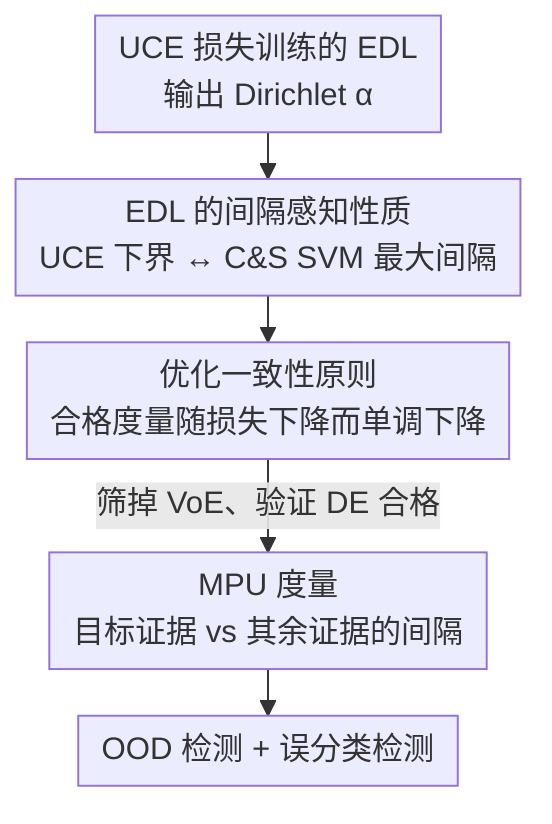

# Stop Guessing: Choosing the Optimization-Consistent Uncertainty Measurement for Evidential Deep Learning

**会议**: ICLR 2026  
**OpenReview**: [https://openreview.net/forum?id=rGoJxYibgj](https://openreview.net/forum?id=rGoJxYibgj)  
**代码**: https://github.com/LinyeLi60/M-EDL  
**领域**: 学习理论 / 不确定性估计 / 证据深度学习  
**关键词**: Evidential Deep Learning, 不确定性度量, 最大间隔 SVM, 优化一致性, OOD 检测

## 一句话总结
本文从优化视角重新审视证据深度学习（EDL），证明用 UCE 损失训练 EDL 等价于隐式地最大化类间间隔（与 Crammer–Singer 多类 SVM 同构），由此提出"优化一致性原则"作为筛选不确定性度量的判据，并据此设计了一个简单、可解释的新度量 MPU（间隔感知预测不确定性），在 OOD 检测与误分类检测上显著优于传统度量。

## 研究背景与动机

**领域现状**：证据深度学习（EDL）是一类高效的不确定性估计框架。它让一个确定性网络直接输出 Dirichlet 分布的参数 $\alpha = e + 1$（$e=\sigma(z(x;\Theta))$ 为非负证据），单次前向就能同时刻画偶然不确定性与认知不确定性，比 MC-Dropout、Deep Ensembles 这类需要多次采样/多模型的贝叶斯方法快得多，被广泛用于开放集识别、可信多视图分类、OOD 检测。

**现有痛点**：几乎所有先前工作都只从**概率视角**分析 EDL——设计先验、利用 Fisher 信息、约束 Shannon 熵等等，把 EDL 当成一个"放之四海皆准的概率估计器"。但 EDL 本质上是一个深度学习模型，其行为强烈受**优化过程**（损失设计、梯度动力学）塑造。只盯着 Dirichlet 分布的概率性质、忽略优化特性，对 EDL 的理解是不完整的。

**核心矛盾**：现有的各种不确定性度量（证据空虚 VoE、微分熵 DE、互信息 MI）都是从 Dirichlet 参数直接推导出来的，**没有人检验它们是否与训练目标的优化方向一致**。如果一个度量在样本越接近损失最优点时反而给出更高的不确定性，它就在和训练目标对着干，会误导对预测可靠性的判断。

**本文目标**：(1) 揭示 UCE 损失到底在优化什么；(2) 给出一个客观判据，判断哪种不确定性度量"配得上"这个损失；(3) 据此设计一个真正与优化一致的度量。

**切入角度**：作者在玩具数据集上发现一个现象——用 UCE 损失训练得到的 EDL 线性分类器，方向几乎与 Crammer–Singer 多类 SVM 的最优解重合（而与 One-vs-Rest SVM 对不齐）。这暗示"间隔"这一概念是从 EDL 目标里**自然涌现**的，而非外加的。

**核心 idea**：把不确定性度量的合法性绑定到优化动力学上——一个度量只有当"样本越接近全局最优、其不确定性越低"时才算合格（优化一致性）；并据此提出直接刻画"目标类证据 vs 其余类证据"间隔的 MPU。

## 方法详解

### 整体框架
本文不是提出一个新网络，而是建立一条"从优化性质 → 筛选判据 → 新度量"的理论链条。起点是用 UCE 损失训练好的 EDL 模型（输出 Dirichlet 参数 $\alpha$）；第一步证明 UCE 损失存在一个**间隔感知下界**，最小化它等价于最大化类间间隔，与 C&S 多类 SVM 同构；第二步据此抽象出**优化一致性原则**，作为评判任意不确定性度量的客观判据，并用它筛掉不合格的 VoE、验证 DE 合格；第三步顺着这个原则设计与 UCE 损失显式对齐的新度量 **MPU**；最后把 MPU 用于 OOD 检测和误分类检测。三步层层递进，前一步的结论是后一步的依据。

### 关键设计

**1. EDL 的间隔感知性质：UCE 损失隐式等价于最大间隔 SVM**

这一步回应"UCE 损失到底在优化什么"。作者证明（Theorem 1），对样本 $(x,y)$，UCE 损失存在如下间隔感知下界：

$$L_{UCE}(x,y,W,\Psi) \geq \phi\Big(-M(x,y;W,\Psi)\Big),\quad \phi(t)=\log\big(1+(K-1)\min(1,\exp(t))\big)$$

其中间隔量 $M(x,y)=\sum_{j\neq y}\big(w_y^\top\Psi(x)-w_j^\top\Psi(x)\big)$，把真实类的输出 $z_y$ 同时与所有其他类的输出 $z_j$ 作对比。由于 $\phi$ 关于 $t$ 单调递增，**最小化 UCE 损失等价于最大化间隔量** $(K-1)z_y-\sum_{j\neq y}z_j$——它鼓励 $z_y$ 取大正值、各 $z_j$ 取小负值，这正是最大间隔分类的目标。

更进一步（Proposition 1），作者比较 UCE 损失对分类器权重的梯度与 C&S SVM 最优解的结构：当真实类 Dirichlet 强度较大（$\alpha_{i,y_i}\gg 1$，指数激活下常见）时，梯度可近似为

$$\nabla_{w_j}L_{UCE}\approx\sum_{i=1}^{N}\big(\delta_{y_i,j}-b_{ij}\big)\Psi(x_i),\quad b_{ij}=\frac{\alpha_{ij}-1}{S_i}$$

而 C&S SVM 的最优解为 $w_j=\beta^{-1}\sum_i(\delta_{y_i,j}-\eta_{ij})x_i$。两式结构完全对应：EDL 中的信念质量 $b_{ij}$ 扮演了 SVM 对偶系数 $\eta_{ij}$ 的角色。对正确类（$j=y_i$），更新项 $(1-b_{i,y_i})$ 让学习自动聚焦在模型仍不确定的样本上；对错误类（$j\neq y_i$），$-b_{ij}$ 把分类器从被错误激活的样本嵌入"推开"。换言之，高不确定性或高冲突的样本充当了"动态支持向量"，这说明 EDL 的梯度下降在**动态地**实现 SVM 用固定支持向量定义边界的同样效果。这一连接的意义在于：间隔本就内生于 EDL 目标，因此不确定性应该围绕"间隔/优化进度"来定义，而非脱离损失单独从 Dirichlet 参数臆测。

**2. 优化一致性原则：用损失曲面给不确定性度量"验明正身"**

有了上面的连接，自然要问：哪些不确定性度量与这个优化过程**兼容**？作者提出优化一致性原则（Theorem 2）：度量 $u(x;W,\Psi)$ 合格，当且仅当对任意两个训练样本，损失更小的样本其不确定性也更小：

$$L_{UCE}(x,y,W,\Psi)\leq L_{UCE}(x',y',W,\Psi)\ \Rightarrow\ u(x;W,\Psi)\leq u(x';W,\Psi)$$

直观上，把损失看成一个曲面，样本落在曲面上的不同点；越靠近"山谷"（最优点）的样本，合格度量给出的不确定性就该越低。否则度量就在和训练目标矛盾。这个原则的价值在于把"度量好不好"从主观经验变成一个**可证伪的客观判据**。

作者立刻用它筛查现有度量。**证据空虚** VoE $=K/\sum_j\exp(w_j^\top\Psi(x)+1)$ **不满足**：反例为 $K=3$、同标签的两样本 $\alpha=(10,1,1)$ 与 $\alpha'=(10,10,1)$，前者损失更小，但 VoE 反而判它不确定性更高（$3/12 > 3/21$），与优化方向相悖。而**微分熵** DE（式 7，$\mathrm{ENT}=\log B(\alpha)+(S-K)\psi(S)-\sum_j(\alpha_j-1)\psi(\alpha_j)$）**满足**该原则（Proposition 2）——降低 UCE 损失可靠地降低微分熵（但注意这是单向蕴含，熵本身不足以反推损失大小排序）。这就解释了为什么传统 VoE 在 OOD/误分类检测里常常表现拉胯。

**3. MPU：直接刻画"目标证据 vs 其余证据"间隔的新度量**

DE 虽合格但有两个毛病：取值非正、缺乏直观尺度（-1.9 和 -2.9 谁更确定不直观），且对分布集中程度的敏感度只是"中等"。顺着优化一致性原则和间隔感知性质，作者设计了**间隔感知预测不确定性 MPU**（Proposition 3，式 9）：

$$\mathrm{MPU}(\alpha)=(K-1)\,\alpha_{\hat y}-\sum_{j\neq\hat y}\alpha_j$$

其中 $\hat y$ 是模型输出概率最大的预测类。它直接度量**预测类证据与其余所有类证据之间的间隔**——这与设计 1 里被最大化的间隔量 $(K-1)z_y-\sum_{j\neq y}z_j$ 形式同构，因此天然与 UCE 损失对齐。MPU 越大表示越确定（注意：它是"确定性分数"，实际用作不确定性度量时取其反向）。其优势体现在三点：(1) **可解释**——从 0（最大不确定）单调增长到大正值，有直观尺度；(2) **敏感**——当预测分布从 $\alpha=(4,8,8)$ 逐步集中到 $(2,2,16)$ 时，MPU 从 4 急剧升到 28，而同区间内 VoE、MI 几乎纹丝不动、DE 仅小幅变化；(3) **通用**——VoE 只能捕捉"证据缺失"（仅适合 OOD），MPU 同时捕捉证据缺失（OOD）和类间证据冲突（顶部预测接近时，适合误分类检测）。

## 实验关键数据

### 主实验
CIFAR-10 上，以 VGG16 为骨干、仅用 UCE 损失（不加任何后验正则），对比四种不确定性度量挂在同一模型上的表现（AUPR，越高越好）。模型分类精度 93.35%（远高于各 EDL baseline 的 ~88-90%）：

| 度量（同一 UCE 模型） | →SVHN | →CIFAR100 | →GTSRB | →Places365 | →Food101 | 误分类检测 |
|------|------|------|------|------|------|------|
| Our /w VoE | 48.96 | 66.45 | 69.64 | 43.21 | 45.65 | 96.63 |
| Our /w MI | 84.28 | 86.73 | 86.35 | 68.61 | 76.81 | 99.09 |
| Our /w DE | 87.32 | 88.11 | 87.30 | 70.91 | 78.64 | 99.31 |
| **Our /w MPU** | **87.36** | **88.92** | **88.71** | **72.82** | **79.79** | **99.41** |
| Δ(MPU vs VoE) | +38.40 | +22.47 | +19.06 | +29.69 | +34.14 | +2.78 |

仅把度量从 VoE 换成 MPU（模型完全不变），五个 OOD 数据集上 AUPR 分别暴涨 +38.40、+22.47、+19.06、+29.69、+34.14，误分类检测 +2.78。这直接验证了"度量是否优化一致"对可靠性的决定性影响。

### 消融实验
CIFAR-100（类别更多）与视频开放集识别（UCF-101→HMDB-51，I3D 骨干）上的跨场景验证：

| 配置 | 关键指标 | 说明 |
|------|---------|------|
| 度量排序（UCE 训练下） | MPU > DE > MI > VoE | 与优化一致性原则预测的优劣序完全吻合 |
| CIFAR-100 类别增多 | UCE+MPU 持续领先 | 类别越多 MPU 优势越明显 |
| 视频开放集 UCF→HMDB | MPU: Open maF1 78.31 / AUC 77.67 | 超过 DEAR(77.24/77.08) 及 w/DE(77.23/77.07) |
| 噪声鲁棒性（5 级损坏） | MPU 最优 | 高斯噪声/模糊/亮度扰动下精度与误分类检测均最好 |

### 关键发现
- **度量的优劣序 MPU > DE > MI > VoE 只在 UCE 损失下成立**，换其他损失就不成立——印证了"度量必须与所用损失优化一致"这一核心论点，而非某个度量天生更好。
- **VoE 是最差搭档**：它违反优化一致性，在 OOD 检测上 AUPR 比 MPU 低 19~38 个点，坐实了理论反例的预测。
- **类别数越多 MPU 增益越大**：CIFAR-100 上优势比 CIFAR-10 更突出，因为类别多时类间证据冲突的信息更丰富，MPU 的"间隔"刻画更有用武之地。
- MPU 在 OOD 检测上未必每个数据集都第一，但与最优极其接近，且在误分类检测和分类精度上一致最优；它在 ID 区域不会像微分熵那样产生不期望的高不确定性。

## 亮点与洞察
- **把"间隔"从 SVM 搬进 EDL 的理论桥**：证明 UCE 损失存在间隔感知下界、且梯度结构与 C&S SVM 对偶解同构，这是一个非平凡且优雅的连接，给"用什么度量"提供了第一性原理依据，而非经验拼凑。
- **优化一致性原则是可复用的方法论**：它把"评价不确定性度量"从经验比较升级为可证伪的判据（损失小 ⇒ 不确定性低），这个思路可迁移到任何带明确训练目标的不确定性框架——只要能写出损失，就能用它筛度量。
- **MPU 形式极简却命中要害**：$(K-1)\alpha_{\hat y}-\sum_{j\neq\hat y}\alpha_j$ 一行公式、无需任何额外训练或后验正则，却同时解决了 VoE 的不一致和 DE 的不可解释，是"理论指导下的最小可行设计"的范例。

## 局限与展望
- **理论仅覆盖平稳分布下的分类**：优化一致性与间隔连接都建立在静态分布假设上，对分布漂移、概念漂移、持续学习等非平稳场景尚未分析（作者明确将其列为未来方向）。
- **间隔感知下界依赖近似条件**：Proposition 1 的梯度同构需要"正确类 Dirichlet 强度 $\alpha_{i,y_i}\gg 1$"且使用指数激活，偏离该条件时连接强度未充分讨论。
- **MPU 依赖预测类 $\hat y$**：度量以 $\arg\max$ 的预测类为基准计算间隔，当模型预测本身严重错误时，"目标证据"的选取可能失真，论文未深入分析这种极端情形。
- 实验主要在 CIFAR 与单个视频基准上，更大规模数据集（如 ImageNet 级）上的表现仍待验证。

## 相关工作与启发
- **vs 传统 EDL 度量（VoE / 微分熵 / 互信息）**：它们都从 Dirichlet 参数直接推导、不检验与训练目标是否一致；本文用优化一致性原则证明 VoE 不合格、DE 合格，并给出更优的 MPU，把"选度量"从经验问题变成理论问题。
- **vs EDL 改进变体（I-EDL / R-EDL / Re-EDL / PostN / NatPN）**：这些方法靠设计先验、Fisher 正则、调整先验或归一化流来提升性能，仍停留在概率视角且常需后验正则；本文**不加任何后验正则**、只换度量就实现更高 AUPR，思路是"理解优化"而非"加正则"。
- **vs 经典 SVM 最大间隔理论**：本文揭示 EDL 隐式在做 C&S 多类 SVM 的间隔最大化，把深度证据学习与经典间隔理论打通，为校准、拒识学习等方向提供了新的交叉点。

## 评分
- 新颖性: ⭐⭐⭐⭐⭐ 首次从优化视角连接 EDL 与最大间隔 SVM，并提出可证伪的度量筛选原则，视角新颖且非平凡。
- 实验充分度: ⭐⭐⭐⭐ CIFAR-10/100 + 视频开放集 + 噪声鲁棒性多场景验证理论，但缺更大规模数据集。
- 写作质量: ⭐⭐⭐⭐⭐ 从现象观察→理论证明→原则抽象→新度量，逻辑链条层层递进，叙事清晰。
- 价值: ⭐⭐⭐⭐⭐ 一行公式的 MPU 即插即用、零额外开销大幅提升可靠性，且原则可迁移到其他不确定性框架。

<!-- RELATED:START -->

## 相关论文

- [\[ICLR 2026\] Variational Deep Learning via Implicit Regularization](variational_deep_learning_via_implicit_regularization.md)
- [\[ICLR 2026\] Non-Asymptotic Analysis of (Sticky) Track-and-Stop](non-asymptotic_analysis_of_sticky_track-and-stop.md)
- [\[ICLR 2026\] Deep Learning with Learnable Product-Structured Activations](deep_learning_with_learnable_product-structured_activations.md)
- [\[ICLR 2026\] On Universality of Deep Equivariant Networks](on_universality_of_deep_equivariant_networks.md)
- [\[ICLR 2026\] Online Inventory Optimization in Non-Stationary Environment](online_inventory_optimization_in_non-stationary_environment.md)

<!-- RELATED:END -->
