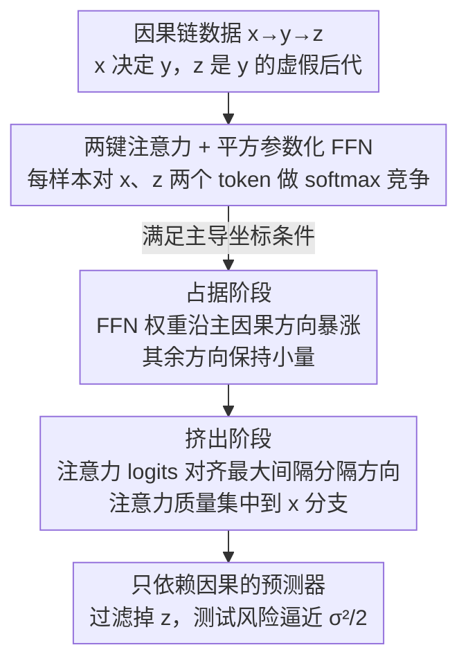

# Strong Correlations Induce Cause Only Predictions in Transformer Training

**会议**: ICLR 2026  
**OpenReview**: [https://openreview.net/forum?id=z8xjWmyQSZ](https://openreview.net/forum?id=z8xjWmyQSZ)  
**领域**: 学习理论 / 训练动力学分析  
**关键词**: 因果学习, 虚假相关, 隐式正则化, 注意力机制, 训练动力学

## 一句话总结
本文发现并刻画了 Transformer 训练中的一个新现象——相关性挤出（Correlation Crowding-Out, CCO）：当数据里某个因果特征与目标的相关性强到压过所有虚假特征时，梯度下降会在没有任何不变性正则、也不需要多环境标签的情况下，自发把虚假线索过滤掉、收敛到几乎只依赖因果特征的预测器，并给出了「占据—挤出」两阶段机制的理论证明与视觉/语言实验验证。

## 研究背景与动机
**领域现状**：让模型从观测数据里抽出因果不变性、从而获得鲁棒泛化，一直是 AI 的核心期望。但用经验风险最小化（ERM）训练的模型普遍存在「捷径学习」（shortcut learning）——不加区分地利用任何相关性，包括与真实因果机制无关的虚假线索。Transformer 和 LLM 把这个矛盾放大了：它们时而依赖浅层伪影，时而又能给出看起来很有逻辑、很鲁棒的答案。

**现有痛点**：已有理论只给出了零碎线索。一类是 in-context 任务上的分析，说明注意力能从马尔可夫链序列里重建父节点集、估计转移概率，但都依赖人为设计的 ICL 设置，没回答「带虚假后代特征的通用训练里，虚假信息何时在训练和测试时都被抑制」；另一类大间隔（max-margin）分析说明梯度下降会把 query–key 参数推向最大间隔分隔超平面，但没刻画这种分隔到底是过滤掉了虚假特征、还是别的什么，也没给出「只依赖因果」的风险保证。

**核心矛盾**：学界主流叙事是「神经网络有简单性偏好，虚假/易拟合特征会在早期主导训练、延迟甚至完全压制因果特征的学习」。本文反过来追问其**镜像情形**：当因果特征本身在预测性上占主导时，会发生什么？直觉上，如果一个因果特征以压倒性强度解释了目标，模型其实没什么动力去依赖更弱的虚假线索——但这个直觉能否被严格证明，且对 Transformer 这种带 softmax 注意力的结构成立？

**一个关键反例先泼冷水**：本文强调，数据里有强因果相关性**并不**自动保证「只依赖因果」。在论文的 Example 25 里，即便满足主导性，总体最小二乘回归仍会保留一个恒定比例的虚假特征去拟合噪声。所以 CCO 不是数据主导性的平凡推论，它真正依赖的是优化过程（GD + Transformer 结构）带来的隐式正则化。

**核心 idea**：在「因果特征相关性占主导」这一前提下，用一个最小因果链 $x \to y \to z$ 上训练的简化 Transformer，证明 GD 的隐式正则化会通过「占据（occupation）+ 挤出（crowding-out）」两阶段耦合机制，自发收敛到只依赖因果 $x$、过滤掉虚假后代 $z$ 的解。

## 方法详解

### 整体框架
本文是一篇机制分析论文，没有提出新算法，而是**先观测现象、再用一个可解析的玩具模型证明机制**。整体可拆成三步：(1) 把「因果 vs 虚假」的核心张力压缩成一个最小因果链生成过程 $x \to y \to z$，其中 $x$ 是决定 $y$ 的因果父节点、$z$ 是由 $y$ 诱导的虚假后代；(2) 用一个两键（two-key）注意力 + 平方参数化前馈层的简化 Transformer 去拟合，并用标准 GD 训练；(3) 给出「主导坐标条件（Dominant-Coordinate Condition）」，在该条件下证明训练动力学必然走过「占据」与「挤出」两个耦合阶段，最终收敛到只依赖因果的预测器，并配上收敛与泛化的高概率保证。

把整个训练动力学串起来看，就是下面这条流水线：

### 关键设计

**1. 最小因果链玩具模型：把「因果 vs 虚假」压缩成 $x \to y \to z$ 上的两键注意力**

要严格分析「虚假特征何时被挤出」，必须有一个既能解析、又保留关键非线性的载体。本文用一个最小有向无环图 $x \to y \to z$：协变量 $x, z \in \mathbb{R}^d$，标量响应 $y \in \mathbb{R}$ 是 $x$ 的稀疏二次信号 $y = x^\top (w^*)^{\odot 2} + \epsilon$，其中 ground-truth $w^*$ 是稀疏二值向量（$w^*_1 = 1$，支撑集大小 $\le r$）；虚假后代 $z = f(y) + \xi$ 通过一个 $L$-Lipschitz 函数 $f$ 依赖 $y$。这把「$x$ 携带因果信号、$z$ 是由 $y$ 下游诱导的虚假相关」这一在情感分析等场景中常见的结构提炼了出来。

模型侧用一个**两键注意力**：给两个 token 加上固定位置编码 $\tilde{x} = (s_1; x)$、$\tilde{z} = (s_2; z)$，query 取为可学习的门控向量 $q^t = \tilde{v}^t$。利用 softmax 的平移不变性，注意力权重可写成一个对差向量的 sigmoid：

$$p^t_i = \sigma\!\big((\tilde{v}^t)^\top(\tilde{x}_i - \tilde{z}_i)\big), \qquad \hat{h}_{i,t} = p^t_i\,\tilde{x}_i + (1-p^t_i)\,\tilde{z}_i.$$

预测头是平方参数化的对角型 FFN：$\hat{y}_{i,t} = \hat{h}_{i,t}^\top (\tilde{w}^t)^{\odot 2}$，损失为平方误差。这个模块其实就是一个 $W_Q, W_K, W_V$ 全取恒等投影的单头点积注意力——它剥掉了会遮蔽优化动力学的投影层，却**完整保留了 softmax 竞争几何与值混合机制**这两个产生 CCO 的关键非线性。位置编码 $s_1 \ne s_2$ 还在 logit 差里注入了一个样本无关的间隔 $(\tilde{v}^t)^\top(s_1 - s_2)$，在训练早期 $x_i$、$z_i$ 还难分时，防止门控塌缩到 $1/2$、保证梯度非退化和分支可辨识。

**2. 主导坐标条件：用两条不等式刻画「强到足以挤出」的边界**

CCO 不是凭空发生的，需要数据满足一个可量化的主导性。本文定义有效信号 $s^{\mathrm{eff}}_j := s_j + \mu_j$，其中 $s_j = \mathbb{E}[(x^\top(w^*)^{\odot 2})(x_j + z_j)]$ 衡量响应 $y$ 与组合坐标 $x_j + z_j$ 的交叉矩、$\mu_j = \mathbb{E}[\epsilon(x_j+z_j)]$ 修正噪声泄漏；再用 $m_j$、$m_{kj}$ 表示组合特征的二阶矩尺度。

- **条件 1（保证占据）**：主导坐标的有效信号要以一个一致间隔压过所有竞争者，即 $s^{\mathrm{eff}}_1 > \tfrac{2 m_1}{15} + \max_{j>1}\big(\tfrac{4 s^{\mathrm{eff}}_j + m_{1j}}{8}\big)$（⚠️ 系数以原文为准）。注意它**允许**其它坐标上存在很强的、由后代诱导的虚假相关，只是不让它们盖过主导因果方向。
- **条件 2（保证挤出）**：存在常数 $\tau_1, \tau_2 > 0$，使每个样本都满足非平凡间隔 $|x^i_1 - z^i_1| \ge \tau_1$、符号稳定 $\mathrm{sgn}(x^i_1 - z^i_1) = \mathrm{sgn}(x^i_1)$，以及主导坐标的间隔下界 $\tfrac{3}{4}|x^i_1| \ge (r-1)B'_x + B_\epsilon + \tau_2$。

这套条件最关键的「反直觉」之处是：它**不排除**某些非主导因果坐标比虚假后代坐标与 $y$ 的相关性还低（即对某个 $j>1$ 有 $\mathrm{Cov}(x_j, y) < \mathrm{Cov}(z_j, y)$）。换句话说，虚假特征可以很强，只要主导因果方向存在一个持续的间隔优势，CCO 就能发生——这正是它区别于「虚假特征必须弱」这类简化假设的地方。

**3. 占据—挤出两阶段耦合动力学：FFN 先占位、注意力再做选择**

在主导坐标条件下，训练分两个耦合阶段展开，本文用一个分段步长调度（先只更新 FFN 权重 $\tilde{w}$、再只更新门控 $\tilde{v}$、最后再调 $\tilde{w}$）把它们解耦分析：

- **占据阶段（早期暴涨）**：在 FFN 子层里，与主导因果坐标对齐的权重 $\tilde{w}_1$ 迅速增长到一个稳定的大尺度，而其它方向的权重保持很小。这一步让因果方向对优化器变得「显眼」，确立它为驱动预测的主信号。
- **挤出阶段（注意力选择）**：注意力的 query–key 对齐逐渐转向变换后因果与虚假特征之间的**最大间隔分隔方向**（大致是 $\tilde{x} - \tilde{z}$），于是注意力权重 $p^t_i$ 几乎全部集中到因果 $x$ 分支，把虚假 $z$ 分支门控掉。

两阶段是「耦合」的：占据让因果方向产生方向性偏置，注意力再把这个偏置转化为「选择」。整条路径上 GD 没有用任何不变性专用正则，却把模型推到了只依赖因果的解。

**4. 收敛与泛化的高概率保证：从训练轨迹一路证到测试鲁棒**

本文给出两条定理把上述机制锚死。**定理 1（机制）**：在条件 1、2 与上述步长调度下，以概率至少 $1 - 1/d^2$，平方参数化头收敛到 ground-truth，活跃坐标误差 $|w^{T^*}_i - w^*_i| \lesssim \sigma\sqrt{\log d}/\sqrt{n}$、非活跃坐标误差 $\lesssim 1/d$；门控迭代满足 $\tilde{v}^t = \hat{u}\log t + \rho_t$，沿最大间隔射线 $\hat{u}$ 以对数发散的范数前进，使 $p^{T^*}_i \ge 1 - 1/d^2$（注意力几乎全押因果分支）。**定理 2（泛化）**：同分布测试下，学到的门控仍偏好因果分支，测试损失以 $O(r\sigma^2 \log d / n)$ 的速率逼近「只依赖因果」的噪声地板 $\sigma^2/2$。**推论 1** 进一步说明：即便测试时改变 $y \to z$ 的机制（$z' = f'(y) + \xi'$），同一个 CCO 预测器依旧把注意力压在因果分支上、保持低风险——这正是「只依赖因果」带来的分布偏移鲁棒性。

## 实验关键数据

### 主实验（模拟 + 真实任务）
模拟实验直接跑 Algorithm 1：数据由 $x \to y \to z$ 生成（$z = Cy + \xi$，$w^*$ 取全 1），batch size 64、维度 $d \in \{5, 10\}$、跑 5000 次迭代。结果与理论完全吻合——批平均注意力 $\bar{p}^t_x$ 在前 100 次迭代里迅速冲到 1（占据阶段），之后稳定在 1，而 $\|w - w^*\|_2$ 缓慢下降到最小（挤出阶段 $w$ 的其余分量才慢慢逼近最优）。

| 任务 | 设置 | 关键现象 |
|------|------|----------|
| 模拟（two-key attention） | $d\in\{5,10\}$, 5000 iter | $\bar{p}^t_x$ 前 100 iter 冲到 1；$w_1$ 占据期到位、其余分量挤出期收敛 |
| 视觉（Waterbirds，前景-前景） | ptrain=0.9，左鸟为因果 $y$、右鸟为虚假 $z$ | 注意力前 50 iter 在左鸟上暴涨（占据），iter 500 几乎全集中在左鸟、右鸟近零（挤出） |
| 视觉（ViT vs CNN） | DeiT-Small vs ResNet34 / EfficientNet-B4，~20M 参数，1000 epoch | 强偏置（如 0.9）下 DeiT-Small 准确率显著高于 CNN，说明 Transformer 更能抓住因果信号 |
| 语言（Amazon 情感分类） | 微调 bert-base-uncased，50k 步 | mask NOUN+VERB 时测试损失快速下降（占据）；mask ADJ+VERB 出现上升趋势，说明名词注意力被因果挤出 |

### 分析实验（OOD 与显著性）

| 配置 | 关键指标 | 说明 |
|------|---------|------|
| ptrain ≥ 0.9 | 测试准确率随 ptest 升高而下降 | 未学到不变因果特征，重度依赖虚假背景线索 |
| ptrain ≤ 0.85 | 测试准确率显著上升并稳定 >95% | CCO 标志：成功挤出虚假特征、学到只依赖因果的预测器 |
| 语言显著性（"I hate this DVD, it's awful."） | 1%/50%/99% 训练步的 saliency | 因果词（hate, awful）随训练逐步挤出虚假名词（DVD）的显著性 |

### 关键发现
- **存在一个偏置阈值**：训练偏置强度 $p_{\mathrm{train}} \le 0.85$ 时 Transformer 触发 CCO、OOD 鲁棒（>95%）；一旦 $\ge 0.9$ 就退回依赖虚假线索。这给出了「何时能靠标准训练自发去偏」的可操作边界。
- **占据先于挤出**：无论模拟、视觉还是语言，都先看到因果方向/token 的快速占据，再看到对虚假分支的抑制，三类任务的现象顺序与理论两阶段一致。
- **Transformer 优于 CNN**：在强虚假相关下，注意力的 softmax 竞争 + 值混合机制让 ViT 比同规模 CNN 更容易自发选中因果信号。

## 亮点与洞察
- **把「捷径学习」翻了个镜像**：以往理论强调虚假特征压制因果学习，本文证明在因果主导区，GD 的隐式正则化反而成了因果学习的「盟友」，给出了「Transformer 何时显得有因果性」的一个干净答案。
- **反例 + 主导条件的组合很有说服力**：先用 Example 25 证明「数据主导性 ≠ 只依赖因果」（线性回归仍留虚假特征），再把功劳精确归给 Transformer + GD 的优化诱导正则化，逻辑闭环漂亮。
- **可迁移的训练直觉**：论文给出两条实操建议——(i) 在数据里放大因果对齐、拉宽主导间隔；(ii) 用轻度注意力稀疏或大步长调度去强化强特征。它们不强加不变性，却提高了「标准训练自发选到只依赖因果解」的概率。
- **位置编码的新角色**：$s_1 \ne s_2$ 不只是位置信息，而是给两分支注入样本无关间隔、打破对称、防止门控早期塌缩——这是 CCO 能启动的催化剂。

## 局限与展望
- **依赖强因果主导**：CCO 的前提是存在一个压过所有虚假特征的主导因果方向。当虚假线索同样强或数量众多时，单环境 ERM 仍可能依赖它们，此时仍需多环境不变性学习。
- **玩具模型的简化**：理论建立在两键注意力 + 平方参数化 FFN、恒等投影、最小因果链 $x\to y\to z$ 上，与真实多层多头 Transformer 仍有距离；定理依赖精心设计的分段步长调度，实际训练里两阶段未必如此干净可分。
- **条件的可验证性**：主导坐标条件涉及有效信号、二阶矩等总体量，在真实数据上难以直接检验，论文主要靠 Waterbirds 偏置强度等代理变量间接验证。
- **改进思路**：把分析推广到多主导坐标、多虚假后代、深层注意力堆叠的情形，并尝试给出可在实践中估计的「CCO 触发条件」诊断指标。

## 相关工作与启发
- **vs 不变风险最小化（IRM）/ 不变因果预测（ICP）**：它们靠显式不变性正则或跨环境异质性来逼近因果对齐；本文证明在因果主导区，单环境、无环境标签、无不变性惩罚的标准 GD 也能自发达到只依赖因果，二者是互补而非替代的两条路径。
- **vs 简单性偏好 / 捷径学习理论**：以往工作（Shah et al., Yang et al.）说明虚假特征更易拟合、会延迟或抑制因果学习；本文聚焦其镜像区（因果特征占主导），把 CCO 刻画为捷径学习的对偶现象。
- **vs 注意力 max-margin 隐式偏置（Tarzanagh et al. 等）**：已有工作证明 GD 把 query–key 推向最大间隔分隔超平面，但没说清哪一侧对应因果、何时分隔足以保证只依赖因果泛化；本文补上了「分隔方向 $\tilde{x}-\tilde{z}$ 恰好挤出虚假后代」这一缺口，并给出风险保证。

## 评分
- 新颖性: ⭐⭐⭐⭐⭐ 提出并命名了 CCO 这一新现象，视角是捷径学习的镜像，理论+实验闭环。
- 实验充分度: ⭐⭐⭐⭐ 模拟 + 视觉（前景-前景去混淆 + OOD 偏置扫描）+ 语言三类任务交叉验证两阶段机制，缺更大规模真实 LLM 验证。
- 写作质量: ⭐⭐⭐⭐ 机制叙述清晰、反例铺垫到位，但定理条件与步长调度较重，符号密集。
- 价值: ⭐⭐⭐⭐ 给「标准训练何时自发去偏」提供了可操作边界与训练直觉，对理解 Transformer 因果泛化有参考价值。

<!-- RELATED:START -->

## 相关论文

- [\[ICLR 2026\] Does Weak-to-strong Generalization Happen under Spurious Correlations?](does_weak-to-strong_generalization_happen_under_spurious_correlations.md)
- [\[ICLR 2026\] From Predictors to Samplers via the Training Trajectory](from_predictors_to_samplers_via_the_training_trajectory.md)
- [\[ICLR 2026\] Feature Compression is the Root Cause of Adversarial Fragility in Neural Networks](feature_compression_is_the_root_cause_of_adversarial_fragility_in_neural_network.md)
- [\[ICLR 2026\] On Smoothness Bounds for Non-Clairvoyant Scheduling with Predictions](on_smoothness_bounds_for_non-clairvoyant_scheduling_with_predictions.md)
- [\[ICLR 2026\] Resurfacing the Instance-only Dependent Label Noise Model through Loss Correction](resurfacing_the_instance-only_dependent_label_noise_model_through_loss_correctio.md)

<!-- RELATED:END -->
