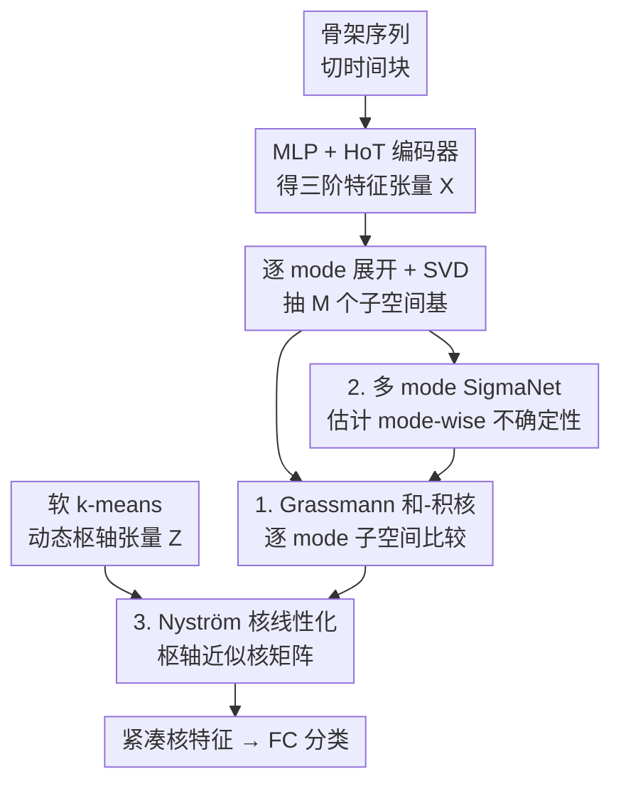

# Subspace Kernel Learning on Tensor Sequences

**会议**: ICLR 2026  
**OpenReview**: [https://openreview.net/forum?id=kv22NbU2T2](https://openreview.net/forum?id=kv22NbU2T2)  
**代码**: 无  
**领域**: 核方法 / 张量学习 / 子空间几何  
**关键词**: 张量核, Grassmann 流形, Nyström 近似, 不确定性建模, 骨架动作识别

## 一句话总结
本文提出 UKTL（Uncertainty-driven Kernel Tensor Learning），把高阶张量沿各个 mode 展开成子空间、在 Grassmann 流形上构造可学习的"和-积"核来比较张量序列，并用 Nyström 近似 + 软 k-means 动态枢轴让核可扩展、用 mode-wise 不确定性自适应降权噪声维度，端到端训练后在三个骨架动作识别基准上超过图卷积/超图/Transformer 方法。

## 研究背景与动机

**领域现状**：视频、生物信号等多路数据天然是高阶张量（空间×时间×特征），张量分解（CP / Tucker / t-SVD）能在保留多 mode 结构的前提下提取低秩表示；核方法则能把数据映射进 RKHS 做非线性比较。两条线各有所长，最近的张量子空间学习试图把二者结合起来。

**现有痛点**：① 大量核方法只接受向量化输入，先把张量"拍平"再算，这一步破坏了 mode 间结构，模型要么低效要么表达力不足；② 张量分解本质是线性的，难以和非线性学习框架融合；③ 现有核或张量子空间方法的核往往是**预定义、静态**的（手工核或随机选字典元），与训练过程脱节、无法适配具体数据分布；④ 几乎所有方法都**默认各个 mode 同等重要**，用统一正则项一刀切，而现实中空间、时间、语义各 mode 的信噪比和判别力差别很大。

**核心矛盾**：要表达力就得上非线性核，但核矩阵随样本数二次增长、不可扩展；要保结构就得保张量多 mode，但传统张量方法是线性的、且把所有 mode 当作等价。表达力 ↔ 可扩展性 ↔ 结构保真三者很难同时拿到，而 mode 重要性不均衡这一信息又一直被忽略。

**本文目标**：构造一个既保留张量多 mode 结构、又非线性、还可端到端扩展训练的核学习框架，并显式建模"哪个 mode 更可信"。

**切入角度**：作者观察到（Fig. 1）对动作张量做 Tucker 分解后，各 mode 的因子矩阵呈现出可解释的、mode 特异的结构化模式——也就是说**每个 mode 展开后的子空间本身就是有意义的比较单元**。于是不去直接比较原始张量，而是把每个 mode 的展开矩阵投影成低维子空间、当成 Grassmann 流形上的点来稳健比较。

**核心 idea**：用"逐 mode 子空间在 Grassmann 流形上的核"代替"张量整体比较或拍平向量比较"，再叠加不确定性加权与 Nyström 线性化，让核既结构感知、又抗噪、又可扩展。

## 方法详解

### 整体框架

UKTL 处理的是"张量序列分类"任务（以骨架动作识别为例）。输入是一段骨架序列，输出是动作类别。整条管线把序列切成时间块、编码成三阶特征张量，然后**沿每个 mode 展开 + SVD 抽子空间**，再用一组动态枢轴张量做 Nyström 核线性化，过程中用一个小网络估计每个 mode 子空间的不确定性来给核加权，最后得到紧凑的核特征送进分类器。整个流程端到端联合训练。

骨架序列先被切成 $\tau$ 个时间块，每块经一个 3 层 MLP 得到逐关节嵌入，再聚合成三元组超边、过 Higher-order Transformer（HoT）得到三阶特征张量 $\mathcal{X}_i \in \mathbb{R}^{d'\times N_\xi \times \tau}$（$N_\xi=\binom{J}{3}$ 是超边数）。注意这里的 mode 指"张量维度"（空间/时间/超边），不是传感器模态。编码器（MLP+HoT）是现成脚手架，本文真正的贡献集中在它之后的三个核模块。

### 关键设计

**1. Grassmann 子空间和-积核：用子空间几何代替张量直比**

针对"拍平破坏结构、直接比张量又高维且对噪声敏感"的痛点，UKTL 不比原始展开矩阵，而是先把每个 mode-$m$ 展开 $X_{(m)} \in \mathbb{R}^{I_m\times \bar I_m}$ 做 SVD，取前 $p$ 个左奇异向量 $U_{X(m)}\in\mathbb{R}^{I_m\times p}$，它张成一个 $p$ 维子空间，即 Grassmann 流形 $\mathcal{G}(p,I_m)$ 上的一个点。通过投影嵌入 $\mathrm{span}(U_{X(m)})\mapsto U_{X(m)}U_{X(m)}^\top$，子空间之间的差异可以用投影矩阵的欧氏距离度量，从而定义每个 mode 的高斯型因子核：

$$k(X_{i(m)}, X_{j(m)}) = \exp\!\left(-\frac{\lVert U_{X_i(m)}U_{X_i(m)}^\top - U_{X_j(m)}U_{X_j(m)}^\top\rVert_F^2}{2\sigma^2}\right)$$

为同时抓住 mode 间的"协同"与"独立"两种结构信息，作者把各 mode 因子核组合成**积核** $k=\prod_{m=1}^M k(X_{i(m)},X_{j(m)})$（强调跨 mode 的联合交互）和**和核** $k=\sum_{m=1}^M k(\cdot)$（强调单 mode 的可加贡献），再用一个系数 $\mu\in[0,1]$ 线性融合成 **sum-product 核**：

$$k(\mathcal{X}_i,\mathcal{X}_j) = \mu\sum_{m=1}^M k(X_{i(m)},X_{j(m)}) + (1-\mu)\prod_{m=1}^M k(X_{i(m)},X_{j(m)})$$

积核在所有有效因子核都高时才高（乘性、对任一 mode 不匹配很敏感），和核则容忍部分 mode 不匹配（加性、更鲁棒），两者互补。因为有效核的积与和都仍是有效核，整个 sum-product 核保持正定。子空间维度 $p$ 远小于原始展开维度，所以这套核既计算高效、又因为子空间能"近似"被遮挡/缺失的信息而抗噪。

**2. Mode-wise 不确定性加权（MSN）：让噪声大的 mode 自动靠边站**

针对"各 mode 被一刀切地同等对待"的痛点，UKTL 用一个 Multi-mode SigmaNet（MSN）显式建模每个 mode 子空间的可信度。MSN 有 $M$ 个分支（每 mode 一个），每个分支吃进投影矩阵 $U_{X_i(m)}U_{X_i(m)}^\top$，经一个 FC + 缩放 sigmoid 输出一个正的、有界的不确定性向量 $\sigma_{X_i(m)}\in\mathbb{R}^p$。它通过逐行除法把子空间基"漂白"：

$$\widetilde U_{X_i(m)} = U_{X_i(m)} / \sqrt{\sigma_{X_i(m)}}$$

即不确定性高的方向被除得更小、在后续核计算里贡献被压低。把上面所有核里的 $U$ 换成 $\widetilde U$ 就得到 uncertainty-aware 版本。训练时加一项基于极大似然的不确定性正则（见损失函数小节），让 $\sigma$ 不至于无意义地全部塌缩。这一设计的价值在于：当某个 mode（比如某段时间的关节噪声大、或某模态信号弱）不可靠时，模型不是靠人工调正则，而是**数据驱动地自适应降权**，既提升鲁棒性又带来 mode 级的可解释性。

**3. 动态枢轴 Nyström 核线性化：把不可扩展的核矩阵压成显式低秩特征**

针对"核矩阵随样本数二次增长、不可扩展"的痛点，UKTL 用 Nyström 低秩近似把核换成有限维显式特征。和"训练前随机选一组静态字典"的传统做法不同，本文用**可微的软 k-means 聚类**在张量空间里动态学出 $C$ 个枢轴张量 $\{\mathcal{Z}_j\}$（每个枢轴是一个局部原型），目标是

$$\min_{[\mathcal{Z}_1,\dots,\mathcal{Z}_C]} \sum_{i=1}^N \Big\lVert \mathcal{X}_i - \sum_{j=1}^C \mathcal{Z}_j [\alpha_i]_j \Big\rVert_F^2$$

其中 $\alpha_i$ 是 $\mathcal{X}_i$ 对各枢轴的软分配。随后计算数据-枢轴核矩阵 $K_{NC}$ 和枢轴-枢轴核矩阵 $K_{CC}$，对 $K_{CC}=U\Lambda U^\top$ 做特征分解、取逆平方根 $P^{-1}=U\Lambda^{-1/2}U^\top$ 来稳定求逆，最终得到居中后的 Nyström 嵌入 $\widetilde G = K_{NC}P^{-1} - \bar G \in \mathbb{R}^{N\times C}$ 作为低秩核特征送进分类器。因为枢轴是聚类学出来、且整条计算可微，枢轴集会在训练中随样本张量和学到的子空间一起演化，使核近似始终贴合当前数据分布——这把"可扩展性"和"自适应性"一并拿下。

### 损失函数 / 训练策略

完整模型串成 $f(\mathcal{X};\mathcal{P}) = \mathrm{FC}(\mathrm{MSN}(\mathrm{HoT}(\mathrm{MLP}(\mathcal{X}))))$，端到端训练。损失把分类交叉熵与不确定性正则相加：

$$\ell^*(\mathcal{X},y;\mathcal{P}) = \sum_{i=1}^N\Big[\ell(f(\mathcal{X}_i;\mathcal{P}),y_i) + \beta\sum_{m=1}^M\sum_{k=1}^p \log\Big(\frac{\sigma_{k,X_i(m)}+1}{\frac{1}{P}\sum_j \sigma_{k,X_j(m)}+1}\Big)\Big]$$

其中 $\ell$ 是交叉熵，$\beta$ 调节不确定性正则强度。该正则把每个 mode-维度的不确定性与其在整批样本上的均值做对数比，鼓励不确定性反映各子空间真实的变异/信息量，而非随意取值。优化用 SGD（momentum 0.9, weight decay 1e-4, batch 32, 初始 lr 0.1，分段 ×10 衰减）；$\mu$、$\beta$、Nyström 枢轴数等超参由 HyperOpt 自动调。框架是 modality-agnostic 的：骨架、RGB、深度等任何可表示成结构化张量的输入都能用同一核空间编码并通过可学习加权求和做融合。

## 实验关键数据

### 主实验

在 NTU-60、NTU-120、Kinetics-Skeleton 三个骨架动作识别基准上，所有张量方法共用同一 MLP+HoT backbone 做公平对比。UKTL 全面超过图/超图/Transformer 方法。

| 方法 | NTU-60 X-Sub | NTU-60 X-View | NTU-120 X-Sub | NTU-120 X-Setup | Kinetics Top-1 |
|------|------|------|------|------|------|
| DSDC-GCN（图，最强基线之一） | 93.0 | 97.1 | 89.9 | 90.6 | 38.6 |
| CTR-GCN（图） | 92.6 | 96.7 | 89.6 | 91.0 | - |
| STST（Transformer） | 91.9 | 96.8 | - | - | 38.3 |
| Backbone（MLP+HoT） | 90.8 | 95.8 | 85.2 | 87.4 | 36.7 |
| + KPCA（拍平基线） | 92.0 | 96.8 | 88.6 | 90.1 | 37.1 |
| + TPCA（线性张量基线） | 91.6 | 96.8 | 88.2 | 90.0 | 38.0 |
| + KTL（本文，无不确定性） | 92.5 | 97.1 | 88.8 | 90.3 | 38.9 |
| **+ UKTL（本文完整）** | **93.1** | **97.3** | **90.0** | **91.4** | **39.2** |

KPCA 引入非线性但丢了张量结构、TPCA 保结构却受限于线性，二者都只在部分指标上小涨；KTL 把"非线性 + mode 感知"合到一起、全面优于两个基线；UKTL 再叠加不确定性正则，拿到最佳性能（相比 KTL 在 NTU-60 X-Sub +0.6%、NTU-120 X-Sub +1.2%）。

多模态融合（Table 2，NTU-60/120）进一步验证框架的通用性：Skeleton 单模态已是强基线，Skeleton+Depth 在 NTU-60 X-Sub 达 94.8%，三模态 Skeleton+RGB+Depth 达 95.5/98.5（NTU-60）和 92.8/94.0（NTU-120），且全部在统一张量-核空间里隐式对齐，无需任何模态专用结构。

### 消融实验

| 配置 | NTU-60 X-Sub | 说明 |
|------|------|------|
| Sum-only 核 | 81.6 | 只用加性核，明显偏弱 |
| Product-only 核 | 91.8 | 只用乘性核，已不错 |
| **Sum-product 核（完整）** | **93.1** | 加性+乘性互补，最好 |
| 线性核 | 77.5 | 表达力最差 |
| 多项式核（p=2/3） | 80.1~80.3 | 中等 |
| Nyström 枢轴 C=60 | 86.7 | 枢轴太少近似差 |
| Nyström 枢轴 C=150 | 93.1 | 升到 150 显著改善 |
| Nyström 枢轴 C≥180 | 93.5 | 之后饱和 |

### 关键发现
- **和核与积核强互补**：单独的和核仅 81.6%、积核 91.8%，融合后 93.1%——加性结构容忍部分 mode 不匹配、乘性结构强调跨 mode 联合，两者捕捉的是互补信息。
- **不确定性正则是稳定增益来源**：UKTL 相对 KTL 在每个数据集每个指标上都有提升（NTU-120 X-Sub 上 +1.2% 最明显），说明显式建模 mode 可信度对复杂骨架数据确实有用。
- **子空间维度 $p$ 低维即可**：精度随 $p$ 增大而升、超过数据集特定阈值后饱和（NTU-60 最优 $p=8$、NTU-120 $p=10$），印证"低维子空间已能抓住判别性结构"。
- **枢轴数有甜蜜点**：C 从 60→150 精度大涨（86.7→93.1），180 后稳定，是近似质量与算力的折中。

## 亮点与洞察
- **把张量比较搬到 Grassmann 流形**：核比较的不是张量数值本身而是各 mode 子空间的"朝向"，天然对噪声/遮挡鲁棒（子空间能近似缺失信息），同时低维子空间带来计算效率——一个几何视角解决了表达力与效率两件事。
- **和-积核的设计很巧**：用一个 $\mu$ 把"任一 mode 不匹配就惩罚"的乘性核和"容忍部分 mode 失配"的加性核连续插值，消融显示这正是性能跳变的关键，思路可迁移到任何需要组合多个子相似度的核场景。
- **不确定性以"漂白子空间基"的方式注入**：$\widetilde U = U/\sqrt{\sigma}$ 直接作用在子空间基上、再喂进核，而不是事后给 logits 加权，让不确定性真正参与相似度计算，且 mode 级 $\sigma$ 自带可解释性。
- **枢轴是学出来的而非随机选的**：可微软 k-means 让 Nyström 字典随训练演化，把"核近似"从训练前的静态预处理变成参与端到端优化的可学习组件，是把经典核技巧现代化的好范例。

## 局限与展望
- **实验局限在动作识别**：虽然作者强调框架 modality/任务无关、并展示了 RGB/Depth 融合，但全部基准都是骨架动作识别，张量序列的其他场景（生物信号、科学多路数据）未实测。
- **三阶张量为主**：方法以三阶超边张量为载体，更高阶（$M$ 更大）时积核连乘项增多、对单 mode 噪声更敏感，是否还稳健、$\sigma$ 加权能否兜住，文中没有压力测试。
- **超参依赖自动调参**：$\mu$、$\beta$、枢轴数 $C$、子空间维 $p$ 都要 HyperOpt 调，跨数据集的默认设置缺乏指导，迁移到新数据时需要重新搜索。
- **改进思路**：可探索自适应的 mode 数/子空间维选择、把枢轴聚类与不确定性联合优化（让枢轴本身也带可信度）、以及在非视觉张量序列上验证通用性。

## 相关工作与启发
- **vs 张量分解（CP / Tucker / t-SVD / MPCA）**：它们提供多线性低秩表示但本质线性、且默认各 mode 等价；本文在 mode 子空间上构造非线性核、并显式建 mode-wise 不确定性，做的是"非线性 + 不均衡 mode"的自适应比较。
- **vs 张量核方法（Kernelized Support Tensor Machine、Kronecker 积核等）**：它们多用预定义/静态核、依赖手工设计且无 mode 可信度机制；本文核是端到端学出来的，配 Nyström 动态枢轴兼顾可扩展与自适应。
- **vs 标准 Nyström / 随机特征近似**：传统近似用训练前固定、随机选的字典元，与学习过程脱节；本文枢轴由可微软 k-means 动态构造、随训练演化，使近似始终贴合数据与学到的子空间。
- **vs 图/超图/Transformer 骨架方法（CTR-GCN、Hyper-GCN、ST-TR 等）**：它们靠图卷积或全局注意力建空间-时间关系；本文用更简单、更可解释的张量核框架，在相同 backbone 下系统性反超，证明保结构 + 不确定性核是一条有竞争力的路线。

## 评分
- 新颖性: ⭐⭐⭐⭐⭐ 把 Grassmann 子空间核、动态枢轴 Nyström、mode-wise 不确定性三者整合成端到端张量核框架，视角新颖且自洽。
- 实验充分度: ⭐⭐⭐⭐ 三大基准 + 多模态融合 + 核选择/枢轴/子空间维/核组合多组消融充分，但任务集中于动作识别。
- 写作质量: ⭐⭐⭐⭐⭐ 动机—几何直觉—公式—消融逻辑清晰，图 1/图 2 把抽象核思路讲得很直观。
- 价值: ⭐⭐⭐⭐ 为结构化张量序列提供了可扩展、可解释的核学习范式，方法组件（和-积核、可学枢轴）有较强可迁移性。

<!-- RELATED:START -->

## 相关论文

- [\[ICLR 2026\] Understanding In-Context Learning on Structured Manifolds: Bridging Attention to Kernel Methods](understanding_in-context_learning_on_structured_manifolds_bridging_attention_to_.md)
- [\[ICLR 2026\] How to Square Tensor Networks and Circuits Without Squaring Them](how_to_square_tensor_networks_and_circuits_without_squaring_them.md)
- [\[ICLR 2026\] Understanding the Dynamics of Forgetting and Generalization in Continual Learning via the Neural Tangent Kernel](understanding_the_dynamics_of_forgetting_and_generalization_in_continual_learnin.md)
- [\[ICLR 2026\] Training-Free Determination of Network Width via Neural Tangent Kernel](training-free_determination_of_network_width_via_neural_tangent_kernel.md)
- [\[NeurIPS 2025\] Kernel Conditional Tests from Learning-Theoretic Bounds](../../NeurIPS2025/learning_theory/kernel_conditional_tests_from_learning-theoretic_bounds.md)

<!-- RELATED:END -->
