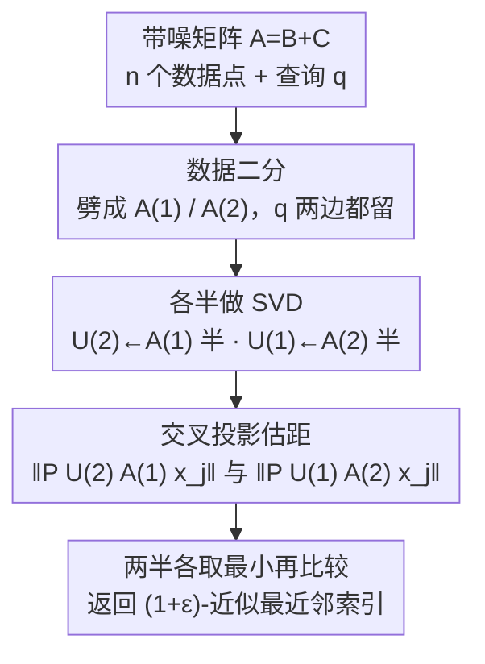

# SVD Provably Denoises Nearest Neighbor Data

**会议**: ICLR 2026  
**OpenReview**: [https://openreview.net/forum?id=N1kiOll2EN](https://openreview.net/forum?id=N1kiOll2EN)  
**代码**: 无  
**领域**: 学习理论 / 高维统计 / 谱方法  
**关键词**: 最近邻搜索, SVD 去噪, 子空间扰动, 半随机模型, 信息论下界

## 一句话总结
在「低维子空间信号 + 高维高斯噪声」的半随机模型下，本文证明只要对带噪数据做两次 SVD、把点投影到 top-$k$ 奇异子空间，就能在噪声水平 $\sigma = O(1/k^{1/4})$ 这一**比已有工作宽得多**的区间里准确恢复无噪数据的最近邻，并给出匹配的 $\sigma \gg 1/k^{1/4}$ 信息论不可能性下界。

## 研究背景与动机
**领域现状**：最近邻搜索（NNS）在高维空间里普遍依赖**随机投影**（Johnson–Lindenstrauss 引理）这类与数据无关（oblivious）的降维手段，进而催生了 LSH 等一整套有严格保证的近似算法。这些方法的好处是 worst-case 下随机投影被证明是最优的。

**现有痛点**：但实践中大家更爱用 **PCA / SVD 这类数据自适应（data-aware）投影**——PCA 树、谱哈希、语义哈希在真实数据上往往打败随机投影。问题是这些谱方法几乎**没有严格的正确性保证**：理论说随机投影最优，实践却说数据自适应更好，二者长期对不上。这道「理论保证 vs 经验成功」的鸿沟正是大规模数据分析里的公开难题。

**核心矛盾**：在 worst-case 输入下随机投影确实最优，所以**无法**在 worst-case 框架里给数据自适应方法理论优势。要解释 SVD 为何更好，必须换一个更贴近真实数据的模型——真实数据并非任意，而是**低维结构 + 噪声**。

**本文目标**：在 Abdullah et al. (2014) 提出的**半随机模型**下分析 SVD：$n$ 个点来自 $\mathbb{R}^d$ 中一个未知的 $k$ 维子空间（$k \ll d$），每个坐标被独立加上 $\mathcal{N}(0,\sigma^2)$ 高斯噪声；只给带噪数据，要求恢复**无噪数据**的最近邻。核心子问题是：SVD 能容忍多大的噪声 $\sigma$？这个阈值是否最优？

**切入角度**：把数据点、查询点和噪声都排成矩阵 $A = B + C$（$B$ 是秩-$k$ 的隐信号，$C$ 是高斯噪声）。既然真信号躺在 $k$ 维子空间里，那么 $A$ 的 top-$k$ 奇异子空间应当近似还原这个隐子空间——投影上去就能把绝大部分噪声能量滤掉，从而准确估计点对距离 $\|p_i - q\|$。

**核心 idea**：用「对带噪矩阵做 SVD、投影到 top-$k$ 子空间」直接做去噪式 NNS，把噪声容忍度从依赖**环境维度 $d$** 的逆多项式，提升到只依赖**内在维度 $k$** 的 $O(1/k^{1/4})$，并证明这个阈值是信息论意义下的最优。

## 方法详解

### 整体框架
算法的输入是带噪矩阵 $A \in \mathbb{R}^{d \times (n+1)}$：前 $n$ 列是 $n$ 个带噪数据点，最后一列是带噪查询点 $q$。输出是无噪数据下查询点的 $(1+\varepsilon)$-近似最近邻的索引。整条流水线只做两件事：**估子空间**（SVD）和 **投影后比距离**。

关键的工程化技巧是**数据二分（data splitting）**：把 $n$ 个数据点劈成前后两半 $A^{(1)}$、$A^{(2)}$（查询列两边都带），分别只用各自那一半去算 top-$k$ 奇异子空间 $U^{(1)}$、$U^{(2)}$。然后**交叉使用**——用 $U^{(2)}$ 去投影并恢复第一半数据的距离，用 $U^{(1)}$ 去恢复第二半数据的距离。这样做的唯一目的，是让「用来投影的子空间」和「被投影的数据噪声」在概率上**相互独立**，从而让集中不等式的论证干净可控。

具体地，记 $x_j = e_j - e_{n/2+1}$（第 $j$ 列减去查询列），则对第一半的每个点估计 $\big\| P_{U^{(2)}} A^{(1)} x_j \big\|$，对第二半估计 $\big\| P_{U^{(1)}} A^{(2)} x_j \big\|$；两半各取最小，再比较两个最小值，返回更小的那一侧索引。整套方法只需**两次 SVD 调用**，比 Abdullah et al. (2014) 的迭代 PCA 简单得多。

### 关键设计

**1. SVD 子空间投影去噪：用 top-$k$ 奇异空间把高斯噪声挡在外面**

针对的痛点是：高维下噪声向量的期望模长 $\sigma\sqrt{d}$ 可能远大于点间真实距离，直接在带噪数据上比距离会被噪声主导。本文的机制是：因为所有真信号点和查询都落在 $k$ 维隐子空间 $V$ 里（即 $P_V B^{(1)} = B^{(1)}$），而带噪矩阵的 top-$k$ 奇异子空间 $U^{(2)}$ 是 $V$ 的良好估计，于是投影后有恒等分解
$$P_{U^{(2)}} A^{(1)} = B^{(1)} + (P_{U^{(2)}} - P_V) B^{(1)} + P_{U^{(2)}} C^{(1)}.$$
第一项就是想要的真信号；第二项是「子空间估计误差」，可由 $\sin\Theta$（Davis–Kahan / Wedin）定理用 $k$ 阶奇异值 $s_k(B)$ 控制；第三项是「残留在 $k$ 维子空间里的噪声」，因为投影把 $d$ 维噪声压成 $k$ 维，其能量从 $\sigma^2 d$ 降到约 $2k\sigma^2$。Lemma 2.1 把这套分解量化为
$$\big\|P_{U^{(2)}} A^{(1)} x_j\big\|^2 - 2k\sigma^2 - \big\|B^{(1)} x_j\big\|^2 \le \frac{100\sigma^2 n}{s_k^2(B^{(2)})}\|B^{(1)}x_j\|^2 + \frac{40\sigma\sqrt{n}}{s_k(B^{(2)})}\|B^{(1)}x_j\|^2 + 20\sigma\|B^{(1)}x_j\|\sqrt{\ln n} + 40\sigma^2\sqrt{k\ln n}.$$
减掉确定性的噪声偏置 $2k\sigma^2$ 后，投影距离就是真实距离的 $(1\pm O(\varepsilon))$ 近似。这之所以有效，是因为 SVD 把噪声的「$d$ 维分散能量」收窄到信号所在的 $k$ 维，相当于一次免费的方差缩减——这正是谱方法在实践中去噪强的根本原因。

**2. 交叉数据二分：让投影子空间与被投影噪声相互独立**

针对的痛点是：如果用同一份数据 $A^{(1)}$ 既算子空间又做投影，那么 $P_{U^{(1)}}$ 和 $A^{(1)}$ 里的噪声 $C^{(1)}$ 是统计相关的，集中不等式里会出现难缠的交叉项。本文把数据对半切开，用**另一半**学到的子空间 $U^{(2)}$ 去投影 $A^{(1)}$，由于 $P_{U^{(2)}}$ 只依赖 $A^{(2)}$ 的噪声、与 $C^{(1)}$ 独立，像 $P_{U^{(2)}} C^{(1)} x_j$ 这样的项就退化为标准的随机高斯向量，可直接用随机矩阵理论（Rudelson–Vershynin 的谱范数界）和卡方集中来 bound。

50-50 的切分比例是 **minimax 最优**的：子空间估计精度由参与计算的点数决定（Lemma 2.4 中 $\|P_{U^{(2)}} - P_V\|$ 的界随点数增大而变小），而算法整体精度受**两半中较弱的那个子空间**限制；在对数据结构无先验时，对半切让较小那一半最大化，从而给出最稳健的保证。作者也坦言不确定二分是否必要，不二分的更简单算法是否可证留作公开问题。

**3. $\sigma = O(1/k^{1/4})$ 容噪阈值与匹配下界：刻画 NNS 的可恢复边界**

这是本文的理论主结果。Theorem 1.1 给出可恢复的充分条件——$\sigma$ 同时小于三项的最小值（约束分别来自子空间维度 $k$、谱隙 $s_k(B)/\sqrt n$、距离间隔 $\varepsilon$）：
$$\sigma \le \min\!\Bigg( \frac{\sqrt{\varepsilon/240}\,\min(\|B^{(1)}x_j\|,\|B^{(2)}x_j\|)}{(k\ln n)^{1/4}},\ \frac{\varepsilon\,\min(s_k(B^{(1)}),s_k(B^{(2)}))}{75\sqrt n},\ \frac{\varepsilon\,\min(\|B^{(1)}x_j\|,\|B^{(2)}x_j\|)}{36\sqrt{\ln n}} \Bigg),$$
此时算法以至少 $1 - 1/n$ 概率返回 $(1+\varepsilon)$-近似最近邻。第一项给出标志性的 $\sigma = O(1/k^{1/4})$，**只依赖内在维度 $k$，与环境维度 $d$ 无关**——这正是相对 Abdullah et al.（要求 $\sigma$ 是 $d$ 的逆多项式）的关键改进。

更妙的是这个阈值被证明**最优**：Lemma 3.1 通过把 NN 恢复归约到「区分 $X\sim\mathcal{N}(0,\sigma^2 I_k)$ 与 $Y\sim\mathcal{N}(0,(\sigma^2+\tfrac1k)I_k)$」这一更简单的假设检验问题，证明当 $\sigma \in \omega(1/k^{1/4})$ 时**任何**算法都无法以高概率区分，即此时无噪最近邻在信息论上不可识别。配合 $\sigma \gg 1/\sqrt k$（带噪数据的 NN 已经和无噪 NN 不同）这一观察，本文得到了既往工作没有的强结论：**SVD 能在「带噪 NN 已经错了」的区间里仍恢复出无噪 NN**。Lemma 3.2 对距离间隔 $\varepsilon$ 给出对应的 $\sigma \in \omega(\varepsilon)$ 下界。

### 损失函数 / 训练策略
本文是纯理论 + 谱算法，无训练目标。算法运行时间仅为两次 SVD：用迭代法（Musco–Musco）每次约 $O(ndk/\min(1,\sqrt{\text{gap}}))$，其中 $\text{gap} = s_k/s_{k+1} - 1$；在恢复区间里 $s_k(A)\sim s_k(B)$、$s_{k+1}(A)\sim\sigma$，gap 较大，既利于恢复也利于加速。算法需要预先知道内在维度 $k$（取 $k' > k$ 会使 $s_{k'}=0$ 让界失效），但实践中对全秩、谱衰减的真实数据，取略大的 $k'$ 是有效的启发式。该框架还可推广到 K-近邻：减去噪声偏置 $2k\sigma^2$ 后的估计距离 $\hat d_j^2 \in [(1-\tfrac\varepsilon3)d_j^2,(1+\tfrac\varepsilon3)d_j^2]$ 对所有 $j$ 同时成立，故取最小的 $K$ 个即得 $(1+O(\varepsilon))$-近似 K-NN 集合且保序。

## 实验关键数据

### 主实验
固定 $n=3000$、$k=30$、$\varepsilon=0.05$，每个 $\sigma$ 下做 100 次查询统计成功率，与朴素基线（直接在带噪 $A$ 上取 $\arg\min_j \|A x_j\|$，不去噪、受环境维度 $d$ 影响）对比。无法用 Abdullah et al. (2014) 做基线，因其时间/空间复杂度在该实验规模下不可行。

| 数据集 | 维度 $d$ | 本文 SVD 算法 | 朴素基线 | 现象 |
|--------|---------|--------------|---------|------|
| GloVe (Twitter 27B 词向量) | 200 | 失败阈值 $\sigma$ 显著更高 | 失败阈值更低 | 文本域 |
| MNIST (手写数字像素) | 784 | 失败阈值 $\sigma$ 显著更高 | 失败阈值更低 | 图像域 |

两个数据集都先做秩-$k$ 近似并重标定（让最近邻距离为 1、其余 $\ge 1+\varepsilon$）以贴合理论模型。结果显示：在「噪声太小不影响 NN」与「信息论上不可能恢复」两个极端之间，存在一个**中间区间**，本文算法在此区间持续优于基线，且环境维度 $d$ 越大、性能差距越明显——与理论中「基线依赖 $d$、本文只依赖 $k$」一致。

### 消融实验（理论紧性验证）
用 SVD 显式构造合成数据、可控 $s_k(B)$，验证 Corollary 2.8 中 $\sigma = O(s_k(B))$ 的线性依赖；噪声阈值定义为成功率首次跌破 90% 的 $\sigma$。

| 验证维度 | 理论预测 | 实验观察 |
|----------|---------|---------|
| 对 $k$ 的依赖 | $\sigma = O(1/k^{1/4})$（仅内在维度） | 失败阈值随 $k$ 按预测下降 |
| 对 $s_k(B)$ 的依赖 | $\sigma = O(s_k(B))$ 线性 | 全 $\sigma$ 范围内呈清晰线性 |
| 对环境维度 $d$ | 本文阈值与 $d$ 无关，基线随 $d$ 恶化 | $d$ 越大差距越大 |

### 关键发现
- **去噪增益来自 $k$ 而非 $d$**：本文算法的容噪阈值只挂在内在维度 $k$ 上，朴素方法挂在环境维度 $d$ 上，所以「高 $d$、低 $k$」的真实数据（正是 NNS 的常见场景）收益最大。
- **跨域稳健**：文本（GloVe）和图像（MNIST）上定性结论一致，说明 SVD 去噪不依赖具体数据分布。
- **理论是紧的**：合成实验确认了对 $s_k(B)$ 的线性依赖与对 $k$ 的 $1/4$ 次幂依赖，与 Theorem 1.1 / Corollary 2.8 吻合；但作者强调这只说明**分析**紧，并不等于算法对 $s_k(B)$ 最优。

## 亮点与洞察
- **为「数据自适应投影」补上理论**：长期以来 PCA/谱方法实践有效但缺保证，本文在半随机模型里第一次证明 SVD 可把容噪从 $d$ 的逆多项式提升到 $O(1/k^{1/4})$，给谱方法的经验优势一个严格解释。
- **「恢复 ≠ 保持」的概念突破**：以往工作（Abdullah et al.）只在「噪声没改变 NN」的区间里工作，本文却能在 $\sigma \gg 1/\sqrt k$、带噪 NN 已经和真 NN 不同的区间里**反推**出真 NN——这是质的区别。
- **下界与上界匹配**：把恢复问题归约成两个高斯分布的假设检验，干净地证明 $\sigma = O(1/k^{1/4})$ 是信息论极限，让上界不再是「也许还能更好」而是「到此为止」。
- **可迁移的二分技巧**：用数据二分换取「投影子空间 ⊥ 被投影噪声」的独立性，是高维统计里反复好用的 sample-splitting 思想，可迁移到其他「先估结构再用结构」的谱算法分析中。

## 局限与展望
- **需要已知内在维度 $k$**：取错 $k'>k$ 会让 $s_{k'}=0$ 使界失效；真实数据全秩、谱衰减时只能靠启发式选 $k'$。
- **依赖谱隙 $s_k(B)$**：保证里多了 $s_k(B)/\sqrt n$ 一项，需要数据矩阵良态（well-conditioned）；作者论证良态数据下该比值收敛到非零常数，但病态/退化数据上界会退化。
- **二分是否必要存疑**：作者明确把「不做数据二分的更简单算法是否可证」列为公开问题。
- **模型理想化**：i.i.d. 各向同性高斯噪声、信号严格落在 $k$ 维子空间，这些假设在真实数据上只是近似（实验也需先做秩-$k$ 投影 + 重标定才贴合模型）。
- **实验规模有限**：$n=3000$、单机 CPU，未在大规模 ANN benchmark（如十亿级）上验证；也未和 LSH 等实用系统直接比效率。

## 相关工作与启发
- **vs Abdullah et al. (2014)（谱 NNS）**: 他们用迭代 PCA、要求 $\sigma$ 是环境维度 $d$ 的逆多项式、且只在「噪声不改变 NN」的区间工作；本文只用两次 SVD、容噪改进到 $O(1/k^{1/4})$（仅依赖 $k$）、并能在带噪 NN 已变的区间里恢复真 NN。代价是引入对谱隙 $s_k(B)$ 的依赖。
- **vs Johnson–Lindenstrauss / LSH（随机投影）**: JL 用与数据无关的随机投影保距，worst-case 最优但当 $\sigma \gg 1/\sqrt d$ 时会把噪声距离一起保住、丢掉真 NN 结构；本文的数据自适应 SVD 专门去噪，证明在 $k = \Omega(\ln n/\varepsilon^2)$（与 JL 同款复杂度门槛）下能在高噪区间恢复 JL 必然失败的 NN。
- **vs 潜在语义索引的概率分析（Papadimitriou et al., 2000）**: 是已知最早用 SVD 给出噪声模型可证保证的工作，但其假设很强；本文在更一般的半随机模型下给出保证。

## 评分
- 新颖性: ⭐⭐⭐⭐⭐ 首次为 SVD 去噪式 NNS 给出与内在维度 $k$ 挂钩的容噪保证，并配匹配下界，弥合理论-实践鸿沟。
- 实验充分度: ⭐⭐⭐ 真实数据（GloVe/MNIST）+ 合成数据验证紧性到位，但规模小、未与实用 ANN 系统对比，作为理论论文够用。
- 写作质量: ⭐⭐⭐⭐ 噪声阈值的层级梳理（$1/\sqrt d$、$1/d^{1/4}$、$1/\sqrt k$、$1/k^{1/4}$）清晰，证明结构（分解 + 四引理 + 并集界）干净。
- 价值: ⭐⭐⭐⭐⭐ 给谱方法在 NNS 上的经验优势一个严格理论支撑，并刻画了可恢复性的信息论边界，奠基意义强。

<!-- RELATED:START -->

## 相关论文

- [\[ICLR 2026\] Two-Layer Convolutional Autoencoders Trained on Normal Data Provably Detect Unseen Anomalies](two-layer_convolutional_autoencoders_trained_on_normal_data_provably_detect_unse.md)
- [\[ICLR 2026\] T-Tamer: Provably Taming Trade-offs in ML Serving](t-tamer_provably_taming_trade-offs_in_ml_serving.md)
- [\[ICML 2026\] Provably Data-driven Multiple Hyper-parameter Tuning with Structured Loss Function](../../ICML2026/learning_theory/provably_data-driven_multiple_hyper-parameter_tuning_with_structured_loss_functi.md)
- [\[ICLR 2026\] Why Less is More (Sometimes): A Theory of Data Curation](why_less_is_more_sometimes_a_theory_of_data_curation.md)
- [\[ICLR 2026\] Diffusion Language Models are Provably Optimal Parallel Samplers](diffusion_language_models_are_provably_optimal_parallel_samplers.md)

<!-- RELATED:END -->
