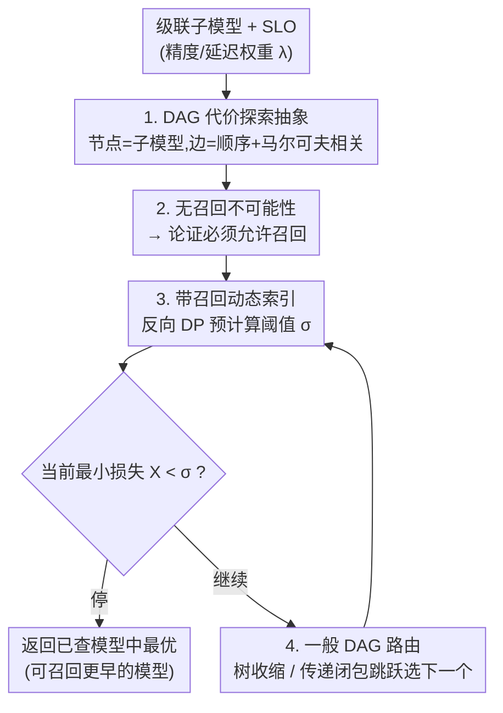

# T-Tamer: Provably Taming Trade-offs in ML Serving

**会议**: ICLR 2026  
**OpenReview**: [https://openreview.net/forum?id=JFY9MZtWTu](https://openreview.net/forum?id=JFY9MZtWTu)  
**领域**: 学习理论 / 模型服务 / LLM效率  
**关键词**: 级联推理, 早退出, 代价探索, 动态索引, 最优停止

## 一句话总结
把级联/早退出推理中"何时退出、调用哪个子模型"的取舍统一抽象成 DAG 上的代价探索问题，证明了"召回（可回头选用更早查过的模型）"是获得可证明最优解的充要条件——无召回策略连常数近似比都做不到，而带召回的动态索引策略能在多项式时间内取得在线最优。

## 研究背景与动机
**领域现状**：模型越做越大，靠单一最大模型应对所有请求既不经济也不必要。主流做法是级联推理（cascaded inference）：维护一组复杂度各异的子模型，按查询难度自适应地依次调用——简单样本走轻量模型、难样本才调用最复杂模型，从而在精度、延迟、成本等服务级目标（SLO）之间取得平衡。神经网络的逐层早退出（early-exit）就是这种范式的特例。

**现有痛点**：现有的退出/路由策略几乎全是启发式、且针对具体场景手工设计的。最典型的就是置信度阈值法：当前子模型预测置信度超过阈值就退出。这带来两个根本问题——(1) 泛化性差，为一个场景调好的策略换个场景就失效；(2) 次优性，得到的策略要么低效，要么根本没有可证明的效率保证。

**核心矛盾**：精度–延迟（以及精度–成本、延迟–吞吐）之间存在内在 trade-off，但社区缺乏一个跨场景、跨取舍统一适用、且有理论保证的路由与终止策略。启发式实践与理论保证之间存在一道鸿沟。

**本文目标**：给级联推理的双目标取舍提供一个通用、可证明的理论框架，并落地成一个与子模型训练解耦的"即插即用"组件。

**切入角度**：作者注意到一个被启发式方法忽视的关键现象——更大的模型不一定更好，甚至会"想太多（over-think）"，给出比中间模型更差的预测。这意味着"一旦退出就只能用当前最复杂模型"的单调假设是错的，必须允许"回头"重新选用更早查过、表现更好的模型。

**核心 idea**：把"路由 + 终止 + 选用"重写成 DAG 上的马尔可夫代价探索（costly exploration），并用"是否允许召回（recall）"这一刀切开策略空间——证明召回是可证明最优的充要条件。

## 方法详解

### 整体框架
T-Tamer 把级联推理的决策过程形式化为一个**多阶段决策过程**：给定一条查询，要决定"何时停（when to exit）"和"查哪个模型（which model to consult）"。其理论核心是把这一过程抽象成有向无环图（DAG）上的代价探索——节点是子模型、节点上挂一个随机损失 $R_i=\lambda\ell_i$，边编码两类信息：① 优先级约束（要查 $v_j$ 必须先查其前驱 $v_i$）；② 性能依赖（相邻模型的损失满足马尔可夫条件独立 $\ell_i \perp \ell_k \mid \ell_j$），走一条边要付边代价 $(1-\lambda)c(i,j)$。

在这个抽象下，作者先给出一个"负面"支点：**无召回策略**（退出后只能用最后查的那个模型，置信度阈值法即属此类）连任何常数近似比都拿不到，这是信息论层面的不可能性，加再多算力也绕不过去。这就**反推出**必须允许召回。随后作者为**带召回策略**给出一个可证明最优的**动态索引（dynamic index）**算法：离线用反向动态规划预计算每个状态的阈值 $\sigma$，在线时每查一个节点就把当前最小损失 $X$ 和 $\sigma$ 比一下决定停/继续，停时返回已查模型中损失最小的那个（这就是"召回"）。最后把单链上的动态索引推广到一般 DAG（有向树、有向线的传递闭包），保持最优且多项式时间可算。

### 关键设计

**1. 把级联推理抽象成 DAG 上的双目标代价探索**

针对"现有策略各自为战、无法跨场景统一"的痛点，作者用一个加性的双目标把所有取舍写成一个可证明的优化问题。对单个输入查询且只调用一个模型时，目标是 $\theta_\lambda(x)=\lambda\ell_1(x)+(1-\lambda)\ell_2(x)$，其中 $\lambda\in[0,1]$ 是可调权重，$\ell_1,\ell_2$ 是两个冲突目标（如精度损失与延迟成本）的代理损失。这个加性形式有两个好处：(i) 灵活，可以直接套用机器学习里的标准损失；(ii) 稳定，$\theta_\lambda$ 永远良定义，而"相减"型目标可能产生负值或无界等病态行为。

由于输入来自一个固定分布 $\mathcal{D}$，各子模型的损失服从一个联合相关分布。T-Tamer 把损失分别挂到节点和边上，从而把"路由 + 停止 + 选用"约化为 DAG 上的马尔可夫代价探索：策略 $\pi$ 从虚拟根 $v_0$ 出发自适应地选边探查后继节点，每步决定停或继续，目标是最小化节点损失与边损失的加权和 $\mathbb{E}[\lambda\cdot f([\ell_i]_{i\in O(\pi)})+(1-\lambda)\sum_{e\in E(\pi)}c(e)]$。无召回时 $f$ 取最后访问节点的损失；带召回时 $f=\min_{i\in O(\pi)}\ell_{1,i}$。作者关注三种实践中常见的 DAG 拓扑：有向线（顺序级联）、其传递闭包（允许保序跳跃）、有向树（决策树结构）。

**2. 无召回策略的信息论不可能性：召回是"必要"的**

针对置信度阈值这类主流启发式，作者证明它们有本质缺陷。在单链上，无召回探索退化为一个带马尔可夫依赖的最优停止问题（Problem 3.1）：依次观察非负损失 $R_1,\dots,R_n$，看到 $R_i$ 后要么立即停下付 $R_i$、要么不可逆地丢弃继续。基准是知道所有实现的离线最优（prophet）$\mathrm{OPT}=\mathbb{E}[\min_i R_i]$。

**定理 3.4（无召回不可能性）**：对无召回代价探索，没有任何算法能取得有界的 $\alpha$-近似比，即便 $n=2$ 且分布有界。证明用一个极简反例：$R_1=1/\alpha^2$（确定），$R_2=0$ 概率 $1-1/\alpha$、$=1/\alpha$ 概率 $1/\alpha$。此时任何算法的期望代价恰为 $1/\alpha^2$，而 prophet 的 $\mathrm{OPT}=\mathbb{E}[\min(R_1,R_2)]=\tfrac{1}{\alpha}\cdot\tfrac{1}{\alpha^2}=1/\alpha^3$，近似比 $=\alpha$，可随 $\alpha$ 任意大。关键在于：算法每次都看到相同的 $R_1$，无法区分 $R_2$ 会不会更小，又因为无召回而无法"回头"选更优者。这个限制是信息论的、不是计算复杂度的（不是 NP-hard），因此加算力绕不过去。由于置信度阈值法正是一种无召回策略，定理直接揭示了它们的根本上界。

**3. 带召回的动态索引策略：召回是"充分"的，且多项式时间最优**

这是 T-Tamer 的核心正面结果。带召回时两个损失无法再塌缩成单一目标：节点上付 $R_i=\lambda\ell_i$、走到当前节点的边上付 $c_i:=(1-\lambda)c(i-1,i)$；停下时总代价是 $\min_{k\in[i]}R_k+\sum_{j\in[i]}c_j$（即从已查模型里挑最优者，体现召回）。作者把连续的马尔可夫相关分布离散化（类似网格搜索，标准做法），然后用 Bellman 最优性原理从最后一个节点反向 DP 求解：

$$\Phi(X,R_{i-1},i)=\min\Big\{X,\; c_i+\mathbb{E}_{R_i\mid R_{i-1}}\big[\Phi(\min\{X,R_i\},R_i,i+1)\big]\Big\}$$

第一项是立即停止、第二项是继续并对剩余节点用最优停止。由此得到结构非常干净的结论：对固定的 $R_{i-1}$ 和 $i$，存在一个让决策者"停与继续无差别"的最大 $X$ 值，这个值就是**动态索引** $\sigma$（Def 4.4），定义为下式的最小解：

$$\mathbb{E}\Big[\big(\sigma-\min_{j=i}^{\tau^*}R_j\big)_+-\sum_{j=i}^{\tau^*}c_j\Big]=0$$

算法（Alg. 1）于是极简：维护当前最小损失 $X$，当 $X>\sigma$ 就付 $c_i$ 查下一个节点并更新 $X$ 与 $\sigma$，直到 $X\le\sigma$ 停下、返回已查最优节点。**定理 4.5** 证明该索引良定义、与当前 $X$ 无关（可记作 $\sigma(R_i,i{+}1)$），且取得在线最优；预处理 $O(n\cdot|V|^2T)$ 时间、$O(n|V|^2)$ 空间，推理时每节点 $O(1)$、每样本 $O(n)$——既最优又高效。直觉是：每个状态 $(X,R_i,i{+}1)$ 的停/继续决策都能离线预存成查表，在线只需 $O(1)$ 查表。

**4. 推广到一般 DAG：有向树与传递闭包**

单链只需"停/继续"二选一，一般 DAG 还要多一个**路由决策**（下一步查哪个）。对**有向树**（如代价感知的二分搜索、RLHF/众包等人在回路场景），作者设计了一套**节点收缩（tree contraction）**过程：把孩子只由单节点或多条链构成的子树收缩成单个节点，同时保持该子树的等价损失表和损失分布不变，迭代直到坍缩成一条线，再套用动态索引；DP 时需把一个节点所有孩子的信息合并。**定理 5.1** 证明它仍最优，复杂度与单链同阶（$O(n\cdot|V|^2T)$）。对**有向线的传递闭包**（允许保序跳跃、省去部分评估），区别在于计算等价损失时要枚举所有可能的下一个节点而非仅直接后继，**定理 5.2** 证明仍最优，预处理时间多一个 $n$ 因子（$O(n^2\cdot|V|^2T)$）。两种推广共同覆盖了实践中最常见的级联拓扑。

### 损失函数 / 训练策略
T-Tamer 与子模型的训练完全解耦——它不改子模型，只用所有子模型的输入–输出对去拟合上述理论最优解，因而是即插即用组件。两个标准假设：(2.1) 所有损失严格为正、边代价 $c_j$ 是与输入无关的常数；(2.2) 输入 i.i.d. 来自固定分布。为加速 $1000\times1000$ 量级转移矩阵的乘法，作者引入软状态聚合（SSA）把状态聚成 $q$ 个元状态作为近似代理。

## 实验关键数据

### 主实验
在真实 CV/NLP 早退出工作负载上评估动态索引策略（记作 RECALL / T-Tamer），对照不在运行时更新策略的离线早退出基准。指标用错误率 $\mathrm{Err}=1-\mathrm{Acc}$（Acc 以骨干模型输出为上界衡量），延迟相对原始延迟归一化。

| 任务 | 骨干 / 数据 | T-Tamer 表现 |
|------|------------|--------------|
| 视觉分类 | VGG-11/13，视频流（Auburn/Oxford） | ≈95% 精度时省约 50% 延迟；如 VGG-13 Auburn 延迟降到 45%、精度损失 <7% |
| NLP 分类 | GPT-2/BERT（IMDB/Amazon） | ≈75% 精度时省约 90% 延迟 |

| 基准 | 类型 | 与 T-Tamer 对比 |
|------|------|----------------|
| 1-Thr.（置信度阈值） | 分数法（无召回） | 高精度区 T-Tamer 一致更优；GPT-2 上 T-Tamer 与其持平，BERT 低精度区落后 <10% |
| Patience（K=1/K=2） | 规则法（连续 K 个一致才退出） | T-Tamer 在各 NLP 负载上一致超过 |

### 消融实验

| 配置 | 关键现象 | 说明 |
|------|---------|------|
| BERT + 1-Thr. | Pareto 前沿违反单调性 | 更深退出并非一律更好（模型"想太多"），印证召回的必要性 |
| SSA，$q>100$ | 精度落在精确转移矩阵 ±0.02 内 | $q\approx300$ 时几乎与精确版持平 |
| SSA，$q=50{\sim}800$ | 精度对元状态数基本稳定 | SSA 是大转移矩阵下的高效代理 |

### 关键发现
- **召回的价值在 BERT 上最直观**：1-thresholding 的 Pareto 前沿非单调，说明"退得越深越好"的隐含假设不成立；允许召回提供了更有效的信号，与全文"用召回换可证明保证"的动机直接呼应。
- **高精度区是 T-Tamer 的主场**：它在高精度区一致命中最优点，恰是实际服务最关心、也是启发式最容易掉点的区域。
- **SSA 让方法可扩展**：把 $1000\times1000$ 的转移矩阵压到几百个元状态，精度几乎无损，使动态索引在大支撑集下仍可算。

## 亮点与洞察
- **"召回 = 充要条件"是非常干净的二分**：用同一套代价探索抽象，一边证无召回的常数近似不可能（必要），一边给带召回的多项式时间最优算法（充分），把一个工程现象（置信度阈值不够好）提升成了信息论结论。
- **把级联推理接到 Pandora's Box / 最优停止理论上**：作者明确指出本工作是 Markovian Pandora's Box 的最小化版本，这条线把 ML serving 与 TCS 的代价探索文献打通，可复用大量已有工具（动态索引、DP）。
- **动态索引可预存成查表**：在线 $O(1)$/节点的特性使它真的能当即插件部署，而不是只停留在理论。
- **可迁移性**：DAG + 马尔可夫相关 + 动态索引这套，凡是"逐步付代价探查、可回头选用历史最优"的场景（代价感知二分搜索、RLHF 反馈采集、众包标注）都能套。

## 局限与展望
- **假设偏强**：边代价 $c_j$ 被设为与输入无关的常数、损失严格为正、相邻模型满足马尔可夫条件独立——真实系统的延迟常依赖输入与负载，相关结构也未必是马尔可夫的。
- **离散化依赖**：连续马尔可夫分布要量化到离散支撑 $V$，$|V|$ 进入复杂度的平方项，支撑过大时即便有 SSA 也可能吃力。
- **拓扑覆盖有限**：理论保证只覆盖有向线、其传递闭包和有向树，更一般的 DAG（任意跳接、多入度合并）是否仍能多项式时间最优未解决。
- **实验规模较小**：骨干局限在 VGG / GPT-2 / BERT 的早退出，未在真正的大模型（LLM）级联或多模型 inter-model 级联上验证；与运行时自适应的强基准对比也较少。

## 相关工作与启发
- **vs 置信度阈值 / 早退出（Xin et al., Teerapittayanon et al.）**：它们是无召回策略，本文证明其连常数近似都做不到；T-Tamer 用召回 + 动态索引取得在线最优，是对这类启发式的"理论判决 + 替代方案"。
- **vs 耐心法（Patience, Zhou et al.）**：耐心法靠"连续 K 个预测一致"启发式退出，本文在 NLP 负载上一致超过它，且给出可证明保证。
- **vs Pandora's Box / 代价探索（TCS 线）**：本文是 Markovian Pandora's Box 的最小化、ML systems 视角版本，把经典最优停止/搜索理论落到级联推理这一具体应用上。
- **vs inter-model 级联（Varshney & Baral、Lebovitz et al.）**：那些工作探索如何联合训练级联、感知系统约束，但缺乏保证；本文补上了"可证明高效路由与停止"的理论缺口。

## 评分
- 新颖性: ⭐⭐⭐⭐⭐ 把级联推理 trade-off 提炼成 DAG 代价探索，并证明"召回是充要条件"，视角与结论都新。
- 实验充分度: ⭐⭐⭐ 验证了核心主张（高精度区更优、召回必要、SSA 有效），但骨干与规模偏小、缺真正大模型级联。
- 写作质量: ⭐⭐⭐⭐ 理论叙事清晰，问题形式化、定理与算法层层递进。
- 价值: ⭐⭐⭐⭐ 为早退出/级联推理提供了少见的可证明理论基座，能指导更可靠的服务策略设计。

<!-- RELATED:START -->

## 相关论文

- [\[ICLR 2026\] How hard is learning to cut? Trade-offs and sample complexity](how_hard_is_learning_to_cut_trade-offs_and_sample_complexity.md)
- [\[ICLR 2026\] Nonparametric Contextual Online Bilateral Trade](nonparametric_contextual_online_bilateral_trade.md)
- [\[ICLR 2026\] SVD Provably Denoises Nearest Neighbor Data](svd_provably_denoises_nearest_neighbor_data.md)
- [\[ICML 2025\] Near-Optimal Consistency-Robustness Trade-Offs for Learning-Augmented Online Knapsack Problems](../../ICML2025/learning_theory/near-optimal_consistency-robustness_trade-offs_for_learning-augmented_online_kna.md)
- [\[ICLR 2026\] Two-Layer Convolutional Autoencoders Trained on Normal Data Provably Detect Unseen Anomalies](two-layer_convolutional_autoencoders_trained_on_normal_data_provably_detect_unse.md)

<!-- RELATED:END -->
