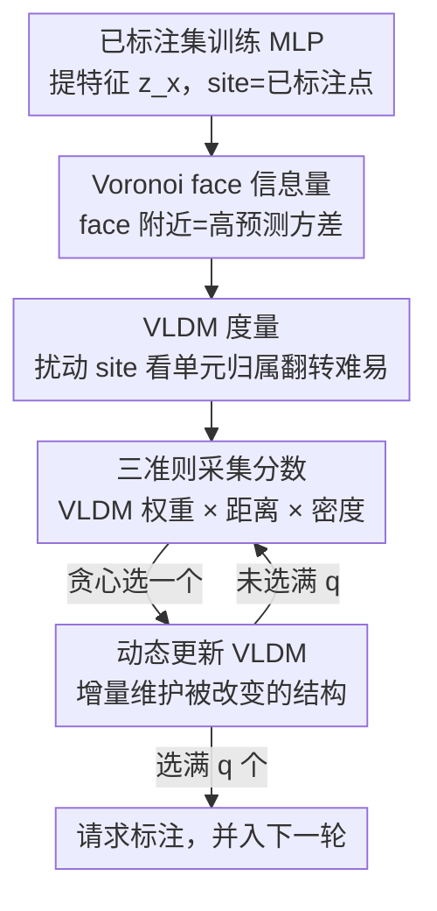

# TESSAR: Geometry-Aware Active Regression via Dynamic Voronoi Tessellation

**会议**: ICLR 2026  
**OpenReview**: [https://openreview.net/forum?id=mhfbu9von5](https://openreview.net/forum?id=mhfbu9von5)  
**领域**: 主动学习 / 回归理论  
**关键词**: 主动学习, 回归, Voronoi 镶嵌, 几何采样, 预测方差  

## 一句话总结
针对回归任务的主动学习，本文提出用 Voronoi 镶嵌的几何结构来挑样本——核心是 VLDM（Voronoi-based Least Disagree Metric），它衡量一个样本在扰动已标注点后"归属哪个 Voronoi 单元"会有多容易翻转，从而定位高方差的内部区域；再叠加距离项（覆盖外围）和密度项（反映代表性），三者相乘构成 TESSAR 的采集分数，在 14 个表格回归基准上达到或超过现有 SOTA。

## 研究背景与动机

**领域现状**：主动学习通过只对"最有信息量"的样本请求标注来省成本。在分类里这件事很自然——信息量高的样本往往在决策边界附近，不确定性最高，所以基于不确定性采样、query-by-committee 等策略都很成功。

**现有痛点**：但回归没有"决策边界"这个概念。所有已标注样本是全局地影响模型，而非通过局部决策起作用，因此信息量散布在整个数据空间里。回归主动学习里常用的做法是基于距离采样——挑离已标注点最远的样本来促进多样性和覆盖。问题是距离采样**过度偏向外围（periphery）**：边缘点离所有已标注点都远，分数天然高，于是被反复采到；而数据内部那些稠密、夹在多个已标注点中间的区域反而被忽略，尽管这些区域信息量并不低。

**核心矛盾**：回归主动学习要同时兼顾三件事——信息量（informativeness）、多样性（diversity）、代表性（representativity）。距离采样只解决了"多样性/外围覆盖"，对"内部信息量"几乎无能为力；已有的密度修正方法（如基于聚类的 LCMD）也只能对内部探索做有限的控制，而且聚类峰值点未必落在真正信息量高的位置。

**本文目标**：找一种几何机制，能够主动定位**内部**那些"多个已标注点影响交汇、相互竞争"的区域，并把它和外围覆盖、密度代表性统一进一个采集准则里。

**切入角度**：作者借用 Voronoi 镶嵌——以每个已标注点（site）为中心把输入空间划成单元（cell），单元之间的边界称为 Voronoi face。Voronoi face 上的点到至少两个 site 等距，没有任何单一已标注点"主导"它们的局部几何。作者的关键观察是：这些 face 附近的点恰好落在内部区域，且在分类的"不一致采样（disagreement-based）"里扮演着和决策边界类似的角色——分类里假设稍微一变就翻转标签的样本最有信息量，回归里 site 稍微一扰动就改变归属单元的样本同理。

**核心 idea**：用"扰动已标注点后 Voronoi 单元归属翻转的难易度"作为回归版的不确定性度量（VLDM），把它和距离项、密度项相乘，构成一个同时覆盖内部、外围与代表性的采集分数。

## 方法详解

### 整体框架

TESSAR（TESsellation-based Sampling for Active Regression）是一个迭代式的主动学习循环。每一轮 $t$：先在已标注集 $L_t$ 上训练一个 2 层 MLP，用它的最后一层表示 $z_x$ 把池中无标注样本 $P \subseteq U_t$ 映射到特征空间；已标注样本的特征作为 Voronoi 的 site 集 $S^{(0)}$。对池中每个候选样本 $x$，先用扰动法估计它的 VLDM 值 $L_x$（衡量内部信息量），同时算出它到最近 site 的距离 $D_x$（衡量外围）和它所在 Voronoi 单元的密度分 $S_x$（衡量代表性）；三者相乘得到采集分数，贪心选出一个样本加入查询集。由于每选一个样本都会改变 Voronoi 结构，TESSAR 用一个**动态更新**子程序增量地维护这些量，而不是从头重算，把批内的计算量降下来。选满 $q$ 个后请求标注、并入 $L_{t+1}$，进入下一轮。

### 关键设计

**1. Voronoi face 的信息量：用方差上界把"靠近 face"和"高不确定性"挂钩**

光说"face 附近样本几何上多样"还不够，本文给出理论支撑，说明它们也本质上不确定。设训练好的预测器 $\hat f$ 和真值函数 $f^\star$ 都是 $L$-Lipschitz，噪声零均值，且高概率成立的"好事件"保证 $|\hat f(\tilde x_k) - f^\star(\tilde x_k)| \le \epsilon$（统计误差 $\epsilon$ 随标注量以 $|S|^{-\beta}$ 衰减，可视为很小）。对任意无标注点 $x'$ 和 site $\tilde x_k$，用三角不等式加 Lipschitz 性质有

$$\big|\hat f(x') - f^\star(x')\big| \le 2L\|x' - \tilde x_k\|_2 + \epsilon,$$

再由 Popoviciu 不等式得到

$$\mathrm{Var}[\hat f(x')] \le \big(2L\|x' - \tilde x_k\|_2 + \epsilon\big)^2.$$

由于 $\epsilon$ 不依赖 $k$，对所有 site 取最小说明：$x'$ 处的预测方差被"到最近 site 的距离"控制。要让方差（即不确定性）大，就该挑那些**到多个 site 都不近**的点——而这正是 Voronoi face 附近的点。每个 Voronoi 单元可看作标签只在有界范围内变化的区域，face 上的点恰是这种有界变化被多个 site 共享的地方：site 稍微一动，Voronoi 划分就可能把它们划到别的单元去。这种"不稳定性"与分类里的不一致采样一一对应——回归虽没有离散边界，Voronoi face 起到了等价的角色。

**2. VLDM：用"单元归属在扰动下翻转的难易度"代替无法直接计算的 face 距离**

直接判断一个点离 Voronoi face 多近，需要构造 Voronoi 图，在 $\mathbb R^d$ 中对 $S$ 个 site 的复杂度是 $O(S\log S + S^{\lfloor d/2\rfloor})$，高维下不可行。本文绕开建图，提出 VLDM 这个替代度量。先把每个 site 配置 $S$ 关联成一个 Voronoi 假设 $h_S(x) := \arg\min_{k} \|z_x - z_{\tilde x_k}\|_2$（即把 $x$ 标成最近 site 的下标）。两个假设的不一致度用 $\rho(h_{S'}, h_S) = \Pr_{X}(h_S(X) \ne h_{S'}(X))$ 衡量。VLDM 定义为：在所有"对 $x_0$ 给出不同归属"的假设里，取与原假设不一致度最小的那个，

$$L(h_S, x_0) := \inf_{h_{S'} \in H_{h_S, x_0}} \rho(h_{S'}, h_S),$$

其中 $H_{h_S,x_0} = \{h_{S'} : h_S(x_0) \ne h_{S'}(x_0)\}$。直觉是：如果只需对 site 做很小的扰动就能让 $x_0$ 的归属翻转，那 $x_0$ 一定贴着 face，VLDM 值小、信息量高；反之深在某个单元内部的点要很大扰动才翻转，VLDM 值大。借助"小扰动下 Voronoi 单元随之小变（Hausdorff 距离意义下稳定）"这一性质，site 标号在扰动前后基本不变，于是无需显式求那个对齐排列 $\pi_{S,S'}$。

实际计算用两层近似（沿用 Cho et al. 2024）：① 用有限个扰动假设代替无穷集合——对一组预设方差 $\{\sigma_v^2\}$，把 site 特征加高斯噪声 $z_{\tilde x'} \sim \mathcal N(z_{\tilde x}, \sigma_v^2 I)$ 得到扰动配置 $S'$，凡是让 $x_0$ 归属翻转的就纳入候选；多档方差让 VLDM 能捕捉不同扰动幅度下的翻转难易。② 用 $M$ 个蒙特卡洛样本估计 $\rho$：$\rho_M(h_{S'}, h_S) = \frac1M \sum_i \mathbb I[h_{S'}(X_i) \ne h_S(X_i)]$。实证上 VLDM 随扰动数 $N$ 增大单调下降但**保持秩序**（rank order），所以用它给样本排序是可靠的。

**3. 三准则采集分数：VLDM 权重、距离项、密度项相乘统一内部/外围/代表性**

单靠 VLDM 只覆盖内部，单靠距离只覆盖外围，作者把三个几何准则相乘。第一项是 VLDM 派生的权重，给小 VLDM（贴近 face）的样本指数级更高的权重：

$$\gamma_x = \frac{e^{-\eta_x}}{\sum_{x_j \in P} e^{-\eta_{x_j}}}, \quad \eta_x = \frac{(L_x - L_q)_+}{L_q},$$

其中 $L_q$ 是池中第 $q$ 小的 VLDM 值，$(\cdot)_+ = \max\{0,\cdot\}$。第二项是 DIST——样本到所有 site 的最短特征距离 $D_x = \min_{\tilde x \in S} \|z_x - z_{\tilde x}\|_2$，鼓励探索欠采样的外围。第三项是 BIN——代表性分数，

$$S_x = \sum_{x' \in P:\, h_S(x') = h_S(x)} D_{x'}^2,$$

它在同一个 Voronoi 单元内的所有样本之间共享，反映该单元的局部密度（单元内距离之和越大，说明这块区域越稠密/分布上越重要），从而把查询策略与底层数据分布对齐。最终采集分数是三者相乘 $\gamma_x \cdot D_x^{(0)} \cdot S_x$，贪心选最大者。相乘而非相加，保证被选样本必须**同时**信息量高、空间多样、且有代表性——任一项太小都会被压低。这也是 TESSAR 与 LCMD 的根本区别：LCMD 用聚类峰值，会把点选到聚类外缘；TESSAR 的 VLDM 项专挑 Voronoi face，避开了"外边界没有 face"的区域，可靠地把采样引向有信息量的内部。

**4. 动态更新 VLDM：批内增量维护，省掉一个 $q$ 的因子**

批量采样里每选中一个新样本就会改变 Voronoi 结构，face 位置和 VLDM 值都随之变。若每选一个就从头重算 VLDM，需要 $N\cdot|P|\cdot q\cdot(|L| + (q+1)/2)$ 次距离计算，代价高。TESSAR 的 UPDATEVLDM 子程序采取增量策略：先一次性算好所有池样本到初始 site 的距离，之后每选中新样本 $\tilde x_{new}$，只更新涉及这个新样本（及其扰动副本）的距离——把新样本到池数据的距离与已有的最近距离比较，更新每个样本记录的最近距离 $D_x^{(n)}$ 和对应单元下标 $K_x^{(n)}$；一旦某个扰动配置下单元下标发生变化（$K_x^{(n)} \ne K_x^{(0)}$），就相应刷新 $L_x$。这把总计算量降到 $N\cdot|P|\cdot(|L|+q)$，省掉了一个 $q$ 的因子。作者还指出：一个不依赖 $N$ 的"margin 变体"（用样本到最近/次近 Voronoi 中心的距离差当 margin）虽更省，但性能明显弱于基于 VLDM 的版本；去掉动态更新的静态变体也会显著掉点——说明动态维护是必要的。

### 损失函数 / 训练策略
TESSAR 本身不改回归模型的训练目标——每轮就是在当前已标注集上标准训练一个 2 层、512 隐藏单元的 MLP，方法的全部创新在"挑哪些样本去标注"。关键超参是扰动方差集合 $\{\sigma_v^2\}$ 的档数 $V$、扰动配置数 $N$、蒙特卡洛样本数 $M$ 以及每轮查询规模 $q$。

## 实验关键数据

实验在 14 个表格回归数据集上进行，模型统一为 2 层 512 单元 MLP，所有结果取 20 次重复的平均。

### 主实验

下表为各算法相对 Random 的 RMSE 差（在所有步骤上平均），负值表示优于随机采样，加粗下划线为最佳、加粗为次佳（节选自原文 14 个数据集的 Table 1）。

| 数据集 | TESSAR | LCMD | BADGE | BAIT | Coreset |
|--------|--------|------|-------|------|---------|
| CT slices | **-0.0679** | **-0.0679** | -0.0395 | -0.0565 | -0.0504 |
| KEGG undir | **-0.1615** | -0.1598 | -0.1297 | -0.1214 | -0.1435 |
| MLR kNN | **-0.1201** | -0.1182 | -0.0925 | -0.0872 | -0.0192 |
| Online video | **-0.1183** | -0.1130 | -0.0991 | -0.0946 | -0.1000 |
| Protein | **-0.0082** | -0.0054 | -0.0075 | 0.0016 | 0.0110 |
| SARCOS | **-0.0215** | -0.0188 | -0.0133 | -0.0149 | -0.0080 |

整体看，TESSAR 在绝大多数数据集上取得最佳或次佳，性能稳定全面领先；最接近的竞争者是同样基于多样性/密度的 LCMD。用 performance profile 综合比较时，TESSAR 在所有 $\delta$ 上都保持最高的 $R_A(\delta)$，其中 $R_{\text{TESSAR}}(0) = 41\%$，显著高于 LCMD 的 $29\%$；penalty matrix 上 TESSAR 这一行优于所有其他算法，其他算法相对 TESSAR 的最大 penalty 仅 0.3。

### 消融实验

下表是 VLDM（$\gamma_x$）、DIST（$D_x$）、BIN（$S_x$）三准则不同组合的效果（基于 Protein/Road/Stock 上 log-RMSE 的定性结论）：

| 配置 | 效果 | 说明 |
|------|------|------|
| 仅 VLDM | 提升有限 | 只覆盖内部 face 区域 |
| 仅 DIST | 提升有限 | 只覆盖外围 |
| VLDM + DIST | 显著提升 | 内部+外围互补，是主要增益来源 |
| VLDM + DIST + BIN（Full） | 最佳 | 再叠加密度对齐，稠密区采样进一步改善 |

### 关键发现
- **互补性是核心**：VLDM 和 DIST 单独用都只覆盖输入空间的一个子集，增益有限；两者一组合（内部 via VLDM、外围 via DIST）就带来显著提升，说明几何上"内部 + 外围"的互补才是 TESSAR 的主要动力。
- **BIN 锦上添花**：在 VLDM+DIST 基础上加密度项 BIN，把采样进一步对齐到数据分布的稠密区，带来额外但相对次要的改进。
- **VLDM 排序稳定**：实证显示 VLDM 随扰动数 $N$ 增大单调下降却保持秩序，因此即便近似计算，用它排序选样本也是可靠的。
- **动态更新不可省**：margin 变体和静态变体都明显弱于完整的动态 VLDM-TESSAR，验证了批内动态维护 Voronoi 结构的必要性。

## 亮点与洞察
- **把分类的"不一致采样"几何化迁移到回归**：分类里"假设一变就翻标签"的样本最有信息量，本文用"site 一扰动就翻 Voronoi 单元归属"找到了回归里的等价物，VLDM 把这个直觉量化成可计算的度量，是很漂亮的跨任务迁移。
- **理论与采集准则一脉相承**：用 Lipschitz + Popoviciu 不等式证明"离 site 远 ⇒ 预测方差大"，直接为"挑 Voronoi face 附近点"提供了方差解释，理论不是摆设而是设计依据。
- **乘法融合三准则**：信息量、多样性、代表性相乘而非加权和，强制被选样本三者俱佳，任一短板都被惩罚——这种"短板压制"的融合方式可迁移到其他多准则采集场景。
- **避开 Voronoi 建图**：用扰动 + 单元归属翻转来估计 face 距离，巧妙绕开了高维下 $O(S^{\lfloor d/2\rfloor})$ 的建图复杂度，是让几何方法能落地的关键工程洞察。

## 局限与展望
- **仍然偏贵**：尽管动态更新省掉一个 $q$ 因子，运行时仍随扰动预算 $N$ 和池大小 $|P|$ 线性增长，大规模场景下需进一步优化；作者把"更可扩展的 TESSAR 变体或全新算法原理"列为重要的后续方向。
- **同方差假设**：方法隐含假设噪声同方差（homoskedastic），方差上界的推导也依赖此；异方差设定下 Voronoi 风格的原理是否还成立是开放问题。
- **只在表格数据上验证**：实验全是 14 个表格回归基准 + 2 层 MLP，没有在图像/高维深度回归上检验 VLDM 的几何直觉是否依然有效，泛化性待考。
- **特征空间依赖**：Voronoi 单元定义在网络最后一层表示上，整套几何机制的有效性其实取决于这层特征质量，特征不好时 face 的"信息量"含义会被削弱（这一点作者未深入讨论）。

## 相关工作与启发
- **vs LCMD（Holzmüller et al., 2023）**：两者都用多样性 + 密度成分，但 LCMD 基于聚类，倾向选到聚类外缘；TESSAR 的 VLDM 项专挑 Voronoi face（内部），避免"外边界没有 face"的退化，把采样可靠地引向信息量高的内部区域——这是本文相对最强 baseline 的根本差异。
- **vs 距离/贪心采样（Wu et al., 2019; Coreset）**：它们促进外围覆盖和多样性，但过采外围、忽略内部；TESSAR 把距离项保留为三准则之一，同时用 VLDM 补上内部信息量。
- **vs LDM-S 等分类不一致方法（Cho et al., 2024）**：分类版依赖标签定义的决策边界，只能用于监督设定；TESSAR 纯靠输入实例间的几何关系（Voronoi face）选样本，不需要标签边界，因而天然适配回归。
- **vs QBC / 模型变化方法**：这类方法靠集成预测分歧或梯度估计模型变化，需反复训练多个模型、计算开销大；TESSAR 单模型 + 几何度量，避开了集成成本。

## 评分
- 新颖性: ⭐⭐⭐⭐⭐ 把 Voronoi 镶嵌 + 不一致采样直觉引入回归主动学习，VLDM 是一个原创且有理论支撑的几何不确定性度量。
- 实验充分度: ⭐⭐⭐⭐ 14 个数据集 + 20 次重复 + performance profile/penalty matrix 综合比较，三准则消融到位；但只限表格数据、缺高维深度回归验证。
- 写作质量: ⭐⭐⭐⭐ 理论—直觉—算法层层递进，图示清晰；部分近似细节和超参敏感性偏简略。
- 价值: ⭐⭐⭐⭐ 为回归主动学习提供了一个统一内部/外围/代表性的几何框架，思路可迁移到半监督/伪标注的几何采样。

<!-- RELATED:START -->

## 相关论文

- [\[ICLR 2026\] Characterizing the Discrete Geometry of ReLU Networks](characterizing_the_discrete_geometry_of_relu_networks.md)
- [\[ICLR 2026\] Data-Aware and Scalable Sensitivity Analysis for Decision Tree Ensembles](data-aware_and_scalable_sensitivity_analysis_for_decision_tree_ensembles.md)
- [\[ICLR 2026\] Beyond Spectra: Eigenvector Overlaps in Loss Geometry](beyond_spectra_eigenvector_overlaps_in_loss_geometry.md)
- [\[ICLR 2026\] Splat Regression Models](splat_regression_models.md)
- [\[ICLR 2026\] Revisiting Active Sequential Prediction-Powered Mean Estimation](revisiting_active_sequential_prediction-powered_mean_estimation.md)

<!-- RELATED:END -->
