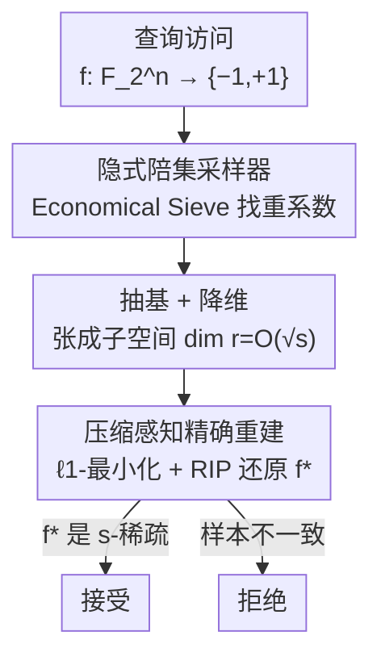

# Testing Fourier Sparsity via Implicit Sensing

**会议**: ICLR 2026  
**OpenReview**: [https://openreview.net/forum?id=upsp6XeJpN](https://openreview.net/forum?id=upsp6XeJpN)  
**代码**: 无  
**领域**: 学习理论 / 稀疏傅里叶 / 性质测试  
**关键词**: 傅里叶稀疏性, 性质测试, 压缩感知, 通信复杂度, 布尔函数

## 一句话总结
本文研究"布尔函数是否傅里叶稀疏"的性质测试问题：给定对 $f:\mathbb{F}_2^n\to\{-1,+1\}$ 的查询访问，判断它到底是 $s$-傅里叶稀疏，还是在汉明距离下远离任何 $s$-稀疏函数。作者在算法侧给出查询复杂度 $\tilde O(s^4)$ 的非自适应 tester（与维度 $n$ 无关），在下界侧证明任何 tester 至少需要 $\Omega(s)$ 次查询，两端都大幅改进了 Gopalan 等人（2011）的 $\tilde O(s^{14})$ 上界与 $\Omega(\sqrt s)$ 下界。

## 研究背景与动机

**领域现状**：布尔函数是机器学习与理论计算机科学的核心对象，而**傅里叶稀疏性**——傅里叶展开中非零系数的个数——是衡量其"结构简单程度"的一个自然指标。对 $f:\mathbb{F}_2^n\to\{-1,+1\}$，其傅里叶展开为 $f(x)=\sum_{\alpha\in\mathbb{F}_2^n}\hat f(\alpha)\chi_\alpha(x)$，其中 $\chi_\alpha(x)=(-1)^{\langle x,\alpha\rangle}$；若 $|\mathrm{supp}(\hat f)|\le s$ 则称 $f$ 为 $s$-傅里叶稀疏。三十多年来，学习傅里叶稀疏布尔函数一直是计算学习理论的中心问题，主流是两条算法路线：稀疏 Hadamard 变换与压缩感知。

**现有痛点**：这些精确重建算法几乎都**预设稀疏度 $s$ 事先已知**，而实践中往往并不成立；更关键的是，基于 $\ell_1$-最小化的压缩感知**只有当函数确实（或足够接近）$s$-稀疏时才成功**——通常要求函数到最近 $s$-稀疏函数的汉明距离小到 $o(1/s)$。换句话说，先得有人替你"认证"这个函数确实傅里叶稀疏，重建才有意义。于是"测试傅里叶稀疏性"本身成了一个前置且独立的问题。

**核心矛盾**：在**汉明距离**下测试稀疏性，比在欧氏（$\ell_2$）距离下要难得多。$\ell_2$ 版本（Yaroslavtsev & Zhou 2020；Ghosh & Roy 2025）已能用 $\tilde O(s)$ 查询解决，但它会接受两类函数：一类是恰好 $k$ 个大系数的"干净"函数，另一类是 $k$ 个大系数外**还拖着一长串小系数尾巴**的函数。汉明距离下的 tester 必须**只接受前者**——既要确认存在 $k$ 个大系数，又要确认**不存在傅里叶尾巴**，因此本质更难。这也是为什么 Gopalan 等人（2011）的汉明版 tester 复杂度高达 $\tilde O(s^{14})$。

**本文目标**：在汉明距离下，把傅里叶稀疏性测试的上界从 $\tilde O(s^{14})$ 拉低、把下界从 $\Omega(\sqrt s)$ 抬高，缩小两者之间的巨大鸿沟，并且让上界**与环境维度 $n$ 无关**。

**切入角度与核心 idea**：Gopalan 等人走的是"哈希定位大系数"的路线；本文换用 Diakonikolas 等人（2007）的 **testing-via-implicit-learning（隐式学习式测试）** 范式——核心一句话：把稀疏度测试**归约为重建一个被压缩过的低维版本函数**。先借助 Sanyal（2019）的结构定理把 $n$ 维问题压到 $O(\sqrt s)$ 维，再用压缩感知精确重建并核对，从而摆脱对 $n$ 的依赖。下界侧则把问题**归约到通信复杂度**中的近似矩阵秩问题，借密码学硬函数的傅里叶结构拿到 $\Omega(s)$。

## 方法详解

### 整体框架

本文是一篇纯理论论文，由两条相互独立的技术线构成：**上界**（设计一个高效 tester）与**下界**（证明任何 tester 都逃不掉的查询代价）。

上界这一侧的 tester 是一条清晰的流水线。直觉上，对一个 $s$-傅里叶稀疏函数，它的非零傅里叶系数并非散布在整个 $n$ 维空间——Sanyal（2019）证明这些非零系数张成的线性子空间维数至多 $O(\sqrt s)$。于是每个 $s$-稀疏函数都能写成 $f=f^\ast\circ L$ 的低维形式，其中 $L:\mathbb{F}_2^n\to\mathbb{F}_2^r$ 是线性映射、$r=O(\sqrt s)$。这意味着我们不必在 $n$ 维里折腾，只要**间接地**把这个低维"草图" $f^\ast$ 重建出来、再检验它是否 $s$-稀疏即可。整条 tester 的走向是：对 $f$ 做查询 → 用 Economical Sieve 隐式地拿到所有"重"傅里叶系数 → 抽出它们张成的子空间基（维数 $r$）→ 通过陪集采样（coset sampling）生成低维函数 $f^\ast$ 上的均匀样本 → 用 $\ell_1$-最小化压缩感知精确重建 $f^\ast$ 的谱 → 一致则接受、否则拒绝。

下界这一侧则完全是组合-代数论证：取一类密码学里常用的 Maiorana–McFarland 函数，让两个通信方各持一半，把"判断 $f$ 是否 $s$-稀疏"伪装成"判断两个矩阵之和的秩落在 $r$ 还是 $r/4$"，再援引该通信问题已知的 $\Omega(r^2)$ 通信下界，反推出 tester 的 $\Omega(s)$ 查询下界。

### 关键设计

**1. 隐式学习 + 降维：把 $n$ 维测试压成 $O(\sqrt s)$ 维重建**

最直接的麻烦是：直接对 $s$-稀疏函数做 $\ell_1$-最小化重建，需要 $O(s\log^2 s\cdot n)$ 个均匀随机样本，**样本量随维度 $n$ 线性增长**，而性质测试追求的是与 $n$ 无关甚至常数级的查询。作者用两块拼图消掉 $n$。第一块是 Sanyal（2019）的结构定理：$s$-稀疏函数的非零傅里叶系数张成的子空间维数至多 $O(\sqrt s)$，于是 $f=f^\ast\circ L$，只需重建低维的 $f^\ast:\mathbb{F}_2^r\to\{-1,+1\}$（$r=O(\sqrt s)$）。第二块是 Haviv & Regev（2017）的 RIP（受限等距性）结果：配合一个满足 RIP 的子采样 Walsh–Hadamard 矩阵，$f^\ast$ 只需 $O(s^{3/2}\log^2 s)$ 个随机样本就能被 $\ell_1$-最小化**精确**还原，且这一数目**不再依赖 $n$**。这里要强调的是隐式学习范式与朴素 junta 测试的区别：傅里叶稀疏函数比 junta **严格更广**——一个依赖 $O(n)$ 个变量的线性函数只有一个非零系数（1-稀疏）却不是 junta，且傅里叶稀疏性在可逆线性变换下不变而 junta 性质不变。因此现成的 junta tester 用不了，必须重新设计采样器。

**2. 隐式陪集采样器：用极少查询从 $f\circ A$ 中生成均匀样本**

降维的前提是要先"看到"那些重系数，可它们并不以显式形式给出，而是隐藏在 $f$ 的查询结果里。作者设计了核心算法——隐式陪集采样器（Algorithm 3），它在 Chakraborty 等人（2011）junta 提取器的精神上大幅推广，能仅用少量对 $f$ 的查询，生成复合函数 $f\circ A$（$A$ 是某个未知可逆线性变换）关于其 $\theta$-受限傅里叶子空间 $S_{f\circ A}(\theta)$ 的均匀陪集样本。其内部调用 Datta 等人（2026）的 **Economical Sieve**：它用 $\tilde O\!\big(\max\{1/\theta^4,\,\lambda/\theta^2\}\big)$ 次查询，输出一个矩阵 $Q$，其 $(i,j)$ 项为 $\chi_{\alpha_j}(x_i)$，并保证所有满足 $|\hat f(\alpha)|\ge\theta$ 的系数都被收进集合 $S$、且 $S$ 中每个系数都有 $|\hat f(\alpha)|\ge\theta/2$。妙处在于：虽然这些重系数 $\alpha$ 本身拿不到显式坐标，但 $Q$ 的列在均匀随机点上的取值**暴露了它们之间的线性关系**——若一组 $\alpha_i$ 线性相关使 $\sum\alpha_i=0$，则对应列之积恒为 $1^\lambda$；若线性无关，则这一乘积全为 $1$ 的概率至多 $2^{-\lambda}$。据此即可抽出重系数张成空间的一组基（维数 $r$），并借引理证明：当 $x$ 在 $\mathbb{F}_2^n$ 上均匀，映射 $x\mapsto Mx$ 诱导的陪集分布在 $\mathbb{F}_2^r$ 上是均匀的，从而每个陪集被等概率采到。取阈值 $\theta=\Theta(1/s)$、样本数 $\lambda=\max\{1/\varepsilon,\tilde O(s^2)\}$，整套采样器的查询量为

$$\tilde O\!\left(\frac{1}{\theta^4}+\max\!\Big\{\frac{1}{\theta^2},\lambda\Big\}\cdot\frac{1}{\theta^2}\right)=\tilde O\!\Big(s^4+\max\{s^2,1/\varepsilon\}\cdot s^2\Big),$$

即整体上界 $\tilde O(s^4)$（更精确地 $\tilde O(\max\{s^2,1/\varepsilon\}\cdot s^2)$），完成度由 Hadamard 码的局部 list-correction（取自 Datta 等人 2026 的线性同构测试）保证。

**3. 通信复杂度归约：用密码学硬函数撬出 $\Omega(s)$ 下界**

下界的目标是证明"无论多聪明的（哪怕自适应）tester 都绕不过 $\Omega(s)$ 次查询"。作者把它归约到通信复杂度里的**近似矩阵秩问题**：Alice、Bob 各持矩阵 $A,B\in\mathbb{F}_2^{r\times r}$，承诺 $\mathrm{rank}(A+B)\in\{r,\,r/4\}$，要用尽量少的通信判断是哪一种——Sherstov & Storozhenko（2024）证明其公共随机币通信复杂度为 $R^\ast_{1/3}(\mathrm{RANK}_{r,r/4})=\Omega(r^2)$。桥梁是 Maiorana–McFarland 函数 $g(x,y)=(-1)^{\langle x,\varphi(y)\rangle}$：引理 4.2 给出 $g_L(x,y)=(-1)^{\langle Lx,\varphi(y)\rangle}$ 的傅里叶稀疏度满足 $|\mathrm{supp}(\widehat{g_L})|\le\mathrm{rank}(L)\cdot r$。于是令 $f=f_{A+B}$：当 $\mathrm{rank}(A+B)=r$ 时稀疏度为 $r^2$，当为 $r/4$ 时至多 $r^2/4$；引理 4.4 进一步保证前者**在汉明距离下至少 $(1/4)$-远离**任何稀疏度 $\le r^2/4$ 的函数——正好对上 tester 的 yes/no 两端。模拟一次对 $f_C(x)=f_A(x)f_B(x)$ 的查询，只需两人各算 1 比特再交换，共 2 比特通信。若存在查询量 $q(s,1/4)$ 的 tester（取 $s=r^2/4$），就得到一个 $2q(s,1/4)$ 比特的协议；但任何协议都要 $\Omega(r^2)$ 比特，故 $2q(s,1/4)=\Omega(r^2)$，即 $q(s,1/4)=\Omega(s)$，下界得证。

### 损失函数 / 训练策略
不适用——本文为纯理论工作，不涉及训练或经验损失。核心"优化"是采样器内部的 $\ell_1$-最小化精确重建程序（compressed sensing），即在 RIP 矩阵下求解 $\ell_1$ 范数最小的傅里叶谱以还原 $f^\ast$。

## 实验关键数据

本文为理论论文，**无经验实验**，贡献以定理形式给出。下面以查询复杂度对比表呈现其相对已有工作的改进。

### 主结果：查询复杂度对比

| 问题 / 度量 | 上界 | 下界 | 来源 |
|------------|------|------|------|
| 傅里叶稀疏测试（汉明距离） | $\tilde O(s^{14})$ | $\Omega(\sqrt s)$ | Gopalan et al. (2011) |
| 傅里叶稀疏测试（汉明距离） | $\tilde O(s^{4})$ | $\Omega(s)$ | **本文** |
| 傅里叶稀疏测试（欧氏 $\ell_2$ 距离） | $\tilde O(s)$ | $\Omega(s)$ | Ghosh & Roy (2025) |

其中本文上界更精确为 $\tilde O\big(\max\{s^2,1/\varepsilon\}\cdot s^2\big)$，$\tilde O(\cdot)$ 隐藏 $\mathrm{polylog}(s)$ 因子，且**与环境维度 $n$ 无关**。

### 关键技术指标

| 环节 | 关键量 | 作用 |
|------|--------|------|
| Sanyal (2019) 降维 | 重系数张成维数 $r=O(\sqrt s)$ | 把 $n$ 维问题压到低维 |
| 朴素 $\ell_1$ 重建 | $O(s\log^2 s\cdot n)$ 样本 | 依赖 $n$，被弃用 |
| 降维后 RIP 重建 | $O(s^{3/2}\log^2 s)$ 样本 | 去掉 $n$ 依赖 |
| Economical Sieve | $\tilde O(\max\{1/\theta^4,\lambda/\theta^2\})$ 查询 | 隐式取重系数 |
| 采样器阈值 / 样本数 | $\theta=\Theta(1/s)$，$\lambda=\max\{1/\varepsilon,\tilde O(s^2)\}$ | 决定最终复杂度 |

### 关键发现
- **维度无关性来自降维而非采样技巧本身**：去掉 $n$ 依赖的真正杠杆是 Sanyal 的 $O(\sqrt s)$ 维子空间结构定理，它把样本复杂度从 $O(s\log^2 s\cdot n)$ 降到 $O(s^{3/2}\log^2 s)$；隐式采样器只是把这个低维函数"喂"给压缩感知。
- **汉明 vs 欧氏的可分性来自尾巴**：欧氏 tester 只需 $\tilde O(s)$，本文汉明 tester 需 $\tilde O(s^4)$，差距正源于汉明版必须额外排除"小系数尾巴"。
- **上下界几乎匹配但仍有间隙**：下界 $\Omega(s)$ 与上界 $\tilde O(s^4)$ 之间仍有多项式差距，论文把"是否能进一步收紧"留作开放问题。
- **可扩展到容错版本**：作者指出该 tester 可改造为 $\varepsilon$-vs-$2\varepsilon$ 的容错（tolerant）tester——允许至多 $\varepsilon$ 比例的样本标签被翻转、对扰动批次反复跑重建即可，复杂度仅轻微退化。

## 亮点与洞察
- **"隐式感知"这个名字名副其实**：tester 从不显式拿到任何傅里叶系数，全程只通过查询结果间接推断重系数之间的线性关系（列乘积是否恒为 $1$），再据此抽基降维——把"重建谱"巧妙地转成"感知子空间结构"。
- **把性质测试焊到压缩感知上**：Sanyal 降维定理 + Haviv–Regev 的 RIP + $\ell_1$-最小化三块拼成"维度无关的精确重建"，是可迁移的范式——任何"在低维子空间上稀疏"的对象测试都可能套用这套隐式采样 + 压缩感知的组合拳。
- **下界用密码学硬函数当"对抗实例"**：Maiorana–McFarland 函数的傅里叶稀疏度恰好被线性变换的秩控制，这一性质让"测稀疏度"和"测矩阵秩"严丝合缝对接，再借通信复杂度的成熟下界一击致命——这种"傅里叶结构 ↔ 通信复杂度"的桥接思路很有启发性。

## 局限与展望
- **上下界仍有多项式间隙**：$\Omega(s)$ 与 $\tilde O(s^4)$ 之间没有闭合，理想情况下应像欧氏版那样做到 $\tilde\Theta(s)$；是否存在 $\tilde O(s)$ 的汉明 tester 仍未知。
- **强依赖外部结构定理**：整套上界建立在 Sanyal（2019）的 $O(\sqrt s)$ 维界、Haviv–Regev（2017）的 RIP、Datta 等人（2026）的 Economical Sieve 之上，本文更像是把这些零件高效组装，独立的新原语相对集中在隐式陪集采样器一处。
- **仅非容错（exact）设定为主**：正文聚焦精确测试，容错版本只在结论里勾勒、未给完整复杂度分析；实际用作 PAC 学习预处理时，容错刻画可能更贴合需求。
- **纯理论、无实证**：复杂度均为渐近界，$\tilde O$ 隐藏的 $\mathrm{polylog}$ 与常数因子在小 $s$ 区间可能不可忽视，是否有实际可跑的实现尚待验证。

## 相关工作与启发
- **vs Gopalan et al. (2011)**：他们利用傅里叶稀疏函数的局部可测结构（非零系数幅度有下界），用哈希定位大系数，得到 $\tilde O(s^{14})$ 上界与 $\Omega(\sqrt s)$ 下界；本文改用隐式学习 + 压缩感知，把上界拉到 $\tilde O(s^4)$、下界抬到 $\Omega(s)$，两端都是多项式级改进。
- **vs Ghosh & Roy (2025) / Yaroslavtsev & Zhou (2020)**：这两条线在**欧氏 $\ell_2$ 距离**下测试，已做到 $\tilde O(s)$ 与 $\Omega(s)$ 几乎匹配；但欧氏接近不蕴含汉明接近（会放过带小系数尾巴的函数），所以汉明版严格更难，本文正是补上汉明这一更强的设定。
- **vs Chakraborty et al. (2011) 的 junta 提取器**：本文采样器在其精神上构建，但傅里叶稀疏类严格大于 junta（线性函数是 1-稀疏却非 junta），且傅里叶稀疏性在可逆线性变换下不变而 junta 不变，故必须把提取器推广到能处理"在某个未知线性变换下稀疏"的情形。
- **vs Datta et al. (2026)**：本文直接复用其 Economical Sieve、Hadamard 码局部 list-correction 与 Maiorana–McFarland 在线性变换下的稀疏度刻画，是在线性同构测试工具箱之上的一次成功应用与延伸。

## 评分
- 新颖性: ⭐⭐⭐⭐ 把隐式学习范式 + 压缩感知降维引入汉明版傅里叶稀疏测试，下界用通信复杂度归约，思路新颖但多依赖现成结构定理拼装。
- 实验充分度: ⭐⭐⭐ 纯理论无实证，但定理证明完整、上下界双向给出，符合该子领域规范。
- 写作质量: ⭐⭐⭐⭐ 证明大纲—引理—主定理层次清晰，符号统一，关键直觉（隐式感知、降维、归约）交代到位。
- 价值: ⭐⭐⭐⭐ 把 $s^{14}$→$s^4$、$\sqrt s$→$s$ 的双向改进显著缩小长期存在的鸿沟，且 tester 可作为精确学习的前置认证步骤，理论意义明确。

<!-- RELATED:START -->

## 相关论文

- [\[ICLR 2026\] On the Benefits of Weight Normalization for Overparameterized Matrix Sensing](on_the_benefits_of_weight_normalization_for_overparameterized_matrix_sensing.md)
- [\[ICLR 2026\] Variational Deep Learning via Implicit Regularization](variational_deep_learning_via_implicit_regularization.md)
- [\[ICLR 2026\] Efficient Testing for Correlation Clustering: Improved Algorithms and Optimal Bounds](efficient_testing_for_correlation_clustering_improved_algorithms_and_optimal_bou.md)
- [\[ICLR 2026\] Testing Most Influential Sets](testing_most_influential_sets.md)
- [\[ICLR 2026\] Expressive Power of Implicit Models: Rich Equilibria and Test-Time Scaling](expressive_power_of_implicit_models_rich_equilibria_and_test-time_scaling.md)

<!-- RELATED:END -->
