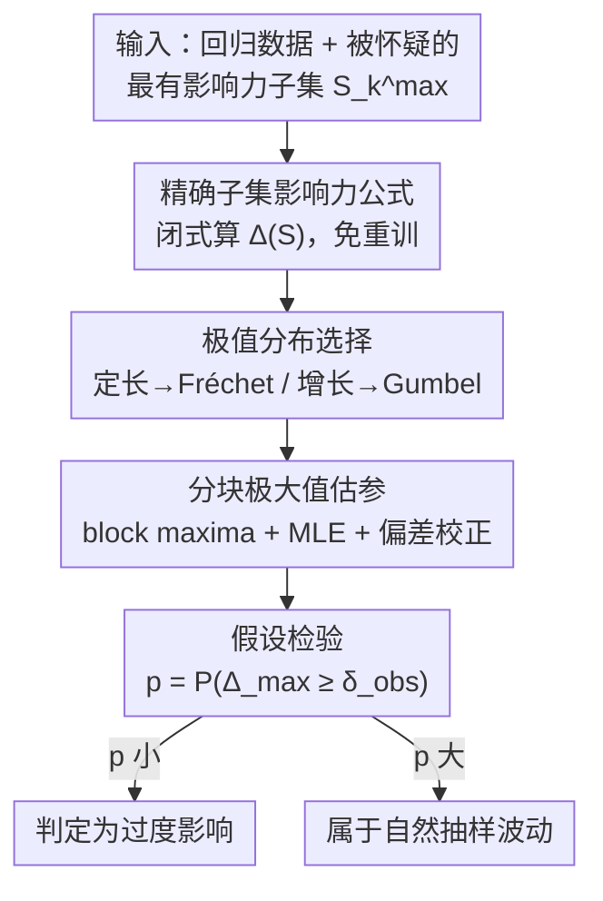

# Testing Most Influential Sets

**会议**: ICLR 2026  
**OpenReview**: [https://openreview.net/forum?id=1a9daUteZn](https://openreview.net/forum?id=1a9daUteZn)  
**代码**: https://github.com/konradld/testingMIS  
**领域**: 统计学习理论 / 鲁棒性 / 可解释性  
**关键词**: 最有影响力子集、极值理论、影响力检验、最小二乘、Fréchet/Gumbel 分布

## 一句话总结
针对「少数几个样本就能颠覆模型结论」这一现象，本文为线性最小二乘推导出子集影响力的精确闭式公式，并用极值理论刻画「最大影响力」的渐近分布（定长子集为重尾 Fréchet、增长子集为轻尾 Gumbel），从而把过去靠经验拍脑袋的「这点影响力是不是太离谱」变成一个有 p 值的严格假设检验。

## 研究背景与动机
**领域现状**：在经济学、生物学乃至机器学习里，模型结论常常对极少数样本高度敏感——两个小岛国就能让「地形对发展的影响」失去显著性，一个离群点就能让处理效应反号。学界因此发展出一系列方法去**找出**这些「最有影响力子集」（most influential set），即剔除后对某个估计量改变最大的那 $k$ 个样本。

**现有痛点**：能找到这些集合，却没人能回答「找到之后怎么办」。当前实践完全靠领域专家、经验阈值（如符号翻转、显著性消失）和临时的敏感性检查来判断一个子集的影响力是否「有问题」。这些启发式既会把本来稳健的结果误判为脆弱，也会漏掉真正异常的影响力。而常用的近似工具——影响函数（influence function）——只是 $\epsilon=0$ 处的一阶线性近似，**系统性地低估**了子集与高杠杆点的影响，因为一阶近似抓不住样本之间的交互和杠杆分数的差异。

**核心矛盾**：缺的不是「算影响力的工具」，而是一把**标尺**——在自然随机抽样下，最大影响力本来就会有多大？只有知道这个「正常波动」的分布，才能判断观测到的影响力是落在正常范围内，还是已经超出抽样波动该有的程度（excessive influence）。

**本文目标**：为「最有影响力子集」建立一套有统计学意义的显著性评估框架，具体分解为：(1) 给出可精确、可快速计算的子集影响力；(2) 刻画最大影响力 $\Delta_{\max}$ 的概率分布；(3) 据此构造检验「影响力是否过度」的假设检验。

**切入角度**：聚焦于**线性回归**这一可解析、可解释、又无处不在的设定。$\Delta_{\max}$ 是「在所有 $\binom{N}{k}$ 个子集上取最大」得到的，本质是一个极值，其分布应由**极值理论**（extreme value theory, EVT）而非经典中心极限定理来支配。

**核心 idea**：用极值理论给「最大影响力」找到它的零分布——把模糊的「影响力会不会太大」翻译成「观测到的 $\Delta_{\max}$ 在 EVT 给出的零分布下出现的概率有多小」，从而做出有 p 值的严格推断。

## 方法详解

### 整体框架
本文要解决的问题是：给定一个回归任务和一个被怀疑「过度影响」的子集 $S_k^{\max}$，如何判断它的影响力是否超出了自然抽样波动？整体思路分三步走——先用一个**精确闭式公式**把任意子集的影响力算出来（避免对每个候选子集重训模型），再用**极值理论**确定最大影响力服从哪一族极值分布并估计其参数，最后基于这个零分布**算 p 值做假设检验**。

监督学习任务记为：在训练数据 $\{(x_n,y_n)\}_{n=1}^N$ 上最小化损失得到 $\hat\theta$，剔除子集 $S$ 后的估计记为 $\hat\theta_{-S}$。子集 $S$ 对某个标量目标函数 $\varphi$（如某个回归系数 $\theta_1$）的影响力定义为 $\Delta(S;\varphi)=\varphi(\hat\theta)-\varphi(\hat\theta_{-S})$，而 $k$-最有影响力子集就是

$$S_k^{\max}:=\arg\max_{S\subset[N],\,|S|=k}\Delta(S;\varphi),\qquad \Delta_{\max}=\Delta(S_k^{\max};\varphi).$$

核心研究问题就是 $\Delta_{\max}$ 服从什么分布。下面的检验流程是一个清晰的三阶段管线：

### 关键设计

**1. 精确子集影响力公式：用一次闭式计算代替对每个候选子集重训**

经典结果给出了单点影响力 $\Delta(\{i\})=(X'X)^{-1}\frac{x_i r_i}{1-h_i}$（$h_i$ 是杠杆分数、$r_i$ 是残差），但它只对单点成立，且天真地推广到子集会忽略点与点之间的耦合。本文的 Proposition 1 把它推广到任意子集 $S$，并兼容岭回归惩罚：

$$\Delta(S)=\big(X'_{-S}X_{-S}+\lambda I_P\big)^{-1}X'_S r_S,$$

其中 $\lambda\ge 0$ 是可选惩罚项，$r_S$ 是子集 $S$ 在**全样本拟合**下的残差。证明思路很优雅：把完整正规方程按 $S$ 与 $-S$ 划分，减去留出（leave-out）正规方程后整理即得。这个公式有两层含义——分子 $X'_S r_S$ 体现各点贡献的**可加结构**，分母的逆 $(X'_{-S}X_{-S}+\lambda I)^{-1}$ 体现剔除后设计矩阵带来的**乘性调整**。它的价值在于：对每个候选子集只需做一次矩阵运算，而**不必重新拟合模型**，这正是后续在大规模数据、用贪心搜索反复评估 $\Delta_{\max}$ 时能跑得动的关键。

**2. 最大影响力的极值分布：按子集大小分两种 regime，分别收敛到 Fréchet 与 Gumbel**

$\Delta_{\max}$ 是对所有子集取最大得到的极值，本文用 EVT 刻画它的渐近分布，并发现它取决于子集规模 $k$ 如何随样本量 $N$ 变化，呈现两种本质不同的 regime。证明的关键是把影响力写成 $\Delta(S)=C\cdot D_{-S}^{-1}$，其中分子 $C=\sum_{i\in S}X_i R_i$、分母 $D=\sum_n X_n^2$，二者渐近独立。

- **定长子集**（$k$ 固定，$N\to\infty$）：若 $X_i$、$R_i$ 中较重的那条尾巴以多项式速度衰减、尾系数 $\min\{\xi_x,\xi_r\}<\infty$，则（Theorem 1）

$$\lim_{N\to\infty}\Delta_{\max}\sim \mathrm{Fréchet}(a,b,\xi),\qquad \xi=\min\{\xi_x,\xi_r\}.$$

  直觉上，分子 $C$ 的上尾行为像 $\max\{X_iR_i\}$，因而继承多项式重尾，落入 Fréchet 吸引域；分母倒数 $D_{-S}^{-1}$ 落入 Gumbel 吸引域，但乘积仍由分子的 Fréchet 行为主导。这意味着只要 $X$ 或 $R$ 足够重尾，**即便很小的子集也能以不可忽略的概率施加任意大的影响**。作为特例（Corollary 1），若 $X_i$、$R_i$ 尾系数都为无穷（即非重尾），则退化为 Gumbel。

- **增长子集**（$k\to\infty$ 但 $k/N\to0$，即 $o(N)$）：当子集随样本「足够慢地」增长时，中心极限定理开始主导——分子 $C$ 是 $m_k=|S_k^{\max}|$ 项的部分和，$(C-\mathbb E[C])/\sqrt{m_k}\xrightarrow{d}\mathcal N(\mu,\sigma^2)$，于是（Theorem 2）

$$\lim_{N\to\infty}\Delta_{\max}\sim \mathrm{Gumbel}(a,b),$$

  且**与 $X,R$ 的具体分布无关**，只要 $X_i R_i$ 方差有限即可。

这一对结果揭示了核心洞见：**定长子集由最重的尾巴支配（可能任意大、危险），而增长子集收敛到指数衰减的「乖巧」Gumbel**。这也解释了为什么实践中「小集合颠覆结论」格外可怕——它正落在重尾 Fréchet 那一侧。

**3. 三步假设检验流程：把零分布落地成可计算的 p 值**

有了分布刻画，本文给出可操作的检验流程，对应整体框架图的后三个节点。**第一步选 EVD 族**：根据假设的子集规模与 $X,R$ 的尾部行为，在 Gumbel 与 Fréchet 间二选一——用极大似然估计尾系数，若 $1/\xi$ 足够接近 0 就默认 Gumbel（依 Corollary 1 与 Theorem 2），否则用形状参数为 $\xi$ 的 Fréchet（依 Theorem 1）。**第二步估计位置与尺度参数** $a,b$：采用分块极大值法（block maxima），把样本（剔除 $S_k^{\max}$ 以保稳健）分成 $M$ 块、每块大小 $N/M$，对每块计算 $\Delta_{\max}$，再用 MLE 拟合。由于在 $N/M$ 个观测里取最大会比全样本的期望最大值偏小，需对 Gumbel 做位置偏差校正 $\tilde a=\hat a+b\log(M)$。**第三步做检验**：原假设 $H_0$ 为「观测到的影响力只是自然抽样波动」，对立假设 $H_1$ 为「过度影响」，p 值直接由 $P(\Delta_{\max}\ge\delta_{\mathrm{obs}})$ 算出，$\delta_{\mathrm{obs}}$ 是观测到的最大影响力。值得强调的是，EVT 本身已经把「在 $\binom{N}{k}$ 个子集里隐式搜索最大」这件事的多重比较问题给吸收掉了，无需再额外校正这部分。

### 损失函数 / 训练策略
本文不训练模型，主要计算开销来自反复近似 $\Delta_{\max}$ 以得到 $M$ 个分块极大值。作者采用复杂度 $O(Mk)$ 的自适应贪心算法搜索最有影响力子集，并借助 Proposition 1 的闭式公式高效评估子集影响力；Gumbel 情形的 MLE 只优化两个参数，简单且数值稳定。

## 实验关键数据

### 仿真：收敛性验证
作者用标准正态与 $t(5)$ 的四种组合作为 $X,R$ 的分布，每个场景在 $N=20\sim1000$ 上模拟 1000 个数据集，比较经验估计与理论预测。结论是**收敛很快**，理论预测在小样本下即可用。

| 场景 ($X$–$R$) | 预测 $\xi^{-1}$ | 收敛情况 |
|------|------|------|
| Normal–Normal | 0（Gumbel） | $N\ge50$ 即与 Gumbel 无显著差异 |
| $t(5)$–$t(5)$ | 0.2（Fréchet） | 中等样本即稳定收敛 |
| $t(5)$–Normal | — | 收敛略慢，因小样本下 $(X'X)_S^{-1}$ 不稳定 |
| Normal–$t(5)$ | — | 收敛略慢于纯重尾场景 |

位置参数的偏差校正 MLE 表现良好；尺度参数一致但有轻微向下偏差，随样本增大消失（与已知 MLE 局限一致），对假设检验所需的分位数恢复影响不大。

### 应用：经济学「崎岖地形之福」争议
重新检验 Nunn & Puga (2012) 关于「崎岖地形利好非洲经济」的争议性结论。Kuschnig et al. (2021) 发现塞舌尔（Seychelles）配合若干小国会让系数失去显著性，但当时无法判断这种影响是否「过度」。本文给出定论：

| 影响力子集 | $\Delta(S)$ | p 值 | 结论 |
|------|------|------|------|
| Seychelles | 0.077 | $<1\mathrm{e}{-16}$ | 过度影响 |
| Seychelles + Lesotho | 0.046 | 0.216 | 不过度 |
| Seychelles + Rwanda | 0.070 | 0.001 | 过度 |
| Seychelles + Eswatini | 0.091 | $<1\mathrm{e}{-16}$ | 过度 |
| Seychelles + Comoros | 0.061 | 0.004 | 过度 |

塞舌尔无论单独还是与多数小国组合，影响力都被判为过度，印证了「国家规模混淆」的疑虑，对非洲地形与收入关系的差异性结论提出质疑。

### 应用：ML 基准数据集公平性审计
在四个回归基准上识别最有影响力子集并检验过度性：

| 数据集 | 关注系数 | 关键发现 |
|------|------|------|
| Law School ($N{=}20{,}800$) | 'Other' 种族指标 | 77 点的大集合落在正常波动内；17 点的小集合**过度**（p=0.019） |
| Adult Income ($N{=}32{,}561$) | 'Male' 指标 | top-1%（325 点）虽显著移动系数，但**均不过度** |
| Boston Housing ($N{=}506$) | 犯罪率对房价 | 仅剔 6 点即让显著系数失去显著；因犯罪变量重尾，EVD 为 Fréchet（$\xi^{-1}=0.29$），**高度过度**（p=0.001） |
| Communities & Crime ($N{=}1{,}994$) | 种族与犯罪率 | 完整集合因相互抵消不极端；拆开后首个 2 点子集使系数增 22%（p<0.001 过度），剔除后第二个 2 点子集降 10%（p=0.014 过度） |

### 关键发现
- **子集大小决定 regime**：定长小集合落在重尾 Fréchet 一侧、可能任意大，是「小集合颠覆结论」最危险的来源；增长集合收敛到乖巧的 Gumbel。
- **尾部行为决定危险程度**：Boston Housing 因犯罪变量重尾而走 Fréchet，对应「少数点剧烈影响」的高危场景。
- **检验故意保守**：控制第一类错误（误报过度影响）优先于第二类错误，体现作者「有影响力子集是数据的自然特征、不是要消灭的问题」的立场。
- **常用阈值被澄清**：Belsley et al. 的 $2/\sqrt N$ 阈值对随机选取的观测渐近准确，但对「最有影响力观测」过于严格——因为「取最大」这一选择过程必须用极值理论来描述。

## 亮点与洞察
- **把「影响力诊断」从艺术变成科学**：核心贡献不是又一个找子集的算法，而是给「最大影响力」找到了零分布，使得「这点影响力是否过度」第一次有了 p 值。这种「给极值找零分布」的思路可迁移到任何「取最大/最坏情形」的鲁棒性诊断。
- **闭式子集影响力公式很实用**：Proposition 1 让评估子集影响力无需重训，是整个框架能在大数据上落地的工程基石，单独拿出来也是一个可复用的 trick。
- **两种 regime 的对照极具启发**：用极值理论的三类极值分布（Gumbel/Fréchet/Weibull）把「为什么小集合特别危险」讲清楚——危险来自重尾 Fréchet，而 Weibull 因影响力无界被排除。
- **重构「影响力」的认识论**：作者主张把影响力视作数据的自然特征而非要消除的污点，反对盲目 trimming/winsorizing，转而建议「记录子集→调查机制→透明报告」。

## 局限与展望
- **仅限线性回归**：理论建立在最小二乘上，推广到广义线性模型、树模型、非参估计需要进一步工作。
- **依赖独立性假设**：渐近论证利用了特征与残差的独立性，当存在依赖结构影响影响力模式时可能受限，作者指出可通过推广来显式处理依赖。
- **EVD 参数估计是软肋**：方法的实用性取决于估计极值零分布、即近似最大影响力；有限样本下尾部行为与 EVD 参数估计较为微妙，改进估计器（如更好的偏差校正）可直接锐化 p 值。
- **理论-实践差距**：虽然仿真显示小样本（$N=100$）即快速收敛到渐近预测，但理论与实践的差距仍值得进一步研究。

## 相关工作与启发
- **vs 影响函数 (Koh & Liang 2017 等)**：影响函数是 $\epsilon=0$ 处的一阶近似，系统性低估子集与高杠杆点的影响；本文用精确闭式公式 + EVT，专攻「极值主导、一阶近似失效最严重」的最有影响力子集。
- **vs 找最有影响力子集的方法 (Broderick et al. 2023; Hu et al. 2024; Freund & Hopkins 2023)**：这些工作解决「怎么找」，但没有形式化理论判断「找到的影响力是否过度」；本文提供了它们长期缺失的理论地基与显著性检验。
- **vs 经验阈值 (Belsley et al. 1980 的 $2/\sqrt N$ 等)**：经验阈值对随机观测渐近正确但对「最有影响力观测」过严；本文指出选择过程必须用极值理论刻画，澄清了这些启发式的适用边界。

## 评分
- 新颖性: ⭐⭐⭐⭐⭐ 首个给「最大影响力」严格零分布、把诊断变成假设检验的框架。
- 实验充分度: ⭐⭐⭐⭐ 仿真验证 + 经济/生物/ML 多域真实应用，但都局限在线性回归。
- 写作质量: ⭐⭐⭐⭐⭐ 问题动机清晰，理论与应用衔接自然，证明思路交代到位。
- 价值: ⭐⭐⭐⭐⭐ 解决了可解释性/鲁棒性/公平性中一个长期悬而未决的实操痛点。

<!-- RELATED:START -->

## 相关论文

- [\[ICLR 2026\] Testing Fourier Sparsity via Implicit Sensing](testing_fourier_sparsity_via_implicit_sensing.md)
- [\[ICLR 2026\] Online Decision Making with Generative Action Sets](online_decision_making_with_generative_action_sets.md)
- [\[ICLR 2026\] The Softmax Bottleneck Does Not Limit the Probabilities of the Most Likely Tokens](the_softmax_bottleneck_does_not_limit_the_probabilities_of_the_most_likely_token.md)
- [\[ICLR 2026\] Efficient Testing for Correlation Clustering: Improved Algorithms and Optimal Bounds](efficient_testing_for_correlation_clustering_improved_algorithms_and_optimal_bou.md)
- [\[ICML 2026\] Sequential Kernel-based Conditional Independence Testing via Adaptive Betting](../../ICML2026/learning_theory/sequential_kernel-based_conditional_independence_testing_via_adaptive_betting.md)

<!-- RELATED:END -->
