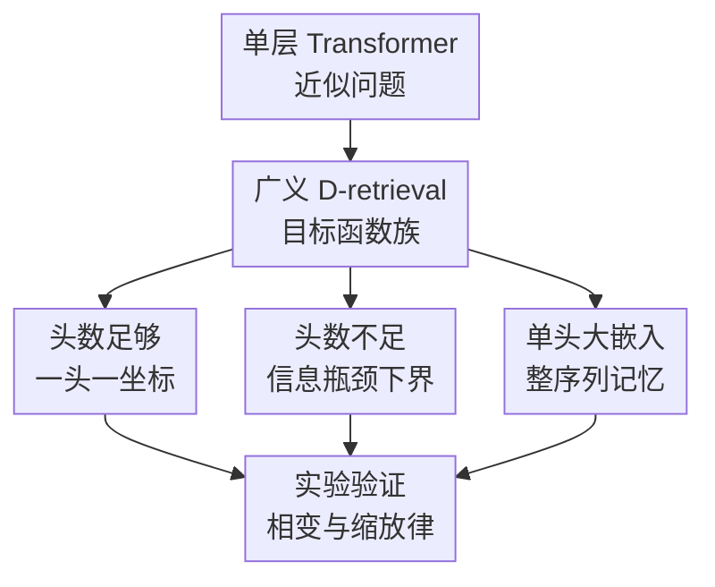

# The Effect of Attention Head Count on Transformer Approximation

**会议**: ICLR2026  
**OpenReview**: [https://openreview.net/forum?id=RJXwuAMUiI](https://openreview.net/forum?id=RJXwuAMUiI)  
**代码**: 无  
**领域**: 学习理论  
**关键词**: Transformer近似理论, 注意力头数, 表达能力下界, 检索任务, 序列建模  

## 一句话总结

这篇论文从近似理论角度证明了 Transformer 的注意力头数不是单纯的工程超参：当头数 $h$ 达到任务内在维度 $D$ 时可以高效近似广义检索函数，而当 $h<D$ 时参数量必须随序列长度 $T$ 呈指数式恶化，并用合成检索、MS MARCO 与 CIFAR-10 实验观察到相近的相变现象。

## 研究背景与动机

**领域现状**：Transformer 已经成为序列建模、语言模型、视觉 Transformer 和多模态模型的基础架构。实践中，大模型经常使用 32、64、128 这类较大的注意力头数，但这些选择主要来自经验配方，而不是来自“某个任务到底需要多少头”的理论判据。已有表达能力研究更多证明 Transformer 具备 universal approximation 或图灵完备性，也有工作分析低秩注意力、单头近似率、稀疏注意力等设定，但通常集中在上界或较简化的线性/局部模型上。

**现有痛点**：仅有“头数足够时能表示很多函数”的上界并不能解释头数不足时到底会付出什么代价。一个头本质上通过 softmax 加权平均从序列里抽取一份表示，如果目标函数需要同时找出多个彼此独立的显著特征，少数头就可能把不同特征压进同一个表示里。过去理论往往绕开了这个瓶颈：要么把注意力矩阵线性化，要么只研究 attention block 本身，要么允许单头使用极大的嵌入维度，从而很难给出现实非线性设定下的严格下界。

**核心矛盾**：多头注意力的经验有效性，可能不只是“多个子空间带来多样性”这么宽泛，而是与任务所需同时检索的独立坐标数有关。若任务有 $D$ 个内在检索坐标，而模型只有 $h<D$ 个头，那么至少有一个头要同时承担多个检索角色；这种压缩会让 attention 输出对某些不同输入几乎不可区分，后面的 FFN 只能用巨大参数量去补救。

**本文目标**：作者希望回答三个具体问题。第一，能否构造一个既足够一般、又能暴露头数瓶颈的目标函数族？第二，在该函数族上，$h\ge D$ 与 $h<D$ 的近似复杂度是否存在可证明分离？第三，单头但超大嵌入维度的“记住整段序列”方案，与多头专门化方案在理论上有什么区别？

**切入角度**：论文引入广义 $D$-retrieval task，把序列到向量的目标函数写成“先从若干位置集合中各取一个最小值特征，再由外层函数组合”的形式。这个族看起来像检索问题，但作者进一步证明它在连续函数空间里稠密，因此不是只为某个玩具任务服务。这样一来，$D$ 就可以被解释为目标的内在检索维度，注意力头数 $h$ 与 $D$ 的关系就成为可分析对象。

**核心 idea**：用广义检索任务把“每个头能否专门负责一个目标坐标”形式化，并证明头数不足会把不同序列压成近似相同的 attention 表示，从而迫使 FFN 参数量以 $\Omega(1/\epsilon^{cT})$ 级别增长。

## 方法详解

### 整体框架

这篇论文不是提出一个新 Transformer 模型，而是建立一套近似理论分析框架。它先定义单层、多头、sequence-to-vector Transformer 假设类，再构造广义 $D$-retrieval 目标函数族，随后分别证明三种 regime：$h=D$ 时多头可专门化并高效近似，$h<D$ 时存在严格参数下界，$h=1$ 但嵌入维度 $n\ge Td$ 时可以通过“记住整段序列”绕开头数不足。

形式上，输入是长度为 $T$ 的序列 $X_T=\{x^{(s)}\in[0,1]^d:s\in[T]\}$，输出是一个与 $T$ 无关的向量。每个 token 先经可训练编码器 $P_\phi(x,s)$ 映射到 $E=nh$ 维，其中 $n$ 是每头嵌入维度，$h$ 是头数。模型追加一个 classification token $\hat c_0$，再用单层多头注意力处理序列，最终只读 classification token 位置的输出并交给 FFN $\hat F$。

广义 $D$-retrieval 目标函数的核心写法是：

$$
\bar z_i(X_T)=\min_{t\in S_i} f_i(x^{(t)}),\quad i=1,\ldots,D,
$$

$$
H(X_T)=F_0(\bar z_1(X_T),\ldots,\bar z_D(X_T)).
$$

这里每个 $f_i$ 是输入 token 上的平滑函数，$S_i\subseteq[T]$ 是参与第 $i$ 个检索坐标的位置集合，$F_0$ 是外层组合函数。直觉上，$\bar z_i$ 表示“在一组候选位置中取出第 $i$ 类最显著特征”，而 $F_0$ 负责把这些特征合成最终答案。论文还要求每个 $f_i$ 有唯一非退化最小点、不同坐标的最小点彼此不同、$F_0$ 对每个坐标真正敏感，以排除常数函数或重复坐标这类退化情况。

### 关键设计

**1. 广义 D-retrieval 目标族：把“任务需要几个独立检索坐标”变成可证明的内在维度**

论文最关键的建模动作，是没有直接拿任意连续函数硬做下界，而是先构造一个既结构化又足够一般的目标族。每个目标坐标 $\bar z_i$ 只依赖于某个位置集合 $S_i$ 上的最小值，形式简单到可以被 softmax attention 近似成 hardmax/hardmin；但多个坐标经过外层函数 $F_0$ 组合后，又能表达相当广的序列到向量映射。作者证明 $\{\mathcal F_D\}_{D=1}^{\infty}$ 在 $C(X_T)$ 中稠密，即对任意连续目标 $F$ 和任意精度 $\epsilon$，总能找到某个 $D$ 与一个广义检索函数 $f\in\mathcal F_D$ 使 $\|F-f\|_\infty\le\epsilon$。

这个密度结论让后面的下界更有分量：作者分析的不是一个孤立的“max 加 min”玩具函数，而是一类可逼近一般连续序列函数的检索骨架。更进一步，论文还给出 intrinsic dimension 的唯一性结论：在正则条件与 $D_1^2+D_2^2\le T/50$ 这类规模约束下，同一任务若能用两个广义检索表示写出，则两个表示的 $D$ 必须一致。也就是说，$D$ 不是作者随便调出来的参数，而是目标函数本身携带的“需要多少个独立检索角色”的量。

**2. 头数充足上界：用一头专门近似一个检索坐标，避免跨坐标压缩**

当 $h=D$ 时，作者构造了一种很直接的 Transformer 近似方案：第 $i$ 个头只负责第 $i$ 个检索坐标 $\bar z_i$。编码器先用小型 FFN $\Psi_{i,\delta}$ 近似 $f_i(x)$，同时用一个位置 gate $r_i(t)$ 区分 $t\in S_i$ 与 $t\notin S_i$；注意力 logit 取成类似 $-\Psi_{i,\delta}(x^{(t)})+r_i(t)$ 的形式。softmax 温度 $\beta$ 足够大时，这个头的加权平均就会集中到 $S_i$ 内 $f_i$ 最小的位置，从而近似 $\min_{t\in S_i}f_i(x^{(t)})$。

这个构造说明多头的作用可以非常具体：不是抽象地“提供多个注意力模式”，而是把 $D$ 个检索坐标拆给 $D$ 个头，各自做一个 hard retrieval。得到 $\tilde z=(\tilde z_1,\ldots,\tilde z_D)$ 之后，最终 FFN 只需近似外层 $F_0$。若 $F_0$ 和 $f_i$ 都满足常规两层网络近似假设，参数量上界为 $M\le C_{d,D,T}/\epsilon^\gamma$。虽然常数可依赖 $T$，但精度指数不再带有随序列长度爆炸的项，体现了“头数足够后，困难被拆成 $D$ 个局部检索”的效率优势。

**3. 头数不足下界：构造 attention 输出几乎相同、目标值明显不同的两条序列**

最有价值的部分是 $h=s<D$ 的下界。作者的证明思路可以理解为一次对少头模型的“对抗性压缩测试”：由于只有 $s$ 个头，却有 $D$ 个互不相同的检索 basin，总存在某个目标坐标的局部区域没有被任何头的最大响应点覆盖。论文在这个未被充分关注的局部线段 $G_i$ 上离散出大量候选子序列，再用鸽巢原理找到两条不同子序列 $Z_1,Z_2$，使得对每个头而言，它们经过 attention 后的加权 value 平均几乎一样，差距只有 $O(\epsilon^{k+1})$。

但这两条子序列在目标函数看来并不一样。因为 $f_i$ 在 $G_i$ 上具有由正定 Hessian 保证的局部斜率，两个不同点会带来至少线性的 $f_i$ 差异；又因为 $F_0$ 对第 $i$ 个坐标的偏导不为零，这个差异会传到最终目标值中。于是作者把 $Z_1,Z_2$ 嵌入成完整序列 $W_1,W_2$，让目标函数把它们分开至少 $3\epsilon$，但 attention block 却把它们映成几乎不可区分的表示。若模型还要做到 $\epsilon$-approximation，最后的 FFN 就必须在极小输入距离上产生明显输出差异，等价于需要很大的 Lipschitz 能力；在权重有界、激活 1-Lipschitz 的两层 FFN 里，这会转化为参数量下界。

论文给出的下界写成：当 $h=s<D$ 时，

$$
\min\{M:\mathcal H(h,n,d,T,M)\ \epsilon\text{-approximates}\ H\}=\Omega(1/\epsilon^k),
$$

其中

$$
k=\frac{(T/4-s-D+1)}{(n+1)s+1}-1.
$$

在 $d,D,n,h$ 相对固定而 $T$ 增长时，这个指数随 $T$ 线性增大，因此可概括为参数复杂度呈 $\Omega(1/\epsilon^{cT})$ 型恶化。这是全文最强的理论信息：少头不是只差一个常数，而会在长序列检索型任务上触发随长度放大的表达瓶颈。

**4. 单头大嵌入维度：用“记住整段输入”绕开头数瓶颈，但代价转移到表示维度与 FFN**

作者还分析了一个看似反直觉的情况：只有一个头也可以近似广义检索任务，只要每头嵌入维度 $n\ge Td$。构造方式是把第 $t$ 个 token 放进 $RTd$ 的第 $t$ 个 block，例如 $P_\phi(x^{(t)},t)=e_t\otimes x^{(t)}$。此时即使用平凡 attention 平均，classification token 也能得到 $\frac1T(x^{(1)},\ldots,x^{(T)})$，等于完整保存了整个序列的信息。后面的五层 ReLU FFN 再负责近似所有 $f_i$、计算 min/max 类操作、并近似 $F_0$。

这个结论不是在鼓励单头架构，而是在区分两种机制：多头足够时，attention 层本身完成结构化检索；单头大维度时，attention 只是把整段输入搬到 FFN 面前，真正的计算复杂度转移到 FFN 与 $Td$ 维表示上。论文给出的参数上界是 $M>C_{d,D,T}/\epsilon^{1+\gamma}$，其中额外的 $1/\epsilon$ 来自用浅层 ReLU 网络近似 max/min 操作。这个 regime 理论上可行，但对长序列并不实用，也解释了为什么“单头 universal approximation”并不等价于“少头高效”。

### 一个完整示例

可以用论文开头的 toy task 理解三种情况。设输入是一串标量 $x^{(1)},\ldots,x^{(T)}\in[0,1]$，目标为

$$
H(X_T)=\max_{1\le t\le T}x^{(t)}+\min_{1\le t\le T}x^{(t)}.
$$

这个任务需要同时取最大值和最小值，因此可看成 $D=2$ 的检索问题。若有两个头，一个头把 logit 设计成偏向最大值位置，另一个头偏向最小值位置，最终 FFN 只要把两者相加即可。此时序列长度增加不会迫使一个头同时携带两类极端信息。

若只有一个头，softmax 加权平均一次只能输出一份混合表示。它既要保留最大值，又要保留最小值；当 $T$ 变长，可选择的极端位置越来越多，许多不同序列会在这个单头输出里变得非常接近。目标函数却仍然能区分这些序列，因为最大值或最小值变了。最后的 FFN 若想把这些近邻输入硬分开，就必须非常“陡峭”，在权重有界条件下只能靠大量隐藏单元实现，这正是下界证明的直觉来源。

若只有一个头但嵌入维度扩大到 $T$ 级别，它可以把每个位置的值都放进独立坐标，相当于把完整序列交给 FFN。这样当然能算 max 与 min，但代价是嵌入维度随 $T$ 线性增长，注意力层也不再提供有效的检索专门化。

### 损失函数 / 训练策略

理论部分没有训练目标；实验部分用标准监督训练来验证缩放趋势。合成任务中，目标是 $y=\sum_{i=1}^4\max_{1\le t\le T}a_i^\top x^{(t)}$，内在维度 $D=4$。输入 $x^{(t)}\sim\mathcal N(0,I_4)$，序列长度 $T\in\{8,16,32,64,128\}$，训练集 8000 个样本、验证集 2000 个样本。模型是去掉 residual 与 layer norm 的单层多头 Transformer，每头嵌入维度固定，输出用两层 GELU MLP 回归标量。评价指标是 NMSE，即 MSE 除以目标方差，避免不同 $T$ 下 max-of-Gaussian 目标方差变化影响比较。

MS MARCO 实验是 retrieval-style 分类：每个 query 配一个正 passage 和 $T-1$ 个 hard negatives，$T\in\{8,16,32,64\}$。作者冻结 BERT tokenizer 与词/位置/segment embedding，只训练投影层与两层 Transformer encoder，观察训练 top-1 accuracy 和 MRR 随头数变化。CIFAR-10 实验使用四层 ViT，patch size 为 $8\times8$，通过扩展图像边界改变序列长度，固定每头维度为 16，变化头数并观察训练/验证准确率。

## 实验关键数据

### 主实验

合成任务最贴近理论设定，内在维度为 $D=4$。在固定 hidden dimension $N=32$ 时，头数从 1 增到 4 会带来明显相变；当 $h\ge4$ 后，NMSE 降到 $10^{-5}$ 到 $10^{-6}$ 量级，且对序列长度的恶化基本消失。

| 任务 / 数据集 | 关键设置 | 观察到的相变头数 | 代表性结果 | 说明 |
|--------|------|------|----------|------|
| 合成 $D=4$ 检索 | $T=8\sim128$, $h=1\sim5$ | $h=4$ | $h=3,T=128$ NMSE $1.58\times10^{-3}$；$h=4,T=128$ NMSE $5.23\times10^{-6}$ | 头数达到内在维度后误差骤降 |
| MS MARCO 检索 | $T=8,16,32,64$, 两层 Transformer | 约 $h=12$ | $h=8,T=64$ train acc $0.932$；$h=12,T=64$ train acc $0.991$ | 少头时长序列更难，足够头后曲线变平 |
| CIFAR-10 ViT | 扩展图像边界改变 patch 序列长度 | 约 $h=10$ | $h=8$ train acc 约 $90\%\sim95\%$；$h=10$ 后接近 $96\%\sim98\%$ | 真实视觉任务也出现类似转折 |

在合成任务的误差表中，$h=1$ 时 NMSE 从 $T=8$ 的 $7.01\times10^{-2}$ 增到 $T=128$ 的 $1.45\times10^{-1}$；$h=2$ 时降到 $10^{-2}$ 量级但仍随 $T$ 变差；$h=3$ 时进一步降到 $10^{-3}$ 量级。真正的转折发生在 $h=4$：$T=8$ 为 $6.10\times10^{-5}$，$T=128$ 为 $5.23\times10^{-6}$，已经接近完美拟合。$h=5$ 继续提升有限，说明超过内在维度后的收益很快变小。

### 消融实验

论文做了多组额外设置来确认相变不是某个实现细节造成的，包括固定总嵌入维度 $E=nh=32$、把合成任务改成 $D=3$、以及使用两层 Transformer。结果都保留了“相变出现在内在维度附近”的趋势。

| 配置 | 关键指标 | 说明 |
|------|---------|------|
| 固定总嵌入维度 $E=32$ 的 $D=4$ 合成任务 | $h=3,T=128$ NMSE $4.77\times10^{-4}$；$h=4,T=128$ NMSE $5.70\times10^{-7}$ | 即使总维度不随头数线性增长，$h=4$ 仍出现明显跃迁 |
| $D=3$ 合成任务 | $h=2,T=128$ NMSE $1.11\times10^{-3}$；$h=3,T=128$ NMSE $2.11\times10^{-7}$ | 相变位置随任务内在维度从 4 移到 3 |
| 两层 Transformer, $D=4$, NoPE/NoLN | $h=1,T=128$ NMSE $4.28\times10^{-4}$；$h=2,T=128$ NMSE $3.83\times10^{-6}$ | 支持作者对多层情形 $L\cdot h\ge D$ 的猜想，但不是严格证明 |
| MS MARCO 验证准确率 | 验证集随 $T$ 变长整体下降，且大头数不一定提升泛化 | 训练准确率更能反映表达能力，验证表现还受 hard negative 与过拟合影响 |
| CIFAR-10 验证准确率 | 训练相变明显，验证精度在大头数下可能下降 | 真实视觉任务里，表达能力提升与泛化/优化之间存在额外 trade-off |

### 关键发现

- 头数不足时，序列长度越长，同等参数下误差越高；这与理论中的 $\Omega(1/\epsilon^{cT})$ 下界方向一致。
- 合成任务的相变点精确对齐 $D=4$，而改成 $D=3$ 时相变也移动到 $h=3$，说明“内在维度”不是事后解释。
- MS MARCO 与 CIFAR-10 的相变点不是论文预先定义的真实 $D$，但曲线形态与理论预测一致：少头时长序列更难，足够头数后长度依赖变弱。
- 单纯增加头数不是永远更好；在真实任务上，训练准确率会升高，但验证准确率可能因优化、过拟合、参数分配等因素出现下降。
- 两层合成实验暗示多层模型可能用 $L\cdot h$ 个有效检索角色弥补单层头数不足，但这一点仍停留在猜想和实验观察层面。

## 亮点与洞察

- 这篇论文把“多头注意力为什么需要多个头”从经验直觉推进到一个可证明的近似复杂度命题。它不是简单说多头更强，而是指出强在哪里：当任务有多个独立检索坐标时，多头允许专门化，少头会产生压缩瓶颈。
- 下界证明的构造很有启发性：找两条目标值相差明显、但 attention 表示几乎相同的序列，再把困难推给 FFN。这种“attention 前端不可分，后端只能靠大 Lipschitz/大参数补救”的思路，可以迁移到分析稀疏注意力、GQA/MQA 或 head pruning 的表达能力代价。
- 广义 $D$-retrieval task 的定义兼具可分析性与一般性。它把 max/min 检索、hard negative retrieval、patch/token 选择这类任务共同抽象成“若干坐标的极值提取”，比直接分析任意连续函数更容易暴露 Transformer 的结构瓶颈。
- 单头大嵌入维度的结果提醒我们，universal approximation 本身并不够。一个架构能表示某个函数，不代表它能以合理维度和参数高效表示；很多理论争论真正关心的应是 approximation efficiency，而不是纯粹可表示性。
- 实验部分虽然不是严格证明真实任务存在某个清晰 $D$，但提供了一种实用诊断思路：通过改变头数和序列长度，观察误差曲线是否在某个头数附近从“随 $T$ 恶化”变成“对 $T$ 稳定”，从而反推出任务或模型的有效检索维度。

## 局限与展望

- 理论主结果限制在单层、sequence-to-vector Transformer，并去掉 layer normalization 以及部分 residual 连接。作者认为关键下界可能对带 layer norm 的模型仍成立，但文中没有给出严格证明。
- 广义 $D$-retrieval 虽然稠密，但最能体现头数瓶颈的仍是检索式、极值式任务。对于纯局部组合、平滑平均、或强生成式语言建模目标，如何定义对应的内在维度仍不直接。
- 下界依赖权重有界、FFN 为两层且激活 1-Lipschitz 等条件。论文讨论了 Heaviside、允许参数范数随 $T,1/\epsilon$ 增长、五层 FFN 等变体，但真实大模型中的归一化、残差、激活和优化动态会更复杂。
- 多层情形只提出 Conjecture：高效近似可能需要 $L\cdot h\ge D$。这非常有价值，但也是后续工作最该补上的理论缺口，因为实际 Transformer 几乎都依赖深层堆叠。
- 实验主要看训练准确率或最优 seed 的最小误差，用来隔离表达能力是合理的，但与真实泛化性能仍有距离。MS MARCO 和 CIFAR-10 的验证结果说明，头数带来的表达能力提升并不自动转化为泛化提升。
- 对实际模型设计的建议还偏定性。若未来能把“有效检索维度”估计成训练早期可测指标，就能更直接指导 head count 选择、head pruning 或 GQA 分组策略。

## 相关工作与启发

- **vs Yun et al. 2020 universal approximation**: Yun 等工作证明 Transformer 可以逼近广泛的 sequence-to-sequence 函数，回答的是“能不能表示”；本文进一步问“以多少头、多少参数高效表示”，并给出头数不足时的下界。
- **vs Jiang & Li 2024 single-head approximation rate**: Jiang & Li 分析单层单头 Transformer 的近似率，更偏向单头可行性；本文把单头放在大嵌入记忆 regime 中解释，强调它可行但不一定高效，也不能替代多头专门化。
- **vs Amsel et al. 2024 quality over quantity in attention layers**: Amsel 等关注注意力矩阵 rank 与某些 nearest-neighbor 目标，指出加头不一定总有益；本文关注 head count 与序列长度相关的参数下界，在非线性检索族上给出更直接的少头瓶颈。
- **vs Bhojanapalli et al. 2020 low-rank bottleneck**: Bhojanapalli 等从低秩注意力角度讨论表达力瓶颈；本文的瓶颈不是单纯矩阵 rank，而是多个目标坐标被少数头压缩后，FFN 需要承担指数级分离成本。
- **vs Mahdavi et al. 2023 memorization capacity**: Mahdavi 等研究多头注意力能记住多少样本；本文的单头大嵌入结论不是训练集 memorization，而是把整段输入编码进表示后由 FFN 计算目标关系，更像“序列内容记忆”与“模式学习”的理论对照。

## 评分

- 新颖性: ⭐⭐⭐⭐⭐ 把注意力头数与任务内在检索维度联系起来，并给出 $h<D$ 的非线性近似下界，理论问题切得很准。
- 实验充分度: ⭐⭐⭐⭐ 合成实验非常贴合理论，真实任务也显示相变趋势；不足是多层真实模型只做经验支持，验证泛化结论还不够强。
- 写作质量: ⭐⭐⭐⭐ 主线清楚，定理解释充分；证明部分符号较密，部分 max/min 记号和附录细节需要读者有较强数学背景才能完全跟上。
- 价值: ⭐⭐⭐⭐⭐ 对 Transformer 架构选择、head pruning、GQA/MQA 设计和长上下文检索任务都有启发，尤其提醒不要只用 universal approximation 判断架构能力。

<!-- RELATED:START -->

## 相关论文

- [\[ICLR 2026\] On the Interpolation Effect of Score Smoothing in Diffusion Models](on_the_interpolation_effect_of_score_smoothing_in_diffusion_models.md)
- [\[ICLR 2026\] Poly-attention: a general scheme for higher-order self-attention](poly-attention_a_general_scheme_for_higher-order_self-attention.md)
- [\[ICLR 2026\] Strong Correlations Induce Cause Only Predictions in Transformer Training](strong_correlations_induce_cause_only_predictions_in_transformer_training.md)
- [\[ICLR 2026\] Subquadratic Algorithms and Hardness for Attention with Any Temperature](subquadratic_algorithms_and_hardness_for_attention_with_any_temperature.md)
- [\[ICLR 2026\] Critical Attention Scaling in Long-Context Transformers](critical_attention_scaling_in_long-context_transformers.md)

<!-- RELATED:END -->
