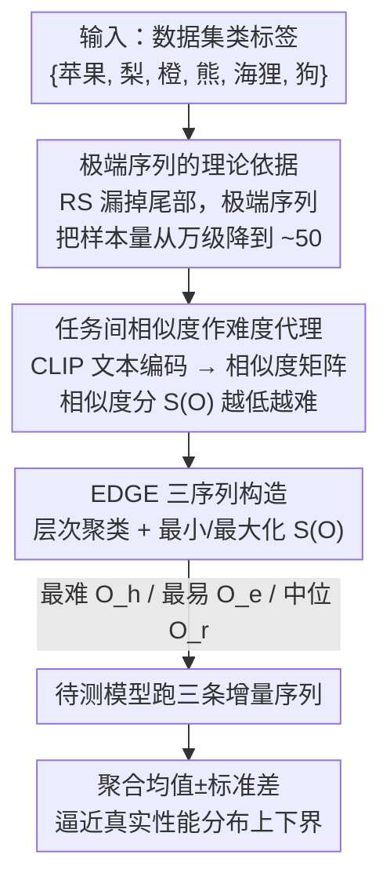

# The Lie of the Average: How Class Incremental Learning Evaluation Deceives You?

**会议**: ICLR 2026  
**OpenReview**: [https://openreview.net/forum?id=19LHXi9uLw](https://openreview.net/forum?id=19LHXi9uLw)  
**代码**: https://github.com/AIGNLAI/EDGE  
**领域**: 学习理论 / 持续学习评测  
**关键词**: 类增量学习, 评测协议, 极端序列, 任务间相似度, 性能分布估计  

## 一句话总结
这篇论文指出类增量学习（CIL）通行的"随机采 3-5 条类序列、报均值方差"评测方式会系统性高估均值、严重低估方差，从根本上漏掉极端序列；作者从理论上证明随机采样不可行，并提出 EDGE 协议——用 CLIP 文本编码器算类间语义相似度、构造"最难/最易/中位"三条极端序列来逼近真实性能分布，从而给出更可靠的模型选择与鲁棒性判断。

## 研究背景与动机
**领域现状**：类增量学习要求模型按任务序列不断学新类、又不忘旧类。已有大量工作在堆架构和算法，但"怎么评测一个 CIL 模型"长期被忽视。主流做法是固定 3 个随机种子（如 0、42、1993）采样出 3-5 条类到达顺序，分别跑完整个增量过程，最后报告这几条序列末尾平均精度 $A(O)$ 的样本均值和标准差——作者把这套叫 **Random Sampling (RS) 协议**。

**现有痛点**：CIL 的最终性能对"类以什么顺序到达"极其敏感。作者做了一个可穷举的对照实验：6 个类、分成 3 个任务，共有 90 种到达顺序，把每种都跑一遍得到真实分布。结果发现最易序列和最难序列的精度差最高可达 20%（CIFAR-100 上的 Hide-Prompt），而真实分布近似高斯。把 RS 采到的 3 条拟合成高斯后和真实分布一比，RS 系统性地**高估均值、剧烈低估方差**，完全抓不到上下界。一个被 RS 报出"均值 85% 很安全"的模型，真实下界可能只有 70%——在自动驾驶这种类到达顺序不可控的场景里，这种漏报是致命的。

**核心矛盾**：可能的类序列数量随类数阶乘爆炸（$O(N!)$ 量级），而我们只能采极少数几条。靠均匀随机采样去逼近整个性能分布，在统计上需要的样本量大到不可行；更糟的是，随机采样几乎必然采不到尾部的极端序列，而恰恰是极端序列决定了部署风险。

**本文目标**：(1) 从理论上说清 RS 为什么不可靠、需要多少样本才够；(2) 找到一种能用很少样本就刻画分布上下界的评测协议。

**切入角度**：作者观察到一个稳定的正相关——**任务间相似度越低、模型性能越差**（相邻任务越不像，参数在任务切换时跳变越大、越容易遗忘）。既然相似度能预测难度，就可以用它来"定向构造"最难和最易序列，而不是盲采。

**核心 idea**：不再追求"采够多随机序列逼近分布"，而是**用类间语义相似度直接构造极端序列**（最难+最易），再配一条中位序列，三条就能把真实性能分布的中心和上下界都钉住。

## 方法详解

### 整体框架
EDGE（Extreme case-based Distribution & Generalization Evaluation）是一个**评测协议**，不改模型、只改"喂给模型哪些类序列、怎么聚合结果"。它的输入是一个数据集的类标签集合，输出是对该模型真实性能分布的一个三点估计（均值±标准差 + 上下界）。整体流程是：把所有类标签用预训练 CLIP 文本编码器编成语义向量 → 算出类与类之间的余弦相似度矩阵 → 在此矩阵上做层次聚类并按"最小化/最大化任务间相似度"的目标搜索任务划分与顺序 → 得到最难序列 $O_h$、最易序列 $O_e$、以及一条随机中位序列 $O_r$ → 让待测模型在这三条序列上各跑一遍完整增量学习 → 把三个末尾精度聚合成均值和标准差，逼近真实分布。

### 关键设计

**1. 极端序列采样：把随机采样的"万级样本量"压到几十条**

痛点直接来自组合爆炸。论文先用 Lemma 1 给出序列总数 $|\Omega| = \frac{N!}{(M!)^K}$（$N$ 个类分成 $K$ 个等大任务、每任务 $M=N/K$ 类），并证明在 $K=\Theta(N)$ 线性缩放下 $|\Omega|$ 阶乘式增长、$|\Omega|=\Omega((N/e)^N)$。对 $N=100$、$K=10$，序列数约 $10^{92}$，采 3 条覆盖率不到 $10^{-90}$。Theorem 1 进一步给出：要让经验均值 $\hat A_L$ 以概率 $1-\delta$ 落在真实均值 $\varepsilon$ 邻域内，所需样本量是 $\Omega\!\left(\frac{N\ln N}{\varepsilon^2}\right)$ 量级——即便 $N=100$、$\varepsilon=0.1$、$\delta=0.05$，也要 $L\gtrsim 2\times 10^4$ 条，纯随机采样根本不现实。

更关键的是分布尾部：定义偏离集合 $E_t=\{\omega:|A(\omega)-\mathbb{E}[A]|>t\sqrt{\mathrm{Var}[A]}\}$，$L$ 条随机序列全都没落进 $E_t$ 的概率约为 $\exp(-(|E_t|/|\Omega|)L)$，也就是说均匀随机采样**几乎必然抓不到极端情形**。Theorem 2 给出解药：如果我们能拿到两条满足 $A(\omega_+)-\mu\ge\sigma$、$\mu-A(\omega_-)\ge\sigma$ 的极端序列并把它们强制纳入样本，所需随机样本量会降到正比于 $R(\sigma)^2=(A(\omega_+)-A(\omega_-))^2$；当 $R(\sigma)\approx0.1$（实践常见）时 $L$ 约降到 50。这就是 EDGE 全部立论的根基——**与其盲采上万条，不如精准构造两条极端序列再补一条中位**。

**2. 任务间相似度：把"哪条序列最难"变成可计算的代理量**

要构造极端序列，先得有一个能预测序列难度的量。作者把它锚定在**任务间语义相似度**上，并给出序列相似度分的定义：

$$S(O)=\frac{K}{(K-1)N}\sum_{1\le i\le K-1}\sum_{c\in C_i}\sum_{c'\in C_{i+1}}\mathrm{Sim}(c,c'),$$

即沿任务顺序，把每对相邻任务里所有跨任务类对的语义相似度 $\mathrm{Sim}(c,c')$ 求和归一。Theorem 3 证明了它和泛化误差的单调关系：记最难序列 $O_h$、最易序列 $O_e$、随机序列 $O_r$，则相似度分满足 $S(O_h)\le S(O_r)\le S(O_e)$，对应泛化误差满足 $\epsilon_g(O_h)\ge\epsilon_g(O_r)\ge\epsilon_g(O_e)$。直觉是：相邻任务越不像，模型在任务切换时参数跳变越大、遗忘风险越高、误差上界越高。Figure 2c 在全部可枚举序列上验证了这一点——多数方法呈现稳定正相关（Pearson $R$ 在 0.12–0.31）。于是"找最难/最易序列"就等价于"最小化/最大化 $S(O)$"，把一个不可枚举的搜索问题变成了可优化的目标。

**3. EDGE 协议：CLIP 文本编码 + 层次聚类生成三条代表序列**

有了相似度这个目标函数，剩下是怎么实际造出序列。由于评测时拿不到图像实例，EDGE 改用预训练 CLIP 的**文本编码器** $\Phi$ 把每个类名编码成 $d$ 维向量 $L_i=\Phi(y_i)$，再算余弦相似度构出对称矩阵 $D\in\mathbb{R}^{N\times N}$，$d_{ij}=\frac{L_i\cdot L_j}{\|L_i\|\|L_j\|}$。生成**最难序列**时：先对类做层次聚类，把语义相近的类尽量塞进**同一个任务**（保留大簇、按需拆小簇），这样跨任务相似度被压到最低；再算任务级相似度矩阵 ITS，从全局相似度最低的任务起步，每次贪心地接上与当前任务最不像的下一个任务；通过改变聚类粒度生成多个候选、取 $S(o)$ 最低者作为 $O_h$。**最易序列**完全对称——刻意把相似类分散到**不同任务**、每步接上与上一个任务最像的任务，取 $S(o)$ 最高者作为 $O_e$。为保持总采样条数不变（仍是 3 条，和 RS 公平对比），再随机取一条作为中位序列 $O_r$，由 Theorem 1 保证它大概率落在分布中心。三条序列上各评一次、聚合均值与标准差，就得到对真实分布的逼近。

### 损失函数 / 训练策略
EDGE 不引入任何训练损失或对模型参数的改动——它是纯评测层的协议，所有待测 CIL 模型按各自原方法正常训练，EDGE 只负责决定"在哪几条类序列上测、结果怎么聚合"。

## 实验关键数据

实验分两部分：一是**可穷举实验**（每个数据集取前 6 类分 3 任务、共 90 种排列作为真实分布 $D_{true}$），定量比较 RS 与 EDGE 估计分布和真实分布的距离；二是**经典 CIL 设置下**的分析实验，可视化各协议捕捉极端值的能力。距离用 JSD 散度（$\mathrm{JSD}$）和 Wasserstein 距离（$W$）衡量，越小越准。

### 主实验

下表为预训练方法在可穷举设置下的边界估计（节选，灰色为真实值的逼近对象，JSD/W 越小越好）：

| 数据集 | 方法 | 真实下界 minA | RS 下界 | EDGE 下界 | JSD(RS) | JSD(EDGE) | W(RS) | W(EDGE) |
|--------|------|------|------|------|------|------|------|------|
| CIFAR-100 | L2P | 71.83 | 83.83 | **72.83** | 0.44 | **0.30** | 2.81 | **2.00** |
| CIFAR-100 | Hide-Prompt | 72.50 | 79.67 | **73.00** | 0.34 | **0.22** | 3.89 | **1.42** |
| ImageNet-R | CODA-Prompt | 18.72 | 39.04 | **21.93** | 0.65 | **0.20** | 9.85 | **2.37** |
| ImageNet-R | RanPAC | 90.91 | 93.05 | 93.05 | 0.57 | **0.36** | 2.25 | **1.07** |

非预训练方法（Table 2）结论一致：CIFAR-100 上 EWC 真实下界 12.50%，RS 估成 26.17%（虚高一倍多），EDGE 估成 12.50%（完全命中）。几乎所有格子里 EDGE 的 JSD 和 W 都 ≤ RS。

### 消融实验

| 配置 | 关键发现 | 说明 |
|------|---------|------|
| RS vs EDGE 下界 | RS 把 EWC 下界从真实 12.50% 估成 26.17% | RS 系统性高估下界，导致模型排序出错 |
| EDGE 不同骨干 | ResNet50/101、ViT-B/16、ViT-B/32、ViT-L/14 下均贴近真实分布 | 协议对 CLIP 文本编码器规模/骨干不敏感（Figure 4） |
| 稳定 vs 高方差模型 | EASE/MOS/RanPAC 的 JSD、W 近 0；高波动方法差距才拉开 | 模型越不稳，EDGE 相对 RS 的优势越明显 |

### 关键发现
- **RS 会造成不公平比较**：CIFAR-100 上 DER 真实下界（16.83%）其实优于 EWC（12.50%），但 RS 把 DER 估成 24.17%、EWC 估成 26.17%，得出"EWC 下界更好"的错误结论；EDGE 给出更准的边界，避免这种误判。
- **多个方法可能收敛到相近的最差表现**：在更难的 ImageNet-R 上，多个非预训练方法的真实最差精度挤在 10.06%–12.85% 的窄带里，说明此时**任务难度本身**而非架构差异才是瓶颈——这是 RS 完全看不到、却对模型选型至关重要的信息。
- **边界估计精度与模型稳定性相关**：低方差模型两种协议都能估准，高波动模型才是 EDGE 真正发力的地方。

## 亮点与洞察
- **把"评测的可靠性"上升为可证伪的统计问题**：作者没停留在"随机采样不好"的直觉，而是用 Lemma 1 / Theorem 1 把"需要多少样本"算成 $\Omega(N\ln N/\varepsilon^2)$，再用 Theorem 2 证明纳入两条极端序列能把样本量从万级压到几十级——动机被钉死在数字上，非常有说服力。
- **用 CLIP 文本编码器解决"评测时拿不到图像"的工程难题**：序列难度只需要类名层面的语义相似度，无须真跑图像，使得极端序列可以在训练前就离线构造好，开销极低。
- **"最难/最易/中位"三点估计**这一思路可迁移到任何"性能对输入顺序/划分敏感、但全枚举不可行"的评测场景，例如联邦学习里客户端到达顺序、课程学习里样本难度排序的鲁棒性评测。

## 局限与展望
- **相似度→难度的假设并非永真**：Theorem 3 与 Figure 2c 显示是"多数方法"正相关，个别方法 Pearson $R$ 仅 0.12，相关性偏弱；当某模型对任务间相似度不敏感时，按相似度构造的"极端序列"未必是真极端，EDGE 的边界估计会退化。
- **以语义相似度代理视觉/数据难度有偏**：CLIP 文本相似度反映的是类名语义距离，未必等同于特征空间或像素层面的可分性，跨域数据集上这一代理可能失真。
- **真实分布的高斯假设**：全文以 $N(\mu_A,\sigma_A^2)$ 逼近真实分布并以 JSD/Wasserstein 度量，若真实分布多峰或重尾，三点估计与高斯拟合都会失准。
- **可穷举验证只在 6 类 3 任务的小规模上做**：真正大规模 CIL（如 100 类 10 任务）下无法拿到真实分布，EDGE 的"逼近真值"只能间接论证。

## 相关工作与启发
- **vs RS（随机采样）协议**：RS 用固定种子采 3-5 条序列报均值方差，只给点估计、不刻画分布；EDGE 同样只采 3 条但定向构造极端+中位，能同时抓住中心与上下界，JSD/W 普遍更低。区别在于"盲采"与"按相似度定向构造"。
- **vs Chen et al. (2025) 动态任务分配探下界**：同样关注最差表现，但那类工作偏经验性地探下界；EDGE 走"分布导向"路线，用少量极端感知样本同时估计上下界与整体分布，并有理论样本复杂度支撑。
- **vs 传统多维评测基准（Farquhar & Gal 2018 等）**：前者提出多维指标/基准，EDGE 不增加指标维度，而是改进"采样哪些序列"这一更底层的问题，与现有指标正交、可叠加使用。

## 评分
- 新颖性: ⭐⭐⭐⭐⭐ 把被忽视的 CIL 评测协议问题形式化，并用极端序列+相似度代理给出可证明的解法，角度新。
- 实验充分度: ⭐⭐⭐⭐ 可穷举设置下定量对比扎实、覆盖预训练与非预训练两类方法，但真实大规模分布无法直接验证。
- 写作质量: ⭐⭐⭐⭐⭐ 理论与动机环环相扣，图 1 的"安全假象"叙事很抓人。
- 价值: ⭐⭐⭐⭐⭐ 直指 CIL 社区长期默认却有偏的评测方式，对模型选型与安全部署有直接指导意义。

<!-- RELATED:START -->

## 相关论文

- [\[ICLR 2026\] Quantum Machine Learning Advantages Beyond Hardness of Evaluation](quantum_machine_learning_advantages_beyond_hardness_of_evaluation.md)
- [\[ICLR 2026\] Towards Persistent Noise-Tolerant Active Learning of Regular Languages with Class Query](towards_persistent_noise-tolerant_active_learning_of_regular_languages_with_clas.md)
- [\[ICLR 2026\] Why Ask One When You Can Ask k? Learning-to-Defer to the Top-k Experts](why_ask_one_when_you_can_ask_k_learning-to-defer_to_the_top-k_experts.md)
- [\[ICLR 2026\] Physics-informed learning under mixing: How physical knowledge speeds up learning](physics-informed_learning_under_mixing_how_physical_knowledge_speeds_up_learning.md)
- [\[ICLR 2026\] How hard is learning to cut? Trade-offs and sample complexity](how_hard_is_learning_to_cut_trade-offs_and_sample_complexity.md)

<!-- RELATED:END -->
