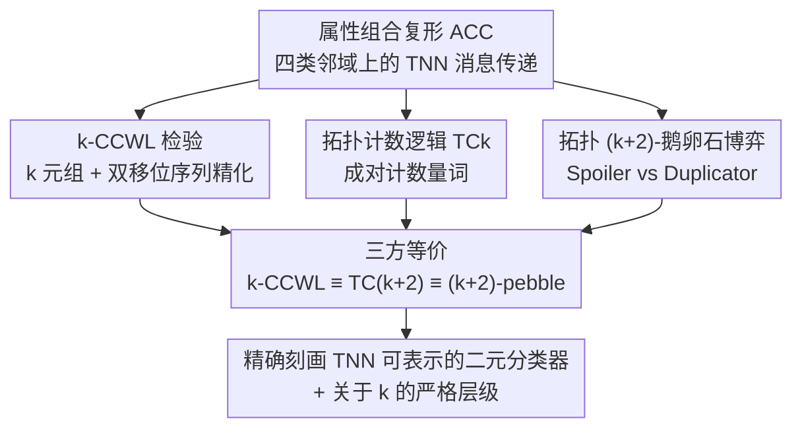

# The Logical Expressiveness of Topological Neural Networks

**会议**: ICLR 2026  
**OpenReview**: [https://openreview.net/forum?id=8w8jzJXjhj](https://openreview.net/forum?id=8w8jzJXjhj)  
**代码**: 未提供  
**领域**: 学习理论 / 图与拓扑表示学习  
**关键词**: 拓扑神经网络, 表达能力, Weisfeiler-Leman, 计数逻辑, 鹅卵石博弈

## 一句话总结
本文为拓扑神经网络（TNN）建立了第一套「算法–逻辑–博弈」三方刻画：提出组合复形上的高阶 WL 检验 $k$-CCWL、带成对计数量词的拓扑计数逻辑 $\text{TC}_k$、以及拓扑 $(k{+}2)$-鹅卵石博弈，并严格证明三者等价——$k\text{-CCWL} \equiv \text{TC}_{k+2} \equiv$ 拓扑 $(k{+}2)$-鹅卵石博弈，从而精确界定了 TNN 能表示哪些二元分类器。

## 研究背景与动机

**领域现状**：图神经网络（GNN）是图上学习的主流范式，但人们早已知道它的表达能力有上界——大多数消息传递 GNN 至多和 1-WL（颜色精化）一样强，无法区分某些非同构图，也无法判定环、连通分量等基本结构性质。更重要的是，Barceló 等人（2020）用一阶逻辑给出了 GNN 能表达的节点级二元分类器的**精确刻画**，使得"GNN 到底能算什么"有了清晰答案。

**现有痛点**：为突破 1-WL 上界，拓扑神经网络（TNN）作为新前沿被提出。它在「组合复形」（combinatorial complex, CC）上做消息传递——不仅在节点之间传，还在边、面等更高阶的 cell 之间沿着边界、上边界、上邻接、下邻接四种邻域结构传递信息，因此天然比 GNN 更强。但一个根本问题悬而未决：**TNN 的逻辑表达能力到底是什么？** GNN 及其高阶变体的逻辑刻画已经很成熟，TNN 这边却几乎是一片空白。

**核心矛盾**：经典图上有一条漂亮的三方对应——$k\text{-WL} \leftrightarrow C_{k+1}$ 计数逻辑 $\leftrightarrow (k{+}1)$-鹅卵石博弈（Cai et al., 1992），三者表达力完全相同，把"算法能区分什么 = 逻辑能定义什么 = 博弈里谁能赢"打通成一条链。但这套机器**没法直接搬到 TNN 上**：图里一条边直接连两个点，而复形里两个 cell 的关系常常要靠**第三个 cell 中介**（两条边相邻是因为共享一个顶点、或同属一个面）。标准计数量词只能对单变量计数，刻画不了这种"成对、被中介"的高阶交互。

**本文目标**：把经典的 "$k\text{-WL} \leftrightarrow C_{k+1} \leftrightarrow (k{+}1)$-pebble" 三方对应**抬升到属性组合复形（ACC）上**，并用它来分析 TNN 的表达能力——具体拆成：① 设计能匹配 TNN 聚合机制的 WL 式精化算法；② 设计能描述其区分能力的逻辑片段；③ 设计与之对齐的博弈；④ 证明三者严格等价。

**核心 idea**：TNN 聚合时本质上在处理**成对的关系信号**（更新一个 cell 要同时用到它的邻居 $y$ 和中介 cell $\delta$），所以逻辑侧必须引入一个**成对计数量词** $\exists^{N}(x_i,x_j)\,\varphi$，它直接对满足性质 $\varphi$ 的 cell 对 $(x_i,x_j)$ 计数——这正是抓住高阶交互的"正确逻辑抽象"，也正是它把博弈侧从 $k{+}1$ 个鹅卵石顶到 $k{+}2$ 个的根源。

## 方法详解

### 整体框架

本文不是提出一个新模型，而是**搭一套刻画 TNN 表达能力的理论框架**。出发点是属性组合复形（ACC）$\Gamma=(S,X,\text{rk},c)$：$S$ 是顶点集，$X$ 是 cell 集合，$\text{rk}$ 给每个 cell 一个阶（rank），$c$ 给每个 cell 一个二值标签；在其上定义边界 $N_B$、上边界 $N_C$、上邻接 $N_\uparrow$、下邻接 $N_\downarrow$ 四种邻域。通用 TNN 就是在这套结构上做消息传递，更新一个 cell 时要聚合四种邻域、且下/上邻接的消息还要带上中介 cell $\delta$ 的信息。

围绕"TNN 能区分哪些非同构 ACC"这个问题，本文从三个侧面各造一个工具，再证明它们指向同一个答案：**算法侧**的 $k$-CCWL（把 $k$-WL 抬升到组合复形）、**逻辑侧**的 $\text{TC}_k$（带成对计数量词的计数逻辑）、**博弈侧**的拓扑 $(k{+}2)$-鹅卵石博弈。三条线最终汇成主结果：$k\text{-CCWL} \equiv \text{TC}_{k+2} \equiv$ 拓扑 $(k{+}2)$-鹅卵石博弈，且随 $k$ 增大表达力严格递增。

### 关键设计

**1. $k$-CCWL：把 WL 精化抬升到组合复形上，用「双移位序列」对齐 TNN 的成对聚合**

经典 $k$-WL 对 $k$ 元顶点组着色精化，但它只认顶点和边。本文的 $k$-CCWL 改为对 $k$ 元 **cell** 组 $\mathbf{x}=(x_1,\dots,x_k)$ 操作，初始标签是**原子类型** $\text{atp}_k(\mathbf{x})$——编码了各分量的阶序列 $(\text{rk}(x_1),\dots,\text{rk}(x_k))$、初始颜色 $c(x_i)$、以及描述各分量两两关系的五个二值向量（相等 + 四种邻接）。关键的新意在更新步：

$$\chi^{(t)}_k(\mathbf{x}) = \text{HASH}\Big(\chi^{(t-1)}_k(\mathbf{x}),\ D^{(t)}_k(\mathbf{x})\Big),\quad D^{(t)}_k(\mathbf{x}) = \Big\{\!\!\Big\{\big(\text{atp}_{k+2}(\mathbf{x}\alpha\beta),\ \Delta^{(t-1)}_k(\mathbf{x};\alpha,\beta)\big)\ \big|\ \alpha,\beta\in X\Big\}\!\!\Big\}$$

这里每次精化不是替换一个坐标、而是**同时探测两个替换 $(\alpha,\beta)$**，用所谓的双移位序列 $\Delta^{(t-1)}_k(\mathbf{x};\alpha,\beta)=\big\langle\big(\chi^{(t-1)}_k(\mathbf{x}[\alpha/i]),\chi^{(t-1)}_k(\mathbf{x}[\beta/i])\big)\big\rangle_{i=1}^{k}$ 把这两个替换在每个位置上引起的颜色变化成对记录下来。这一"双移位"正是 TNN 聚合机制（邻居 $y$ + 中介 $\delta$ 成对出现）的算法翻版，也是后面逻辑侧需要 $k{+}2$ 个变量、博弈侧需要 $k{+}2$ 个鹅卵石的直接来源。$k$-CCWL 的意义在于它**不是抽象玩具**：$1$-CCWL 就涵盖了绝大多数 cell 复形上的消息传递 TNN（CW Networks/CIN、消息传递单纯复形网络 MPSN、UniGCN/UniGIN 等），凡是更新函数在 $k$-CCWL 精化下不变的模型都区分不了 $k$-CCWL 区分不了的 ACC。时间复杂度 $O(n^{2k+2})$，空间 $O(n^{\max(2,k)})$（$n=|X|$）。此外通过给复形加一个"广播锚点"（一个连到所有 0-cell 的新 0-cell），可得到**全局颜色要么完全相同、要么完全不相交**的二分性（Proposition 3.1），把着色比较干净地化归为同构判定。

**2. 拓扑计数逻辑 $\text{TC}_k$：用「成对计数量词」捕捉被中介 cell 串起来的高阶关系**

标准计数逻辑 $C_k$ 的量词 $\exists^N x_i\,\psi$ 只能数"有多少个单个元素满足 $\psi$"，对图够用（边直连两点），但对复形不够——很多关系是被第三个 cell 中介的。$\text{TC}_k$ 在 $k$ 变量片段上引入新的**成对计数量词**：

$$\Gamma,\mu \models \exists^{N}(x_i,x_j)\,\psi \iff \big|\{(c_1,c_2)\in X^2 \mid \Gamma,\mu[x_i\mapsto c_1, x_j\mapsto c_2]\models\psi\}\big| \ge N$$

即"至少存在 $N$ 对 cell $(c_1,c_2)$ 使 $\psi$ 成立"。配套的原子谓词包括阶谓词 $R_r(x_i)$（$\text{rk}(x_i)=r$）、颜色比特谓词 $P_s(x_i)$、以及四种邻接的二元谓词 $E_N(x_i,x_j)$。这个量词为什么对：TNN 更新一个 cell 的标签时，下/上邻域的消息必然牵涉中介的 face/co-face cell，等于在聚合"成对的关系信号"而非单个邻居——成对量词正好是这种聚合的逻辑抽象。本文证明 $\text{TC}_{k+2}$ 在区分非同构 ACC 上**精化** $k$-CCWL（Theorem 4.1）：$k$-CCWL 每走一步精化，恰好对应在 $\text{TC}_{k+2}$ 里多叠一层量词——用 $k$ 个变量锁住元组、两个备用变量去数那些让扩展满足性质 $\varphi$ 的 $(\alpha,\beta)$ 对。需要诚实指出：$\text{TC}_k$ 仍是有限变量计数逻辑，继承了 $C_k$ 的局部性限制，连通性、哈密顿路径、以及依赖整体"洞/空腔"的拓扑不变量这类需要无界量化的全局性质，固定 $k$ 下仍然表达不了——这与高阶消息传递已知的"盲点"互补。

**3. 拓扑 $(k{+}2)$-鹅卵石博弈：把成对计数量词翻译成 Spoiler/Duplicator 的对弈规则**

第三条腿是博弈，目的是给 $\text{TC}_k$ 一个博弈论刻画。它在两个 ACC $A,B$ 上由 Player I（Spoiler，破坏者）和 Player II（Duplicator，复制者）对弈，状态是两组把变量映到 cell 的偏赋值 $\mu_A,\mu_B$。每一轮的核心规则正是为成对量词量身定制：**① Player I 选一个复形、挑一组有序 cell 对 $P_A\subseteq X_A^2$；② Player II 必须用等势的 $P_B\subseteq X_B^2$ 应对；③ Player I 从 $P_B$ 里挑一对放鹅卵石；④ Player II 在另一边也放一对。**Player II 要赢，必须始终保持 $k$ 维结构相似 $(A,\mu_A^{(i)})\sim_k(B,\mu_B^{(i)})$——即被鹅卵石标记的子复形之间相等关系、阶、颜色、四种邻接全部对应一致（一种局部 CC-同构）。本文证明：Player II 在拓扑 $k$-鹅卵石博弈有必胜策略 $\Rightarrow$ 两结构在所有 $\text{TC}_k$ 公式上一致（Theorem 5.1）；反过来 $k$-CCWL 着色相同 $\Rightarrow$ Player II 在 $(k{+}2)$-鹅卵石博弈有必胜策略（Theorem 5.2）。**为什么是 $k{+}2$ 而非经典的 $k{+}1$**：经典 WL 对应里多出的那 1 个鹅卵石是个"游标"，用来重采样一个坐标；而这里每步精化要检查成对扩展 $(\alpha,\beta)$、逻辑也对这种对计数，于是需要**两个**备用鹅卵石而非一个——这是整篇论文"成对"主线在博弈侧最直观的体现。

**4. 三方等价：把算法、逻辑、博弈钉死成同一条表达力，并给出关于 $k$ 的严格层级**

把 Theorem 4.1（逻辑精化算法）、Theorem 5.1（博弈⇒逻辑）、Theorem 5.2（算法⇒博弈）串起来，得到主结果 Corollary 5.3——对任意两个 ACC 和 $k$ 元组，下面三件事等价：稳定 $k$-CCWL 着色相同 $\Leftrightarrow$ Player II 在拓扑 $(k{+}2)$-鹅卵石博弈有必胜策略 $\Leftrightarrow$ 两者在所有 $\text{TC}_{k+2}$ 公式上一致。限制到 uniform ACC 上即得 $k$-CCWL 与 $\text{TC}_{k+2}$ 表达力相等（Theorem 5.4）。配合 Theorem 3.2（对任意 $k$ 都存在能被 $k$-CCWL 区分、却不能被 $(k{-}1)$-CCWL 区分的非同构 ACC 对），整个层级随 $k$ 增大**严格**变强。它的价值是把"TNN 到底能区分什么"这个原本只能凭经验感觉的问题，钉死成可以用逻辑公式精确描述、用博弈直观判定的对象——这是 TNN 第一套 logic–game–algorithm 三方刻画。

### 一个例子：用 $\text{TC}_4$ 区分两个非同构单纯复形

取两个非同构单纯复形 $A,B$（Figure 2，来自 Verma et al., 2024），$A$ 是两个 $C_4$ 环由一条边连起来。令所有顶点同色、所有边同色，此时 SWL/1-CCWL 都区分不开。但在 $k=2$（对应 $\text{TC}_4$）下，构造公式

$$\phi = \exists^{16}(x_1,x_2)\,\exists^{1}(x_3,x_4)\ \text{CYCLE}(x_1,x_2,x_3,x_4)$$

其中 $\text{CYCLE}$ 要求 $x_1,x_2,x_3,x_4$ 在下邻接 $N_\downarrow$ 下首尾相接成一个 4-环、且对角不相邻不相等。$A$ 里每个 $C_4$ 都贡献出 8 个这样连续相接的 4-元组，故 $A\models\phi$；而 $B$ 里没有这种元组，故 $B\not\models\phi$——逻辑侧成功区分。博弈侧对偶地，Player I 先在 $A$ 的每个 $C_4$ 里挑出全部 16 对相邻边作为 $P_A$，无论 Player II 怎么回应 $P_B$ 都存在一对漏掉关键边 $e_5'$，Player I 借此一路把 Player II 逼到无法维持结构相似而落败。这个例子把"逻辑能定义 = 博弈能赢"两侧具体走了一遍。

## 实验关键数据

> 本文是**纯理论工作**，没有训练模型或跑数据集，因此没有经验实验表；下面用两张表分别汇总主要定理与"图 → 复形"的对应抬升关系，并以一个判定性例子作为关键发现。

### 主要理论结果

| 结论 | 出处 | 内容 |
|------|------|------|
| 主等价 | Corollary 5.3 | $k\text{-CCWL} \equiv \text{TC}_{k+2} \equiv$ 拓扑 $(k{+}2)$-鹅卵石博弈 |
| 严格层级 | Theorem 3.2 | 对任意 $k$，存在 $k$-CCWL 能区分但 $(k{-}1)$-CCWL 不能区分的非同构 ACC 对 |
| 逻辑精化算法 | Theorem 4.1 | $\text{TC}_{k+2}$ 一致 $\Rightarrow$ $k$-CCWL 着色一致 |
| 博弈 ⇒ 逻辑 | Theorem 5.1 | Player II 在 $k$-鹅卵石博弈必胜 $\Rightarrow$ 所有 $\text{TC}_k$ 公式一致 |
| 算法 ⇒ 博弈 | Theorem 5.2 | $k$-CCWL 着色一致 $\Rightarrow$ Player II 在 $(k{+}2)$-鹅卵石博弈必胜 |
| 二分性 | Proposition 3.1 | uniform ACC 经广播锚点后，全局着色要么完全相同、要么完全不相交 |
| 涵盖现有 TNN | Section 3 | $1$-CCWL 涵盖 CIN/MPSN/UniGCN/UniGIN 等多数消息传递 TNN |

### 经典三方对应 → 复形的抬升对照

| 侧面 | 图上（经典，Cai et al. 1992） | 复形上（本文） | 抬升关键 |
|------|------------------------------|----------------|----------|
| 算法 | $k$-WL | $k$-CCWL | 双移位序列、四类邻接 |
| 逻辑 | $C_{k+1}$ 计数逻辑 | $\text{TC}_{k+2}$ | 成对计数量词 $\exists^N(x_i,x_j)$ |
| 博弈 | $(k{+}1)$-鹅卵石博弈 | 拓扑 $(k{+}2)$-鹅卵石博弈 | 选成对 cell 而非单点 |

### 关键发现
- **"成对"是贯穿全篇的主线**：算法侧的双移位、逻辑侧的成对量词、博弈侧每轮挑一对 cell，三者同源——也正是它把博弈侧从经典的 $k{+}1$ 个鹅卵石顶成 $k{+}2$ 个。
- **判定性 case**：两个 SWL/1-CCWL 区分不开的非同构单纯复形（两个 $C_4$ 连边），在 $\text{TC}_4$ 下一条 $\exists^{16}\exists^{1}\text{CYCLE}$ 公式即可分开（Example 5.5），直观印证层级随 $k$ 严格变强。
- **诚实的边界**：$\text{TC}_k$ 继承 $C_k$ 的局部性，连通性、哈密顿路径、依赖全局"洞/空腔"的拓扑不变量等需无界量化的性质，固定 $k$ 下仍表达不了，与高阶消息传递的已知盲点互补。

## 亮点与洞察
- **把模糊的"TNN 更强"钉成可证的等价**：以往只知道 TNN 经验上比 GNN 强，本文给出 logic–game–algorithm 三方刻画，让"强多少、强在哪"可以用逻辑公式精确描述、用博弈直观判定——这是把表达力研究从"感觉"推进到"定理"的一步。
- **一个量词解释一切**：成对计数量词 $\exists^N(x_i,x_j)$ 既是逻辑创新，又同时解释了算法侧为何要双移位、博弈侧为何要多一个鹅卵石，三处机制被同一抽象统一，设计上非常省力且自洽。
- **$k{+}2$ vs $k{+}1$ 的洞察可迁移**：经典 WL 对应里"多一个鹅卵石当游标"的直觉，被本文推广为"成对交互要多两个游标"——这套"需要几个备用变量取决于聚合元数"的思路，可启发分析其它高阶/超图聚合架构的表达力。
- **理论直接落到现有模型**：$1$-CCWL 涵盖 CIN/MPSN/UniGCN/UniGIN，意味着这套框架不是空中楼阁，可直接用来判定一大类已有 TNN 的能力上界。

## 局限与展望
- **作者承认的局限**：$\text{TC}_k$ 是有限变量逻辑，受局部性约束，无法表达连通性、哈密顿路径、依赖全局拓扑（洞/空腔/可定向性/平面性/同调）的性质——这些恰是高阶消息传递的已知盲点，需要无界量化才能触及。
- **纯理论、无经验验证**：全文不含任何训练/基准实验，"$k$ 增大表达力严格变强"在真实任务上能带来多少可学习性、泛化或样本复杂度的收益，文中未触及；高 $k$ 的 $O(n^{2k+2})$ 复杂度也限制了实际可用性。
- **可改进方向**：① 把刻画从"能否区分非同构复形"延伸到节点/cell 级二元分类器的逻辑刻画（像 Barceló 等对 GNN 那样给出可学习函数类）；② 研究在表达力与计算代价间取折中的受限 $\text{TC}_k$ 片段；③ 结合同调等全局不变量，补上 $\text{TC}_k$ 表达不了的那部分盲点。

## 相关工作与启发
- **vs Cai et al. (1992) 的经典三方对应**：他们在图上建立 $k\text{-WL}\leftrightarrow C_{k+1}\leftrightarrow(k{+}1)$-pebble；本文把这条链整体抬升到属性组合复形，核心区别是引入成对计数量词、并因此把博弈侧的鹅卵石数从 $k{+}1$ 提到 $k{+}2$。
- **vs Barceló et al. (2020)（GNN 的一阶逻辑刻画）**：他们刻画的是 GNN 能表达的节点级二元分类器；本文是其"拓扑版前传"，先在区分非同构复形的层面把 TNN 的表达力钉死，为后续做 cell 级分类器刻画铺路。
- **vs Bodnar et al. (2021)（CIN/MPSN）等具体 TNN**：那些是具体架构，本文证明它们都落在 $1$-CCWL 的表达力之内，从而给这一大类模型一个统一的能力上界。
- **vs Eitan et al. (2025)（高阶消息传递的盲点）**：他们指出高阶消息传递在直径、可定向性、平面性、同调上有盲点；本文层级与之互补——这些盲点恰对应需要无界量化、落在固定 $\text{TC}_{k+2}$ 之外的性质。

## 评分
- 新颖性: ⭐⭐⭐⭐⭐ 首次为 TNN 给出算法–逻辑–博弈三方等价刻画，成对计数量词是干净且原创的抽象
- 实验充分度: ⭐⭐⭐ 纯理论工作，证明严谨完整，但无任何经验/可学习性验证
- 写作质量: ⭐⭐⭐⭐ 逻辑–博弈–算法三条线组织清晰，"成对"主线贯穿、$k{+}2$ 的直觉解释到位
- 价值: ⭐⭐⭐⭐ 为拓扑表示学习奠定表达力理论基础，对模型设计与能力判定有长期参考价值

<!-- RELATED:START -->

## 相关论文

- [\[ICLR 2026\] From Neural Networks to Logical Theories: The Correspondence between Fibring Modal Logics and Fibring Neural Networks](from_neural_networks_to_logical_theories_the_correspondence_between_fibring_moda.md)
- [\[ICLR 2026\] On the Expressiveness of State Space Models via Temporal Logics](on_the_expressiveness_of_state_space_models_via_temporal_logics.md)
- [\[ICLR 2026\] Reducing Symmetry Increase in Equivariant Neural Networks](reducing_symmetry_increase_in_equivariant_neural_networks.md)
- [\[ICLR 2026\] Random Spiking Neural Networks are Stable and Spectrally Simple](random_spiking_neural_networks_are_stable_and_spectrally_simple.md)
- [\[ICLR 2026\] A New Initialization to Control Gradients in Sinusoidal Neural Networks](a_new_initialization_to_control_gradients_in_sinusoidal_neural_networks.md)

<!-- RELATED:END -->
