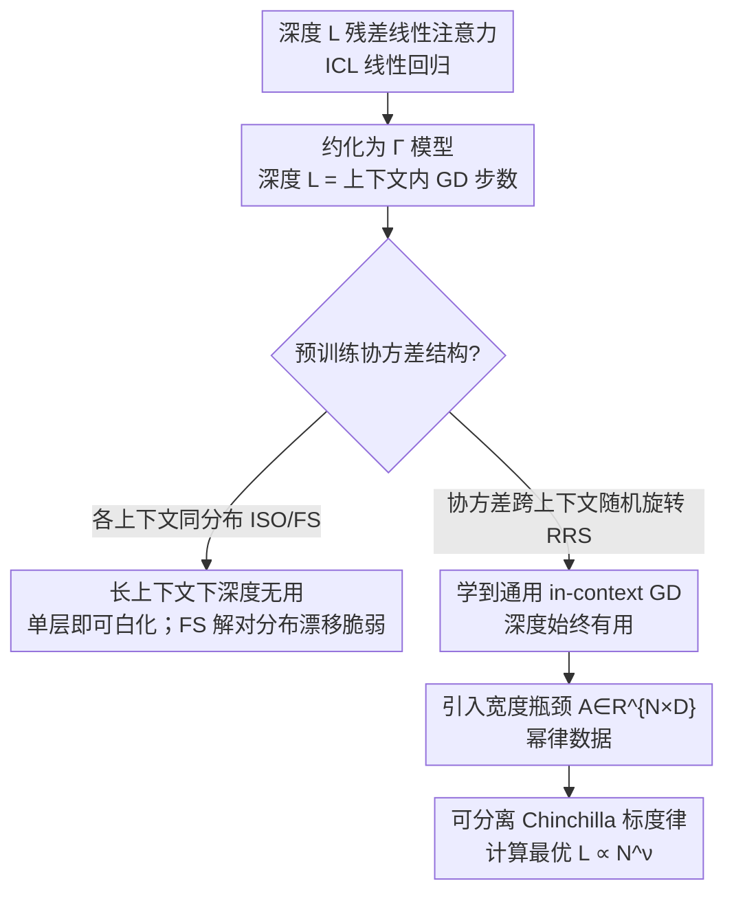

# Theory of Scaling Laws for In-Context Regression: Depth, Width, Context and Time

**会议**: ICLR 2026  
**OpenReview**: [https://openreview.net/forum?id=qA42mWsnbl](https://openreview.net/forum?id=qA42mWsnbl)  
**代码**: 待确认  
**领域**: 学习理论 / 上下文学习 / Scaling Law  
**关键词**: 上下文学习, 线性注意力, 神经标度律, 深度与宽度, 可解模型

## 一句话总结
本文给出一个深度线性自注意力做上下文线性回归（ICL）的**可解理论模型**，在数据维度、上下文长度、残差流宽度按比例放大的联合极限下精确求出风险的渐近行为，揭示出「**深度何时有用**」完全取决于预训练任务的协方差结构，并由此推导出同时包含宽度、深度、时间、上下文长度四项的 Chinchilla 式标度律与计算最优的 $L \propto N^\nu$ 形状。

## 研究背景与动机

**领域现状**：Transformer 的经验标度律（Kaplan、Chinchilla）告诉我们「模型越大越好」，工程上常用「宽度 $N$ 与深度 $L$ 按固定纵横比 $L/N$ 一起放大」的策略。但已有的标度律理论几乎只刻画了**宽度**（或等价的预训练数据 / 预训练时间）的作用，把模型抽象成一两层、靠一个随机投影到 $N$ 维来引入「有限模型尺寸」，本质上是宽度标度律，无法区分深度和宽度各自的贡献。

**现有痛点**：因此没有任何理论能回答「在固定算力预算下宽度和深度该怎么分配」，更不能判断「按固定纵横比放大」是不是计算最优。同时，上下文学习（ICL）这一 Transformer 的核心能力，其架构需求（到底需要多深）几乎没有可解的理论刻画。

**核心矛盾**：深度在 Transformer 里扮演的角色和宽度根本不同——深度提供的是「迭代计算 / 多步算法」的能力，而以往把模型压成单层的理论把这种能力直接抹掉了。要谈深度的价值，就必须有一个**真正带深度**的可解模型，并且要看深度的收益与任务统计结构如何耦合。

**本文目标**：分解为两个开放问题——Q1：是什么决定了最优 Transformer 形状与标度律？深度和宽度是否只通过总参数量起作用？Q2：ICL 任务的统计结构如何影响学到的解？

**切入角度**：作者构造一个深度 $L$ 的**残差线性注意力**模型来做 ICL 线性回归，并把它约化成一个只含单个矩阵 $\Gamma$ 的递归（looped）模型——这个约化模型的梯度流恰好对应「$L$ 步带步长的上下文内梯度下降（in-context GD）」，于是「深度 = 迭代步数」这件事被显式地写进了模型，使得整套动力学可以用随机矩阵理论精确求解。

**核心 idea**：用一个**深度线性注意力 + 三类协方差数据模型**的可解玩具模型，把 ICL 的标度律拆成宽度、深度、时间、上下文四个可分离的幂律项，并证明「深度是否有用」由协方差是否跨上下文变化决定。

## 方法详解

### 整体框架

最一般的模型是一个深度 $L$ 的残差线性注意力网络 $f$：把 $P$ 个有标签的上下文对 $\{(x_\mu,y_\mu)\}$ 和 $K$ 个待预测的查询点 $\{x^\star_\mu\}$ 拼成一个数据矩阵 $D$（查询点的目标被掩码置 0），每一层做的是**线性注意力**更新（用 $q_\mu\cdot k_\nu$ 而非 softmax）：

$$h^{\ell+1}_\mu = h^\ell_\mu + \frac{1}{LP}\sum_{\nu=1}^{P} M_{\mu\nu}\,\big((k^\ell_\nu)^\top q^\ell_\mu\big)\,v^\ell_\nu,\qquad f_\mu = w_o\cdot h^L_\mu,$$

其中 $q,k,v$ 由共享或逐层的权重 $W_q,W_k,W_v$ 线性生成，损失是查询点上的平方误差。

关键的一步是**约化**：沿用前人对线性回归 ICL 的最简重参数化（残差流把 $x$ 信息放在与 $w_y=w_o$ 正交的子空间），并先假设各层权重绑定（looped / universal transformer），整个模型就坍缩成一个 $D\times D$ 矩阵 $\Gamma$ 决定的预测器：

$$f(x^\star) = \frac{1}{LP}\,x_\star^\top \Gamma \sum_{\ell=0}^{L-1}\big(I - L^{-1}\hat\Sigma\Gamma\big)^\ell X^\top y,\qquad \hat\Sigma=\tfrac{1}{P}XX^\top.$$

这个表达式正是「$L$ 步、步长 $1/L$ 的预条件梯度下降」的展开，所以**深度 $L$ 直接等于上下文内 GD 的迭代步数**。整个分析框架就是：在 $P,K,B,D\to\infty$ 且 $P/D=\alpha,\ K/D=\kappa,\ B/D=\tau$ 成比例的联合极限下，对三类不同的协方差结构求 $\Gamma$ 的梯度流动力学，再读出风险的精确渐近与幂律。

### 关键设计

**1. Γ 约化模型：把「深度」翻译成「上下文内 GD 的迭代步数」**

直接分析多层注意力的权重动力学几乎不可解。本文借助 ICL 线性回归的最简重参数化，把整层注意力堆叠坍缩成单个矩阵 $\Gamma\equiv (w_o^\top W_v w_y)\,W_x^\top W_k^\top W_q W_x$，预测器写成 $f(x^\star)=\frac{1}{LP}x_\star^\top\Gamma\sum_{\ell=0}^{L-1}(I-L^{-1}\hat\Sigma\Gamma)^\ell X^\top y$。这个几何级数展开的物理含义非常清楚：它就是用预条件子 $\Gamma$ 做 $L$ 步、步长 $1/L$ 的梯度下降去拟合上下文里的回归问题。于是「网络有多深」被一一对应成「在上下文里迭代了几步 GD」。这一步是后续所有结论的支点——正因为深度被显式建模，才能谈深度何时有用，而不像以往单层理论那样把深度抹平成宽度。作者还证明，把各层 $\Gamma_\ell$ 解绑（非递归）、并把学习率按深度放大 $\eta=\eta_0 L$，在 RRS 无噪声设定下动力学与绑定的 looped 模型**完全等价**（Result 9），所以「绑定」只是为了可解，不影响结论。

**2. 三类协方差数据模型：让「深度是否有用」成为协方差结构的函数**

本文设计了三个泛化性递增的 ICL 数据分布，核心变量是**协方差是否跨上下文变化**。① ISO：各向同性 $x\sim\mathcal N(0,I)$、任务向量也各向同性；② FS（fixed structured）：所有上下文共享一个固定但结构化的协方差 $\langle xx^\top\rangle=\Sigma$、任务相关 $\langle\beta\beta^\top\rangle=\Omega$；③ RRS（randomly rotated structured）：每个上下文 $c$ 的协方差被一个 Haar 随机正交矩阵旋转 $\Sigma_c=O_c\Lambda O_c^\top$。设计 RRS 的动机很具体：在 ISO/FS 下模型可以把数据的白化变换 $\Sigma^{-1}$ 直接「背」进 $\Gamma$，单步（$L=1$）就能在长上下文 $\alpha\to\infty$ 下做到零损失，深度毫无用武之地；而随机旋转**禁止**模型把某个固定白化变换编码进 $\Gamma$，逼着它去学一个对任意协方差都管用的**通用上下文内 GD 算法**——这种算法天然需要多步迭代，于是深度即便在无限上下文下也持续带来增益。这就是全文最核心的「深度收益 ⇔ 任务异质性」的定性结论的来源。

**3. 宽度瓶颈 + DMFT，凑齐宽度/深度/时间/上下文四个标度维度**

要谈「计算最优形状」，光有深度还不够，必须引入**宽度**这个独立资源。作者通过一个投影矩阵 $A\in\mathbb R^{N\times D}$ 把输入降到 $N$ 维特征 $\tilde x=Ax$，使 $\Gamma(t)=\gamma(t)(AA^\top)$ 受限于秩 $N$，从而 $N$ 成为一个真正的瓶颈。在 RRS + 幂律特征下，驱动动力学的矩阵 $M=O(A^\top A)^2O^\top\hat\Sigma$ 是非对称的，普通随机矩阵手段失效，作者改用**动力学平均场理论（DMFT）**——一种源自自旋玻璃物理的技术——配合两点确定性等价（two-point deterministic equivalent，即两个不同自变量的预解式的关联函数）来求损失景观（Result 7）。这套机制最终把风险写成一个可显式计算的确定性函数，让宽度 $N$、深度 $L$、时间 $t$、上下文 $P$ 四个资源在同一个公式里各占一个可分离的幂律项，是把「玩具模型」升级成「能预测计算最优形状」的关键一步。

### 损失函数 / 训练策略

训练即在线（online）SGD/梯度流最小化查询点平方损失 $L=\langle \frac1K\sum_{\mu=P+1}^{P+K}(f_\mu-y_\mu)^2\rangle_D$。约化后等价于对标量 $\gamma(t)$（或矩阵 $\Gamma$）做梯度流，例如 ISO 设定下 $\Gamma(t)=\gamma(t)I$，$\frac{d}{dt}\gamma=-\partial_\gamma L(\gamma,\alpha)$；RRS 下 $\frac{d}{dt}\gamma=\mathrm{tr}[\Lambda^2\Omega(I-L^{-1}\gamma\Lambda)^{2L-1}]$。作者证明成功预训练只需总计 $Bt=\Theta(D)$ 个上下文、每个规模 $P=\Theta(D)$，比前人省了一个 $D$ 因子的算力与数据。

## 实验关键数据

实验为「理论 vs 数值模拟」的核验：用 $D=32$ 等小维度训练线性 / softmax Transformer，验证渐近公式预测的损失曲线与幂律指数。

### 主结果：三类协方差下深度的作用

| 数据设定 | 协方差是否跨上下文变 | $\alpha\to\infty$ 时深度是否有用 | 学到的解 |
|----------|----------------------|-------------------------------|----------|
| ISO（各向同性） | 否 | 否，$L=1$ 即最优（$\sigma^2=0$ 时零损失） | 标量 $\Gamma=\gamma I$ |
| FS（固定结构） | 否 | 否，$\Gamma=L\Sigma^{-1}$ 单步零损失 | 记住 $\Sigma^{-1}$ 白化，**对分布漂移脆弱** |
| RRS（随机旋转） | 是 | **是**，深度持续降损失 | 通用 in-context GD |

有限上下文 $\alpha$ 处可见明显的深浅差距：ISO 下 $\sigma^2=0$ 时 $L=1$ 损失饱和到 $L^\star=(1+\alpha)^{-2}$，而 $L\to\infty$ 时 $L^\star=[1-\alpha]_+$，二者在有限 $\alpha$ 下存在缺口——即**只有当上下文长度受限时，深度才在 ISO/FS 上有用**。

### Chinchilla 式标度律与计算最优形状

在 RRS + 幂律数据（源/容量指数 $\beta,\nu$，$\lambda_k\sim k^{-\nu}$）下，风险分解为四个可分离的幂律项（Result 8）：

$$L(t,N,L,P)\approx c_t\,t^{-\frac{\beta}{2+\beta}} + c_N\,N^{-\nu\beta} + c_L\,L^{-\beta} + c_P\,P^{-\nu\beta}.$$

由此在固定算力 $C=tP^2N^2L$ 下，计算最优的宽度与深度满足 $L\propto N^\nu$——纵横比由数据的谱衰减指数 $\nu$ 决定，而非一个普适常数。

| 标度维度 | 指数 | 含义 |
|----------|------|------|
| 预训练时间 $t$ | $\beta/(2+\beta)$ | 训练步数 |
| 宽度 $N$ | $\nu\beta$ | 特征维度瓶颈 |
| 深度 $L$ | $\beta$ | 迭代步数瓶颈 |
| 上下文 $P$ | $\nu\beta$ | 每上下文样本数 |

### 关键发现
- **深度的价值不是普适的，而是任务统计结构的函数**：协方差跨上下文同质（ISO/FS）则长上下文下深度无用、单层就能白化；协方差异质（RRS）则深度始终有用。这把「深度何时值得加」从经验问题变成了可判定的理论命题。
- **FS 解的脆弱性**：固定协方差预训练出的解是「记住了 $\Sigma^{-1}$」而非「学会通用算法」，一旦测试协方差 $\Sigma'=\exp(\theta S)\Sigma\exp(-\theta S)$ 偏离，OOD 损失 $L_{\text{OOD}}=\mathrm{tr}[\Omega'(I-\Sigma^{-1}\Sigma')^{L\top}\Sigma'(I-\Sigma^{-1}\Sigma')^L]$ 随 $\theta$ 单调上升，且各深度都崩。
- **只加宽或只加深都会撞瓶颈**：Figure 5 显示固定深度只放大宽度会被深度卡住、固定宽度只加深会被宽度卡住，只有 $N,L$ 同增才随算力单调下降。
- **结论对模型形式鲁棒**：解绑各层（Result 9）、对完整注意力权重 $\{W_k,W_q,W_v\}$ 做梯度流（Result 10，给出 $L(t,L)\sim c_t t^{-\frac{5\beta}{5\beta+2}}+c_L L^{-\beta}$），乃至 Adam 训练的 softmax 注意力 + 多头 + MLP，都重现「深度有益于 ICL」的同款现象。

## 亮点与洞察
- **「深度 = 上下文内 GD 步数」这个映射是全文的灵魂**：它把抽象的网络深度翻译成一个有物理意义的算法迭代次数，使得「深度何时有用」可以被精确推导，而不是靠经验拟合。这个视角可迁移到分析 looped / universal transformer 与「思考更久」的推理模型。
- **把 RRS（随机旋转协方差）作为「逼模型学通用算法」的开关**非常巧妙：通过禁止模型把固定白化变换背进权重，强行区分了「记忆 vs 算法」两种解，给出了一个干净的可解例子说明「任务多样性 → 泛化算法」。
- **首个同时含宽度与深度的可解神经标度律**：四项可分离幂律 + $L\propto N^\nu$ 的最优形状，为「该把算力花在加宽还是加深」给出了由数据谱决定的定量答案，对工程选型有直接启发。
- DMFT + 两点确定性等价处理非对称驱动矩阵 $M=O(A^\top A)^2O^\top\hat\Sigma$，是一套可复用的高维非对称动力学分析工具。

## 局限与展望
- **仅限线性回归 + 线性注意力**：作者明确指出最大局限是任务和注意力都是线性的，非线性函数逼近、非线性注意力下结论是否成立尚不清楚（softmax 实验只是现象级佐证，无理论）。
- **仅在线学习**：未刻画任务/上下文重复带来的过拟合效应。
- **协方差异质性仅限 RRS 一种构造**：真实世界的分布漂移、标签噪声变化、层级结构等更丰富的异质性未覆盖，深度的收益是否还成立未知。
- 未考虑大学习率效应、以及训练中动态增加 loop 步数以省算力等更贴近实践的训练策略——这些都被列为未来方向。

## 相关工作与启发
- **vs Lu et al. (2025)**：他们分析单层线性注意力 ICL 的渐近标度，本文把它推广到任意深度 $L$，并通过让 $P,K,B$ 都按 $D$ 线性放大，把收敛所需算力/数据再省一个 $D$ 因子；更关键是首次让深度成为独立的标度维度。
- **vs Lyu et al. (2025)**：他们给出 ICL 在时间和上下文长度上的标度律，但模型本质是一两层、用随机投影引入「尺寸」，更像宽度标度律；本文区分了宽度与深度各自的功能与瓶颈。
- **vs Gatmiry et al. (2024)**：他们指出解决多条件数 ICL 分布需要足够的残差流步数（真深度或注意力循环），本文用可解模型把「为什么需要深度」精确化为「协方差跨上下文变化 → 必须做多步通用 GD」。
- **vs µP / 深度残差缩放理论（Yang、Bordelon 等）**：那些工作建立了稳定的无限宽/深极限，但无法比较固定算力下宽与深的相对收益；本文正是补上「计算最优形状」这一缺口。

## 评分
- 新颖性: ⭐⭐⭐⭐⭐ 首个同时含宽度与深度的可解 ICL 神经标度律，「深度=上下文内 GD 步数」视角干净有力。
- 实验充分度: ⭐⭐⭐⭐ 理论与数值核验严密，并扩展到 softmax/多头/MLP，但维度小、纯合成数据。
- 写作质量: ⭐⭐⭐⭐ 结论用一系列 Result 清晰组织，物理直觉与公式兼顾，但 DMFT 部分门槛高。
- 价值: ⭐⭐⭐⭐⭐ 把「加宽还是加深」从经验问题变成由数据谱决定的可解命题，对标度律理论与架构选型都有启发。

<!-- RELATED:START -->

## 相关论文

- [\[ICLR 2026\] Critical Attention Scaling in Long-Context Transformers](critical_attention_scaling_in_long-context_transformers.md)
- [\[ICLR 2026\] Intrinsic Entropy of Context Length Scaling in LLMs](intrinsic_entropy_of_context_length_scaling_in_llms.md)
- [\[ICLR 2026\] Pretrain–Test Task Alignment Governs Generalization in In-Context Learning](pretraintest_task_alignment_governs_generalization_in_in-context_learning.md)
- [\[ICLR 2026\] On learning linear dynamical systems in context with attention layers](on_learning_linear_dynamical_systems_in_context_with_attention_layers.md)
- [\[ICLR 2026\] Scaling Laws and Spectra of Shallow Neural Networks in the Feature Learning Regime](scaling_laws_and_spectra_of_shallow_neural_networks_in_the_feature_learning_regi.md)

<!-- RELATED:END -->
