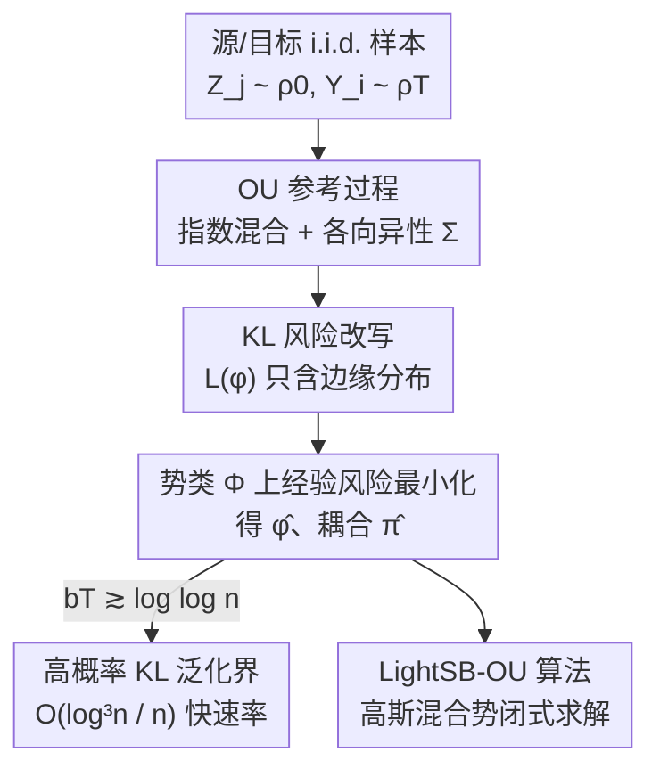

# Tight Bounds for Schrödinger Potential Estimation in Unpaired Data Translation

**会议**: ICLR 2026  
**OpenReview**: [https://openreview.net/forum?id=2I4a6qsesO](https://openreview.net/forum?id=2I4a6qsesO)  
**代码**: https://github.com/denvar15/Tight-Bounds-for-Schrodinger-Potential-Estimation-in-Unpaired-Data-Translation  
**领域**: 学习理论 / Schrödinger 桥 / 最优传输  
**关键词**: Schrödinger 桥, 经验风险最小化, 泛化误差界, Ornstein-Uhlenbeck 过程, 非配对数据翻译

## 一句话总结
本文给出了 Schrödinger 势（Schrödinger potential）经验风险最小化估计器的首个非渐近高概率泛化误差界：只用源分布和目标分布的 i.i.d. 样本，以 Ornstein-Uhlenbeck（OU）过程作参考动力学，可把估计耦合与最优耦合之间的 KL 散度控制在 $O(\log^3 n / n)$ 的快速率上，远优于此前 $O(1/\sqrt{n})$ 的结果。

## 研究背景与动机

**领域现状**：Schrödinger 桥（Schrödinger bridge）已成为生成建模与非配对数据翻译（尤其是 image-to-image translation）的有力框架。它把"将初始分布 $\rho_0$ 变成目标分布 $\rho_T$"建模为在所有满足边缘约束的耦合 $\pi$ 中，寻找与某个参考动力学在相对熵意义下最接近的那个，即 $\inf_{\pi\in\Pi(\rho_0,\rho_T)}\mathrm{KL}(\pi,\pi_0)$。在温和正则性下最优耦合具有 $\pi^*(x,y)=\nu^*_0(x)\,q_T(y\mid x)\,\nu^*_T(y)$ 的乘积形式，其中 $\nu^*_0,\nu^*_T$ 就是左右两个 Schrödinger 势。

**现有痛点**：绝大多数工作（Korotin et al. 2024、Rigollet & Stromme 2025、Pooladian & Niles-Weed 2025）都把参考过程取为布朗运动 $\mathrm{d}X_t=\sigma\,\mathrm{d}W_t$。这带来两个问题：其一，标量 $\sigma$ 无法刻画数据的各向异性（anisotropy）；其二，布朗运动下 $X_0$ 与 $X_T$ 的相关性只以缓慢的多项式速率衰减，在图像翻译里意味着输入图像对输出有"过强甚至负面"的影响，学习者只能被迫调大 $\sigma$ 或 $T$ 来缓解。

**核心矛盾**：更要命的是统计层面。已有理论只证明了**对偶目标函数本身**（或期望意义下的风险）以 $O(1/n)$ 或 $O(1/\sqrt{n})$ 收敛，却没有人给出**耦合层面** KL 散度 $\mathrm{KL}(\pi^*,\hat\pi)$ 的保证——目标函数收敛不等于估计出来的耦合/分布收敛。而一个简单的高斯实验（论文 Figure 1）显示，真实的样本效率其实比 $O(1/\sqrt{n})$ 乐观得多。理论和经验之间存在明显落差。

**本文目标**：(1) 选一个比布朗运动更"会忘记初值"的参考过程，从根上削弱输入对输出的过度影响；(2) 给出估计耦合与最优耦合之间 KL 散度的、紧的、非渐近的、高概率的上界。

**切入角度**：作者把参考过程换成 **Ornstein-Uhlenbeck 过程**。OU 过程具有指数混合（exponential mixing）性质——相关性以指数速率衰减，而且其转移核解析可算。指数混合恰好能为经验风险注入"曲率"，这正是证明快速率所缺的关键拼图。

**核心 idea**：用 OU 过程替换布朗运动作为 Schrödinger 桥的参考动力学，借助它的指数遍历性验证一个 Bernstein 型条件，从而把 Schrödinger 势 ERM 估计器的耦合 KL 误差锁死在近似线性维度依赖的快速率上。

## 方法详解

### 整体框架

本文研究的"方法"是一条**统计估计 + 理论分析**的链条，而非一个网络结构。给定源分布 $\rho_0$ 的样本 $Z_1,\dots,Z_N$ 与目标分布 $\rho_T$ 的样本 $Y_1,\dots,Y_n$（取 $N=n$），目标是估计右 Schrödinger 对数势 $\varphi^*=\log\nu^*_T$，进而得到耦合估计 $\hat\pi$。整条管线是：选定 OU 参考过程 → 把耦合搜索改写成对单个对数势 $\varphi$ 的风险最小化 → 在参数化势类 $\Phi$ 上做经验风险最小化得到 $\hat\varphi$ → 对得到的耦合 $\hat\pi$ 证明 KL 泛化界。

关键的代数化简在于：利用边缘约束 $\rho_0(x)=\int\pi_\varphi(x,y)\,\mathrm{d}y$ 可消掉左势，把耦合写成只含 $\varphi$ 的形式

$$\pi_\varphi(x,y)=\frac{\rho_0(x)\,q_T(y\mid x)\,e^{\varphi(y)}}{T_T[e^\varphi](x)},\qquad T_t[g](x)=\int g(y)\,q_t(y\mid x)\,\mathrm{d}y,$$

其中 $T_t$ 是 OU 算子。于是 $\mathrm{KL}(\pi^*,\pi_\varphi)=L(\varphi)-L(\varphi^*)$，而风险泛函

$$L(\varphi)=\mathbb{E}_{Z\sim\rho_0}\log T_T[e^\varphi](Z)-\mathbb{E}_{Y\sim\rho_T}\varphi(Y)$$

**只依赖两个边缘分布 $\rho_0,\rho_T$，完全不需要关于联合分布的任何假设**——这正是它适用于"非配对"翻译的根本原因。把期望换成经验均值即得 ERM 估计 $\hat\varphi\in\arg\min_{\varphi\in\Phi}\hat L(\varphi)$。

### 关键设计

**1. OU 参考过程：用指数混合换掉布朗运动的慢衰减**

针对"布朗运动忽略各向异性、且输入对输出影响衰减太慢"这一痛点，本文把参考动力学取为 OU 过程

$$\mathrm{d}X^0_t=b\,(m-X^0_t)\,\mathrm{d}t+\Sigma^{1/2}\,\mathrm{d}W_t,\qquad 0\le t\le T,$$

其中 $b>0$ 控制回归速率、$m$ 是均值回归水平、$\Sigma$ 是正定协方差矩阵。对应的 Schrödinger 桥过程在修正漂移 $\beta^*(t,x)=b(m-x)+\Sigma\nabla\log\nu^*_t(x)$ 下演化。相比布朗运动，OU 带来三重好处：协方差矩阵 $\Sigma$ 天然刻画各向异性；均值回归项让 $X_0$ 与 $X_T$ 的相关性**指数衰减**，从而抑制输入图像的过度影响；转移核 $q_t$ 是高斯 $\mathcal N(m_t(x),\Sigma_t)$（$m_t(x)=(1-e^{-bt})m+e^{-bt}x$，$\Sigma_t=(1-e^{-2bt})\Sigma/(2b)$），解析可算，利于实现。更关键的是，指数遍历性是后面证明快速率的"曲率来源"。

**2. 边缘风险泛函与 ERM 估计器：把耦合估计降维成单势优化**

针对"必须从非配对样本出发、不能假设联合分布"的约束，本文构造的风险 $L(\varphi)$ 只用到 $\rho_0$ 和 $\rho_T$ 的边缘信息。具体地，经验风险为

$$\hat L(\varphi)=\frac1n\sum_{j=1}^n\log T_T[e^\varphi](Z_j)-\frac1n\sum_{i=1}^n\varphi(Y_i),$$

它本质上是耦合 $\pi_\varphi$ 在数据上对数似然的（差一个常数的）形式，也可看作熵正则最优传输对偶目标在边缘惩罚 $\to 0$ 时的退化。最小化 $\hat L$ 得到对数势估计 $\hat\varphi$ 和耦合估计 $\hat\pi=\pi_{\hat\varphi}$。这种设计的好处是：把"在所有满足边缘约束的耦合中搜索"这一无穷维问题，化简为对单个标量函数 $\varphi$ 在有限维参数类上的优化，使得基于样本的估计与泛化分析成为可能。

**3. 紧的高概率 KL 泛化界（Theorem 1）：靠 Bernstein 型条件拿到快速率**

这是本文的核心贡献。在五条温和假设（OU 动力学、$\rho_0$ 有界支撑、$\rho_T$ 次高斯、对数势上下夹逼且 $T_{\inf}\varphi=0$ 消歧义、势类参数化光滑）下，定理给出：当 $bT\gtrsim\log\log n$ 时，以至少 $1-\delta$ 的概率，

$$\mathrm{KL}(\pi^*,\hat\pi)\lesssim\sqrt{\Lambda(n,\delta)\,\varepsilon\,\Big(1+\log\tfrac{(b\wedge L)(M+d)}{b\varepsilon}\Big)}+\Lambda(n,\delta)\Big(1+\log\tfrac{(b\wedge L)(M+d)}{b\varepsilon}\Big),$$

其中 $\varepsilon=\inf_{\varphi\in\Phi}\mathrm{KL}(\pi^*,\pi_\varphi)$ 是逼近误差，$\Lambda(n,\delta)\asymp\dfrac{(\log n+\log d+\log(1/\delta))\,Dd\log n}{n}$。当势类足够丰富使逼近误差 $\varepsilon\lesssim\Lambda(n,\delta)$ 时，上界化简为

$$\mathrm{KL}(\pi^*,\hat\pi)\lesssim\frac{(\log n+\log d+\log(1/\delta))\,Dd\log^2 n}{n}=O\!\left(\frac{\log^3 n}{n}\right).$$

这是已知**首个**对最优耦合与 ERM 估计器之间 KL 散度的非渐近高概率上界（此前 Korotin et al. 2024 只控制了期望超额风险）。它有两个亮点：在逼近误差小时收敛速率为 $O(\log^3 n/n)$，明显快于 $O(1/\sqrt n)$；维度依赖近似线性 $O(d\log d)$，适合高维场景。证明的灵魂是**验证一个 Bernstein 型条件**——OU 过程的指数遍历性使损失函数在 $bT\gtrsim\log\log n$ 时呈现"曲率"，从而把慢速率提升为快速率。作者特别指出，$T=0$ 时损失对 $\varphi$ 是线性的、毫无曲率，所以拿不到快速率；条件 $bT\gtrsim\log\log n$ 应理解为对 $bT$ 乘积（而非单独 $T$）的要求，故可取常见的 $T=1$ 而让 $b\gtrsim\log\log n$。

**4. LightSB-OU：高斯混合势 + OU 核的闭式实用算法**

为把理论落到实处，本文在 LightSB（Korotin et al. 2024）基础上改造出 LightSB-OU。它取一类对数势使得"调整势" $v_\theta(y)=e^{\varphi_\theta(y)-\|y\|^2/(2\sigma\sigma_1^2)}$ 恰好是 $K$ 分量高斯混合 $v_\theta(y)=\sum_{k=1}^K\alpha_k\,p(y;r_k,\sigma\sigma_1^2 S_k)$。这样做的关键收益是 OU 变换 $T_1[e^{\varphi_\theta}](x)$ 有**闭式表达** $c_\theta(x)=\sum_k e^{\ell_k(x)}$，无需数值积分，大幅节省算力；耦合与风险都随之化简。与标准 LightSB 的唯一区别是把布朗运动的高斯核 $q_1(y\mid x)$ 换成 OU 转移核。最终估计器即在这族高斯混合参数上最小化 $\hat L(\varphi_\theta)=\frac1N\sum_j\log c_\theta(Z_j)-\frac1n\sum_i\log v_\theta(Y_i)$。

### 损失函数 / 训练策略

训练目标就是上面的经验风险 $\hat L(\varphi_\theta)$，在高斯混合参数 $\theta=\{(\alpha_k,r_k,S_k)\}_{k=1}^K$ 上优化。实验中固定 $T=1$、$\Sigma=\sigma I_d$，超参 $\sigma$、混合分量数 $K$、学习率等通过网格搜索与 Bayesian 优化（optuna）选取。

## 实验关键数据

实验目的不是刷 SOTA，而是验证"换成 OU 参考过程能稳定提升生成质量"。

### 主实验：高斯混合（25 分量，K=30）

| 配置 | 指标 | LightSB | LightSB-OU |
|------|------|---------|-----------|
| Standard | Sliced $W_1$ | 0.260±0.016 | **0.156±0.018** |
| Standard | Mode Coverage | 24.2±0.4 | **25.0±0.0** |
| Irregular | Sliced $W_1$ | 0.525±0.024 | **0.214±0.028** |
| Irregular | MMD | 0.0024±0.0003 | **0.0004±0.0001** |
| Irregular | Mode Coverage | 21.8±0.4 | **25.0±0.0** |
| Anisotropic | Sliced $W_1$ | 0.255±0.017 | **0.206±0.024** |

在三种配置（标准网格、随机不规则网格、各向异性随机协方差）下，LightSB-OU 在 $W_1$、MMD、模式覆盖三项指标上全面优于 LightSB，且在不规则配置上提升最大（$W_1$ 从 0.525 降到 0.214），模式覆盖稳定打满 25/25。

### 单细胞数据：中间分布恢复（$W_1$，越低越好）

| 方法 | $W_1$ |
|------|-------|
| OT-CFM (Tong et al. 2024a) | 0.790±0.068 |
| [SF]²M-Exact (Tong et al. 2024b) | 0.793±0.066 |
| **LightSB-OU (ours)** | **0.810~0.812±0.020** |
| LightSB (Korotin et al. 2024) | 0.823±0.017 |
| DSB (De Bortoli et al. 2021) | 0.862±0.023 |
| DSBM (Shi et al. 2023) | 1.775±0.429 |

在预测细胞分布的中间时刻这一生物任务上（$i=1,2,3$ 三组、各重复 5 次），LightSB-OU 超过了基线 LightSB（0.823→0.810），并显著优于一众 Schrödinger 桥 / flow matching 求解器，与最好的 OT-CFM 处于可比区间。

### 非配对图像翻译：ALAE 隐空间（FFHQ Adult→Child）

在 1024×1024 FFHQ 上用 ALAE 自编码器做隐空间翻译，LightSB-OU 的 FID 为 **24.0**，略优于 LightSB 的 24.1；定性上肤色、脸型、眼镜等属性都得到良好保留。

### 关键发现
- 提升最显著的是**不规则/各向异性**配置——这正印证了 OU 的协方差矩阵 $\Sigma$ 与指数混合带来的"各向异性建模 + 削弱输入过度影响"两个理论优势。
- 模式覆盖从 21.8/24.4 提升到满分 25.0，说明 OU 参考过程缓解了模式坍塌。
- 图像 FID 几乎持平，作者也坦言本文重点是统计理论而非刷生成质量，实用增益更多体现在低维/中等维度的分布匹配任务上。

## 亮点与洞察
- **指数混合 ↔ 损失曲率 ↔ 快速率**，这条因果链非常漂亮：把"参考过程选什么"这个看似只关乎建模的选择，直接转化为能否验证 Bernstein 型条件、能否拿到 $O(\log^3 n/n)$ 的统计问题。$T=0$ 损失退化为线性、无曲率的观察一针见血。
- 把无穷维耦合搜索化简为只含边缘分布的单势风险 $L(\varphi)=\mathbb E\log T_T[e^\varphi]-\mathbb E\varphi$，使"非配对"在数学上变得自然——估计器只看两个边缘、不碰联合分布。
- 条件 $bT\gtrsim\log\log n$ 被解读为对乘积 $bT$ 而非时间 $T$ 的约束，这个细节让结论在常用的 $T=1$ 设定下依然可用，工程上很实在。
- 高斯混合势 + OU 核能闭式算转移积分，是"理论假设恰好也带来计算便利"的少见双赢。

## 局限与展望
- 假设较强：$\rho_0$ 需有界支撑、$\rho_T$ 需次高斯，作者明确把无界支撑与重尾目标分布的推广留作未来工作。
- 逼近误差 $\varepsilon$ 的量化被搁置：快速率成立的前提是 $\varepsilon\lesssim\Lambda(n,\delta)$，但要把 $\|\varphi-\varphi^*\|_{L^1}$ 等逼近量界住，需要 $\varphi^*$ 落在 Hölder/Sobolev 等光滑类，作者承认尚无此类结果。
- 实验偏"验证理论"而非"刷性能"：图像翻译 FID 仅持平，高维大规模生成上的实际优势还有待检验。
- 可拓展方向：把 OU 换成更一般的指数遍历参考过程，Theorem 1 是否仍成立是个开放问题。

## 相关工作与启发
- **vs Korotin et al. (2024, LightSB)**：他们用布朗运动作参考、只证明了期望超额风险的 $O(1/\sqrt n)$ 收敛；本文换 OU 参考、给出耦合 KL 的高概率界，并在逼近误差小时把速率提到 $O(\log^3 n/n)$，且实验直接在其算法上改造对比。
- **vs Rigollet & Stromme (2025)**：他们证明对偶目标 $\hat S$ 以 $O(1/n)$ 收敛到总体值，但没给耦合层面的 KL 保证；本文补上了"目标收敛 ⇏ 耦合收敛"这块缺口。
- **vs Pooladian & Niles-Weed (2025)**：他们的 plug-in 漂移估计在 $\tau\to T$ 时上界会爆炸（$1/(T-\tau)^{k+2}$），暴露了边界附近学习 Schrödinger 桥的困难；本文的 KL 界则在整个区间上一致成立。

## 评分
- 新颖性: ⭐⭐⭐⭐⭐ 首个最优耦合 vs ERM 的非渐近高概率 KL 界，OU 参考 + Bernstein 曲率的思路新颖。
- 实验充分度: ⭐⭐⭐⭐ 合成 + 单细胞 + 图像三类任务齐全，但图像生成增益有限，偏理论验证。
- 写作质量: ⭐⭐⭐⭐ 假设、定理、动机层层递进，理论叙述清晰；符号偏重。
- 价值: ⭐⭐⭐⭐ 为 Schrödinger 桥的统计理论补上关键一环，对生成建模的样本效率分析有指导意义。

<!-- RELATED:START -->

## 相关论文

- [\[ICLR 2026\] Mean Estimation from Coarse Data: Characterizations and Efficient Algorithms](mean_estimation_from_coarse_data_characterizations_and_efficient_algorithms.md)
- [\[ICLR 2026\] Information Estimation with Discrete Diffusion](information_estimation_with_discrete_diffusion.md)
- [\[ICLR 2026\] Quantitative Bounds for Length Generalization in Transformers](quantitative_bounds_for_length_generalization_in_transformers.md)
- [\[ICLR 2026\] Score-Based Density Estimation from Pairwise Comparisons](score-based_density_estimation_from_pairwise_comparisons.md)
- [\[ICLR 2026\] PAC-Bayes Bounds for Cumulative Loss in Continual Learning](pac-bayes_bounds_for_cumulative_loss_in_continual_learning.md)

<!-- RELATED:END -->
