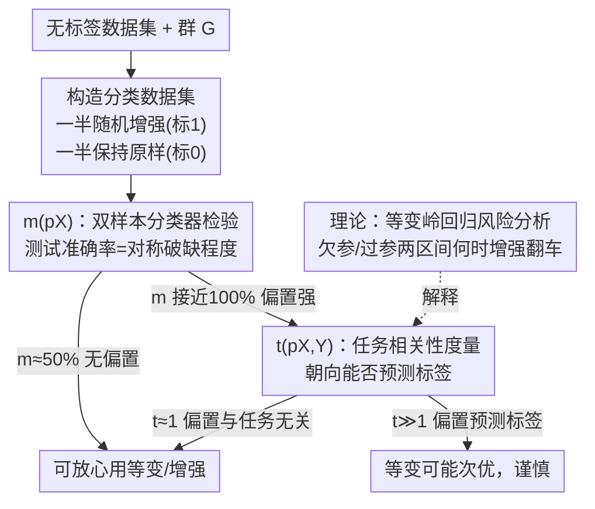

# To Augment or Not to Augment? Diagnosing Distributional Symmetry Breaking

**会议**: ICLR 2026  
**OpenReview**: [https://openreview.net/forum?id=ZTb4YmHD9n](https://openreview.net/forum?id=ZTb4YmHD9n)  
**领域**: 学习理论 / 等变学习 / 数据增强  
**关键词**: 分布对称性破缺, 数据增强, 等变网络, 双样本分类器检验, 岭回归泛化

## 一句话总结
本文提出用一个"双样本分类器检验"指标 $m(p_X)$ 来量化数据集的**分布对称性破缺**（即 $x$ 和它的变换 $gx$ 出现概率不相等的程度），并配上一个任务相关性指标 $t(p_{X,Y})$ 和一套岭回归理论，系统回答了"到底什么时候该用数据增强/等变方法、什么时候反而有害"，发现 QM9、ModelNet40 等常用点云基准其实高度"摆正过"，增强的收益强烈依赖数据集。

## 研究背景与动机

**领域现状**：等变网络和数据增强是把物理对称性（旋转、置换等）注入模型的两大主流手段。它们的理论优势——更好的样本效率与泛化——几乎都建立在一个假设上：真实标注函数 $f$ 是等变的（$f(gx)=gf(x)$）。

**现有痛点**：但在 $f$ 等变这个显式假设之外，还藏着一个**隐式假设**几乎从没被审视过——人们默认变换后的样本 $gx$ 在数据分布里出现得跟 $x$ 一样频繁，即 $p_X(x)\approx p_X(gx)$。现有几乎所有关于等变/增强收益的理论（Elesedy & Zaidi、Chen 等）都假设 $x$ 与 $gx$ 等概率出现。

**核心矛盾**：现实数据往往**不满足**这个假设。咖啡杯照片里把手大多在侧面、晶体结构按惯例摆正、QM9 分子被商业软件 CORINA 按 SMILES 默认对齐——这些都是 $p_X(x)\neq p_X(gx)$ 的"分布对称性破缺"（也叫对称性偏置）。一旦数据被"摆正过"，方向信息可能恰恰是有用的（经典例子：MNIST 里的"6"和"9"旋转对齐后几乎无法区分，但在自然朝向下很好分），这时强行旋转增强反而会丢掉判别信息。

**本文目标**：(1) 在缺乏领域先验的情况下，给出一个能**量化**任意数据集对称性破缺程度的实用指标；(2) 进一步判断这种偏置是否与具体任务标签相关；(3) 用理论说清楚分布不对称会怎样影响等变方法的最优性。

**切入角度**：对称性破缺本质是"原始分布 $p_X$ 和它对称化后的分布 $\bar p_X$ 之间有没有差距"。检测分布差距是机器学习里成熟的问题——可以用一个分类器去区分两组样本，区分得越准说明两个分布越远。

**核心 idea**：训练一个小分类器去区分"原始样本"与"随机增强后的样本"，**它在测试集上的准确率本身就是一个 0~1 之间、可解释的对称性破缺度量**——50% 表示完全对称（无偏置），接近 100% 表示完全摆正（canonicalized）。

## 方法详解

### 整体框架

整篇工作是一套"诊断 + 决策"的流程：拿到一个无标签数据集，先用指标 $m(p_X)$ 量化它在某个群 $G$ 下被摆正的程度；如果偏置明显，再用任务相关指标 $t(p_{X,Y})$ 判断这种偏置是否对当前任务有用；同时一套岭回归理论给出"什么参数区间下增强会从有益翻转为有害"的解释；最终汇成一张实用决策流程图（论文 Figure 6），告诉实践者面对一个数据集该不该上等变方法。

### 关键设计

**1. $m(p_X)$：用双样本分类器检验把"对称破缺"变成一个可解释的准确率**

要量化 $p_X$ 偏离对称的程度，最直接的想法是衡量它与"对称化分布" $\bar p_X(x):=\int_{g\in G}p_X(gx)\,dg$（即 $p_X$ 沿群轨道平均后的最近不变分布）之间的距离。前人 Chiu & Bloem-Reddy 用 MMD 配核来做，但核怎么选很棘手——比如对几何图结构的材料数据集，根本没有现成、能编码化学信息的核，且 MMD 的数值不直接可解释。本文改用机器学习里检测分布漂移的常用工具——**双样本分类器检验**：把核选择的难题转嫁给影响更小的"网络结构选择"。

具体见 Algorithm 1：把数据集对半分，一半每个样本随机采一个 $g\sim G$ 作用上去并打标签 1，另一半保持原样打标签 0，然后训一个二分类网络 NN，用它在留出测试集上的准确率作为指标：

$$m(p_X) := d_{\text{class}}(p_X,\bar p_X) = \mathbb{E}_{c\sim\text{Bern}(1/2)}\,\mathbb{E}_{x\sim p_c}\big[\mathbf{1}(\text{NN}(x)=c)\big].$$

它的可解释性极好：若 $p_X$ 本就群不变，则 $p_X=\bar p_X$，任何网络都无法区分，$m(p_X)\approx 1/2$；若数据被明显摆正，则 $m(p_X)\approx 1$。论文还给出有限群下的闭式直觉：单条轨道 $\{x_1,\dots,x_r\}$、概率 $p(x_i)=\theta_i$ 时，最优分类准确率为 $m(p_X)=1-\frac12\sum_{i=1}^r\min(\frac1r,\theta_i)$；对质量均匀分布在 $m$ 个模态上的情形为 $1-\frac{m}{2r}$，在 $m=r$（完全对称，$\frac12$）和 $m=1$（完全摆正，$1-\frac{1}{2r}$）之间平滑插值。对 $C_4$ 这种 4 阶群，完全摆正的理论上限就是 $1-\frac{1}{2\cdot4}=87.5\%$，与 MNIST 实测吻合。

**2. $t(p_{X,Y})$：判断对称偏置是否"对任务有用"，从而预测增强会不会伤害**

$m(p_X)$ 只回答"有没有偏置"，但偏置存不存在和"该不该增强"是两回事——只有当**偏置（如偏好朝向）与任务标签相关**时，增强才会因抹掉这部分朝向信息而真正伤害性能（MNIST 6/9 就是朝向预测标签的典型）。为此本文引入任务相关性度量 $t(p_{X,Y})$。

设 canonicalization 函数 $c:X\to G$ 表示样本落在轨道的哪个位置（即它的"朝向"）。由于数据增强会摧毁 $c(x)$ 里的信息，本文直接去测"朝向能多大程度预测标签"：用一个**随机初始化、不训练**的等变网络算出 $c(x)$，再去预测 $f(x)$，得到损失 $\mathcal L\big(c(x)\to f(x)\big)$；与把输入随机变换后（朝向信息被抹掉）的损失 $\mathcal L_{\text{rot}}=\mathcal L\big(c(gx)\to f(gx),\,g\sim G\big)$ 对比：

$$t(p_{X,Y}) := \frac{\mathcal L_{\text{rot}}}{\mathcal L}.$$

当 $\mathcal L\ll \mathcal L_{\text{rot}}$（朝向显著帮助预测）时 $t$ 很大，说明对称偏置对任务有用、此时增强很可能有害。实验里这个指标确实在"等变方法掉点"的任务（QM7b 偶极矩对齐、ModelNet40）上显著大于 1，而在等变无害的 QM9 标量属性上接近 1。

**3. 等变岭回归理论：解释增强为何会从"总有益"翻转成"有害"**

为了把直觉落到可证明的结论上，本文在非对称协方差下分析高维岭回归（NTK 空间里能近似神经网络行为）。设 $y_i=x_i^\top\beta+\varepsilon_i$，$x_i\sim\mathcal N(0,\Sigma)$，真值 $\beta$ 不变（$g\beta=\beta$），但**关键在于不假设** $g\Sigma g^\top=\Sigma$，即允许 $p_X$ 不对称。结论分两个区间：

- **欠参数化无岭区间**（$d<n-1$，$\lambda\to0$，Theorem 1）：数据增强**永远有益**，$\mathbb E[R_X(\hat\beta_{\text{inv}})]=\frac{\sigma^2 d_0}{n-d_0-1}\le \frac{\sigma^2 d}{n-d-1}=\mathbb E[R_X(\hat\beta)]$；但测试时对称化 $P_0\hat\beta$ 的风险却可能因不变/非不变特征的相关而被推到无穷大，$\mathbb E[R_X(P_0\hat\beta)]=\frac{\sigma^2}{n-d-1}\text{Tr}(\Sigma^{-1}\Sigma_{\text{inv}})$，只有 $p_X$ 不变时才取等。

- **过参数化区间**（$d>n$，Theorem 2）：用一个含 $d_c$ 个"强耦合模" $\Sigma=(\sigma_c-\sigma_w)\sum_k u_k u_k^\top+\sigma_w I$ 的极简模型（$u_k$ 是 $V_0$ 与 $V_\perp$ 基的完美叠加），在强相关极限 $\sigma_w\to0$ 下证明：当**耦合模数远小于环境维度**时，数据增强**保证更差**（方差更大）。直觉是：一个非不变特征若与真值用到的不变特征强相关，本身是有用的，而增强会把这种非不变特征变得不可用。一个反直觉的副产物是——即便数据完全对称，过参数化下增强也可能在插值阈值附近让风险爆炸。

### 一个完整示例：QM9 为什么"增强不伤、反而有用"

拿到 QM9（13.3 万个小分子，旋转群 SO(3)）：第一步算 $m(p_X)$，全局得到 $98.3\%$，说明分子被高度摆正（成因是商业软件 CORINA 按 SMILES 默认对齐，是一种用户自定义的 canonicalization）。按朴素直觉，这么强的偏置下旋转增强应该会因分布漂移而掉点。但实验里（Table 1）训练增强对几乎所有属性都**不伤甚至有帮助**——这就需要第二步 $t(p_{X,Y})$：在 $C_v$、$|\vec\mu|$、$\Delta\varepsilon$ 等属性上 $t$ 都接近 1（如 $C_v$ 为 1.05），说明朝向偏置**与这些任务标签几乎无关**，抹掉朝向并不损失任务信息。再加上局部性实验（Local QM9 的 $m$ 只有 $65.9\%$，远低于全局 $98.3\%$）表明等变方法靠的是**局部等变特征**——于是"高偏置却增强无害"的反常现象得到自洽解释。对照之下 ModelNet40 的 $t\approx1.41>1$、QM7b 偶极矩对齐 $t\approx3.54$，这些任务的朝向确实预测标签，增强就真的掉点。

## 实验关键数据

### 主实验

不同增强/等变设置在各数据集上的对比（节选 Table 1，TT=训练+测试增强，TF=仅训练，FF=不增强，FT=仅测试；↓越低越好，↑越高越好）：

| 设置 / 数据集 | QM7b $\vec\mu$ (↓) | QM9 $C_v$ (↓) | MNIST (↑) | ModelNet40 (↑) |
|---|---|---|---|---|
| Equivariant | **41** | 110 | 98.0 | 60.06 |
| TT（训练+测试增强） | 53 | 147 | 97.6 | 62.39 |
| TF（仅训练增强） | 52 | 146 | 97.6 | 61.97 |
| FF（不增强） | 100 | 143 | **98.8** | **78.14** |
| FT（仅测试增强） | 161 | 210 | 40.7 | 16.91 |
| $m(p_X)$ (%) | 89.66 | 98.3 | 87.5(理论) | — |

关键对比：ModelNet40 上 FF（78.14%）远高于带训练增强的 TF（61.97%），增强严重伤害；而 QM9 上 TF（146）与 FF（143）几乎持平，增强基本无害。

### 任务相关性度量分析

$t(p_{X,Y})$（Table 2，预测 $f(x)$ from $c(x)$，对比随机基线）：

| 数据集 | $\mathcal L$ | $\mathcal L_{\text{rot}}$ | $t=\mathcal L_{\text{rot}}/\mathcal L$ |
|---|---|---|---|
| QM7b 偶极对齐 µ | 0.128 | 0.39 | **3.54** |
| QM7b 原始 µ | 0.38 | 0.39 | 1.03 |
| ModelNet | 12.5 | 8.9 | **1.41** |
| QM9 $C_v$ | 3.07 | 3.22 | 1.05 |
| QM9 $|\vec\mu|$ | 1.14 | 1.17 | 1.02 |

$t$ 越大的任务，等变/增强越容易掉点，与 Table 1 完全一致。

### 关键发现
- **常用点云基准其实高度"摆正过"**：QM9（98.3%）、ModelNet40、OC20、QM7b 的 $m(p_X)$ 都很高，构成一种被长期忽视的严重数据集偏置；连 LLM 晶体生成数据集（DistilBERT 头）置换偏置都测出 $m=95\%$。
- **增强是否有害强烈依赖任务**：同样高 $m(p_X)$，ModelNet40/MNIST 上训练增强掉点，QM9/QM7b 上却无害甚至有益——单看 $m$ 不够，必须配 $t$。
- **局部 vs 全局**：QM9 局部 $m$（65.9%）远低于全局（98.3%），随 patch 数 $N$ 从 10→1024 单调升到 96.6%，支持"等变方法在高度摆正数据上仍有效是靠局部等变性"的解释。
- **指标对网络规模不敏感**（Appendix D.5），说明 $m(p_X)$ 作为实用工具足够稳健。

## 亮点与洞察
- **把"分布对称破缺"这个抽象概念变成一个谁都能跑的准确率指标**：不需要领域先验、不需要选核，训个小分类器看测试准确率即可，且 50%/100% 两端有清晰物理含义，实践者可直接用来体检自己的数据集。
- **拆出 $m$（有没有偏置）和 $t$（偏置有没有用）两层**很关键——它解释了"高偏置却增强无害"这个反直觉现象，避免了"看到偏置就一刀切禁用增强"的误判。
- **理论上的反直觉结论**：欠参数化下增强永远有益、但测试时对称化可能风险爆炸；过参数化下即便数据完全对称增强也可能在插值阈值附近翻车——提醒大家"等变=更好"是有前提的。
- 决策流程图（Figure 6）把 $m$、$t$、是否要 OOD 泛化串成一张可操作的判断树，是很好的工程落地物。

## 局限与展望
- **缺一个明确阈值**：作者承认目前只能说"$t$ 越大越可能有害"，还没给出"$t$ 超过多少就别用等变"的硬阈值，未来想严格刻画。
- **$m(p_X)$ 对无限群（如 SO(3)）只是 $\le1$ 的下界**，高 $m$ 不等于完全摆正，只能说"有清晰稀疏的偏好朝向"，解读需谨慎。
- **理论用线性岭回归 + NTK 近似**，与真实深层等变网络仍有差距，极简协方差模型（单一耦合强度 $\sigma_w$）也比较理想化。
- $t(p_{X,Y})$ 依赖一个随机初始化等变网络作为 canonicalization 估计，其稳定性与对不同群的适配在正文里只是简述（细节在附录），实际使用时的敏感性值得进一步验证。

## 相关工作与启发
- **vs Chiu & Bloem-Reddy（MMD 核检验）**: 他们用带核的 MMD 做分布对称性的非参数假设检验，本文改用双样本分类器检验，把"选核"这个对几何/化学数据很难的环节，换成影响更小的"选网络结构"，且输出的准确率天然可解释。
- **vs Elesedy & Zaidi / Chen 等（等变收益理论）**: 这些工作都假设 $p_X$ 不变并证明对称化/增强降低风险，本文正是放开"$p_X$ 不变"这一假设，证明在非对称协方差下增强可能有害，是对该理论谱系的关键补充。
- **vs 功能性对称破缺（Wang 等）**: 那一脉关注 $f(gx)\neq gf(x)$（映射本身不完全等变，如材料相变），本文聚焦的是**分布**对称破缺 $p(x)\neq p(gx)$（标注函数仍等变，只是数据被摆正），二者正交，本文把后者从"被忽视"推到"可量化、可决策"。

## 评分
- 新颖性: ⭐⭐⭐⭐⭐ 把长期被忽视的"分布对称破缺"做成可量化指标 + 任务相关度 + 配套理论，视角新且自洽。
- 实验充分度: ⭐⭐⭐⭐ 覆盖 MNIST/点云/分子/材料/LLM 多域，主实验+消融+局部性齐全；但都非 SOTA 设置、缺更大规模等变模型验证。
- 写作质量: ⭐⭐⭐⭐ 直觉、理论、实验三线交织清晰，决策流程图很友好；理论部分较密集需要附录辅助。
- 价值: ⭐⭐⭐⭐⭐ 给"该不该用数据增强/等变"提供了可操作的诊断工具，对几何深度学习与材料/分子 ML 社区有直接实践意义。

<!-- RELATED:START -->

## 相关论文

- [\[ICLR 2026\] Achieving Approximate Symmetry Is Exponentially Easier than Exact Symmetry](achieving_approximate_symmetry_is_exponentially_easier_than_exact_symmetry.md)
- [\[ICLR 2026\] Reducing Symmetry Increase in Equivariant Neural Networks](reducing_symmetry_increase_in_equivariant_neural_networks.md)
- [\[ICLR 2026\] The Softmax Bottleneck Does Not Limit the Probabilities of the Most Likely Tokens](the_softmax_bottleneck_does_not_limit_the_probabilities_of_the_most_likely_token.md)
- [\[ICLR 2026\] On Universality of Deep Equivariant Networks](on_universality_of_deep_equivariant_networks.md)
- [\[ICLR 2026\] Pseudo-Non-Linear Data Augmentation: A Constrained Energy Minimization Viewpoint](pseudo-non-linear_data_augmentation_a_constrained_energy_minimization_viewpoint.md)

<!-- RELATED:END -->
