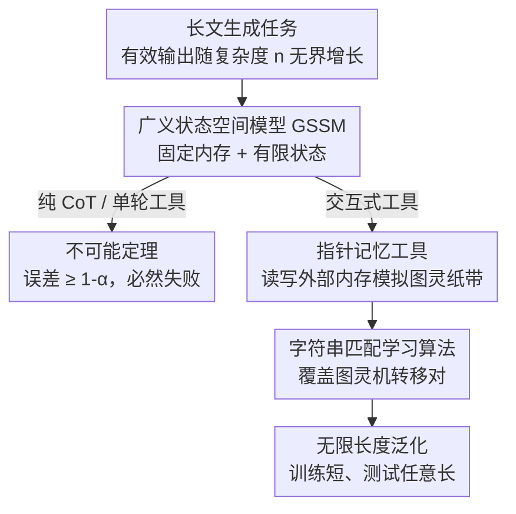

# To Infinity and Beyond: Tool-Use Unlocks Length Generalization in State Space Models

**会议**: ICLR 2026  
**OpenReview**: [https://openreview.net/forum?id=sSfep4udCb](https://openreview.net/forum?id=sSfep4udCb)  
**代码**: 无  
**领域**: 学习理论 / 状态空间模型 / 长度泛化  
**关键词**: 状态空间模型, 长度泛化, 工具使用, ReAct, 长文生成

## 一句话总结
本文先从理论上证明：固定内存的状态空间模型（SSM）无论生成多长的思维链都无法解决"真正的长文生成任务"，但只要让它**交互式地调用外部记忆工具**，就能把任意可计算的长文任务做到**无限长度泛化**——在 5 位数加法上训练、却能正确做 1000 位数加法。

## 研究背景与动机
**领域现状**：Transformer 因为注意力机制带来 $O(L^2)$ 计算和 $O(L)$ 内存开销，在长上下文、长链推理（CoT）场景代价高昂。为此社区提出了 Mamba、DeltaNet、GatedDeltaNet 等状态空间模型（SSM）和线性 Transformer，它们的卖点是**固定大小的内存 + 随长度线性增长的计算**，在很多任务上能逼近 Transformer 的性能而推理更便宜。

**现有痛点**：但已有工作发现 SSM 在需要"记住长序列"的任务（in-context learning、长序列记忆）上明显吃亏。正因如此，SSM 至今没能真正取代 Transformer。问题是：这种缺陷到底是工程问题，还是架构的根本极限？

**核心矛盾**：SSM 的"固定内存"既是效率优势，也是表达力的天花板。本文把这一点形式化为**长文生成任务（long-form generation）**——随着问题复杂度 $n$ 增大，有效输出空间的大小（覆盖 $\alpha$ 概率质量的最小支撑集 $\mathrm{supp}_\alpha$）会无界增长的任务（如多位数加法、排序、改 bug）。直觉上，一个状态只有有限种取值的模型，无法在输出端区分出无限多种答案。这与 Transformer 形成对比：Transformer 借助 CoT 拥有随长度增长的"无界内存"，原则上能解任意可计算问题。

**本文目标**：(1) 严格刻画 SSM 在长文生成上的固有极限；(2) 找到一条不牺牲线性效率、又能突破极限的路径。

**切入角度**：LLM 现在普遍被当作能调用外部工具的 agent（查资料、读写文件）。如果允许 SSM **交互式**地读写一块外部记忆，就等于给它接上了一块**实际无界的外部内存**——内部状态有限，但可以反复把信息吐到外部、再读回来。

**核心 idea**：用"交互式工具调用"替代"无限增大的内部内存"来解决 SSM 的长度泛化问题——并证明**交互式**（而非单轮）工具使用既是必要也是充分的。

## 方法详解

### 整体框架
本文是一篇以理论为骨架、实验为佐证的工作。整体逻辑是：先把"长文生成任务"和"广义状态空间模型（GSSM）"严格定义出来，然后在三种工具使用设定下（纯 CoT / 单轮工具 / 交互式工具）分别给出不可能定理与可能性定理，最后用 Mamba 等真实模型在算术、推理、编程任务上验证理论预测。

核心对象是 **GSSM**：一个由有限状态集 $S$、初始状态 $s_0$、更新规则 $u: S\times\Sigma\to S$ 和输出规则 $r: S\to\Delta(\Sigma)$ 定义的（可含随机性的）函数。任何"内存大小不随序列长度增长"的模型——LSTM、线性 Transformer、Mamba、滑动窗口注意力的 Transformer——都落在这个定义里；而标准 Transformer 和混合模型因为内存随长度增长，**不是** GSSM。

证明的关键转折在于：固定内存模型自己解不了长文任务（负面结论），但**把外部记忆工具接进 ReAct 式交互循环后**，GSSM 可以用外部记忆模拟图灵机的纸带，从而执行任意可计算算法并做到无限长度泛化（正面结论）。下面的框架图展示了这条从"光靠自己→借外部记忆"的逻辑主线。

### 关键设计

**1. 长文生成任务 + GSSM：把"固定内存解不了什么"讲成定理**

本文先把"什么任务对 SSM 致命"形式化。给定输入分布序列 $\{D_n\}$ 和真值函数 $f$，定义**长文生成任务**：当复杂度 $n\to\infty$ 时，输出分布的最小支撑集 $\mathrm{supp}_\alpha(f(D_n))$ 单调递增且趋于无穷——也就是"答案的有效种类数随难度无界增长"。多位数加法、排序、改 $n$ 行代码的 bug 都满足这一条。

有了这个定义，**定理 2.1（不可能结论）**就很直白：对任何在**纯 CoT 或单轮工具**设定下运行的 GSSM $h$，存在复杂度 $n_0$，使得对所有 $n\ge n_0$ 都有 $\mathrm{err}_n(h)\ge 1-\alpha$。证明的核心是一个鸽笼式论证：模型的最终输出是有限内存状态的函数，状态种类有限，而需要区分的输出种类无界增长，所以总有海量输入会被映射到错误答案——哪怕允许生成任意长的思维链也救不回来，因为 CoT 本身也要被压回那个有限状态。这一条直接戳破了 SSM"线性效率"的卖点：效率是用表达力换来的。

**2. 指针式外部记忆工具：把交互式工具调用接成图灵机纸带**

既然内部内存是瓶颈，那就把内存搬到外面。本文遵循 **ReAct** 框架，让模型交错生成三类 token：**思考（thought）**、**输出（output，最终答案流）**、**命令（command，发给工具预言机 $O$ 并收到 observation）**。三种工具设定的差别只在命令的用法：纯 CoT 不能发命令；单轮工具只能发一条命令；**交互式工具**可以无限次、自由穿插地发命令。

关键工具是一块带**指针**的外部记忆：可以初始化指针、把指针左移/右移一格、读取指针下的 token。**定理 2.2（可能性结论）**证明：存在这样一个记忆工具和一个简单学习算法，对任意"计算上可解（存在图灵机 $T$ 计算 $f$）"的长文任务，都能构造训练轨迹使该算法在交互设定下达到长度泛化。证明思路是用外部记忆当图灵机的纸带、用指针当读写头、用思考 token 跟踪图灵机的内部状态、用命令读写符号——于是 GSSM 在交互循环里就**等价模拟了一台图灵机**，而图灵机能算的它都能算。注意正面结论**只对交互式成立**：单轮工具仍受定理 2.1 约束，因为一次性把所有信息读进来又会撑爆有限状态。这就是标题"交互式工具解锁长度泛化"的全部含义。

**3. 字符串匹配学习算法 + 局部化轨迹：为什么"训练短"能"测试任意长"**

光有表达力还不够，得证明能**学**出来并**外推**。本文分析的学习算法刻意简单：它本质上做**字符串匹配**（类似 n-gram），把训练轨迹里见过的"（状态，符号）→ 动作"片段记下来，遇到新输入就拼接复用。长度泛化之所以成立，是因为图灵机的转移函数只对**有限多对**（状态，符号）有定义；只要训练复杂度 $n_0$ 足够大，这有限多对几乎全都会在训练数据里出现过。于是在更大的 $n$ 上，模型遇到的每一步局部转移都是它见过的，于是能一步步正确执行下去——样本复杂度为 $m = n_0 M\log(M/\delta)/\epsilon$，其中 $M$ 是依赖图灵机的常数。这把"长度泛化"从一个看似很强的要求，化归成了"覆盖有限个局部转移规则"这个可达成的目标，也解释了为何 5 位数加法的轨迹足以支撑 1000 位数加法。

### 损失函数 / 训练策略
实验侧用标准的**下一 token 预测 + teacher-forcing**训练。关键技巧是**掩码**：把输入问题和工具返回的 observation（读操作的结果）从损失里屏蔽掉——因为这些是环境/工具生成的，不该由模型负责预测，模型只需学会生成思考、命令和最终输出。训练数据用合成轨迹精确模拟目标算法（长加法、长乘法等）的逐步工具交互；编程任务则直接从真实 SWE coding agent 收集轨迹。

## 实验关键数据

### 主实验
合成任务上，记号 $n\to m(p\%)$ 表示"训练长度 $n$、在长度 $m$ 上达到准确率 $p$"（取满足 $p\ge 5\%$ 的最大 $m$）。SSM/RNN 全面碾压 Transformer 的长度外推。

| 模型 | 加法 $n\times 1$ | 乘法 $n\times 2$ | 逻辑图 | 汉诺塔 |
|------|------|------|------|------|
| Mamba | 10→1K (100%) | 10→1K (100%) | 10→1K (98%) | 8→12 (49%) |
| LSTM | 10→500 (100%) | 10→100 (100%) | 10→1K (100%) | 8→8 (100%) |
| GRU | 10→500 (100%) | 10→100 (100%) | 10→1K (100%) | 8→8 (100%) |
| Pythia (Transformer) | 10→20 (79%) | 10→14 (12%) | 10→1K (5%) | 8→8 (100%) |
| Mistral (滑窗) | 10→13 (25%) | 10→20 (33%) | 10→500 (9%) | 8→8 (100%) |

加法任务上 Mamba/LSTM 在 5 位数轨迹上训练即可**完美**做 1000 位数加法（图 2），而 Transformer 完全无法外推。编程任务（改 bug，最多 16 个函数、8K 上下文训练）中，小代码库上 Transformer（蒸馏设定 >90% 通过率）甚至优于 Mamba；但代码库变大、超出训练分布后，**只有用交互式 agent（agent 2/3）轨迹训练的 Mamba 能保持高准确率**，单轮设定（agent 1）则崩溃——完全印证理论。

### 消融实验
| 配置 | 现象 | 说明 |
|------|------|------|
| 交互式工具（完整） | 完美外推到 1000 位 | 理论预测的成立设定 |
| 无 CoT / 无工具 | 几乎无长度泛化 | 退化到纯 GSSM，受定理 2.1 约束 |
| 单轮工具 | 几乎无长度泛化 | 一次性读入仍撑爆有限内存 |
| Hybrid-Mamba | 与 Mamba 相当 | 混入注意力层不破坏外推 |
| RMT（记忆 token + 段级递归） | 无有意义外推 | 仅加可学习记忆 token 不够 |
| 任务混合（乘法+加法辅助） | 中等预算下显著提升 | 250 步轻微、500 步明显、800 步全收敛 |

### 关键发现
- **交互性是分水岭**：纯 CoT、单轮工具都几乎不外推，唯有交互式工具能解锁无限长度泛化——这正是不可能定理（单轮）与可能性定理（交互）的实验对照。
- **架构差异真实存在**：在工具增强设定下，SSM/RNN（Mamba/LSTM/GRU）的长度外推远胜 Transformer；作者推测 Transformer 受位置编码外推困扰，而递归模型的"固定状态 + 外部记忆"反而更稳。
- **汉诺塔最难**：因为其输出长度随 $n$ **指数**增长，Mamba 仅从 8 盘外推到 12 盘（49%），是各任务里最弱的，说明输出长度的增长速率会影响外推难度。
- **任务混合在低预算下有价值**：共享计算结构的辅助任务（加法）能在训练步数受限时帮主任务（乘法）外推得更远，但训练充分后优势消失。

## 亮点与洞察
- **把架构争论从"谁更强"重构为"怎么用"**：本文最"啊哈"的地方是颠覆叙事——SSM 的固定内存确实是硬伤（有定理为证），但一旦放到 agentic / 工具调用场景，这个硬伤被外部记忆补齐，SSM 反而因为线性效率成为比 Transformer 更优的 agent 骨干。
- **图灵机模拟当桥梁**：用"指针记忆 = 图灵纸带、思考 token = 机器状态"把抽象的"可计算性"翻译成可训练的轨迹格式，这套构造性证明既给了理论上界，又直接指导了合成数据怎么造。
- **可迁移的训练配方**：损失掩码（屏蔽 observation 和输入）+ 局部化轨迹（让每步只依赖局部上下文）是让任何递归模型在工具循环里学会长度泛化的通用技巧，可直接搬到其他算法执行任务。
- **理论预测被真实编程任务验证**：从合成加法到真实 SWE-agent 蒸馏轨迹，交互 vs 单轮的分界始终成立，说明结论不是合成任务的人工产物。

## 局限与展望
- **分析的学习算法"不标准"**：定理 2.2 用的是字符串匹配式算法（类 n-gram），不是真实的 SGD 训练；作者承认对更自然的算法（如 RNN 上的梯度下降）能否得到同样结论尚未证明，只是"相信可以、但分析会复杂得多"。
- **训练数据需要任务专属轨迹**：正面结论依赖"为每个任务精心构造的工具使用轨迹"，现实中很多任务的最优算法未知或难以脚本化（编程任务因此改用真实 agent 蒸馏），通用性打了折扣。
- **输出指数增长的任务仍吃力**：汉诺塔的弱外推暴露出当输出长度随复杂度指数增长时，即便有外部记忆，模型也难以稳定执行——理论保证的是"可达成"，没保证训练样本量在指数输出下仍可控。
- **改进方向**：把交互式工具循环和真实梯度训练的长度泛化打通、研究自动从任务中诱导工具轨迹（而非人工脚本）、以及扩展到输出超线性增长的任务，都是自然的下一步。

## 相关工作与启发
- **vs 用 CoT 改 Transformer 长度泛化（Abbe et al. 2024 / Hou et al. 2024）**：他们用"局部化"或"编码图灵机操作"的 CoT 帮 **Transformer** 外推；本文把同样的"局部化 + 模拟图灵机"思路用在 **SSM** 上，并额外刻画了**交互式工具**这一变量，区别在于本文的瓶颈来自固定内存而非位置编码。
- **vs 神经图灵机 / 外部栈增强 LSTM（Graves et al. 2014 / Joulin & Mikolov 2015）**：前人也想让网络模拟图灵机、给 RNN 加外部记忆，但多停留在端到端可微的记忆模块且未广泛落地；本文用**离散的 ReAct 式工具调用 + 字符串匹配学习**重新表述，既给出可证明的长度泛化，又对接了现代 agent 范式。
- **vs Mamba 原生长度泛化研究（Gu & Dao 2023 / Ben-Kish et al. 2024）**：他们改模型或训练管线来提升 SSM 的外推；本文不改架构，而是改**任务交互方式**（接外部记忆工具），并证明这能达到**完美**（而非"更好"）的长度泛化。

## 评分
- 新颖性: ⭐⭐⭐⭐⭐ 把"SSM 固定内存极限"与"交互式工具解锁无限外推"对照成一对不可能/可能定理，视角新颖。
- 实验充分度: ⭐⭐⭐⭐ 算术、逻辑图、汉诺塔、真实编程、长上下文 NL 多任务覆盖，且有交互 vs 单轮、混合模型等消融，仅汉诺塔规模偏小。
- 写作质量: ⭐⭐⭐⭐⭐ 定义—定理—实验逻辑闭环，图 1/图 2 把抽象工具轨迹讲得很直观。
- 价值: ⭐⭐⭐⭐⭐ 为"SSM 作为高效 agent 骨干"提供理论与实证支撑，对长链推理时代的架构选择有直接指导意义。

<!-- RELATED:START -->

## 相关论文

- [\[ICLR 2026\] On the Expressiveness of State Space Models via Temporal Logics](on_the_expressiveness_of_state_space_models_via_temporal_logics.md)
- [\[ICLR 2026\] Quantitative Bounds for Length Generalization in Transformers](quantitative_bounds_for_length_generalization_in_transformers.md)
- [\[ICLR 2026\] A Theoretical Analysis of Mamba's Training Dynamics: Filtering Relevant Features for Generalization in State Space Models](a_theoretical_analysis_of_mambas_training_dynamics_filtering_relevant_features_f.md)
- [\[ICLR 2026\] Quotient-Space Diffusion Models](quotient-space_diffusion_models.md)
- [\[ICLR 2026\] Provable Separations between Memorization and Generalization in Diffusion Models](provable_separations_between_memorization_and_generalization_in_diffusion_models.md)

<!-- RELATED:END -->
