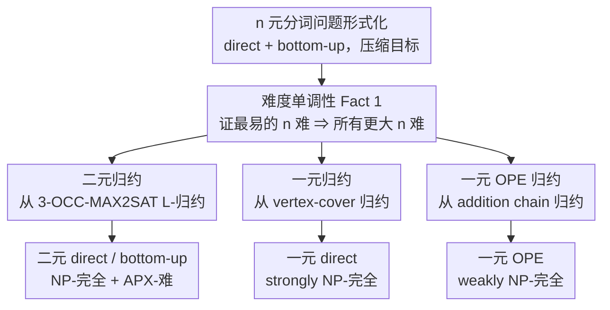

# Tokenisation over Bounded Alphabets is Hard

**会议**: ICLR 2026  
**OpenReview**: [https://openreview.net/forum?id=Xhf9YqwlM4](https://openreview.net/forum?id=Xhf9YqwlM4)  
**代码**: 无  
**领域**: 学习理论 / 计算复杂度  
**关键词**: 分词, 计算复杂度, NP-完全, APX-难, 不可近似性

## 一句话总结
此前已证明"找最优分词器"是 NP-完全的，但这些证明都假设字母表无限大（不现实）；本文把分词限制到**有限甚至二元、一元字母表**上，证明它仍然 NP-完全、而且 APX-难（除非 P=NP 否则不存在多项式时间近似方案），说明 BPE / UnigramLM 之所以是启发式算法是有理论必然性的。

## 研究背景与动机
**领域现状**：分词（tokenisation）是几乎所有 NLP 流水线的第一步，把字符串 $c$ 切成子词序列 $s$，语言模型在子词上而非原始字符上工作。选分词器最常用的优化目标是**压缩率**——子词串越短，同样算力下能过的数据越多，且压缩率被反复证明与下游模型性能正相关。两类主流分词方式：**direct（直接式）**只给一个词表 $S$，对每个字符串求"用最少子词拼出它"的最优切分；**bottom-up（自底向上，BPE 那一类）**给一串合并操作 $m=\langle m_1,\dots,m_K\rangle$，按顺序逐个把相邻子词对合并。

**现有痛点**：BPE、UnigramLM 这些常用算法都是贪心/启发式的，并不保证返回它们各自目标下的最优分词器。近年来一批工作（Kozma & Voderholzer 2024；Whittington et al. 2025；Lim et al. 2025）证明了"在压缩目标下找最优分词器是 NP-完全的"，部分还证了 APX-难，从理论上解释了为什么只能用启发式。

**核心矛盾**：但这些证明**都假设字母表可以无限大**。而现实里字符串都是 Unicode 字符（约 17 万种）、字节（256 种）甚至比特（2 种），字母表是**有限固定**的。难度会不会只是"字母表无限"这个不现实假设造出来的人为产物？换句话说，在二元、一元这种小字母表上，最优分词会不会其实是可以高效求解的？这是个有实际意义的开放问题。

**本文目标**：定义 **n 元分词问题**（字母表大小固定为 $n$），分别在 direct 和 bottom-up 两种变体下，回答"字母表受限后还难不难"。

**核心 idea**：从最简单的字母表（一元 $n=1$、二元 $n=2$）入手，证明**连这两种最简单的情形都是难的**——既 NP-完全又（对二元）APX-难，并算出显式的不可近似常数。由于 n 元问题难度随 $n$ 单调，证明最简单的难就等于证明所有更大字母表都难。结论：分词的计算难度是**本质障碍**，不是大字母表或复杂构造的产物。

## 方法详解

### 整体框架
本文是一篇纯复杂度理论论文，没有实验，全部是归约证明。整体思路分三步：先把"n 元分词"形式化为决策/优化/gap 三种版本；再论证一条**难度单调性**（小字母表难则大字母表必难），从而把战场缩小到最简单的一元、二元两种情形；最后对这两种情形分别从一个已知难的经典问题做多项式时间归约，把它们的难度"搬运"到分词上。

具体三条归约线索是：**二元** direct / bottom-up 从 APX-难的 **3-OCC-MAX2SAT** 做 L-归约，得到 NP-完全 + APX-难 + 显式 gap 常数；**一元 direct** 从 **vertex-cover（顶点覆盖）**做归约，得到 strongly NP-完全；**一元 bottom-up 的 OPE 变体**从 **addition chain（加法链）**做归约，得到 weakly NP-完全。

为了把"不可近似性"讲清楚，需要先厘清两套目标和两类问题。**两种压缩目标**：压缩长度 $G_\ell(\text{tok},D)=\sum_{c\in D}|\text{tok}(c)|$（切完后剩多少符号），和压缩缩减量 $G_r(\text{tok},D)=\sum_{c\in D}(|\text{tok}(c)|-|c|)$（减少了多少符号）。两者在"排序分词器好坏"上等价，但在衡量近似质量时差别巨大：同一个次优解在 $G_\ell$ 下近似比可能是 2，在 $G_r$ 下却只有 1.125。作者主张 $G_\ell$ 更自然，因为它直接对应语言模型处理文本的吞吐量（$G_\ell$ 上的 2-近似意味着模型可能要花两倍时间），因此**所有不可近似结论都以 $G_\ell$ 为准**。**两类问题**：决策版问"能否压到 $\le\delta$ 个符号"（用来谈 NP-难），优化版问"最优压缩是多少"（用来谈近似难度）；此外还定义了带双边界 $(\delta_-,\delta_+)$ 的 **gap 版本**，用于算显式的不可近似常数。

### 关键设计

**1. 难度单调性：把战场缩到最简单的一元、二元字母表**

要证"任意字母表都难"，逐个证显然不可能。作者的关键观察是 n 元分词问题构成一条从易（$n=1$）到难（$n\to\infty$）的清晰层级，并给出 **Fact 1**：若 n 元分词难，则所有 $n'>n$ 的 n' 元分词都难。证明是一行平凡归约——任何 n 元问题实例本身就是一个合法的 n' 元实例（字母表只是更大），解完全相同。这条单调性把"证明所有字母表都难"这个无穷任务，压缩成"只证最简单的一元和二元两种情形难"。这也是全文标题"over bounded alphabets is hard"的底气：连二进制比特串、一元串这种最朴素的输入都逃不掉难度，更复杂的字节串、Unicode 串自然更难。

**2. 二元归约：用 0 的游程编码布尔变量，从 3-OCC-MAX2SAT L-归约**

二元情形针对的痛点是"字母表只有 $\{0,1\}$ 两个符号，会不会就简单了"。作者从 **3-OCC-MAX2SAT**（每个变量恰好出现在 3 个子句里的最大 2-可满足问题，Berman & Karpinski 1999 证明它 APX-难）做归约。核心构造（Reduction 1，direct 版）：把每个布尔变量 $X_j$ 编码成 0 的游程，$x_j^T=0^{2j-1}$、$x_j^F=0^{2j}$，再用 1 当分隔符拼出四个子数据集 $D_1\sim D_4$——$D_1,D_2,D_3$ 以精心选定的常数倍数 $f''{=}7,f'{=}21,f{=}63$ 重复，用来**逼出"满足性合规（sat-compliant）"的分词器**：任何最优分词器都必须包含 $1x_j^T,\,x_j^T1,\,1x_j^F,\,x_j^F1$ 这些 token，并且对每个 $j$ 只能二选一地包含 $1x_j^T1$ 或 $1x_j^F1$——这个二选一恰好编码了变量 $X_j$ 取真还是取假。$D_4$ 则把每个子句 $1L_i^11L_i^21$ 编码进来，子句能压到 2 个 token 当且仅当它的某个文字在该赋值下为真。于是"最优分词器达到压缩 $\delta=329J+3I-\gamma$"当且仅当"存在满足 $\ge\gamma$ 个子句的赋值"，NP-难得证。

更关键的是这是一个 **L-归约**（既有归约函数、又有把分词器解还原成 SAT 解的重构函数，且质量损失有界），加上把倍数 $f,f',f''$ 都设成**常数**（而非随实例增长），就能把 3-OCC-MAX2SAT 的 APX-难度也搬过来，证明二元 direct 分词优化问题 **APX-难**、且不存在近似比 $\rho<1.000002$ 的多项式算法（除非 P=NP）。bottom-up 版（Reduction 2）思路相同，但要把"选词表"换成"选合并序列"，子数据集扩到 $D_1\sim D_5$、倍数更大，最终得到二元 bottom-up **APX-完全**、不可近似常数 $\rho<1.0000001$。作者强调这两个常数极小，只是没刻意优化，真正的 takeaway 是"不可能把近似比做到任意接近 1"。

**3. 一元归约：用数值进制保证唯一性，从 vertex-cover 证 strong NP-完全**

最反直觉的结果是：连**只有一个符号** $\Sigma=\{a\}$ 的一元字母表，direct 分词也是难的——此时字符串只在长度上有区别，看似毫无结构可言。这里有个微妙的"强/弱 NP-难"之分：一元串既可以用显式串（长度 $\ell$ 的串占 $\ell$ 个输入位）表示，也可以用串长（数字 $\ell$ 只占 $\log\ell$ 个输入位）表示，复杂度会随表示方式变化。作者证的是更强的 **strong NP-完全**（显式串表示下也难），所以 Fact 1 在一元上也适用。

证明从经典的 **vertex-cover** 归约（Reduction 3）。核心技巧是**用一个大数 $N=(J+I+1)^4$ 当进制**给每个顶点编码 $\text{enc}(v_j)=j+j^2N+j^3N^2$，并取 $B=N^4$，构造三个子数据集：顶点串 $D_1$（长度 $\text{enc}(v_j)$）、覆盖串 $D_2$（长度 $\text{enc}(v_j)+B$）、边串 $D_3$（长度 $\text{enc}(v_j)+\text{enc}(v_{j'})+B$）。进制 $N$ 足够大，保证所有串长**两两不同、且任意两串长之和也唯一**，于是最优词表只会选"完整串"当 token，选哪些覆盖串进词表就对应选哪些顶点进覆盖集。设 $K=J+1+\psi$、$\delta=3J+2I+1-\psi$，则"压缩达到 $\delta$"当且仅当"图有大小 $\le\psi$ 的顶点覆盖"。作者还点出一个漂亮的联系：一元 direct 分词等价于经典的**找零钱 / 最优硬币面额问题**（change-making），即给定一组常见交易额，选一组最优币值——顺带证明了"最优面额决策问题"也是 strong NP-完全（Corollary 1）。

**4. 一元 OPE 变体：从加法链证 weak NP-完全**

一元 bottom-up 的标准版本作者没能证出难度（仍是开放问题），但他们分析了它的一个常用松弛——**OPE（optimal pair encoding）**：合并序列 $m$ 不再被强制逐对穷尽应用，而是只用来抽出一个词表 $S_m=\Sigma\cup\{s_1\circ s_2\mid m\in m\}$，再用 direct 的最优切分去应用它（一个合并只有在真能改善整体切分时才生效）。作者从二进制编码下 NP-完全的 **addition chain（加法链）问题**做归约，证明一元 OPE 至少是 **weakly NP-完全**。归约揭示了一个自然对应：为一组数找最短加法链，等价于"数据集里每个串都必须被压成单个 token"的特殊 OPE 情形——加法链里的每一步加法对应一次子词合并。

## 实验关键数据
本文无实验，以下为各情形的难度结论汇总与同此前工作的对比。

### 难度结果全景
| 字母表 | 变体 | 主要结论 | 不可近似常数（$G_\ell$） |
|--------|------|----------|--------------------------|
| 二元 $n=2$ | direct | NP-完全 + APX-难 | $\rho<1.000002$ |
| 二元 $n=2$ | bottom-up | NP-完全 + APX-完全 | $\rho<1.0000001$ |
| 一元 $n=1$ | direct | **strongly** NP-完全 | —（先证 NP-难） |
| 一元 $n=1$ | OPE 变体 | （至少）**weakly** NP-完全 | — |
| 一元 $n=1$ | 标准 bottom-up | 开放（未证难，也未证易） | — |

### 与此前工作对比
| 工作 | 字母表假设 | 结论 |
|------|------------|------|
| Kozma & Voderholzer 2024 | 无限大 | bottom-up：NP-完全 + APX-难 |
| Whittington et al. 2025 | 无限大 | direct + bottom-up：NP-完全 |
| Lim et al. 2025 | 无限大 | direct（带候选 token）：NP-完全 |
| **本文** | **有限（二元/一元）** | 上表全景：连最小字母表都 NP-完全 / APX-难 |

### 关键发现
- **难度不是大字母表的产物**：此前所有难度证明都依赖无限字母表，本文把字母表压到 2 甚至 1，难度依旧——证明计算难度是分词的**本质障碍**，而非证明构造的人为副作用。
- **直接式比自底向上更"顽固"**：一元情形下，direct 是 strong NP-完全（铁证），而标准 bottom-up 连难度都还证不出来，说明两种变体的复杂度图景并不对称。
- **跨问题的优雅联系**：一元 direct ≡ 找零钱/最优硬币面额问题，一元 OPE ≡ 加法链问题——把分词的难度嫁接到了数论与组合优化的经典硬问题上。

## 亮点与洞察
- **"证最简单的就够了"这一招很省力**：用一行平凡的难度单调性（Fact 1），把"对所有字母表证明"这个无穷工作量压缩成"只证一元和二元"，是全文最聪明的脚手架。
- **常数倍数是解锁 APX-难的钥匙**：把归约里的重复倍数 $f,f',f''$ 设成常数（而非随实例规模增长），是把 NP-难提升到 APX-难、并能算出显式 gap 常数的关键技术差异，可迁移到其他"压缩/编码"类问题的不可近似性证明。
- **用大进制保证唯一性的编码技巧**：一元归约里用 $N=(J+I+1)^4$ 当进制让串长及其两两之和都唯一，是把图结构无损塞进"只有长度信息"的一元串里的核心 trick，是处理数值/无结构输入的通用手法。
- **理论闭环了一个实践直觉**：BPE / UnigramLM 用启发式不是工程偷懒，而是数学必然——即便在比特级输入上也无法多项式时间求最优，未来该把力气投到"可证明好的近似算法"上。

## 局限与展望
- **目标单一**：只分析了**压缩**这一个目标，UnigramLM 的负对数似然、Rényi 效率等其它分词目标的难度仍未知。
- **变体未覆盖全**：只研究了 direct 和标准/OPE bottom-up；一元标准 bottom-up 的难度仍是开放问题，作者只证到 OPE 变体是 weak NP-完全。
- **近似性图景未封口**：虽然证了二元优化问题 APX-难（不在 PTAS 内），但二元 direct 是否存在任何常数因子近似（即是否落在 APX 内、从而 APX-完全）仍未知；给出的不可近似常数（1.000002 等）也未刻意优化，真实下界可能大得多。
- **强/弱 NP-难的边界**：一元 OPE 只证到 weak NP-完全，是否 strong NP-完全仍待解决。

## 相关工作与启发
- **vs Whittington et al. (2025)**：他们证 direct + bottom-up 在**无限字母表**下 NP-完全，本文的二元归约正是改造自他们的构造（换成二元字母表 + 常数倍数），并进一步升级到 APX-难，回答了他们留下的"有限字母表是否仍难"的开放问题。
- **vs Kozma & Voderholzer (2024)**：他们在无限字母表下证 bottom-up NP-完全 + APX-难，并证明 bottom-up 含于 APX；本文借用后者把二元 bottom-up 抬到 **APX-完全**，并把难度下推到二元/一元。
- **vs Lim et al. (2025)**：他们用 partition cover 视角证带候选 token 的 direct 分词 NP-完全（仍是无限字母表），本文与之互补，主攻"字母表受限"这条正交的维度。

## 评分
- 新颖性: ⭐⭐⭐⭐⭐ 首次把分词难度证明推进到二元/一元字母表，并给出 APX-难与显式不可近似常数，关上了此前工作的开放问题。
- 实验充分度: ⭐⭐⭐⭐ 纯理论论文无实验，但归约构造严谨、覆盖多种字母表与变体，结论自洽完整。
- 写作质量: ⭐⭐⭐⭐⭐ 颜色编码记号清晰，决策/优化/gap 三类问题区分到位，证明草图层次分明。
- 价值: ⭐⭐⭐⭐⭐ 为"为什么分词只能用启发式"提供了坚实理论依据，并把研究重心明确指向可证明好的近似算法。

<!-- RELATED:START -->

## 相关论文

- [\[ICLR 2026\] How hard is learning to cut? Trade-offs and sample complexity](how_hard_is_learning_to_cut_trade-offs_and_sample_complexity.md)
- [\[ICLR 2026\] Learning the Inverse Temperature of Ising Models under Hard Constraints using One Sample](learning_the_inverse_temperature_of_ising_models_under_hard_constraints_using_on.md)
- [\[ICLR 2026\] Learning Shrinks the Hard Tail: Training-Dependent Inference Scaling in a Solvable Linear Model](learning_shrinks_the_hard_tail_trainingdependent_inference_scaling_in_a_solvable.md)
- [\[ICLR 2026\] Quantum Machine Learning Advantages Beyond Hardness of Evaluation](quantum_machine_learning_advantages_beyond_hardness_of_evaluation.md)
- [\[ICLR 2026\] Poly-attention: a general scheme for higher-order self-attention](poly-attention_a_general_scheme_for_higher-order_self-attention.md)

<!-- RELATED:END -->
